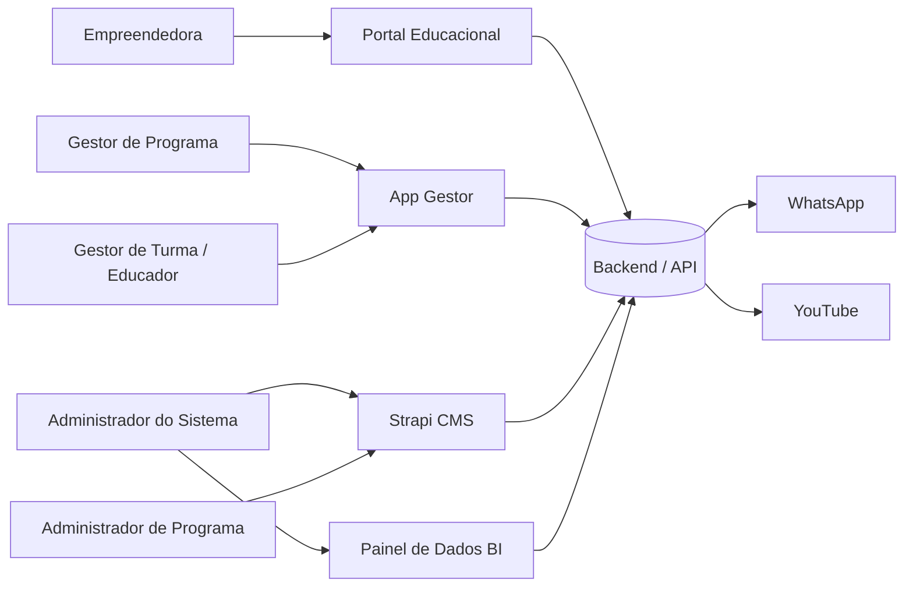

**Casos de Uso — Sistema de Gestão de Programas Sociais (Consulado da Mulher) — v2**

Documento derivado do escopo original do cliente, das reuniões de levantamento (abr./jun. 2026), do **contrato de licenciamento EWTI × Consulado da Mulher (08.05.2026)** e do modelo de referência. Versão 2 incorpora observações v2 e reuniões de 22–25/jun. 2026, alinhada à arquitetura **Strapi CMS + Portal Educacional + App Gestor + Painel de Dados (BI)**.

---

## Atores

| Ator                                       | Descrição                                                                                                                                                                                                                                                                                                                                                                                                          |
| ------------------------------------------ | ------------------------------------------------------------------------------------------------------------------------------------------------------------------------------------------------------------------------------------------------------------------------------------------------------------------------------------------------------------------------------------------------------------------ |
| **Empreendedora (Beneficiada)**            | Mulher empreendedora em situação de vulnerabilidade social; participante dos programas. Acessa o **Portal Educacional** via **WhatsApp ou e-mail** para: cadastros e inscrições, acompanhamento de módulos, consumo de conteúdos, resposta a questionários, envio de materiais/evidências e preenchimento mensal de dados financeiros (faturamento, renda, investimento, poupança, despesas e número de clientes). |
| **Administrador do Sistema (Strapi CMS)**  | Perfil **master** com controle total: usuários, programas, unidades, migrações excepcionais e configuração global.                                                                                                                                                                                                                                                                                                 |
| **Administrador de Programa (Strapi CMS)** | Usuário do Strapi com escopo restrito a um ou mais programas/edições. Gerencia conteúdos, modelagem de programas, módulos educacionais, organizações, colaboradores e unidades do seu programa.                                                                                                                                                                                                                    |
| **Gestor de Programa (App Gestor)**        | Responsável pela operação de programas/edições: seleção, turmas, premiação (critérios textuais), capital semente e indicadores.                                                                                                                                                                                                                                                                                    |
| **Gestor de Turma (App Gestor)**           | Opera turmas no **App Gestor**: alocação, acompanhamento, comunicação, presença, validação de entregas, gestão de negócios e interação com empreendedoras. Pode inserir dados em nome da empreendedora (com rastreabilidade).                                                                                                                                                                                      |
| **Educador / Assessor (App Gestor)**       | Profissional de campo no App Gestor. Valida entregas e dados financeiros, registra presença, preenche indicadores e conduz atividades — em programas presenciais, pode realizar atividades **fora da sequência** padrão.                                                                                                                                                                                           |
| **Colaborador**                            | Funcionário do Consulado cadastrado no Strapi; pode acumular papéis de gestor de programa, gestor de turma ou educador.                                                                                                                                                                                                                                                                                            |
| **Voluntário / Mentor**                    | Pessoa cadastrada (mentor ou palestrante/oficineiro) para processos de mentoria vinculados a programas.                                                                                                                                                                                                                                                                                                            |
| **Lead (Pré-inscrita)**                    | Pessoa que iniciou, mas ainda não concluiu, o processo de inscrição; objeto do mini CRM.                                                                                                                                                                                                                                                                                                                           |
| **Organização (Patrocinador / Parceiro)**  | Pessoa jurídica cadastrada no sistema (CNPJ), associável a uma edição como patrocinador ou parceiro institucional.                                                                                                                                                                                                                                                                                                 |
| **WhatsApp (Meta Business API)**           | Ator secundário para envio de mensagens, links, **vídeos** e notificações.                                                                                                                                                                                                                                                                                                                                         |
| **YouTube**                                | Ator secundário para videoaulas gravadas e **transmissões ao vivo**.                                                                                                                                                                                                                                                                                                                                               |
| **Motor de Automação**                     | Componente interno que executa gatilhos (liberação de conteúdo, lembretes, certificação automática).                                                                                                                                                                                                                                                                                                               |

### Plataformas do Sistema (Contrato)

Conforme contrato de licenciamento (mai./2026), o **Sistema Consulado da Mulher** compreende:

1. **Portal Educacional** — interface web da empreendedora (cadastros, módulos, conteúdos, questionários, uploads, dados financeiros).
2. **Strapi CMS** — gestão de usuários, conteúdos, programas, módulos, organizações e unidades.
3. **App Gestor** — gestão, acompanhamento e interação com turmas (gestores e educadores).
4. **Painel de Dados (BI)** — dashboards, indicadores de impacto e relatórios (administradores).

Stack contratual: Next.js, Node.js, Express, Prisma, MySQL; hospedagem AWS.

### Diagrama de Contexto — Frontends e Atores

### Hierarquia de Dados

**Programa → Unidade → Edição → Turma**

A **Unidade** agrupa turmas por localidade ou parceiro (ex.: Rio Claro e região, Pisada do Sertão). Colaboradores são vinculados a unidades; acesso segregado conforme LGPD.

### Base Legada (Consulta)

Dados históricos de sistemas anteriores permanecem em **base legada de consulta** — servem para verificar participação em programas passados e compor totalizadores (participantes, beneficiados, certificados, premiados), mas **não preenchem automaticamente** formulários de nova inscrição. Dados pessoais sensíveis respeitam retenção LGPD (até 5 anos após fim do programa); registros anteriores podem ser anonimizados ou mantidos apenas como contagens consolidadas.

---

## Casos de Uso

Organização do fluxo operacional:

**Pré-inscrição → Inscrição → Seleção → Aprovação e Aplicação do Programa → Conclusão (Beneficiamento, Certificação, Premiação, Mentoria)**

Com ramificações paralelas: **Cancelamento / Desistência**

### Plataformas, Acesso e Configuração (Strapi CMS)

UC1 — Cadastrar Colaborador (Strapi)

UC2 — Login Administrador (Strapi CMS)

UC3 — Login Gestor (App Gestor)

UC4 — Login da Empreendedora (WhatsApp ou E-mail)

UC5 — Gerenciar Roles e Permissões (Strapi)

UC6 — Configurar Autenticação e Segurança (2FA, expiração de senha)

UC7 — Cadastrar Programa

UC8 — Modelar Programa e Associar Módulos

UC9 — Criar e Configurar Edição de Programa

UC10 — Cadastrar Organização

UC11 — Associar Organização à Edição (Patrocinador / Parceiro)

UC12 — Configurar Regulamento e Critérios de Seleção

UC13 — Configurar Critérios de Beneficiamento e Certificação por Edição

UC14 — Configurar Critérios de Premiação por Edição (Textual)

UC15 — Criar Módulo Educacional

UC16 — Criar e Gerenciar Turma

UC17 — Alocar Empreendedora em Turma

UC18 — Transferir Empreendedora entre Turmas

### Fase 1 — Pré-inscrição

UC19 — Realizar Pré-Cadastro (Captura Inicial de Lead)

UC20 — Aceitar Termos LGPD, Comunicação, Cookies e Armazenamento Local

### Fase 2 — Inscrição

UC21 — Realizar Inscrição Completa

UC22 — Consultar Histórico Legado e Reutilizar Cadastro Recorrente

### Fase 3 — Seleção

UC23 — Validar Elegibilidade da Inscrição (Automático)

UC24 — Selecionar Participantes para o Programa

UC25 — Comunicar Resultado da Seleção

UC26 — Gerenciar Leads com Inscrição Incompleta (Mini CRM)

### Fase 4 — Aprovação e Aplicação do Programa

UC27 — Cadastrar e Atualizar Dados da Empreendedora

UC28 — Consultar Histórico de Participação

UC29 — Classificar Status da Participante

UC30 — Registrar Cancelamento ou Desistência

UC31 — Gerenciar Negócio e Associar Empreendedoras

UC32 — Mover Empreendedora entre Negócios

UC33 — Configurar Liberação Progressiva de Conteúdo

UC34 — Configurar Calendário e Atividades por Turma

UC35 — Adicionar Conteúdo Extra por Turma

UC36 — Consumir Conteúdo Educacional

UC37 — Registrar Progresso em Videoaula

UC38 — Assistir Aula ao Vivo (YouTube)

UC39 — Responder Atividade (Exercício / Questionário)

UC40 — Registrar Presença via QR Code

UC41 — Registrar Presença Manualmente (Gestor/Educador)

UC42 — Consultar Frequência da Participante

UC43 — Enviar Material ou Evidência de Atividade

UC44 — Avaliar Entrega e Fornecer Feedback

UC45 — Enviar Registro de Dados Financeiros Mensais

UC46 — Validar Dados Financeiros (Educador)

UC47 — Preencher Formulário de Indicadores (Baseline / Endline)

UC48 — Responder Pesquisa de Avaliação (NPS / Satisfação)

UC49 — Disparar Mensagem Individual via WhatsApp

UC50 — Disparar Mensagem em Grupo via WhatsApp

UC51 — Enviar Vídeo ou Conteúdo via WhatsApp

UC52 — Programar Mensagens Automáticas

UC53 — Enviar Lembrete por Atividade Não Concluída

UC54 — Enviar Link Personalizado com Autenticação Embutida

### Fase 5 — Conclusão (Beneficiamento, Certificação, Premiação, Mentoria)

UC55 — Classificar Beneficiamento e Emitir Certificado Automaticamente

UC56 — Consultar Ranking e Engajamento

UC57 — Registrar Premiação (Manual — App Gestor)

UC58 — Analisar Elegibilidade para Capital Semente

### Relatórios, BI e Dados Legados

UC59 — Consultar Dashboard de Impacto (Painel de Dados)

UC60 — Gerar Relatórios Quantitativos

UC61 — Gerar Relatórios Qualitativos

UC62 — Consultar Base Legada de Participação

### Funcionalidades Complementares (Contrato / Evolução)

UC63 — Consultar e Solicitar Certificado (Autoatendimento)

UC64 — Utilizar Chat de Dúvidas (IA)

UC65 — Consultar Consumo de Mensagens WhatsApp

UC66 — Cadastrar Unidade

UC67 — Resgatar Pré-inscrição (Slug e localStorage)

UC68 — Visualizar Calendário de Atividades (Portal Educacional)

UC69 — Inserir Dados em Nome da Empreendedora (Gestor/Educador)

UC70 — Registrar Mentoria

UC71 — Consolidar Totalizadores com Dados Pregressos

UC72 — Exibir Alerta de Compatibilidade de Navegador

UC73 — Cadastrar Voluntário ou Mentor

UC74 — Ativar ou Inativar Colaborador/Parceiro

UC75 — Migrar Colaborador entre Unidades (Administrador)

---

## Detalhamento dos Casos de Uso

### UC1 – Cadastrar Colaborador (Strapi)

**Descrição**

Permite que o **Administrador do Sistema** ou **Administrador de Programa** cadastre **colaboradores** (funcionários do Consulado) utilizando o **sistema nativo de usuários do Strapi**, atribuindo perfil (Administrador de Programa, Gestor de Programa, Gestor de Turma, Educador) e vinculando a programas, unidades e turmas.

**Atores**

- **Administrador do Sistema (Strapi CMS)**: cadastro global e migrações excepcionais.
- **Administrador de Programa (Strapi CMS)**: cadastro restrito ao escopo do seu programa.
- **Colaborador**: usuário cadastrado que pode acumular papéis operacionais.

**Pré-condições**

- Administrador autenticado no Strapi CMS.
- Roles configuradas no Strapi (UC5).

**Fluxo Principal**

- O **Administrador** acessa **Configurações → Painel de Administração → Usuários** no Strapi.
- Seleciona **Convidar usuário** ou **Criar novo usuário**.
- Informa nome, e-mail, perfil (Administrador de Programa, Gestor de Programa, Gestor de Turma ou Educador), status ativo/inativo (UC74) e unidade(s) vinculada(s) (UC66).
- Associa programas, edições e turmas permitidos conforme LGPD.
- O Strapi envia e-mail de convite para definição de senha.
- O colaborador define senha e passa a acessar Strapi CMS e/ou App Gestor (UC3) conforme perfil.

**Fluxos Alternativos**

- **E-mail já cadastrado**: Strapi informa duplicidade.
- **Convite pendente**: administrador reenvia convite pelo painel Strapi.

**Pós-condições**

- Colaborador cadastrado no Strapi, apto a operar App Gestor conforme perfil.

**Exceções**

- **EC1**: Falha no envio de e-mail — reenvio manual pelo Strapi.

---

### UC2 – Login Administrador (Strapi CMS)

**Descrição**

Acesso ao backoffice **Strapi CMS** para modelagem de programas, módulos, organizações, conteúdos e gestão de usuários.

**Atores**

- **Administrador (Strapi CMS)**.

**Pré-condições**

- Conta Strapi ativa com role Administrador.
- Navegador compatível; conexão à internet.

**Fluxo Principal**

- Usuário acessa URL do Strapi Admin (`/admin`).
- Informa e-mail e senha na tela nativa de login.
- Se 2FA habilitado (UC6), informa código de verificação.
- Strapi valida credenciais e abre painel administrativo.

**Fluxos Alternativos**

- **Credenciais inválidas**: mensagem nativa do Strapi; retry ou recuperação de senha.
- **Senha expirada**: troca obrigatória (UC6).

**Pós-condições**

- Sessão autenticada no Strapi CMS.

**Exceções**

- **EC1**: Strapi indisponível — tentar mais tarde.

---

### UC3 – Login Gestor (App Gestor)

**Descrição**

Acesso ao **App Gestor** para operação de turmas: acompanhamento, comunicação, presença, validação e interação com empreendedoras.

**Atores**

- **Gestor de Turma**, **Educador / Assessor**.

**Pré-condições**

- Colaborador cadastrado no Strapi (UC1) com perfil Gestor ou Educador.

**Fluxo Principal**

- Gestor acessa URL do App Gestor.
- Informa e-mail e senha (conta vinculada ao Strapi).
- Se 2FA habilitado, informa código.
- Sistema valida credenciais e role.
- Abre painel com turmas e programas associados.

**Fluxos Alternativos**

- **Sem turmas associadas**: exibe mensagem orientando contato com administrador.

**Pós-condições**

- Gestor autenticado no App Gestor.

**Exceções**

- **EC1**: Servidor indisponível.

---

### UC4 – Login da Empreendedora (WhatsApp ou E-mail)

**Descrição**

Permite que a **Empreendedora** acesse o **Portal Educacional** por **WhatsApp** (link/token no telefone) ou por **e-mail e senha**. O **CPF** é a chave primária de identificação; a sessão permanece ativa por até **30 dias** no dispositivo.

**Atores**

- **Empreendedora (Beneficiada)**.
- **WhatsApp (Meta Business API)** — ator secundário.

**Pré-condições**

- Cadastro ou link vinculado ao telefone e/ou e-mail.

**Fluxo Principal**

- **Via WhatsApp**: recebe link personalizado via Portal Educacional; sistema identifica telefone; cria sessão e abre painel.
- **Via E-mail**: acessa URL do Portal Educacional; informa e-mail e senha; sistema valida e abre painel.
- Sistema exibe alerta de compatibilidade de navegador quando necessário (UC72).

**Fluxos Alternativos**

- **Não cadastrada**: direciona a UC19 ou UC21.
- **Link expirado**: novo envio via WhatsApp ou recuperação por e-mail.
- **Primeiro acesso pós-cadastro manual**: solicita aceites pendentes (UC20).

**Pós-condições**

- Empreendedora autenticada na Portal Educacional.

**Exceções**

- **EC1**: Falha API WhatsApp — fallback por e-mail quando disponível.

---

### UC5 – Gerenciar Roles e Permissões (Strapi)

**Descrição**

Configura roles nativas do **Strapi** e permissões por entidade, em conformidade com LGPD.

**Atores**

- **Administrador (Strapi CMS)**.

**Pré-condições**

- Administrador autenticado no Strapi.

**Fluxo Principal**

- Acessa **Configurações → Painel de Administração → Funções (Roles)**.
- Edita permissões CRUD por entidade para cada role.
- Restringe escopo (programas/edições/turmas).
- Salva configuração.

**Pós-condições**

- Roles alinhadas às funções operacionais do Consulado.

---

### UC6 – Configurar Autenticação e Segurança

**Descrição**

Configura 2FA, expiração e complexidade de senhas, conforme contrato (cl. 6.2) e Anexo I.

**Atores**

- **Administrador (Strapi CMS)**.

**Pré-condições**

- Permissão de configuração global.

**Fluxo Principal**

- Define política de expiração, complexidade, histórico de senhas e 2FA.
- Sistema aplica em próximos logins (Strapi e App Gestor).

**Pós-condições**

- Políticas de segurança ativas.

---

### UC7 – Cadastrar Programa

**Descrição**

Cadastra um programa social no Strapi, com slug, URL direta, duração e formato (**online sequencial** ou **presencial**).

**Atores**

- **Administrador (Strapi CMS)**.

**Pré-condições**

- Autenticado no Strapi com permissão de gestão de programas.

**Fluxo Principal**

- Acessa **Programas → Criar**.
- Informa nome, slug, descrição, duração, formato (online sequencial / presencial / híbrido).
- Define pilares: educação empreendedora, mentoria, capital semente.
- Salva programa.

**Pós-condições**

- Programa disponível para associação de módulos (UC8) e edições (UC9).

**Exceções**

- **EC1**: Slug duplicado — solicita alteração.

---

### UC8 – Modelar Programa e Associar Módulos

**Descrição**

Uma **programa** é um conjunto de **módulos**. Associa módulos ao programa e define ordem sugerida. Em programas **presenciais**, o educador/assessor determina qual atividade será realizada, podendo conduzir **fora da sequência** definida.

**Atores**

- **Administrador (Strapi CMS)**.

**Pré-condições**

- Programa cadastrado (UC7); módulos criados (UC15).

**Fluxo Principal**

- Seleciona programa → **Módulos associados**.
- Adiciona módulos na ordem sugerida.
- Define formato: online sequencial (liberação progressiva) ou presencial (flexível pelo educador).
- Salva modelagem.

**Pós-condições**

- Estrutura educacional do programa definida.

---

### UC9 – Criar e Configurar Edição de Programa

**Descrição**

Cria edição (ex.: 2026.1) com ano de referência, regulamento, vagas e período de inscrição. Apenas **uma edição aberta para inscrição** por vez.

**Atores**

- **Administrador (Strapi CMS)**, **Gestor de Turma** (consulta).

**Pré-condições**

- Programa modelado (UC8); regulamento aprovado pelo jurídico.

**Fluxo Principal**

- Cria nova edição vinculada ao programa.
- Informa identificador, datas de inscrição, vagas, status.
- Anexa regulamento da edição.
- Valida unicidade de edição aberta.
- Publica URL de inscrição direta.

**Pós-condições**

- Edição apta às fases de inscrição e seleção.

---

### UC10 – Cadastrar Organização

**Descrição**

Cadastra **organização** (pessoa jurídica): patrocinadores, parceiros institucionais, unidades executoras.

**Atores**

- **Administrador (Strapi CMS)**.

**Pré-condições**

- Permissão de cadastro institucional.

**Fluxo Principal**

- Acessa **Organizações → Criar**.
- Informa razão social, CNPJ, tipo, localização e responsável.
- Registra papel no tratamento de dados (controlador/operador) quando aplicável.
- Salva organização.

**Pós-condições**

- Organização disponível para associação a edições (UC11).

---

### UC11 – Associar Organização à Edição (Patrocinador / Parceiro)

**Descrição**

Vincula organização a uma **edição** como **patrocinador** ou **parceiro** executor.

**Atores**

- **Administrador (Strapi CMS)**.

**Pré-condições**

- Organização (UC10) e edição (UC9) existentes.

**Fluxo Principal**

- Seleciona edição → **Organizações vinculadas**.
- Adiciona organização e define papel (patrocinador / parceiro executor).
- Salva vínculo.

**Pós-condições**

- Organização associada à edição com papel definido.

---

### UC12 – Configurar Regulamento e Critérios de Seleção

**Descrição**

Define critérios automáticos e manuais de elegibilidade (idade, renda, região, tempo de empreendimento, carência de premiação).

**Atores**

- **Administrador (Strapi CMS)**, **Gestor de Turma**.

**Pré-condições**

- Edição criada (UC9).

**Fluxo Principal**

- Configura travas automáticas e critérios de desempate.
- Indica restrições geográficas (rígidas ou flexíveis).
- Persiste regras para UC23 e UC24.

**Fluxos Alternativos**

- **Flexibilidade operacional**: critério como "alerta" em vez de bloqueio.

**Pós-condições**

- Critérios disponíveis para validação e seleção.

---

### UC13 – Configurar Critérios de Beneficiamento e Certificação por Edição

**Descrição**

Parametriza percentuais: beneficiada (ex.: 50%), certificada (ex.: 75%), conclusão integral (100%).

**Atores**

- **Administrador (Strapi CMS)**, **Gestor de Turma**.

**Pré-condições**

- Edição ativa com programação definida.

**Fluxo Principal**

- Define percentuais e tipos de atividade que contam.
- Define aplicação automática vs. validação manual de exceções.
- Sistema usa regras em UC29 e UC55.

**Pós-condições**

- Regras de beneficiamento e certificação parametrizadas.

---

### UC14 – Configurar Critérios de Premiação por Edição (Textual)

**Descrição**

Define critérios **textuais** de elegibilidade a **premiação** para orientar a decisão do gestor. Não há controle ou ranking automático de premiação — a contemplação é registrada **manualmente** no **App Gestor** (UC57), com base nos critérios descritos e no histórico da participante.

**Atores**

- **Administrador (Strapi CMS)**, **Gestor de Programa**.

**Pré-condições**

- Edição configurada; regulamento de premiação aprovado.

**Fluxo Principal**

- Acessa edição → **Critérios de Premiação**.
- Redige critérios textuais (ex.: engajamento mínimo, entregas no prazo, carência de 3 anos, top N, desempate).
- Publica critérios para consulta do gestor no App Gestor durante UC57.

**Pós-condições**

- Critérios textuais de premiação disponíveis para decisão manual.

---

### UC15 – Criar Módulo Educacional

**Descrição**

Cria **módulo** de **tipo temático único**, composto por atividades. Tipos: empreendedorismo, finanças, precificação, marketing, gestão de pessoas, formalização de empresas, sustentabilidade.

**Atores**

- **Administrador (Strapi CMS)**.

**Pré-condições**

- Autenticado no Strapi.

**Fluxo Principal**

- Acessa **Módulos → Criar**.
- Seleciona **tipo temático** (único por módulo).
- Adiciona atividades: videoaula (YouTube), PDF, presencial, aula ao vivo (YouTube), questionário, entrega, QR presencial.
- Configura feedback/pontuação quando aplicável.
- Salva módulo reutilizável.

**Pós-condições**

- Módulo disponível para associação a programas (UC8).

---

### UC16 – Criar e Gerenciar Turma

**Descrição**

Cria turmas vinculadas a **edição** e **unidade** (UC66): gestor responsável, vagas, calendário local.

**Atores**

- **Gestor de Turma (App Gestor)**, **Administrador (Strapi CMS)**.

**Pré-condições**

- Edição configurada; programação associada.

**Fluxo Principal**

- Cria turma com nome, região, gestor, vagas, datas.
- Associa participantes após seleção (UC17).

**Pós-condições**

- Turma pronta para aplicação do programa (Fase 4).

---

### UC17 – Alocar Empreendedora em Turma

**Descrição**

Aloca manualmente participantes **selecionadas** em turmas, sem exigir escolha de turma na inscrição.

**Atores**

- **Gestor de Turma (App Gestor)**.

**Pré-condições**

- Status "selecionada" (UC24); turma com vagas.

**Fluxo Principal**

- Filtra selecionadas por região/perfil.
- Aloca em turma e confirma.
- Sistema dispara boas-vindas (UC49).

**Pós-condições**

- Participante vinculada à turma.

---

### UC18 – Transferir Empreendedora entre Turmas

**Descrição**

Move participante entre turmas da mesma edição, preservando histórico.

**Atores**

- **Gestor de Turma (App Gestor)**.

**Pré-condições**

- Participante ativa; turmas compatíveis.

**Fluxo Principal**

- Seleciona participante → **Transferir turma**.
- Escolhe destino e registra motivo.
- Notifica gestores envolvidos.

**Pós-condições**

- Vínculo atualizado; histórico preservado.

---

### UC19 – Realizar Pré-Cadastro (Captura Inicial de Lead)

**Descrição**

Primeira etapa (mini CRM): captura nome, telefone, e-mail, aceite LGPD e **checkbox de aprovação de comunicação** antes do formulário completo. O sistema registra o slug do programa/edição e grava no **localStorage** do dispositivo que a pré-inscrição foi realizada (UC67).

**Atores**

- **Lead (Pré-inscrita)**.

**Pré-condições**

- Edição com inscrições abertas; URL acessível (slug do programa/edição).

**Fluxo Principal**

- Acessa link da edição/programa (slug).
- Visualiza indicador de progresso (etapa 1 de N).
- Aceita termo LGPD (obrigatório) e aceites de cookies/armazenamento local (UC20).
- Marca **checkbox de autorização para comunicação**.
- Informa nome, telefone e e-mail.
- Sistema registra lead "pré-cadastro concluído" e persiste identificador no **localStorage** do navegador.
- Direciona para inscrição completa (UC21).

**Fluxos Alternativos**

- **Retorno pelo mesmo slug (UC67)**: se localStorage ou sessão indicar pré-inscrição concluída, direciona diretamente à inscrição (UC21), sem repetir pré-cadastro.
- **LGPD não aceito**: bloqueia continuidade.
- **Comunicação não autorizada**: permite inscrição, mas impede reativação pelo mini CRM (UC26).
- **Abandono**: lead disponível em UC26 se comunicação autorizada.

**Pós-condições**

- Lead capturado conforme consentimentos registrados; dispositivo marcado para retomada.

---

### UC20 – Aceitar Termos LGPD, Comunicação, Cookies e Armazenamento Local

**Descrição**

Registra aceites: LGPD (global), autorização de comunicação, regulamento da edição (uso de imagem), **política de cookies** e consentimento para **armazenamento local** (localStorage) no dispositivo do usuário.

**Atores**

- **Empreendedora**, **Lead**, **Gestor** (cadastro manual).

**Pré-condições**

- Fluxo de inscrição ou cadastro manual no Portal Educacional.

**Fluxo Principal**

- Apresenta termos integrados ao fluxo, incluindo uso de cookies e localStorage para retomada de pré-inscrição/inscrição.
- Registra aceites com data/hora, versão do termo e dispositivo.

**Fluxos Alternativos**

- **Cadastro manual**: envia link de aceite via WhatsApp.
- **Cookies/localStorage recusados**: permite fluxo mínimo, mas sem retomada automática via dispositivo (UC67).

**Pós-condições**

- Aceites registrados conforme LGPD e política de privacidade.

---

### UC21 – Realizar Inscrição Completa

**Descrição**

Conclui inscrição **via Portal Educacional** em etapas (dados pessoais → financeiros → específicos do programa) com indicador visual de progresso. Valida **CEP** para elegibilidade geográfica; **CNPJ/MEI** obrigatório quando exigido pelo programa (ex.: BNDES).

**Atores**

- **Empreendedora**, **Lead**.

**Pré-condições**

- Pré-cadastro (UC19); aceites (UC20).

**Fluxo Principal**

- Acessa formulário **via Portal Educacional** com barra de progresso.
- Valida CPF (chave primária), endereço (CEP), perfil socioeconômico.
- Sistema exibe **consulta somente leitura** de participação em programas passados (UC62), sem pré-preencher cadastro.
- Aceite do regulamento da edição.
- Registra inscrição "finalizada — aguardando seleção".
- Oferece recompensa única (e-book), independente de seleção.

**Fluxos Alternativos**

- **Recorrente (UC22)**: pré-preenche dados já validados e solicita atualização dos demais campos.
- **Programa Pílulas**: fluxo simplificado com aprovação imediata quando configurado na edição.
- **Incompleta**: retomada via link ou localStorage (UC67); UC26.

**Pós-condições**

- Inscrição elegível a UC23/UC24.

**Exceções**

- **EC1**: Edição encerrada durante preenchimento.

---

### UC22 – Consultar Histórico Legado e Reutilizar Cadastro Recorrente

**Descrição**

Participante já cadastrada valida/atualiza dados ao se inscrever novamente. O sistema consulta a **base legada** (UC62) e o histórico unificado para **exibir** participação em programas passados, mas **não pré-preenche** automaticamente o formulário de nova inscrição com dados legados.

**Atores**

- **Empreendedora**.

**Pré-condições**

- CPF/telefone na base unificada ou legada.

**Fluxo Principal**

- Sistema identifica recorrência pelo CPF.
- Exibe alerta informativo de programas anteriores (somente leitura).
- Pré-preenche apenas dados já validados na base ativa do sistema.
- Solicita confirmação/atualização dos demais campos.
- Registra nova inscrição vinculada ao histórico (UC28).

**Pós-condições**

- Cadastro atualizado na base ativa; histórico preservado; dados legados não importados automaticamente.

---

### UC23 – Validar Elegibilidade da Inscrição (Automático)

**Descrição**

Aplica critérios de UC12 sobre inscrições finalizadas.

**Atores**

- **Motor de Automação**; **Gestor** (consulta).

**Pré-condições**

- Inscrição finalizada (UC21); critérios configurados.

**Fluxo Principal**

- Valida CPF, duplicidade, renda, região, recorrência.
- Classifica: elegível, elegível com alerta ou inelegível.

**Pós-condições**

- Inscrições classificadas para seleção.

---

### UC24 – Selecionar Participantes para o Programa

**Descrição**

Seleção manual assistida por filtros automáticos, histórico e entrevistas.

**Atores**

- **Gestor de Turma (App Gestor)**.

**Pré-condições**

- Inscrições validadas (UC23).

**Fluxo Principal**

- Painel com totais, filtros e critérios de vulnerabilidade.
- Seleciona dentro do limite de vagas/orçamento.
- Confirma aprovadas/reprovadas para UC25.

**Fluxos Alternativos**

- **Volume superior à meta**: seleciona número maior que vagas finais (ex.: 50–60 para meta de 40).

**Pós-condições**

- Lista de selecionadas definida.

---

### UC25 – Comunicar Resultado da Seleção

**Descrição**

Comunica aprovação, reprovação ou lista de espera via WhatsApp.

**Atores**

- **Gestor de Turma**, **WhatsApp**.

**Pré-condições**

- Seleção concluída (UC24).

**Fluxo Principal**

- Dispara templates aprovados (individual ou lote).
- Registra histórico de comunicação.

**Pós-condições**

- Participantes informadas.

**Exceções**

- **EC1**: Falha no envio — retry ou envio manual.

---

### UC26 – Gerenciar Leads com Inscrição Incompleta (Mini CRM)

**Descrição**

Visualiza e reativa leads que **autorizaram comunicação** e abandonaram inscrição.

**Atores**

- **Gestor de Turma (App Gestor)**.

**Pré-condições**

- Aceite de comunicação (UC19); inscrição incompleta.

**Fluxo Principal**

- Filtra por programa, edição, etapa de abandono.
- Dispara retomada com link personalizado.
- Registra conversões.

**Pós-condições**

- Leads reengajados; taxa de conversão mensurável.

---

### UC27 – Cadastrar e Atualizar Dados da Empreendedora

**Descrição**

Autoatualização pela empreendedora **via Portal Educacional** ou cadastro/edição pelo gestor/educador no App Gestor. O **CPF**, uma vez validado, **não pode ser alterado** pela empreendedora. O **gestor** pode alterar apenas dados de acesso: **e-mail** e **DDD + telefone**. A empreendedora pode corrigir todos os demais dados cadastrais, exceto o CPF validado.

**Atores**

- **Empreendedora**, **Gestor**, **Educador**.

**Pré-condições**

- Vinculada a programa/turma.

**Fluxo Principal**

- **Empreendedora**: edita dados cadastrais via Portal Educacional, exceto CPF validado.
- **Gestor/Educador**: edita e-mail e telefone no App Gestor; demais campos sensíveis exigem justificativa e log de auditoria.
- Validação de e-mail e telefone; registro de alterações.

**Fluxos Alternativos**

- **Inserção em nome da empreendedora (UC69)**: gestor/educador registra dados quando a participante não consegue acessar o portal.

**Pós-condições**

- Dados atualizados conforme permissões de cada ator.

---

### UC28 – Consultar Histórico de Participação

**Descrição**

Linha do tempo de programas, edições, status, certificações e indicadores.

**Atores**

- **Gestor**, **Educador**, **Administrador**, **Empreendedora** (visão própria).

**Pré-condições**

- Cadastro na base unificada.

**Fluxo Principal**

- Busca por CPF/nome/telefone.
- Exibe histórico consolidado da base ativa e consulta legada (UC62).

**Pós-condições**

- Visão para seleção, mentoria e BI.

---

### UC29 – Classificar Status da Participante

**Descrição**

Status: pré-inscrita, inscrita, selecionada, em assessoria, beneficiada, certificada, contemplada, emancipada, descontinuada/desistente.

**Atores**

- **Motor de Automação**, **Gestor**.

**Pré-condições**

- Participante vinculada a edição/turma; critérios UC13.

**Fluxo Principal**

- Cálculo automático conforme frequência e entregas.
- Gestor ajusta exceções manualmente.

**Pós-condições**

- Status refletido em relatórios.

---

### UC30 – Registrar Cancelamento ou Desistência

**Descrição**

Registra **cancelamento** (pela participante ou gestão) ou **desistência** com motivo padronizado para indicadores qualitativos. Atualiza status para descontinuada/desistente (UC29) e interrompe liberações e lembretes automáticos.

**Atores**

- **Empreendedora** (via Portal Educacional, quando habilitado), **Gestor**, **Educador**.

**Pré-condições**

- Interrupção de participação identificada ou solicitação da participante.

**Fluxo Principal**

- Seleciona tipo (cancelamento/desistência), motivo padronizado e observações.
- Registra data e elegibilidade remanescente (ex.: manter como beneficiada parcial).
- Sistema atualiza status e notifica gestor da turma.

**Pós-condições**

- Cancelamento/desistência categorizada; fluxo operacional encerrado para a participante.

---

### UC31 – Gerenciar Negócio e Associar Empreendedoras

**Descrição**

Cadastra **negócio** (individual ou coletivo) e **associa empreendedoras**. O gestor pode vincular uma empreendedora a um negócio existente ou **adicionar empreendedora a um negócio** já cadastrado. Cada pessoa permanece contabilizada individualmente nos relatórios.

**Atores**

- **Gestor de Turma (App Gestor)**, **Educador**.

**Pré-condições**

- Empreendedoras vinculadas à turma/edição.

**Fluxo Principal**

- Cria negócio (nome, CNPJ opcional, segmento) ou localiza existente.
- **Associa** uma ou mais empreendedoras ao negócio.
- **Adiciona** nova empreendedora a negócio coletivo existente.

**Pós-condições**

- Negócio e vínculos registrados.

---

### UC32 – Mover Empreendedora entre Negócios

**Descrição**

Permite ao **Gestor de Programa** transferir empreendedora de um negócio para outro, preservando histórico individual.

**Atores**

- **Gestor de Turma (App Gestor)**.

**Pré-condições**

- Empreendedora associada a negócio de origem.

**Fluxo Principal**

- Localiza participante → **Mover negócio**.
- Seleciona negócio destino ou cria novo.
- Registra motivo e data.

**Pós-condições**

- Vínculo atualizado; rastreabilidade mantida.

---

### UC33 – Configurar Liberação Progressiva de Conteúdo

**Descrição**

Desbloqueio de atividades conforme cronograma (online) ou condução pelo educador (presencial).

**Atores**

- **Gestor**, **Motor de Automação**.

**Pré-condições**

- Programa e turma configurados.

**Fluxo Principal**

- **Online**: cadência (ex.: 3 envios/semana), gatilhos por data/conclusão.
- **Presencial**: educador libera ou conduz atividade no App Gestor, inclusive fora da sequência.

**Pós-condições**

- Conteúdo disponível conforme formato do programa.

---

### UC34 – Configurar Calendário e Atividades por Turma

**Descrição**

Define datas de encontros presenciais, **aulas ao vivo via YouTube** e prazos de entrega por turma. O calendário é exibido de forma **visual** no App Gestor e no Portal Educacional (UC68).

**Atores**

- **Gestor**, **Educador (App Gestor)**.

**Pré-condições**

- Turma criada (UC16); módulos definidos.

**Fluxo Principal**

- Define calendário local por turma.
- URLs de aula ao vivo (YouTube) individualizadas por turma quando necessário.

**Pós-condições**

- Cronograma regional configurado.

---

### UC35 – Adicionar Conteúdo Extra por Turma

**Descrição**

Oficinas extras regionais sem alterar programação global; não afetam progresso obrigatório.

**Atores**

- **Gestor**, **Educador**.

**Pré-condições**

- Turma ativa.

**Fluxo Principal**

- Adiciona atividade "extra/facultativa" no calendário da turma.
- Notifica participantes sem impactar certificação.

**Pós-condições**

- Conteúdo facultativo disponível à turma.

---

### UC36 – Consumir Conteúdo Educacional

**Descrição**

Acesso a videoaulas (YouTube), PDFs e guias **via Portal Educacional** — link WhatsApp ou login e-mail (UC4). O **engajamento** é medido pela **conclusão da atividade**, não apenas pela visualização do vídeo.

**Atores**

- **Empreendedora**, **YouTube**.

**Pré-condições**

- Autenticada no Portal Educacional (UC4); conteúdo liberado (UC33).

**Fluxo Principal**

- Visualiza programa/módulos com progresso no Portal Educacional.
- Consome conteúdo liberado; registra UC37/UC39.
- Visualiza calendário de atividades da turma (UC68).

**Pós-condições**

- Consumo e progresso registrados.

---

### UC37 – Registrar Progresso em Videoaula

**Descrição**

Rastreia % assistido para marcos e certificação (meta configurável, ex.: 70%).

**Atores**

- **Empreendedora**, **YouTube**.

**Pré-condições**

- Videoaula liberada e acessada.

**Fluxo Principal**

- Sistema registra percentual visualizado.
- Ao atingir meta, marca atividade concluída.
- Se online sequencial, desbloqueia próxima etapa.

**Pós-condições**

- Progresso atualizado.

---

### UC38 – Assistir Aula ao Vivo (YouTube)

**Descrição**

Participação em transmissão ao vivo via **YouTube**. Link enviado por WhatsApp ou **Portal Educacional**.

**Atores**

- **Empreendedora**, **YouTube**, **Gestor**.

**Pré-condições**

- Live configurada no calendário (UC34).

**Fluxo Principal**

- Recebe link da live.
- Acessa transmissão YouTube.
- Sistema registra participação quando integração disponível; alternativa: UC41.

**Pós-condições**

- Participação em live registrada.

---

### UC39 – Responder Atividade (Exercício / Questionário)

**Descrição**

Questões múltipla escolha ou abertas **via Portal Educacional**; **feedback explicativo** imediato após cada resposta (sem exibição de nota numérica ao participante). Pontuação interna opcional para apoio à decisão do gestor (UC56).

**Atores**

- **Empreendedora**.

**Pré-condições**

- Atividade liberada; autenticada no Portal Educacional (UC4).

**Fluxo Principal**

- Responde questões e confirma envio no Portal Educacional.
- Sistema exibe feedback educativo explicando acertos/erros.
- Marca atividade como concluída para fins de engajamento e certificação.

**Fluxos Alternativos**

- **Resposta incompleta**: solicita conclusão.

**Pós-condições**

- Atividade registrada como concluída.

---

### UC40 – Registrar Presença via QR Code

**Descrição**

Presença em encontros presenciais via QR vinculado ao evento/turma.

**Atores**

- **Empreendedora**, **Educador**.

**Pré-condições**

- Encontro configurado (UC34); empreendedora autenticada (UC4).

**Fluxo Principal**

- Educador exibe QR code.
- Empreendedora escaneia; sistema registra presença com data/hora.

**Fluxos Alternativos**

- **Sem celular/conectividade**: UC41.

**Pós-condições**

- Presença contabilizada (UC42).

---

### UC41 – Registrar Presença Manualmente

**Descrição**

Registro por CPF/nome quando QR inviável.

**Atores**

- **Educador**, **Gestor (App Gestor)**.

**Pré-condições**

- Encontro ativo.

**Fluxo Principal**

- Busca participante por CPF/nome.
- Confirma presença; registra origem "manual".

**Pós-condições**

- Frequência atualizada.

---

### UC42 – Consultar Frequência da Participante

**Descrição**

Percentual de participação vs. metas da edição (50%, 75%, 100%).

**Atores**

- **Gestor**, **Educador**, **Empreendedora**.

**Pré-condições**

- Registros de presença e atividades existentes.

**Fluxo Principal**

- Exibe frequência global e por módulo/atividade.

**Pós-condições**

- Informação para certificação e status.

---

### UC43 – Enviar Material ou Evidência de Atividade

**Descrição**

Upload de arquivos/fotos como entrega de tarefas **via Portal Educacional**. Suporta modelo híbrido: valores numéricos com justificativa textual e anexo de documentos comprobatórios.

**Atores**

- **Empreendedora**.

**Pré-condições**

- Atividade de entrega liberada; autenticada no Portal Educacional (UC4).

**Fluxo Principal**

- Acessa atividade no Portal Educacional.
- Faz upload de arquivo/foto ou preenche campos textuais/numéricos; confirma envio.
- Status "aguardando avaliação" (UC44).

**Fluxos Alternativos**

- **Gestor insere em nome da participante (UC69)**: quando não há acesso ao portal.

**Pós-condições**

- Entrega disponível para UC44.

---

### UC44 – Avaliar Entrega e Fornecer Feedback

**Descrição**

Aprovar, rejeitar ou solicitar correção com comentários no App Gestor.

**Atores**

- **Educador**, **Gestor**.

**Pré-condições**

- Entrega registrada (UC43).

**Fluxo Principal**

- Analisa material; registra parecer e feedback.
- Notifica empreendedora via WhatsApp ou Portal Educacional.

**Pós-condições**

- Status da entrega atualizado; histórico preservado.

---

### UC45 – Enviar Registro de Dados Financeiros Mensais

**Descrição**

Registro **mensal** durante todo o programa para acompanhar a evolução das empreendedoras: **faturamento**, **renda**, **investimento**, **poupança**, **despesas** e **número de clientes** — autoatendimento **via Portal Educacional** com validação lógica. Cada lançamento registra data de competência e data de lançamento.

**Atores**

- **Empreendedora**, **Educador** (assistido ou via UC69).

**Pré-condições**

- Fase de coleta financeira ativa; participante vinculada à turma.

**Fluxo Principal**

- Acessa formulário mensal no Portal Educacional ou via link WhatsApp (UC54).
- Preenche valores do mês de referência; anexa documentos quando exigido.
- Sistema valida consistência (ex.: renda ≤ faturamento).
- Status "aguardando validação" (UC46).

**Fluxos Alternativos**

- **Dados inconsistentes**: alerta e solicita correção.
- **Mês sem movimento**: permite registro zerado com justificativa.

**Pós-condições**

- Dados mensais registrados para evolução e BI.

---

### UC46 – Validar Dados Financeiros

**Descrição**

Educador aprova ou devolve dados financeiros informados.

**Atores**

- **Educador**, **Gestor**.

**Pré-condições**

- Dados enviados (UC45).

**Fluxo Principal**

- Analisa valores e comparativo mensal.
- Aprova ou devolve com observações.

**Pós-condições**

- Dados validados incorporados aos indicadores.

---

### UC47 – Preencher Formulário de Indicadores (Baseline / Endline)

**Descrição**

Indicadores qualitativos/quantitativos em momentos configuráveis (início, meio, fim).

**Atores**

- **Empreendedora**, **Educador**, **Gestor**.

**Pré-condições**

- Formulário configurado; período ativo.

**Fluxo Principal**

- Preenche questionário padronizado.
- Sistema associa ao momento (baseline/endline).

**Pós-condições**

- Indicadores para UC61.

---

### UC48 – Responder Pesquisa de Avaliação (NPS / Satisfação)

**Descrição**

Avaliação de curso, aulas e oficinas (escala 0–5 ou NPS).

**Atores**

- **Empreendedora**.

**Pré-condições**

- Pesquisa liberada.

**Fluxo Principal**

- Responde via link; sistema consolida por turma/edição.

**Pós-condições**

- Dados de satisfação disponíveis.

---

### UC49 – Disparar Mensagem Individual via WhatsApp

**Descrição**

Mensagem personalizada (texto, link, material).

**Atores**

- **Gestor**, **Educador**, **Motor de Automação**, **WhatsApp**.

**Pré-condições**

- Template aprovado Meta; consentimento quando exigido.

**Fluxo Principal**

- Monta mensagem com link personalizado (UC54).
- Envia via API; registra status.

**Exceções**

- **EC1**: Falha Meta API — retry.

---

### UC50 – Disparar Mensagem em Grupo via WhatsApp

**Descrição**

Comunicação à turma; grupos WhatsApp para interação humana; disparos via API.

**Atores**

- **Gestor**, **WhatsApp**.

**Pré-condições**

- Turma definida; templates configurados.

**Fluxo Principal**

- Seleciona turma e mensagem; envia disparos.
- Registra histórico.

**Pós-condições**

- Turma comunicada; propriedade do grupo institucional.

---

### UC51 – Enviar Vídeo ou Conteúdo via WhatsApp

**Descrição**

Envio de **vídeos** e materiais diretamente via WhatsApp (dentro dos limites Meta), complementando links para YouTube/painel.

**Atores**

- **Gestor**, **Motor de Automação**, **WhatsApp**.

**Pré-condições**

- Mídia/template aprovados; opt-in quando exigido.

**Fluxo Principal**

- Seleciona participante/turma e mídia (vídeo, imagem, PDF).
- Envia via API WhatsApp.
- Registra entrega e status.

**Pós-condições**

- Conteúdo entregue por WhatsApp; histórico registrado.

---

### UC52 – Programar Mensagens Automáticas

**Descrição**

Agenda lembretes, prazos e aberturas futuras.

**Atores**

- **Gestor**, **Motor de Automação**.

**Pré-condições**

- Edição/turma configurada; templates aprovados.

**Fluxo Principal**

- Define público, template, data/hora e gatilho.
- Motor executa envio (UC49/UC50).

**Pós-condições**

- Mensagens na fila de automação.

---

### UC53 – Enviar Lembrete por Atividade Não Concluída

**Descrição**

Lembrete automático (ex.: 48h) por atividade pendente.

**Atores**

- **Motor de Automação**, **WhatsApp**.

**Pré-condições**

- Gatilho configurado; atividade pendente.

**Fluxo Principal**

- Após prazo, envia lembrete com link à atividade.
- Limita reenvios para evitar spam.

**Pós-condições**

- Tentativa de reengajamento registrada.

---

### UC54 – Enviar Link Personalizado com Autenticação Embutida

**Descrição**

URLs com token para autenticação frictionless (UC4).

**Atores**

- **Motor de Automação**, **Empreendedora**.

**Pré-condições**

- Participante identificada.

**Fluxo Principal**

- Gera link único com token.
- Registra clique e destino.

**Pós-condições**

- Acesso sem login adicional.

---

### UC55 – Classificar Beneficiamento e Emitir Certificado Automaticamente

**Descrição**

Classifica participante como **beneficiada** conforme critérios de UC13 e, ao atingir percentual de certificação, gera e envia certificado via WhatsApp. Integra a **Fase 5 — Conclusão** do fluxo operacional.

**Atores**

- **Motor de Automação**, **WhatsApp**, **Empreendedora**, **Gestor** (exceções).

**Pré-condições**

- Critérios de beneficiamento/certificação atingidos (UC13); template configurado.

**Fluxo Principal**

- Sistema classifica beneficiamento automaticamente (UC29).
- Ao atingir critérios de certificação, gera PDF e envia via WhatsApp.
- Atualiza status "beneficiada" e "certificada" (UC29).

**Pós-condições**

- Beneficiamento e certificação registrados; certificado entregue.

---

### UC56 – Consultar Ranking e Engajamento

**Descrição**

Consulta indicadores de engajamento por turma/edição. **Engajamento** = **conclusão de atividades** (não apenas visualização de vídeo). Ranking interno opcional para apoio à decisão de premiação (UC57); não determina contemplação automaticamente.

**Atores**

- **Gestor**, **Educador**.

**Pré-condições**

- Atividades e conclusões registradas.

**Fluxo Principal**

- Ordena participantes por taxa de conclusão, entregas no prazo e frequência.
- Disponibiliza visão para consulta durante UC57.

**Pós-condições**

- Indicadores de engajamento disponíveis para decisão manual.

---

### UC57 – Registrar Premiação (Manual — App Gestor)

**Descrição**

Registra **manualmente** no **App Gestor** as empreendedoras **contempladas** com premiação, com base nos critérios **textuais** de UC14 e no histórico da participante (UC56, UC28). Não há seleção automática de contempladas. A **mentoria** é registrada separadamente em UC70.

**Atores**

- **Gestor de Programa**, **Gestor de Turma**.

**Pré-condições**

- Programa em fase de conclusão ou premiação; critérios textuais publicados (UC14).

**Fluxo Principal**

- Consulta critérios textuais e indicadores de engajamento.
- Seleciona contempladas no App Gestor; registra tipo e valor do benefício.
- Atualiza status "contemplada" (UC29).

**Pós-condições**

- Premiação registrada manualmente; dados disponíveis para BI e totalizadores (UC71).

---

### UC58 – Analisar Elegibilidade para Capital Semente

**Descrição**

Análise estruturada: entregas, fluxo de caixa, constância, necessidade de equipamentos.

**Atores**

- **Gestor**, **Educador**.

**Pré-condições**

- Histórico financeiro e entregas disponíveis.

**Fluxo Principal**

- Consolida dados da participante.
- Registra parecer e decisão (valor/tipo quando aprovado).

**Pós-condições**

- Decisão documentada e rastreável.

---

### UC59 – Consultar Dashboard de Impacto (Painel de Dados)

**Descrição**

**Painel de Dados (BI)** em tempo real — entregável contratual. Exibe KPIs de participantes, beneficiadas, certificadas, premiadas e evolução financeira. Totalizadores consolidam dados atuais com **dados pregressos** (UC71).

**Atores**

- **Administrador do Sistema**, **Gestor de Programa**, **Organização** (visão restrita).

**Pré-condições**

- Dados operacionais registrados.

**Fluxo Principal**

- Acessa Painel de Dados (BI).
- Filtra por programa, edição, unidade, turma e período.
- Exibe KPIs atualizados dinamicamente, incluindo comparativos com base legada.

**Pós-condições**

- Visão consolidada para gestão e financiadores.

---

### UC60 – Gerar Relatórios Quantitativos

**Descrição**

Frequência, participação, evolução financeira, inscritas/selecionadas/beneficiadas/certificadas.

**Atores**

- **Administrador**, **Gestor**.

**Pré-condições**

- Permissão de relatórios; dados validados.

**Fluxo Principal**

- Seleciona tipo e filtros; sistema agrega e apresenta.

**Pós-condições**

- Relatório disponível no painel.

---

### UC61 – Gerar Relatórios Qualitativos

**Descrição**

Perfil socioeconômico, baseline/endline, desistências, NPS.

**Atores**

- **Administrador**, **Gestor**.

**Pré-condições**

- Formulários qualitativos preenchidos.

**Fluxo Principal**

- Consolida respostas por beneficiária, turma, programa ou edição.

**Pós-condições**

- Relatório qualitativo disponível.

---

### UC62 – Consultar Base Legada de Participação

**Descrição**

Consulta **somente leitura** à base legada de sistemas anteriores (2015/planilhas) para verificar participação em programas passados. Os dados legados **não preenchem** formulários de nova inscrição nem cadastro ativo. Retenção de dados pessoais conforme LGPD (até 5 anos após fim do programa); registros antigos podem ser anonimizados mantendo contagens consolidadas.

**Atores**

- **Gestor**, **Educador**, **Administrador**, **Empreendedora** (visão própria resumida).

**Pré-condições**

- Base legada importada na implantação; CPF informado.

**Fluxo Principal**

- Busca por CPF na base legada.
- Exibe programas, edições e status históricos (participante, beneficiada, certificada, premiada).
- Dados exibidos como referência em UC21, UC22 e UC28.

**Pós-condições**

- Histórico legado consultado; sem alteração na base ativa.

---

### UC63 – Consultar e Solicitar Certificado (Autoatendimento)

**Descrição**

Reenvio de certificado já emitido (UC55).

**Atores**

- **Empreendedora**; **Chat IA** (opcional).

**Pré-condições**

- Certificado previamente emitido.

**Fluxo Principal**

- Solicita reenvio autenticado (UC4).
- Sistema localiza e reenvia via WhatsApp ou download.

**Pós-condições**

- Certificado reencaminhado.

---

### UC64 – Utilizar Chat de Dúvidas (IA)

**Descrição**

Chatbot previsto no contrato (Fase 2), treinado em conteúdos internos; escala casos complexos ao educador.

**Atores**

- **Empreendedora**, **Chat IA**.

**Pré-condições**

- Funcionalidade habilitada.

**Fluxo Principal**

- Formula pergunta; IA responde com base em FAQ e conteúdos.
- Casos complexos encaminhados ao educador.

**Pós-condições**

- Interação registrada.

---

### UC65 – Consultar Consumo de Mensagens WhatsApp

**Descrição**

Volume e custo estimado por programa/edição (custo variável contratual Fase 3.1).

**Atores**

- **Administrador**, **Gestor**.

**Pré-condições**

- Integração Meta Business API ativa.

**Fluxo Principal**

- Filtra por período e programa.
- Exibe quantidade por categoria e projeção mensal.

**Pós-condições**

- Visibilidade orçamentária.

---

### UC66 – Cadastrar Unidade

**Descrição**

Cadastra **unidade** vinculada ao **programa** para agrupar edições e turmas por localidade ou parceiro (ex.: Rio Claro e região, Pisada do Sertão). Colaboradores são associados a unidades para segregação de acesso (LGPD).

**Atores**

- **Administrador de Programa (Strapi CMS)**, **Administrador do Sistema**.

**Pré-condições**

- Programa configurado (UC7).

**Fluxo Principal**

- Acessa **Unidades → Criar** no Strapi.
- Informa nome, região, programa vinculado e colaboradores responsáveis.
- Associa edições e turmas (UC9, UC16).

**Pós-condições**

- Unidade disponível na hierarquia Programa → Unidade → Edição → Turma.

---

### UC67 – Resgatar Pré-inscrição (Slug e localStorage)

**Descrição**

Quando a usuária retorna ao **mesmo slug** de programa/edição, o sistema reconhece pré-inscrição prévia via **localStorage** do dispositivo (e/ou sessão) e **direciona diretamente à inscrição completa** (UC21), sem repetir o pré-cadastro (UC19).

**Atores**

- **Lead (Pré-inscrita)**, **Empreendedora**.

**Pré-condições**

- Pré-cadastro concluído (UC19); aceites de cookies/localStorage registrados (UC20).

**Fluxo Principal**

- Acessa URL com slug do programa/edição.
- Sistema lê identificador no localStorage.
- Se pré-inscrição válida e inscrição incompleta, redireciona para UC21 na etapa pendente.
- Se inscrição já finalizada, exibe status ou login (UC4).

**Fluxos Alternativos**

- **localStorage indisponível ou limpo**: fluxo normal de pré-cadastro (UC19).
- **Outro dispositivo**: identificação por link personalizado (UC54) ou novo pré-cadastro.

**Pós-condições**

- Retomada fluida do fluxo de inscrição.

---

### UC68 – Visualizar Calendário de Atividades (Portal Educacional)

**Descrição**

Exibe calendário **visual** das atividades da turma no **Portal Educacional**: encontros presenciais, lives (YouTube), prazos de entrega e atividades liberadas.

**Atores**

- **Empreendedora**.

**Pré-condições**

- Autenticada no Portal Educacional (UC4); turma com calendário configurado (UC34).

**Fluxo Principal**

- Acessa módulo de calendário no Portal Educacional.
- Visualiza atividades por data com indicadores de status (pendente, concluída, atrasada).
- Seleciona atividade para acessar conteúdo ou entrega correspondente.

**Pós-condições**

- Participante orientada sobre cronograma do programa.

---

### UC69 – Inserir Dados em Nome da Empreendedora (Gestor/Educador)

**Descrição**

Permite ao **gestor** ou **educador** registrar dados, entregas ou lançamentos financeiros **em nome da empreendedora** no App Gestor, com **rastreabilidade** (quem inseriu, quando e motivo). Usado quando a participante não tem acesso ao Portal Educacional.

**Atores**

- **Gestor de Turma**, **Educador**.

**Pré-condições**

- Participante vinculada à turma; permissão no App Gestor.

**Fluxo Principal**

- Localiza participante no App Gestor.
- Seleciona tipo de dado (cadastro, entrega UC43, financeiro UC45).
- Preenche campos e registra justificativa.
- Sistema grava com flag "inserido por gestor/educador" e notifica participante quando aplicável.

**Pós-condições**

- Dado registrado com auditoria completa.

---

### UC70 – Registrar Mentoria

**Descrição**

Registra processo de **mentoria** vinculado a programa/edição, associando **voluntário/mentor** (UC73) à empreendedora contemplada ou elegível.

**Atores**

- **Gestor de Programa**, **Gestor de Turma**, **Voluntário / Mentor**.

**Pré-condições**

- Critérios de mentoria definidos na edição; mentor cadastrado (UC73).

**Fluxo Principal**

- Vincula mentor à participante no App Gestor.
- Registra encontros, observações e evolução.
- Atualiza status de mentoria na linha do tempo (UC28).

**Pós-condições**

- Mentoria documentada para indicadores qualitativos.

---

### UC71 – Consolidar Totalizadores com Dados Pregressos

**Descrição**

Consolida nos relatórios e no Painel de Dados (BI) os totalizadores de **participantes**, **beneficiadas**, **certificadas** e **premiadas**, **somando** registros da base ativa com **dados pregressos** da base legada (UC62).

**Atores**

- **Motor de Automação**, **Administrador**, **Gestor de Programa**.

**Pré-condições**

- Base legada importada; dados operacionais atuais registrados.

**Fluxo Principal**

- Agrega contagens da base ativa e legada por programa/edição/período.
- Exibe totalizadores no Painel de Dados (UC59) e relatórios (UC60).
- Distingue visualmente dados atuais vs. pregressos quando necessário.

**Pós-condições**

- Indicadores de impacto refletem histórico completo do Consulado.

---

### UC72 – Exibir Alerta de Compatibilidade de Navegador

**Descrição**

Exibe aviso no **Portal Educacional** quando o navegador ou dispositivo não atende requisitos mínimos (ex.: versões antigas, bloqueio de cookies/localStorage).

**Atores**

- **Empreendedora**, **Lead**.

**Pré-condições**

- Acesso ao Portal Educacional.

**Fluxo Principal**

- Sistema detecta user-agent e recursos do navegador.
- Se incompatível, exibe banner com orientações e navegadores recomendados.
- Permite continuidade com funcionalidades reduzidas quando possível.

**Pós-condições**

- Usuária informada sobre limitações do ambiente.

---

### UC73 – Cadastrar Voluntário ou Mentor

**Descrição**

Cadastra **voluntários**, **mentores** ou **palestrantes/oficineiros** vinculados a programas, para uso em mentoria (UC70) e eventos.

**Atores**

- **Administrador de Programa (Strapi CMS)**, **Gestor de Programa**.

**Pré-condições**

- Programa/edição configurados.

**Fluxo Principal**

- Acessa cadastro de voluntários no Strapi ou App Gestor.
- Informa nome, contato, especialidade e programas vinculados.
- Define status ativo/inativo (UC74).

**Pós-condições**

- Voluntário disponível para mentoria e eventos.

---

### UC74 – Ativar ou Inativar Colaborador/Parceiro

**Descrição**

Altera status **ativo/inativo** de colaboradores, parceiros ou voluntários, impedindo acesso sem excluir histórico.

**Atores**

- **Administrador do Sistema**, **Administrador de Programa**.

**Pré-condições**

- Cadastro existente (UC1, UC10, UC73).

**Fluxo Principal**

- Localiza registro e altera status para inativo ou ativo.
- Sistema revoga sessões ativas quando inativado.
- Histórico operacional preservado.

**Pós-condições**

- Acesso controlado conforme vínculo vigente.

---

### UC75 – Migrar Colaborador entre Unidades (Administrador)

**Descrição**

Permite ao **Administrador do Sistema** transferir colaborador de uma **unidade** para outra, atualizando escopo de acesso a turmas e dados conforme LGPD.

**Atores**

- **Administrador do Sistema (Strapi CMS)**.

**Pré-condições**

- Colaborador e unidades de origem/destino cadastrados (UC1, UC66).

**Fluxo Principal**

- Seleciona colaborador → **Migrar unidade**.
- Define unidade destino e data efetiva.
- Sistema atualiza permissões e notifica gestores envolvidos.

**Pós-condições**

- Colaborador com novo escopo de acesso; histórico de ações preservado.

---

## Matriz Resumo: Atores × Casos de Uso Principais

| Caso de Uso                       | Empreendedora | Gestor/Educador (App) | Admin (Strapi) | Sistemas Externos |
| --------------------------------- | :-----------: | :-------------------: | :------------: | :---------------: |
| UC4 Login (Portal Educacional)    |       ●       |                       |                |     WhatsApp      |
| UC19–21, UC67 Inscrição           |       ●       |                       |       ○        |                   |
| UC24 Seleção                      |               |           ●           |       ○        |                   |
| UC66 Unidade / UC16 Turma         |               |           ●           |       ●        |                   |
| UC36–39, UC68 Consumo/Atividades  |       ●       |                       |                |      YouTube      |
| UC40–41 Presença                  |       ●       |           ●           |                |                   |
| UC45–46 Dados Financeiros Mensais |       ●       |           ●           |                |                   |
| UC49–53 Comunicação               |       ○       |           ●           |       ○        |     WhatsApp      |
| UC55–57 Conclusão                 |       ●       |           ●           |       ○        |     WhatsApp      |
| UC59–61, UC71 BI/Relatórios       |               |           ●           |       ●        |                   |
| UC62 Base Legada (consulta)       |       ○       |           ●           |       ●        |                   |
| UC69 Inserção em nome             |               |           ●           |                |                   |

**Legenda:** ● = ator principal | ○ = ator secundário ou opcional

---

## Observações de Escopo e Priorização (MVP)

Com base no contrato (Fase 2 — 2 a 4 meses), reuniões de jun/2026 (22–25/jun.) e princípio **80/20**, casos de uso **essenciais para o MVP** (meta: edições 2027):

- UC1–UC6, UC7–UC18, UC19–UC26, UC27–UC32, UC33–UC45, UC49–UC55, UC59–UC60, UC66

**Secundários na fase inicial** (evolução Fase 3):

- UC26 (Mini CRM), UC51 (vídeo WhatsApp), UC56–UC58, UC63–UC65, UC64 (Chat IA), UC67–UC75

**Alterações em relação à v1** (observações v2 + reuniões 22–25/jun.):

- **Portal Educacional** padronizado em todo o documento (substitui "Plataforma Educacional")
- Fluxo expandido: **Cancelamento/Desistência** (UC30) e **Conclusão** — beneficiamento, certificação, premiação manual (UC57), mentoria (UC70)
- Pré-inscrição com **slug** e **localStorage** (UC19, UC67); aceites de **cookies** e armazenamento local (UC20)
- **Premiação textual** sem automação (UC14, UC57); gestor registra manualmente no App Gestor
- **CPF** como chave primária; sessão 30 dias; gestor altera apenas e-mail e telefone (UC27)
- Dados financeiros **mensais** com despesas e número de clientes (UC45)
- **Base legada** somente consulta — não preenche cadastro (UC62); totalizadores somam pregressos (UC71)
- Perfis: **Administrador Master**, **Administrador de Programa**, **Colaborador**; hierarquia **Programa → Unidade → Edição → Turma**
- **Painel de Dados (BI)** como quarto frontend; diagrama de contexto atualizado
- Termos de interface em **português** (ex.: Programas → Criar)
- Engajamento = **conclusão de atividade**; quizzes com feedback explicativo sem nota ao participante

**Alterações em relação à v0** (observações v1):

- Removidos: importação de inscrições externas, exportação Excel/PDF, importação histórica separada
- Aulas ao vivo via **YouTube**; envio de vídeos via **WhatsApp**
- Login empreendedora: **WhatsApp ou e-mail**
- **Programa** = módulos; **Organização** associável à edição
- **Strapi CMS** + **App Gestor** + **Portal Educacional**

Decisões consolidadas (reuniões + contrato):

- Strapi para modelagem; App Gestor para operação; Portal Educacional para empreendedora
- Uma edição aberta para inscrição; URLs diretas por programa (slug)
- Alocação manual em turmas após seleção; gestor pode inserir dados em nome da empreendedora (UC69)
- WhatsApp como canal principal; sistema como repositório central
- 2FA e política de senhas (contrato cl. 6.2; Anexo I LGPD)
- LGPD: retenção 5 anos; dados legados anonimizáveis
- Entregáveis: Portal Educacional, Strapi CMS, App Gestor, Painel de Dados (BI), Chat IA

---

_Documento v2 — jun/2026. Base: v1 + observações v2 + reuniões 22–25/jun. 2026 + contrato EWTI/Consulado da Mulher (08.05.2026). Total: 75 casos de uso._
