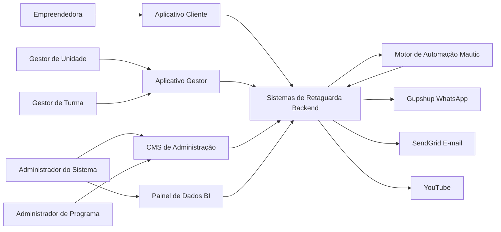

**Casos de Uso — Sistema de Gestão de Programas Sociais (Consulado da Mulher) — v3**

Documento derivado do escopo original do cliente, das reuniões de levantamento (abr./jun. 2026), do **contrato de licenciamento EWTI × Consulado da Mulher (08.05.2026)** e do modelo de referência. Versão 3 incorpora **observações v3** e reuniões de 22–25/jun. 2026, alinhada à arquitetura **CMS de Administração + Aplicativo Cliente + Aplicativo Gestor + Painel de Dados (BI) + Sistemas de Retaguarda (Backend) + Motor de Automação (Mautic)**.

---

## Atores

| Ator                                       | Descrição                                                                                                                                                                                                                                                                                                                                                                                                          |
| ------------------------------------------ | ------------------------------------------------------------------------------------------------------------------------------------------------------------------------------------------------------------------------------------------------------------------------------------------------------------------------------------------------------------------------------------------------------------------ |
| **Empreendedora (Beneficiada)**            | Mulher empreendedora em situação de vulnerabilidade social. Acessa o **Aplicativo Cliente** exclusivamente por **link mágico** (WhatsApp ou e-mail) — **não há senha** de autenticação. Realiza cadastros, inscrições (com seleção de unidade), módulos, conteúdos, questionários, uploads e dados financeiros mensais. Todo registro da empreendedora é vinculado obrigatoriamente a **programa**, **edição** e **unidade** (e **turma**, quando aplicável). |
| **Administrador do Sistema (CMS de Administração)**  | Perfil **master** com controle total: usuários, programas, unidades, migrações excepcionais e configuração global. |
| **Administrador de Programa (CMS de Administração)** | Usuário do CMS com escopo restrito a um ou mais programas/edições. Gerencia conteúdos, programas, módulos, organizações, colaboradores e unidades do seu programa. |
| **Gestor de Unidade (Aplicativo Gestor)** | Visão sobre todas as turmas da unidade; opera seleção, indicadores e acompanhamento regional. |
| **Gestor de Turma (Aplicativo Gestor)** | Opera a turma da unidade: valida entregas (tarefa de casa e dados financeiros), define sequência de atividades, configura encontros presenciais, adiciona atividades extras, edita e-mail/telefone e unidade da empreendedora. Pode inserir dados em nome da empreendedora (UC69). |
| **Colaborador** | Funcionário do Consulado cadastrado no CMS de Administração; pode acumular papéis de gestor de unidade ou gestor de turma. |
| **Voluntário / Mentor**                    | Pessoa cadastrada (mentor ou palestrante/oficineiro) para processos de mentoria vinculados a programas.                                                                                                                                                                                                                                                                                                            |
| **Lead (Pré-inscrita)**                    | Pessoa que iniciou, mas ainda não concluiu, o processo de inscrição; objeto do mini CRM.                                                                                                                                                                                                                                                                                                                           |
| **Organização (Patrocinador / Parceiro)**  | Pessoa jurídica cadastrada no sistema (CNPJ), associável a uma edição como patrocinador ou parceiro institucional.                                                                                                                                                                                                                                                                                                 |
| **Motor de Automação (Mautic)**            | Orquestra **jornadas** e **campanhas** em programas online: sequência de atividades, temporizadores entre etapas, gatilhos (ex.: inscrição em turma) e lembretes. Integra-se ao backend e ao Gupshup para disparo de mensagens. |
| **Sistemas de Retaguarda (Backend)**       | Camada **API/serviços** (Node.js, Express, Prisma, MySQL): regras de negócio, autenticação (tokens de link mágico), filas, integrações Gupshup/SendGrid, validação de elegibilidade, classificação de status, geração de certificados e persistência de dados. |
| **Gupshup (WhatsApp Business API)**        | Provedor de envio de mensagens WhatsApp: texto, links com login mágico, solicitações e envio de videoaulas. Acionado pelo backend ou pelo Mautic. |
| **YouTube**                                | Ator secundário para videoaulas gravadas e transmissões ao vivo. |

### Plataformas do Sistema

O sistema é organizado em **seis camadas funcionais**:

1. **CMS de Administração** — modelagem de programas, edições, módulos, unidades, organizações e colaboradores (implementado com Strapi).
2. **Aplicativo Gestor** — operação por **Gestor de Unidade** e **Gestor de Turma** (seleção, turmas, validação de entregas, sequência de atividades).
3. **Aplicativo Cliente** — interface da empreendedora (inscrição, atividades, uploads, dados financeiros); autenticação exclusiva por **link mágico**.
4. **Painel de Dados (BI)** — dashboards, indicadores e relatórios.
5. **Sistemas de Retaguarda (Backend)** — APIs, regras de negócio, filas, integrações (Gupshup, SendGrid), autenticação, persistência e serviços transversais.
6. **Motor de Automação (Mautic)** — orquestração de jornadas e campanhas em programas online (sequência, temporizadores, gatilhos e lembretes).

| Camada | Responsabilidade principal |
| ------ | -------------------------- |
| **Sistemas de Retaguarda (Backend)** | APIs, regras de negócio, persistência, tokens de link mágico, **UUID de dispositivo (UC67)**, integrações Gupshup/SendGrid, elegibilidade, status, certificados |
| **Motor de Automação (Mautic)** | Orquestração de jornadas online: quando disparar cada etapa, temporizadores, campanhas e lembretes (aciona o backend para execução) |

Stack contratual: Next.js, Node.js, Express, Prisma, MySQL; hospedagem AWS.

### Conceitos de Domínio (v3)

**Programa** — metodologia principal: apenas **tipo** (online ou presencial) e **descrição**. Não contém módulos diretamente; é lançado em **edições**.

**Edição** — instância operacional do programa. Define: programa vinculado, **unidades participantes**, ano de competência, nome da edição (ex.: 1º semestre, 2º semestre — podendo haver mais de uma edição por competência), datas/horas de início e fim de **inscrição**, **seleção** e **aplicação**, meta de beneficiados, **módulos** e **sequência de conteúdos**. A aplicação ocorre por módulos; módulos herdam o tipo do programa (online/presencial).

**Unidade** — agrupa pelo menos **uma turma**; colaboradores e gestores são vinculados à unidade. Na **inscrição**, a empreendedora **seleciona a unidade** de participação.

**Turma** — operacionalizada pelo **Gestor de Turma**; inscrição na turma (após seleção) **dispara** a jornada no **Mautic**, que aciona o **backend** e o **Gupshup** para envio das atividades.

**Módulo** — conjunto ordenado de **atividades educacionais** (ver UC15).

**Vínculo obrigatório** — todo registro de dados da empreendedora associa-se a **programa**, **edição** e **unidade** (e **turma**, quando possível).

### Segurança de Dados Sensíveis

- **CPF**: armazenado com técnica **HMAC-SHA256 + pepper** ([referência](https://ogeradordecpf.com.br/armazenar-cpf/)); usado como chave de identificação sem armazenamento em texto claro.
- **Autenticação empreendedora**: somente **link mágico** — sem senha.
- **Autenticação CMS e Aplicativo Gestor**: e-mail e senha; políticas de complexidade e expiração. **2FA**: previsto no Anexo LGPD do contrato para sistemas que processem dados do Consulado — implementação conforme exigência contratual, não bloqueante para MVP operacional (observações v3).
- **UUID de dispositivo (UC67)**: emitido após inscrição completa; localStorage; deep links com `turma_id`, `atividade_id`, `acao` — presença automática (UC40)
- Funcionalidades **não previstas no contrato** podem ser simplificadas ou postergadas para reduzir complexidade; reuniões de levantamento orientam priorização de necessidades dos usuários.

### Diagrama de Contexto — Frontends e Atores

### Hierarquia de Dados

**Programa → Edição → Unidade → Turma**

O **Programa** define a metodologia (tipo online/presencial). A **Edição** instancia o programa com cronograma, unidades e módulos. Cada **Unidade** possui ao menos uma **Turma**. Colaboradores vinculam-se a unidades; acesso segregado conforme LGPD.

### Base Legada (Consulta)

Dados históricos de sistemas anteriores permanecem em **base legada de consulta** — servem para verificar participação em programas passados e compor totalizadores (participantes, beneficiados, certificados, premiados), mas **não preenchem automaticamente** formulários de nova inscrição. Dados pessoais sensíveis respeitam retenção LGPD (até 5 anos após fim do programa); registros anteriores podem ser anonimizados ou mantidos apenas como contagens consolidadas.

---

## Casos de Uso

Organização do fluxo operacional:

**Pré-inscrição → Inscrição → Seleção → Aprovação e Aplicação do Programa → Conclusão (Beneficiamento, Certificação, Premiação, Mentoria)**

Com ramificações paralelas: **Cancelamento / Desistência**

Casos de uso agrupados por **plataforma/camada** e, quando aplicável, pela **fase do fluxo operacional**.

### CMS de Administração

UC1 — Cadastrar Colaborador  
UC2 — Login Administrador  
UC5 — Gerenciar Roles e Permissões  
UC6 — Configurar Autenticação e Segurança  
UC7 — Cadastrar Programa (Metodologia)  
UC8 — ~~Modelar Programa e Associar Módulos~~ *(incorporado a UC9 — módulos definidos na edição)*  
UC9 — Criar e Configurar Edição de Programa  
UC10 — Cadastrar Organização  
UC11 — Associar Organização à Edição (Patrocinador / Parceiro)  
UC12 — Configurar Regulamento e Critérios de Seleção  
UC13 — Configurar Critérios de Beneficiamento e Certificação por Edição  
UC14 — Configurar Critérios de Premiação por Edição (Textual)  
UC15 — Criar Módulo Educacional (Tipos de Atividade)  
UC66 — Cadastrar Unidade  
UC73 — Cadastrar Voluntário ou Mentor  
UC74 — Ativar ou Inativar Colaborador/Parceiro  
UC75 — Migrar Colaborador entre Unidades  

### Aplicativo Gestor — Gestor de Unidade

UC3 — Login Gestor (Aplicativo Gestor)  
UC24 — Selecionar Participantes para o Programa  
UC25 — Comunicar Resultado da Seleção *(disparo via retaguarda)*  
UC28 — Consultar Histórico de Participação  
UC50 — Comunicar para Grupo WhatsApp *(facilitador manual — UC16/UC66)*  
UC56 — Consultar Ranking e Engajamento  
UC57 — Registrar Premiação (Manual)  
UC58 — Analisar Elegibilidade para Capital Semente  
UC70 — Registrar Mentoria  

### Aplicativo Gestor — Gestor de Turma

UC16 — Criar e Gerenciar Turma *(inclui link do grupo WhatsApp)*  
UC17 — Alocar Empreendedora em Turma *(dispara jornada online — UC33)*  
UC18 — Transferir Empreendedora entre Turmas  
UC27 — Cadastrar e Atualizar Dados da Empreendedora *(e-mail, telefone, unidade)*  
UC30 — Registrar Cancelamento ou Desistência  
UC31 — Gerenciar Negócio e Associar Empreendedoras  
UC32 — Mover Empreendedora entre Negócios  
UC34 — Configurar Sequência e Atividades Presenciais por Turma  
UC35 — Adicionar Atividade Presencial Extra  
UC41 — Registrar Presença Manualmente  
UC42 — Consultar Frequência da Participante  
UC44 — Avaliar e Aprovar Entrega (Tarefa de Casa / Dados Financeiros)  
UC46 — Validar Dados Financeiros  
UC50 — Comunicar para Grupo WhatsApp *(facilitador manual)*  
UC69 — Inserir Dados em Nome da Empreendedora  

### Aplicativo Cliente — Empreendedora

**Fase 1 — Pré-inscrição**  
UC19 — Realizar Pré-Cadastro  
UC20 — Aceitar Termos LGPD, Comunicação, Cookies e Armazenamento Local  
UC67 — Resgatar Sessão do Dispositivo (UUID e localStorage) *(MVP)*  

**Fase 2 — Inscrição**  
UC21 — Realizar Inscrição Completa *(seleção de unidade)*  
UC22 — Consultar Histórico Legado e Reutilizar Cadastro Recorrente  

**Fase 4 — Aplicação**  
UC36 — Consumir Conteúdo Educacional  
UC37 — Registrar Progresso em Videoaula  
UC38 — Assistir Aula ao Vivo (YouTube)  
UC39 — Responder Atividade (Teste de Conhecimento / Resposta Aberta)  
UC40 — Registrar Presença via QR Code ou Deep Link *(ação automática com UUID — UC67)*  
UC43 — Enviar Tarefa de Casa (Upload)  
UC45 — Enviar Registro de Dados Financeiros Mensais  
UC47 — Preencher Formulário de Indicadores (Baseline / Endline)  
UC48 — Responder Pesquisa de Avaliação (NPS / Satisfação)  
UC68 — Visualizar Calendário de Atividades  
UC72 — Exibir Alerta de Compatibilidade de Navegador  

**Fase 5 — Conclusão**  
UC63 — Consultar e Solicitar Certificado (Autoatendimento)  

### Sistemas de Retaguarda (Backend)

UC4 — Login da Empreendedora (Link Mágico) *(tokens, UUID — UC67, deep links)*  
UC23 — Validar Elegibilidade da Inscrição (Automático)  
UC29 — Classificar Status da Participante  
UC49 — Disparar Mensagem Individual via WhatsApp  
UC51 — Enviar Vídeo ou Conteúdo via WhatsApp  
UC54 — Enviar Link Mágico Personalizado  
UC55 — Classificar Beneficiamento e Emitir Certificado Automaticamente  

### Motor de Automação (Mautic)

UC33 — Orquestrar Jornada Online (sequência e temporizadores)  
UC52 — Programar Mensagens Automáticas (campanhas)  
UC53 — Enviar Lembrete por Atividade Não Concluída  

### Painel de Dados (BI)

UC59 — Consultar Dashboard de Impacto  
UC60 — Gerar Relatórios Quantitativos  
UC61 — Gerar Relatórios Qualitativos  
UC62 — Consultar Base Legada de Participação  
UC65 — Consultar Consumo de Mensagens WhatsApp  
UC71 — Consolidar Totalizadores com Dados Pregressos  

### Funcionalidades Complementares (Contrato / Evolução)

UC26 — Gerenciar Leads com Inscrição Incompleta (Mini CRM)  
UC64 — Utilizar Chat de Dúvidas (IA)  

---

## Detalhamento dos Casos de Uso

### UC1 – Cadastrar Colaborador (CMS de Administração)

**Descrição**

Permite que o **Administrador do Sistema** ou **Administrador de Programa** cadastre **colaboradores** (funcionários do Consulado) utilizando o **sistema nativo de usuários do CMS de Administração**, atribuindo perfil (Administrador de Programa, Gestor de Unidade, Gestor de Turma) e vinculando a programas, unidades e turmas.

**Atores**

- **Administrador do Sistema (CMS de Administração)**: cadastro global e migrações excepcionais.
- **Administrador de Programa (CMS de Administração)**: cadastro restrito ao escopo do seu programa.
- **Colaborador**: usuário cadastrado que pode acumular papéis operacionais.

**Pré-condições**

- Administrador autenticado no CMS de Administração.
- Roles configuradas no CMS de Administração (UC5).

**Fluxo Principal**

- O **Administrador** acessa **Configurações → Painel de Administração → Usuários** no CMS de Administração.
- Seleciona **Convidar usuário** ou **Criar novo usuário**.
- Informa nome, e-mail, perfil (Administrador de Programa, Gestor de Unidade ou Gestor de Turma), status ativo/inativo (UC74) e unidade(s) vinculada(s) (UC66).
- Associa programas, edições e turmas permitidos conforme LGPD.
- O CMS de Administração envia e-mail de convite para definição de senha.
- O colaborador define senha e passa a acessar CMS de Administração e/ou Aplicativo Gestor (UC3) conforme perfil.

**Fluxos Alternativos**

- **E-mail já cadastrado**: CMS de Administração informa duplicidade.
- **Convite pendente**: administrador reenvia convite pelo painel CMS de Administração.

**Pós-condições**

- Colaborador cadastrado no CMS de Administração, apto a operar Aplicativo Gestor conforme perfil.

**Exceções**

- **EC1**: Falha no envio de e-mail — reenvio manual pelo CMS de Administração.

---

### UC2 – Login Administrador (CMS de Administração)

**Descrição**

Acesso ao backoffice **CMS de Administração** para modelagem de programas, módulos, organizações, conteúdos e gestão de usuários.

**Atores**

- **Administrador (CMS de Administração)**.

**Pré-condições**

- Conta CMS de Administração ativa com role Administrador.
- Navegador compatível; conexão à internet.

**Fluxo Principal**

- Usuário acessa URL do CMS de Administração Admin (`/admin`).
- Informa e-mail e senha na tela nativa de login.
- CMS de Administração valida credenciais e abre painel administrativo.

**Fluxos Alternativos**

- **Credenciais inválidas**: mensagem nativa do CMS de Administração; retry ou recuperação de senha.
- **Senha expirada**: troca obrigatória (UC6).

**Pós-condições**

- Sessão autenticada no CMS de Administração.

**Exceções**

- **EC1**: CMS de Administração indisponível — tentar mais tarde.

---

### UC3 – Login Gestor (Aplicativo Gestor)

**Descrição**

Acesso ao **Aplicativo Gestor** para operação de turmas: acompanhamento, comunicação, presença, validação e interação com empreendedoras.

**Atores**

- **Gestor de Unidade**, **Gestor de Turma**.

**Pré-condições**

- Colaborador cadastrado no CMS de Administração (UC1) com perfil Gestor de Unidade ou Gestor de Turma.

**Fluxo Principal**

- Gestor acessa URL do Aplicativo Gestor.
- Informa e-mail e senha (conta vinculada ao CMS de Administração).
- Sistema valida credenciais e role.
- Abre painel com turmas e programas associados.

**Fluxos Alternativos**

- **Sem turmas associadas**: exibe mensagem orientando contato com administrador.

**Pós-condições**

- Gestor autenticado no Aplicativo Gestor.

**Exceções**

- **EC1**: Servidor indisponível.

---

### UC4 – Login da Empreendedora (Link Mágico)

**Descrição**

Permite que a **Empreendedora** acesse o **Aplicativo Cliente** exclusivamente por **link mágico** — enviado via **WhatsApp (Gupshup)** ou **e-mail**. **Não existe senha** de autenticação. O link contém **token de sessão**; o **CPF** (HMAC-SHA256 + pepper) é a chave de identificação no backend. Sessão ativa por até **30 dias** no dispositivo. Após autenticação bem-sucedida, o sistema **persiste ou atualiza o UUID de dispositivo** no localStorage (UC67).

Links podem incluir **destino contextual** na URL: `programa`, `edição`, **turma**, **atividade** e **ação** (ex.: `presenca`, `videoaula`). Com UUID e sessão válidos, o Aplicativo Cliente **executa a ação automaticamente** (ex.: UC40 — registro de presença sem passos adicionais).

**Atores**

- **Empreendedora (Beneficiada)**.
- **Sistemas de Retaguarda (Backend)** — geração e validação de tokens; resolução de UUID; execução de ações por deep link.
- **Gupshup** / **SendGrid** — entrega do link (ator secundário).

**Pré-condições**

- Cadastro ou link vinculado ao telefone e/ou e-mail.

**Fluxo Principal**

- **Via WhatsApp**: recebe mensagem com link mágico; ao clicar, sistema identifica participante e abre Aplicativo Cliente autenticado.
- **Via E-mail**: recebe e-mail com link mágico; ao clicar, abre Aplicativo Cliente autenticado.
- Links de atividades do módulo online também contêm login mágico embutido e parâmetros de destino (UC54).
- Backend valida token; emite/atualiza **UUID de dispositivo** no localStorage (UC67).
- Se a URL indicar **turma**, **atividade** e **ação** (ex.: presença), e a participante estiver vinculada e autorizada, o sistema **executa a ação** (ex.: registra presença — UC40) e exibe confirmação.
- Sistema exibe alerta de compatibilidade de navegador quando necessário (UC72).

**Fluxos Alternativos**

- **Não cadastrada**: direciona a UC19 ou UC21; após conclusão, redireciona ao destino original da URL quando aplicável.
- **UUID presente, sessão expirada**: valida token do link ou solicita novo link mágico (UC54).
- **Link expirado**: novo envio via Gupshup ou e-mail.
- **Primeiro acesso pós-cadastro manual**: solicita aceites pendentes (UC20).
- **Ação não permitida** (ex.: presença em turma diferente): exibe mensagem e direciona à home da edição.

**Pós-condições**

- Empreendedora autenticada no Aplicativo Cliente; UUID persistido (UC67); ação de deep link executada quando aplicável.

**Exceções**

- **EC1**: Falha API Gupshup — reenvio de link por e-mail.

---

### UC5 – Gerenciar Roles e Permissões (CMS de Administração)

**Descrição**

Configura roles nativas do **CMS de Administração** e permissões por entidade, em conformidade com LGPD.

**Atores**

- **Administrador (CMS de Administração)**.

**Pré-condições**

- Administrador autenticado no CMS de Administração.

**Fluxo Principal**

- Acessa **Configurações → Painel de Administração → Funções (Roles)**.
- Edita permissões CRUD por entidade para cada role.
- Restringe escopo (programas/edições/turmas).
- Salva configuração.

**Pós-condições**

- Roles alinhadas às funções operacionais do Consulado.

---

### UC6 – Configurar Autenticação e Segurança

**Descrição**

Configura políticas de autenticação do **CMS de Administração** e **Aplicativo Gestor**: expiração e complexidade de senhas, histórico de senhas e armazenamento seguro de CPF (**HMAC-SHA256 + pepper**). **2FA** previsto no Anexo LGPD do contrato — implementação alinhada à exigência contratual, fora do escopo imediato do MVP (observações v3). A empreendedora **não utiliza senha** (apenas link mágico — UC4).

**Atores**

- **Administrador do Sistema (CMS de Administração)**.

**Pré-condições**

- Permissão de configuração global.

**Fluxo Principal**

- Define política de expiração, complexidade e histórico de senhas para colaboradores/gestores.
- Configura pepper e política de hash para CPF.
- Registra configuração de 2FA para fase contratual posterior, se aplicável.

**Pós-condições**

- Políticas de segurança ativas para CMS e Aplicativo Gestor.

---

### UC7 – Cadastrar Programa (Metodologia)

**Descrição**

Cadastra a **metodologia** do programa social no CMS de Administração: **tipo** (online ou presencial) e **descrição**. O programa não contém módulos nem cronograma — estes são definidos na **edição** (UC9).

**Atores**

- **Administrador (CMS de Administração)**.

**Pré-condições**

- Autenticado no CMS com permissão de gestão de programas.

**Fluxo Principal**

- Acessa **Programas → Criar**.
- Informa nome, slug, **tipo** (online / presencial) e descrição da metodologia.
- Salva programa.

**Pós-condições**

- Programa disponível para criação de edições (UC9).

**Exceções**

- **EC1**: Slug duplicado — solicita alteração.

---

### UC8 – Modelar Programa e Associar Módulos *(incorporado a UC9)*

**Descrição**

*Caso de uso absorvido por UC9 na v3.* Módulos e sequência de conteúdos passam a ser configurados na **edição**, não no programa. O programa define apenas metodologia (tipo e descrição — UC7).

**Pós-condições**

- Utilizar UC9 para associação de módulos à edição.

---

### UC9 – Criar e Configurar Edição de Programa

**Descrição**

Cria **edição** do programa: instância operacional com cronograma completo. Pode haver **mais de uma edição por ano de competência** (ex.: 1º semestre, 2º semestre). Herda o **tipo** do programa (online/presencial).

**Atores**

- **Administrador (CMS de Administração)**, **Gestor de Unidade** (consulta).

**Pré-condições**

- Programa cadastrado (UC7); módulos criados (UC15); regulamento aprovado.

**Fluxo Principal**

- Seleciona **programa** vinculado.
- Seleciona **unidades participantes** (UC66).
- Informa **ano de competência**, **nome da edição** (ex.: 1º semestre 2027), **meta de beneficiados**.
- Define datas/horas de início e fim: **inscrição**, **seleção** e **aplicação** do programa.
- Associa um ou mais **módulos** e define **sequência de conteúdos/atividades**.
- Anexa regulamento; publica URL de inscrição (slug).

**Pós-condições**

- Edição apta às fases de inscrição, seleção e aplicação por módulos.

---

### UC10 – Cadastrar Organização

**Descrição**

Cadastra **organização** (pessoa jurídica): patrocinadores, parceiros institucionais, unidades executoras.

**Atores**

- **Administrador (CMS de Administração)**.

**Pré-condições**

- Permissão de cadastro institucional.

**Fluxo Principal**

- Acessa **Organizações → Criar**.
- Informa razão social, CNPJ, tipo, localização e responsável.
- Registra papel no tratamento de dados (controlador/operador) quando aplicável.
- Salva organização.

**Pós-condições**

- Organização disponível para associação a edições (UC11).

---

### UC11 – Associar Organização à Edição (Patrocinador / Parceiro)

**Descrição**

Vincula organização a uma **edição** como **patrocinador** ou **parceiro** executor.

**Atores**

- **Administrador (CMS de Administração)**.

**Pré-condições**

- Organização (UC10) e edição (UC9) existentes.

**Fluxo Principal**

- Seleciona edição → **Organizações vinculadas**.
- Adiciona organização e define papel (patrocinador / parceiro executor).
- Salva vínculo.

**Pós-condições**

- Organização associada à edição com papel definido.

---

### UC12 – Configurar Regulamento e Critérios de Seleção

**Descrição**

Define critérios automáticos e manuais de elegibilidade (idade, renda, região, tempo de empreendimento, carência de premiação).

**Atores**

- **Administrador (CMS de Administração)**, **Gestor de Turma**.

**Pré-condições**

- Edição criada (UC9).

**Fluxo Principal**

- Configura travas automáticas e critérios de desempate.
- Indica restrições geográficas (rígidas ou flexíveis).
- Persiste regras para UC23 e UC24.

**Fluxos Alternativos**

- **Flexibilidade operacional**: critério como "alerta" em vez de bloqueio.

**Pós-condições**

- Critérios disponíveis para validação e seleção.

---

### UC13 – Configurar Critérios de Beneficiamento e Certificação por Edição

**Descrição**

Parametriza percentuais: beneficiada (ex.: 50%), certificada (ex.: 75%), conclusão integral (100%).

**Atores**

- **Administrador (CMS de Administração)**, **Gestor de Turma**.

**Pré-condições**

- Edição ativa com programação definida.

**Fluxo Principal**

- Define percentuais e tipos de atividade que contam.
- Define aplicação automática vs. validação manual de exceções.
- Sistema usa regras em UC29 e UC55.

**Pós-condições**

- Regras de beneficiamento e certificação parametrizadas.

---

### UC14 – Configurar Critérios de Premiação por Edição (Textual)

**Descrição**

Define critérios **textuais** de elegibilidade a **premiação** para orientar a decisão do gestor. Não há controle ou ranking automático de premiação — a contemplação é registrada **manualmente** no **Aplicativo Gestor** (UC57), com base nos critérios descritos e no histórico da participante.

**Atores**

- **Administrador (CMS de Administração)**, **Gestor de Unidade**.

**Pré-condições**

- Edição configurada; regulamento de premiação aprovado.

**Fluxo Principal**

- Acessa edição → **Critérios de Premiação**.
- Redige critérios textuais (ex.: engajamento mínimo, entregas no prazo, carência de 3 anos, top N, desempate).
- Publica critérios para consulta do gestor no Aplicativo Gestor durante UC57.

**Pós-condições**

- Critérios textuais de premiação disponíveis para decisão manual.

---

### UC15 – Criar Módulo Educacional (Tipos de Atividade)

**Descrição**

Cria **módulo** como conjunto ordenado de **atividades educacionais**. Herda o tipo do programa (online/presencial) quando associado à edição. Tipos de atividade suportados:

| Tipo | Descrição |
| ---- | --------- |
| Aula/reunião presencial | Encontro com local, data, hora e detalhes (configurados pelo gestor de turma — UC34) |
| Videoaula pré-gravada | Conteúdo YouTube |
| Videoaula ao vivo (live) | Transmissão YouTube |
| Teste de conhecimento | Questionário com feedback explicativo |
| Resposta aberta | Texto livre |
| Ferramenta de download | Material para download |
| Tarefa de casa | Descrição da atividade + upload de documentos *(aprovação obrigatória — UC44)* |
| Link externo | Redirecionamento |
| Certificado | Emissão automática ao concluir critérios |
| Registro de dados financeiros | Faturamento, renda, investimento, poupança, despesas, nº clientes, nº produtos vendidos + upload *(aprovação obrigatória — UC44)* |
| Temporizador | Intervalo entre atividades (jornada online — UC33) |
| Texto aberto | Mensagem via WhatsApp (jornada online — UC33) |

**Atores**

- **Administrador (CMS de Administração)**.

**Pré-condições**

- Autenticado no CMS de Administração.

**Fluxo Principal**

- Acessa **Módulos → Criar**.
- Adiciona atividades na sequência desejada.
- Salva módulo reutilizável em edições (UC9).

**Pós-condições**

- Módulo disponível para associação a edições (UC9).

---

### UC16 – Criar e Gerenciar Turma

**Descrição**

Cria turmas vinculadas a **edição** e **unidade** (UC66). Cada unidade possui **ao menos uma turma**. Vincula **gestores de turma** responsáveis pela operacionalização. Permite registrar o **link de convite do grupo WhatsApp** da turma (propriedade institucional) para uso no facilitador manual de comunicação (UC50).

**Atores**

- **Gestor de Turma (Aplicativo Gestor)**, **Administrador (CMS de Administração)**.

**Pré-condições**

- Edição configurada; programação associada.

**Fluxo Principal**

- Cria turma com nome, região, gestor, vagas, datas.
- Informa **link do grupo WhatsApp** da turma (URL de convite `https://chat.whatsapp.com/...` ou equivalente), quando existir.
- Opcionalmente define **modelo de mensagem** para o grupo (texto com placeholders, ex.: `{local}`, `{data}`, `{hora}`, `{nome_edicao}`) reutilizado em UC50.
- Associa participantes após seleção (UC17).

**Fluxos Alternativos**

- **Grupo ainda não criado**: turma pode ser salva sem link; gestor atualiza quando o grupo estiver disponível no WhatsApp.
- **Grupo criado manualmente**: gestor cria o grupo no WhatsApp (número institucional), adiciona participantes fora do sistema e registra apenas o link de convite no Aplicativo Gestor.

**Pós-condições**

- Turma pronta para aplicação do programa (Fase 4); link do grupo disponível para UC50 quando informado.

---

### UC17 – Alocar Empreendedora em Turma

**Descrição**

Aloca participantes **selecionadas** em turma. Em programas **online**, a inscrição na turma dispara webhook ao **Mautic** para iniciar a jornada (UC33).

**Atores**

- **Gestor de Turma (Aplicativo Gestor)**.

**Pré-condições**

- Status "selecionada" (UC24); turma com vagas.

**Fluxo Principal**

- Filtra selecionadas por região/perfil.
- Aloca em turma e confirma.
- Sistema dispara boas-vindas (UC49).

**Pós-condições**

- Participante vinculada à turma.

---

### UC18 – Transferir Empreendedora entre Turmas

**Descrição**

Move participante entre turmas da mesma edição, preservando histórico.

**Atores**

- **Gestor de Turma (Aplicativo Gestor)**.

**Pré-condições**

- Participante ativa; turmas compatíveis.

**Fluxo Principal**

- Seleciona participante → **Transferir turma**.
- Escolhe destino e registra motivo.
- Notifica gestores envolvidos.

**Pós-condições**

- Vínculo atualizado; histórico preservado.

---

### UC19 – Realizar Pré-Cadastro (Captura Inicial de Lead)

**Descrição**

Primeira etapa (mini CRM): captura nome, telefone, e-mail, aceite LGPD e **checkbox de aprovação de comunicação** antes do formulário completo. Durante o fluxo incompleto, o sistema pode persistir **progresso temporário** no dispositivo; o **UUID definitivo** de identificação do dispositivo é emitido somente após **inscrição completa** (UC21) — ver UC67.

**Atores**

- **Lead (Pré-inscrita)**.

**Pré-condições**

- Edição com inscrições abertas; URL acessível (slug do programa/edição).

**Fluxo Principal**

- Acessa link da edição/programa (slug).
- Visualiza indicador de progresso (etapa 1 de N).
- Aceita termo LGPD (obrigatório) e aceites de cookies/armazenamento local (UC20).
- Marca **checkbox de autorização para comunicação**.
- Informa nome, telefone e e-mail.
- Sistema registra lead "pré-cadastro concluído" e, se consentido, persiste **progresso da inscrição** no **localStorage** (etapa pendente — UC67).
- Direciona para inscrição completa (UC21).

**Fluxos Alternativos**

- **Retorno pelo mesmo slug (UC67)**: se UUID válido já existir (inscrição concluída), reconhece participante e direciona conforme status; se apenas progresso incompleto, retoma UC21 na etapa pendente.
- **LGPD não aceito**: bloqueia continuidade.
- **Comunicação não autorizada**: permite inscrição, mas impede reativação pelo mini CRM (UC26).
- **Abandono**: lead disponível em UC26 se comunicação autorizada.

**Pós-condições**

- Lead capturado conforme consentimentos registrados; progresso disponível para retomada (UC67).

---

### UC20 – Aceitar Termos LGPD, Comunicação, Cookies e Armazenamento Local

**Descrição**

Registra aceites: LGPD (global), autorização de comunicação, regulamento da edição (uso de imagem), **política de cookies** e consentimento para **armazenamento local** (localStorage) no dispositivo do usuário.

**Atores**

- **Empreendedora**, **Lead**, **Gestor** (cadastro manual).

**Pré-condições**

- Fluxo de inscrição ou cadastro manual no Aplicativo Cliente.

**Fluxo Principal**

- Apresenta termos integrados ao fluxo, incluindo uso de cookies e localStorage para **UUID de dispositivo** (UC67), retomada de inscrição e sessão persistente.
- Registra aceites com data/hora, versão do termo e dispositivo.

**Fluxos Alternativos**

- **Cadastro manual**: envia link de aceite via WhatsApp.
- **Cookies/localStorage recusados**: permite fluxo mínimo, mas sem retomada automática via dispositivo (UC67).

**Pós-condições**

- Aceites registrados conforme LGPD e política de privacidade.

---

### UC21 – Realizar Inscrição Completa

**Descrição**

Conclui inscrição **via Aplicativo Cliente** em etapas (dados pessoais → financeiros → específicos do programa) com indicador visual de progresso. Valida **CEP** para elegibilidade geográfica; **CNPJ/MEI** obrigatório quando exigido pelo programa (ex.: BNDES).

**Atores**

- **Empreendedora**, **Lead**.

**Pré-condições**

- Pré-cadastro (UC19); aceites (UC20).

**Fluxo Principal**

- Acessa formulário **via Aplicativo Cliente** com barra de progresso.
- **Seleciona a unidade** de participação entre as unidades da edição.
- Valida CPF (HMAC-SHA256 + pepper), endereço (CEP), perfil socioeconômico; campo CPF ou RNE/outro documento para estrangeiros (reunião 25/jun.).
- Sistema exibe **consulta somente leitura** de participação em programas passados (UC62), sem pré-preencher cadastro.
- Aceite do regulamento da edição.
- Registra inscrição vinculada a **programa**, **edição** e **unidade** selecionada — status "finalizada — aguardando seleção".
- Backend emite **UUID de dispositivo** vinculado à participante e ao par **programa + edição**; Aplicativo Cliente persiste o UUID no **localStorage** (UC67).

**Fluxos Alternativos**

- **Recorrente (UC22)**: pré-preenche dados já validados e solicita atualização dos demais campos; ao concluir, atualiza ou reemite UUID (UC67).
- **Programa Pílulas**: fluxo simplificado com aprovação imediata quando configurado na edição.
- **Incompleta**: retomada via UUID/progresso no localStorage (UC67) ou link personalizado (UC54); UC26.

**Pós-condições**

- Inscrição elegível a UC23/UC24; **UUID persistido** no dispositivo para retornos futuros (UC67).

**Exceções**

- **EC1**: Edição encerrada durante preenchimento.

---

### UC22 – Consultar Histórico Legado e Reutilizar Cadastro Recorrente

**Descrição**

Participante já cadastrada valida/atualiza dados ao se inscrever novamente. O sistema consulta a **base legada** (UC62) e o histórico unificado para **exibir** participação em programas passados, mas **não pré-preenche** automaticamente o formulário de nova inscrição com dados legados.

**Atores**

- **Empreendedora**.

**Pré-condições**

- CPF/telefone na base unificada ou legada.

**Fluxo Principal**

- Sistema identifica recorrência pelo CPF.
- Exibe alerta informativo de programas anteriores (somente leitura).
- Pré-preenche apenas dados já validados na base ativa do sistema.
- Solicita confirmação/atualização dos demais campos.
- Registra nova inscrição vinculada ao histórico (UC28).

**Pós-condições**

- Cadastro atualizado na base ativa; histórico preservado; dados legados não importados automaticamente.

---

### UC23 – Validar Elegibilidade da Inscrição (Automático)

**Descrição**

Aplica critérios de UC12 sobre inscrições finalizadas. Processamento realizado pelo **backend** (regras de negócio).

**Atores**

- **Sistemas de Retaguarda (Backend)**; **Gestor de Unidade** (consulta).

**Pré-condições**

- Inscrição finalizada (UC21); critérios configurados.

**Fluxo Principal**

- Valida CPF, duplicidade, renda, região, recorrência.
- Classifica: elegível, elegível com alerta ou inelegível.

**Pós-condições**

- Inscrições classificadas para seleção.

---

### UC24 – Selecionar Participantes para o Programa

**Descrição**

Seleção manual assistida por filtros automáticos, histórico e entrevistas.

**Atores**

- **Gestor de Turma (Aplicativo Gestor)**.

**Pré-condições**

- Inscrições validadas (UC23).

**Fluxo Principal**

- Painel com totais, filtros e critérios de vulnerabilidade.
- Seleciona dentro do limite de vagas/orçamento.
- Confirma aprovadas/reprovadas para UC25.

**Fluxos Alternativos**

- **Volume superior à meta**: seleciona número maior que vagas finais (ex.: 50–60 para meta de 40).

**Pós-condições**

- Lista de selecionadas definida.

---

### UC25 – Comunicar Resultado da Seleção

**Descrição**

Comunica aprovação, reprovação ou lista de espera via WhatsApp. Disparo executado pelo **backend** (Gupshup), acionado pelo gestor no Aplicativo Gestor.

**Atores**

- **Gestor de Unidade** / **Gestor de Turma**; **Sistemas de Retaguarda (Backend)**; **Gupshup**.

**Pré-condições**

- Seleção concluída (UC24).

**Fluxo Principal**

- Dispara templates aprovados (individual ou lote).
- Registra histórico de comunicação.

**Pós-condições**

- Participantes informadas.

**Exceções**

- **EC1**: Falha no envio — retry ou envio manual.

---

### UC26 – Gerenciar Leads com Inscrição Incompleta (Mini CRM)

**Descrição**

Visualiza e reativa leads que **autorizaram comunicação** e abandonaram inscrição.

**Atores**

- **Gestor de Turma (Aplicativo Gestor)**.

**Pré-condições**

- Aceite de comunicação (UC19); inscrição incompleta.

**Fluxo Principal**

- Filtra por programa, edição, etapa de abandono.
- Dispara retomada com link personalizado.
- Registra conversões.

**Pós-condições**

- Leads reengajados; taxa de conversão mensurável.

---

### UC27 – Cadastrar e Atualizar Dados da Empreendedora

**Descrição**

Autoatualização pela empreendedora **via Aplicativo Cliente** ou edição pelo **Gestor de Turma** no Aplicativo Gestor. O **CPF** (hash), uma vez validado, **não pode ser alterado** pela empreendedora. O **gestor de turma** pode alterar **e-mail**, **DDD + telefone** e **unidade** (correção de alocação). Todo registro vincula-se a **programa**, **edição**, **unidade** e **turma** (quando aplicável).

**Atores**

- **Empreendedora**, **Gestor de Turma**.

**Pré-condições**

- Vinculada a programa/edição/unidade/turma.

**Fluxo Principal**

- **Empreendedora**: edita dados cadastrais via Aplicativo Cliente, exceto CPF validado.
- **Gestor de Turma**: edita e-mail, telefone e unidade no Aplicativo Gestor; demais campos exigem justificativa e log de auditoria.

**Fluxos Alternativos**

- **Inserção em nome da empreendedora (UC69)**: gestor registra dados quando a participante não consegue acessar o Aplicativo Cliente.

**Pós-condições**

- Dados atualizados conforme permissões; vínculos programa/edição/unidade/turma preservados.

---

### UC28 – Consultar Histórico de Participação

**Descrição**

Linha do tempo de programas, edições, status, certificações e indicadores.

**Atores**

- **Gestor**, **Gestor de Turma**, **Administrador**, **Empreendedora** (visão própria).

**Pré-condições**

- Cadastro na base unificada.

**Fluxo Principal**

- Busca por CPF/nome/telefone.
- Exibe histórico consolidado da base ativa e consulta legada (UC62).

**Pós-condições**

- Visão para seleção, mentoria e BI.

---

### UC29 – Classificar Status da Participante

**Descrição**

Status: pré-inscrita, inscrita, selecionada, em assessoria, beneficiada, certificada, contemplada, emancipada, descontinuada/desistente.

**Atores**

- **Sistemas de Retaguarda (Backend)** — cálculo automático conforme regras.
- **Gestor de Turma** — ajustes manuais de exceção.

**Pré-condições**

- Participante vinculada a edição/turma; critérios UC13.

**Fluxo Principal**

- Cálculo automático conforme frequência e entregas.
- Gestor ajusta exceções manualmente.

**Pós-condições**

- Status refletido em relatórios.

---

### UC30 – Registrar Cancelamento ou Desistência

**Descrição**

Registra **cancelamento** (pela participante ou gestão) ou **desistência** com motivo padronizado para indicadores qualitativos. Atualiza status para descontinuada/desistente (UC29) e interrompe liberações e lembretes automáticos.

**Atores**

- **Empreendedora** (via Aplicativo Cliente, quando habilitado), **Gestor**, **Gestor de Turma**.

**Pré-condições**

- Interrupção de participação identificada ou solicitação da participante.

**Fluxo Principal**

- Seleciona tipo (cancelamento/desistência), motivo padronizado e observações.
- Registra data e elegibilidade remanescente (ex.: manter como beneficiada parcial).
- Sistema atualiza status e notifica gestor da turma.

**Pós-condições**

- Cancelamento/desistência categorizada; fluxo operacional encerrado para a participante.

---

### UC31 – Gerenciar Negócio e Associar Empreendedoras

**Descrição**

Cadastra **negócio** (individual ou coletivo) e **associa empreendedoras**. O gestor pode vincular uma empreendedora a um negócio existente ou **adicionar empreendedora a um negócio** já cadastrado. Cada pessoa permanece contabilizada individualmente nos relatórios.

**Atores**

- **Gestor de Turma (Aplicativo Gestor)**, **Gestor de Turma**.

**Pré-condições**

- Empreendedoras vinculadas à turma/edição.

**Fluxo Principal**

- Cria negócio (nome, CNPJ opcional, segmento) ou localiza existente.
- **Associa** uma ou mais empreendedoras ao negócio.
- **Adiciona** nova empreendedora a negócio coletivo existente.

**Pós-condições**

- Negócio e vínculos registrados.

---

### UC32 – Mover Empreendedora entre Negócios

**Descrição**

Permite ao **Gestor de Unidade** transferir empreendedora de um negócio para outro, preservando histórico individual.

**Atores**

- **Gestor de Turma (Aplicativo Gestor)**.

**Pré-condições**

- Empreendedora associada a negócio de origem.

**Fluxo Principal**

- Localiza participante → **Mover negócio**.
- Seleciona negócio destino ou cria novo.
- Registra motivo e data.

**Pós-condições**

- Vínculo atualizado; rastreabilidade mantida.

---

### UC33 – Orquestrar Jornada Online (Mautic)

**Descrição**

Em módulos de programas **online**, o **Motor de Automação (Mautic)** orquestra a sequência de atividades após a **inscrição da empreendedora na turma** (UC17): define gatilhos, temporizadores e etapas da campanha. O **backend** executa as ações concretas (geração de link mágico — UC54, chamadas ao Gupshup — UC49/UC51, persistência de progresso). Tipos de etapa: texto aberto, solicitação de videoaula, envio de videoaula, link para atividade no Aplicativo Cliente. O **temporizador** entre atividades é configurado como atividade do módulo (UC15).

**Atores**

- **Motor de Automação (Mautic)** — orquestração da jornada.
- **Sistemas de Retaguarda (Backend)** — execução de envios e registro de dados.
- **Gupshup** — entrega WhatsApp.
- **Gestor de Turma** — configuração em programas presenciais (UC34).

**Pré-condições**

- Edição online com módulo e sequência definidos (UC9); empreendedora inscrita na turma (UC17).

**Fluxo Principal**

- Mautic inicia jornada no evento "inscrição em turma" (webhook do backend).
- Agenda etapas conforme sequência do módulo e temporizadores.
- Para cada etapa, aciona o **backend** para gerar links (UC54) e enviar via Gupshup quando aplicável.
- Backend registra entregas e progresso para UC29 e UC55.

**Fluxos Alternativos**

- **Presencial**: gestor de turma define sequência e conduz atividades no Aplicativo Gestor (UC34), podendo alterar ordem e adicionar extras (UC35).

**Pós-condições**

- Jornada online em execução; atividades entregues conforme cadência.

---

### UC34 – Configurar Sequência e Atividades Presenciais por Turma

**Descrição**

O **Gestor de Turma** define a **sequência de atividades** a ser realizada na turma, configura dados de atividades **presenciais** (local, data, hora, descrição/detalhes) e prazos. Calendário visual no Aplicativo Gestor e Aplicativo Cliente (UC68). Em programas presenciais, o gestor pode conduzir atividades **fora da sequência** padrão da edição.

**Atores**

- **Gestor de Turma (Aplicativo Gestor)**.

**Pré-condições**

- Turma criada (UC16); módulos da edição definidos (UC9).

**Fluxo Principal**

- Reordena atividades da turma conforme necessidade operacional.
- Configura encontros presenciais: local, data, hora e detalhes.
- Define URLs de aula ao vivo (YouTube) por turma quando aplicável.
- Disponibiliza ação **"Comunicar para Grupo"** (UC50) contextual ao encontro, pré-preenchendo local, data e hora no modelo de mensagem.

**Pós-condições**

- Cronograma da turma configurado e visível às empreendedoras; encontros passíveis de comunicação via UC50.

---

### UC35 – Adicionar Atividade Presencial Extra

**Descrição**

Permite ao **Gestor de Turma** adicionar **atividade presencial extra** (ex.: oficina de fotografia) sem alterar a estrutura central do módulo/edição.

**Atores**

- **Gestor de Turma (Aplicativo Gestor)**.

**Pré-condições**

- Turma ativa.

**Fluxo Principal**

- Adiciona atividade presencial extra com local, data, hora e descrição.
- Oferece **"Comunicar para Grupo"** (UC50) para avisar a turma sobre o encontro extra.
- Notifica participantes; não impacta certificação obrigatória.

**Pós-condições**

- Atividade extra disponível à turma.

---

### UC36 – Consumir Conteúdo Educacional

**Descrição**

Acesso a videoaulas (YouTube), PDFs e guias **via Aplicativo Cliente** — link WhatsApp ou login e-mail (UC4). O **engajamento** é medido pela **conclusão da atividade**, não apenas pela visualização do vídeo.

**Atores**

- **Empreendedora**, **YouTube**.

**Pré-condições**

- Autenticada no Aplicativo Cliente (UC4); conteúdo liberado (UC33).

**Fluxo Principal**

- Visualiza programa/módulos com progresso no Aplicativo Cliente.
- Consome conteúdo liberado; registra UC37/UC39.
- Visualiza calendário de atividades da turma (UC68).

**Pós-condições**

- Consumo e progresso registrados.

---

### UC37 – Registrar Progresso em Videoaula

**Descrição**

Rastreia % assistido para marcos e certificação (meta configurável, ex.: 70%).

**Atores**

- **Empreendedora**, **YouTube**.

**Pré-condições**

- Videoaula liberada e acessada.

**Fluxo Principal**

- Sistema registra percentual visualizado.
- Ao atingir meta, marca atividade concluída.
- Se online sequencial, desbloqueia próxima etapa.

**Pós-condições**

- Progresso atualizado.

---

### UC38 – Assistir Aula ao Vivo (YouTube)

**Descrição**

Participação em transmissão ao vivo via **YouTube**. Link enviado por WhatsApp ou **Aplicativo Cliente**.

**Atores**

- **Empreendedora**, **YouTube**, **Gestor**.

**Pré-condições**

- Live configurada no calendário (UC34).

**Fluxo Principal**

- Recebe link da live.
- Acessa transmissão YouTube.
- Sistema registra participação quando integração disponível; alternativa: UC41.

**Pós-condições**

- Participação em live registrada.

---

### UC39 – Responder Atividade (Exercício / Questionário)

**Descrição**

Questões múltipla escolha ou abertas **via Aplicativo Cliente**; **feedback explicativo** imediato após cada resposta (sem exibição de nota numérica ao participante). Pontuação interna opcional para apoio à decisão do gestor (UC56).

**Atores**

- **Empreendedora**.

**Pré-condições**

- Atividade liberada; autenticada no Aplicativo Cliente (UC4).

**Fluxo Principal**

- Responde questões e confirma envio no Aplicativo Cliente.
- Sistema exibe feedback educativo explicando acertos/erros.
- Marca atividade como concluída para fins de engajamento e certificação.

**Fluxos Alternativos**

- **Resposta incompleta**: solicita conclusão.

**Pós-condições**

- Atividade registrada como concluída.

---

### UC40 – Registrar Presença via QR Code ou Deep Link

**Descrição**

Presença em encontros presenciais via **QR Code** (gestor exibe no App Gestor) ou via **deep link** com parâmetros de **turma**, **atividade/encontro** e **ação=presenca** (UC54, UC4). Quando a empreendedora possui **UUID de dispositivo** e **sessão válida** no localStorage (UC67), o registro de presença ocorre **automaticamente** ao abrir o link — sem necessidade de escanear QR ou autenticar novamente.

**Atores**

- **Empreendedora**, **Gestor de Turma**.
- **Sistemas de Retaguarda (Backend)** — validação de UUID/sessão e persistência da presença.

**Pré-condições**

- Encontro configurado (UC34).
- Empreendedora autenticada (UC4) **ou** UUID + sessão persistente válidos (UC67).
- URL de presença contém identificadores de **turma**, **atividade/encontro** e **ação**.

**Fluxo Principal**

- **Via QR Code**: Gestor de Turma exibe QR vinculado ao encontro; empreendedora escaneia; URL contém turma, atividade e ação; sistema registra presença com data/hora.
- **Via deep link** (WhatsApp, e-mail, calendário): empreendedora abre link; Aplicativo Cliente lê UUID no localStorage (UC67), valida sessão e participação na turma; **registra presença automaticamente**; exibe confirmação visual.

**Fluxos Alternativos**

- **UUID ausente ou sessão expirada**: redireciona a UC4 (token na URL) ou UC19/UC21; após autenticação, executa registro de presença pendente.
- **Sem celular/conectividade no encontro**: UC41 (gestor registra manualmente).
- **Participante não vinculada à turma**: bloqueia registro e orienta contatar gestor.

**Pós-condições**

- Presença contabilizada (UC42).

---

### UC41 – Registrar Presença Manualmente

**Descrição**

Registro por CPF/nome quando QR inviável.

**Atores**

- **Gestor de Turma**, **Gestor (Aplicativo Gestor)**.

**Pré-condições**

- Encontro ativo.

**Fluxo Principal**

- Busca participante por CPF/nome.
- Confirma presença; registra origem "manual".

**Pós-condições**

- Frequência atualizada.

---

### UC42 – Consultar Frequência da Participante

**Descrição**

Percentual de participação vs. metas da edição (50%, 75%, 100%).

**Atores**

- **Gestor**, **Gestor de Turma**, **Empreendedora**.

**Pré-condições**

- Registros de presença e atividades existentes.

**Fluxo Principal**

- Exibe frequência global e por módulo/atividade.

**Pós-condições**

- Informação para certificação e status.

---

### UC43 – Enviar Tarefa de Casa (Upload)

**Descrição**

Entrega de **tarefa de casa** **via Aplicativo Cliente**: descrição da atividade + upload de documentos/fotos. Requer **aprovação obrigatória** do gestor de turma (UC44).

**Atores**

- **Empreendedora**.

**Pré-condições**

- Atividade "tarefa de casa" liberada; autenticada no Aplicativo Cliente (UC4).

**Fluxo Principal**

- Acessa atividade no Aplicativo Cliente.
- Lê descrição; faz upload de arquivos; confirma envio.
- Status "aguardando aprovação" (UC44).

**Fluxos Alternativos**

- **Gestor insere em nome da participante (UC69)**.

**Pós-condições**

- Entrega disponível para aprovação (UC44).

---

### UC44 – Avaliar e Aprovar Entrega (Tarefa de Casa / Dados Financeiros)

**Descrição**

O **Gestor de Turma** **aprova**, **reprova** ou solicita correção de **tarefas de casa** (UC43) e **registros de dados financeiros** (UC45), com observações obrigatórias em caso de reprovação.

**Atores**

- **Gestor de Turma (Aplicativo Gestor)**.

**Pré-condições**

- Entrega registrada (UC43 ou UC45).

**Fluxo Principal**

- Analisa material/dados no Aplicativo Gestor.
- **Aprova**: atualiza status; registra progresso.
- **Reprova**: informa observação; sistema envia notificação via **WhatsApp (Gupshup)** e **e-mail**; exibe **indicador visual de atenção** no Aplicativo Cliente na atividade correspondente.
- Empreendedora corrige e reenvia até aprovação (reunião 25/jun.).

**Pós-condições**

- Status da entrega atualizado; histórico e observações preservados.

---

### UC45 – Enviar Registro de Dados Financeiros Mensais

**Descrição**

Registro **mensal**: **faturamento**, **renda**, **investimento**, **poupança**, **despesas**, **número de clientes**, **número de produtos vendidos** e upload de documentos — **via Aplicativo Cliente**. Requer **aprovação obrigatória** do gestor de turma (UC44).

**Atores**

- **Empreendedora**, **Gestor de Turma** (assistido ou via UC69).

**Pré-condições**

- Fase de coleta financeira ativa; participante vinculada à turma.

**Fluxo Principal**

- Acessa formulário mensal no Aplicativo Cliente ou via link WhatsApp (UC54).
- Preenche valores do mês de referência; anexa documentos quando exigido.
- Sistema valida consistência (ex.: renda ≤ faturamento).
- Status "aguardando aprovação" (UC44).

**Fluxos Alternativos**

- **Dados inconsistentes**: alerta e solicita correção.
- **Mês sem movimento**: permite registro zerado com justificativa.

**Pós-condições**

- Dados mensais registrados para evolução e BI.

---

### UC46 – Validar Dados Financeiros

**Descrição**

*Fluxo unificado com UC44.* O **Gestor de Turma** aprova ou reprova registros financeiros mensais (UC45) com observações; reprovação dispara notificação e indicador visual no Aplicativo Cliente.

**Atores**

- **Gestor de Turma**, **Gestor**.

**Pré-condições**

- Dados enviados (UC45).

**Fluxo Principal**

- Analisa valores e comparativo mensal.
- Aprova ou devolve com observações.

**Pós-condições**

- Dados validados incorporados aos indicadores.

---

### UC47 – Preencher Formulário de Indicadores (Baseline / Endline)

**Descrição**

Indicadores qualitativos/quantitativos em momentos configuráveis (início, meio, fim).

**Atores**

- **Empreendedora**, **Gestor de Turma**, **Gestor**.

**Pré-condições**

- Formulário configurado; período ativo.

**Fluxo Principal**

- Preenche questionário padronizado.
- Sistema associa ao momento (baseline/endline).

**Pós-condições**

- Indicadores para UC61.

---

### UC48 – Responder Pesquisa de Avaliação (NPS / Satisfação)

**Descrição**

Avaliação de curso, aulas e oficinas (escala 0–5 ou NPS).

**Atores**

- **Empreendedora**.

**Pré-condições**

- Pesquisa liberada.

**Fluxo Principal**

- Responde via link; sistema consolida por turma/edição.

**Pós-condições**

- Dados de satisfação disponíveis.

---

### UC49 – Disparar Mensagem Individual via WhatsApp

**Descrição**

Mensagem personalizada (texto, link, material) enviada pelo **backend** via integração **Gupshup**. Pode ser acionada manualmente pelo gestor ou automaticamente pelo **Mautic** (UC33/UC52).

**Atores**

- **Gestor de Turma** / **Gestor de Unidade** (disparo manual).
- **Sistemas de Retaguarda (Backend)** + **Gupshup**.
- **Motor de Automação (Mautic)** — disparo automático em jornadas.

**Pré-condições**

- Template aprovado Meta; consentimento quando exigido.

**Fluxo Principal**

- Monta mensagem com link personalizado (UC54).
- Envia via API; registra status.

**Exceções**

- **EC1**: Falha Meta API — retry.

---

### UC50 – Comunicar para Grupo WhatsApp (Facilitador Manual)

**Descrição**

Facilita a **comunicação manual** em **grupo WhatsApp** institucional da turma ou unidade. A interação no grupo **não é automatizada** via Gupshup/API — o envio é realizado **pelo gestor** no aplicativo WhatsApp. O sistema atua como **processo facilitador**: monta a mensagem personalizada, copia para a área de transferência e abre o link do grupo previamente registrado (UC16 ou UC66) em nova aba, para o gestor colar e publicar.

**Atores**

- **Gestor de Turma (Aplicativo Gestor)**, **Gestor de Unidade (Aplicativo Gestor)**.

**Pré-condições**

- Turma ou unidade com **link do grupo WhatsApp** registrado (UC16 ou UC66).
- Gestor com permissão sobre a turma/unidade.
- Navegador com suporte a Clipboard API e abertura de link externo.

**Fluxo Principal**

- Gestor acessa a ação **"Comunicar para Grupo"** (turma, unidade, encontro presencial UC34 ou comunicação).
- Seleciona **modelo de mensagem** (padrão da turma/unidade ou edição) ou redige texto livre.
- Preenche **campos variáveis** solicitados pelo modelo (ex.: local do encontro, data, hora, nome da edição, link de live YouTube).
- Sistema **monta a mensagem final** substituindo placeholders pelos valores informados.
- Gestor clica em **"Comunicar para Grupo"**.
- Sistema **copia a mensagem** para a área de transferência (clipboard).
- Sistema **abre em nova aba** o link do grupo WhatsApp registrado.
- Gestor cola a mensagem no grupo e envia manualmente no WhatsApp.

**Fluxos Alternativos**

- **Link do grupo não cadastrado**: exibe orientação para registrar em UC16/UC66; bloqueia abertura do WhatsApp.
- **Falha ao copiar (clipboard)**: exibe mensagem montada em área selecionável para cópia manual.
- **Gestor de unidade**: utiliza link do grupo registrado na **unidade** (UC66) quando a comunicação abrange todas as turmas da unidade.
- **Encontro presencial (UC34)**: botão contextual pré-preenche local, data e hora do encontro no modelo.

**Pós-condições**

- Mensagem disponível para envio manual pelo gestor no WhatsApp.
- Sistema registra **log operacional** (data/hora, gestor, turma/unidade, modelo utilizado — **sem** confirmação de entrega no grupo, pois o envio é externo).

**Observações**

- **Não utiliza Gupshup** nem WhatsApp Business API — distinto de UC49 (mensagem individual automatizada).
- **Não é acionado pelo Mautic** (UC52/UC53) — automação de jornada online permanece via UC49/UC54.
- Grupos WhatsApp são de **propriedade institucional**; criação e moderação de membros ocorrem manualmente no WhatsApp.

**Exceções**

- **EC1**: Link do grupo inválido ou expirado — solicita atualização em UC16/UC66.

---

### UC51 – Enviar Vídeo ou Conteúdo via WhatsApp

**Descrição**

Envio de **vídeos** e materiais via **Gupshup**, executado pelo **backend** (manual pelo gestor ou acionado pelo Mautic na jornada online).

**Atores**

- **Gestor de Turma**, **Sistemas de Retaguarda (Backend)**, **Gupshup**.
- **Motor de Automação (Mautic)** — quando etapa da jornada online.

**Pré-condições**

- Mídia/template aprovados; opt-in quando exigido.

**Fluxo Principal**

- Seleciona participante/turma e mídia (vídeo, imagem, PDF).
- Envia via API WhatsApp.
- Registra entrega e status.

**Pós-condições**

- Conteúdo entregue por WhatsApp; histórico registrado.

---

### UC52 – Programar Mensagens Automáticas (Mautic)

**Descrição**

Agenda campanhas e lembretes no **Mautic**: público, template, data/hora e gatilhos. O Mautic aciona o **backend** para envio efetivo via **mensagens individuais** (UC49/UC54). **Não** dispara UC50 (comunicação em grupo WhatsApp é manual).

**Atores**

- **Motor de Automação (Mautic)**; **Sistemas de Retaguarda (Backend)** (execução).

**Pré-condições**

- Edição/turma configurada; templates aprovados.

**Fluxo Principal**

- Define público, template, data/hora e gatilho.
- Motor executa envio individual (UC49/UC54).

**Pós-condições**

- Mensagens na fila de automação.

---

### UC53 – Enviar Lembrete por Atividade Não Concluída (Mautic)

**Descrição**

Lembrete automático (ex.: 48h) por atividade pendente, configurado como **gatilho no Mautic**. O Mautic aciona o **backend** para envio via Gupshup (UC49/UC54).

**Atores**

- **Motor de Automação (Mautic)**; **Sistemas de Retaguarda (Backend)**; **Gupshup**.

**Pré-condições**

- Gatilho configurado; atividade pendente.

**Fluxo Principal**

- Após prazo, envia lembrete com link à atividade.
- Limita reenvios para evitar spam.

**Pós-condições**

- Tentativa de reengajamento registrada.

---

### UC54 – Enviar Link Mágico Personalizado

**Descrição**

O **backend** gera URLs com **token de login mágico** (UC4) e parâmetros opcionais de destino: **programa**, **edição**, **turma** (`turma_id`), **atividade** (`atividade_id`) e **ação** (`acao` — ex.: `presenca`, `videoaula`, `tarefa`). Consumidas na jornada Mautic (UC33), em disparos do gestor (UC49) ou em e-mails (SendGrid). Com UUID e sessão persistentes (UC67), a abertura do link pode **executar a ação diretamente** (ex.: UC40).

**Atores**

- **Sistemas de Retaguarda (Backend)** — geração do token, URL e validação de deep link.
- **Motor de Automação (Mautic)** / **Gupshup** / **SendGrid** — entrega do link.
- **Empreendedora**.

**Pré-condições**

- Participante identificada e vinculada a programa/edição/unidade/turma.

**Fluxo Principal**

- Backend gera link único com token de sessão (UC4) e, quando aplicável, query params: `turma_id`, `atividade_id`, `acao`.
- Exemplo presença: `/app/...?token=...&turma_id=X&atividade_id=Y&acao=presenca`.
- Entrega via Gupshup, SendGrid ou Mautic; registra clique e destino.
- Ao abrir: se UUID + sessão válidos (UC67), executa ação sem fluxo intermediário; senão, autentica via token e persiste UUID.

**Pós-condições**

- Acesso autenticado ao Aplicativo Cliente; ação de destino executada quando parametrizada e autorizada.

---

### UC55 – Classificar Beneficiamento e Emitir Certificado Automaticamente

**Descrição**

Classifica participante como **beneficiada** e emite certificado conforme critérios de UC13. Regras e geração de PDF executadas pelo **backend**; envio via Gupshup. Pode ser acionado por eventos do **Mautic** ou por regras do backend ao detectar conclusão de etapas.

**Atores**

- **Sistemas de Retaguarda (Backend)** — regras, PDF e persistência.
- **Gupshup** — entrega do certificado.
- **Motor de Automação (Mautic)** — gatilho opcional na jornada.
- **Empreendedora**; **Gestor de Turma** (exceções).

**Pré-condições**

- Critérios de beneficiamento/certificação atingidos (UC13); template configurado.

**Fluxo Principal**

- Sistema classifica beneficiamento automaticamente (UC29).
- Ao atingir critérios de certificação, gera PDF e envia via WhatsApp.
- Atualiza status "beneficiada" e "certificada" (UC29).

**Pós-condições**

- Beneficiamento e certificação registrados; certificado entregue.

---

### UC56 – Consultar Ranking e Engajamento

**Descrição**

Consulta indicadores de engajamento por turma/edição. **Engajamento** = **conclusão de atividades** (não apenas visualização de vídeo). Ranking interno opcional para apoio à decisão de premiação (UC57); não determina contemplação automaticamente.

**Atores**

- **Gestor**, **Gestor de Turma**.

**Pré-condições**

- Atividades e conclusões registradas.

**Fluxo Principal**

- Ordena participantes por taxa de conclusão, entregas no prazo e frequência.
- Disponibiliza visão para consulta durante UC57.

**Pós-condições**

- Indicadores de engajamento disponíveis para decisão manual.

---

### UC57 – Registrar Premiação (Manual — Aplicativo Gestor)

**Descrição**

Registra **manualmente** no **Aplicativo Gestor** as empreendedoras **contempladas** com premiação, com base nos critérios **textuais** de UC14 e no histórico da participante (UC56, UC28). Não há seleção automática de contempladas. A **mentoria** é registrada separadamente em UC70.

**Atores**

- **Gestor de Unidade**, **Gestor de Turma**.

**Pré-condições**

- Programa em fase de conclusão ou premiação; critérios textuais publicados (UC14).

**Fluxo Principal**

- Consulta critérios textuais e indicadores de engajamento.
- Seleciona contempladas no Aplicativo Gestor; registra tipo e valor do benefício.
- Atualiza status "contemplada" (UC29).

**Pós-condições**

- Premiação registrada manualmente; dados disponíveis para BI e totalizadores (UC71).

---

### UC58 – Analisar Elegibilidade para Capital Semente

**Descrição**

Análise estruturada: entregas, fluxo de caixa, constância, necessidade de equipamentos.

**Atores**

- **Gestor**, **Gestor de Turma**.

**Pré-condições**

- Histórico financeiro e entregas disponíveis.

**Fluxo Principal**

- Consolida dados da participante.
- Registra parecer e decisão (valor/tipo quando aprovado).

**Pós-condições**

- Decisão documentada e rastreável.

---

### UC59 – Consultar Dashboard de Impacto (Painel de Dados)

**Descrição**

**Painel de Dados (BI)** em tempo real — entregável contratual. Exibe KPIs de participantes, beneficiadas, certificadas, premiadas e evolução financeira. Totalizadores consolidam dados atuais com **dados pregressos** (UC71).

**Atores**

- **Administrador do Sistema**, **Gestor de Unidade**, **Organização** (visão restrita).

**Pré-condições**

- Dados operacionais registrados.

**Fluxo Principal**

- Acessa Painel de Dados (BI).
- Filtra por programa, edição, unidade, turma e período.
- Exibe KPIs atualizados dinamicamente, incluindo comparativos com base legada.

**Pós-condições**

- Visão consolidada para gestão e financiadores.

---

### UC60 – Gerar Relatórios Quantitativos

**Descrição**

Frequência, participação, evolução financeira, inscritas/selecionadas/beneficiadas/certificadas.

**Atores**

- **Administrador**, **Gestor**.

**Pré-condições**

- Permissão de relatórios; dados validados.

**Fluxo Principal**

- Seleciona tipo e filtros; sistema agrega e apresenta.

**Pós-condições**

- Relatório disponível no painel.

---

### UC61 – Gerar Relatórios Qualitativos

**Descrição**

Perfil socioeconômico, baseline/endline, desistências, NPS.

**Atores**

- **Administrador**, **Gestor**.

**Pré-condições**

- Formulários qualitativos preenchidos.

**Fluxo Principal**

- Consolida respostas por beneficiária, turma, programa ou edição.

**Pós-condições**

- Relatório qualitativo disponível.

---

### UC62 – Consultar Base Legada de Participação

**Descrição**

Consulta **somente leitura** à base legada de sistemas anteriores (2015/planilhas) para verificar participação em programas passados. Os dados legados **não preenchem** formulários de nova inscrição nem cadastro ativo. Retenção de dados pessoais conforme LGPD (até 5 anos após fim do programa); registros antigos podem ser anonimizados mantendo contagens consolidadas.

**Atores**

- **Gestor**, **Gestor de Turma**, **Administrador**, **Empreendedora** (visão própria resumida).

**Pré-condições**

- Base legada importada na implantação; CPF informado.

**Fluxo Principal**

- Busca por CPF na base legada.
- Exibe programas, edições e status históricos (participante, beneficiada, certificada, premiada).
- Dados exibidos como referência em UC21, UC22 e UC28.

**Pós-condições**

- Histórico legado consultado; sem alteração na base ativa.

---

### UC63 – Consultar e Solicitar Certificado (Autoatendimento)

**Descrição**

Reenvio de certificado já emitido (UC55).

**Atores**

- **Empreendedora**; **Chat IA** (opcional).

**Pré-condições**

- Certificado previamente emitido.

**Fluxo Principal**

- Solicita reenvio autenticado (UC4).
- Sistema localiza e reenvia via WhatsApp ou download.

**Pós-condições**

- Certificado reencaminhado.

---

### UC64 – Utilizar Chat de Dúvidas (IA)

**Descrição**

Chatbot previsto no contrato (Fase 2), treinado em conteúdos internos; escala casos complexos ao educador.

**Atores**

- **Empreendedora**, **Chat IA**.

**Pré-condições**

- Funcionalidade habilitada.

**Fluxo Principal**

- Formula pergunta; IA responde com base em FAQ e conteúdos.
- Casos complexos encaminhados ao educador.

**Pós-condições**

- Interação registrada.

---

### UC65 – Consultar Consumo de Mensagens WhatsApp

**Descrição**

Volume e custo estimado por programa/edição (custo variável contratual Fase 3.1).

**Atores**

- **Administrador**, **Gestor**.

**Pré-condições**

- Integração Meta Business API ativa.

**Fluxo Principal**

- Filtra por período e programa.
- Exibe quantidade por categoria e projeção mensal.

**Pós-condições**

- Visibilidade orçamentária.

---

### UC66 – Cadastrar Unidade

**Descrição**

Cadastra **unidade** vinculada a **edição** para agrupar turmas por localidade ou parceiro (ex.: Rio Claro e região, Pisada do Sertão). Cada unidade possui **ao menos uma turma**. Colaboradores e gestores de turma são associados à unidade; acesso segregado conforme LGPD (reunião 25/jun.).

**Atores**

- **Administrador de Programa (CMS de Administração)**, **Administrador do Sistema**.

**Pré-condições**

- Edição configurada (UC9).

**Fluxo Principal**

- Acessa **Unidades → Criar** no CMS de Administração.
- Informa nome, região, edição vinculada e colaboradores/gestores responsáveis.
- Opcionalmente informa **link do grupo WhatsApp da unidade** (comunicação regional) e **modelo de mensagem** para UC50, quando a unidade utiliza grupo próprio além das turmas.
- Cria ou associa ao menos **uma turma** (UC16).

**Pós-condições**

- Unidade disponível na hierarquia Programa → Edição → Unidade → Turma; link de grupo da unidade disponível para UC50 (Gestor de Unidade) quando informado.

---

### UC67 – Resgatar Sessão do Dispositivo (UUID e localStorage)

**Descrição**

Mecanismo de **reconhecimento da empreendedora no dispositivo** via **UUID** persistido no **localStorage**, emitido pelo backend **após inscrição completa** (UC21) ou renovado em login por link mágico (UC4). O UUID associa o dispositivo à participante e ao par **programa + edição**, permitindo retomada de fluxos e **execução automática de ações** em deep links (UC40, UC36–UC39) quando a sessão persistente estiver válida.

**Não substitui** autenticação por link mágico em dispositivo novo ou após expiração da sessão (~30 dias — UC4); complementa a experiência no **mesmo dispositivo**.

**Atores**

- **Lead (Pré-inscrita)**, **Empreendedora**.
- **Sistemas de Retaguarda (Backend)** — emissão, validação e resolução do UUID.
- **Aplicativo Cliente** — leitura/escrita no localStorage.

**Pré-condições**

- Aceite de armazenamento local (UC20), quando exigido.
- Para UUID definitivo: inscrição completa (UC21) ou autenticação via UC4.

**Fluxo Principal — Emissão do UUID**

- Ao **concluir inscrição** (UC21), backend gera **UUID de dispositivo** vinculado à participante e ao **programa + edição**.
- Aplicativo Cliente grava no localStorage (ex.: chave `cm_uuid` ou mapa `{ edicao_id: uuid }`).
- Em logins subsequentes por link mágico (UC4), backend **valida ou renova** o UUID e a sessão persistente.

**Fluxo Principal — Retorno ao Aplicativo Cliente**

- Empreendedora acessa URL (slug da edição, home ou deep link).
- Aplicativo Cliente lê UUID no localStorage e consulta backend (`GET /sessao/dispositivo/{uuid}` ou equivalente).
- Backend retorna: vínculo com programa/edição, status da participante (UC29), turma quando alocada, sessão válida/expirada.
- **Inscrição incompleta**: retoma UC21 na etapa pendente (progresso salvo).
- **Inscrição concluída, sessão válida**: direciona à home da edição ou executa **ação da URL** (turma, atividade, ação).
- **Sessão expirada**: solicita novo link mágico (UC54) preservando destino da URL.

**Fluxo Principal — Deep link com ação automática**

- URL contém, além do slug ou token: **`turma_id`**, **`atividade_id`**, **`acao`** (ex.: `presenca`, `videoaula`).
- Se UUID presente e sessão válida e participante autorizada na turma/atividade:
  - **`acao=presenca`**: registra presença automaticamente (UC40).
  - **`acao=videoaula`** / outras: abre atividade diretamente (UC36, UC37).
- Exibe confirmação da ação executada.

**Fluxos Alternativos**

- **localStorage indisponível ou limpo**: fluxo normal UC19/UC21 ou UC4; UUID reemitido após autenticação.
- **Outro dispositivo**: identificação exclusivamente por link mágico (UC4/UC54).
- **UUID válido, edição diferente na URL**: trata como nova inscrição ou exibe programas vinculados ao UUID conforme regra de negócio.
- **Cookies/localStorage recusados (UC20)**: sem UUID; apenas link mágico a cada acesso.

**Pós-condições**

- Participante reconhecida no dispositivo; fluxo retomado ou ação executada conforme URL.

**Observações técnicas**

- UUID: identificador opaco gerado pelo backend (não expor CPF no cliente).
- Sessão persistente: alinhada à janela de ~30 dias (UC4); renovação silenciosa quando possível.
- QR Code de presença (UC40) codifica a mesma estrutura de URL (turma + atividade + ação).

---

### UC68 – Visualizar Calendário de Atividades (Aplicativo Cliente)

**Descrição**

Exibe calendário **visual** das atividades da turma no **Aplicativo Cliente**: encontros presenciais, lives (YouTube), prazos de entrega e atividades liberadas.

**Atores**

- **Empreendedora**.

**Pré-condições**

- Autenticada no Aplicativo Cliente (UC4); turma com calendário configurado (UC34).

**Fluxo Principal**

- Acessa módulo de calendário no Aplicativo Cliente.
- Visualiza atividades por data com indicadores de status (pendente, concluída, atrasada).
- Seleciona atividade para acessar conteúdo ou entrega correspondente.

**Pós-condições**

- Participante orientada sobre cronograma do programa.

---

### UC69 – Inserir Dados em Nome da Empreendedora (Gestor de Turma)

**Descrição**

Permite ao **gestor** ou **educador** registrar dados, entregas ou lançamentos financeiros **em nome da empreendedora** no Aplicativo Gestor, com **rastreabilidade** (quem inseriu, quando e motivo). Usado quando a participante não tem acesso ao Aplicativo Cliente.

**Atores**

- **Gestor de Turma**, **Gestor de Turma**.

**Pré-condições**

- Participante vinculada à turma; permissão no Aplicativo Gestor.

**Fluxo Principal**

- Localiza participante no Aplicativo Gestor.
- Seleciona tipo de dado (cadastro, entrega UC43, financeiro UC45).
- Preenche campos e registra justificativa.
- Sistema grava com flag "inserido por gestor/educador" e notifica participante quando aplicável.

**Pós-condições**

- Dado registrado com auditoria completa.

---

### UC70 – Registrar Mentoria

**Descrição**

Registra processo de **mentoria** vinculado a programa/edição, associando **voluntário/mentor** (UC73) à empreendedora contemplada ou elegível.

**Atores**

- **Gestor de Unidade**, **Gestor de Turma**, **Voluntário / Mentor**.

**Pré-condições**

- Critérios de mentoria definidos na edição; mentor cadastrado (UC73).

**Fluxo Principal**

- Vincula mentor à participante no Aplicativo Gestor.
- Registra encontros, observações e evolução.
- Atualiza status de mentoria na linha do tempo (UC28).

**Pós-condições**

- Mentoria documentada para indicadores qualitativos.

---

### UC71 – Consolidar Totalizadores com Dados Pregressos

**Descrição**

Consolida nos relatórios e no Painel de Dados (BI) os totalizadores de **participantes**, **beneficiadas**, **certificadas** e **premiadas**, **somando** registros da base ativa com **dados pregressos** da base legada (UC62).

**Atores**

- **Motor de Automação (Mautic)**, **Administrador**, **Gestor de Unidade**.

**Pré-condições**

- Base legada importada; dados operacionais atuais registrados.

**Fluxo Principal**

- Agrega contagens da base ativa e legada por programa/edição/período.
- Exibe totalizadores no Painel de Dados (UC59) e relatórios (UC60).
- Distingue visualmente dados atuais vs. pregressos quando necessário.

**Pós-condições**

- Indicadores de impacto refletem histórico completo do Consulado.

---

### UC72 – Exibir Alerta de Compatibilidade de Navegador

**Descrição**

Exibe aviso no **Aplicativo Cliente** quando o navegador ou dispositivo não atende requisitos mínimos (ex.: versões antigas, bloqueio de cookies/localStorage).

**Atores**

- **Empreendedora**, **Lead**.

**Pré-condições**

- Acesso ao Aplicativo Cliente.

**Fluxo Principal**

- Sistema detecta user-agent e recursos do navegador.
- Se incompatível, exibe banner com orientações e navegadores recomendados.
- Permite continuidade com funcionalidades reduzidas quando possível.

**Pós-condições**

- Usuária informada sobre limitações do ambiente.

---

### UC73 – Cadastrar Voluntário ou Mentor

**Descrição**

Cadastra **voluntários**, **mentores** ou **palestrantes/oficineiros** vinculados a programas, para uso em mentoria (UC70) e eventos.

**Atores**

- **Administrador de Programa (CMS de Administração)**, **Gestor de Unidade**.

**Pré-condições**

- Programa/edição configurados.

**Fluxo Principal**

- Acessa cadastro de voluntários no CMS de Administração ou Aplicativo Gestor.
- Informa nome, contato, especialidade e programas vinculados.
- Define status ativo/inativo (UC74).

**Pós-condições**

- Voluntário disponível para mentoria e eventos.

---

### UC74 – Ativar ou Inativar Colaborador/Parceiro

**Descrição**

Altera status **ativo/inativo** de colaboradores, parceiros ou voluntários, impedindo acesso sem excluir histórico.

**Atores**

- **Administrador do Sistema**, **Administrador de Programa**.

**Pré-condições**

- Cadastro existente (UC1, UC10, UC73).

**Fluxo Principal**

- Localiza registro e altera status para inativo ou ativo.
- Sistema revoga sessões ativas quando inativado.
- Histórico operacional preservado.

**Pós-condições**

- Acesso controlado conforme vínculo vigente.

---

### UC75 – Migrar Colaborador entre Unidades (Administrador)

**Descrição**

Permite ao **Administrador do Sistema** transferir colaborador de uma **unidade** para outra, atualizando escopo de acesso a turmas e dados conforme LGPD.

**Atores**

- **Administrador do Sistema (CMS de Administração)**.

**Pré-condições**

- Colaborador e unidades de origem/destino cadastrados (UC1, UC66).

**Fluxo Principal**

- Seleciona colaborador → **Migrar unidade**.
- Define unidade destino e data efetiva.
- Sistema atualiza permissões e notifica gestores envolvidos.

**Pós-condições**

- Colaborador com novo escopo de acesso; histórico de ações preservado.

---

## Matriz Resumo: Atores × Casos de Uso Principais

| Caso de Uso | Empreendedora | Gestor de Unidade / Gestor de Turma | Admin (CMS) | Sistemas Externos |
| --------------------------------- | :-----------: | :-------------------: | :------------: | :---------------: |
| UC4 Login (Aplicativo Cliente)    |       ●       |                       |                |     WhatsApp      |
| UC19–21, UC67 Inscrição           |       ●       |                       |       ○        |                   |
| UC24 Seleção                      |               |           ●           |       ○        |                   |
| UC66 Unidade / UC16 Turma         |               |           ●           |       ●        |                   |
| UC36–39, UC68 Consumo/Atividades  |       ●       |                       |                |      YouTube      |
| UC40–41 Presença                  |       ●       |           ●           |                |                   |
| UC45–46 Dados Financeiros Mensais |       ●       |           ●           |                |                   |
| UC49–53 Comunicação               |       ○       |           ●           |       ○        |     WhatsApp      |
| UC55–57 Conclusão                 |       ●       |           ●           |       ○        |     WhatsApp      |
| UC59–61, UC71 BI/Relatórios       |               |           ●           |       ●        |                   |
| UC62 Base Legada (consulta)       |       ○       |           ●           |       ●        |                   |
| UC69 Inserção em nome             |               |           ●           |                |                   |

**Legenda:** ● = ator principal | ○ = ator secundário ou opcional

---

## Observações de Escopo e Priorização (MVP)

Com base no contrato (Fase 2 — 2 a 4 meses), reuniões de jun/2026 (22–25/jun.) e princípio **80/20**, casos de uso **essenciais para o MVP** (meta: edições 2027):

- UC1–UC6, UC7–UC18, UC19–UC26, UC27–UC32, UC33–UC45, UC49–UC55, UC59–UC60, UC66, **UC67**

**Secundários na fase inicial** (evolução Fase 3):

- UC26 (Mini CRM), UC51 (vídeo WhatsApp), UC56–UC58, UC63–UC65, UC64 (Chat IA), UC68–UC75

**Alterações em relação à v2** (observações v3 + reuniões 22–25/jun.):

- **Nomenclatura**: Strapi/CMS Strapi → **CMS de Administração**; Portal Educacional → **Aplicativo Cliente**; App Gestor → **Aplicativo Gestor**
- Casos de uso **agrupados por plataforma**: CMS, Aplicativo Gestor, Aplicativo Cliente, Painel BI, **Sistemas de Retaguarda (Backend)** e **Motor de Automação (Mautic)** — camadas distintas
- **Login empreendedora**: exclusivamente **link mágico** (sem senha) — UC4
- **Programa** = metodologia (tipo online/presencial + descrição); **módulos e cronograma na edição** (UC9); UC8 incorporado
- **Inscrição** com seleção de **unidade**; vínculo obrigatório programa/edição/unidade/turma em todos os registros
- **Módulo**: tipos de atividade expandidos (UC15); jornada **online**: **Mautic** orquestra (UC33), **backend** executa envios via Gupshup
- **Tarefa de casa** e **dados financeiros**: aprovação obrigatória pelo gestor de turma com reprovação, notificação e indicador visual (UC44)
- **CPF**: armazenamento **HMAC-SHA256 + pepper**
- **2FA**: fora do MVP imediato; previsto no Anexo LGPD do contrato (UC6)
- Hierarquia: **Programa → Edição → Unidade → Turma**; unidade com ao menos uma turma
- Perfis Aplicativo Gestor: **Gestor de Unidade** e **Gestor de Turma** (substitui educador/gestor de programa)
- **UUID de dispositivo (UC67)**: após inscrição completa; reconhecimento em programa/edição; deep links com ação automática (presença — UC40)

**Alterações em relação à v1** (observações v2):

- Fluxo expandido com cancelamento e conclusão; premiação manual; base legada consulta; totalizadores pregressos
- Engajamento = conclusão de atividade; feedback explicativo em questionários

Decisões consolidadas (reuniões + contrato):

- CMS de Administração para modelagem; Aplicativo Gestor para operação; Aplicativo Cliente para empreendedora; **backend** para APIs e regras; **Mautic** para orquestração de jornadas online
- Gestor de turma define sequência presencial e valida entregas; gestor pode inserir dados em nome da empreendedora (UC69)
- Gupshup/WhatsApp como canal principal de jornada online; links redirecionam para WhatsApp quando necessário (reunião 25/jun.)
- Funcionalidades não previstas no contrato podem ser simplificadas; reuniões orientam priorização
- LGPD: retenção 5 anos; segregação por unidade; CPF/RNE para estrangeiros
- Entregáveis: Aplicativo Cliente, CMS de Administração, Aplicativo Gestor, Painel de Dados (BI), Sistemas de Retaguarda (Backend), Motor de Automação (Mautic)

---

_Documento v3 — jun/2026. Base: v2 + observações v3 + reuniões 22–25/jun. 2026 + contrato EWTI/Consulado da Mulher (08.05.2026). Total: 75 casos de uso._
