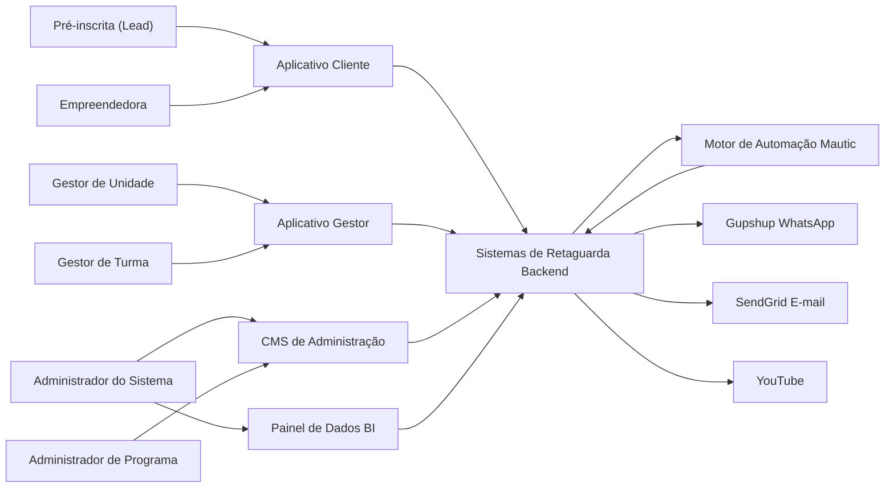

**Casos de Uso — Sistema de Gestão de Programas Sociais (Consulado da Mulher) — v5**

Documento derivado do escopo original do cliente, das reuniões de levantamento (abr./jul. 2026), do **contrato de licenciamento EWTI × Consulado da Mulher (08.05.2026)** e do modelo de referência. Versão 5 incorpora **observações v5** e as **reuniões de 13, 15 e 17/jul. 2026** (validação do protótipo, ficha unificada e gestor de unidade), mantendo a base da v4 (observações v4, reuniões 22–25/jun. 2026 e Kick-off Time Desenvolvimento). Alinhada à arquitetura **CMS de Administração + Aplicativo Cliente + Aplicativo Gestor + Painel de Dados (BI) + Sistemas de Retaguarda (Backend) + Motor de Automação (Mautic)**.

**Principais mudanças da v5:**
- **Nomenclatura tributária**: "premiação/premiado" → **"doação/contemplado"** em todo o sistema (conformidade tributária — reunião 13/jul.).
- **Papéis detalhados**: separação explícita entre **Gestor de Unidade** (analisa/classifica inscritos, aloca e move entre turmas/unidades, aprova doações, inscreve empreendedoras, acumula funções de turma) e **Gestor de Turma** (age apenas na própria turma).
- **Dois níveis de grupo WhatsApp**: unidade↔turma (gestores) e gestores↔empreendedoras.
- **Alocação automática** em unidade/turma única (facilita programas online).
- **LGPD**: anonimização automática **5 anos após o aceite** dos dados, com **revalidação de consentimento** ao retornar; base de aceites/datas; anonimização do CPF de não aprovadas **1 dia após** o fim da seleção; consulta legada por **hash de CPF**.
- **Ficha unificada** (modelo Empreender, 4 blocos), **nome social**, dados sensíveis com "prefiro não informar", renda por **salário mínimo** + valor exato, aceites obrigatórios (LGPD, cookies, WhatsApp) e formulário variável por edição.
- **Seleção híbrida**: taxa de vulnerabilidade (score) + decisão humana, edição em lote, alocação em turma durante a seleção e repescagem a qualquer momento.
- **Disparos WhatsApp manuais** (botão) para controle de custo; lembrete de inscrição incompleta após 24h.
- **Prazo de atividade**: 48h (ou prazo definido pelo gestor na liberação).
- **Visita de acompanhamento individual** (Empreende Mulher) com calendário.

---

## Atores

A lista de atores foi **enxugada na v5** (de 13 para 9): atores são apenas quem **interage** com o sistema. Cadastros gerenciados pelo sistema (Colaborador, Voluntário/Mentor, Organização) viraram **entidades de domínio**; Backend e Mautic são **camadas do sistema** (ver Plataformas do Sistema).

### Atores — Pessoas

| Ator                                       | Descrição                                                                                                                                                                                                                                                                                                                                                                                                          |
| ------------------------------------------ | ------------------------------------------------------------------------------------------------------------------------------------------------------------------------------------------------------------------------------------------------------------------------------------------------------------------------------------------------------------------------------------------------------------------ |
| **Pré-inscrita (Lead)**                    | Pessoa que iniciou o processo de inscrição mas **ainda não concluiu** a inscrição completa (UC19/UC20/UC21). Objeto do mini CRM (UC26) e dos lembretes de inscrição incompleta (24h). Torna-se **Empreendedora** ao concluir a inscrição completa (UC21). |
| **Empreendedora (Beneficiada)**            | Mulher empreendedora em situação de vulnerabilidade social, com **inscrição completa** registrada. Acessa o **Aplicativo Cliente** exclusivamente por **link mágico** (WhatsApp ou e-mail) — **não há senha** de autenticação. Realiza atualização cadastral, módulos, conteúdos, questionários, uploads, dados financeiros mensais e solicitação de desligamento (UC79). Todo registro operacional vincula-se obrigatoriamente a **programa**, **edição**, **unidade** e **turma** (turma atribuída na alocação — UC17, após seleção — UC24). |
| **Administrador do Sistema (CMS de Administração)**  | Perfil **master** com controle total: usuários, programas, unidades, migrações excepcionais e configuração global. |
| **Administrador de Programa (CMS de Administração)** | Usuário do CMS com escopo restrito a um ou mais programas/edições. Gerencia conteúdos, programas, edições (incluindo módulos associados), organizações, colaboradores e unidades do seu escopo. |
| **Gestor de Unidade (Aplicativo Gestor)** | Visão sobre **todas as turmas da unidade**. Responsabilidades exclusivas: **analisa os inscritos e classifica** em **aprovado / em análise / reprovado** (UC24), **aloca** empreendedoras em turmas (UC17), **move** empreendedora **entre turmas e entre unidades** (UC18/UC75), **aprova doações** solicitadas pelo gestor de turma (UC57), **inscreve novas empreendedoras** (UC21/UC69) e opera indicadores/acompanhamento regional. **Pode acumular todas as funções do Gestor de Turma.** Movimentações entre turma/unidade **preservam** o histórico do programa oficial, mas **atividades fora do programa oficial são perdidas**. |
| **Gestor de Turma (Aplicativo Gestor)** | **Age apenas sobre a própria turma.** Responsabilidades: **libera atividades** (com prazo de 48h ou prazo definido na liberação — UC34), **determina data e localidade** de atividades presenciais, **aprova os dados de faturamento** e entregas (UC44), **analisa as respostas de provas/testes**, **cria atividade extra** (**apenas aula/reunião presencial** — UC35), **confere uploads** de materiais das empreendedoras, **registra desistência** (UC30) e **solicita doação** (aprovação é do Gestor de Unidade — UC57). Realiza **interações de grupo WhatsApp** manualmente (UC50); edita e-mail/telefone da empreendedora. **Não** pode mover empreendedora para outra turma/unidade e **não altera temporizadores** da jornada online (UC33). Pode inserir dados em nome da empreendedora (UC69). |

### Atores — Sistemas Externos

| Ator | Descrição |
| ---- | --------- |
| **Gupshup (WhatsApp Business API)**        | Provedor de envio de mensagens WhatsApp: texto, links com login mágico, solicitações e envio de videoaulas. Acionado pelo backend ou pelo Mautic. |
| **SendGrid (E-mail)**                      | Provedor de envio de e-mails transacionais: links mágicos (UC4/UC54), lembretes de inscrição incompleta (UC26) e comunicações gerais. Acionado pelo backend. |
| **YouTube**                                | Ator secundário para videoaulas gravadas e transmissões ao vivo. |

### Entidades de domínio (não são atores)

Cadastros **gerenciados pelo sistema**, sem interação própria (sem login/interface):

- **Colaborador** — funcionário do Consulado cadastrado no CMS (UC1); é o **cadastro** que recebe os perfis de **Administrador de Programa**, **Gestor de Unidade** e/ou **Gestor de Turma** (pode acumular papéis). Quem atua nos UCs é sempre o **papel** atribuído, não o colaborador em si.
- **Voluntário / Mentor** — pessoa cadastrada (mentor ou palestrante/oficineiro) para processos de mentoria (UC70/UC73). **Não acessa o sistema**; o registro de mentoria é operado pelos gestores.
- **Organização (Patrocinador / Parceiro)** — pessoa jurídica (CNPJ) associável a uma edição como patrocinador ou parceiro (UC10/UC11). Caso se confirme visão restrita no BI para financiadores (UC59), retorna como ator secundário.

> **Convenção:** **Sistemas de Retaguarda (Backend)** e **Motor de Automação (Mautic)** são **camadas do sistema em construção** (ver Plataformas do Sistema) — não atores externos. Quando citados em casos de uso, indicam **execução automática** pelo sistema, não um usuário.

### Plataformas do Sistema

O sistema é organizado em **seis camadas funcionais**:

1. **CMS de Administração** — modelagem de programas, edições, módulos, unidades, organizações e colaboradores (implementado com Strapi).
2. **Aplicativo Gestor** — operação por **Gestor de Unidade** e **Gestor de Turma** (seleção, turmas, validação de entregas, sequência de atividades).
3. **Aplicativo Cliente** — interface da empreendedora (inscrição, atividades, uploads, dados financeiros); autenticação exclusiva por **link mágico**.
4. **Painel de Dados (BI)** — dashboards, indicadores e relatórios.
5. **Sistemas de Retaguarda (Backend)** — APIs, regras de negócio, filas, integrações (Gupshup, SendGrid), autenticação, persistência e serviços transversais.
6. **Motor de Automação (Mautic)** — orquestração de jornadas e campanhas em programas online (sequência, temporizadores, gatilhos e lembretes).

| Camada | Responsabilidade principal |
| ------ | -------------------------- |
| **Sistemas de Retaguarda (Backend)** | APIs, regras de negócio, persistência, tokens de link mágico, **UUID de dispositivo (UC67)**, integrações Gupshup/SendGrid, elegibilidade, status, certificados |
| **Motor de Automação (Mautic)** | Orquestração de jornadas online: quando disparar cada etapa, temporizadores, campanhas e lembretes (aciona o backend para execução) |

Stack contratual: Next.js, Node.js, Express, Prisma, MySQL; hospedagem AWS.

### Conceitos de Domínio (v4)

**Programa** — metodologia principal: apenas **tipo** (online ou presencial) e **descrição**. Não contém módulos diretamente; é lançado em **edições**.

**Edição** — instância operacional do programa. Define: programa vinculado, **unidades participantes**, ano de competência, nome da edição (ex.: 1º semestre, 2º semestre — podendo haver mais de uma edição por competência), datas/horas de início e fim de **inscrição**, **seleção** e **aplicação**, meta de beneficiados, **módulos** e **sequência de conteúdos**. A aplicação ocorre por módulos; módulos herdam o tipo do programa (online/presencial).

**Unidade** — agrupa pelo menos **uma turma**; colaboradores e gestores são vinculados à unidade. Na **inscrição**, a empreendedora **seleciona a unidade** de participação.

**Turma** — operacionalizada pelo **Gestor de Turma**; inscrição na turma (após seleção) **dispara** a jornada no **Mautic**, que aciona o **backend** e o **Gupshup** para envio das atividades.

**Alocação automática (unidade/turma única)** — quando a **edição** possui **apenas uma unidade**, a empreendedora é **alocada automaticamente** nessa unidade (dispensando a escolha na inscrição). Da mesma forma, quando existe **apenas uma turma**, a participante já é vinculada a ela. Essa regra facilita programas **online** (ex.: Empreende no Zap), onde não há acompanhamento presencial no consumo do curso (reunião 13/jul.).

**Identificador automático (ID)** — o sistema **gera automaticamente um ID único** para cada empreendedora/registro, eliminando o controle manual por planilhas (reunião 13/jul.).

**Doação (Contemplação)** — benefício concedido à empreendedora ao final ou durante o programa. O termo **"premiação"/"premiado" foi substituído por "doação"/"contemplado"** em todo o sistema, por conformidade tributária e alinhamento à metodologia dos programas (reunião 13/jul.). O **Gestor de Turma solicita** a doação; o **Gestor de Unidade aprova** (UC57).

**Grupos WhatsApp (dois níveis)** — a aplicação prevê **dois níveis** de grupo WhatsApp: (1) grupo entre **gestores de unidade e gestores de turma** (coordenação interna); (2) grupo entre **gestores (unidade/turma) e empreendedoras** (comunicação operacional da turma/unidade). Um gestor de unidade pode também ser gestor de turma. Ambos os gestores enviam mensagens por **ferramenta de facilitação** (copiar mensagem pré-formatada para a área de transferência + link de acesso direto ao grupo — UC50); o envio efetivo é manual, no WhatsApp.

**Módulo** — conjunto ordenado de **atividades educacionais** (ver UC15).

**Empreendimento (Negócio)** — entidade que representa o negócio da(s) empreendedora(s). Um empreendimento pode ter **N empreendedoras** associadas (UC31). Dados do empreendimento (ex.: registros financeiros mensais — UC45) tendem a **um único registro por tipo de dado** no empreendimento, independentemente de qual empreendedora vinculada submeta a informação. Regras detalhadas para múltiplos envios sobre a mesma empresa permanecem em definição.

**Vínculo obrigatório** — todo registro operacional da empreendedora associa-se a **programa**, **edição**, **unidade** e **turma**. Nas fases iniciais (lead/pré-inscrição — UC19), vinculam-se **programa**, **edição** e **unidade**; a **turma** é atribuída na alocação (UC17), após a seleção (UC24).

### Segurança de Dados Sensíveis

- **CPF**: armazenado com técnica **HMAC-SHA256 + pepper** ([referência](https://ogeradordecpf.com.br/armazenar-cpf/)); usado como chave de identificação sem armazenamento em texto claro. A busca por participantes passados ou não aprovados é feita pelo **hash do CPF** (UC62).
- **Autenticação empreendedora**: somente **link mágico** — sem senha.
- **Autenticação CMS e Aplicativo Gestor**: e-mail e senha; políticas de complexidade e expiração. **2FA**: previsto no Anexo LGPD do contrato para sistemas que processem dados do Consulado — implementação conforme exigência contratual, não bloqueante para MVP operacional (observações v3).
- **UUID de dispositivo (UC67)**: emitido após inscrição completa; localStorage; deep links com `turma_id`, `atividade_id`, `acao` — presença automática (UC40).
- **Base de consentimentos (LGPD)**: o sistema mantém **registro dos aceites** (LGPD geral, dados sensíveis, cookies/armazenamento local, comunicação/WhatsApp, uso de imagem, regulamento), com **versão do termo, data/hora e dispositivo**, além do **controle de datas de anonimização**. Essa base é a referência para o processo automático de anonimização e revalidação (UC20, UC76).
- **Anonimização automática LGPD (5 anos após o aceite)**: os dados pessoais são **anonimizados automaticamente 5 anos após a data em que a empreendedora deu o aceite** (não a partir do fim da edição). Se, após esse prazo, a empreendedora **acessar ou continuar utilizando** o sistema, é solicitado **novo aceite**, que **revalida** o consentimento e reinicia o prazo. A anonimização de **CPF, e-mail e telefone** usa técnica de **consulta reversível** por hash — preserva **histórico de participação** e aceites, sem perda analítica (UC76).
- **Anonimização de não aprovadas (1 dia após a seleção)**: o **CPF** capturado de empreendedoras **não aprovadas** é anonimizado **1 dia após o encerramento da fase de seleção**. Permanecem os **registros de participação** (transformados em hash), que podem ser **recuperados quando houver nova inscrição com aquele CPF** (UC23/UC24/UC76).
- Funcionalidades **não previstas no contrato** podem ser simplificadas ou postergadas para reduzir complexidade; reuniões de levantamento orientam priorização de necessidades dos usuários.

### Diagrama de Contexto — Frontends e Atores

### Hierarquia de Dados

**Programa → Edição → Unidade → Turma**

O **Programa** define a metodologia (tipo online/presencial). A **Edição** instancia o programa com cronograma, unidades e módulos. Cada **Unidade** possui ao menos uma **Turma**. Colaboradores vinculam-se a unidades; acesso segregado conforme LGPD.

### Base Legada (Consulta)

Os **dados legados serão carregados já anonimizados**. Servem para verificar participação em programas passados e compor totalizadores (participantes, beneficiados, certificados, contemplados), mas **não preenchem automaticamente** formulários de nova inscrição. A consulta é feita pelo **hash do CPF** dos novos participantes: informa-se um CPF e o sistema devolve as **participações em anos anteriores e em quais programas** (UC62). Dados pessoais respeitam a retenção LGPD (**anonimização 5 anos após o aceite** — UC76); aceites e histórico de participação são preservados; registros legados podem permanecer apenas como contagens consolidadas quando aplicável.

---

## Casos de Uso

Organização do fluxo operacional:

**Pré-inscrição → Inscrição → Seleção → Aprovação e Aplicação da Edição → Conclusão (Beneficiamento, Certificação, Doação/Contemplação, Mentoria)**

Com ramificações paralelas: **Cancelamento / Desistência**

Casos de uso agrupados por **plataforma/camada** e, quando aplicável, pela **fase do fluxo operacional**.

### CMS de Administração

UC1 — Cadastrar Colaborador  
UC2 — Login Administrador  
UC5 — Gerenciar Roles e Permissões  
UC6 — Configurar Autenticação e Segurança  
UC7 — Cadastrar Programa (Metodologia)  
UC8 — ~~Modelar Programa e Associar Módulos~~ *(incorporado a UC9 — módulos definidos na edição)*  
UC9 — Criar e Configurar Edição de Programa  
UC10 — Cadastrar Organização  
UC11 — Associar Organização à Edição (Patrocinador / Parceiro)  
UC12 — Configurar Regulamento e Critérios de Seleção  
UC13 — Configurar Critérios de Beneficiamento e Certificação por Edição  
UC14 — Configurar Critérios de Doação (Contemplação) por Edição (Textual)  
UC15 — Criar Módulo Educacional (Tipos de Atividade)  
UC66 — Cadastrar Unidade  
UC73 — Cadastrar Voluntário ou Mentor  
UC74 — Ativar ou Inativar Colaborador/Parceiro  
UC75 — Migrar Colaborador entre Unidades  
UC76 — Anonimizar Dados e Revalidar Consentimento (LGPD)  

### Aplicativo Gestor — Gestor de Unidade

> Acumula todas as atividades do Gestor de Turma e detém as ações exclusivas de unidade abaixo.

UC3 — Login Gestor (Aplicativo Gestor)  
UC17 — Alocar Empreendedora em Turma *(dispara jornada online — UC33)*  
UC18 — Mover Empreendedora entre Turmas e Unidades *(exclusivo do Gestor de Unidade)*  
UC24 — Selecionar e Classificar Participantes da Edição *(aprovado / em análise / reprovado)*  
UC25 — Comunicar Resultado da Seleção *(disparo manual — 1 dia após o fim da seleção)*  
UC28 — Consultar Histórico de Participação  
UC50 — Comunicar para Grupo WhatsApp *(facilitador manual — UC16/UC66)*  
UC56 — Consultar Ranking e Engajamento *(inclui gráfico por segmento)*  
UC57 — Aprovar Doação (Contemplação)  
UC58 — Analisar Elegibilidade para Capital Semente  
UC70 — Registrar Mentoria  
UC77 — Registrar Observação de Acompanhamento  

### Aplicativo Gestor — Gestor de Turma

UC16 — Criar e Gerenciar Turma *(inclui link do grupo WhatsApp)*  
UC27 — Cadastrar e Atualizar Dados da Empreendedora *(e-mail, telefone)*  
UC30 — Registrar Cancelamento ou Desistência  
UC31 — Gerenciar Empreendimento (Negócio) e Associar Empreendedoras  
UC32 — Mover Empreendedora entre Empreendimentos  
UC34 — Configurar Sequência e Atividades Presenciais por Turma *(libera atividades com prazo de 48h ou definido)*  
UC35 — Adicionar Aula Presencial Extra *(único tipo de atividade extra permitido ao gestor)*  
UC41 — Registrar Presença Manualmente  
UC42 — Consultar Frequência da Participante  
UC44 — Avaliar e Aprovar Entrega (Tarefa de Casa / Dados Financeiros)  
UC46 — Validar Dados Financeiros  
UC50 — Comunicar para Grupo WhatsApp *(facilitador manual)*  
UC56 — Consultar Ranking e Engajamento *(inclui gráfico por segmento)*  
UC57 — Solicitar Doação (Contemplação) *(aprovação do Gestor de Unidade)*  
UC69 — Inserir Dados em Nome da Empreendedora  
UC77 — Registrar Observação de Acompanhamento  
UC78 — Agendar Visita de Acompanhamento Individual *(Empreende Mulher)*  

### Aplicativo Cliente — Empreendedora

**Fase 1 — Pré-inscrição**  
UC19 — Realizar Pré-Cadastro  
UC20 — Aceitar Termos LGPD, Comunicação, Cookies e Armazenamento Local  
UC67 — Resgatar Sessão do Dispositivo (UUID e localStorage) *(MVP)*  

**Fase 2 — Inscrição**  
UC21 — Realizar Inscrição Completa *(seleção de unidade)*  
UC22 — Consultar Histórico Legado e Reutilizar Cadastro Recorrente  

**Fase 4 — Aplicação**  
UC36 — Consumir Conteúdo Educacional  
UC37 — Registrar Progresso em Videoaula  
UC38 — Assistir Aula ao Vivo (YouTube)  
UC39 — Responder Atividade (Teste de Conhecimento / Resposta Aberta)  
UC40 — Registrar Presença via QR Code ou Deep Link *(ação automática com UUID — UC67)*  
UC43 — Enviar Tarefa de Casa (Upload)  
UC45 — Enviar Registro de Dados Financeiros Mensais  
UC47 — Preencher Formulário de Indicadores (Baseline / Endline)  
UC48 — Responder Pesquisa de Avaliação (NPS / Satisfação)  
UC68 — Visualizar Calendário de Atividades  
UC72 — Exibir Alerta de Compatibilidade de Navegador  

**Fase 5 — Conclusão**  
UC63 — Consultar e Solicitar Certificado (Autoatendimento)  
UC79 — Solicitar Desligamento do Programa *(questionário + motivo)*  

### Sistemas de Retaguarda (Backend)

UC4 — Login da Empreendedora (Link Mágico) *(tokens, UUID — UC67, deep links)*  
UC23 — Validar Elegibilidade da Inscrição (Automático)  
UC29 — Classificar Status da Participante  
UC49 — Disparar Mensagem Individual via WhatsApp  
UC51 — Enviar Vídeo ou Conteúdo via WhatsApp  
UC54 — Enviar Link Mágico Personalizado  
UC55 — Classificar Beneficiamento e Emitir Certificado Automaticamente  

### Motor de Automação (Mautic)

UC33 — Orquestrar Jornada Online (sequência e temporizadores)  
UC52 — Programar Mensagens Automáticas (campanhas)  
UC53 — Enviar Lembrete por Atividade Não Concluída  

### Painel de Dados (BI)

UC59 — Consultar Dashboard de Impacto  
UC60 — Gerar Relatórios Quantitativos  
UC61 — Gerar Relatórios Qualitativos  
UC62 — Consultar Base Legada de Participação  
UC65 — Consultar Consumo de Mensagens WhatsApp  
UC71 — Consolidar Totalizadores com Dados Pregressos  

### Funcionalidades Complementares (Contrato / Evolução)

UC26 — Gerenciar Leads com Inscrição Incompleta (Mini CRM)  
UC64 — Utilizar Chat de Dúvidas (IA)  

---

## Detalhamento dos Casos de Uso

### UC1 – Cadastrar Colaborador (CMS de Administração)

**Descrição**

Permite que o **Administrador do Sistema** ou **Administrador de Programa** cadastre **colaboradores** (funcionários do Consulado) utilizando o **sistema nativo de usuários do CMS de Administração**, atribuindo perfil (Administrador de Programa, Gestor de Unidade, Gestor de Turma) e vinculando a programas, unidades e turmas.

**Atores**

- **Administrador do Sistema (CMS de Administração)**: cadastro global e migrações excepcionais.
- **Administrador de Programa (CMS de Administração)**: cadastro restrito ao escopo do seu programa.

> O **colaborador** é a **entidade cadastrada** (não um ator): recebe os perfis de Administrador de Programa, Gestor de Unidade e/ou Gestor de Turma, podendo acumular papéis.

**Pré-condições**

- Administrador autenticado no CMS de Administração.
- Roles configuradas no CMS de Administração (UC5).

**Fluxo Principal**

- O **Administrador** acessa **Configurações → Painel de Administração → Usuários** no CMS de Administração.
- Seleciona **Convidar usuário** ou **Criar novo usuário**.
- Informa nome, e-mail, perfil (Administrador de Programa, Gestor de Unidade ou Gestor de Turma), status ativo/inativo (UC74) e unidade(s) vinculada(s) (UC66).
- Associa programas, edições e turmas permitidos conforme LGPD.
- O CMS de Administração envia e-mail de convite para definição de senha.
- O colaborador define senha e passa a acessar CMS de Administração e/ou Aplicativo Gestor (UC3) conforme perfil.

**Fluxos Alternativos**

- **E-mail já cadastrado**: CMS de Administração informa duplicidade.
- **Convite pendente**: administrador reenvia convite pelo painel CMS de Administração.

**Pós-condições**

- Colaborador cadastrado no CMS de Administração, apto a operar Aplicativo Gestor conforme perfil.

**Exceções**

- **EC1**: Falha no envio de e-mail — reenvio manual pelo CMS de Administração.

---

### UC2 – Login Administrador (CMS de Administração)

**Descrição**

Acesso ao backoffice **CMS de Administração** para modelagem de programas, edições, módulos (catálogo reutilizável), organizações, conteúdos e gestão de usuários.

**Atores**

- **Administrador (CMS de Administração)**.

**Pré-condições**

- Conta CMS de Administração ativa com role Administrador.
- Navegador compatível; conexão à internet.

**Fluxo Principal**

- Usuário acessa URL do CMS de Administração Admin (`/admin`).
- Informa e-mail e senha na tela nativa de login.
- CMS de Administração valida credenciais e abre painel administrativo.

**Fluxos Alternativos**

- **Credenciais inválidas**: mensagem nativa do CMS de Administração; retry ou recuperação de senha.
- **Senha expirada**: troca obrigatória (UC6).

**Pós-condições**

- Sessão autenticada no CMS de Administração.

**Exceções**

- **EC1**: CMS de Administração indisponível — tentar mais tarde.

---

### UC3 – Login Gestor (Aplicativo Gestor)

**Descrição**

Acesso ao **Aplicativo Gestor** para operação de turmas: acompanhamento, comunicação, presença, validação e interação com empreendedoras.

**Atores**

- **Gestor de Unidade**, **Gestor de Turma**.

**Pré-condições**

- Colaborador cadastrado no CMS de Administração (UC1) com perfil Gestor de Unidade ou Gestor de Turma.

**Fluxo Principal**

- Gestor acessa URL do Aplicativo Gestor.
- Informa e-mail e senha (conta vinculada ao CMS de Administração).
- Sistema valida credenciais e role.
- Abre painel com turmas e programas associados.

**Fluxos Alternativos**

- **Sem turmas associadas**: exibe mensagem orientando contato com administrador.

**Pós-condições**

- Gestor autenticado no Aplicativo Gestor.

**Exceções**

- **EC1**: Servidor indisponível.

---

### UC4 – Login da Empreendedora (Link Mágico)

**Descrição**

Permite que a **Empreendedora** acesse o **Aplicativo Cliente** exclusivamente por **link mágico** — enviado via **WhatsApp (Gupshup)** ou **e-mail**. **Não existe senha** de autenticação. O link contém **token de sessão**; o **CPF** (HMAC-SHA256 + pepper) é a chave de identificação no backend. Sessão ativa por até **30 dias** no dispositivo. Após autenticação bem-sucedida, o sistema **persiste ou atualiza o UUID de dispositivo** no localStorage (UC67).

Links podem incluir **destino contextual** na URL: `programa`, `edição`, **turma**, **atividade** e **ação** (ex.: `presenca`, `videoaula`). Com UUID e sessão válidos, o Aplicativo Cliente **executa a ação automaticamente** (ex.: UC40 — registro de presença sem passos adicionais).

**Atores**

- **Empreendedora (Beneficiada)**.
- **Sistemas de Retaguarda (Backend)** — geração e validação de tokens; resolução de UUID; execução de ações por deep link.
- **Gupshup** / **SendGrid** — entrega do link (ator secundário).

**Pré-condições**

- Cadastro ou link vinculado ao telefone e/ou e-mail.

**Fluxo Principal**

- **Via WhatsApp**: recebe mensagem com link mágico; ao clicar, sistema identifica participante e abre Aplicativo Cliente autenticado.
- **Via E-mail**: recebe e-mail com link mágico; ao clicar, abre Aplicativo Cliente autenticado.
- Links de atividades do módulo online também contêm login mágico embutido e parâmetros de destino (UC54).
- Backend valida token; emite/atualiza **UUID de dispositivo** no localStorage (UC67).
- Se a URL indicar **turma**, **atividade** e **ação** (ex.: presença), e a participante estiver vinculada e autorizada, o sistema **executa a ação** (ex.: registra presença — UC40) e exibe confirmação.
- Sistema exibe alerta de compatibilidade de navegador quando necessário (UC72).

**Fluxos Alternativos**

- **Não cadastrada**: direciona a UC19 ou UC21; após conclusão, redireciona ao destino original da URL quando aplicável.
- **UUID presente, sessão expirada**: valida token do link ou solicita novo link mágico (UC54).
- **Link expirado**: novo envio via Gupshup ou e-mail.
- **Primeiro acesso pós-cadastro manual**: solicita aceites pendentes (UC20).
- **Ação não permitida** (ex.: presença em turma diferente): exibe mensagem e direciona à home da edição.

**Pós-condições**

- Empreendedora autenticada no Aplicativo Cliente; UUID persistido (UC67); ação de deep link executada quando aplicável.

**Exceções**

- **EC1**: Falha API Gupshup — reenvio de link por e-mail.

---

### UC5 – Gerenciar Roles e Permissões (CMS de Administração)

**Descrição**

Configura roles nativas do **CMS de Administração** e permissões por entidade, em conformidade com LGPD.

**Atores**

- **Administrador (CMS de Administração)**.

**Pré-condições**

- Administrador autenticado no CMS de Administração.

**Fluxo Principal**

- Acessa **Configurações → Painel de Administração → Funções (Roles)**.
- Edita permissões CRUD por entidade para cada role.
- Restringe escopo (programas/edições/turmas).
- Salva configuração.

**Pós-condições**

- Roles alinhadas às funções operacionais do Consulado.

---

### UC6 – Configurar Autenticação e Segurança

**Descrição**

Configura políticas de autenticação do **CMS de Administração** e **Aplicativo Gestor**: expiração e complexidade de senhas, histórico de senhas e armazenamento seguro de CPF (**HMAC-SHA256 + pepper**). **2FA** previsto no Anexo LGPD do contrato — implementação alinhada à exigência contratual, fora do escopo imediato do MVP (observações v3). A empreendedora **não utiliza senha** (apenas link mágico — UC4).

**Atores**

- **Administrador do Sistema (CMS de Administração)**.

**Pré-condições**

- Permissão de configuração global.

**Fluxo Principal**

- Define política de expiração, complexidade e histórico de senhas para colaboradores/gestores.
- Configura pepper e política de hash para CPF.
- Registra configuração de 2FA para fase contratual posterior, se aplicável.

**Pós-condições**

- Políticas de segurança ativas para CMS e Aplicativo Gestor.

---

### UC7 – Cadastrar Programa (Metodologia)

**Descrição**

Cadastra a **metodologia** do programa social no CMS de Administração: **tipo** (online ou presencial) e **descrição**. O programa não contém módulos nem cronograma — estes são definidos na **edição** (UC9).

**Atores**

- **Administrador (CMS de Administração)**.

**Pré-condições**

- Autenticado no CMS com permissão de gestão de programas.

**Fluxo Principal**

- Acessa **Programas → Criar**.
- Informa nome, slug, **tipo** (online / presencial) e descrição da metodologia.
- Salva programa.

**Pós-condições**

- Programa disponível para criação de edições (UC9).

**Exceções**

- **EC1**: Slug duplicado — solicita alteração.

---

### UC8 – Modelar Programa e Associar Módulos *(incorporado a UC9)*

**Descrição**

*Caso de uso absorvido por UC9 na v3.* Módulos e sequência de conteúdos passam a ser configurados na **edição**, não no programa. O programa define apenas metodologia (tipo e descrição — UC7).

**Pós-condições**

- Utilizar UC9 para associação de módulos à edição.

---

### UC9 – Criar e Configurar Edição de Programa

**Descrição**

Cria **edição** do programa: instância operacional com cronograma completo. Pode haver **mais de uma edição por ano de competência** (ex.: 1º semestre, 2º semestre). Herda o **tipo** do programa (online/presencial).

**Atores**

- **Administrador (CMS de Administração)**, **Gestor de Unidade** (consulta).

**Pré-condições**

- Programa cadastrado (UC7); módulos criados (UC15); regulamento aprovado.

**Fluxo Principal**

- Seleciona **programa** vinculado.
- Seleciona **unidades participantes** (UC66).
- Informa **ano de competência**, **nome da edição** (ex.: 1º semestre 2027), **meta de beneficiados**.
- Define datas/horas de início e fim: **inscrição**, **seleção** e **aplicação** da edição.
- Associa um ou mais **módulos** e define **sequência de conteúdos/atividades**.
- Anexa regulamento; publica URL de inscrição (slug).

**Pós-condições**

- Edição apta às fases de inscrição, seleção e aplicação por módulos.

---

### UC10 – Cadastrar Organização

**Descrição**

Cadastra **organização** (pessoa jurídica): patrocinadores, parceiros institucionais, unidades executoras.

**Atores**

- **Administrador (CMS de Administração)**.

**Pré-condições**

- Permissão de cadastro institucional.

**Fluxo Principal**

- Acessa **Organizações → Criar**.
- Informa razão social, CNPJ, tipo, localização e responsável.
- Registra papel no tratamento de dados (controlador/operador) quando aplicável.
- Salva organização.

**Pós-condições**

- Organização disponível para associação a edições (UC11).

---

### UC11 – Associar Organização à Edição (Patrocinador / Parceiro)

**Descrição**

Vincula organização a uma **edição** como **patrocinador** ou **parceiro** executor.

**Atores**

- **Administrador (CMS de Administração)**.

**Pré-condições**

- Organização (UC10) e edição (UC9) existentes.

**Fluxo Principal**

- Seleciona edição → **Organizações vinculadas**.
- Adiciona organização e define papel (patrocinador / parceiro executor).
- Salva vínculo.

**Pós-condições**

- Organização associada à edição com papel definido.

---

### UC12 – Configurar Regulamento e Critérios de Seleção

**Descrição**

Define critérios automáticos e manuais de elegibilidade (idade, **renda per capita**, região, tempo de empreendimento, carência de doação). A **renda** é avaliada por **faixas baseadas no salário mínimo nacional** (atualização automática do valor de referência) cruzada com o **número de dependentes** para calcular a **renda per capita** — critério essencial de vulnerabilidade (reuniões 13 e 15/jul.). Critérios firmes definidos aqui alimentam a **pré-seleção assistida** e o cálculo da **taxa de vulnerabilidade** (UC24). Os critérios podem variar por **região/edição** (flexibilidade regional).

**Atores**

- **Administrador (CMS de Administração)**, **Gestor de Turma**.

**Pré-condições**

- Edição criada (UC9).

**Fluxo Principal**

- Configura travas automáticas e critérios de desempate.
- Indica restrições geográficas (rígidas ou flexíveis).
- Persiste regras para UC23 e UC24.

**Fluxos Alternativos**

- **Flexibilidade operacional**: critério como "alerta" em vez de bloqueio.

**Pós-condições**

- Critérios disponíveis para validação e seleção.

---

### UC13 – Configurar Critérios de Beneficiamento e Certificação por Edição

**Descrição**

Parametriza percentuais: beneficiada (ex.: 50%), certificada (ex.: 75%), conclusão integral (100%).

**Atores**

- **Administrador (CMS de Administração)**, **Gestor de Turma**.

**Pré-condições**

- Edição ativa com módulos e sequência definidos (UC9).

**Fluxo Principal**

- Define percentuais e tipos de atividade que contam.
- Define aplicação automática vs. validação manual de exceções.
- Sistema usa regras em UC29 e UC55.

**Pós-condições**

- Regras de beneficiamento e certificação parametrizadas.

---

### UC14 – Configurar Critérios de Doação (Contemplação) por Edição (Textual)

**Descrição**

Define critérios **textuais** de elegibilidade à **doação (contemplação)** para orientar a decisão do gestor. O termo **"premiação" foi substituído por "doação"** por conformidade tributária (reunião 13/jul.). Não há controle ou ranking automático — a contemplação é **solicitada** pelo Gestor de Turma e **aprovada** pelo Gestor de Unidade no **Aplicativo Gestor** (UC57), com base nos critérios descritos e no histórico da participante.

**Atores**

- **Administrador (CMS de Administração)**, **Gestor de Unidade**.

**Pré-condições**

- Edição configurada; regulamento de doação aprovado.

**Fluxo Principal**

- Acessa edição → **Critérios de Doação**.
- Redige critérios textuais (ex.: engajamento mínimo, entregas no prazo, carência de 3 anos, top N, desempate).
- Publica critérios para consulta do gestor no Aplicativo Gestor durante UC57.

**Pós-condições**

- Critérios textuais de doação disponíveis para decisão manual.

---

### UC15 – Criar Módulo Educacional (Tipos de Atividade)

**Descrição**

Cria **módulo** como conjunto ordenado de **atividades educacionais**. Herda o tipo do programa (online/presencial) quando associado à edição. Tipos de atividade suportados:

| Tipo | Descrição |
| ---- | --------- |
| Aula/reunião presencial | Encontro com local, data, hora e detalhes (configurados pelo gestor de turma — UC34) |
| Videoaula pré-gravada | Conteúdo YouTube |
| Videoaula ao vivo (live) | Transmissão YouTube |
| Teste de conhecimento | Questionário com feedback explicativo |
| Resposta aberta | Texto livre |
| Ferramenta de download | Material para download |
| Tarefa de casa | Descrição da atividade + upload de documentos *(aprovação obrigatória — UC44)* |
| Link externo | Redirecionamento |
| Certificado | Emissão automática ao concluir critérios |
| Registro de dados financeiros | Faturamento, renda, investimento, poupança, despesas, nº clientes, nº produtos vendidos + upload *(aprovação obrigatória — UC44)* |
| Temporizador | Intervalo entre atividades da jornada **online** (UC33). Configurado no **CMS** (UC15); **não editável** pelo gestor de turma. Aplica-se somente a programas online, onde não há gestor acompanhando cada etapa em tempo real. |
| Texto aberto | Mensagem via WhatsApp (jornada online — UC33) |

**Atores**

- **Administrador (CMS de Administração)**.

**Pré-condições**

- Autenticado no CMS de Administração.

**Fluxo Principal**

- Acessa **Módulos → Criar**.
- Adiciona atividades na sequência desejada.
- Salva módulo reutilizável em edições (UC9).

**Pós-condições**

- Módulo disponível para associação a edições (UC9).

---

### UC16 – Criar e Gerenciar Turma

**Descrição**

Cria turmas vinculadas a **edição** e **unidade** (UC66). Cada unidade possui **ao menos uma turma**. Vincula **gestores de turma** responsáveis pela operacionalização. Permite registrar o **link de convite do grupo WhatsApp** da turma (propriedade institucional) para uso no facilitador manual de comunicação (UC50).

**Atores**

- **Gestor de Turma (Aplicativo Gestor)**, **Administrador (CMS de Administração)**.

**Pré-condições**

- Edição configurada; módulos e sequência associados (UC9).

**Fluxo Principal**

- Cria turma com nome, região, gestor, vagas, datas.
- Informa **link do grupo WhatsApp** da turma (URL de convite `https://chat.whatsapp.com/...` ou equivalente), quando existir.
- Opcionalmente define **modelo de mensagem** para o grupo (texto com placeholders, ex.: `{local}`, `{data}`, `{hora}`, `{nome_edicao}`) reutilizado em UC50.
- Associa participantes após seleção (UC17).

**Fluxos Alternativos**

- **Grupo ainda não criado**: turma pode ser salva sem link; gestor atualiza quando o grupo estiver disponível no WhatsApp.
- **Grupo criado manualmente**: gestor cria o grupo no WhatsApp (número institucional), adiciona participantes fora do sistema e registra apenas o link de convite no Aplicativo Gestor.

**Pós-condições**

- Turma pronta para aplicação da edição (Fase 4); link do grupo disponível para UC50 quando informado.

---

### UC17 – Alocar Empreendedora em Turma

**Descrição**

Aloca participantes **selecionadas** em turma. Pode ocorrer **durante a seleção** (UC24, ex.: no agendamento da entrevista). Em programas **online**, a inscrição na turma dispara webhook ao **Mautic** para iniciar a jornada (UC33). Quando a edição/unidade possui **turma única**, a alocação é **automática**.

**Atores**

- **Gestor de Unidade (Aplicativo Gestor)** — responsável pela alocação.

**Pré-condições**

- Status "aprovada/selecionada" (UC24); turma com vagas (ou turma única — alocação automática).

**Fluxo Principal**

- Filtra selecionadas por região/perfil.
- Aloca em turma e confirma.
- Sistema dispara boas-vindas (UC49).

**Pós-condições**

- Participante vinculada à turma.

---

### UC18 – Mover Empreendedora entre Turmas e Unidades

**Descrição**

Move participante entre **turmas** e entre **unidades**, preservando o **histórico do programa oficial**. **Ação exclusiva do Gestor de Unidade** — o Gestor de Turma **não pode** mover empreendedoras (observações v5). **Atenção:** ao mover, **atividades fora do programa oficial** (ex.: aulas/atividades extras da turma de origem) **são perdidas**.

**Atores**

- **Gestor de Unidade (Aplicativo Gestor)**.

**Pré-condições**

- Participante ativa; turma/unidade de destino compatível.

**Fluxo Principal**

- Seleciona participante → **Mover turma/unidade**.
- Escolhe turma e/ou unidade de destino e registra motivo.
- Sistema alerta sobre a **perda de atividades fora do programa oficial**.
- Notifica gestores envolvidos.

**Pós-condições**

- Vínculo atualizado; histórico do programa oficial preservado; atividades extras da origem descartadas.

---

### UC19 – Realizar Pré-Cadastro (Captura Inicial de Lead)

**Descrição**

Primeira etapa (mini CRM): captura nome, telefone, e-mail e os **aceites obrigatórios** (LGPD, cookies/armazenamento e **autorização de contato via WhatsApp**) antes do formulário completo. O **aceite de contato via WhatsApp é obrigatório** nesta etapa (reunião 13/jul.), permitindo que a equipe **resgate** empreendedoras que não concluíram o processo (UC26). Durante o fluxo incompleto, o sistema pode persistir **progresso temporário** no dispositivo; o **UUID definitivo** de identificação do dispositivo é emitido somente após **inscrição completa** (UC21) — ver UC67.

> Observação: a página de captura é controlada apenas na **ficha de inscrição** (não no site institucional), o que limita a fragmentação da coleta nesta etapa (reunião 15/jul.).

**Atores**

- **Pré-inscrita (Lead)**.

**Pré-condições**

- Edição com inscrições abertas; URL acessível (slug da edição).

**Fluxo Principal**

- Acessa link da edição (slug).
- Visualiza indicador de progresso (etapa 1 de N).
- Aceita, de forma **obrigatória**, os termos de **LGPD**, **cookies/armazenamento local** e **contato via WhatsApp** (UC20).
- Informa nome, telefone e e-mail.
- Sistema registra lead "pré-cadastro concluído" e, se consentido, persiste **progresso da inscrição** no **localStorage** (etapa pendente — UC67).
- Direciona para inscrição completa (UC21).

**Fluxos Alternativos**

- **Retorno pelo mesmo slug (UC67)**: se UUID válido já existir (inscrição concluída), reconhece participante e direciona conforme status; se apenas progresso incompleto, retoma UC21 na etapa pendente.
- **Aceite obrigatório não marcado** (LGPD, cookies ou WhatsApp): bloqueia continuidade.
- **Abandono**: lead disponível em UC26; **lembrete de inscrição incompleta** pode ser disparado (e-mail e/ou WhatsApp após 24h — UC26/UC53), de forma **manual** para controle de custo.

**Pós-condições**

- Lead capturado conforme consentimentos registrados; progresso disponível para retomada (UC67).

---

### UC20 – Aceitar Termos LGPD, Comunicação, Cookies e Armazenamento Local

**Descrição**

Registra aceites em uma **base de consentimentos** dedicada. São **obrigatórios** para avançar/enviar a inscrição: **LGPD (global)**, **armazenamento de cookies/localStorage** no dispositivo e **autorização de contato via WhatsApp** — o não preenchimento de qualquer um **impede a continuidade** (reuniões 13 e 15/jul.). Há ainda aceites específicos: **tratamento de dados sensíveis** (raça/cor, religião, deficiência), **uso de imagem e autorização de divulgação**, **regulamento da edição** e **recebimento de comunicados gerais** (estes com granularidade própria).

O **regulamento completo** é disponibilizado por **hiperlink/PDF** (não no corpo da página), com **aceite específico ao final** do formulário (reunião 15/jul.). A base de consentimentos guarda **versão do termo, data/hora, dispositivo e finalidade**, servindo de referência para **anonimização e revalidação** (UC76).

**Atores**

- **Pré-inscrita (Lead)**, **Empreendedora**, **Gestor** (cadastro manual).

**Pré-condições**

- Fluxo de inscrição ou cadastro manual no Aplicativo Cliente.

**Fluxo Principal**

- Apresenta termos integrados ao fluxo, incluindo uso de cookies e localStorage para **UUID de dispositivo** (UC67), retomada de inscrição e sessão persistente.
- Exige os aceites obrigatórios (LGPD, cookies/armazenamento, WhatsApp) antes de avançar.
- Coleta o **aceite de dados sensíveis**; se recusado, os dados sensíveis são registrados como **"não informado"**, **não exibidos** em perfis nem usados no BI (UC21).
- Apresenta o **aceite de regulamento** ao final (link/PDF) e aceites de uso de imagem/divulgação e comunicados gerais.
- Registra cada aceite com **data/hora, versão do termo, finalidade e dispositivo** na base de consentimentos.

**Fluxos Alternativos**

- **Cadastro manual**: envia link de aceite via WhatsApp.
- **Cookies/localStorage recusados**: permite fluxo mínimo, mas sem retomada automática via dispositivo (UC67).
- **Revalidação (UC76)**: se o consentimento já expirou (5 anos após o aceite), solicita novo aceite antes de prosseguir.

**Pós-condições**

- Aceites registrados na base de consentimentos conforme LGPD e política de privacidade.

---

### UC21 – Realizar Inscrição Completa

**Descrição**

Conclui inscrição **via Aplicativo Cliente** com indicador visual de progresso. A **ficha é unificada** (padrão do programa **Empreender**), organizada em **4 blocos** (reuniões 13 e 15/jul.):

1. **Instruções** — bloco inicial de texto **editável no CMS** por edição.
2. **Dados pessoais** — **nome de registro** (para documentos) e **nome social** (para comunicação), CPF, nascimento, sexo, escolaridade, **raça/cor** e demais dados sensíveis, endereço com **busca automática por CEP**. Campos de **dados sensíveis** (raça/cor, religião, deficiência) trazem obrigatoriamente a opção **"prefiro não informar"**; sem consentimento (UC20), o dado é gravado como **"não informado"** e **não** aparece em perfis nem no BI.
3. **Dados do empreendimento** — ramo/segmento de atividade, tempo de existência, **informal ou MEI**, faturamento médio (categorias mantidas/editáveis no CMS); **conectividade e redes sociais** (Instagram/Facebook/TikTok) para uso futuro em catálogo/marketplace.
4. **Dados econômicos/socioeconômicos** — **renda familiar por faixas de salário mínimo** + **valor exato da renda** (para desempate e análise de vulnerabilidade; valor real visível aos coordenadores), número de **dependentes** para renda per capita.

Ao final, apresenta os **aceites** (regulamento por link/PDF, uso de imagem/divulgação, comunicados gerais — UC20). Pode existir um **formulário variável** e um **"Guia do Participante"** por edição, com perguntas específicas que aparecem apenas quando configuradas — **não** contabilizadas no BI (para não afetar a comparabilidade). Valida **CEP** para elegibilidade geográfica; aceita **CPF** ou **RNE/outro documento** para estrangeiras; **CNPJ/MEI** obrigatório quando exigido pela edição (ex.: BNDES). O sistema **gera um ID automático** para a empreendedora.

**Atores**

- **Pré-inscrita (Lead)** — ao concluir, torna-se **Empreendedora**; **Empreendedora** (inscrição recorrente — UC22).

**Pré-condições**

- Pré-cadastro (UC19); aceites (UC20).

**Fluxo Principal**

- Acessa formulário **via Aplicativo Cliente** com barra de progresso (4 blocos).
- **Seleciona a unidade** de participação entre as unidades da edição — **exceto** quando a edição possui **unidade única**, caso em que a alocação de unidade é **automática** (alocação automática de domínio).
- Preenche dados pessoais (nome de registro + **nome social**, dados sensíveis com "prefiro não informar", CEP com autopreenchimento), empreendimento e dados econômicos (faixa de salário mínimo + valor exato + dependentes).
- Valida CPF (HMAC-SHA256 + pepper), endereço (CEP), perfil socioeconômico; campo CPF ou RNE/outro documento para estrangeiras.
- Sistema exibe **consulta somente leitura** de participação em programas passados por **hash de CPF** (UC62), sem pré-preencher cadastro.
- Aceites finais (regulamento por link/PDF, uso de imagem, comunicados gerais — UC20).
- Registra inscrição vinculada a **programa**, **edição** e **unidade** (selecionada ou automática) — status "finalizada — aguardando seleção"; **gera ID automático**.
- Backend emite **UUID de dispositivo** vinculado à participante e ao par **programa + edição**; Aplicativo Cliente persiste o UUID no **localStorage** (UC67).
- Exibe confirmação com status **"em seleção"** e **prazo estimado de resposta calculado automaticamente** a partir das datas da edição (sem edição manual — reunião 13/jul.).

**Fluxos Alternativos**

- **Recorrente (UC22)**: pré-preenche dados já validados e solicita atualização dos demais campos; ao concluir, atualiza ou reemite UUID (UC67).
- **Programa Pílulas**: fluxo simplificado com aprovação imediata quando configurado na edição.
- **Turma única**: alocação automática em turma quando a edição/unidade possui apenas uma turma (facilita programas online).
- **Incompleta**: retomada via UUID/progresso no localStorage (UC67) ou link personalizado (UC54); lembrete manual em UC26 (após 24h).

**Pós-condições**

- Inscrição elegível a UC23/UC24; **UUID persistido** no dispositivo para retornos futuros (UC67); confirmação com status "em seleção" e prazo estimado exibido.

**Exceções**

- **EC1**: Edição encerrada durante preenchimento.

---

### UC22 – Consultar Histórico Legado e Reutilizar Cadastro Recorrente

**Descrição**

Participante já cadastrada valida/atualiza dados ao se inscrever novamente. O sistema consulta a **base legada** por **hash de CPF** (UC62) e o histórico unificado para **exibir** participação em programas passados, mas **não pré-preenche** automaticamente o formulário de nova inscrição com dados legados. Como a base histórica já supre a verificação de participação anterior, a **pergunta de "já participou" tende a ser dispensada** na ficha (em avaliação — reunião 15/jul.).

**Atores**

- **Empreendedora**.

**Pré-condições**

- CPF/telefone na base unificada ou legada.

**Fluxo Principal**

- Sistema identifica recorrência pelo CPF.
- Exibe alerta informativo de programas anteriores (somente leitura).
- Pré-preenche apenas dados já validados na base ativa do sistema.
- Solicita confirmação/atualização dos demais campos.
- Registra nova inscrição vinculada ao histórico (UC28).

**Pós-condições**

- Cadastro atualizado na base ativa; histórico preservado; dados legados não importados automaticamente.

---

### UC23 – Validar Elegibilidade da Inscrição (Automático)

**Descrição**

Aplica critérios de UC12 sobre inscrições finalizadas e calcula a **taxa de vulnerabilidade** (score) usada como apoio à decisão humana na seleção (UC24). Processamento realizado pelo **backend** (regras de negócio). O modelo é **híbrido**: o sistema **sinaliza** dados e score, mas **não substitui** o julgamento humano (reunião 17/jul.).

**Atores**

- **Sistemas de Retaguarda (Backend)**; **Gestor de Unidade** (consulta).

**Pré-condições**

- Inscrição finalizada (UC21); critérios configurados (UC12).

**Fluxo Principal**

- Valida CPF (por hash), duplicidade, **renda per capita** (faixa de salário mínimo × dependentes), região, recorrência (base legada por hash — UC62).
- Calcula a **taxa de vulnerabilidade** e classifica: elegível, elegível com alerta ou inelegível.

**Pós-condições**

- Inscrições classificadas e com **score de vulnerabilidade** disponível para a seleção (UC24).

---

### UC24 – Selecionar e Classificar Participantes da Edição

**Descrição**

O **Gestor de Unidade** analisa as inscritas da **edição** e as **classifica** em **aprovado**, **em análise** ou **reprovado** (reunião 17/jul.), assistido por **filtros**, **taxa de vulnerabilidade** (UC23), histórico e **entrevistas**. Modelo **híbrido**: o score agiliza, mas a decisão é humana. A interface permite **edição em lote** (classificar múltiplas participantes sem abrir ficha a ficha) e **edição de status direto na lista**. A **entrevista** é usada como filtro/orientação (confirmar dados, explicar o programa, alinhar expectativas) — nem todos os programas a realizam (ex.: Empreende no Zap não; Empreende Mulher usa dinâmica de grupo). Durante a seleção, é possível **alocar a participante em turma** (ex.: no agendamento da entrevista — UC17). Documentos podem ser **anexados** durante a entrevista.

**Atores**

- **Gestor de Unidade (Aplicativo Gestor)**.

**Pré-condições**

- Inscrições validadas com score (UC23).

**Fluxo Principal**

- Painel com totais, **filtros** e **taxa de vulnerabilidade** por inscrita.
- Seleciona múltiplos perfis e classifica **em lote** (aprovado / em análise / reprovado) ou abre ficha individual para análise/entrevista.
- Aloca aprovadas em turma quando aplicável (UC17); anexa documentos da entrevista.
- Confirma aprovadas/reprovadas para comunicação (UC25).

**Fluxos Alternativos**

- **Volume superior à meta**: seleciona número maior que vagas finais (ex.: 50–60 para meta de 40).
- **Repescagem**: permite selecionar/alocar participantes **a qualquer momento**, inclusive após o início das turmas, para substituir desistentes e cumprir metas (reunião 17/jul.).
- **Critérios flexíveis por região**: pesos/critérios podem variar conforme a vulnerabilidade da turma/região.

**Pós-condições**

- Participantes classificadas; aprovadas eventualmente já alocadas em turma; lista pronta para comunicação (UC25).

---

### UC25 – Comunicar Resultado da Seleção

**Descrição**

Comunica aprovação, reprovação ou lista de espera via WhatsApp. O **disparo é manual** (botão), acionado pelo **Gestor de Unidade** no Aplicativo Gestor para **controle de custo/autonomia** (reuniões 15 e 17/jul.); a execução ocorre pelo **backend** (Gupshup) com **templates aprovados na Meta**. Por regra, os disparos de aprovação/reprovação devem ocorrer **1 dia após o encerramento da fase de seleção** (ou conforme definição do edital — observações v5). O sistema **sinaliza** quando a janela de comunicação está disponível.

**Atores**

- **Gestor de Unidade** (disparo manual); **Sistemas de Retaguarda (Backend)**; **Gupshup**.

**Pré-condições**

- Seleção concluída (UC24); fase de seleção encerrada há pelo menos 1 dia (ou conforme edital); templates aprovados na Meta.

**Fluxo Principal**

- Sistema habilita o botão de disparo 1 dia após o fim da seleção (ou data do edital).
- Gestor de Unidade dispara templates aprovados (individual ou **lote**).
- Registra histórico de comunicação.
- **1 dia após o fim da seleção**, o **CPF das não aprovadas é anonimizado** (UC76), preservando o registro de participação por hash.

**Pós-condições**

- Participantes informadas; CPF de não aprovadas anonimizado no prazo.

**Exceções**

- **EC1**: Falha no envio — retry ou novo disparo manual.

---

### UC26 – Gerenciar Leads com Inscrição Incompleta (Mini CRM)

**Descrição**

**CRM básico** no Aplicativo Gestor que **visualiza pré-inscrições abandonadas**, **exporta listas de contatos** e permite o **reengajamento** de leads que **autorizaram comunicação** (WhatsApp obrigatório na pré-inscrição — UC19). O **disparo do lembrete é manual** (botão), para **controle de custo**, em vez de automação programada (reuniões 15 e 17/jul.). O lembrete de inscrição incompleta segue o consenso de **disparo após 24h**; prioriza-se inicialmente **e-mail** (mais barato), com **WhatsApp** disponível (mensagem de marketing, custo unitário mais alto). O sistema disponibiliza botões de **exportação** e **disparo** (com sinalização de funcionalidades de envio previstas para etapa posterior).

**Atores**

- **Gestor de Unidade**, **Gestor de Turma (Aplicativo Gestor)**.

**Pré-condições**

- Aceite de comunicação/WhatsApp (UC19); inscrição incompleta.

**Fluxo Principal**

- Filtra por programa, edição, etapa de abandono.
- **Exporta** lista de contatos ou **dispara manualmente** o lembrete (e-mail e/ou WhatsApp após 24h) com link personalizado (UC54).
- Registra conversões.

**Pós-condições**

- Leads reengajados; taxa de conversão mensurável; custo de envio controlado pelo disparo manual.

---

### UC27 – Cadastrar e Atualizar Dados da Empreendedora

**Descrição**

Autoatualização pela empreendedora **via Aplicativo Cliente** ou edição pelo **Gestor de Turma** no Aplicativo Gestor. O **CPF** (hash), uma vez validado, **não pode ser alterado** pela empreendedora. O **gestor de turma** pode alterar **e-mail** e **DDD + telefone**. A **mudança de unidade/turma** é **exclusiva do Gestor de Unidade** (UC18). Todo registro vincula-se a **programa**, **edição**, **unidade** e **turma**.

**Atores**

- **Empreendedora**, **Gestor de Turma**.

**Pré-condições**

- Vinculada a programa/edição/unidade/turma.

**Fluxo Principal**

- **Empreendedora**: edita dados cadastrais via Aplicativo Cliente, exceto CPF validado.
- **Gestor de Turma**: edita e-mail e telefone no Aplicativo Gestor; demais campos exigem justificativa e log de auditoria. Mudança de unidade/turma somente pelo Gestor de Unidade (UC18).

**Fluxos Alternativos**

- **Inserção em nome da empreendedora (UC69)**: gestor registra dados quando a participante não consegue acessar o Aplicativo Cliente.

**Pós-condições**

- Dados atualizados conforme permissões; vínculos programa/edição/unidade/turma preservados.

---

### UC28 – Consultar Histórico de Participação

**Descrição**

Linha do tempo de programas, edições, status, certificações e indicadores.

**Atores**

- **Gestor**, **Gestor de Turma**, **Administrador**, **Empreendedora** (visão própria).

**Pré-condições**

- Cadastro na base unificada.

**Fluxo Principal**

- Busca por CPF/nome/telefone.
- Exibe histórico consolidado da base ativa e consulta legada (UC62).

**Pós-condições**

- Visão para seleção, mentoria e BI.

---

### UC29 – Classificar Status da Participante

**Descrição**

Status: pré-inscrita, inscrita, selecionada, em assessoria, beneficiada, certificada, contemplada, emancipada, descontinuada/desistente.

**Atores**

- **Sistemas de Retaguarda (Backend)** — cálculo automático conforme regras.
- **Gestor de Turma** — ajustes manuais de exceção.

**Pré-condições**

- Participante vinculada a edição/turma; critérios UC13.

**Fluxo Principal**

- Cálculo automático conforme frequência e entregas.
- Gestor ajusta exceções manualmente.

**Pós-condições**

- Status refletido em relatórios.

---

### UC30 – Registrar Cancelamento ou Desistência

**Descrição**

Registra **cancelamento** (pela gestão) ou **desistência/desligamento** (solicitado pela participante — UC79) com **motivo** para indicadores qualitativos. Captura um **campo fechado/padronizado** (para o BI) **e** um **campo aberto** de descrição, além da **data da desistência** (permitindo **datas retroativas** para manter a precisão histórica — reunião 13/jul.). Atualiza status para descontinuada/desistente (UC29) e **retira a participante das automações e programas** (interrompe liberações e lembretes).

**Atores**

- **Empreendedora** (solicita via Aplicativo Cliente — UC79), **Gestor de Unidade**, **Gestor de Turma**.

**Pré-condições**

- Interrupção de participação identificada ou solicitação da participante.

**Fluxo Principal**

- Seleciona tipo (cancelamento/desistência), **motivo padronizado (campo fechado)** e **observações (campo aberto)**.
- Registra **data da desistência** (aceita retroativa) e elegibilidade remanescente (ex.: manter como beneficiada parcial).
- Sistema atualiza status, **remove a participante das automações/jornadas** e notifica o gestor da turma.

**Pós-condições**

- Cancelamento/desistência categorizada; participante fora das automações; fluxo operacional encerrado.

---

### UC31 – Gerenciar Empreendimento (Negócio) e Associar Empreendedoras

**Descrição**

Cadastra **empreendimento** (negócio individual ou coletivo) e **associa empreendedoras**. Relação **N empreendedoras → 1 empreendimento** quando coletivo. O gestor pode vincular uma empreendedora a um empreendimento existente ou **adicionar empreendedora** a um empreendimento já cadastrado. Cada **empreendedora** permanece contabilizada individualmente nos relatórios de participação.

Dados do empreendimento (ex.: **registros financeiros mensais** — UC45) tendem a **um único registro por tipo de dado** no empreendimento, independentemente de qual empreendedora vinculada submeta a informação. Regras para múltiplos envios sobre a mesma empresa **ainda em definição** — o sistema deve evitar duplicidade operacional por padrão.

**Atores**

- **Gestor de Turma (Aplicativo Gestor)**.

**Pré-condições**

- Empreendedoras vinculadas à turma/edição (programa + edição + unidade + turma).

**Fluxo Principal**

- Cria empreendimento (nome, CNPJ opcional, segmento) ou localiza existente.
- **Associa** uma ou mais empreendedoras ao empreendimento.
- **Adiciona** nova empreendedora a empreendimento coletivo existente.

**Pós-condições**

- Empreendimento e vínculos registrados; dados compartilhados conforme regra de unicidade por tipo.

---

### UC32 – Mover Empreendedora entre Empreendimentos

**Descrição**

Permite ao **Gestor de Turma** transferir empreendedora de um empreendimento para outro, preservando histórico individual da participante. Dados já registrados no empreendimento de origem permanecem vinculados ao empreendimento (não duplicados na participante).

**Atores**

- **Gestor de Turma (Aplicativo Gestor)**.

**Pré-condições**

- Empreendedora associada a empreendimento de origem.

**Fluxo Principal**

- Localiza participante → **Mover empreendimento**.
- Seleciona empreendimento destino ou cria novo.
- Registra motivo e data.

**Pós-condições**

- Vínculo atualizado; rastreabilidade mantida.

---

### UC33 – Orquestrar Jornada Online (Mautic)

**Descrição**

Em módulos de programas **online**, o **Motor de Automação (Mautic)** orquestra a sequência de atividades após a **inscrição da empreendedora na turma** (UC17): define gatilhos, **temporizadores entre etapas** e etapas da campanha. O **backend** executa as ações concretas (geração de link mágico — UC54, chamadas ao Gupshup — UC49/UC51, persistência de progresso).

**Modelo de liberação intercalada:** cada atividade online é liberada após cumprimento da anterior e decorrido o **temporizador** configurado no módulo (UC15). O temporizador **só se aplica a programas online** — onde não há gestor acompanhando atividades em tempo real. O **gestor de turma não pode alterar** temporizadores nem cadência da jornada online; em programas presenciais, conduz a sequência no Aplicativo Gestor (UC34).

**Envio de videoaulas via WhatsApp:** atividades do tipo videoaula exigem **resposta da empreendedora** (confirmação/solicitação) antes do envio dos vídeos como mídia. Uma vez recebida a resposta, o backend envia **todos os vídeos ainda não enviados**, consultando a tabela `tab_empreendedor_atividade` com filtros: `programa_id`, `edicao_id`, `unidade_id`, `turma_id` e `status = 'atividade_liberada'`.

Tipos de etapa: texto aberto, solicitação de videoaula, envio de videoaula, link para atividade no Aplicativo Cliente, temporizador.

**Atores**

- **Motor de Automação (Mautic)** — orquestração da jornada.
- **Sistemas de Retaguarda (Backend)** — execução de envios e registro de dados.
- **Gupshup** — entrega WhatsApp.
- **Gestor de Turma** — condução em programas **presenciais** (UC34); **sem** permissão para alterar temporizadores online.

**Pré-condições**

- Edição online com módulo e sequência definidos (UC9); empreendedora inscrita na turma (UC17).

**Fluxo Principal**

- Mautic inicia jornada no evento "inscrição em turma" (webhook do backend).
- Agenda etapas conforme sequência do módulo e **temporizadores definidos no CMS** (UC15).
- Para cada etapa liberada, aciona o **backend** para gerar links (UC54) e enviar via Gupshup quando aplicável.
- Em etapas de videoaula: aguarda resposta da empreendedora; ao receber, dispara envio em lote dos vídeos pendentes (UC51).
- Backend registra entregas e progresso em `tab_empreendedor_atividade` para UC29 e UC55.

**Fluxos Alternativos**

- **Presencial**: gestor de turma define sequência e conduz atividades no Aplicativo Gestor (UC34), podendo reordenar encontros presenciais e adicionar **aulas presenciais** extras (UC35) — **sem** temporizador automatizado.

**Pós-condições**

- Jornada online em execução; atividades entregues conforme cadência do módulo; vídeos enviados após confirmação da participante.

---

### UC34 – Configurar Sequência e Atividades Presenciais por Turma

**Descrição**

O **Gestor de Turma** define a **sequência de atividades presenciais** a ser realizada na turma, **libera atividades**, configura dados de **aulas/reuniões presenciais** (local, data, hora, descrição/detalhes) e prazos. **Prazo de realização:** ao **liberar** uma atividade, vale **48 horas** por padrão **ou** um **prazo predeterminado pelo gestor** no momento da liberação (observações v5). Calendário visual no Aplicativo Gestor e Aplicativo Cliente (UC68). Em programas presenciais, o gestor pode **reordenar** encontros da matriz da edição, mas **não altera a estrutura central do módulo** nem **temporizadores** da jornada online (UC33). **Interações de grupo WhatsApp** são atividade **manual** do gestor (UC50).

**Atores**

- **Gestor de Turma (Aplicativo Gestor)**.

**Pré-condições**

- Turma criada (UC16); módulos da edição definidos (UC9).

**Fluxo Principal**

- Reordena atividades da turma conforme necessidade operacional.
- **Libera atividades** definindo o **prazo** (48h padrão ou prazo customizado).
- Configura encontros presenciais: local, data, hora e detalhes.
- Define URLs de aula ao vivo (YouTube) por turma quando aplicável.
- Disponibiliza ação **"Comunicar para Grupo"** (UC50) contextual ao encontro, pré-preenchendo local, data e hora no modelo de mensagem.

**Pós-condições**

- Cronograma da turma configurado e visível às empreendedoras; encontros passíveis de comunicação via UC50.

---

### UC35 – Adicionar Aula Presencial Extra

**Descrição**

Permite ao **Gestor de Turma** adicionar **aula/reunião presencial extra** — **único tipo de atividade extra** que o gestor pode incluir além da matriz da edição (ex.: oficina de fotografia). Não altera a estrutura central do módulo/edição nem adiciona outros tipos de atividade (videoaula, teste, tarefa etc.).

**Atores**

- **Gestor de Turma (Aplicativo Gestor)**.

**Pré-condições**

- Turma ativa.

**Fluxo Principal**

- Adiciona atividade presencial extra com local, data, hora e descrição.
- Oferece **"Comunicar para Grupo"** (UC50) para avisar a turma sobre o encontro extra.
- Notifica participantes; não impacta certificação obrigatória.

**Pós-condições**

- Atividade extra disponível à turma.

---

### UC36 – Consumir Conteúdo Educacional

**Descrição**

Acesso a videoaulas (YouTube), PDFs e guias **via Aplicativo Cliente** — link WhatsApp ou login e-mail (UC4). O **engajamento** é medido pela **conclusão da atividade**, não apenas pela visualização do vídeo.

**Atores**

- **Empreendedora**, **YouTube**.

**Pré-condições**

- Autenticada no Aplicativo Cliente (UC4); conteúdo liberado (UC33).

**Fluxo Principal**

- Visualiza programa/módulos com progresso no Aplicativo Cliente.
- Consome conteúdo liberado; registra UC37/UC39.
- Visualiza calendário de atividades da turma (UC68).

**Pós-condições**

- Consumo e progresso registrados.

---

### UC37 – Registrar Progresso em Videoaula

**Descrição**

Rastreia % assistido para marcos e certificação (meta configurável, ex.: 70%).

**Atores**

- **Empreendedora**, **YouTube**.

**Pré-condições**

- Videoaula liberada e acessada.

**Fluxo Principal**

- Sistema registra percentual visualizado.
- Ao atingir meta, marca atividade concluída.
- Se online sequencial, desbloqueia próxima etapa.

**Pós-condições**

- Progresso atualizado.

---

### UC38 – Assistir Aula ao Vivo (YouTube)

**Descrição**

Participação em transmissão ao vivo via **YouTube**. Link enviado por WhatsApp ou **Aplicativo Cliente**.

**Atores**

- **Empreendedora**, **YouTube**, **Gestor**.

**Pré-condições**

- Live configurada no calendário (UC34).

**Fluxo Principal**

- Recebe link da live.
- Acessa transmissão YouTube.
- Sistema registra participação quando integração disponível; alternativa: UC41.

**Pós-condições**

- Participação em live registrada.

---

### UC39 – Responder Atividade (Exercício / Questionário)

**Descrição**

Questões múltipla escolha ou abertas **via Aplicativo Cliente**; **feedback explicativo** imediato após cada resposta (sem exibição de nota numérica ao participante). Pontuação interna opcional para apoio à decisão do gestor (UC56).

**Atores**

- **Empreendedora**.

**Pré-condições**

- Atividade liberada; autenticada no Aplicativo Cliente (UC4).

**Fluxo Principal**

- Responde questões e confirma envio no Aplicativo Cliente.
- Sistema exibe feedback educativo explicando acertos/erros.
- Marca atividade como concluída para fins de engajamento e certificação.

**Fluxos Alternativos**

- **Resposta incompleta**: solicita conclusão.

**Pós-condições**

- Atividade registrada como concluída.

---

### UC40 – Registrar Presença via QR Code ou Deep Link

**Descrição**

Presença em encontros presenciais via **QR Code** (gestor exibe no App Gestor) ou via **deep link** com parâmetros de **turma**, **atividade/encontro** e **ação=presenca** (UC54, UC4). Quando a empreendedora possui **UUID de dispositivo** e **sessão válida** no localStorage (UC67), o registro de presença ocorre **automaticamente** ao abrir o link — sem necessidade de escanear QR ou autenticar novamente.

**Atores**

- **Empreendedora**, **Gestor de Turma**.
- **Sistemas de Retaguarda (Backend)** — validação de UUID/sessão e persistência da presença.

**Pré-condições**

- Encontro configurado (UC34).
- Empreendedora autenticada (UC4) **ou** UUID + sessão persistente válidos (UC67).
- URL de presença contém identificadores de **turma**, **atividade/encontro** e **ação**.

**Fluxo Principal**

- **Via QR Code**: Gestor de Turma exibe QR vinculado ao encontro; empreendedora escaneia; URL contém turma, atividade e ação; sistema registra presença com data/hora.
- **Via deep link** (WhatsApp, e-mail, calendário): empreendedora abre link; Aplicativo Cliente lê UUID no localStorage (UC67), valida sessão e participação na turma; **registra presença automaticamente**; exibe confirmação visual.

**Fluxos Alternativos**

- **UUID ausente ou sessão expirada**: redireciona a UC4 (token na URL) ou UC19/UC21; após autenticação, executa registro de presença pendente.
- **Sem celular/conectividade no encontro**: UC41 (gestor registra manualmente).
- **Participante não vinculada à turma**: bloqueia registro e orienta contatar gestor.

**Pós-condições**

- Presença contabilizada (UC42).

---

### UC41 – Registrar Presença Manualmente

**Descrição**

Registro por CPF/nome quando QR inviável.

**Atores**

- **Gestor de Turma**, **Gestor (Aplicativo Gestor)**.

**Pré-condições**

- Encontro ativo.

**Fluxo Principal**

- Busca participante por CPF/nome.
- Confirma presença; registra origem "manual".

**Pós-condições**

- Frequência atualizada.

---

### UC42 – Consultar Frequência da Participante

**Descrição**

Percentual de participação vs. metas da edição (50%, 75%, 100%).

**Atores**

- **Gestor**, **Gestor de Turma**, **Empreendedora**.

**Pré-condições**

- Registros de presença e atividades existentes.

**Fluxo Principal**

- Exibe frequência global e por módulo/atividade.

**Pós-condições**

- Informação para certificação e status.

---

### UC43 – Enviar Tarefa de Casa (Upload)

**Descrição**

Entrega de **tarefa de casa** **via Aplicativo Cliente**: descrição da atividade + upload de documentos/fotos. Requer **aprovação obrigatória** do gestor de turma (UC44).

**Atores**

- **Empreendedora**.

**Pré-condições**

- Atividade "tarefa de casa" liberada; autenticada no Aplicativo Cliente (UC4).

**Fluxo Principal**

- Acessa atividade no Aplicativo Cliente.
- Lê descrição; faz upload de arquivos; confirma envio.
- Status "aguardando aprovação" (UC44).

**Fluxos Alternativos**

- **Gestor insere em nome da participante (UC69)**.

**Pós-condições**

- Entrega disponível para aprovação (UC44).

---

### UC44 – Avaliar e Aprovar Entrega (Tarefa de Casa / Dados Financeiros)

**Descrição**

O **Gestor de Turma** **aprova**, **reprova** ou solicita correção de **tarefas de casa** (UC43) e **registros de dados financeiros** (UC45), com observações obrigatórias em caso de reprovação.

**Atores**

- **Gestor de Turma (Aplicativo Gestor)**.

**Pré-condições**

- Entrega registrada (UC43 ou UC45).

**Fluxo Principal**

- Analisa material/dados no Aplicativo Gestor.
- **Aprova**: atualiza status; registra progresso.
- **Reprova**: informa observação; sistema envia notificação via **WhatsApp (Gupshup)** e **e-mail**; exibe **indicador visual de atenção** no Aplicativo Cliente na atividade correspondente.
- Empreendedora corrige e reenvia até aprovação (reunião 25/jun.).

**Pós-condições**

- Status da entrega atualizado; histórico e observações preservados.

---

### UC45 – Enviar Registro de Dados Financeiros Mensais

**Descrição**

Registro **mensal** vinculado ao **empreendimento** (UC31): **faturamento**, **renda**, **investimento**, **poupança**, **despesas**, **número de clientes**, **número de produtos vendidos** e upload de documentos — **via Aplicativo Cliente**. Requer **aprovação obrigatória** do gestor de turma (UC44). Em empreendimentos coletivos, tende a existir **um registro por tipo de dado** no empreendimento, independentemente de qual empreendedora vinculada submeta (regras de múltiplos envios em definição — UC31).

**Atores**

- **Empreendedora**, **Gestor de Turma** (assistido ou via UC69).

**Pré-condições**

- Fase de coleta financeira ativa; participante vinculada à turma.

**Fluxo Principal**

- Acessa formulário mensal no Aplicativo Cliente ou via link WhatsApp (UC54).
- Preenche valores do mês de referência; anexa documentos quando exigido.
- Sistema valida consistência (ex.: renda ≤ faturamento).
- Status "aguardando aprovação" (UC44).

**Fluxos Alternativos**

- **Dados inconsistentes**: alerta e solicita correção.
- **Mês sem movimento**: permite registro zerado com justificativa.

**Pós-condições**

- Dados mensais registrados para evolução e BI.

---

### UC46 – Validar Dados Financeiros

**Descrição**

*Fluxo unificado com UC44.* O **Gestor de Turma** aprova ou reprova registros financeiros mensais (UC45) com observações; reprovação dispara notificação e indicador visual no Aplicativo Cliente.

**Atores**

- **Gestor de Turma**, **Gestor**.

**Pré-condições**

- Dados enviados (UC45).

**Fluxo Principal**

- Analisa valores e comparativo mensal.
- Aprova ou devolve com observações.

**Pós-condições**

- Dados validados incorporados aos indicadores.

---

### UC47 – Preencher Formulário de Indicadores (Baseline / Endline)

**Descrição**

Indicadores qualitativos/quantitativos em momentos configuráveis (início, meio, fim).

**Atores**

- **Empreendedora**, **Gestor de Turma**, **Gestor**.

**Pré-condições**

- Formulário configurado; período ativo.

**Fluxo Principal**

- Preenche questionário padronizado.
- Sistema associa ao momento (baseline/endline).

**Pós-condições**

- Indicadores para UC61.

---

### UC48 – Responder Pesquisa de Avaliação (NPS / Satisfação)

**Descrição**

Avaliação de curso, aulas e oficinas (escala 0–5 ou NPS).

**Atores**

- **Empreendedora**.

**Pré-condições**

- Pesquisa liberada.

**Fluxo Principal**

- Responde via link; sistema consolida por turma/edição.

**Pós-condições**

- Dados de satisfação disponíveis.

---

### UC49 – Disparar Mensagem Individual via WhatsApp

**Descrição**

Mensagem personalizada (texto, link, material) enviada pelo **backend** via integração **Gupshup**. Pode ser acionada manualmente pelo gestor ou automaticamente pelo **Mautic** (UC33/UC52).

**Atores**

- **Gestor de Turma** / **Gestor de Unidade** (disparo manual).
- **Sistemas de Retaguarda (Backend)** + **Gupshup**.
- **Motor de Automação (Mautic)** — disparo automático em jornadas.

**Pré-condições**

- Template aprovado Meta; consentimento quando exigido.

**Fluxo Principal**

- Monta mensagem com link personalizado (UC54).
- Envia via API; registra status.

**Exceções**

- **EC1**: Falha Meta API — retry.

---

### UC50 – Comunicar para Grupo WhatsApp (Facilitador Manual)

**Descrição**

Facilita a **comunicação manual** em **grupo WhatsApp** institucional. Existem **dois níveis de grupo**: (1) **gestores de unidade ↔ gestores de turma** (coordenação interna) e (2) **gestores ↔ empreendedoras** (operação da turma/unidade). As **interações de grupo** são **atividade manual** do gestor de turma **ou** do gestor de unidade — **não automatizadas** via Gupshup/API. O envio é realizado **pelo gestor** no aplicativo WhatsApp. O sistema atua como **processo facilitador**: monta a mensagem personalizada com os dados informados pelo gestor (ex.: localidade do encontro), **copia para a área de transferência** e **abre o link do grupo** previamente registrado (UC16 ou UC66) em **nova aba**, para o gestor **colar do clipboard** e publicar manualmente. Ambos os gestores podem usar a ferramenta nos grupos a que têm acesso.

**Atores**

- **Gestor de Turma (Aplicativo Gestor)**, **Gestor de Unidade (Aplicativo Gestor)**.

**Pré-condições**

- Turma ou unidade com **link do grupo WhatsApp** registrado (UC16 ou UC66).
- Gestor com permissão sobre a turma/unidade.
- Navegador com suporte a Clipboard API e abertura de link externo.

**Fluxo Principal**

- Gestor acessa a ação **"Comunicar para Grupo"** (turma, unidade, encontro presencial UC34 ou comunicação).
- Seleciona **modelo de mensagem** (padrão da turma/unidade ou edição) ou redige texto livre.
- Preenche **campos variáveis** solicitados pelo modelo (ex.: local do encontro, data, hora, nome da edição, link de live YouTube).
- Sistema **monta a mensagem final** substituindo placeholders pelos valores informados.
- Gestor clica em **"Comunicar para Grupo"**.
- Sistema **copia a mensagem** para a área de transferência (clipboard).
- Sistema **abre em nova aba** o link do grupo WhatsApp registrado.
- Gestor cola a mensagem no grupo e envia manualmente no WhatsApp.

**Fluxos Alternativos**

- **Link do grupo não cadastrado**: exibe orientação para registrar em UC16/UC66; bloqueia abertura do WhatsApp.
- **Falha ao copiar (clipboard)**: exibe mensagem montada em área selecionável para cópia manual.
- **Gestor de unidade**: utiliza link do grupo registrado na **unidade** (UC66) quando a comunicação abrange todas as turmas da unidade.
- **Encontro presencial (UC34)**: botão contextual pré-preenche local, data e hora do encontro no modelo.

**Pós-condições**

- Mensagem disponível para envio manual pelo gestor no WhatsApp.
- Sistema registra **log operacional** (data/hora, gestor, turma/unidade, modelo utilizado — **sem** confirmação de entrega no grupo, pois o envio é externo).

**Observações**

- **Não utiliza Gupshup** nem WhatsApp Business API — distinto de UC49 (mensagem individual automatizada).
- **Não é acionado pelo Mautic** (UC52/UC53) — automação de jornada online permanece via UC49/UC54.
- Grupos WhatsApp são de **propriedade institucional**; criação e moderação de membros ocorrem manualmente no WhatsApp.

**Exceções**

- **EC1**: Link do grupo inválido ou expirado — solicita atualização em UC16/UC66.

---

### UC51 – Enviar Vídeo ou Conteúdo via WhatsApp

**Descrição**

Envio de **vídeos** e materiais via **Gupshup**, executado pelo **backend** (manual pelo gestor ou acionado pelo Mautic na jornada online — UC33).

Na jornada online, o envio de videoaulas como **mídia** ocorre **após resposta da empreendedora** à solicitação da etapa. Uma vez recebida a resposta, o backend envia **em lote todos os vídeos ainda não enviados**, consultando `tab_empreendedor_atividade` com `programa_id`, `edicao_id`, `unidade_id`, `turma_id` e `status = 'atividade_liberada'`.

**Atores**

- **Gestor de Turma**, **Sistemas de Retaguarda (Backend)**, **Gupshup**.
- **Motor de Automação (Mautic)** — quando etapa da jornada online.

**Pré-condições**

- Mídia/template aprovados; opt-in quando exigido.
- Para envio automático em lote: resposta da empreendedora registrada na etapa de solicitação.

**Fluxo Principal**

- **Jornada online (UC33)**: após resposta da participante, backend identifica vídeos pendentes em `tab_empreendedor_atividade` e envia via Gupshup.
- **Disparo manual**: gestor seleciona participante/turma e mídia (vídeo, imagem, PDF); envia via API WhatsApp.
- Registra entrega e status.

**Pós-condições**

- Conteúdo entregue por WhatsApp; histórico registrado; status das atividades atualizado.

---

### UC52 – Programar Mensagens Automáticas (Mautic)

**Descrição**

Agenda campanhas e lembretes no **Mautic**: público, template, data/hora e gatilhos. O Mautic aciona o **backend** para envio efetivo via **mensagens individuais** (UC49/UC54). **Não** dispara UC50 (comunicação em grupo WhatsApp é manual).

**Atores**

- **Motor de Automação (Mautic)**; **Sistemas de Retaguarda (Backend)** (execução).

**Pré-condições**

- Edição/turma configurada; templates aprovados.

**Fluxo Principal**

- Define público, template, data/hora e gatilho.
- Motor executa envio individual (UC49/UC54).

**Pós-condições**

- Mensagens na fila de automação.

---

### UC53 – Enviar Lembrete por Atividade Não Concluída (Mautic)

**Descrição**

Lembrete por atividade pendente, respeitando o **prazo da atividade** (**48h** por padrão ou prazo definido pelo gestor na liberação — UC34), configurado como **gatilho no Mautic**. O Mautic aciona o **backend** para envio via Gupshup (UC49/UC54). Para o **lembrete de inscrição incompleta** (24h), o disparo é **manual** e priorizado por e-mail (UC26), por controle de custo.

**Atores**

- **Motor de Automação (Mautic)**; **Sistemas de Retaguarda (Backend)**; **Gupshup**.

**Pré-condições**

- Gatilho configurado; atividade pendente.

**Fluxo Principal**

- Após prazo, envia lembrete com link à atividade.
- Limita reenvios para evitar spam.

**Pós-condições**

- Tentativa de reengajamento registrada.

---

### UC54 – Enviar Link Mágico Personalizado

**Descrição**

O **backend** gera URLs com **token de login mágico** (UC4) e parâmetros opcionais de destino: **programa**, **edição**, **turma** (`turma_id`), **atividade** (`atividade_id`) e **ação** (`acao` — ex.: `presenca`, `videoaula`, `tarefa`). Consumidas na jornada Mautic (UC33), em disparos do gestor (UC49) ou em e-mails (SendGrid). Com UUID e sessão persistentes (UC67), a abertura do link pode **executar a ação diretamente** (ex.: UC40).

**Atores**

- **Sistemas de Retaguarda (Backend)** — geração do token, URL e validação de deep link.
- **Motor de Automação (Mautic)** / **Gupshup** / **SendGrid** — entrega do link.
- **Empreendedora**.

**Pré-condições**

- Participante identificada e vinculada a programa/edição/unidade/turma.

**Fluxo Principal**

- Backend gera link único com token de sessão (UC4) e, quando aplicável, query params: `turma_id`, `atividade_id`, `acao`.
- Exemplo presença: `/app/...?token=...&turma_id=X&atividade_id=Y&acao=presenca`.
- Entrega via Gupshup, SendGrid ou Mautic; registra clique e destino.
- Ao abrir: se UUID + sessão válidos (UC67), executa ação sem fluxo intermediário; senão, autentica via token e persiste UUID.

**Pós-condições**

- Acesso autenticado ao Aplicativo Cliente; ação de destino executada quando parametrizada e autorizada.

---

### UC55 – Classificar Beneficiamento e Emitir Certificado Automaticamente

**Descrição**

Classifica participante como **beneficiada** e emite certificado conforme critérios de UC13. Regras e geração de PDF executadas pelo **backend**; envio via Gupshup. Pode ser acionado por eventos do **Mautic** ou por regras do backend ao detectar conclusão de etapas.

**Atores**

- **Sistemas de Retaguarda (Backend)** — regras, PDF e persistência.
- **Gupshup** — entrega do certificado.
- **Motor de Automação (Mautic)** — gatilho opcional na jornada.
- **Empreendedora**; **Gestor de Turma** (exceções).

**Pré-condições**

- Critérios de beneficiamento/certificação atingidos (UC13); template configurado.

**Fluxo Principal**

- Sistema classifica beneficiamento automaticamente (UC29).
- Ao atingir critérios de certificação, gera PDF e envia via WhatsApp.
- Atualiza status "beneficiada" e "certificada" (UC29).

**Pós-condições**

- Beneficiamento e certificação registrados; certificado entregue.

---

### UC56 – Consultar Ranking e Engajamento

**Descrição**

Consulta indicadores de engajamento por turma/edição. **Engajamento** = **conclusão de atividades** (não apenas visualização de vídeo). Inclui **gráfico por segmento de atividade** das empreendedoras, exibido nas páginas do **Gestor de Turma** e do **Gestor de Unidade** (observações v5). Ranking interno opcional para apoio à decisão de doação (UC57); não determina contemplação automaticamente.

**Atores**

- **Gestor**, **Gestor de Turma**.

**Pré-condições**

- Atividades e conclusões registradas.

**Fluxo Principal**

- Ordena participantes por taxa de conclusão, entregas no prazo e frequência.
- Disponibiliza visão para consulta durante UC57.

**Pós-condições**

- Indicadores de engajamento disponíveis para decisão manual.

---

### UC57 – Solicitar e Aprovar Doação (Contemplação — Manual)

**Descrição**

Registra **manualmente** no **Aplicativo Gestor** as empreendedoras **contempladas** com **doação**, com base nos critérios **textuais** de UC14 e no histórico da participante (UC56, UC28). **Fluxo de dois passos:** o **Gestor de Turma solicita** a doação; o **Gestor de Unidade aprova** (observações v5). Não há seleção automática de contempladas. O termo **"premiação" foi substituído por "doação"** (conformidade tributária). A **mentoria** é registrada separadamente em UC70.

**Atores**

- **Gestor de Turma** (solicita), **Gestor de Unidade** (aprova).

**Pré-condições**

- Programa em fase de conclusão ou doação; critérios textuais publicados (UC14).

**Fluxo Principal**

- Gestor de Turma consulta critérios textuais e indicadores de engajamento e **solicita** a doação (tipo e valor sugeridos).
- Gestor de Unidade **analisa e aprova/reprova** a solicitação.
- Ao aprovar, sistema registra a doação e atualiza status "contemplada" (UC29).

**Fluxos Alternativos**

- **Reprovação pelo Gestor de Unidade**: registra motivo; participante não contemplada.

**Pós-condições**

- Doação registrada após aprovação; dados disponíveis para BI e totalizadores (UC71).

---

### UC58 – Analisar Elegibilidade para Capital Semente

**Descrição**

Análise estruturada: entregas, fluxo de caixa, constância, necessidade de equipamentos.

**Atores**

- **Gestor**, **Gestor de Turma**.

**Pré-condições**

- Histórico financeiro e entregas disponíveis.

**Fluxo Principal**

- Consolida dados da participante.
- Registra parecer e decisão (valor/tipo quando aprovado).

**Pós-condições**

- Decisão documentada e rastreável.

---

### UC59 – Consultar Dashboard de Impacto (Painel de Dados)

**Descrição**

**Painel de Dados (BI)** em tempo real — entregável contratual. Exibe KPIs de participantes, beneficiadas, certificadas, **contempladas (doações)** e evolução financeira. Totalizadores consolidam dados atuais com **dados pregressos** (UC71).

**Atores**

- **Administrador do Sistema**, **Gestor de Unidade**. *(Visão restrita para organizações patrocinadoras em avaliação — se confirmada, a Organização retorna como ator secundário.)*

**Pré-condições**

- Dados operacionais registrados.

**Fluxo Principal**

- Acessa Painel de Dados (BI).
- Filtra por programa, edição, unidade, turma e período.
- Exibe KPIs atualizados dinamicamente, incluindo comparativos com base legada.

**Pós-condições**

- Visão consolidada para gestão e financiadores.

---

### UC60 – Gerar Relatórios Quantitativos

**Descrição**

Frequência, participação, evolução financeira, inscritas/selecionadas/beneficiadas/certificadas.

**Atores**

- **Administrador**, **Gestor**.

**Pré-condições**

- Permissão de relatórios; dados validados.

**Fluxo Principal**

- Seleciona tipo e filtros; sistema agrega e apresenta.

**Pós-condições**

- Relatório disponível no painel.

---

### UC61 – Gerar Relatórios Qualitativos

**Descrição**

Perfil socioeconômico, baseline/endline, desistências, NPS.

**Atores**

- **Administrador**, **Gestor**.

**Pré-condições**

- Formulários qualitativos preenchidos.

**Fluxo Principal**

- Consolida respostas por beneficiária, turma, programa ou edição.

**Pós-condições**

- Relatório qualitativo disponível.

---

### UC62 – Consultar Base Legada de Participação

**Descrição**

Consulta **somente leitura** à base legada de sistemas anteriores (2015/planilhas), **carregada já anonimizada**, para verificar participação em programas passados. A busca é feita pelo **hash do CPF** do novo participante: informa-se um CPF e o sistema retorna as **participações em anos anteriores e em quais programas** do Consulado da Mulher. Os dados legados **não preenchem** formulários de nova inscrição nem cadastro ativo. Retenção conforme LGPD (**anonimização 5 anos após o aceite** — UC76); registros antigos permanecem como contagens consolidadas quando aplicável.

**Atores**

- **Gestor**, **Gestor de Turma**, **Administrador**, **Empreendedora** (visão própria resumida).

**Pré-condições**

- Base legada importada na implantação; CPF informado.

**Fluxo Principal**

- Busca por **hash de CPF** na base legada.
- Exibe programas, edições e status históricos (participante, beneficiada, certificada, contemplada).
- Dados exibidos como referência em UC21, UC22 e UC28.

**Pós-condições**

- Histórico legado consultado; sem alteração na base ativa.

---

### UC63 – Consultar e Solicitar Certificado (Autoatendimento)

**Descrição**

Reenvio de certificado já emitido (UC55).

**Atores**

- **Empreendedora**; **Chat IA** (opcional).

**Pré-condições**

- Certificado previamente emitido.

**Fluxo Principal**

- Solicita reenvio autenticado (UC4).
- Sistema localiza e reenvia via WhatsApp ou download.

**Pós-condições**

- Certificado reencaminhado.

---

### UC64 – Utilizar Chat de Dúvidas (IA)

**Descrição**

Chatbot previsto no contrato (Fase 2), treinado em conteúdos internos; escala casos complexos ao educador.

**Atores**

- **Empreendedora**, **Chat IA**.

**Pré-condições**

- Funcionalidade habilitada.

**Fluxo Principal**

- Formula pergunta; IA responde com base em FAQ e conteúdos.
- Casos complexos encaminhados ao educador.

**Pós-condições**

- Interação registrada.

---

### UC65 – Consultar Consumo de Mensagens WhatsApp

**Descrição**

Volume e custo estimado por programa/edição (custo variável contratual Fase 3.1).

**Atores**

- **Administrador**, **Gestor**.

**Pré-condições**

- Integração Meta Business API ativa.

**Fluxo Principal**

- Filtra por período e programa.
- Exibe quantidade por categoria e projeção mensal.

**Pós-condições**

- Visibilidade orçamentária.

---

### UC66 – Cadastrar Unidade

**Descrição**

Cadastra **unidade** vinculada a **edição** para agrupar turmas por localidade ou parceiro (ex.: Rio Claro e região, Pisada do Sertão). Cada unidade possui **ao menos uma turma**. Colaboradores e gestores de turma são associados à unidade; acesso segregado conforme LGPD (reunião 25/jun.).

**Atores**

- **Administrador de Programa (CMS de Administração)**, **Administrador do Sistema**.

**Pré-condições**

- Edição configurada (UC9).

**Fluxo Principal**

- Acessa **Unidades → Criar** no CMS de Administração.
- Informa nome, região, edição vinculada e colaboradores/gestores responsáveis.
- Opcionalmente informa os **links dos grupos WhatsApp** (dois níveis — UC50): grupo de **coordenação** (gestores de unidade ↔ gestores de turma) e grupo **operacional** da unidade (gestores ↔ empreendedoras), com **modelo de mensagem** para UC50.
- Cria ou associa ao menos **uma turma** (UC16).

**Pós-condições**

- Unidade disponível na hierarquia Programa → Edição → Unidade → Turma; link de grupo da unidade disponível para UC50 (Gestor de Unidade) quando informado.

---

### UC67 – Resgatar Sessão do Dispositivo (UUID e localStorage)

**Descrição**

Mecanismo de **reconhecimento da empreendedora no dispositivo** via **UUID** persistido no **localStorage**, emitido pelo backend **após inscrição completa** (UC21) ou renovado em login por link mágico (UC4). O UUID associa o dispositivo à participante e ao par **programa + edição**, permitindo retomada de fluxos e **execução automática de ações** em deep links (UC40, UC36–UC39) quando a sessão persistente estiver válida.

**Não substitui** autenticação por link mágico em dispositivo novo ou após expiração da sessão (~30 dias — UC4); complementa a experiência no **mesmo dispositivo**.

**Atores**

- **Pré-inscrita (Lead)**, **Empreendedora**.
- **Sistemas de Retaguarda (Backend)** — emissão, validação e resolução do UUID *(camada do sistema — execução automática)*.
- **Aplicativo Cliente** — leitura/escrita no localStorage.

**Pré-condições**

- Aceite de armazenamento local (UC20), quando exigido.
- Para UUID definitivo: inscrição completa (UC21) ou autenticação via UC4.

**Fluxo Principal — Emissão do UUID**

- Ao **concluir inscrição** (UC21), backend gera **UUID de dispositivo** vinculado à participante e ao **programa + edição**.
- Aplicativo Cliente grava no localStorage (ex.: chave `cm_uuid` ou mapa `{ edicao_id: uuid }`).
- Em logins subsequentes por link mágico (UC4), backend **valida ou renova** o UUID e a sessão persistente.

**Fluxo Principal — Retorno ao Aplicativo Cliente**

- Empreendedora acessa URL (slug da edição, home ou deep link).
- Aplicativo Cliente lê UUID no localStorage e consulta backend (`GET /sessao/dispositivo/{uuid}` ou equivalente).
- Backend retorna: vínculo com programa/edição, status da participante (UC29), turma quando alocada, sessão válida/expirada.
- **Inscrição incompleta**: retoma UC21 na etapa pendente (progresso salvo).
- **Inscrição concluída, sessão válida**: direciona à home da edição ou executa **ação da URL** (turma, atividade, ação).
- **Sessão expirada**: solicita novo link mágico (UC54) preservando destino da URL.

**Fluxo Principal — Deep link com ação automática**

- URL contém, além do slug ou token: **`turma_id`**, **`atividade_id`**, **`acao`** (ex.: `presenca`, `videoaula`).
- Se UUID presente e sessão válida e participante autorizada na turma/atividade:
  - **`acao=presenca`**: registra presença automaticamente (UC40).
  - **`acao=videoaula`** / outras: abre atividade diretamente (UC36, UC37).
- Exibe confirmação da ação executada.

**Fluxos Alternativos**

- **localStorage indisponível ou limpo**: fluxo normal UC19/UC21 ou UC4; UUID reemitido após autenticação.
- **Outro dispositivo**: identificação exclusivamente por link mágico (UC4/UC54).
- **UUID válido, edição diferente na URL**: trata como nova inscrição ou exibe programas vinculados ao UUID conforme regra de negócio.
- **Cookies/localStorage recusados (UC20)**: sem UUID; apenas link mágico a cada acesso.

**Pós-condições**

- Participante reconhecida no dispositivo; fluxo retomado ou ação executada conforme URL.

**Observações técnicas**

- UUID: identificador opaco gerado pelo backend (não expor CPF no cliente).
- Sessão persistente: alinhada à janela de ~30 dias (UC4); renovação silenciosa quando possível.
- QR Code de presença (UC40) codifica a mesma estrutura de URL (turma + atividade + ação).

---

### UC68 – Visualizar Calendário de Atividades (Aplicativo Cliente)

**Descrição**

Exibe calendário **visual** das atividades da turma no **Aplicativo Cliente**: encontros presenciais, lives (YouTube), prazos de entrega e atividades liberadas.

**Atores**

- **Empreendedora**.

**Pré-condições**

- Autenticada no Aplicativo Cliente (UC4); turma com calendário configurado (UC34).

**Fluxo Principal**

- Acessa módulo de calendário no Aplicativo Cliente.
- Visualiza atividades por data com indicadores de status (pendente, concluída, atrasada).
- Seleciona atividade para acessar conteúdo ou entrega correspondente.

**Pós-condições**

- Participante orientada sobre cronograma do programa.

---

### UC69 – Inserir Dados em Nome da Empreendedora (Gestor de Turma)

**Descrição**

Permite ao **gestor de turma** registrar dados, entregas ou lançamentos financeiros **em nome da empreendedora** no Aplicativo Gestor, com **rastreabilidade** (quem inseriu, quando e motivo). Usado quando a participante não tem acesso ao Aplicativo Cliente ou em situações de alta vulnerabilidade digital (reunião 25/jun. 2026). O sistema **não se passa** pela empreendedora — o log registra explicitamente a ação do gestor.

**Atores**

- **Gestor de Turma (Aplicativo Gestor)**.

**Pré-condições**

- Participante vinculada à turma (programa + edição + unidade + turma); permissão no Aplicativo Gestor.

**Fluxo Principal**

- Localiza participante no Aplicativo Gestor.
- Seleciona tipo de dado (cadastro, entrega UC43, financeiro UC45).
- Preenche campos e registra justificativa.
- Sistema grava com flag "inserido por gestor/educador" e notifica participante quando aplicável.

**Pós-condições**

- Dado registrado com auditoria completa.

---

### UC70 – Registrar Mentoria

**Descrição**

Registra processo de **mentoria** vinculado a programa/edição, associando **voluntário/mentor** (UC73) à empreendedora contemplada ou elegível.

**Atores**

- **Gestor de Unidade**, **Gestor de Turma**. *(O voluntário/mentor é entidade de domínio — não acessa o sistema; o registro é operado pelos gestores.)*

**Pré-condições**

- Critérios de mentoria definidos na edição; mentor cadastrado (UC73).

**Fluxo Principal**

- Vincula mentor à participante no Aplicativo Gestor.
- Registra encontros, observações e evolução.
- Atualiza status de mentoria na linha do tempo (UC28).

**Pós-condições**

- Mentoria documentada para indicadores qualitativos.

---

### UC71 – Consolidar Totalizadores com Dados Pregressos

**Descrição**

Consolida nos relatórios e no Painel de Dados (BI) os totalizadores de **participantes**, **beneficiadas**, **certificadas** e **contempladas (doações)**, **somando** registros da base ativa com **dados pregressos** da base legada (UC62).

**Atores**

- **Administrador**, **Gestor de Unidade**; consolidação **automática** pelo sistema (backend).

**Pré-condições**

- Base legada importada; dados operacionais atuais registrados.

**Fluxo Principal**

- Agrega contagens da base ativa e legada por programa/edição/período.
- Exibe totalizadores no Painel de Dados (UC59) e relatórios (UC60).
- Distingue visualmente dados atuais vs. pregressos quando necessário.

**Pós-condições**

- Indicadores de impacto refletem histórico completo do Consulado.

---

### UC72 – Exibir Alerta de Compatibilidade de Navegador

**Descrição**

Exibe aviso no **Aplicativo Cliente** quando o navegador ou dispositivo não atende requisitos mínimos (ex.: versões antigas, bloqueio de cookies/localStorage).

**Atores**

- **Pré-inscrita (Lead)**, **Empreendedora**.

**Pré-condições**

- Acesso ao Aplicativo Cliente.

**Fluxo Principal**

- Sistema detecta user-agent e recursos do navegador.
- Se incompatível, exibe banner com orientações e navegadores recomendados.
- Permite continuidade com funcionalidades reduzidas quando possível.

**Pós-condições**

- Usuária informada sobre limitações do ambiente.

---

### UC73 – Cadastrar Voluntário ou Mentor

**Descrição**

Cadastra **voluntários**, **mentores** ou **palestrantes/oficineiros** vinculados a programas, para uso em mentoria (UC70) e eventos.

**Atores**

- **Administrador de Programa (CMS de Administração)**, **Gestor de Unidade**.

**Pré-condições**

- Programa/edição configurados.

**Fluxo Principal**

- Acessa cadastro de voluntários no CMS de Administração ou Aplicativo Gestor.
- Informa nome, contato, especialidade e programas vinculados.
- Define status ativo/inativo (UC74).

**Pós-condições**

- Voluntário disponível para mentoria e eventos.

---

### UC74 – Ativar ou Inativar Colaborador/Parceiro

**Descrição**

Altera status **ativo/inativo** de colaboradores, parceiros ou voluntários, impedindo acesso sem excluir histórico.

**Atores**

- **Administrador do Sistema**, **Administrador de Programa**.

**Pré-condições**

- Cadastro existente (UC1, UC10, UC73).

**Fluxo Principal**

- Localiza registro e altera status para inativo ou ativo.
- Sistema revoga sessões ativas quando inativado.
- Histórico operacional preservado.

**Pós-condições**

- Acesso controlado conforme vínculo vigente.

---

### UC75 – Migrar Colaborador entre Unidades (Administrador)

**Descrição**

Permite ao **Administrador do Sistema** transferir colaborador de uma **unidade** para outra, atualizando escopo de acesso a turmas e dados conforme LGPD.

**Atores**

- **Administrador do Sistema (CMS de Administração)**.

**Pré-condições**

- Colaborador e unidades de origem/destino cadastrados (UC1, UC66).

**Fluxo Principal**

- Seleciona colaborador → **Migrar unidade**.
- Define unidade destino e data efetiva.
- Sistema atualiza permissões e notifica gestores envolvidos.

**Pós-condições**

- Colaborador com novo escopo de acesso; histórico de ações preservado.

---

### UC76 – Anonimizar Dados e Revalidar Consentimento (LGPD)

**Descrição**

Processo **automático** de conformidade LGPD sobre a **base de consentimentos** (UC20). Regras:

- **Anonimização por prazo de aceite:** os dados pessoais são **anonimizados automaticamente 5 anos após a data do aceite** dos dados (contagem a partir do **aceite**, não do fim da edição).
- **Revalidação de consentimento:** se, após os 5 anos, a empreendedora **acessar ou continuar utilizando** o sistema, é solicitado **novo aceite**; a revalidação **restaura**/atualiza o consentimento e reinicia o prazo.
- **Não aprovadas:** o **CPF** de empreendedoras **não aprovadas** é anonimizado **1 dia após o encerramento da fase de seleção** (UC24/UC25).
- **Preservação de histórico:** permanecem os **registros de participação** (chaveados por **hash de CPF**), recuperáveis em **nova inscrição com o mesmo CPF** (UC22/UC62).

A anonimização de **CPF, e-mail e telefone** usa técnica de **consulta reversível** por hash, preservando aceites e histórico analítico.

**Atores**

- **Sistemas de Retaguarda (Backend)** — rotina automática de anonimização e controle de prazos.
- **Empreendedora** — quando a revalidação é solicitada no acesso.
- **Administrador do Sistema** — parametrização e auditoria (UC6).

**Pré-condições**

- Base de consentimentos com **datas de aceite** registradas (UC20).
- Rotina de anonimização configurada.

**Fluxo Principal**

- Backend monitora, na base de consentimentos, os aceites que completam **5 anos**.
- Ao atingir o prazo, **anonimiza** CPF, e-mail e telefone (hash reversível), preservando histórico.
- No **acesso** de participante com consentimento expirado, solicita **novo aceite** (revalidação) antes de prosseguir.
- Para inscrições **não aprovadas**, agenda anonimização de CPF **1 dia após** o fim da seleção.

**Fluxos Alternativos**

- **Revalidação recusada**: mantém a anonimização; acesso restrito conforme base legal.
- **Nova inscrição de CPF anonimizado**: recupera o histórico de participação por hash (UC22/UC62).

**Pós-condições**

- Dados pessoais anonimizados no prazo; consentimentos revalidados quando aplicável; histórico e totalizadores preservados.

---

### UC77 – Registrar Observação de Acompanhamento

**Descrição**

Permite ao **Gestor de Turma** ou **Gestor de Unidade** registrar uma **observação de acompanhamento** sobre a empreendedora que **não está comparecendo**, especialmente em **casos mais graves** (ex.: doença, quadro de depressão). A observação apoia o acompanhamento humano e a decisão sobre continuidade/mentoria, com tratamento de dado sensível conforme LGPD (acesso restrito).

**Atores**

- **Gestor de Turma**, **Gestor de Unidade (Aplicativo Gestor)**.

**Pré-condições**

- Participante vinculada à turma/unidade.

**Fluxo Principal**

- Localiza a participante no Aplicativo Gestor.
- Registra observação (texto), categoria opcional (ex.: saúde/ausência) e data.
- Sistema grava com autoria e restringe visibilidade conforme perfil/LGPD.

**Pós-condições**

- Observação registrada para acompanhamento; visível apenas a perfis autorizados.

---

### UC78 – Agendar Visita de Acompanhamento Individual

**Descrição**

No programa **Empreende Mulher** (e outros com acompanhamento individual), o **Gestor de Turma** marca uma **visita presencial** de acompanhamento (duração média **2 horas**). O agendamento é **visualizado em um calendário** no Aplicativo Gestor. Prevê-se **avaliar integração com o Google Calendar** (observações v5).

**Atores**

- **Gestor de Turma (Aplicativo Gestor)**, **Empreendedora**.

**Pré-condições**

- Programa com acompanhamento individual; participante ativa na turma.

**Fluxo Principal**

- Gestor seleciona a participante e **agenda a visita** (data, hora, local, duração ~2h).
- Sistema exibe o compromisso no **calendário** do gestor (e da participante, quando aplicável — UC68).
- Opcionalmente **sincroniza/exporta** para o Google Calendar (em avaliação).

**Fluxos Alternativos**

- **Reagendamento/cancelamento**: atualiza calendário e notifica envolvidos.

**Pós-condições**

- Visita agendada e visível no calendário; acompanhamento individual documentado.

---

### UC79 – Solicitar Desligamento do Programa (Empreendedora)

**Descrição**

Permite à **empreendedora**, **a qualquer momento**, **solicitar o desligamento** do programa **via Aplicativo Cliente**, respondendo um **questionário simples** e um **campo de razão do abandono**. A partir da solicitação, a participante **sai das automações e programas** (a formalização/registro segue em UC30).

**Atores**

- **Empreendedora (Aplicativo Cliente)**.

**Pré-condições**

- Participante ativa em uma edição/turma.

**Fluxo Principal**

- Acessa a opção de **desligamento** no Aplicativo Cliente.
- Responde o **questionário simples** e informa a **razão do abandono** (campo aberto).
- Confirma a solicitação.
- Sistema registra a solicitação, **remove a participante das automações/jornadas** e aciona o registro de desistência (UC30) com **data**.

**Fluxos Alternativos**

- **Desistência retroativa**: gestor pode ajustar a data no registro (UC30).

**Pós-condições**

- Participante desligada; fora das automações; motivo e data registrados para BI (UC61).

---

## Matriz Resumo: Atores × Casos de Uso Principais

| Caso de Uso | Empreendedora | Gestor de Unidade | Gestor de Turma | Admin (CMS) | Sistemas Externos |
| --------------------------------- | :-----------: | :---------------: | :-------------: | :------------: | :---------------: |
| UC4 Login (Aplicativo Cliente)    |       ●       |                   |                 |                |     WhatsApp      |
| UC19–21, UC67, UC79 Inscrição/Desligamento |       ●       |         ○         |        ○        |       ○        |                   |
| UC24 Seleção e Classificação      |               |         ●         |                 |       ○        |                   |
| UC17 Alocar / UC18 Mover turma-unidade |          |         ●         |                 |                |                   |
| UC66 Unidade / UC16 Turma         |               |         ●         |        ●        |       ●        |                   |
| UC36–39, UC68 Consumo/Atividades  |       ●       |                   |                 |                |      YouTube      |
| UC40–41 Presença                  |       ●       |         ●         |        ●        |                |                   |
| UC44–46 Aprovação/Dados Financeiros |     ●       |         ●         |        ●        |                |                   |
| UC49–53 Comunicação (disparo manual) |    ○       |         ●         |        ●        |       ○        |     WhatsApp      |
| UC55 Certificação / UC57 Doação   |       ●       | ● (aprova) | ● (solicita) |       ○        |     WhatsApp      |
| UC56 Ranking/Engajamento (gráfico por segmento) |  |    ●        |        ●        |                |                   |
| UC59–61, UC71 BI/Relatórios       |               |         ●         |        ○        |       ●        |                   |
| UC62 Base Legada (consulta por hash) |    ○       |         ●         |        ●        |       ●        |                   |
| UC69 Inserção em nome / UC77 Observação |         |         ●         |        ●        |                |                   |
| UC76 Anonimização/Revalidação LGPD |     ○       |                   |                 |       ●        |     Backend       |
| UC78 Visita de acompanhamento     |       ○       |                   |        ●        |                |    Google Cal.    |

**Legenda:** ● = ator principal | ○ = ator secundário ou opcional

---

## Observações de Escopo e Priorização (MVP)

Com base no contrato (Fase 2 — 2 a 4 meses), reuniões de jun–jul/2026, **Kick-off Time Desenvolvimento** (jul/2026) e princípio **80/20**, casos de uso **essenciais para o MVP** (meta: edições 2027):

- UC1–UC6, UC7–UC18, UC19–UC26, UC27–UC32, UC33–UC45, UC49–UC55, UC59–UC60, UC66, **UC67**, **UC76** (anonimização LGPD), **UC79** (desligamento)

**Secundários na fase inicial** (evolução Fase 3):

- UC51 (envio manual avançado de vídeo), UC58, UC63–UC65, UC64 (Chat IA), UC68, UC70, UC72–UC75, **UC78** (visita — avaliar Google Calendar)

**Prioridades reforçadas nas reuniões de jul/2026** (13, 15 e 17/jul.):

- **Foco em 4 meses**: entregar o essencial de operação; **indicação (member-get-member) postergada** para fase posterior; ciclo de evolução de 2 anos absorve o restante.
- **Disparos WhatsApp manuais** (botão) com **templates aprovados na Meta**; automação de envio marcada como funcionalidade de etapa futura no protótipo.
- **Seleção híbrida** (score + humano), **edição em lote** e **repescagem** priorizadas na interface do Gestor de Unidade.

**Alterações em relação à v4** (observações v5 + reuniões 13, 15 e 17/jul. 2026):

- **Lista de atores enxugada (13 → 9)**: atores = quem interage com o sistema. **Pré-inscrita (Lead)** e **Empreendedora** separadas por estado de inscrição; **Colaborador** eliminado (é o cadastro que recebe papel de gestor/admin); **Voluntário/Mentor** e **Organização** viraram **entidades de domínio**; **Backend** e **Mautic** movidos para **camadas do sistema**; **SendGrid** promovido a ator externo.
- **Nomenclatura**: "premiação/premiado" → **"doação/contemplado"** (conformidade tributária) — UC14, UC57, BI/UC59, UC71.
- **Papéis explícitos**: **Gestor de Unidade** classifica inscritos (aprovado/em análise/reprovado — UC24), **aloca** (UC17) e **move entre turmas/unidades** (UC18), **aprova doações** (UC57) e **inscreve** empreendedoras; **acumula** funções de turma. **Gestor de Turma** age só na própria turma, **solicita** doação e **não move** participantes.
- **Dois níveis de grupo WhatsApp** (gestores↔gestores e gestores↔empreendedoras) — UC50/UC16/UC66.
- **Alocação automática** em unidade/turma única — UC17/UC21 (facilita programas online).
- **LGPD (UC76)**: anonimização automática **5 anos após o aceite**, **revalidação** de consentimento no retorno, **base de consentimentos** com datas; **CPF de não aprovadas** anonimizado **1 dia após** a seleção; consulta legada por **hash de CPF** (UC62).
- **Ficha unificada** (modelo Empreender, 4 blocos), **nome social**, dados sensíveis com **"prefiro não informar"**, renda por **salário mínimo** + valor exato + dependentes (renda per capita), CEP autopreenchido, **formulário variável**/Guia do Participante por edição, aceites obrigatórios (LGPD, cookies, WhatsApp) e regulamento por link/PDF — UC12, UC19, UC20, UC21.
- **ID automático** por empreendedora; confirmação com status "em seleção" e **prazo estimado calculado** — UC21.
- **Comunicação de seleção** 1 dia após o fim da fase (ou edital), **disparo manual** — UC25.
- **Lembrete de inscrição incompleta** após 24h (e-mail priorizado; WhatsApp manual) — UC26/UC53.
- **Prazo de atividade** de 48h ou definido na liberação — UC34/UC53.
- **Desistência/desligamento** com questionário + campo de motivo + **data (retroativa)** e saída das automações — UC30/UC79.
- **Observação de acompanhamento** para ausências/casos graves — UC77.
- **Visita de acompanhamento individual** (Empreende Mulher, ~2h) com calendário — UC78.
- **Gráfico por segmento** de atividade nas páginas de Gestor de Turma/Unidade — UC56.

**Alterações em relação à v3** (observações v4 + Kick-off jul/2026):

- **Vínculo obrigatório**: registros operacionais exigem **programa + edição + unidade + turma**; turma atribuída na alocação (UC17)
- **UC35**: única atividade extra do gestor de turma = **aula/reunião presencial**
- **UC33**: jornada online com **temporizador intercalado** (CMS — UC15); gestor **não altera** temporizadores; envio de vídeos em lote após **resposta** da empreendedora (`tab_empreendedor_atividade`, status `atividade_liberada`)
- **UC50**: interações de grupo = **atividade manual**; botão facilitador (clipboard + link do grupo)
- **UC31/UC45**: relação **empreendimento ↔ N empreendedoras**; tendência a **um registro por tipo de dado** no empreendimento
- **LGPD**: anonimização reversível de **CPF, e-mail e telefone** após 5 anos, preservando histórico e aceites
- **UC67**: MVP — UUID após inscrição completa; deep links com ação automática (presença — UC40)
- **UC69**: inserção em nome da empreendedora com auditoria (casos de vulnerabilidade digital — reunião 25/jun.)

**Alterações em relação à v2** (observações v3 + reuniões 22–25/jun.):

- **Nomenclatura**: Strapi/CMS Strapi → **CMS de Administração**; Portal Educacional → **Aplicativo Cliente**; App Gestor → **Aplicativo Gestor**
- Casos de uso **agrupados por plataforma**: CMS, Aplicativo Gestor, Aplicativo Cliente, Painel BI, **Sistemas de Retaguarda (Backend)** e **Motor de Automação (Mautic)** — camadas distintas
- **Login empreendedora**: exclusivamente **link mágico** (sem senha) — UC4
- **Programa** = metodologia (tipo online/presencial + descrição); **módulos e cronograma na edição** (UC9); UC8 incorporado
- **Inscrição** com seleção de **unidade**; alocação em **turma** após seleção
- **Módulo**: tipos de atividade expandidos (UC15); jornada **online**: **Mautic** orquestra (UC33), **backend** executa envios via Gupshup
- **Tarefa de casa** e **dados financeiros**: aprovação obrigatória pelo gestor de turma com reprovação, notificação e indicador visual (UC44)
- **CPF**: armazenamento **HMAC-SHA256 + pepper**; **RNE/passaporte** para estrangeiros (reunião 25/jun.)
- **2FA**: fora do MVP imediato; previsto no Anexo LGPD do contrato (UC6)
- Hierarquia: **Programa → Edição → Unidade → Turma**; unidade com ao menos uma turma; colaboradores vinculados à unidade (reunião 25/jun.)
- Perfis Aplicativo Gestor: **Gestor de Unidade** e **Gestor de Turma**; **Administrador do Sistema** master (reunião 25/jun.)
- Colaborador **ativo/inativo** (UC74) para encerrar acesso após contrato (reunião 25/jun.)

**Alterações em relação à v1** (observações v2):

- Fluxo expandido com cancelamento e conclusão; doação (contemplação) manual; base legada consulta; totalizadores pregressos
- Engajamento = conclusão de atividade; feedback explicativo em questionários

Decisões consolidadas (reuniões + contrato):

- CMS de Administração para modelagem; Aplicativo Gestor para operação; Aplicativo Cliente para empreendedora; **backend** para APIs e regras; **Mautic** para orquestração de jornadas online
- Gestor de turma define sequência presencial e valida entregas; gestor pode inserir dados em nome da empreendedora (UC69)
- Gupshup/WhatsApp como canal principal de jornada online; **grupos WhatsApp** via facilitador manual (UC50); mensagens individuais automatizadas (UC49/UC54)
- Certificado automático após etapas obrigatórias (UC55 — reunião 25/jun.); presença e NPS no programa Pílulas
- Funcionalidades não previstas no contrato podem ser simplificadas; reuniões orientam priorização
- LGPD: **anonimização automática 5 anos após o aceite** + **revalidação de consentimento**; segregação por unidade; anonimização reversível (hash) de CPF/e-mail/telefone; CPF de não aprovadas anonimizado 1 dia após a seleção (UC76)
- Terminologia: **doação/contemplado** em vez de premiação/premiado (conformidade tributária)
- Entregáveis: Aplicativo Cliente, CMS de Administração, Aplicativo Gestor, Painel de Dados (BI), Sistemas de Retaguarda (Backend), Motor de Automação (Mautic)

---

_Documento v5 — jul/2026. Base: v4 + observações v5 + reuniões 13, 15 e 17/jul. 2026 (validação de protótipo, ficha unificada e gestor de unidade) + contrato EWTI/Consulado da Mulher (08.05.2026). Total: 79 casos de uso (UC76–UC79 novos; UC8 incorporado a UC9)._
