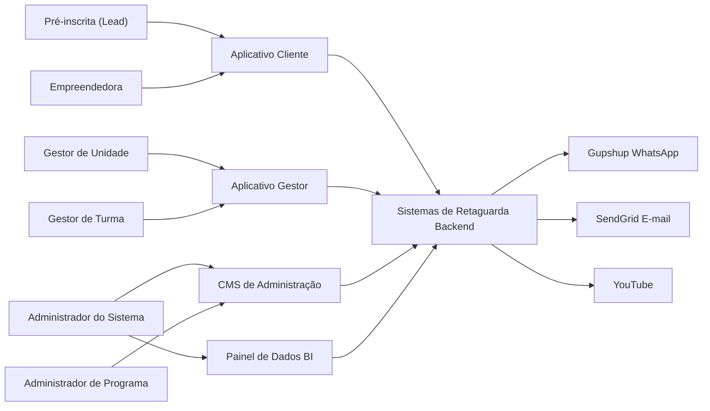

**Casos de Uso — Sistema de Gestão de Programas Sociais (Consulado da Mulher) — v6**

Documento derivado do escopo original do cliente, das reuniões de levantamento (abr./ago. 2026), do **contrato de licenciamento EWTI × Consulado da Mulher (08.05.2026)** e do modelo de referência. Versão 6 incorpora **observações v6**, as **reuniões de 21, 23, 27 e 29/jul. 2026**, as de **3, 5, 6, 11, 13, 20, 24 e 27/ago. 2026** e o **e-mail Caroline (12/08/2026)** (ciclo de formação, workshop, elegíveis à doação, mentorias, recibos), mantendo a base da v5 (observações v5, reuniões 13, 15 e 17/jul. 2026). Alinhada à arquitetura em **cinco grupos**: **CMS de Administração** + **Aplicativo Gestor** (inclui Mini CRM) + **Aplicativo Cliente** (inclui Agente de IA) + **Painel de Dados (BI)** + **Sistemas de Retaguarda (Backend)**. **Mautic foi removido do projeto** — alertas e nurturing são orquestrados pelo **Backend** (UC87/UC52), configurados no CMS. Sumário da reunião 27/ago: `[reunioes/sumario-2026-08-27.md](reunioes/sumario-2026-08-27.md)`.

**Principais mudanças da v6:**

- **Agrupamento por plataforma:** cinco grupos (CMS, Gestor, Cliente, BI, Backend). Mini CRM (UC26) no **Gestor**; Agente de IA (UC64) no **Cliente**; UC33 (fila jornada) e **fila de alertas** (UC87) no **Backend**; UC82 = Admin cria → Gestor dispara → BI visualiza.
- **Comunicação unificada (UC88):** catálogo CMS **separado** de edição/módulo — **pacotes** com templates Meta/Gupshup (mesmo corpo para API online e clipboard P/H); **1 template por `TipoAtividade`**; **Aula** = dois templates (`presencial` / `ao_vivo`); alertas UC87 na **mesma** área CMS; edição **seleciona pacote** (UC9); **Gestor de Unidade** pode editar corpo antes de UC50 (P/H).
- **Reuniões 27–29/jul e 3–11/ago:** janela comercial WhatsApp; retry 48h; risco de evasão **diferenciado** (P/H longo 15d × online curto 10d/5d do fim); grupo só após aprovação + número corporativo como admin; **Revisar** (ex-reprovar); **Prefiro não responder**; formalização não pontua; visita presencial ou online; NPS global; BI Looker Studio; Cidade/Bairro nas listas.
- **E-mail Caroline 12/08:** janela sáb **8h–16h** + feriados sem disparo; check-point/recompensa; **Workshop de Encerramento**; elegibilidade A–D + **seleção em lote** (sem doação automática); módulo de **mentorias**; **recibos/PIX**; UC82 D+30. Priorização MVP × Fase 2 **a revisar**.
- **Reuniões 13 e 20/ago. 2026:** **oficina → entrevista de seleção** (UC84); rito operacional online pós-live (atividade de **presença/KW** → quiz; YouTube+StreamYard fora da plataforma; prazo rígido; timestamp); **doação em massa** + modalidades + meta/valor na edição; reporte financeiro pelo Cliente (não é fluxo de caixa; zero exige justificativa); metas com **Revisar** + histórico; UX de status humanizada; duração de programa **Longa / Média / Curta** (Admin → BI); soft capacity de turma; endereço com ponto de referência; recibo conta **725**.
- **Reunião 24/ago. 2026:** tipo unificado **Aula** (presencial ∪ ao vivo na liberação); **conteúdo extra** (não conta %/carga; substitui “aula presencial extra”); encerramento P/H = **módulo obrigatório** de carga (≠ funil online UC38); doação: sugerir no empreendimento, **aprovar só Unidade** em `/doacao` com pop-up + **digitar APROVAR** + copy “≠ garantia”; dados bancários formais (nome/CPF readonly + conta/PIX); Cliente **“aguarde”** sem datas de pagamento; anexo financeiro **obrigatório**; material: confirma recebimento → libera recibo; **NF 1:N** no Gestor; design Blocos+Imersiva (UI, fora do v6 operacional).
- **Reunião 27/ago. 2026:** doação com **múltiplos itens** (1:N linhas produto+valor); **orçamento por unidade** na edição (valores definidos no **CMS**; Gestor só consome saldos); recibo copy **até 60 dias**; PIX-CPF **imutável**; material = gestor registra itens+NF, Cliente só assina (**assinatura obrigatória**); timestamp do **quiz** no acompanhamento (UC38). **Aula (evento):** **natureza original** (presencial/ao vivo) + título + descrição no **CMS** (UC15); data, hora e local/link na **liberação** do Gestor (UC34), com natureza editável até ministrar. **Saúde financeira** = **rascunho** até planilha Sandra. **Aberto / não canônico:** múltiplas KW; nome da IA; metodologia renda 3+3; Tier 1/2; mentoria detalhada; investimento×dívida / dívida pessoal; doação mista (regras NF/recibo por linha); aulas inaugurais ao vivo.
- **Seleção P/H (comunicação):** ausente na entrevista → **não aprovada** automaticamente (salvo realocação); UC25 só **três faixas** — convite (qualificada **alocada em entrevista**), liberação (aprovada **+ turma**), demais (não aprovada / não qualificada / faltosa). Travas: nunca convite sem alocação em sessão; nunca liberação sem alocação em turma.
- **Protótipo pós-decisões (ago/2026):** menu com **Pendências**; cancelar/reativar liberação; dificuldade no faturamento; seleção em massa; matriz de tipos filtrada por modalidade online; wireframes granulares alinhados às 3 etapas.
- **Régua de inscrição (UC12):** bloqueio só idade + disponibilidade P/H; catálogo pontuável de **6** critérios (tempo de negócio, renda per capita, CLT, cargo público, internet, WhatsApp); internet/WhatsApp **não** impedem cadastro.
- **Tipos de atividade:** catálogo de **11** tipos (`Tipos_de_Atividade.md` / UC15); **Aula** unifica presencial e ao vivo; **conteúdo extra** (UC35) fora da enum e **não** conta %/carga; **Atividade** = questionário genérico (distinto de Inicial/Final/NPS); Temporizador e Texto aberto = jornada online (UC33), não `TipoAtividade`; Certificado fora da matriz do módulo.
- **Videoaula pré-gravada**: YouTube no site educacional **e**, em programas online, **arquivo de vídeo compatível com WhatsApp** cadastrado na atividade; conclusão padrão **80%** assistido.
- **UC33 — liberação por temporizador**: o gestor **inicia** a jornada ao **comunicar aprovação** (UC25); daí em diante a liberação é **automática** (temporizador); **envio** = **"OK"** da empreendedora (lote de liberadas não recebidas). Orquestração WhatsApp da jornada = **fila no backend** (distinta da fila de alertas UC87).
- **Gatilhos WhatsApp**: (1) pós-cadastro — usuária **escreve** no número da organização (Strapi) → template de inscrição; (2) **Comunicar aprovação** (UC25) — 1º gatilho do módulo / convite ao grupo (P/H).
- **Jornada WhatsApp (templates):** centralizados em **pacotes UC88** (Meta/Gupshup) — 1 por tipo de atividade (+ Aula presencial/ao_vivo); mesma área CMS inclui alertas UC87; edição seleciona pacote (UC9).
- **Modalidade**: **online** vs **presencial/híbrido**. Presencial e híbrido têm **o mesmo comportamento operacional**; a distinção existe para **agrupar no Painel de Dados (BI)**. WhatsApp pago (API) em P/H **só** no aceite (boas-vindas + convite ao grupo da turma); quem **não entra no grupo** não tem participação **efetivada**.
- **Edição**: percentuais de **beneficiamento** e **certificação** (em geral **50% / 75%**, variáveis por edição — UC13); checkbox **disparo automático de videoaula via WhatsApp** (online).
- **Risco de evasão — dois níveis:** **P/H longa duração (6–12 meses)** = silêncio ≥ **15 dias** + represamento; **online curta (~1 mês)** = atividades liberadas sem realização há **> 10 dias** **ou** a **5 dias do término** com pendências (UC53/UC56). Maratona online permanece saudável.
- **Elegibilidade**: **bloqueio de cadastro** (idade ≥ 18; disponibilidade P/H) ≠ **régua pontuável** (até 6 critérios ativáveis por edição no Admin → score **X/Y** para qualificação no Gestor). Internet e WhatsApp **pontuam** quando ativos; **não** bloqueiam inscrição. Formalização **não pontua**.
- **Seleção**: **3 etapas** — (1) classificar UC24 · (2) **entrevista de seleção** P/H UC84 · (3) alocar turma UC17; depois **comunicar UC25** (libera jornada). Online: sem entrevista de seleção; turma única automática. Classificar **não** inicia jornada.
- **Empreendimento coletivo**: cada inscrição cria **1 pessoa + 1 negócio** (sem merge por nome); gestor **agrupa** (UC31) na seleção e na lista de negócios; BI = N pessoas / 1 empreendimento / **1 doação**.
- **Nomenclatura**: "contemplado" → **"recebeu doação"**; CNPJ obrigatório se MEI/ME; disclaimers de renda/faturamento; retificação pós-aprovação financeira; encerramento de edição (freeze → BI). Status Cliente: **inscrita / aguardando seleção (ou entrevista) / aprovada / ativa** — frases curtas; WhatsApp = canal principal de notificação.
- **Doação por modalidade (ago/2026):** **P/H** — análise **manual** do gestor a **qualquer momento** do programa (individual ou em lote de status). **Online** — funil rígido: **100% das atividades** → live de encerramento (YouTube+StreamYard; só quem fez 100%) → **atividade de presença** com **palavra-chave** (case/acento-insensitive; prazo rígido; timestamp) → **questionário final 100% certo** → liberada para doação. **Pós-liberação (comum):** PIX/conta + recibo (conta **725**, prazo **até 60 dias** no texto) + aceites (UC86). **Doação em massa** + modalidades + **itens 1:N** + **orçamento por unidade** (UC57/UC9). A–D/lote (UC14/UC85) = filtros auxiliares; ranking/desempate **após** elegibilidade ≠ régua UC12.
- **Aplicativo Gestor (unificado)**: autenticação só por **link mágico** (e-mail); **Dashboard de edições** como primeira tela; ao abrir uma edição, carrega as ferramentas do perfil (Unidade = **todas**, incluindo operação de turma); Unidade pode **sugerir e aprovar** doação (UC3, UC57).
- **Módulos e liberação**: edição composta por módulos temáticos; visão accordion; **configuração por tipo** na liberação; **acompanhamento no mesmo detalhe** (assistiu/não; não fez/em aprovação/aprovada; pizza de questionário; plano de ação); **todas as atividades** contam para beneficiamento (UC13, UC34, UC39, UC44).

---

## Atores

A lista de atores foi **enxugada na v5** (de 13 para 9): atores são apenas quem **interage** com o sistema. Cadastros gerenciados pelo sistema (Colaborador, Voluntário/Mentor, Organização) viraram **entidades de domínio**; Backend é **camada do sistema** (ver Plataformas do Sistema).

### Atores — Pessoas

| Ator                                                 | Descrição                                                                                                                                                                                                                                                                                                                                                                                                                                                                                                                                                                                                                                                                                                                                           |
| ---------------------------------------------------- | --------------------------------------------------------------------------------------------------------------------------------------------------------------------------------------------------------------------------------------------------------------------------------------------------------------------------------------------------------------------------------------------------------------------------------------------------------------------------------------------------------------------------------------------------------------------------------------------------------------------------------------------------------------------------------------------------------------------------------------------------- |
| **Pré-inscrita (Lead)**                              | Pessoa que iniciou o processo de inscrição mas **ainda não concluiu** a inscrição completa (UC19/UC20/UC21). Objeto do mini CRM (UC26) e dos lembretes de inscrição incompleta (alerta automático UC87 + disparo manual). Torna-se **Empreendedora** ao concluir a inscrição completa (UC21).                                                                                                                                                                                                                                                                                                                                                                                                                                                       |
| **Empreendedora (Beneficiada)**                      | Mulher empreendedora em situação de vulnerabilidade social, com **inscrição completa** registrada. Acessa o **Aplicativo Cliente** exclusivamente por **link mágico** (WhatsApp ou e-mail) — **não há senha** de autenticação. Realiza atualização cadastral, módulos, conteúdos, questionários, uploads, dados financeiros mensais e solicitação de desligamento (UC79). Todo registro operacional vincula-se a **programa**, **edição**, **unidade** e **turma**. A **qualificação** na seleção (UC24) classifica o perfil; a **Comunicar aprovação** (UC25) é o que **inicia a jornada educacional** (online → UC33; P/H → convite ao grupo). Unidade/turma podem vir da inscrição (automático se únicas) ou da distribuição na tela de seleção. |
| **Administrador do Sistema (CMS de Administração)**  | Perfil **master** com controle total: usuários, programas, unidades, migrações excepcionais e configuração global.                                                                                                                                                                                                                                                                                                                                                                                                                                                                                                                                                                                                                                  |
| **Administrador de Programa (CMS de Administração)** | Usuário do CMS com escopo restrito a um ou mais programas/edições. Gerencia conteúdos, programas, edições (incluindo módulos associados), organizações, colaboradores e unidades do seu escopo.                                                                                                                                                                                                                                                                                                                                                                                                                                                                                                                                                     |
| **Gestor de Unidade (Aplicativo Gestor)**            | Usa o **mesmo Aplicativo Gestor**, autenticado por **link mágico**. Visão sobre **todas as turmas da unidade** na edição. **Inclui funções do Gestor de Turma** mais: **seleção em etapas** — classificar (UC24), **entrevista de seleção** P/H (UC84), alocar turma (UC17), **comunicar** (UC25); remanejar (UC18); doação sugerir/aprovar (UC57); inscrever (UC21/UC69); agrupar empreendimentos (UC31); **ativar/ajustar alertas automáticos** da edição (UC87).                                                                                                                                                                                                                                                                                 |
| **Gestor de Turma (Aplicativo Gestor)**              | Usa o **mesmo Aplicativo Gestor**, autenticado por **link mágico**. **Age apenas sobre a própria turma** na edição selecionada. Responsabilidades: **visão por módulo** e **liberação de atividades** escolhidas pelo gestor (UC34), data/local de presenciais, **aprova faturamento e entregas** (UC44), analisa questionários, cria atividade extra **só presencial** (UC35), relato de oficina (UC80), uploads, desistência (UC30) e **sugere doação** (aprovação Unidade — UC57). Comunicação de grupo WhatsApp manual (UC50); edita e-mail/telefone. **Não** move entre turmas/unidades e **não altera** temporizadores online (UC33). Pode inserir dados em nome da empreendedora (UC69).                                                     |

### Atores — Sistemas Externos

| Ator                                | Descrição                                                                                                                                                                                                |
| ----------------------------------- | -------------------------------------------------------------------------------------------------------------------------------------------------------------------------------------------------------- |
| **Gupshup (WhatsApp Business API)** | Provedor de envio de mensagens WhatsApp: texto, links com login mágico, solicitações e envio de videoaulas. Acionado **somente pelo Backend**.                                                           |
| **SendGrid (E-mail)**               | Provedor de envio de e-mails transacionais: links mágicos da **empreendedora** (UC4/UC54) e do **gestor** (UC3), lembretes/alertas (UC26/UC87) e comunicações gerais. Acionado **somente pelo Backend**. |
| **YouTube**                         | Ator secundário para videoaulas gravadas e transmissões ao vivo.                                                                                                                                         |

### Entidades de domínio (não são atores)

Cadastros **gerenciados pelo sistema**, sem interação própria (sem login/interface):

- **Colaborador** — funcionário do Consulado cadastrado no CMS (UC1); é o **cadastro** que recebe os perfis de **Administrador de Programa**, **Gestor de Unidade** e/ou **Gestor de Turma** (pode acumular papéis). Quem atua nos UCs é sempre o **papel** atribuído, não o colaborador em si.
- **Voluntário / Mentor** — pessoa cadastrada (mentor ou palestrante/oficineiro) para processos de mentoria (UC70/UC73). **Não acessa o sistema**; o registro de mentoria é operado pelos gestores.
- **Organização (Patrocinador / Parceiro)** — pessoa jurídica (CNPJ) associável a uma edição como patrocinador ou parceiro (UC10/UC11). Caso se confirme visão restrita no BI para financiadores (UC59), retorna como ator secundário.

> **Convenção:** **Sistemas de Retaguarda (Backend)** são **camadas do sistema em construção** (ver Plataformas do Sistema), não atores externos. Quando citados em casos de uso, indicam **execução automática** pelo sistema, não um usuário. **Mautic não faz parte do projeto.**

### Plataformas do Sistema

O sistema é organizado em **cinco grupos** (plataformas/camadas):

1. **CMS de Administração** — modelagem de programas, edições, módulos, unidades, organizações e colaboradores (implementado com Strapi); **cria/configura** pesquisa pós-programa (UC82), **pacotes de comunicação** (UC88) e **alertas automáticos** (UC87 — mesma área Comunicação).
2. **Aplicativo Gestor** — app **único** para **Gestor de Unidade** e **Gestor de Turma**; autenticação por **link mágico**; home = **Dashboard de edições**; inclui **Mini CRM** (UC26); **dispara** pesquisa pós-programa (UC82); Unidade **ativa/ajusta** alertas da edição (UC87).
3. **Aplicativo Cliente** — interface da empreendedora (inscrição, atividades, uploads, dados financeiros); autenticação exclusiva por **link mágico**; inclui **Agente de IA** / chat de dúvidas (UC64).
4. **Painel de Dados (BI)** — dashboards, indicadores e relatórios em **Looker Studio / Data Studio** ligado ao banco (fora do app operacional); acessos Google geridos pelo Consulado; **visualiza** resultados da pesquisa pós-programa (UC82). **Orçamento não entra** no dashboard operacional.
5. **Sistemas de Retaguarda (Backend)** — APIs, regras de negócio, **duas filas de comunicação**: (a) **jornada WhatsApp** liberar / OK / lote — UC33; (b) **alertas de engajamento** — UC87/UC52; integrações (Gupshup, SendGrid), autenticação, persistência. Sem motor externo de marketing.

| Camada                   | Responsabilidade principal                                                                                           |
| ------------------------ | -------------------------------------------------------------------------------------------------------------------- |
| **CMS de Administração** | Configuração, cadastros, critérios, conteúdo; pesquisa pós-programa; **pacotes de comunicação** (UC88); **alertas** (UC87) |
| **Aplicativo Gestor**    | Operação de seleção/turma/doação; Mini CRM; disparo UC82; binding de alertas na edição                               |
| **Aplicativo Cliente**   | Jornada da empreendedora; Agente de IA (UC64)                                                                        |
| **Painel de Dados (BI)** | Indicadores, relatórios, totalizadores; resultados UC82                                                              |
| **Backend**              | APIs, regras, persistência, tokens, UUID (UC67), Gupshup/SendGrid, **fila jornada** (UC33) e **fila alertas** (UC87) |

Stack contratual: Next.js, Node.js, Express, Prisma, MySQL; hospedagem AWS.

### Conceitos de Domínio (v4)

**Programa** — metodologia principal: **modalidade** (**online**, **presencial** ou **híbrido**), **descrição** e classificação de **duração** (**Longa / Média / Curta**) no Admin para agrupamento no **BI** e alinhamento de metas/risco (reunião 13/ago.). Não contém módulos diretamente; é lançado em **edições**. **Presencial e híbrido são idênticos em comportamento** no sistema; a modalidade separa os dados no **Painel de Dados (BI)** e na prestação de contas (ex.: BNDES). **Online** tem jornada e disparos pagos contínuos via API.

**Edição** — instância operacional do programa. Define: programa vinculado, **unidades participantes**, ano de competência, nome da edição, datas de **inscrição**, **seleção** e **aplicação**, meta de beneficiados, **meta numérica e valor de doação** (quando a edição concede doação), **módulos** e sequência, **percentuais de beneficiamento e certificação** (UC13), **pacote de comunicação** (UC88 — templates Meta/Gupshup da jornada), e no **online** o checkbox de videoaula WhatsApp + limiares de maratona/risco + **prazo pós-live** (KW/quiz). O **número WhatsApp da organização** (canal que a usuária deve contatar) é cadastrado no **CMS (Strapi)** — global ou por edição.

**Canal WhatsApp da organização (Strapi)** — número Business (Gupshup) exibido no Aplicativo Cliente ao fim do cadastro. A empreendedora **deve enviar uma mensagem** a esse número; o **webhook inbound** do backend reconhece o contato e dispara o **template Meta de confirmação de inscrição** configurado na edição. Isso **abre a janela de 24h** / opt-in operacional e **não** inicia a jornada educacional.

**WhatsApp pago (API / Gupshup) × modalidade**

| Modalidade               | Uso da API paga                                                                                                                                                                                                                     |
| ------------------------ | ----------------------------------------------------------------------------------------------------------------------------------------------------------------------------------------------------------------------------------- |
| **Online**               | (1) Resposta ao **primeiro contato** da usuária (template inscrição); (2) **Comunicar aprovação** (UC25) = 1º gatilho do módulo + jornada; (3) temporizadores / OK / lote (UC33); (4) vídeos (UC51); (5) mensagens do gestor (UC53) |
| **Presencial e híbrido** | (1) Opcional: mesmo padrão de 1º contato pós-cadastro se a edição usar; (2) **Comunicar aprovação** (UC25): **único** envio operacional pago — boas-vindas + **link do grupo da turma**. Depois: só grupo (UC50).                   |

**Classificar ≠ Comunicar ≠ Liberar atividades**

| Ação                                 | O que faz                                               | O que **não** faz                                                                                |
| ------------------------------------ | ------------------------------------------------------- | ------------------------------------------------------------------------------------------------ |
| **Classificar** (UC24)               | Status **qualificado** / em análise / não qualificado   | **Não** envia WhatsApp; **não** inicia automação; **não** aloca turma                            |
| **Entrevista de seleção P/H** (UC84) | Presença + **aprovada** / não aprovada                  | Só presencial/híbrido                                                                            |
| **Alocar turma** (UC17)              | Etapa 3; turma única = automático                       | **Não** inicia jornada                                                                           |
| **Comunicar** (UC25)                 | Disparo **manual** do gestor                            | **Online:** 1º gatilho UC33. **P/H:** convite grupo (aprovada+turma). Também avisa não aprovadas |
| **Liberação de atividades (online)** | Após UC25, **automática** por temporizador (backend)    | Gestor **não** marca checkbox para liberar no online; acompanha e dispara UC53 se preciso        |
| **Liberação (presencial/híbrido)**   | Gestor libera encontro a encontro (UC34) + grupo (UC50) | Sem temporizador / sem lote Gupshup                                                              |

**Participação efetivada (presencial/híbrido)** — após UC25, a empreendedora recebe o convite ao grupo. **Quem não entra no grupo da turma não tem a participação efetivada**. O gestor confirma o ingresso na lista da turma.

**Unidade** — agrupa pelo menos **uma turma**; colaboradores e gestores são vinculados à unidade. Na inscrição, a empreendedora seleciona a unidade (exceto unidade única — alocação automática).

**Turma** — operacionalizada pelo **Gestor de Turma**. **Toda edição** tem **pelo menos uma unidade e uma turma**. Vínculo automático se turma única; se várias turmas (P/H), alocação na **etapa 3** após entrevista de seleção/aprovação (UC17). **Não** inicia a jornada. Link/código do **grupo WhatsApp** da turma é propriedade da turma (UC16) e é exigido para liberar jornada via UC25 (P/H). Capacidade é **soft** (alerta se desbalanceada; **sem** trava rígida — reunião 20/ago.).

**Seleção em etapas (Aplicativo Gestor — só Unidade)** —

| Etapa                               | O quê                                                    | Modalidade                                           |
| ----------------------------------- | -------------------------------------------------------- | ---------------------------------------------------- |
| **1. Classificar** (UC24)           | Qualificado / em análise / não qualificado; score X/Y    | Todas                                                |
| **2. Entrevista de seleção** (UC84) | Agendar, presença, aprovar / não aprovar quem compareceu | **Só presencial/híbrido**                            |
| **3. Alocar em turma** (UC17)       | Aprovadas → turma(s) da unidade; painel de ocupação      | P/H com **várias** turmas (turma única = automático) |
| **Comunicar** (UC25)                | Informa resultado; **libera jornada** das aptas          | Todas                                                |

**Online:** tipicamente unidade+turma únicas → após classificar, segue a **UC25** (sem entrevista de seleção). **P/H:** qualificadas passam pela entrevista de seleção antes de alocar/comunicar. Pode haver **rodadas** de qualificação + entrevista até a meta da edição (meta pode ultrapassar um pouco antevendo desistências).

**Localização nas listagens (seleção / entrevista de seleção / turmas):** as listas exibem **Cidade/UF** e **Bairro** da empreendedora (do cadastro), **não** a unidade operacional. O mesmo vale para o **CSV de presença da entrevista** (UC84). A unidade **não** aparece como filtro nem como coluna nessas listas (o escopo do gestor já restringe a unidade).

**Elegibilidade — bloqueio de cadastro × régua pontuável (UC12)** — não confundir:

- **Bloqueio (não pontuam; nem se cadastram):** idade **< 18** (todas as modalidades); **indisponibilidade** para encontros presenciais (**presencial/híbrido**). **Formalização** (informal / MEI / ME) permanece no cadastro como filtro — **não pontua**.
- **Régua pontuável (Admin, por edição):** catálogo de **6** critérios ativáveis — tempo de negócio; renda familiar per capita; não ter carteira assinada; não ser funcionário público; ter internet; ter WhatsApp. Cada ativo atendido = **1 ponto** → score **X/Y** (Y = nº de critérios ativos). Internet e WhatsApp **não bloqueiam** a inscrição: respondem no cadastro e entram no score/qualificação (UC23/UC24). Distinto da elegibilidade à **doação** (UC14/UC85 A–D).

**Alocação automática (unidade/turma única)** — quando a **edição** possui **apenas uma unidade**, a empreendedora é **alocada automaticamente** nessa unidade na inscrição. Quando a unidade (ou edição) tem **apenas uma turma**, as **qualificadas/aprovadas** já ficam vinculadas a essa turma (sem tela de escolha). Típico **online**; também vale em P/H com turma única.

**Identificador automático (ID)** — o sistema **gera automaticamente um ID único** para cada empreendedora/registro, eliminando o controle manual por planilhas (reunião 13/jul.).

**Doação** — benefício concedido ao **empreendimento** nas modalidades **capital semente (dinheiro)** e **material** (equipamentos / insumos). **Dois caminhos de liberação por modalidade** (canônico ago/2026):

| Modalidade               | Gatilho de liberação para doação                                                                                                                                                                                                                                                                                  | Quando                           |
| ------------------------ | ----------------------------------------------------------------------------------------------------------------------------------------------------------------------------------------------------------------------------------------------------------------------------------------------------------------- | -------------------------------- |
| **Presencial / híbrido** | Análise **manual** do gestor (sugerir/aprovar — UC57), individual ou em **lote**. Não depende de live, palavra-chave nem questionário 100%.                                                                                                                                                                       | **Qualquer momento** do programa |
| **Online**               | Funil sequencial: **100% das atividades** → **live de encerramento** (YouTube + StreamYard; **fora** da plataforma; só quem fez 100%) → **atividade de presença** com **palavra-chave** (prazo rígido; timestamp) → **questionário final** — só quem responde **100% certo** fica **liberada para doação** (UC38) | Só ao **fim** do funil           |

**Ranking / desempate pós-elegibilidade** (quando o orçamento não cobre todas as liberadas): nº de dependentes, qualidade das respostas do questionário final, e análise subjetiva excepcional do Consulado. **Distinto** da régua de inscrição (UC12) e dos filtros A–D (UC14).

**Pós-liberação (comum às duas jornadas):** indicar **conta corrente ou PIX**, **assinar recibo** (conta **725**; dinheiro: assinatura **antes** do pagamento; produto: **após** a entrega) e **aceites** (UC86). Endereço de entrega: número, complemento e **ponto de referência**. Em tela unificada no Aplicativo Gestor: o **Gestor de Turma sugere**; o **Gestor de Unidade aprova** — e o Unidade **também pode sugerir e, em seguida, aprovar** (dois passos rastreáveis — UC57), inclusive em **doação em massa**. Filtros A–D + lote (UC14/UC85) são **auxiliares** (ex. carência de 3 anos) e **não** substituem o funil online nem a análise manual P/H. Filtro **recebeu doação**. O termo **"premiação"/"premiado"** foi substituído por **"doação"**; status/relatórios podem refletir **"recebeu doação"** nos sócios vinculados.

**Grupos WhatsApp (dois níveis)** — a aplicação prevê **dois níveis** de grupo WhatsApp: (1) grupo entre **gestores de unidade e gestores de turma** (coordenação interna — o Gestor de Unidade administra o grupo dos gestores de turma); (2) grupo entre **gestores de turma e empreendedoras** (comunicação operacional da turma). O grupo da turma é criado **somente após a aprovação** (UC25) — não antes, para evitar remoções manuais. A gestora cria o grupo no WhatsApp, adiciona o **número corporativo/sistema como administrador** (redundância se a gestora sair) e cadastra o **link de convite** na turma (UC16). O sistema **não** cria grupos via API (limitação Meta). Ambos os gestores enviam mensagens por **ferramenta de facilitação** (copiar mensagem pré-formatada para a área de transferência + link de acesso direto ao grupo — UC50); o envio efetivo é manual, no WhatsApp (celulares corporativos — WhatsApp Web bloqueado em PCs — reuniões 21/jul. e 6/ago.). **Comunidade** WhatsApp (relacionamento de longo prazo, distinta dos grupos de turma) é evolução — ver Observações de Escopo.

**Módulo** — conjunto ordenado de **atividades educacionais** da edição (UC15). Temas de referência (CMS): Encontros de Chegada, Planejamento Estratégico, Finanças, Marketing, Pessoas, Formalização, Sustentabilidade. No **presencial/híbrido**, o gestor libera por checkbox (UC34). No **online**, a sequência/temporizadores do módulo rodam **após UC25**; o gestor **acompanha** (não libera manualmente cada atividade).

**Empreendimento (Negócio)** — entidade central da **operacionalização**, em **tabela distinta** da empreendedora. Cada inscrição completa (UC21) cria **1 empreendedora** e **1 empreendimento** vinculados. Informal **não** tem CNPJ; o sistema **não** une automaticamente pelo nome fantasia (homônimos). Duas sócias do mesmo negócio informal ficam em **dois** estabelecimentos até o gestor **agrupar** (UC31). Relação canônica: **N empreendedoras → 1 empreendimento**. A **qualificação na seleção é do empreendimento como um todo**. **Doação** é 1 por empreendimento.

**Propriedade operacional — Empreendimento × Empreendedora** (regra canônica — ago/2026):

| Escopo                                              | O que                                                                                                                                                                                                                                                                                                                                              |
| --------------------------------------------------- | -------------------------------------------------------------------------------------------------------------------------------------------------------------------------------------------------------------------------------------------------------------------------------------------------------------------------------------------------- |
| **Empreendimento** (registro único / compartilhado) | Presença em eventos (1 sócio presente = presença do empreendimento naquele evento); cumprimento de atividades para **beneficiamento** e **certificação** conforme **% da edição** (em geral **50% / 75%** — UC13); sócios podem **alternar** quem realiza; **faturamento** (1 por competência); planos; **plano de ação**; desistência; **doação** |
| **Empreendedora** (por pessoa)                      | Canal WhatsApp / login mágico; **questionários** (inicial/final/NPS e demais respostas individuais — entendimento diferente por pessoa); perfil BI (gênero, raça, idade); observações de acompanhamento                                                                                                                                            |
| **Efeito em cascata**                               | Quando o **empreendimento** atinge critérios de beneficiamento/certificação, **todos os sócios** da edição recebem o **certificado** e entram na contagem de **beneficiadas**                                                                                                                                                                      |
| **BI (dupla contagem)**                             | N sócias de um negócio = **N pessoas** (N beneficiadas, N certificadas, N ativas) **e** **1 empreendimento**; **doação = 1** por negócio (não N)                                                                                                                                                                                                   |

**Jornada WhatsApp (programas online)** — templates do **pacote UC88**. (1) pós-cadastro: usuária escreve no número da org → template inscrição; (2) gestor **comunica aprovação** (UC25) → **1º gatilho** do módulo → backend agenda temporizadores; (3) OK da empreendedora → envio em lote (template por **tipo** de atividade). Progresso compartilhado no **empreendimento**; questionários por pessoa. Links com login mágico.

**Maratona (online)** — comportamento esperado: a empreendedora **não** acompanha o calendário de liberação dia a dia. Espera um dia com mais tempo e **conclui de uma vez** o lote já liberado/enviado e ainda pendente (“maratonar”). **Represamento** (atividades liberadas e não feitas) **não** é atraso pedagógico nem sinal isolado de evasão — é o desenho da jornada intercalada (UC33).

**Risco de evasão — dois níveis** (por duração típica do programa; limiares na edição — UC9):

| Perfil            | Modalidade típica    | Duração        | Regra de risco                                                                                                                                                                                                |
| ----------------- | -------------------- | -------------- | ------------------------------------------------------------------------------------------------------------------------------------------------------------------------------------------------------------- |
| **Longa duração** | Presencial / híbrido | **6–12 meses** | Silêncio ≥ **15 dias** sem feedback/participação relevante **e** represamento alto (faltas a encontros / atividades liberadas pendentes). Acompanhamento no Gestor; sem a mesma automação WhatsApp do online. |
| **Curta duração** | Online               | **~1 mês**     | (a) atividades liberadas **não realizadas há mais de 10 dias**; **ou** (b) a **5 dias do término** da edição ainda há atividades pendentes → mensagens de alerta/incentivo (UC53).                            |

**Sinais de acompanhamento online** (calculados sobre atividades que contam para UC13; consumo oficial na **plataforma**, não no OK do WhatsApp):

| Indicador                 | Fórmula                                                                                                                            | Uso                                                                                     |
| ------------------------- | ---------------------------------------------------------------------------------------------------------------------------------- | --------------------------------------------------------------------------------------- |
| **Cobertura da edição**   | concluídas / total da edição                                                                                                       | Beneficiamento/certificação (% da edição)                                               |
| **Aderência ao liberado** | concluídas / já liberadas                                                                                                          | Está em dia com o que já podia fazer?                                                   |
| **Represamento**          | liberadas − concluídas (qtd e %)                                                                                                   | Tamanho da fila para maratonar                                                          |
| **Silêncio**              | dias desde o **último acesso autenticado** ao Aplicativo Cliente (player, questionário, upload etc.) — **não** o OK de recebimento | Apoia estados; no online curto o risco usa **dias sem realização** / proximidade do fim |
| **Burst de maratona**     | dia (ou janela curta) com **N ≥ k** conclusões (`k` na edição, padrão **3**)                                                       | Confirma hábito saudável                                                                |

**Estados operacionais (edição online — curta duração)** — limiares na edição (UC9); defaults de risco: **10 dias** sem realização de atividade liberada **ou** **5 dias** antes do término com pendências:

1. **Em dia / maratonando** — aderência alta **ou** burst recente; o represamento pode ser alto.
2. **Represada ativa** — represamento alto + acesso recente (vai maratonar; **não** entra no público de risco UC53).
3. **Risco de evasão (curto)** — liberadas sem realização há **> 10 dias** **ou** a **≤ 5 dias do fim** com atividades pendentes.
4. **Inativa sem lote** — quase nada liberado / não aderiu ao primeiro OK / não abriu o app.

**Risco em edição P/H (longa duração)** — silêncio ≥ **15 dias** sem participação relevante **e** represamento alto (ex.: faltas consecutivas a Eventos / tarefas liberadas). Distinto do limiar online.

**Janela comercial de envio WhatsApp (API)** — disparos automatizados (UC33, UC49, UC53, **UC87**) somente: **segunda a sexta, 8h–20h**; **sábado, 8h–16h**; **domingos e feriados nacionais sem disparo** (calendário BR) (e-mail Caroline 12/08; supersede 11/ago. e 29/jul.). Fora da janela, a mensagem permanece na fila até o próximo horário permitido. **Falha de entrega:** permanece na fila; **retry após 48h** (anti-spam Meta).

Regra: **hábito de maratona é saudável** (online); **risco online ≠ silêncio 15 dias** (esse limiar é do perfil **longo P/H**).

**Comunicação (templates)** — textos aprovados Meta/Gupshup centralizados na **área Comunicação do CMS (UC88)**. **PacoteComunicacao:** reutilizável; **1 template por `TipoAtividade`** (Aula: `presencial` + `ao_vivo`); momentos de jornada (inscrição, UC25, UC33…); a **edição seleciona o pacote** (UC9). **Mesmo corpo** alimenta API (online) e clipboard de grupo (P/H — UC50). Módulo (UC15) **não** cadastra mensagens.

**Alerta automático (engajamento / resgate)** — regra tipada na **mesma área Comunicação (UC88 — aba Alertas)** e orquestrada pelo **Backend** (UC87). Não confundir com a **fila de jornada** (UC33). Modelo:

| Entidade | O quê |
| -------- | ----- |
| **PacoteComunicacao** | Nome, modalidade, versão; templates por tipo + momentos; `template_key` Gupshup/Meta (+ e-mail opcional) |
| **AlertRule** | Nome, `triggerKind`, parâmetros, `exitWhen`, canais, **templates UC88**, cadência, audiência |
| **EditionAlertBinding** | Por edição: liga/desliga a regra, override de parâmetros/cadência, pausa |
| **AlertDispatchLog** | Log idempotente (`dedupeKey`); cancela pendentes quando `exitWhen` dispara |

**Catálogo inicial de** `triggerKind`**:**

| triggerKind              | Quando                                        | Params típicos                        | Cancela quando                    |
| ------------------------ | --------------------------------------------- | ------------------------------------- | --------------------------------- |
| `inscription_incomplete` | Lead parou sem inscrição completa (UC19→UC21) | `delayDays`, `repeatDays`, `maxSends` | Inscrição completa                |
| `activity_deadline_soon` | Atividade liberada com prazo; ainda não feita | `hoursBeforeDeadline`                 | Concluída / prazo sem reenvio     |
| `backlog_liberated`      | N conteúdos liberados e não feitos (online)   | `minLiberatedPending`                 | Pendências abaixo do limiar       |
| `edition_ending_pending` | Perto do fim + pendências                     | `daysBeforeEnd`                       | Sem pendências / edição encerrada |
| `risk_short_online`      | Estado risco curto (UC9/UC53)                 | herda limiares da edição              | Sai do estado risco               |
| `checkpoint_midcourse`   | ~15 dias de curso                             | `dayFromStart`, `windowDays`          | Concluiu alvo / janela fechou     |

Admin **cria** pacotes e regras de alerta na **Comunicação (UC88)**; Unidade **instancia** alertas na edição. Sem workflow builder livre (AND/OR arbitrários). Sem motor externo (Mautic removido).

**Vínculo obrigatório** — toda inscrição associa-se a **programa**, **edição**, **unidade**, **turma** (turma pode ser automática se única) e, após agrupamento, a um **empreendimento**. No lead/pré-inscrição (UC19) vinculam-se **programa** e **edição**; **unidade** na inscrição (ou automática); **turma** automática se única, ou via **UC17** após aprovação na entrevista de seleção (P/H). A jornada educacional só começa com **Comunicar resultado (UC25)** das aptas.

**Status no Aplicativo Cliente (UX — reuniões 13–20/ago.):** preferir **inscrita**, **aguardando seleção** / **aguardando entrevista de seleção** (P/H), **aprovada**, **ativa**, **concluída**, **desistente**. Evitar termos como "matriculada". Frases curtas e dinâmicas por programa; WhatsApp permanece o canal principal de notificação — o app é consulta de progresso.

### Segurança de Dados Sensíveis

- **CPF**: armazenado com técnica **HMAC-SHA256 + pepper** ([referência](https://ogeradordecpf.com.br/armazenar-cpf/)); usado como chave de identificação sem armazenamento em texto claro. A busca por participantes passados ou não aprovados é feita pelo **hash do CPF** (UC62).
- **Autenticação empreendedora**: somente **link mágico** — sem senha (UC4).
- **Autenticação Aplicativo Gestor**: somente **link mágico** por e-mail — sem senha (UC3); primeira tela = Dashboard de edições.
- **Autenticação CMS de Administração**: e-mail e senha; políticas de complexidade e expiração (UC6). **2FA**: previsto no Anexo LGPD do contrato — implementação conforme exigência contratual, não bloqueante para MVP operacional (observações v3).
- **UUID de dispositivo (UC67)**: emitido após inscrição completa; localStorage; deep links com `turma_id`, `atividade_id`, `acao` — presença automática (UC40).
- **Base de consentimentos (LGPD)**: o sistema mantém **registro dos aceites** (LGPD geral, dados sensíveis, cookies/armazenamento local, comunicação/WhatsApp, uso de imagem, regulamento), com **versão do termo, data/hora e dispositivo**, além do **controle de datas de anonimização**. Essa base é a referência para o processo automático de anonimização e revalidação (UC20, UC76).
- **Anonimização automática LGPD (5 anos após o aceite)**: os dados pessoais são **anonimizados automaticamente 5 anos após a data em que a empreendedora deu o aceite** (não a partir do fim da edição). Se, após esse prazo, a empreendedora **acessar ou continuar utilizando** o sistema, é solicitado **novo aceite**, que **revalida** o consentimento e reinicia o prazo. A anonimização de **CPF, e-mail e telefone** usa técnica de **consulta reversível** por hash — preserva **histórico de participação** e aceites, sem perda analítica (UC76).
- **Anonimização de não aprovadas (1 dia após a seleção)**: o **CPF** capturado de empreendedoras **não aprovadas** é anonimizado **1 dia após o encerramento da fase de seleção**. Permanecem os **registros de participação** (transformados em hash), que podem ser **recuperados quando houver nova inscrição com aquele CPF** (UC23/UC24/UC76).
- Funcionalidades **não previstas no contrato** podem ser simplificadas ou postergadas para reduzir complexidade; reuniões de levantamento orientam priorização de necessidades dos usuários.

### Diagrama de Contexto — Frontends e Atores

### Hierarquia de Dados

**Programa → Edição → Unidade → Turma**

O **Programa** define a metodologia (tipo online/presencial). A **Edição** instancia o programa com cronograma, unidades e módulos. Cada **Unidade** possui ao menos uma **Turma**. Colaboradores vinculam-se a unidades; acesso segregado conforme LGPD.

### Base Legada (Consulta)

Os **dados legados serão carregados já anonimizados**. Servem para verificar participação em programas passados e compor totalizadores (participantes, beneficiados, certificados, quem recebeu doação), mas **não preenchem automaticamente** formulários de nova inscrição. A consulta é feita pelo **hash do CPF** dos novos participantes: informa-se um CPF e o sistema devolve as **participações em anos anteriores e em quais programas** (UC62). Dados pessoais respeitam a retenção LGPD (**anonimização 5 anos após o aceite** — UC76); aceites e histórico de participação são preservados; registros legados podem permanecer apenas como contagens consolidadas quando aplicável.

---

## Casos de Uso

Organização do fluxo operacional:

**Pré-inscrição → Inscrição → Seleção → Aprovação e Aplicação da Edição → Conclusão (Beneficiamento, Certificação, Doação/Contemplação, Mentoria)**

Com ramificações paralelas: **Cancelamento / Desistência**

Casos de uso agrupados por **plataforma/camada** (cinco grupos) e, quando aplicável, pela **fase do fluxo operacional**. Ownership de UI = grupo listado; envio/persistência podem envolver o Backend.

### CMS de Administração

UC1 — Cadastrar Colaborador  
UC2 — Login Administrador  
UC5 — Gerenciar Roles e Permissões  
UC6 — Configurar Autenticação e Segurança  
UC7 — Cadastrar Programa (Metodologia)  
UC8 — ~~Modelar Programa e Associar Módulos~~ _(incorporado a UC9 — módulos definidos na edição)_  
UC9 — Criar e Configurar Edição de Programa  
UC10 — Cadastrar Organização  
UC11 — Associar Organização à Edição (Patrocinador / Parceiro)  
UC12 — Configurar Regulamento e Critérios de Seleção _(bloqueio cadastro × régua pontuável, até 6)_  
UC13 — Configurar Critérios de Beneficiamento e Certificação por Edição  
UC14 — Configurar Critérios de Doação / Elegibilidade (A–D) por Edição  
UC15 — Criar Módulo Educacional (Tipos de Atividade)  
UC88 — Gerenciar Pacotes de Comunicação _(templates Meta/Gupshup; área Comunicação CMS)_
UC66 — Cadastrar Unidade  
UC73 — Cadastrar Voluntário ou Mentor  
UC74 — Ativar ou Inativar Colaborador/Parceiro  
UC75 — Migrar Colaborador entre Unidades  
UC76 — Anonimizar Dados e Revalidar Consentimento (LGPD)  
UC81 — Encerrar Edição (Freeze Operacional)  
UC82 — Criar / configurar Pesquisa Pós-Programa _(D+30 padrão; disparo = Gestor; visualização = BI)_  
UC87 — Configurar Alertas Automáticos _(aba Alertas em UC88; orquestra Backend)_  
UC88 — Gerenciar Pacotes de Comunicação _(catálogo templates Meta/Gupshup; jornada P/H e online)_

### Aplicativo Gestor — Gestor de Unidade

> Acumula todas as atividades do Gestor de Turma e detém as ações exclusivas de unidade abaixo.

UC3 — Login Gestor (Link Mágico) + Dashboard de Edições  
UC17 — Alocar em Turma _(etapa 3 pós-entrevista de seleção / turma única automática; não dispara jornada)_  
UC18 — Remanejar entre Unidades e Turmas _(exclusivo do Gestor de Unidade)_  
UC24 — Classificar Inscrições _(etapa 1; score ↓; sem alocar turma)_  
UC25 — Comunicar Resultado da Seleção _(libera jornada das aptas; avisa não aprovadas)_  
UC26 — Gerenciar Leads com Inscrição Incompleta _(Mini CRM; alerta auto + disparo manual)_  
UC28 — Consultar Histórico de Participação  
UC50 — Comunicar para Grupo WhatsApp _(facilitador manual — UC16/UC66)_  
UC56 — Consultar Ranking e Engajamento _(online: maratona / represamento / risco)_  
UC57 — Aprovar Doação (Contemplação) _(também pode sugerir; pós lote UC85)_  
UC58 — Analisar Elegibilidade para Capital Semente  
UC70 — Gestão de Mentorias _(painel, match, docs, histórico)_  
UC77 — Registrar Observação de Acompanhamento  
UC82 — Disparar Pesquisa Pós-Programa _(D+30 padrão; formulário Admin; resultados BI)_  
UC83 — Visão Multi-Unidade no Aplicativo Gestor _(terceiro nível)_  
UC84 — Entrevista de Seleção _(etapa 2 — só P/H; ex-oficina)_  
UC85 — Selecionar Elegíveis à Doação _(filtros A–D + seleção em lote)_  
UC86 — Coletar Dados Bancários / PIX e Recibo de Doação  
UC87 — Instanciar / pausar Alertas da Edição _(EditionAlertBinding)_

### Aplicativo Gestor — Gestor de Turma

UC16 — Criar e Gerenciar Turma _(inclui link do grupo WhatsApp)_  
UC26 — Gerenciar Leads com Inscrição Incompleta _(Mini CRM)_  
UC27 — Cadastrar e Atualizar Dados da Empreendedora _(e-mail, telefone)_  
UC30 — Registrar Cancelamento ou Desistência  
UC31 — Gerenciar Empreendimento (Negócio) e Associar Empreendedoras  
UC32 — Mover Empreendedora entre Empreendimentos  
UC34 — Visão por Módulo e Liberação de Atividades _(gestor escolhe o que liberar; prazo 48h ou definido)_  
UC35 — Adicionar Aula Presencial Extra _(único tipo de atividade extra permitido ao gestor)_  
UC41 — Registrar Presença Manualmente  
UC42 — Consultar Frequência da Participante  
UC44 — Avaliar e Aprovar Entrega (Tarefa de Casa / Dados Financeiros)  
UC46 — Validar Dados Financeiros  
UC50 — Comunicar para Grupo WhatsApp _(facilitador manual — presencial/híbrido)_  
UC53 — Mensagens direcionadas online _(não fez atividade / risco de cancelamento)_  
UC56 — Consultar Ranking e Engajamento _(online: maratona / represamento / risco)_  
UC57 — Solicitar Doação (Contemplação) _(Unidade aprova; Unidade também pode sugerir)_  
UC69 — Inserir Dados em Nome da Empreendedora  
UC77 — Registrar Observação de Acompanhamento  
UC78 — Agendar Visita Técnica (ao local da empreendedora) _(calendário + logística)_  
UC80 — Registrar Relato de Atividade/Oficina e Exportar Presença

### Aplicativo Cliente — Empreendedora

**Fase 1 — Pré-inscrição**  
UC19 — Realizar Pré-Cadastro  
UC20 — Aceitar Termos LGPD, Comunicação, Cookies e Armazenamento Local  
UC67 — Resgatar Sessão do Dispositivo (UUID e localStorage) _(MVP)_

**Fase 2 — Inscrição**  
UC21 — Realizar Inscrição Completa _(seleção de unidade)_  
UC22 — Consultar Histórico Legado e Reutilizar Cadastro Recorrente

**Fase 4 — Aplicação**  
UC36 — Consumir Conteúdo Educacional  
UC37 — Registrar Progresso em Videoaula  
UC38 — Assistir Aula ao Vivo (YouTube)  
UC39 — Responder Questionário _(inicial / final / NPS — questões objetivas ou abertas)_  
UC40 — Registrar Presença via QR Code ou Deep Link _(ação automática com UUID — UC67; presença no empreendimento)_  
UC43 — Enviar Tarefa de Casa (Upload)  
UC45 — Enviar Registro de Dados Financeiros Mensais  
UC47 — _(incorporado a UC39 — questionário inicial/final)_  
UC48 — _(incorporado a UC39 — questionário NPS)_  
UC64 — Utilizar Chat de Dúvidas _(Agente de IA)_  
UC68 — Visualizar Calendário de Atividades  
UC72 — Exibir Alerta de Compatibilidade de Navegador

**Fase 5 — Conclusão**  
UC63 — Consultar e Solicitar Certificado (Autoatendimento)  
UC79 — Solicitar Desligamento do Programa _(questionário + motivo)_  
UC82 — Responder Pesquisa Pós-Programa _(quando disparada)_

### Sistemas de Retaguarda (Backend)

UC4 — Login da Empreendedora (Link Mágico) _(tokens, UUID — UC67, deep links)_  
UC23 — Validar Elegibilidade da Inscrição (Automático)  
UC29 — Classificar Status da Participante  
UC33 — Orquestrar Jornada Online _(fila jornada; inicia em UC25)_  
UC49 — Disparar Mensagem Individual via WhatsApp  
UC51 — Enviar Vídeo ou Conteúdo via WhatsApp  
UC52 — Orquestrar Alertas / Nurturing _(fila alertas; execução UC87)_  
UC54 — Enviar Link Mágico Personalizado  
UC55 — Classificar Beneficiamento e Emitir Certificado Automaticamente  
UC87 — Avaliar e Enfileirar Alertas Automáticos _(Backend — dono da automação)_

### Painel de Dados (BI)

UC59 — Consultar Dashboard de Impacto  
UC60 — Gerar Relatórios Quantitativos  
UC61 — Gerar Relatórios Qualitativos  
UC62 — Consultar Base Legada de Participação  
UC65 — Consultar Consumo de Mensagens WhatsApp  
UC71 — Consolidar Totalizadores com Dados Pregressos  
UC82 — Visualizar resultados da Pesquisa Pós-Programa

---

## Detalhamento dos Casos de Uso

### UC1 – Cadastrar Colaborador (CMS de Administração)

**Descrição**

Permite que o **Administrador do Sistema** ou **Administrador de Programa** cadastre **colaboradores** (funcionários do Consulado) utilizando o **sistema nativo de usuários do CMS de Administração**, atribuindo perfil (Administrador de Programa, Gestor de Unidade, Gestor de Turma) e vinculando a programas, unidades e turmas.

**Atores**

- **Administrador do Sistema (CMS de Administração)**: cadastro global e migrações excepcionais.
- **Administrador de Programa (CMS de Administração)**: cadastro restrito ao escopo do seu programa.

> O **colaborador** é a **entidade cadastrada** (não um ator): recebe os perfis de Administrador de Programa, Gestor de Unidade e/ou Gestor de Turma, podendo acumular papéis.

**Pré-condições**

- Administrador autenticado no CMS de Administração.
- Roles configuradas no CMS de Administração (UC5).

**Fluxo Principal**

- O **Administrador** acessa **Configurações → Painel de Administração → Usuários** no CMS de Administração.
- Seleciona **Convidar usuário** ou **Criar novo usuário**.
- Informa nome, e-mail, perfil (Administrador de Programa, Gestor de Unidade ou Gestor de Turma), status ativo/inativo (UC74) e unidade(s) vinculada(s) (UC66).
- Associa programas, edições e turmas permitidos conforme LGPD.
- O CMS de Administração envia e-mail de convite para definição de **senha do CMS** (quando o perfil inclui acesso administrativo).
- O colaborador define senha do **CMS** (UC2/UC6). O acesso ao **Aplicativo Gestor** é por **link mágico** no e-mail cadastrado (UC3) — sem senha no app operacional.
- Passa a operar CMS e/ou Aplicativo Gestor conforme perfil.

**Fluxos Alternativos**

- **E-mail já cadastrado**: CMS de Administração informa duplicidade.
- **Convite pendente**: administrador reenvia convite pelo painel CMS de Administração.

**Pós-condições**

- Colaborador cadastrado no CMS de Administração, apto a operar Aplicativo Gestor conforme perfil.

**Exceções**

- **EC1**: Falha no envio de e-mail — reenvio manual pelo CMS de Administração.

---

### UC2 – Login Administrador (CMS de Administração)

**Descrição**

Acesso ao backoffice **CMS de Administração** para modelagem de programas, edições, módulos (catálogo reutilizável), organizações, conteúdos e gestão de usuários.

**Atores**

- **Administrador (CMS de Administração)**.

**Pré-condições**

- Conta CMS de Administração ativa com role Administrador.
- Navegador compatível; conexão à internet.

**Fluxo Principal**

- Usuário acessa URL do CMS de Administração Admin (`/admin`).
- Informa e-mail e senha na tela nativa de login.
- CMS de Administração valida credenciais e abre painel administrativo.

**Fluxos Alternativos**

- **Credenciais inválidas**: mensagem nativa do CMS de Administração; retry ou recuperação de senha.
- **Senha expirada**: troca obrigatória (UC6).

**Pós-condições**

- Sessão autenticada no CMS de Administração.

**Exceções**

- **EC1**: CMS de Administração indisponível — tentar mais tarde.

---

### UC3 – Login Gestor (Link Mágico) e Dashboard de Edições

**Descrição**

Acesso ao **Aplicativo Gestor** (app **único** para Gestor de Unidade e Gestor de Turma) exclusivamente por **link mágico** enviado por **e-mail** — **não há senha** neste aplicativo. Após autenticar, a **primeira tela** é o **Dashboard de edições**: lista todas as edições às quais o colaborador está associado (como Unidade e/ou Turma), com indicadores relevantes ao perfil em cada card. Ao **selecionar uma edição**, o sistema carrega o shell operacional com as **ferramentas do papel naquela edição** — o Gestor de Unidade recebe **todas** as ferramentas (seleção, alocação, doação, operação de turma etc.); o Gestor de Turma, apenas as de operação da(s) sua(s) turma(s).

**Atores**

- **Gestor de Unidade**, **Gestor de Turma**.
- **Sistemas de Retaguarda (Backend)** — geração e validação do token; resolução de vínculos edição/unidade/turma.
- **SendGrid** — entrega do e-mail com link (ator secundário).

**Pré-condições**

- Colaborador cadastrado no CMS (UC1), ativo, com perfil Gestor de Unidade e/ou Gestor de Turma vinculado a ao menos uma edição (ou unidade/turma da edição).

**Fluxo Principal**

1. Gestor acessa a URL do Aplicativo Gestor.
2. Informa **apenas o e-mail** cadastrado e solicita o link de acesso.
3. Sistema envia e-mail com **link mágico** (token de uso único / curta validade).
4. Gestor abre o link; backend valida o token e inicia a sessão.
5. Sistema exibe o **Dashboard de edições** com cards das edições associadas (papel na edição, KPIs conforme Unidade ou Turma — ex.: inscritas/qualificadas/doações pendentes ou participantes/aprovações/próximo encontro).
6. Gestor **abre/seleciona uma edição**.
7. Sistema carrega a **home operacional da edição** e o **menu de ferramentas** conforme o papel nessa edição (Unidade = menu completo; Turma = operação da turma). Pode trocar de edição retornando ao Dashboard de edições.

**Fluxos Alternativos**

- **Sem edições associadas**: mensagem orientando contato com administrador.
- **Link expirado ou já usado**: solicita novo envio pelo mesmo e-mail.
- **E-mail não cadastrado / inativo**: mensagem genérica (não enumera existência do usuário); sem envio efetivo ou envio sem efeito operacional.
- **Deep link com** `edicao_id`: após autenticar, pode abrir direto a edição (se autorizada); senão, Dashboard de edições.
- **Edição encerrada (freeze)**: acesso em modo consulta/BI conforme UC81, se permitido.

**Pós-condições**

- Gestor autenticado; sessão ativa com timeout configurável; contexto de edição selecionado para operação.

**Exceções**

- **EC1**: Servidor ou provedor de e-mail indisponível.

---

### UC4 – Login da Empreendedora (Link Mágico)

**Descrição**

Permite que a **Empreendedora** acesse o **Aplicativo Cliente** exclusivamente por **link mágico** — enviado via **WhatsApp (Gupshup)** ou **e-mail**. **Não existe senha** de autenticação. O link contém **token de sessão**; o **CPF** (HMAC-SHA256 + pepper) é a chave de identificação no backend. Sessão ativa por até **30 dias** no dispositivo. Após autenticação bem-sucedida, o sistema **persiste ou atualiza o UUID de dispositivo** no localStorage (UC67).

Links podem incluir **destino contextual** na URL: `programa`, `edição`, **turma**, **atividade** e **ação** (ex.: `presenca`, `videoaula`). Com UUID e sessão válidos, o Aplicativo Cliente **executa a ação automaticamente** (ex.: UC40 — registro de presença sem passos adicionais).

**Atores**

- **Empreendedora (Beneficiada)**.
- **Sistemas de Retaguarda (Backend)** — geração e validação de tokens; resolução de UUID; execução de ações por deep link.
- **Gupshup** / **SendGrid** — entrega do link (ator secundário).

**Pré-condições**

- Cadastro ou link vinculado ao telefone e/ou e-mail.

**Fluxo Principal**

- **Via WhatsApp**: recebe mensagem com link mágico; ao clicar, sistema identifica participante e abre Aplicativo Cliente autenticado.
- **Via E-mail**: recebe e-mail com link mágico; ao clicar, abre Aplicativo Cliente autenticado.
- Links de atividades do módulo online também contêm login mágico embutido e parâmetros de destino (UC54).
- Backend valida token; emite/atualiza **UUID de dispositivo** no localStorage (UC67).
- Se a URL indicar **turma**, **atividade** e **ação** (ex.: presença), e a participante estiver vinculada e autorizada, o sistema **executa a ação** (ex.: registra presença — UC40) e exibe confirmação.
- Sistema exibe alerta de compatibilidade de navegador quando necessário (UC72).

**Fluxos Alternativos**

- **Não cadastrada**: direciona a UC19 ou UC21; após conclusão, redireciona ao destino original da URL quando aplicável.
- **UUID presente, sessão expirada**: valida token do link ou solicita novo link mágico (UC54).
- **Link expirado**: novo envio via Gupshup ou e-mail.
- **Primeiro acesso pós-cadastro manual**: solicita aceites pendentes (UC20).
- **Ação não permitida** (ex.: presença em turma diferente): exibe mensagem e direciona à home da edição.

**Pós-condições**

- Empreendedora autenticada no Aplicativo Cliente; UUID persistido (UC67); ação de deep link executada quando aplicável.

**Exceções**

- **EC1**: Falha API Gupshup — reenvio de link por e-mail.

---

### UC5 – Gerenciar Roles e Permissões (CMS de Administração)

**Descrição**

Configura roles nativas do **CMS de Administração** e permissões por entidade, em conformidade com LGPD.

**Atores**

- **Administrador (CMS de Administração)**.

**Pré-condições**

- Administrador autenticado no CMS de Administração.

**Fluxo Principal**

- Acessa **Configurações → Painel de Administração → Funções (Roles)**.
- Edita permissões CRUD por entidade para cada role.
- Restringe escopo (programas/edições/turmas).
- Salva configuração.

**Pós-condições**

- Roles alinhadas às funções operacionais do Consulado.

---

### UC6 – Configurar Autenticação e Segurança

**Descrição**

Configura políticas de autenticação do **CMS de Administração** (e-mail/senha: expiração, complexidade, histórico) e parâmetros de **link mágico** do **Aplicativo Gestor** e do **Aplicativo Cliente** (validade do token, timeout de sessão), além do armazenamento seguro de CPF (**HMAC-SHA256 + pepper**). **2FA** no CMS previsto no Anexo LGPD — fora do escopo imediato do MVP. Empreendedora (UC4) e gestores no Aplicativo Gestor (UC3) **não utilizam senha** — apenas link mágico.

**Atores**

- **Administrador do Sistema (CMS de Administração)**.

**Pré-condições**

- Permissão de configuração global.

**Fluxo Principal**

- Define política de expiração, complexidade e histórico de senhas para acesso ao **CMS**.
- Define validade/uso único dos tokens de link mágico (Cliente e Gestor) e timeout de sessão.
- Configura pepper e política de hash para CPF.
- Registra configuração de 2FA para fase contratual posterior, se aplicável.

**Pós-condições**

- Políticas de segurança ativas para CMS (senha) e apps Cliente/Gestor (link mágico).

---

### UC7 – Cadastrar Programa (Metodologia)

**Descrição**

Cadastra a **metodologia** do programa social no CMS de Administração: **modalidade** (**online**, **presencial** ou **híbrido**), **descrição** e classificação de **duração** (**Longa / Média / Curta**) para o **BI** e alinhamento de metas/risco (reunião 13/ago.). O programa não contém módulos nem cronograma — estes são definidos na **edição** (UC9).

**Atores**

- **Administrador (CMS de Administração)**.

**Pré-condições**

- Autenticado no CMS com permissão de gestão de programas.

**Fluxo Principal**

- Acessa **Programas → Criar**.
- Informa nome, slug, **modalidade** (online / presencial / híbrido), **duração** (Longa / Média / Curta) e descrição da metodologia.
- Salva programa.

**Pós-condições**

- Programa disponível para criação de edições (UC9); duração disponível para filtros/agrupamentos no BI.

**Exceções**

- **EC1**: Slug duplicado — solicita alteração.

---

### UC8 – Modelar Programa e Associar Módulos _(incorporado a UC9)_

**Descrição**

_Caso de uso absorvido por UC9 na v3._ Módulos e sequência de conteúdos passam a ser configurados na **edição**, não no programa. O programa define apenas metodologia (tipo e descrição — UC7).

**Pós-condições**

- Utilizar UC9 para associação de módulos à edição.

---

### UC9 – Criar e Configurar Edição de Programa

**Descrição**

Cria **edição** do programa: instância operacional com cronograma completo. Pode haver **mais de uma edição por ano de competência**. Herda a **modalidade** do programa. **Presencial e híbrido** operam igual; a modalidade só diferencia o agrupamento no BI. Na edição ficam registrados os **percentuais de beneficiamento e de certificação** (UC13 — valores gerais **50%** e **75%**, podendo variar por edição). No **online**, inclui o checkbox de **disparo automático de videoaula via WhatsApp** e os **parâmetros de maratona / risco de evasão de curta duração**. No **P/H**, registra limiares de **risco de longa duração** (silêncio 15 dias + represamento).

**Atores**

- **Administrador (CMS de Administração)**, **Gestor de Unidade** (consulta).

**Pré-condições**

- Programa cadastrado (UC7); módulos criados (UC15); regulamento aprovado.

**Fluxo Principal**

- Seleciona **programa** vinculado.
- Seleciona **unidades participantes** (UC66).
- Informa **ano de competência**, **nome da edição** (ex.: 1º semestre 2027), **meta de beneficiados**.
- Quando a edição concede doação: informa **meta numérica** de contempladas (auxiliar) e o **orçamento (R$) por unidade** participante da edição (reunião 27/ago.) — fonte da faixa disponível / consumido / em análise / saldo no Gestor (UC57). O **Gestor de Unidade** pode **ajustar** o orçamento da própria unidade com **justificativa obrigatória** (log de auditoria); Admin define os valores iniciais no CMS. Valor unitário de referência (ou faixa) permanece opcional para apoio operacional.
- Define datas/horas de início e fim: **inscrição**, **seleção** e **aplicação** da edição.
- Associa um ou mais **módulos** e define **sequência de conteúdos/atividades** (com temporizadores no online).
- Informa **% de beneficiamento** e **% de certificação** (padrão **50 / 75**; editáveis — UC13).
- Seleciona **pacote de comunicação** (UC88) — templates Meta/Gupshup da jornada (inscrição, seleção UC25, tipos de atividade, momentos UC33). **Não** configura textos inline neste fluxo.
- Garante **número WhatsApp da organização** cadastrado no CMS (Strapi) — global ou herdado pela edição — para o CTA do Cliente.
- Se modalidade **online**: checkbox **"Disparo automático de WhatsApp para videoaula"** (ON/OFF — UC51); limiares de maratona (`k` de burst, padrão **3**) e de **risco curto** — dias sem realização de liberada (padrão **10**) e dias antes do término com pendências (padrão **5**); **prazo pós-live** para KW + questionário final (UC38).
- Se modalidade **presencial/híbrido**: limiar de **risco longo** — silêncio sem participação (padrão **15** dias) + critério de represamento (faltas / atividades liberadas pendentes).
- Anexa regulamento; publica URL de inscrição (slug).

**Pós-condições**

- Edição apta às fases de inscrição, seleção e aplicação por módulos.

---

### UC10 – Cadastrar Organização

**Descrição**

Cadastra **organização** (pessoa jurídica): patrocinadores, parceiros institucionais, unidades executoras.

**Atores**

- **Administrador (CMS de Administração)**.

**Pré-condições**

- Permissão de cadastro institucional.

**Fluxo Principal**

- Acessa **Organizações → Criar**.
- Informa razão social, CNPJ, tipo, localização e responsável.
- Registra papel no tratamento de dados (controlador/operador) quando aplicável.
- Salva organização.

**Pós-condições**

- Organização disponível para associação a edições (UC11).

---

### UC11 – Associar Organização à Edição (Patrocinador / Parceiro)

**Descrição**

Vincula organização a uma **edição** como **patrocinador** ou **parceiro** executor.

**Atores**

- **Administrador (CMS de Administração)**.

**Pré-condições**

- Organização (UC10) e edição (UC9) existentes.

**Fluxo Principal**

- Seleciona edição → **Organizações vinculadas**.
- Adiciona organização e define papel (patrocinador / parceiro executor).
- Salva vínculo.

**Pós-condições**

- Organização associada à edição com papel definido.

---

### UC12 – Configurar Regulamento e Critérios de Seleção

**Descrição**

No **Admin (Strapi)**, por **edição**, o administrador configura elegibilidade em **dois conjuntos distintos** — não misturar com a elegibilidade à **doação** (UC14/UC85 A–D).

### A) Bloqueio de cadastro (**não pontuam**; a pessoa **não se cadastra**)

| Critério                                       | Onde vale                | Comportamento                                                                 |
| ---------------------------------------------- | ------------------------ | ----------------------------------------------------------------------------- |
| **Idade ≥ 18 anos**                            | Todas as modalidades     | Menor de 18 **não conclui** inscrição                                         |
| **Disponibilidade** para encontros presenciais | **Presencial e híbrido** | Indisponível **não conclui** cadastro (pergunta obrigatória no início — UC21) |

**Formalização** (informal / MEI / ME) permanece no cadastro como dado/filtro — **não pontua** e **não** entra na régua B.

### B) Régua pontuável (apoio à **qualificação** — UC23/UC24)

Catálogo **canônico** de **6** critérios. O Admin **ativa ou desativa** cada um **por edição**. Cada critério **ativo** e **atendido** soma **1 ponto**. Score = **X/Y**, onde **Y** = quantidade de critérios ativos (1 ≤ Y ≤ 6; edição com 3 ativos → máximo 3/3).

| #   | Critério                                  | Atende (1 ponto) quando                                                                                          |
| --- | ----------------------------------------- | ---------------------------------------------------------------------------------------------------------------- |
| 1   | **Tempo de negócio**                      | Tempo informado atende o corte configurado na edição (ex.: ≥ 6 meses)                                            |
| 2   | **Renda familiar per capita**             | Per capita (renda familiar ÷ dependentes/pessoas na casa) na faixa elegível da edição (faixas em salário mínimo) |
| 3   | **Não ter carteira de trabalho assinada** | Resposta = não possui CLT                                                                                        |
| 4   | **Não ser funcionário público**           | Resposta = não é funcionária pública                                                                             |
| 5   | **Ter acesso à internet**                 | Resposta = possui acesso (incl. internet móvel no celular). **Não bloqueia** inscrição se negativo               |
| 6   | **Ter WhatsApp**                          | Resposta = possui WhatsApp. **Não bloqueia** inscrição se negativo                                               |

Internet e WhatsApp, quando ativos, **pontuam após a inscrição** e aparecem no detalhe da seleção (UC24) como critério de **qualificação**. O aceite de comunicação WhatsApp (UC20) continua obrigatório para o canal; é **distinto** do critério 6 da régua.

Quanto **maior X**, mais alinhada ao perfil prioritário para a **decisão humana**. O score **não** aprova automaticamente. Renda usa faixas do **salário mínimo nacional** × composição familiar. Exceções regionais: análise manual do Gestor de Unidade.

**Atores**

- **Administrador (CMS de Administração / Strapi)**.

**Pré-condições**

- Edição criada (UC9).

**Fluxo Principal**

- Confirma bloqueios da modalidade (idade; disponibilidade se P/H).
- Na edição, **ativa/desativa** cada um dos 6 critérios; informa cortes (tempo de negócio, faixa de renda per capita).
- Persiste **Y** e regras de atendimento para UC23/UC24.

**Fluxos Alternativos**

- Edição com Y < 6 — score máximo é Y/Y.
- Critério inativo: pergunta pode ser omitida no cadastro (UC21) e **não** entra no X/Y.

**Pós-condições**

- Bloqueios de cadastro e régua pontuável disponíveis para UC21, UC23 e UC24.

---

### UC13 – Configurar Critérios de Beneficiamento e Certificação por Edição

**Descrição**

Os percentuais de **beneficiamento** e **certificação** são **atributos da edição** (UC9) e **podem variar de uma edição para outra**. Em geral usa-se **50%** para beneficiamento e **75%** para certificação, mas o CMS permite outros valores por edição.

O cálculo incide sobre o **empreendimento**. **Todas as atividades** da edição **contam**, respeitando empreendimento × empreendedora (UC31): questionários e acesso a vídeo/live por pessoa; demais obrigações no negócio. Sócios podem **alternar** quem realiza. Conclusão integral (100%) permanece configurável.

**Atores**

- **Administrador (CMS de Administração)**, **Gestor de Turma**.

**Pré-condições**

- Edição ativa com módulos e sequência definidos (UC9).

**Fluxo Principal**

- Na edição, informa ou ajusta **% beneficiamento** e **% certificação** (padrão sugerido 50 / 75).
- Confirma que **todas as atividades** da matriz da edição entram no cálculo (padrão metodológico).
- Define como consolidar atividades **individuais** (questionários, acesso a vídeo/live) vs **empreendimento** no percentual do negócio.
- Define aplicação automática vs. validação manual de exceções.
- Sistema usa regras em UC29 e UC55.

**Pós-condições**

- Regras de beneficiamento e certificação parametrizadas **por empreendimento**, com emissão em cascata aos sócios (UC55); todas as atividades contabilizadas.

---

### UC14 – Configurar Critérios de Doação / Elegibilidade (A–D) por Edição

**Descrição**

Define **filtros auxiliares** de elegibilidade à **doação** por edição (ex. carência, desempate, cortes operacionais). O termo **"premiação" foi substituído por "doação"** por conformidade tributária (reunião 13/jul.).

**Importante — não confundir com o gatilho de liberação:**

| Modalidade | O que libera para doação                                                        | Papel de A–D / UC14                                                                          |
| ---------- | ------------------------------------------------------------------------------- | -------------------------------------------------------------------------------------------- |
| **P/H**    | Análise **manual** do gestor a qualquer momento (UC57)                          | Filtros opcionais de apoio (ex. carência D)                                                  |
| **Online** | Funil **100% atividades → live → presença/KW → questionário 100% certo** (UC38) | Filtros **após** o funil (ex. carência D, lote operacional UC85); **não** substituem o funil |

A **concessão** da doação permanece nos passos sugerir/aprovar (UC57). Não há doação automática.

**Parâmetros típicos (por edição) — auxiliares:**

| Critério    | Conteúdo                                                                                                                                   | Execução                        |
| ----------- | ------------------------------------------------------------------------------------------------------------------------------------------ | ------------------------------- |
| **A**       | (legado / opcional) Nota ou ordenação da avaliação — no funil **online** o questionário final exige **100% certo** (UC38), não corte 0–100 | Ordena / consulta               |
| **B**       | (legado / opcional) Palavra-chave + prazo — no **online** a KW é etapa **obrigatória** do funil (UC38), não só pontuação                   | Valida                          |
| **C**       | Desempenho histórico na formação (média / corte configurável) — apoio a desempate / mentoria                                               | Calcula e aplica corte          |
| **D**       | **Carência de 3 anos**: já **recebeu doação** em qualquer programa do Consulado nos últimos 3 anos → **inelegível**                        | Bloqueio automático (UC62/UC28) |
| Texto livre | Observações / desempate / top N                                                                                                            | Consulta pelo gestor            |

**Atores**

- **Administrador (CMS de Administração)**, **Gestor de Unidade**.

**Pré-condições**

- Edição configurada; regulamento de doação aprovado.

**Fluxo Principal**

- Acessa edição → **Critérios de Doação / Elegibilidade**.
- Configura filtros auxiliares (em especial D — carência) e, se necessário, texto complementar.
- Publica para consulta em UC57 e, quando houver lote operacional, UC85.

**Pós-condições**

- Filtros auxiliares disponíveis; gatilho de liberação continua sendo **manual (P/H)** ou **funil online (UC38)** + UC57.

---

### UC15 – Criar Módulo Educacional (Tipos de Atividade)

**Descrição**

Cria **módulo** como conjunto ordenado de **atividades educacionais**, com **tema** (referência: Encontros de Chegada, Planejamento Estratégico, Finanças, Marketing, Pessoas, Formalização, Sustentabilidade — lista parametrizável no CMS). Herda a modalidade do programa (online/presencial/híbrido) quando associado à edição. Uma **edição** associa **vários módulos** (UC9).

**Catálogo canônico — 11 tipos** (`TipoAtividade`, alinhado a `Tipos_de_Atividade.md` e à UI do Aplicativo Gestor). **Não** são tipos de atividade do módulo: **Temporizador** e **Texto aberto** (mecânica da jornada online — UC33); **Certificado** (emissão UC55/UC63); **conteúdo extra** (UC35 — fora da matriz; não conta %/carga).

| Tipo (UI / CMS)             | Descrição                                                                                                                                                  | Progresso medido por                                                                                                                                                                                                                                                                                                                               |
| --------------------------- | ---------------------------------------------------------------------------------------------------------------------------------------------------------- | -------------------------------------------------------------------------------------------------------------------------------------------------------------------------------------------------------------------------------------------------------------------------------------------------------------------------------------------------- | --------------------------------- |
| **Atividade**               | Encontro síncrono **presencial ou ao vivo**. **CMS (UC15):** **natureza original** (`presencial`                                                           | `ao_vivo`), título e descrição — **sem** data/hora/local/link. **Gestor (UC34):** data, hora e **local** (presencial) ou **link** (ao vivo); natureza **pré-preenchida** do CMS, **editável** até ministrar. **Presencial:** QR + presença manual; relato (UC80). **Ao vivo:** comparecimento; replay opcional **não** conta nova presença. Só P/H | Presentes ou compareceram / total |
| **Vídeo Aula**              | Conteúdo gravado; data-prazo (padrão D+2); conclusão com **80%** assistido; YouTube e/ou arquivo WhatsApp online (UC37/UC51)                               | Assistiram / não assistiram                                                                                                                                                                                                                                                                                                                        |
| **Questionário**            | Questionário **genérico** configurável no Admin (simples, múltipla e/ou aberta); distinto de Inicial/Final/NPS; consolidado + abertas no Gestor            | Fizeram / não fizeram                                                                                                                                                                                                                                                                                                                              |
| **Tarefa de Casa**          | Conteúdo pré-carregado do CMS; gestor define **só** data-prazo + comunicação; entrega do empreendimento; aprovar ou **revisar** — sem reprovar (UC43/UC44) | Aprovadas ou em revisão / total                                                                                                                                                                                                                                                                                                                    |
| **Registro de Faturamento** | Mês de referência + valor + seletor de **dificuldade**; anexo **obrigatório**; **1 por competência/empreendimento**; só **aprovados** contam (UC45/UC44)   | Registros aprovados / total                                                                                                                                                                                                                                                                                                                        |
| **Download de Conteúdo**    | Material de apoio; lista baixaram / não baixaram; sem entrega                                                                                              | Baixaram / não baixaram                                                                                                                                                                                                                                                                                                                            |
| **Plano de Ação**           | Metas do empreendimento; gestor pode criar/alterar status das metas (UC31)                                                                                 | Fizeram / não fizeram                                                                                                                                                                                                                                                                                                                              |
| **Visita Técnica**          | Agenda 1 a 1 (UC78); logística ~2 km; conflitos de horário; **inexistente no online**; em P/H presencial ou online                                         | Visitas realizadas / participantes                                                                                                                                                                                                                                                                                                                 |
| **Questionário Inicial**    | Diagnóstico de entrada (T0); por empreendedora; pizza no Gestor (UC39)                                                                                     | Responderam / não responderam                                                                                                                                                                                                                                                                                                                      |
| **Questionário Final**      | Avaliação de saída (T1); insumo de encerramento/beneficiamento (UC13/UC39)                                                                                 | Responderam / não responderam                                                                                                                                                                                                                                                                                                                      |
| **NPS**                     | Satisfação (promotoras / neutras / detratoras); máscara global (UC39)                                                                                      | Responderam / não responderam                                                                                                                                                                                                                                                                                                                      |

> Temas do módulo são **parametrizáveis no CMS**; a lista de temas acima é a referência metodológica do Consulado. Toda atividade liberada da matriz conta para **beneficiamento** (UC13); **conteúdo extra** (UC35) **não** conta %/carga.

**Matriz por modalidade (Aplicativo Gestor):**

| Tipo                                                                                                                                   | Presencial / híbrido                  | Online                        |
| -------------------------------------------------------------------------------------------------------------------------------------- | ------------------------------------- | ----------------------------- |
| Aula, Visita Técnica                                                                                                                   | Permitidos                            | **Não** exibir / não associar |
| Vídeo Aula, Atividade, Tarefa de Casa, Registro de Faturamento, Download, Plano de Ação, Questionário Inicial, Questionário Final, NPS | Permitidos                            | Permitidos                    |
| Conteúdo extra (UC35)                                                                                                                  | Permitido (fora da enum; não conta %) | **Não**                       |

**Nota:** intervalo entre liberações e mensagem WhatsApp da jornada (**Temporizador** / **Texto aberto**) = **UC33** (CMS), **não** entram na enum `TipoAtividade`. **Templates de comunicação** = **pacote UC88** vinculado à edição (UC9) — **não** no cadastro do módulo/atividade (UC15).

A matriz da edição no Gestor é filtrada por `modalidade` (UC34). Em online: config sem data/hora/local de encontro; sem facilitador de grupo WhatsApp (UC50); gestor **não** libera manualmente (UC33).

**Atores**

- **Administrador (CMS de Administração)**.

**Pré-condições**

- Autenticado no CMS de Administração.

**Fluxo Principal**

- Acessa **Módulos → Criar**.
- Informa nome, **tema** e descrição.
- Adiciona atividades na sequência desejada (tipos da tabela). Para tipo **Aula**: informa **título**, **descrição** e **natureza original** (`presencial` ou `ao_vivo`) — **sem** data, hora, local ou link (operacionalização fica no Gestor — UC34).
- Salva módulo reutilizável em edições (UC9).

**Pós-condições**

- Módulo disponível para associação a edições (UC9); visível na **visão por módulo** do Aplicativo Gestor (UC34). Mensagens da jornada vêm do **pacote de comunicação** (UC88) da edição — não do módulo.

---

### UC88 – Gerenciar Pacotes de Comunicação (Templates Meta/Gupshup)

**Descrição**

Área **separada** no CMS de Administração para cadastrar **pacotes de comunicação** reutilizáveis. Centraliza **todos** os templates aprovados (Meta/Gupshup e, quando aplicável, e-mail SendGrid) usados na jornada **online** (envio API — UC33, UC25, UC51) e **presencial/híbrido** (facilitador de grupo — UC50; **mesmo corpo** de texto, entrega manual no grupo).

Inclui na **mesma área CMS** a configuração de **alertas automáticos** (UC87 — aba Alertas: evasão, atraso, resgate, inscrição incompleta…).

**Modelo do pacote**

| Bloco | Conteúdo |
| ----- | -------- |
| **Por `TipoAtividade`** | **1 template** por tipo (11 tipos UC15). **Aula:** **dois** templates — `presencial` e `ao_vivo` (encontro síncrono com link; ≠ edição online). |
| **Momentos de jornada** | Slots fora da enum: `inscricao_pos_inbound`, faixas UC25, `jornada_pedir_ok`, `jornada_solicitar_conteudo`, temporizador/texto aberto (UC33)… |
| **Metadados** | `template_key` Gupshup/Meta (corpo sincronizado); placeholders documentados; e-mail opcional por slot |

**Atores**

- **Administrador (CMS de Administração)**.

**Pré-condições**

- Templates Meta aprovados no Gupshup (WhatsApp) e/ou modelos SendGrid (e-mail), quando aplicável.

**Fluxo Principal**

- Acessa **Comunicação / Templates → Pacotes**.
- Cria ou duplica pacote; informa nome, modalidade (`online` \| `presencial_hibrido` \| `ambos`).
- Para cada **tipo de atividade**: associa `template_key` Meta (+ e-mail opcional). **Aula:** cadastra **presencial** e **ao_vivo** separadamente.
- Preenche **momentos de jornada** (inscrição, aprovação, OK, etc.).
- Aba **Alertas:** cria/edita `AlertRule` (UC87) referenciando templates do catálogo.
- Ativa pacote; edições futuras podem selecioná-lo (UC9).
- Publicação de edição grava **snapshot** do pacote (jornadas ativas não mudam com edição posterior do pacote).

**Pós-condições**

- Pacote disponível para seleção na edição (UC9); Backend e Gestor resolvem templates por tipo/momento/gatilho.

**Observações**

- Módulo (UC15) e atividades **não** carregam template — herdam do pacote da edição + contexto da liberação (UC34).
- **P/H — override:** **Gestor de Unidade** pode editar corpo na prévia antes de UC50; **Gestor de Turma** usa texto pré-montado.
- Spec protótipo: [`prototipo/cms/03-comunicacao-templates.md`](prototipo/cms/03-comunicacao-templates.md).

---

### UC16 – Criar e Gerenciar Turma

**Descrição**

Cria turmas vinculadas a **edição** e **unidade** (UC66). Cada unidade possui **ao menos uma turma**. Vincula **gestores de turma** responsáveis pela operacionalização. Permite registrar o **link de convite do grupo WhatsApp** da turma (propriedade institucional) para uso no facilitador manual de comunicação (UC50).

**Atores**

- **Gestor de Turma (Aplicativo Gestor)**, **Administrador (CMS de Administração)**.

**Pré-condições**

- Edição configurada; módulos e sequência associados (UC9).

**Fluxo Principal**

- Cria turma com nome, região, gestor, vagas (capacidade **orientativa** — soft alert se desbalanceada; **sem** hard lock — reunião 20/ago.), datas.
- Informa **link do grupo WhatsApp** da turma (URL de convite). Em presencial/híbrido o link é **obrigatório** para efetivar participação (convite no aceite — UC25). O grupo é criado **somente após a aprovação** das participantes (não antes).
- A gestora cria o grupo no WhatsApp, adiciona o **número corporativo/sistema como administrador** e cadastra o link na turma. O sistema **não** cria grupos via API.
- Opcionalmente registra **link de convite do grupo WhatsApp** da turma (UC16). Textos de comunicação vêm do **pacote UC88** da edição — **não** há “modelo de mensagem” local na turma (substitui configuração legada).
- Associa participantes após seleção (UC17).
- Na listagem de participantes da turma, a localização é **Cidade/UF** e **Bairro** da empreendedora (não a unidade).

**Fluxos Alternativos**

- **Grupo ainda não criado**: turma pode ser salva sem link; gestor atualiza quando o grupo estiver disponível no WhatsApp.
- **Grupo criado manualmente**: gestor cria o grupo no WhatsApp (número institucional), adiciona o **número corporativo/sistema como admin**, e registra o link de convite no Aplicativo Gestor. Participantes entram pelo link enviado em UC25 — a gestora **não** adiciona cada uma manualmente.

**Pós-condições**

- Turma pronta para aplicação da edição (Fase 4); link do grupo disponível para UC50 quando informado.

---

### UC17 – Alocar Empreendedora em Turma

**Descrição**

**Etapa 3** do fluxo de seleção (após classificação UC24 e, no presencial/híbrido, após aprovação na entrevista de seleção UC84). O **Gestor de Unidade** aloca **aprovadas** (P/H) ou **qualificadas** aptas (quando aplicável) nas **turmas da respectiva unidade**.

**Não altera** o status da candidata (já está **aprovada** / apta) e **não dispara** a jornada — quem libera a jornada é **UC25**.

| Contexto                          | Comportamento                                                          |
| --------------------------------- | ---------------------------------------------------------------------- |
| **Turma única** na unidade/edição | Alocação **automática**; tela de escolha omitida ou somente leitura    |
| **Várias turmas** (típico P/H)    | Lista de **aprovadas sem turma**; alocação em lote; painel de ocupação |
| **Online** (unidade+turma únicas) | Já vinculada na inscrição; gestor segue para UC25                      |

**Atores**

- **Gestor de Unidade (Aplicativo Gestor)**.

**Pré-condições**

- P/H: status **aprovada** na entrevista de seleção (UC84); unidade da candidata definida.
- Online / turma única: vínculo já existente ou automático.
- Turmas da unidade cadastradas (UC16); edição com ≥ 1 unidade e ≥ 1 turma.

**Fluxo Principal**

- Exibe **painel de ocupação por turma** (alocados / vagas / saldo) e alerta de **desbalanceamento**.
- Lista **aprovadas sem turma** e **já alocadas** (agrupadas por turma) com coluna **Cidade/UF** e **Bairro** da empreendedora (não a unidade).
- Aloca em lote somente em turmas **compatíveis com a unidade** da candidata; **distribuir automaticamente** equilibra vagas (prioridade de período quando o nome da turma indicar) e informa sobrantes.
- Barra de seleção em massa (todas / limpar / inverter / Shift; “sem turma”; “por unidade”; remover lote).
- Permite **mover** ou **remover** alocação (sem mudar status); remanejamento entre unidades permanece em UC18.

**Fluxos Alternativos**

- **Sem vaga**: alerta; força só com justificativa.
- **Turma única**: confirma vínculo automático das aprovadas/qualificadas.
- **Ainda não aprovada na entrevista de seleção**: não aparece na lista de alocação.

**Pós-condições**

- Vínculo de turma atualizado; candidata apta a **UC25** (P/H exige turma + código/link de grupo na turma para WhatsApp de liberação).

---

### UC18 – Remanejar entre Unidades e Turmas

**Descrição**

O **Gestor de Unidade** **remaneja** empreendedoras/empreendimentos entre **unidades** e entre **turmas**, para equilibrar ocupação ou corrigir alocação. Pode ocorrer **a qualquer momento** — inclusive **antes da qualificação** / durante a seleção (reunião 13/ago.) — e também na etapa 3 ou depois, na operação. Exige **confirmação** explícita. Preserva o **histórico do programa oficial**. O Gestor de Turma **não pode** remanejar. **Atenção:** ao mover após o início da aplicação, **atividades fora do programa oficial** (extras da turma de origem) **são perdidas**.

**Atores**

- **Gestor de Unidade (Aplicativo Gestor)**.

**Pré-condições**

- Participante com vínculo de unidade (e turma, se já alocada); destino compatível com a edição.

**Fluxo Principal**

- Escolhe **remanejar unidade** e/ou **remanejar turma**.
- Consulta **ocupação** origem × destino antes de confirmar (soft alerts de capacidade).
- Informa motivo; sistema alerta perda de extras se a jornada já tiver começado.
- Confirma o remanejamento.
- Notifica gestores das unidades/turmas envolvidas.
- Atualiza contadores de distribuição.

**Pós-condições**

- Vínculo atualizado; histórico oficial preservado; extras da origem descartadas se aplicável.

---

### UC19 – Realizar Pré-Cadastro (Captura Inicial de Lead)

**Descrição**

Primeira etapa (mini CRM): captura nome, telefone, e-mail e os **aceites obrigatórios** (LGPD, cookies/armazenamento e **autorização de contato via WhatsApp**) antes do formulário completo. O **aceite de contato via WhatsApp é obrigatório** nesta etapa (reunião 13/jul.), permitindo que a equipe **resgate** empreendedoras que não concluíram o processo (UC26). Durante o fluxo incompleto, o sistema pode persistir **progresso temporário** no dispositivo; o **UUID definitivo** de identificação do dispositivo é emitido somente após **inscrição completa** (UC21) — ver UC67.

> Observação: a página de captura é controlada apenas na **ficha de inscrição** (não no site institucional), o que limita a fragmentação da coleta nesta etapa (reunião 15/jul.).

**Atores**

- **Pré-inscrita (Lead)**.

**Pré-condições**

- Edição com inscrições abertas; URL acessível (slug da edição).

**Fluxo Principal**

- Acessa link da edição (slug).
- Visualiza indicador de progresso (etapa 1 de N).
- Aceita, de forma **obrigatória**, os termos de **LGPD**, **cookies/armazenamento local** e **contato via WhatsApp** (UC20).
- Informa nome, telefone e e-mail.
- Sistema registra lead "pré-cadastro concluído" e, se consentido, persiste **progresso da inscrição** no **localStorage** (etapa pendente — UC67).
- Direciona para inscrição completa (UC21).

**Fluxos Alternativos**

- **Retorno pelo mesmo slug (UC67)**: se UUID válido já existir (inscrição concluída), reconhece participante e direciona conforme status; se apenas progresso incompleto, retoma UC21 na etapa pendente.
- **Aceite obrigatório não marcado** (LGPD, cookies ou WhatsApp): bloqueia continuidade.
- **Abandono**: lead disponível em UC26; **lembrete de inscrição incompleta** pode ser disparado (e-mail e/ou WhatsApp após 24h — UC26), de forma **manual** para controle de custo.

**Pós-condições**

- Lead capturado conforme consentimentos registrados; progresso disponível para retomada (UC67).
- A confirmação WhatsApp de inscrição ocorre **após a inscrição completa** (UC21), quando a usuária **escreve** no número da organização — não neste passo.

---

### UC20 – Aceitar Termos LGPD, Comunicação, Cookies e Armazenamento Local

**Descrição**

Registra aceites em uma **base de consentimentos** dedicada. São **obrigatórios** para avançar/enviar a inscrição: **LGPD (global)**, **armazenamento de cookies/localStorage** no dispositivo e **autorização de contato via WhatsApp** — o não preenchimento de qualquer um **impede a continuidade** (reuniões 13 e 15/jul.). Há ainda aceites específicos: **tratamento de dados sensíveis** (raça/cor, religião, deficiência), **uso de imagem e autorização de divulgação**, **regulamento da edição** e **recebimento de comunicados gerais** (estes com granularidade própria).

O **regulamento completo** é disponibilizado por **hiperlink/PDF** (não no corpo da página), com **aceite específico ao final** do formulário (reunião 15/jul.). A base de consentimentos guarda **versão do termo, data/hora, dispositivo e finalidade**, servindo de referência para **anonimização e revalidação** (UC76).

**Atores**

- **Pré-inscrita (Lead)**, **Empreendedora**, **Gestor** (cadastro manual).

**Pré-condições**

- Fluxo de inscrição ou cadastro manual no Aplicativo Cliente.

**Fluxo Principal**

- Apresenta termos integrados ao fluxo, incluindo uso de cookies e localStorage para **UUID de dispositivo** (UC67), retomada de inscrição e sessão persistente.
- Exige os aceites obrigatórios (LGPD, cookies/armazenamento, WhatsApp) antes de avançar.
- Coleta o **aceite de dados sensíveis**; se recusado, os dados sensíveis são registrados como **"Prefiro não responder"**, **não exibidos** em perfis nem usados no BI (UC21). A coleta de dados sensíveis ocorre **no meio** da ficha (não no início), para reduzir desistência (reunião 6/ago.).
- Apresenta o **aceite de regulamento** ao final (link/PDF) e aceites de uso de imagem/divulgação e comunicados gerais.
- Registra cada aceite com **data/hora, versão do termo, finalidade e dispositivo** na base de consentimentos.

**Fluxos Alternativos**

- **Cadastro manual**: envia link de aceite via WhatsApp.
- **Cookies/localStorage recusados**: permite fluxo mínimo, mas sem retomada automática via dispositivo (UC67).
- **Revalidação (UC76)**: se o consentimento já expirou (5 anos após o aceite), solicita novo aceite antes de prosseguir.

**Pós-condições**

- Aceites registrados na base de consentimentos conforme LGPD e política de privacidade.

---

### UC21 – Realizar Inscrição Completa

**Descrição**

Conclui inscrição **via Aplicativo Cliente** com indicador visual de progresso. A **ficha é unificada** (padrão do programa **Empreender**), organizada em **4 blocos** (reuniões 13 e 15/jul.):

1. **Instruções** — bloco inicial de texto **editável no CMS** por edição. Em edições **presenciais/híbridas**, inclui **no início** (antes dos dados pessoais extensos) a pergunta obrigatória de **disponibilidade** para encontros (**bloqueio de cadastro** — UC12; não pontua): se a pessoa indicar que **não** tem disponibilidade, o sistema exibe aviso de obrigatoriedade e pede confirmação; se não confirmar, **encerra o cadastro** (reuniões 21 e 23/jul.). Também coleta **preferência de período** (**manhã** ou **tarde** — sem noturno neste escopo) com aviso de que a preferência é **informativa** e a alocação prioriza geografia/vagas (reunião 23/jul.). **Internet** e **WhatsApp** **não** encerram o cadastro: quando os critérios 5 e 6 da régua estiverem ativos, as perguntas aparecem nos blocos 3–4 e **pontuam** depois (UC23).
2. **Dados pessoais** — **nome de registro** (para documentos) e **nome social** (para comunicação), CPF, nascimento (**bloqueio ≥ 18 anos** — UC12; não pontua), sexo, escolaridade, **raça/cor** e demais dados sensíveis, endereço com **busca automática por CEP**. Campos de **dados sensíveis** (raça/cor, religião, deficiência, orientação sexual) ficam **no meio** da ficha e trazem obrigatoriamente a opção **"Prefiro não responder"** (nomenclatura única — reunião 6/ago.); sem consentimento (UC20), o dado é gravado assim e **não** aparece em perfis nem no BI.
3. **Dados do empreendimento** — ramo/segmento de atividade, **tempo de negócio** (critério 1 da régua, se ativo; inclui opção **menos de 6 meses**), formalização (**informal / MEI / ME** — **não pontua**; filtro UC12), faturamento médio (categorias editáveis no CMS); **CNPJ obrigatório** quando formalização = MEI ou ME (reunião 21/jul.); **acesso à internet** e **WhatsApp** (critérios 5 e 6, se ativos — respostas **não** bloqueiam inscrição); redes sociais (Instagram/Facebook/TikTok) para uso futuro em catálogo/marketplace. Demais campos da régua B visíveis **somente se o critério estiver ativo** na edição.
4. **Dados econômicos/socioeconômicos** — **renda familiar por faixas de salário mínimo** + **valor exato da renda** (para desempate e análise; valor real visível aos coordenadores), número de **dependentes** para **renda per capita** (critério 2, se ativo); **CLT** e **cargo público** (critérios 3 e 4, se ativos); **disclaimers** de apoio ao preenchimento de renda/faturamento (reunião 21/jul.).

Ao final, apresenta os **aceites** (regulamento por link/PDF, uso de imagem/divulgação, comunicados gerais — UC20). Pode existir um **formulário variável** e um **"Guia do Participante"** por edição, com perguntas específicas que aparecem apenas quando configuradas — **não** contabilizadas no BI (para não afetar a comparabilidade). Valida **CEP** para elegibilidade geográfica; aceita **CPF** ou **RNE/outro documento** para estrangeiras. O sistema **gera um ID automático** para a empreendedora.

**Atores**

- **Pré-inscrita (Lead)** — ao concluir, torna-se **Empreendedora**; **Empreendedora** (inscrição recorrente — UC22).

**Pré-condições**

- Pré-cadastro (UC19); aceites (UC20).

**Fluxo Principal**

- Acessa formulário **via Aplicativo Cliente** com barra de progresso (4 blocos).
- Em edições presenciais/híbridas: responde **disponibilidade** e **preferência de período** (manhã/tarde) no início, com avisos de expectativa.
- Responde as perguntas da **régua pontuável** da edição (UC12 B) **quando o critério estiver ativo**: tempo de negócio, renda + dependentes (per capita), CLT, cargo público, internet, WhatsApp. Internet/WhatsApp **não** encerram o cadastro.
- **Seleciona a unidade** de participação entre as unidades da edição — **exceto** quando a edição possui **unidade única**, caso em que a alocação de unidade é **automática**.
- Preenche dados pessoais (nome de registro + **nome social**, dados sensíveis com **"Prefiro não responder"**, CEP com autopreenchimento), empreendimento (formalização + CNPJ se MEI/ME) e dados econômicos (faixa de salário mínimo + valor exato + dependentes).
- Valida CPF (HMAC-SHA256 + pepper), idade ≥ 18 (**bloqueio**), endereço (CEP); campo CPF ou RNE/outro documento para estrangeiras. Internet/WhatsApp **não** bloqueiam.
- Sistema exibe **consulta somente leitura** de participação em programas passados por **hash de CPF** (UC62), sem pré-preencher cadastro.
- Aceites finais (regulamento por link/PDF, uso de imagem, comunicados gerais — UC20).
- Registra inscrição vinculada a **programa**, **edição** e **unidade** (selecionada ou automática) — status "finalizada — aguardando seleção"; **gera ID automático** da empreendedora **e** um registro de **empreendimento** (tabelas distintas). **Não** mescla com outro cadastro pelo nome do estabelecimento (agrupamento = UC31).
- Backend emite **UUID de dispositivo** vinculado à participante e ao par **programa + edição**; Aplicativo Cliente persiste o UUID no **localStorage** (UC67).
- Exibe confirmação com status **"em seleção"** e **prazo estimado** calculado pelas datas da edição.
- Exibe o **número WhatsApp da organização** (CMS/Strapi) e CTA **imperativo** (ex.: **"Enviar mensagem no WhatsApp agora"** / wa.me), para a usuária iniciar o contato e validar o canal. Texto sugerido pré-preenchido (ex.: "Quero confirmar minha inscrição no [nome da edição]").
- Quando a usuária envia a mensagem, o **webhook inbound** (Gupshup → backend) identifica o telefone, associa à inscrição e dispara o **template Meta de confirmação de inscrição** da edição (ex.: Empreende no Zap — "recebemos sua pré-inscrição…"). **Não** inicia UC33.

**Fluxos Alternativos**

- **Sem disponibilidade (presencial/híbrido)**: aviso + confirmação; se recusar, encerra inscrição.
- **Menor de 18 anos**: bloqueio na inscrição (filtro UC12).
- **Recorrente (UC22)**: pré-preenche dados já validados e solicita atualização dos demais campos; ao concluir, atualiza ou reemite UUID (UC67).
- **Programa Pílulas**: fluxo simplificado com aprovação imediata quando configurado na edição.
- **Turma única**: alocação automática em turma (típico online). O vínculo **não** inicia a jornada — só **Comunicar aprovação** (UC25).
- **Incompleta**: retomada via UUID/progresso no localStorage (UC67) ou link personalizado (UC54); lembrete manual em UC26 (após 24h).
- **Não escreveu no WhatsApp**: permanece inscrita em seleção; mini CRM pode lembrar (UC26); template de inscrição só após inbound.

**Pós-condições**

- Inscrição elegível a UC23/UC24; UUID persistido; registro de **empreendimento** criado (sem merge por nome); CTA WhatsApp exibido; após inbound, template de inscrição enviado e canal aberto.

**Exceções**

- **EC1**: Edição encerrada durante preenchimento.

---

### UC22 – Consultar Histórico Legado e Reutilizar Cadastro Recorrente

**Descrição**

Participante já cadastrada valida/atualiza dados ao se inscrever novamente. O sistema consulta a **base legada** por **hash de CPF** (UC62) e o histórico unificado para **exibir** participação em programas passados, mas **não pré-preenche** automaticamente o formulário de nova inscrição com dados legados. Como a base histórica já supre a verificação de participação anterior, a **pergunta de "já participou" tende a ser dispensada** na ficha (em avaliação — reunião 15/jul.).

**Atores**

- **Empreendedora**.

**Pré-condições**

- CPF/telefone na base unificada ou legada.

**Fluxo Principal**

- Sistema identifica recorrência pelo CPF.
- Exibe alerta informativo de programas anteriores (somente leitura).
- Pré-preenche apenas dados já validados na base ativa do sistema.
- Solicita confirmação/atualização dos demais campos.
- Registra nova inscrição vinculada ao histórico (UC28).

**Pós-condições**

- Cadastro atualizado na base ativa; histórico preservado; dados legados não importados automaticamente.

---

### UC23 – Validar Elegibilidade da Inscrição (Automático)

**Descrição**

Aplica as regras da edição (UC12) sobre inscrições finalizadas:

1. Aplica **bloqueio de cadastro** (idade; disponibilidade se P/H) — **sem** gerar pontos. Internet e WhatsApp **não** bloqueiam.
2. Calcula o **score da régua pontuável** no formato **X/Y** (somente critérios B ativos; cada atendido = 1 ponto; Y ≤ 6). Inclui internet e WhatsApp **se** estiverem ativos na edição.

O score **ordena e filtra** a lista na seleção (UC24) e apoia a **qualificação**. Processamento pelo **backend**. Modelo **híbrido**: sinaliza dados e pontos; **não** aprova automaticamente (reuniões 17 e 21/jul.).

**Atores**

- **Sistemas de Retaguarda (Backend)**; **Gestor de Unidade** (consulta).

**Pré-condições**

- Inscrição finalizada (UC21); critérios da edição configurados no Strapi (UC12).

**Fluxo Principal**

- Valida CPF (por hash), duplicidade, região, recorrência (UC62) e **bloqueios** da modalidade (idade; disponibilidade P/H).
- Avalia cada **critério pontuável ativo** da edição (catálogo UC12 B) — **1 ponto** se atendido.
- Persiste **score = X/Y** (Y = nº de critérios B ativos) + detalhe de quais bateram (tempo, renda, CLT, cargo, internet, WhatsApp).

**Pós-condições**

- Inscrições com **score X/Y** (régua pontuável) disponíveis para ordenação, filtro e qualificação (UC24).

---

### UC24 – Classificar Inscrições da Edição (Etapa 1)

**Descrição**

**Etapa 1** da seleção no Aplicativo Gestor. Tela acessível **apenas ao Gestor de Unidade**, já filtrada pela(s) **unidade(s)** do gestor na edição.

O gestor **classifica** empreendimentos/empreendedoras em **qualificado**, **em análise** ou **não qualificado**. O score da régua pontuável (UC23) **apoia**; a decisão é **humana**.

**Classificar não libera jornada** e **não envia WhatsApp**. Comunicação = UC25. **Alocação em turma não ocorre nesta tela** — etapa 3 (UC17), após a entrevista de seleção no P/H.

**Próximo passo por modalidade:**

| Modalidade                          | Após qualificar                                                                                    |
| ----------------------------------- | -------------------------------------------------------------------------------------------------- |
| **Presencial / híbrido**            | Etapa 2 — **entrevista de seleção** (UC84); depois alocar (UC17) e comunicar (UC25)                |
| **Online** (unidade + turma únicas) | Já vinculada à turma; pode ir a **UC25** (sem entrevista de seleção)                               |
| **P/H com turma única** na unidade  | Qualificada/aprovada na entrevista entra **automaticamente** na turma única (sem escolha de turma) |

**UI obrigatória:**

- Lista com colunas **empreendedora** e **nome do empreendimento**; ordenação padrão **score ↓**; também ordenável por **nome do empreendimento**. Acordeão com os **6 nomes** da régua (✓/✗ **só dos critérios ativos**; Y = ativos da edição). Ex.: `4/6` com detalhe `tempo✓ renda✓ CLT✓ cargo✗ internet✓ WhatsApp✓`. Score apoia **qualificar**; decisão humana.
- Após **agrupar** (UC31), a linha representa **1 empreendimento** e **N empreendedoras** (ex.: `Doces da Maria — Maria, Ana`). Qualificar aplica-se ao **empreendimento**.
- Coluna de localização: **Cidade/UF** e **Bairro** da empreendedora (endereço do cadastro) — **não** exibe a unidade operacional na listagem nem como filtro (o escopo do gestor já restringe a unidade).
- Filtros: **status**, **busca por nome**, **faixa de pontos**, **elegibilidade**, **período** (manhã/tarde).
- Ações em lote: **Qualificar**, **Em análise**, **Não qualificar**, **Agrupar empreendimento** (selecionar N empreendedoras → modal UC31).
- **Barra de seleção em massa:** selecionar todas / limpar / inverter / Shift+intervalo / “fila filtrada” / “só elegíveis”; toast com aplicadas vs ignoradas.
- **Duplo clique** (ou equivalente) abre a **ficha completa**; decisão também na ficha.

A **qualificação é do empreendimento** quando houver sócias (UC31).

**Atores**

- **Gestor de Unidade (Aplicativo Gestor)**.

**Pré-condições**

- Inscrições com score (UC23); gestor autenticado com escopo de unidade na edição.

**Fluxo Principal**

1. Abre a seleção (etapa 1): totais (qualif. / análise / não qualif.) e meta da edição.
2. Filtra e ordena (padrão score ↓; opção por nome do empreendimento).
3. Se duas sócias do mesmo negócio informal aparecerem como negócios distintos: seleciona N linhas → **Agrupar empreendimento** (UC31).
4. Classifica em lote ou na ficha.
5. **P/H:** encaminha qualificadas à etapa 2 (UC84). **Online:** quando aptas, segue a UC25.
6. Pode **qualificar novas** candidatas em rodadas posteriores (até a meta / folga da meta).

**Fluxos Alternativos**

- **Meta:** pode qualificar um pouco **acima** da meta (antecipando desistências), visando ao final do programa o número de ativas / beneficiadas / certificadas alinhado à meta.
- **Repescagem:** novas qualificações para entrevistas seguintes (UC84).

**Pós-condições**

- Status de classificação atualizado; **jornada não iniciada**; P/H aguarda entrevista de seleção; online apta a UC25.

---

### UC25 – Comunicar Resultado da Seleção

**Descrição**

Disparo **manual** pelo **Gestor de Unidade**. Informa o resultado da seleção e, quando aplicável, **libera a jornada educacional**.

**Canais:** WhatsApp (templates Meta aprovados no Gupshup) e/ou **e-mail** (SendGrid).

**Três faixas canônicas (reunião 24/ago. + regra de comunicação):**

| Faixa                                  | Público                                                                                                                                     | Mensagem                                            | Libera jornada?                      | Trava                                                                           |
| -------------------------------------- | ------------------------------------------------------------------------------------------------------------------------------------------- | --------------------------------------------------- | ------------------------------------ | ------------------------------------------------------------------------------- |
| **1 — Convite à entrevista**           | Qualificadas **já alocadas em uma sessão** de entrevista (UC84 etapa 2)                                                                     | Convite para a entrevista (data/hora/local)         | **Não**                              | **Bloqueia** se a candidata **não** estiver alocada em sessão criada            |
| **2 — Liberação / início**             | **Aprovadas** na entrevista **e já alocadas em turma** (UC17; turma única = automático) + turma com **código/link de grupo WhatsApp** (P/H) | Boas-vindas + convite ao grupo / início do programa | **Sim** (P/H → grupo; online → UC33) | **Bloqueia** liberação sem alocação em **turma** (e, no P/H, sem link de grupo) |
| **3 — Não qualificada / não aprovada** | Demais: não qualificadas, não aprovadas, **ausentes** (auto não aprovadas), em análise sem alocação de entrevista, etc.                     | Mensagem de não qualificação / não aprovação        | **Não**                              | —                                                                               |

**Online (sem entrevista):** a faixa 1 **não** se aplica; liberação (faixa 2) exige **qualificada** + unidade/turma (únicas / já vinculadas) → template de aprovação + **1º gatilho** do módulo (UC33). Faixa 3 cobre quem não segue.

**WhatsApp sem API no envio pontual:** se a candidata não puder receber template via API, o gestor usa **link** `wa.me` **individual** (facilitador). Para a comunicação de **liberação** no P/H via API, a turma precisa ter o **grupo cadastrado** (UC16) — grupo criado **após aprovação**, com número corporativo como admin.

Exibe **histórico de envios** e **contador de jornadas liberadas**. Envios API respeitam **janela comercial**; falha → **retry 48h** ou `wa.me`.

**Atores**

- **Gestor de Unidade**; **Backend**; **Gupshup** / **SendGrid**.

**Pré-condições**

- Templates da edição; público-alvo na faixa escolhida. P/H liberação: aprovada + turma (+ link grupo). Online liberação: qualificada + vínculos. Convite entrevista: alocada em sessão.

**Fluxo Principal**

1. Seleciona **uma das três faixas** (UI não oferece outros grupos soltos).
2. Sistema lista só quem atende a trava da faixa; bloqueia envio se a lista estiver vazia por falta de alocação.
3. Escolhe canal e template; envia individual ou em lote.
4. **Faixa 2:** backend registra disparo e **liga** a jornada (online → UC33; P/H → convite grupo / participação efetivável).
5. **Faixas 1 e 3:** registra envio **sem** ligar jornada.

**Fluxos Alternativos**

- Tentativa de convite sem alocação em entrevista → erro / botão desabilitado.
- Tentativa de liberação sem turma (ou sem link de grupo no P/H) → erro / botão desabilitado.
- Falha de API → retry 48h ou `wa.me`.

**Pós-condições**

- Envios registrados; jornadas liberadas apenas na faixa 2; demais avisadas conforme template. Histórico e contador atualizados.

**Exceções**

- **EC1**: Falha no envio — retry ou disparo manual / `wa.me`.
- Comunicação parcial enquanto a seleção ainda corre (várias rodadas).
- **1 dia após o fim da seleção**, CPF das **não qualificadas / não aprovadas** é anonimizado (UC76).

---

### UC26 – Gerenciar Leads com Inscrição Incompleta (Mini CRM)

**Descrição**

**Mini CRM** no **Aplicativo Gestor** (Unidade e Turma): **visualiza pré-inscrições abandonadas**, **exporta listas de contatos** e permite o **reengajamento** de leads que **autorizaram comunicação** (WhatsApp obrigatório na pré-inscrição — UC19).

O lembrete de inscrição incompleta é, preferencialmente, uma **instância do alerta** `inscription_incomplete` (UC87): atraso e reforço configuráveis no CMS; **para automaticamente** ao concluir a inscrição (UC21). O gestor mantém **disparo manual** (botão) como fallback / controle de custo. Prioriza-se **e-mail** (SendGrid); **WhatsApp** opcional (template Meta, custo maior). Envios efetivos via Backend.

**Atores**

- **Gestor de Unidade**, **Gestor de Turma (Aplicativo Gestor)**; **Backend** (fila de alertas).

**Pré-condições**

- Aceite de comunicação/WhatsApp (UC19); inscrição incompleta.

**Fluxo Principal**

- Filtra por programa, edição, etapa de abandono.
- Consulta se há alerta `inscription_incomplete` ativo na edição (UC87) e o histórico de disparos automáticos.
- **Exporta** lista ou **dispara manualmente** o lembrete (e-mail e/ou WhatsApp) com link personalizado (UC54).
- Registra conversões.

**Pós-condições**

- Leads reengajados; ao concluir inscrição, alertas pendentes da regra são **cancelados** (UC87).

---

### UC27 – Cadastrar e Atualizar Dados da Empreendedora

**Descrição**

Autoatualização pela empreendedora **via Aplicativo Cliente** ou edição pelo **Gestor de Turma** no Aplicativo Gestor. O **CPF** (hash), uma vez validado, **não pode ser alterado** pela empreendedora. O **gestor de turma** pode alterar **e-mail** e **DDD + telefone**. A **mudança de unidade/turma** é **exclusiva do Gestor de Unidade** (UC18). Todo registro vincula-se a **programa**, **edição**, **unidade** e **turma**.

**Atores**

- **Empreendedora**, **Gestor de Turma**.

**Pré-condições**

- Vinculada a programa/edição/unidade/turma.

**Fluxo Principal**

- **Empreendedora**: edita dados cadastrais via Aplicativo Cliente, exceto CPF validado.
- **Gestor de Turma**: edita e-mail e telefone no Aplicativo Gestor; demais campos exigem justificativa e log de auditoria. Mudança de unidade/turma somente pelo Gestor de Unidade (UC18).

**Fluxos Alternativos**

- **Inserção em nome da empreendedora (UC69)**: gestor registra dados quando a participante não consegue acessar o Aplicativo Cliente.

**Pós-condições**

- Dados atualizados conforme permissões; vínculos programa/edição/unidade/turma preservados.

---

### UC28 – Consultar Histórico de Participação

**Descrição**

Linha do tempo de programas, edições, status, certificações e indicadores.

**Atores**

- **Gestor**, **Gestor de Turma**, **Administrador**, **Empreendedora** (visão própria).

**Pré-condições**

- Cadastro na base unificada.

**Fluxo Principal**

- Busca por CPF/nome/telefone.
- Exibe histórico consolidado da base ativa e consulta legada (UC62).

**Pós-condições**

- Visão para seleção, mentoria e BI.

---

### UC29 – Classificar Status da Participante

**Descrição**

Status operacionais (backend/gestor): pré-inscrita, inscrita, selecionada/qualificada, **aprovada sem participação efetivada** (presencial/híbrido — ainda não entrou no grupo da turma), **em assessoria** / **ativa** (participação efetivada), beneficiada, certificada, **recebeu doação**, emancipada, **concluída**, descontinuada/desistente. Beneficiada/certificada usam os **% da edição** (UC13).

**UX no Aplicativo Cliente (reuniões 13–20/ago.):** preferir rótulos humanizados — **inscrita**, **aguardando seleção** / **aguardando entrevista de seleção** (P/H), **aprovada**, **ativa**, **concluída**, **desistente**. Evitar "matriculada". Frases curtas por programa; sem seção "Saiba Mais" excessiva. WhatsApp = canal principal de notificação.

**Atores**

- **Sistemas de Retaguarda (Backend)** — cálculo automático conforme regras.
- **Gestor de Turma** — ajustes manuais de exceção.

**Pré-condições**

- Participante vinculada a edição/turma; critérios UC13.

**Fluxo Principal**

- Cálculo automático conforme frequência, entregas e **% da edição** (UC13).
- **Presencial/híbrido:** gestor (ou confirmação da empreendedora) marca **entrou no grupo** → participação **efetivada** → status em assessoria.
- Gestor ajusta exceções manualmente.

**Pós-condições**

- Status refletido em relatórios.

---

### UC30 – Registrar Cancelamento ou Desistência

**Descrição**

Registra **cancelamento** (pela gestão) ou **desistência/desligamento** (solicitado pela participante — UC79) com **motivo** para indicadores qualitativos. Captura um **campo fechado/padronizado** (para o BI) **e** um **campo aberto** de descrição. A **UI operacional** registra **mês/ano** da desistência para cálculo de frequência (reunião 27/jul.); o **log** preserva data completa (aceita retroativa — reunião 13/jul.). Atualiza status para descontinuada/desistente (UC29) e **retira a participante das automações e programas** (interrompe liberações e lembretes).

**Atores**

- **Empreendedora** (solicita via Aplicativo Cliente — UC79), **Gestor de Unidade**, **Gestor de Turma**.

**Pré-condições**

- Interrupção de participação identificada ou solicitação da participante.

**Fluxo Principal**

- Seleciona tipo (cancelamento/desistência), **motivo padronizado (campo fechado)** e **observações (campo aberto)**.
- Registra **mês/ano** da desistência na UI (data completa no log; aceita retroativa) e elegibilidade remanescente (ex.: manter como beneficiada parcial).
- Sistema atualiza status, **remove a participante das automações/jornadas** e notifica o gestor da turma.

**Pós-condições**

- Cancelamento/desistência categorizada; participante fora das automações; fluxo operacional encerrado.

---

### UC31 – Gerenciar Empreendimento (Negócio) e Associar Empreendedoras

**Descrição**

Cadastra **empreendimento** (negócio individual ou coletivo) e **associa empreendedoras**. Modelo de dados: tabelas distintas (**empreendedora** × **empreendimento**) com vínculo **N:1** quando coletivo.

Cada inscrição (UC21) gera **um** registro de empreendimento. Informal **sem CNPJ** não tem chave única: duas sócias que informam o mesmo nome fantasia **não** são mescladas automaticamente. O gestor **agrupa** de forma explícita.

**Onde agrupar**

| Tela                       | Quem                                                 | Como                                                        |
| -------------------------- | ---------------------------------------------------- | ----------------------------------------------------------- |
| **Seleção etapa 1** (UC24) | Só **Gestor de Unidade**                             | Seleciona **N empreendedoras** → **Agrupar empreendimento** |
| **Lista de negócios**      | **Unidade** e **Turma** (Turma = só a própria turma) | Seleciona **≥ 2 empreendimentos** → **Agrupar**             |

**Modal (mesmo em ambas as telas):** o gestor escolhe **qual empreendimento sobrevive**. Os vínculos `empreendedora → empreendimento` das N pessoas passam para o sobrevivente. As **demais linhas da tabela de empreendimento são apagadas**. Se algum empreendimento a apagar já tiver registro operacional (faturamento, tarefa, presença, plano de ação), o agrupamento é **bloqueado** (toast; não apaga dados). Na seleção isso é o caso típico (ainda sem jornada).

Após o agrupamento, a listagem trata **1 linha de empreendimento** com **N empreendedoras** (ex.: `Doces da Maria — Maria, Ana`). A **qualificação é do empreendimento como um todo**.

**Operacionalização (canônica):** a maior parte dos registros da edição vincula-se ao **empreendimento**:

- **Presença:** um sócio presente no evento = presença do empreendimento naquele evento.
- **Atividades compartilhadas** (tarefa, plano de marketing, **plano de ação/metas**, faturamento etc.): **uma execução/registro por empreendimento**; sócios podem alternar quem realiza; **plano de ação** é único do negócio e **ambos os sócios veem e editam**.
- **Metas do plano de ação:** o gestor e a empreendedora podem **Revisar** (com observação); **histórico de edições preservado**; **não** há exclusão destrutiva de metas (reunião 20/ago.). Status da meta pode ir para análise das gestoras.
- **Faturamento:** **um registro por competência e empreendimento**, mesmo com N sócios (UC45).
- **Questionários:** exceção — **por empreendedora** (respostas individuais).
- **Beneficiamento / certificação:** % **da edição** (em geral 50% / 75%); ao atingir no **empreendimento**, **todos os sócios** recebem certificado.
- **BI:** 1 empreendimento coletivo com 2 sócias = **1 empreendimento**, **2 empreendedoras** (2 beneficiadas, 2 certificadas, 2 ativas) e **1 doação** (UC71).

Perfil BI (gênero, raça, idade) e observações de acompanhamento permanecem **individuais**.

**Atores**

- **Gestor de Unidade** (seleção + lista de negócios); **Gestor de Turma** (lista de negócios da própria turma).

**Pré-condições**

- Empreendedoras inscritas na edição (em seleção ou já vinculadas a turma).

**Fluxo Principal**

- Cria empreendimento (nome, CNPJ quando formal, segmento) ou localiza existente.
- **Agrupar:** seleciona N pessoas (seleção) ou ≥ 2 negócios (lista) → modal → escolhe o sobrevivente → reassocia vínculos → **apaga** os demais empreendimentos (se sem operação).
- Visualiza o negócio de forma integrada independentemente do número de sócias.

**Fluxos Alternativos**

- **Empreendimentos com operação:** bloqueia agrupamento; usar UC32 para mover **uma** pessoa sem apagar a origem, ou concluir/esvaziar registros operacionais antes.

**Pós-condições**

- Um empreendimento sobrevivente com N sócias; linhas órfãs de empreendimento removidas; obrigações compartilhadas no negócio; questionários e perfil por pessoa; BI 1 negócio × N pessoas × 1 doação.

---

### UC32 – Mover Empreendedora entre Empreendimentos

**Descrição**

Permite ao gestor transferir **uma** empreendedora de um empreendimento para outro, preservando histórico individual da participante. **Distinto de Agrupar (UC31):** aqui o empreendimento de **origem permanece** (não é apagado). Dados já registrados no empreendimento de origem permanecem vinculados a ele (não duplicados na participante).

**Atores**

- **Gestor de Turma**, **Gestor de Unidade (Aplicativo Gestor)**.

**Pré-condições**

- Empreendedora associada a empreendimento de origem.

**Fluxo Principal**

- Localiza participante → **Mover empreendimento**.
- Seleciona empreendimento destino ou cria novo.
- Registra motivo e data.

**Pós-condições**

- Vínculo atualizado; empreendimento de origem intacto; rastreabilidade mantida.

---

### UC33 – Orquestrar Jornada Online (fila no backend)

**Descrição**

Em programas **online**, o **backend** orquestra a sequência WhatsApp **depois que o gestor aciona Comunicar resultado (UC25)** para inscritas **qualificadas** (já vinculadas à unidade/turma — tipicamente únicas). **Não** inicia na classificação (UC24), na alocação (UC17) nem na mera existência de turma.

**Quem inicia:** gestor (UC25) → 1º gatilho do módulo da edição.  
**Quem libera atividades depois:** **automação** (temporizadores da sequência no CMS). O gestor **não** libera atividade a atividade no online.  
**Quem envia o lote:** resposta **"OK"** da empreendedora.  
**Orquestrador técnico:** **fila de jornada no backend** (BullMQ / SQS + workers) + webhooks Gupshup. **Distinta** da **fila de alertas** (UC87). Sem motor externo de marketing.

Há dois níveis de “OK”, distintos da classificação:

1. **Comunicar resultado (UC25)** — inicia a jornada / 1º pacote (pede OK).
2. **OK da empreendedora** — consentimento para **receber** o lote já liberado pelo temporizador.

**Modelo de liberação intercalada (v6):** após UC25, cada atividade é **liberada** pelo temporizador **independente** de conclusão da anterior. O **envio** só após **"OK"**. No OK, envia **todas** as liberadas e ainda não recebidas.

**Maratona** esperada; liberada ≠ enviada ≠ concluída ≠ risco (UC56/UC53).

**Videoaula:** YouTube no Cliente; com flag ON, arquivo WhatsApp (UC51). Consumo oficial na plataforma (UC37).

**Todo link** com **login mágico** (UC54).

**Sequência típica pós-UC25 (ex. Empreende no Zap):** templates do **pacote UC88** — (1) boas-vindas + OK; (2) após OK: jornada + salvar número; (3) vídeo + comunidade; (4) material / link; (5) a cada temporizador: template do **tipo** da atividade liberada (“Já disponível: [título]. Envie OK para receber.”).

**Atores**

- **Sistemas de Retaguarda (Backend)** — filas, timers, lote, persistência.
- **Gupshup** — WhatsApp in/out.
- **Gestor de Unidade** — dispara UC25 (início).
- **Gestor de Turma** — acompanha (UC34/UC56/UC53); sem editar temporizadores.

**Pré-condições**

- Edição online com módulos/temporizadores (UC9); inscrição **qualificada** (UC24); UC25 acionado para aquela inscrição; unidade/turma vinculadas.

**Fluxo Principal**

1. Evento `comunicar_aprovacao` (UC25) → backend cria `empreendedor_atividade` / agenda `jornada_evento`.
2. Envia 1º template do **pacote UC88** (momento jornada); aguarda OK.
3. Temporizadores marcam atividades `liberada`.
4. Solicita OK citando título; no OK envia lote pendente usando template do **`TipoAtividade`** de cada item (vídeos + links mágicos).
5. Registra progresso (UC29/UC55).

Envios respeitam a **janela comercial** (seg–sex 8h–20h; sáb 8h–16h; dom/feriados sem disparo). Falha de entrega: **retry após 48h**.

**Fluxos Alternativos**

- **Disparo automático de videoaula OFF** (UC9): lote sem mídia WhatsApp; só links (ou gestor usa outro canal pontual).
- **Presencial/híbrido**: sem este UC; pós-UC25 → grupo + UC34.

**Pós-condições**

- Jornada ativa; materiais após OK; consumo na plataforma.

---

### UC34 – Visão por Módulo e Liberação de Atividades

**Descrição**

No **Aplicativo Gestor**, a visão por módulo em accordion serve a dois modos:

- **Presencial / híbrido:** o gestor **libera** atividade a atividade (configura data/local/prazo) e usa **"Comunicar aula pelo grupo WhatsApp"** (UC50) — sem API paga após UC25.
- **Online:** o gestor **não libera** manualmente (já rodou via UC25 + UC33). A tela serve para **acompanhar** quem fez/não fez, aprovar entregas, badges de maratona/risco e atalho UC53. A **matriz de tipos** exclui **Aula** e Visita Técnica (UC15); sem “+ conteúdo extra” (UC35); config sem data/hora/local de encontro; sem facilitador de grupo.

**Atividades da matriz** entram no cálculo de **beneficiamento** (UC13); **conteúdo extra** (UC35) **não** conta %/carga.

**Módulos = hub de execução;** Aprovações / Presença / Visitas no menu são **Pendências** consolidadas que navegam de volta à atividade (`?atividade=`).

**Cancelar / reativar liberação (presencial/híbrido):**

| Ação                   | Regra                                                                                                                                            |
| ---------------------- | ------------------------------------------------------------------------------------------------------------------------------------------------ |
| **Cancelar liberação** | Permitido só se **não** houver chamada nem entregas na atividade/turma; badge **cancelada**; fora de adesão, totalizadores e filas de Pendências |
| **Liberar novamente**  | Remove o cancelamento e reabre a configuração de liberação                                                                                       |
| Com registros          | Botão desabilitado + mensagem explicativa                                                                                                        |

**Comunicação na liberação (P/H):** mensagem pré-preenchida do **pacote UC88** conforme **tipo** (+ variante Aula `presencial`/`ao_vivo`). **Gestor de Unidade** pode **editar o corpo** antes de UC50; **Gestor de Turma** usa texto montado sem override. Online: templates do pacote via API (UC33) — sem edição ad hoc na liberação.

**Configuração obrigatória por tipo (na liberação):**

| Tipo                        | Configuração na liberação                                                                                                                                                                                                                      | Após liberar (acompanhamento **no mesmo lugar**)                                                                                                                                                                     |
| --------------------------- | ---------------------------------------------------------------------------------------------------------------------------------------------------------------------------------------------------------------------------------------------- | -------------------------------------------------------------------------------------------------------------------------------------------------------------------------------------------------------------------- |
| **Aula**                    | Natureza **default** = `natureza_original` do CMS (editável até ministrar). **Presencial:** data, hora e **endereço** obrigatórios; anexos CMS (leitura); template `Aula_presencial` + UC50. **Ao vivo:** data e hora; link Meet/plataforma; template `Aula_ao_vivo` + UC50 | **Presencial:** relato (UC80); QR (UC40); presença manual (UC41); presentes/total; liberação **não** cancelável após presença. **Ao vivo:** compareceram / não; sem QR; replay opcional (**não** gera nova presença) |
| **Vídeo Aula**              | Data-prazo (padrão **D+2**, não passada); mensagem do template **Vídeo Aula** (UC88) + link plataforma                                                                                                                                                                           | Listas **assistiram / não assistiram**; conclusão com **80%** assistido (UC37)                                                                                                                                       |
| **Atividade**               | Data-prazo; comunicação com link do questionário genérico (Admin)                                                                                                                                                                              | Fizeram / não fizeram; pizza (simples/múltipla) + respostas abertas por empreendedora                                                                                                                                |
| **Tarefa de Casa**          | Conteúdo do **CMS** (somente leitura); gestor define **data-prazo** + comunicação                                                                                                                                                              | Não fez / em análise / aprovada; **aprovar** ou **revisar** com comentário (UC44) — **nunca** reprovar; WhatsApp ao responsável                                                                                      |
| **Registro de Faturamento** | Mês de referência; data-prazo; comunicação                                                                                                                                                                                                     | Não fez / em aprovação / aprovada; valor + **dificuldade** + **anexo obrigatório**; só **aprovados** no progresso; gráfico evolutivo (UC45)                                                                          |
| **Download de Conteúdo**    | Data-prazo; anexos/link                                                                                                                                                                                                                        | Baixaram / não baixaram                                                                                                                                                                                              |
| **Plano de Ação**           | Data-prazo; comunicação                                                                                                                                                                                                                        | Fizeram / não fizeram; gestor cria metas e altera status                                                                                                                                                             |
| **Visita Técnica**          | Liberar → agenda 1 a 1 (UC78); só P/H                                                                                                                                                                                                          | Pendentes / agendadas / realizadas; calendário; logística ~2 km; conflitos                                                                                                                                           |
| **Questionário Inicial**    | Data-prazo; comunicação                                                                                                                                                                                                                        | Responderam / não; pizza por opção (UC39)                                                                                                                                                                            |
| **Questionário Final**      | Data-prazo; comunicação                                                                                                                                                                                                                        | Idem Inicial; insumo de encerramento (UC13)                                                                                                                                                                          |
| **NPS**                     | Data-prazo; comunicação                                                                                                                                                                                                                        | Responderam / não; gráfico por faixa (promotoras / neutras / detratoras)                                                                                                                                             |

**Regras transversais (liberação):** data obrigatória e não retroativa; Aula presencial exige endereço; Aula (ambas) exige horário. **Cancelar liberação** só se não houver presença nem entrega; cancelada some para participantes e **não** conta no beneficiamento; pode **reativar**. Atividade da matriz liberada conta para beneficiamento (UC13); conteúdo extra não.

**Acompanhamento pós-liberação:** permanece na **mesma tela/detalhe da atividade** no accordion do módulo — o gestor não precisa ir a outra área para ver quem realizou, aprovar entregas ou abrir WhatsApp individual (atalho `wa.me` / mensagem pré-montada ao telefone do responsável pelo empreendimento). Em **edição online**, a lista “não fez” exibe **badge de estado** (em dia / represada ativa / risco / inativa sem lote) e, na ficha, uma **timeline** liberações × conclusões (picos = maratona). CTA de UC53 **só** no estado risco; represada ativa mostra orientação (“padrão de maratona — acompanhar silêncio”).

**Atores**

- **Gestor de Turma**, **Gestor de Unidade** (Aplicativo Gestor).

**Pré-condições**

- Turma criada (UC16) com link de grupo WhatsApp quando for usar UC50; módulos da edição (UC9/UC15); gestor autenticado (UC3).

**Fluxo Principal**

1. Abre a turma e a lista de módulos em accordion.
2. Expande o módulo e seleciona a atividade a liberar.
3. Preenche a **configuração do tipo** (tabela acima).
4. Opcionalmente (presencial/híbrido): **Comunicar aula pelo grupo WhatsApp** — copia e abre o grupo (UC50). Sem API paga.
5. Confirma liberação — acesso disponível no Aplicativo Cliente.
6. **No mesmo detalhe da atividade**, acompanha a realização:

- Video/Live: listas assistiu / não assistiu;
- Faturamento e uploads: não fez / em análise / aprovada → abrir empreendimento, aprovar ou **solicitar revisão** com comentário, WhatsApp ao responsável;
- Questionário: fez / não fez + gráfico pizza por opção;
- Plano de ação: fez / não fez;
- Aula presencial: relato, QR e presença manual; Aula ao vivo: comparecimento / replay.

**Fluxos Alternativos**

- **Data limite no passado**: bloqueia; sugere D+2.
- **Entrega de tarefa após o prazo (P/H)**: aceita submissão; aplica **penalidade de engajamento** (pontuação menor), sem impedir conclusão para beneficiamento se a entrega for aprovada. **Online:** realizado/não realizado, sem penalidade de prazo da jornada.
- **Link do grupo ausente**: permite liberar; bloqueia apenas o facilitador UC50 até cadastrar o link (UC16).
- **Cancelar liberação**: se sem chamada/entregas → marca cancelada; senão, bloqueia.
- **Reagendar encontro**: altera data e/ou local/link de **Aula** já liberada e dispara aviso no grupo (UC50).

**Pós-condições**

- Atividade liberada (ou cancelada) e configurada; progresso e beneficiamento atualizáveis (UC13/UC29); canceladas não contam em adesão.

---

### UC35 – Adicionar Conteúdo Extra

**Descrição**

Permite ao **Gestor de Turma** adicionar **conteúdo extra** (encontro, material ou sessão pontual) **além da matriz** da edição — **único** tipo de item extra que o gestor pode incluir. **Não** altera a estrutura central do módulo/edição nem adiciona outros tipos da enum (videoaula, tarefa etc.).

**Regra canônica (reunião 24/ago.):** conteúdo extra **não conta** para percentual de conclusão, carga horária nem beneficiamento (UC13). Substitui a nomenclatura anterior “aula presencial extra”.

Em P/H, o gestor pode marcar a sessão como **presencial** (local) ou **ao vivo** (link), alinhado ao tipo **Aula** (UC15).

**Atores**

- **Gestor de Turma (Aplicativo Gestor)**.

**Pré-condições**

- Turma ativa; edição **presencial ou híbrida** (UC35 **não** se aplica a online).

**Fluxo Principal**

- Adiciona conteúdo extra com título, descrição, data/hora e, conforme a natureza, local ou link.
- Oferece **"Comunicar para Grupo"** (UC50) para avisar a turma.
- Permite **reagendar** (nova data/local/link + aviso no grupo).
- Notifica participantes; **não** impacta % de conclusão, certificação obrigatória nem ranking de carga.

**Pós-condições**

- Conteúdo extra disponível à turma; **excluído** dos indicadores de %/carga/beneficiamento.

---

### UC36 – Consumir Conteúdo Educacional

**Descrição**

Acesso a videoaulas (YouTube), PDFs e guias **via Aplicativo Cliente** — link WhatsApp ou login e-mail (UC4). O **engajamento** é medido pela **conclusão da atividade**, não apenas pela visualização do vídeo.

**Atores**

- **Empreendedora**, **YouTube**.

**Pré-condições**

- Autenticada no Aplicativo Cliente (UC4); conteúdo liberado (UC33).

**Fluxo Principal**

- Visualiza programa/módulos com progresso no Aplicativo Cliente.
- Consome conteúdo liberado; registra UC37/UC39.
- Visualiza calendário de atividades da turma (UC68).

**Pós-condições**

- Consumo e progresso registrados.

---

### UC37 – Registrar Progresso em Videoaula

**Descrição**

Registra progresso e **presença na atividade** ao **acessar/consumir** a **Vídeo Aula** no **Aplicativo Cliente** (player YouTube). O engajamento/conclusão é medido **na plataforma**, não pela resposta no WhatsApp. Meta percentual configurável; **padrão 80%** assistido para marcar a atividade como feita. Conta para **beneficiamento** (UC13). Em programas online pode existir arquivo WhatsApp (UC51), mas o consumo oficial permanece no site. Em P/H, concluir **dentro do prazo** favorece o indicador de engajamento (desempate em doação/mentorias — UC56/UC85); atraso não impede conclusão para beneficiamento.

**Atores**

- **Empreendedora**, **YouTube**.

**Pré-condições**

- Videoaula **liberada e configurada** (UC34) com data limite; autenticada (UC4).

**Fluxo Principal**

- Acessa o link da videoaula na plataforma (comunicação WhatsApp ou menu).
- Sistema registra **presença/acesso** na atividade.
- Registra percentual visualizado; ao atingir meta, marca conclusão.

**Pós-condições**

- Presença e progresso atualizados; contabiliza beneficiamento/engajamento.

---

### UC38 – Assistir Aula ao Vivo / Live de Encerramento (YouTube)

**Descrição**

Participação em transmissão ao vivo via **YouTube**. Há dois usos distintos:

1. **Aula (modo ao vivo)** (durante a formação — **só P/H**): atividade **síncrona** do tipo **Aula** com natureza ao vivo (data e **hora** obrigatórias — UC34); listas **compareceram / não compareceram**; **sem** QR de local físico. Ao acessar no horário, registra presença. Após o evento, o gestor pode registrar **link de replay**; assistir o replay **não** gera nova presença. Conta para beneficiamento (UC13). **Não** libera doação.
2. **Live / Workshop de Encerramento** (**funil online** — canônico ago/2026; detalhado 20/ago.): etapa **obrigatória** do caminho de doação em programas **online**. **Não** se aplica como gatilho de doação em P/H (lá a doação é análise manual a qualquer momento — UC57).

**Live de Encerramento (online) — funil de liberação para doação**

1. **Pré-requisito:** empreendedora/empreendimento com **100% das atividades** da edição concluídas. Quem não atingiu 100% **não** entra na live.
2. **Transmissão:** preferência por **YouTube** (volume típico ~400); manter **StreamYard + YouTube**. A transmissão **não** é integrada na plataforma (estabilidade/acesso).
3. **Convite:** preferencialmente por **e-mail** (reduz custo de WhatsApp); link da live só para quem fez 100%.
4. **Após o término da live:** o sistema libera a **atividade de presença** no Aplicativo Cliente para a empreendedora informar a **palavra-chave** revelada no fim da live.
5. **Palavra-chave:** validação **flexível a caixa e acentuação**; registrar **data e horário exatos** do envio (hierarquia de engajamento / ranking pós-elegibilidade). **Prazo rígido** configurável na edição (ex.: live até 15h → até 16h). **Regra canônica = 1 KW** no fim da live; múltiplas KW ao longo do evento = **em discussão**, não obrigatório.
6. **Questionário final:** **somente após KW válida**; **somente quem acerta 100%** fica **liberada para doação**. Erro ou incompleto → não libera (pode retentar conforme regra da edição, dentro do prazo). Registrar **data e horário exatos** da conclusão do quiz (acompanhamento/ranking — reunião 27/ago.), além do timestamp da KW.
7. **Pós-liberação:** segue UC86 (PIX/conta, recibo, aceites) e, quando houver concessão operacional, UC57 (incluindo doação em massa).

**Atores**

- **Empreendedora**, **YouTube**, **Gestor de Unidade / Turma**.

**Pré-condições**

- **Aula ao vivo (P/H):** liberada/configurada como tipo **Aula** (UC34).
- **Live de Encerramento (online):** edição online; base de convite = quem concluiu **100%** das atividades; prazo pós-live e KW configurados na edição.

**Fluxo Principal**

- Recebe comunicação (e-mail e/ou jornada WhatsApp) ou acessa no Aplicativo Cliente.
- Acessa a transmissão externa (YouTube); sistema registra participação quando aplicável.
- **Live de Encerramento (online):** após a live, abre a **atividade de presença**, informa a palavra-chave (timestamp); com KW válida, responde o questionário final; se 100% certo → status **liberada para doação**.
- **Aula ao vivo (P/H):** presença no horário; replay opcional sem nova presença.

**Pós-condições**

- **Online:** quem passou no funil está **liberada para doação** (próximo: UC86 / UC57). Timestamps de KW e do **quiz** disponíveis para ranking e relatório do Gestor.
- **P/H (aula regular):** participação registrada para beneficiamento; doação continua sendo decisão manual (UC57), independente desta UC.

---

### UC39 – Responder Questionário

**Descrição**

Atividade do tipo **questionário** no catálogo UC15. Há **três tipos instrumentais** (Inicial / Final / NPS) e, em separado, o tipo **Atividade** (questionário **genérico** configurável no Admin — também com simples/múltipla/aberta e consolidado no Gestor).

| Tipo (UC15)              | Uso                                                                                                                                                              |
| ------------------------ | ---------------------------------------------------------------------------------------------------------------------------------------------------------------- |
| **Questionário Inicial** | Baseline / início da jornada (T0)                                                                                                                                |
| **Questionário Final**   | Endline / fechamento (T1); insumo de encerramento/beneficiamento (UC13)                                                                                          |
| **NPS**                  | Pesquisa de satisfação. **Máscara única/global** para online, presencial e híbrido (reunião 29/jul.). Consolidado por faixa (promotoras / neutras / detratoras). |
| **Atividade** (genérico) | Questionário configurável no CMS/Admin para o módulo; **não** substitui Inicial/Final/NPS                                                                        |

Questões de **múltipla escolha**, **escolha simples** e/ou **resposta aberta** **via Aplicativo Cliente**; **feedback explicativo** imediato após cada resposta (sem nota numérica ao participante, quando aplicável). Pontuação interna opcional para apoio ao gestor (UC56). Links recebidos via WhatsApp já incluem **login mágico** (UC54). Resposta **por empreendedora** (escopo individual — UC31).

No **Aplicativo Gestor**, no **mesmo detalhe da atividade** liberada (UC34), o gestor acompanha: lista de quem **fez** e quem **não fez**; e um **consolidado** das respostas objetivas em **gráfico de pizza por opção** (por pergunta); respostas abertas associadas a cada empreendedora.

**Atores**

- **Empreendedora**; **Gestor de Turma / Unidade** (acompanhamento e consolidado).

**Pré-condições**

- Atividade liberada; autenticada no Aplicativo Cliente (UC4).

**Fluxo Principal**

- Empreendedora responde questões e confirma envio no Aplicativo Cliente.
- Sistema exibe feedback educativo quando configurado.
- Marca atividade como concluída para engajamento e beneficiamento.
- Gestor consulta listagens fez/não fez e gráficos de pizza no detalhe da atividade.

**Fluxos Alternativos**

- **Resposta incompleta**: solicita conclusão.
- **NPS / pesquisa**: escalas 0–10 ou 0–5 sem feedback de “certo/errado”; consolidado pode usar faixas/pizza.

**Pós-condições**

- Atividade registrada como concluída; dados disponíveis para BI (UC61) e para o acompanhamento do gestor (UC34).

---

### UC40 – Registrar Presença via QR Code ou Deep Link

**Descrição**

Presença em encontros presenciais via **QR Code** (gestor exibe no App Gestor) ou via **deep link** com parâmetros de **turma**, **atividade/encontro** e **ação=presenca** (UC54, UC4). Quando a empreendedora possui **UUID de dispositivo** e **sessão válida** no localStorage (UC67), o registro de presença ocorre **automaticamente** ao abrir o link — sem necessidade de escanear QR ou autenticar novamente. Em **empreendimento coletivo**, a presença de **um sócio** computa como presença do **empreendimento** naquele evento (os demais sócios não precisam estar presentes para o evento contar no percentual do negócio — UC13/UC31). Lista de presença exportável (PDF/CSV) para financiadores (UC80); o log pode registrar **quem** registrou (`realizado_por`).

**Atores**

- **Empreendedora**, **Gestor de Turma**.
- **Sistemas de Retaguarda (Backend)** — validação de UUID/sessão e persistência da presença.

**Pré-condições**

- Encontro configurado (UC34).
- Empreendedora autenticada (UC4) **ou** UUID + sessão persistente válidos (UC67).
- URL de presença contém identificadores de **turma**, **atividade/encontro** e **ação**.

**Fluxo Principal**

- **Via QR Code**: Gestor de Turma exibe QR vinculado ao encontro; empreendedora escaneia; URL contém turma, atividade e ação; sistema registra presença com data/hora.
- **Via deep link** (WhatsApp, e-mail, calendário): empreendedora abre link; Aplicativo Cliente lê UUID no localStorage (UC67), valida sessão e participação na turma; **registra presença automaticamente**; exibe confirmação visual.

**Fluxos Alternativos**

- **UUID ausente ou sessão expirada**: redireciona a UC4 (token na URL) ou UC19/UC21; após autenticação, executa registro de presença pendente.
- **Sem celular/conectividade no encontro**: UC41 (gestor registra manualmente).
- **Participante não vinculada à turma**: bloqueia registro e orienta contatar gestor.

**Pós-condições**

- Presença contabilizada (UC42).

---

### UC41 – Registrar Presença Manualmente

**Descrição**

Registro manual de presença na **Aula presencial** (e similares): lista da turma com **busca por nome e CPF**, para o gestor marcar quem compareceu. Complementa o QR Code (UC40). Conta para beneficiamento (UC13).

**Atores**

- **Gestor de Turma**, **Gestor de Unidade (Aplicativo Gestor)**.

**Pré-condições**

- Evento liberado / encontro ativo (UC34).

**Fluxo Principal**

- Abre a lista de participantes do evento.
- Busca por **nome** ou **CPF**.
- Marca presença; registra origem "manual".

**Pós-condições**

- Frequência atualizada.

---

### UC42 – Consultar Frequência da Participante

**Descrição**

Percentual de participação vs. metas da edição (50%, 75%, 100%).

**Atores**

- **Gestor**, **Gestor de Turma**, **Empreendedora**.

**Pré-condições**

- Registros de presença e atividades existentes.

**Fluxo Principal**

- Exibe frequência global e por módulo/atividade.

**Pós-condições**

- Informação para certificação e status.

---

### UC43 – Enviar Tarefa de Casa (Upload)

**Descrição**

Entrega de **Tarefa de Casa** no **Aplicativo Cliente**. **Título, descrição, dica e anexos** vêm **pré-carregados do CMS** (somente leitura para o gestor). Na liberação (UC34), o gestor define **apenas a data-prazo** e a comunicação com a turma. Escopo tipicamente de **empreendimento** (UC31). Submissão: **upload de um ou mais arquivos** + **descrição** opcional. Aprovação obrigatória do gestor — **aprovar** ou **revisar** (UC44); **nunca** reprovar.

- **Presencial/híbrido:** entrega após o prazo continua válida para beneficiamento, porém com **pontuação de engajamento menor** (atraso).
- **Online:** registra **realizado / não realizado**; a jornada **não** penaliza por “prazo de realização” (maratona esperada); o engajamento no prazo em P/H permanece critério de desempate nas etapas posteriores.

**Atores**

- **Empreendedora**.

**Pré-condições**

- Tarefa **liberada** (UC34); autenticada (UC4).

**Fluxo Principal**

- Acessa a atividade (link da comunicação ou menu).
- Consulta título, descrição, dica e anexos de referência.
- Elabora o material do empreendimento; faz **upload** de um ou mais arquivos; opcionalmente descreve o trabalho; confirma envio.
- Se após o prazo (**P/H**): sistema marca **entrega atrasada** (peso menor no engajamento) e segue para UC44.
- Se **online**: marca realizado e segue para UC44 sem penalidade de prazo da jornada.
- Status "aguardando aprovação" (UC44).

**Fluxos Alternativos**

- **Gestor insere em nome da participante (UC69)**.

**Pós-condições**

- Entrega disponível para aprovação (UC44); conta para beneficiamento após aprovação.

---

### UC44 – Avaliar e Aprovar Entrega (Tarefa de Casa / Dados Financeiros)

**Descrição**

O gestor **aprova** ou **solicita revisão** (botão **Revisar** — substitui “reprovar”; reunião 6/ago.) com **comentário** obrigatório para o empreendedor **retificar**, em entregas de **tarefa de casa** (UC43) e **registro de faturamento** (UC45). A revisão **não aplica penalidade automática**. O acompanhamento ocorre **no detalhe da atividade liberada** (UC34) e na fila consolidada de **Pendências → Aprovações**, com três listagens: **não fez** / **enviou — em análise (aprovação)** / **aprovada**. Ao clicar no **empreendimento**, visualiza os dados ou arquivos preenchidos (no faturamento, inclui a **dificuldade** declarada — UC45). Há **atalho WhatsApp** direto para o empreendedor **responsável** pelo empreendimento (telefone cadastrado). Após **aprovação**, a edição pela empreendedora fica **bloqueada**. **Retificação / cancelamento de aprovação** dentro de prazo configurável ou por **Gestor de Unidade** (reunião 21/jul.).

**Atores**

- **Gestor de Turma**, **Gestor de Unidade (Aplicativo Gestor)**.

**Pré-condições**

- Atividade liberada (UC34) e **não cancelada**; entrega registrada (UC43 ou UC45) quando em análise.

**Fluxo Principal**

- No detalhe da atividade (ou Pendências), vê as listagens (não fez / em aprovação / aprovada).
- Abre o empreendimento em “em aprovação”; analisa material/dados; no faturamento, consulta **dificuldade** e o **resumo da turma**.
- **Aprova**: atualiza status; bloqueia edição posterior; registra progresso/beneficiamento.
- **Revisar**: escreve comentário; empreendedor é notificado (WhatsApp/e-mail e indicador no Cliente) para retificar e reenviar; **sem penalidade automática**.
- Opcionalmente usa o **link WhatsApp** individual ao responsável (lembrete ou cobrança).
- **Retifica** (desfaz aprovação) dentro do prazo ou sob perfil Unidade.

**Pós-condições**

- Status da entrega atualizado; histórico, comentários e trilha de retificação preservados.

---

### UC45 – Enviar Registro de Dados Financeiros Mensais

**Descrição**

Registro **mensal** vinculado ao **empreendimento** (UC31), preenchido **pela empreendedora** no **Aplicativo Cliente** (não é imputação pela gestora via planilha/WhatsApp — reunião 13/ago.). A plataforma **não** é fluxo de caixa pessoal: é **reporte ao programa** para acompanhar evolução do negócio. A empreendedora pode manter controle próprio (caderno/Excel) e apenas reportar os números solicitados.

**Campos mensais (canônicos hoje):** faturamento; renda pessoal; despesas fixas; número de clientes; número de produtos vendidos; investimento; poupança. **Anexo obrigatório** (planilha, foto ou print — reunião 24/ago.); sem anexo o envio é bloqueado. **Autoavaliação de dificuldade** do preenchimento (escala de **5 níveis** com rostos — reunião 13/ago.). Liberação pelo gestor (UC34) com **data limite** e comunicação WhatsApp com **link** para a atividade. **Regra rígida:** **um único registro por competência (mês) e empreendimento**, mesmo com N sócios. Interface com **disclaimers** de apoio (reunião 21/jul.). Requer **aprovação** do gestor (UC44); gestor pode marcar **revisão** (UC46). Conta para beneficiamento (UC13).

> **Rascunho — saúde financeira (reunião 27/ago.; aguarda planilha Sandra):** proposta de nomenclatura **Entradas** (faturamento), **Saídas** (investimento, poupança, despesas do negócio, **dívidas**) e **Renda** como resultado. Resultado mensal pode ser **negativo**; “renda/retirada desejada” não. Planilha mensal permanece **obrigatória**. Detalhe de investimento × dívida e dívida pessoal vs empresarial = **aberto** para próxima reunião. Não alterar DET/UI até o Excel.

**Dificuldade (obrigatória):** escala visual de **5 níveis** com emoticon — muito difícil 😣, difícil 🙁, tranquilo 😐, fácil 🙂, muito fácil 😄 (botões lado a lado, não dropdown). No Gestor: exibida no modal de aprovação, na tabela do histórico por competência e no **resumo por atividade** (distribuição das respostas). O gestor pode registrar a dificuldade em nome da empreendedora (UC69).

**Atores**

- **Empreendedora**, **Gestor de Turma** (assistido ou via UC69).

**Pré-condições**

- Atividade de faturamento **liberada** (UC34); participante vinculada à turma.

**Fluxo Principal**

- Acessa formulário mensal no Aplicativo Cliente ou via **link** da comunicação WhatsApp (UC50/UC54).
- Preenche valores do mês de referência; **anexa documento obrigatório** (planilha/foto/print); **escolhe a dificuldade**.
- Sistema valida consistência (ex.: renda ≤ faturamento) e presença do anexo.
- Status "aguardando aprovação" (UC44).

**Fluxos Alternativos**

- **Sem anexo**: bloqueia envio até anexar.
- **Dados inconsistentes**: alerta e solicita correção.
- **Zero em faturamento ou renda**: **observação/justificativa obrigatória** (reunião 20/ago.).
- **Mês sem movimento**: permite registro zerado com justificativa (mesma regra nos dois campos acima).
- **Revisão pelo gestor** (UC46): empreendedora reavalia e reenvia.

**Pós-condições**

- Dados mensais, anexo e dificuldade registrados para evolução, acompanhamento pedagógico e BI.

---

### UC46 – Validar Dados Financeiros

**Descrição**

_Fluxo unificado com UC44._ O **Gestor de Turma** aprova ou **solicita revisão** de registros financeiros mensais (UC45) com observações; revisão dispara notificação e indicador visual no Aplicativo Cliente.

**Atores**

- **Gestor de Turma**, **Gestor**.

**Pré-condições**

- Dados enviados (UC45).

**Fluxo Principal**

- Analisa valores e comparativo mensal.
- Aprova ou devolve com observações.

**Pós-condições**

- Dados validados incorporados aos indicadores.

---

### UC47 – Preencher Formulário de Indicadores (Baseline / Endline) _(incorporado a UC39)_

**Descrição**

_Caso de uso absorvido por UC39 na v6._ Indicadores de início/fim passam a ser o subtipo **questionário inicial / final**.

**Pós-condições**

- Utilizar UC39 (subtipo inicial/final).

---

### UC48 – Responder Pesquisa de Avaliação (NPS / Satisfação) _(incorporado a UC39)_

**Descrição**

_Caso de uso absorvido por UC39 na v6._ NPS/satisfação passam a ser o subtipo **questionário NPS**.

**Pós-condições**

- Utilizar UC39 (subtipo NPS).

---

### UC49 – Disparar Mensagem Individual via WhatsApp

**Descrição**

Mensagem individual via **Gupshup** (WhatsApp pago / API). O uso depende da **modalidade da edição**:

- **Online:** canal principal da jornada (UC33/UC51) e dos disparos do gestor (UC53). Também usado em UC25.
- **Presencial e híbrido:** **somente** o envio de **aceite/boas-vindas + convite ao grupo da turma** (UC25). **Não** há outros disparos pagos individuais durante a aplicação.

**Atores**

- **Gestor de Turma** / **Gestor de Unidade** (quando a modalidade permitir).
- **Sistemas de Retaguarda (Backend)** + **Gupshup**.

**Pré-condições**

- Template aprovado Meta; consentimento quando exigido; modalidade autoriza o tipo de disparo.

**Fluxo Principal**

- Monta mensagem com link personalizado (UC54).
- Envia via API **dentro da janela comercial** (seg–sex 8h–20h; sáb 8h–16h; dom/feriados sem disparo); registra status e custo operacional.

**Fluxos Alternativos**

- **Edição presencial/híbrido fora do aceite:** bloqueia UC49 genérico; oriente UC50 (grupo).
- **Fora da janela:** permanece na fila até o próximo horário permitido.

**Exceções**

- **EC1**: Falha Meta API — **retry após 48h**; permanece na fila.

---

### UC50 – Comunicar para Grupo WhatsApp (Facilitador Manual)

**Descrição**

Facilita a **comunicação manual** em **grupo WhatsApp** institucional. Dois níveis: (1) gestores de unidade ↔ gestores de turma; (2) gestores ↔ empreendedoras da turma.

Em **presencial e híbrido**, canal operacional **depois** do aceite: **não dispara API paga** (exceto UC25). O texto vem do **mesmo template Meta/Gupshup** cadastrado no **pacote UC88** (por `TipoAtividade`; Aula: variante `presencial` ou `ao_vivo`). O sistema **preenche placeholders**, monta a mensagem, **copia no clipboard** e **abre o link do grupo** — envio manual no WhatsApp.

**Override (P/H):** **Gestor de Unidade** pode **editar o corpo** na prévia antes de copiar; **Gestor de Turma** usa o texto montado sem edição.

O ingresso no grupo da turma é o que **efetiva a participação** (UC25/UC29).

Ação típica na liberação: botão **"Comunicar aula pelo grupo WhatsApp"** (rótulo pode variar: "Comunicar para Grupo").

**Atores**

- **Gestor de Turma (Aplicativo Gestor)**, **Gestor de Unidade (Aplicativo Gestor)**.

**Pré-condições**

- Turma ou unidade com **link do grupo WhatsApp** registrado (UC16 ou UC66).
- Edição com **pacote de comunicação** (UC88); dados da atividade na liberação (UC34), quando contextual.

**Fluxo Principal**

- Gestor aciona **"Comunicar para Grupo"** na liberação ou detalhe da atividade.
- Sistema resolve template do **tipo** (+ variante Aula) no pacote UC88; preenche `{data}`, `{hora}`, `{local}`, `{link}`, `{link_atividade}`, `{nome_edicao}`, `{nome_turma}`, `{titulo}`, `{data_limite}` etc.
- **Gestor de Unidade (P/H):** edita corpo na prévia, se necessário.
- Confirma → **copia** mensagem final e **abre** WhatsApp do grupo; gestor cola e envia manualmente.

**Fluxos Alternativos**

- **Link do grupo não cadastrado**: orienta UC16/UC66; bloqueia abertura.
- **Falha no clipboard**: exibe texto selecionável para cópia manual.
- **Aula presencial / ao vivo:** template correspondente no pacote.
- **Demais tipos com prazo:** template do tipo + `{data_limite}` + `{link_atividade}`.

**Pós-condições**

- Mensagem disponível para envio manual; log operacional (sem confirmação de entrega no grupo).

**Observações**

- **Não dispara Gupshup** no grupo — distinto de UC49/UC33; **usa o mesmo cadastro de template** (UC88).
- Grupos são de **propriedade institucional**.

**Exceções**

- **EC1**: Link do grupo inválido — solicita atualização em UC16/UC66.

---

### UC51 – Enviar Vídeo ou Conteúdo via WhatsApp

**Descrição**

Envio de **vídeos** e materiais via **Gupshup** — **somente edições online** (e com checkbox de disparo automático ON na edição — UC9). Em **presencial/híbrido** este UC **não se aplica** (sem API paga após o aceite).

Na jornada online, o envio ocorre **após "OK"** da empreendedora. Uma vez recebida a resposta, o backend envia **em lote todas as atividades liberadas e ainda não recebidas** (vídeos WhatsApp + links mágicos), consultando `tab_empreendedor_atividade` com `programa_id`, `edicao_id`, `unidade_id`, `turma_id` e `status = 'atividade_liberada'`. A atividade de videoaula deve ter **arquivo de vídeo compatível com WhatsApp** cadastrado no CMS, além do YouTube para o site (observações v6).

**Atores**

- **Gestor de Turma**, **Sistemas de Retaguarda (Backend)**, **Gupshup**.

**Pré-condições**

- Mídia/template aprovados; opt-in quando exigido.
- Para envio automático em lote: resposta da empreendedora registrada na etapa de solicitação.

**Fluxo Principal**

- **Jornada online (UC33)**: após resposta da participante, backend identifica vídeos pendentes em `tab_empreendedor_atividade` e envia via Gupshup.
- **Disparo manual**: gestor seleciona participante/turma e mídia (vídeo, imagem, PDF); envia via API WhatsApp.
- Registra entrega e status.

**Pós-condições**

- Conteúdo entregue por WhatsApp; histórico registrado; status das atividades atualizado.

---

### UC52 – Orquestrar Alertas / Nurturing (fila de alertas — Backend)

**Descrição**

Executa no **Backend** a **fila de alertas** definida pelas regras do CMS (UC87): avalia métricas, respeita cadência/`exitWhen`, enfileira e envia via **SendGrid** (e-mail) e/ou **Gupshup** (WhatsApp / templates Meta). Substitui o antigo motor Mautic (**removido do projeto**).

**Não** orquestra a jornada WhatsApp online (UC33 — fila distinta) e **não** dispara UC50 (grupo WhatsApp é manual).

Inclui, como tipos de regra, check-point / risco / inscrição incompleta / prazo próximo / backlog / fim de edição (ver catálogo em Conceitos de Domínio e UC87). Envios WhatsApp respeitam a **janela comercial** (seg–sex 8h–20h; sáb 8h–16h; domingo e feriados nacionais sem disparo); e-mail pode seguir a mesma janela operacional.

**Atores**

- **Sistemas de Retaguarda (Backend)** — avaliador + fila de alertas.
- **SendGrid**, **Gupshup**.

**Pré-condições**

- `AlertRule` ativa + `EditionAlertBinding` habilitado (quando escopo é por edição); templates aprovados; consentimento/opt-in conforme canal.

**Fluxo Principal**

1. Eventos de domínio e/ou job periódico disparam reavaliação (UC87).
2. Backend resolve audiência, aplica `dedupeKey` e cadência.
3. Enfileira envio no canal escolhido (UC49/UC54 / SendGrid).
4. Registra `AlertDispatchLog`; cancela pendentes se `exitWhen` for verdadeiro.

**Pós-condições**

- Mensagens na **fila de alertas**; logs auditáveis; sem dependência de Mautic.

---

### UC53 – Disparar mensagens direcionadas (edição online)

**Descrição**

Funcionalidade **exclusiva de programas/edições online**. O gestor da edição envia mensagens WhatsApp **pagas (API / UC49)** a públicos filtrados — **disparo manual** (reforço operacional), complementar às regras automáticas UC87:

1. **Não fizeram uma atividade** — lista operacional de quem ainda não concluiu a atividade escolhida (detalhe do módulo ou tela de mensagens). **Não implica evasão** (pode ser represamento para maratonar). Equivalente automático típico: `activity_deadline_soon` / lembrete de atividade (UC87).
2. **Risco de evasão / cancelamento (perfil curto — online ~1 mês)** — estado **risco de evasão** conforme limiares da edição (UC9): atividades liberadas **não realizadas há mais de 10 dias** **ou** a **5 dias do término** ainda há pendências. Quem está **represada ativa** (acesso recente + fila grande) **não** entra neste filtro. **Não** usar silêncio ≥ 15 dias aqui — esse limiar é do perfil **longo (P/H)**. Equivalente automático: `risk_short_online` / `edition_ending_pending` (UC87).
3. **Check-point / reengajamento (~15 dias de curso)** — mini campanha de incentivo (duração típica **3 a 5 dias**) para resgatar alunas desaceleradas no meio do ciclo (formação ~30–40 dias — e-mail Caroline 12/08). Distinto do limiar de risco curto (10d / 5d do fim). Equivalente automático: `checkpoint_midcourse` (UC87). Disparos respeitam a **janela comercial** (não há envio em domingo/feriado).

**Gatilho de recompensa:** ao concluir a pendência alvo do check-point, o sistema **desbloqueia material educativo extra** relacionado à edição (atividade **Download** ou flag de conteúdo bonus no CMS).

Estes disparos **manuais** **não existem** em presencial/híbrido (lá a cobrança é pelo grupo — UC50). Em P/H, o **risco longo** (silêncio ≥ 15 dias + represamento) aparece no acompanhamento/ranking (UC56), **sem** a mesma automação WhatsApp paga do UC53 — alertas P/H usam UC87 com audiência `ph` quando configurados (ex. e-mail).

O lembrete de **inscrição incompleta** (pré-seleção) está em UC26 + alerta `inscription_incomplete` (UC87).

**Atores**

- **Gestor de Unidade**, **Gestor de Turma (Aplicativo Gestor)** — disparo na edição online.
- **Sistemas de Retaguarda (Backend)**; **Gupshup**.

**Pré-condições**

- Edição de modalidade **online**; participantes com participação na jornada; templates aprovados; opt-in WhatsApp.

**Fluxo Principal**

- Abre **Mensagens direcionadas** (ou o detalhe da atividade → “Quem não fez”).
- Escolhe o público: atividade X não feita, **risco de evasão**, ou **campanha de check-point**.
- No card de risco vê o motivo: dias sem realização de liberada · proximidade do fim · qtd represada · data da última maratona (ou “nunca”).
- Seleciona destinatárias; usa template adequado (risco ≠ lembrete de atividade ≠ check-point).
- Confirma envio via API; registra disparo, custo e público.
- Quando a pendência do check-point é concluída, libera o **material extra** configurado.

**Fluxos Alternativos**

- **Edição presencial/híbrido:** item de menu oculto / bloqueado (exceto comunicação de grupo).
- **Limite de reenvio:** evita spam (cooldown configurável).
- Após o disparo de risco, o gestor pode seguir para cancelamento (UC30) se não houver resposta.
- **Alertas automáticos** da mesma audiência podem já ter enviado (UC87) — o gestor vê o histórico antes de reforçar.

**Pós-condições**

- Mensagens enviadas e auditadas; listas atualizáveis; material extra desbloqueado quando cabível.

---

### UC54 – Enviar Link Mágico Personalizado

**Descrição**

O **backend** gera URLs com **token de login mágico** (UC4) e parâmetros opcionais de destino: **programa**, **edição**, **turma** (`turma_id`), **atividade** (`atividade_id`) e **ação** (`acao` — ex.: `presenca`, `videoaula`, `tarefa`). Consumidas na jornada online (UC33), em **alertas** (UC87/UC52), em disparos do gestor (UC49) ou em e-mails (SendGrid). Com UUID e sessão persistentes (UC67), a abertura do link pode **executar a ação diretamente** (ex.: UC40).

**Atores**

- **Sistemas de Retaguarda (Backend)** — geração do token, URL e validação de deep link.
- **Gupshup** / **SendGrid** — entrega do link.
- **Empreendedora**.

**Pré-condições**

- Participante identificada e vinculada a programa/edição/unidade/turma.

**Fluxo Principal**

- Backend gera link único com token de sessão (UC4) e, quando aplicável, query params: `turma_id`, `atividade_id`, `acao`.
- Exemplo presença: `/app/...?token=...&turma_id=X&atividade_id=Y&acao=presenca`.
- Entrega via Gupshup ou SendGrid; registra clique e destino.
- Ao abrir: se UUID + sessão válidos (UC67), executa ação sem fluxo intermediário; senão, autentica via token e persiste UUID.

**Pós-condições**

- Acesso autenticado ao Aplicativo Cliente; ação de destino executada quando parametrizada e autorizada.

---

### UC55 – Classificar Beneficiamento e Emitir Certificado Automaticamente

**Descrição**

Avalia os **percentuais gravados na edição** (UC13 — em geral **50%** beneficiamento e **75%** certificação, podendo variar). O cálculo é do **empreendimento**. Sócios podem ter **alternado** entregas compartilhadas. Quando o empreendimento **atinge** o critério:

1. O sistema classifica o **empreendimento** como beneficiado/certificado.
2. **Emite certificado e atualiza status para cada sócia** vinculada na edição (todas recebem o PDF).
3. No BI: conta **1 empreendimento** + **N pessoas** beneficiadas/certificadas (UC71).

Regras e geração de PDF pelo **backend**; envio via Gupshup (por telefone de cada sócia).

**Atores**

- **Sistemas de Retaguarda (Backend)** — regras, PDF e persistência.
- **Gupshup** — entrega do certificado.
- **Empreendedora** (recebe); **Gestor de Turma** (exceções).

**Pré-condições**

- Critérios de beneficiamento/certificação atingidos no **empreendimento** (UC13); template configurado; sócias vinculadas (UC31).

**Fluxo Principal**

- Calcula % de presença/realização das atividades que contam **no empreendimento**.
- Ao atingir beneficiamento/certificação, atualiza status do empreendimento e de **cada sócia** (UC29).
- Gera PDF por sócia e envia via WhatsApp.

**Pós-condições**

- Empreendimento e sócias classificados; certificados entregues; totalizadores pessoa + empreendimento (UC71).

---

### UC56 – Consultar Ranking e Engajamento

**Descrição**

Consulta indicadores de engajamento por turma/edição. **Engajamento** = **conclusão de atividades na plataforma** (não apenas visualização de vídeo nem OK no WhatsApp). Inclui **gráfico por segmento** (UC56). Ranking/desempenho histórico apoia critérios C de elegibilidade (UC14/UC85) e a doação manual (UC57); **não** aprova doação automaticamente.

Em **edições online** (curta duração), o painel usa os indicadores de **maratona** (cobertura da edição, aderência ao liberado, represamento, silêncio, burst) e os **estados** (em dia / represada ativa / risco de evasão curto / inativa sem lote). Risco curto = **> 10 dias** sem realização de liberada **ou** **≤ 5 dias do fim** com pendências (UC9). **Não** se usa “entregas no prazo sequencial” como KPI principal — isso é lógica de presencial. Atraso de upload em P/H (UC34/UC43) pode reduzir pontuação de engajamento da tarefa, mas **não** se mistura com risco de evasão.

Ordenação padrão no online: **risco de evasão (curto) primeiro**, depois represadas ativas, depois cobertura da edição. Atalho para UC53 só no estado risco.

Em **presencial/híbrido** (longa duração), permanecem conclusão, frequência de encontros e segmento — sem KPIs de maratona. Quando exibir **risco**, usa limiar **longo**: silêncio ≥ **15 dias** + represamento alto (faltas / atividades liberadas).

**Casos de sucesso** (ex-campo “destaque” — reunião 27/jul.): o gestor marca empreendimento/empreendedora como **caso de sucesso** e preenche **formulário** (história, motivo do reconhecimento). Distinto de doação (UC57) e de observação de acompanhamento (UC77).

**Atores**

- **Gestor de Unidade**, **Gestor de Turma**.

**Pré-condições**

- Atividades e conclusões registradas; em online, limiares da edição (UC9).

**Fluxo Principal**

- Exibe KPIs agregados da edição/turma e lista por participante/empreendimento.
- No online: colunas cobertura | aderência ao liberado | represamento | dias sem realização | último burst | estado (risco = limiar curto).
- No P/H: quando aplicável, flag de risco longo (silêncio ≥ 15 dias + represamento).
- Filtra por estado; no online abre UC53 para o público em risco.
- Marca **caso de sucesso** e preenche o formulário quando aplicável.
- Disponibiliza visão durante UC57.

**Pós-condições**

- Indicadores disponíveis para decisão manual e reengajamento.

---

### UC57 – Solicitar e Aprovar Doação (Contemplação — Manual)

**Descrição**

Registra **manualmente** no **Aplicativo Gestor** a **doação ao empreendimento**. **Modalidades:** **capital semente (dinheiro)** e **material** (equipamentos / insumos). **Fluxo de dois passos, em telas distintas:** **sugerir** na tela de **empreendimentos** (Turma e Unidade); **aprovar** **somente** na tela **Doação** (`/gestor/e/[edicaoId]/doacao`), **visível só ao Gestor de Unidade**. Não há Aprovar no card/detalhe do negócio. Quando o mesmo Unidade sugere, a aprovação permanece passo distinto (auditoria: `sugerido_por` / `aprovado_por`).

**Rito de aprovação (digitação):** um único pop-up com resumo (empreendimento, tipo, valor, quem sugeriu), copy de que a aprovação **não é garantia** de pagamento/entrega imediata e de que a empreendedora verá **aguarde** (sem datas). O botão Confirmar só habilita ao digitar **APROVAR** (exato, maiúsculas). Recusar: pop-up separado, motivo obrigatório, sem digitação. Substitui o rito anterior de dois cliques em dois modais (reunião 24/ago.).

Suporta **doação em massa**: selecionar múltiplos **empreendimentos** na tela Doação (Unidade) e aplicar valor/modalidade em lote; aprovar o lote exige **APROVAR** uma vez. Listas separam **dinheiro** vs **material**. Cada doação admite **múltiplos itens** (linhas produto + valor empilhadas — 1 doação → N itens; reunião 27/ago.). O processo **inicia no empreendimento**; a tela Doação é o **painel** Unidade (sugeridas/aprovadas por tipo + consumido vs **orçamento da unidade** na edição — UC9). Sugeridas **não** consomem o orçamento; aprovadas (após digitação) entram mesmo sem recibo. Sem orçamento cadastrado: aviso, operação segue. Remanejamento de saldo entre unidades só sobre valores ainda não integralmente distribuídos. Canônico de telas: `prototipo/doacao-processo-unificado.md`.

**Gatilho por modalidade (canônico) — portão para _sugerir_:**

| Modalidade | Quando o gestor pode **sugerir** (empreendimento)                                                                                                                                                                                                                                      |
| ---------- | -------------------------------------------------------------------------------------------------------------------------------------------------------------------------------------------------------------------------------------------------------------------------------------- |
| **P/H**    | A **qualquer momento** do programa — análise manual do gestor (não exige funil de live/KW/questionário); encerramento também por status **ativa / concluída / desistente** (individual ou lote). Em P/H o **módulo de encerramento** é **obrigatório na carga** (≠ funil online UC38). |
| **Online** | Somente se a empreendedora/empreendimento estiver **liberada para doação** pelo funil UC38 (100% atividades → live → presença/KW → questionário **100% certo**)                                                                                                                        |

**Ranking / desempate** (quando o orçamento não cobre todas as liberadas): nº de dependentes, qualidade das respostas, análise subjetiva excepcional — **após** elegibilidade; **≠** régua UC12.

Filtros auxiliares (UC14/UC85, ex. carência 3 anos) podem bloquear ou apoiar a decisão; **não** substituem os gatilhos acima. **Não há doação automática.** Após aprovação / liberação, coleta de **dados bancários/PIX**, **recibo**, **NFs (material)** e **aceites** seguem UC86 (comum às duas jornadas). Mentoria vinculada: UC70 (roadmap).

**Atores**

- **Gestor de Turma** (sugere no empreendimento; **não** vê a tela Doação).
- **Gestor de Unidade** (sugere no empreendimento; **aprova / recusa só** em `/doacao`).

**Pré-condições**

- Empreendimento vinculado; gestor autenticado na edição (UC3).
- **P/H:** edição em andamento (qualquer fase após participação efetivada, conforme operação).
- **Online:** status **liberada para doação** (UC38) — ou filtro auxiliar permitindo a operação.

**Fluxo Principal**

- Gestor **sugere** no empreendimento (modalidade + **uma ou mais linhas** de item/valor; P/H sempre; online só _liberada_).
- Filtra empreendimentos que **já receberam doação** / carência (UC14 D); aplica ranking/desempate quando necessário.
- Gestor de Unidade, **na tela Doação**, analisa e ao aprovar passa pelo **pop-up com digitação de APROVAR** (pode ser quem sugeriu, em passo e tela separados); vê saldos do **orçamento da unidade**.
- Ao aprovar, sistema registra a doação (e seus itens) no **empreendimento**, notifica no app com copy de **aguarde** (sem datas de pagamento), pode refletir status "recebeu doação" nas sócias (UC29) e encaminha para UC86 (bancário/recibo/aceites/NF).

**Fluxos Alternativos**

- **Recusa pelo Gestor de Unidade**: registra motivo na tela Doação; empreendimento não recebe doação; pode **Iniciar doação** de novo no negócio.
- **Cancelamento no pop-up** (não digitou APROVAR / Cancelar): nenhuma alteração de status.
- **Online sem liberação UC38:** sistema bloqueia sugerir/aprovar até o funil ser concluído com sucesso.
- **Lote UC85 (auxiliar):** pode restringir a lista operacional; não altera o gatilho P/H (qualquer momento) nem o funil online.

**Pós-condições**

- Doação registrada no empreendimento; dados disponíveis para BI e totalizadores (UC71); pendência de documentação bancária/recibo/aceites/NF (UC86) quando aplicável.

---

### UC58 – Analisar Elegibilidade para Capital Semente

**Descrição**

Análise estruturada: entregas, fluxo de caixa, constância, necessidade de equipamentos.

**Atores**

- **Gestor**, **Gestor de Turma**.

**Pré-condições**

- Histórico financeiro e entregas disponíveis.

**Fluxo Principal**

- Consolida dados da participante.
- Registra parecer e decisão (valor/tipo quando aprovado).

**Pós-condições**

- Decisão documentada e rastreável.

---

### UC59 – Consultar Dashboard de Impacto (Painel de Dados)

**Descrição**

**Painel de Dados (BI)** em **Looker Studio / Data Studio**, ligado ao banco (fora do app operacional); acessos Google geridos pelo Consulado (reunião 3/ago.). Entregável contratual. Exibe KPIs de **mulheres beneficiadas** (não “atendidas”), certificadas, **ativas** na jornada (antes de atingir o % de beneficiamento), quem **recebeu doação**, **relatos de atividades** e **frequências** (UC80), além da evolução financeira. Totalizadores consolidam dados atuais com **dados pregressos** (UC71).

**Nomenclatura e recortes (3/ago.):** pretas + pardas = **mulheres negras** (IBGE); filtros de região, UF, município, idade, presença de filhos; **orçamento não entra** no dashboard (dado operacional do sistema, sem planilha externa). Funil executivo: inscritas → selecionadas → iniciadas / **ativas** → beneficiadas (50%) → certificadas / recebeu doação.

**Atores**

- **Administrador do Sistema**, **Gestor de Unidade**. _(Visão restrita para organizações patrocinadoras em avaliação — se confirmada, a Organização retorna como ator secundário.)_

**Pré-condições**

- Dados operacionais registrados.

**Fluxo Principal**

- Acessa Painel de Dados (BI).
- Filtra por programa, edição, região/UF/município, idade, raça/cor (incl. recorte negras), filhos e período.
- Exibe KPIs atualizados dinamicamente, incluindo comparativos com base legada.

**Pós-condições**

- Visão consolidada para gestão e financiadores.

---

### UC60 – Gerar Relatórios Quantitativos

**Descrição**

Frequência, participação, evolução financeira, inscritas/selecionadas/beneficiadas/certificadas.

**Atores**

- **Administrador**, **Gestor**.

**Pré-condições**

- Permissão de relatórios; dados validados.

**Fluxo Principal**

- Seleciona tipo e filtros; sistema agrega e apresenta.

**Pós-condições**

- Relatório disponível no painel.

---

### UC61 – Gerar Relatórios Qualitativos

**Descrição**

Perfil socioeconômico, baseline/endline, desistências, NPS.

**Atores**

- **Administrador**, **Gestor**.

**Pré-condições**

- Formulários qualitativos preenchidos.

**Fluxo Principal**

- Consolida respostas por beneficiária, turma, programa ou edição.

**Pós-condições**

- Relatório qualitativo disponível.

---

### UC62 – Consultar Base Legada de Participação

**Descrição**

Consulta **somente leitura** à base legada de sistemas anteriores (2015/planilhas), **carregada já anonimizada**, para verificar participação em programas passados. A busca é feita pelo **hash do CPF** do novo participante: informa-se um CPF e o sistema retorna as **participações em anos anteriores e em quais programas** do Consulado da Mulher. Os dados legados **não preenchem** formulários de nova inscrição nem cadastro ativo. Retenção conforme LGPD (**anonimização 5 anos após o aceite** — UC76); registros antigos permanecem como contagens consolidadas quando aplicável.

**Atores**

- **Gestor**, **Gestor de Turma**, **Administrador**, **Empreendedora** (visão própria resumida).

**Pré-condições**

- Base legada importada na implantação; CPF informado.

**Fluxo Principal**

- Busca por **hash de CPF** na base legada.
- Exibe programas, edições e status históricos (participante, beneficiada, certificada, recebeu doação).
- Dados exibidos como referência em UC21, UC22 e UC28.

**Pós-condições**

- Histórico legado consultado; sem alteração na base ativa.

---

### UC63 – Consultar e Solicitar Certificado (Autoatendimento)

**Descrição**

Reenvio de certificado já emitido (UC55).

**Atores**

- **Empreendedora**; **Chat IA** (opcional).

**Pré-condições**

- Certificado previamente emitido.

**Fluxo Principal**

- Solicita reenvio autenticado (UC4).
- Sistema localiza e reenvia via WhatsApp ou download.

**Pós-condições**

- Certificado reencaminhado.

---

### UC64 – Utilizar Chat de Dúvidas (Agente de IA)

**Descrição**

**Agente de IA** no **Aplicativo Cliente** (contrato Fase 2): chatbot treinado em conteúdos internos; escala casos complexos ao educador. Ownership de UI = Cliente; inferência/integração no Backend quando aplicável.

**Atores**

- **Empreendedora** (Aplicativo Cliente); **Agente de IA**.

**Pré-condições**

- Funcionalidade habilitada no Cliente.

**Fluxo Principal**

- Formula pergunta no chat do Aplicativo Cliente; IA responde com base em FAQ e conteúdos.
- Casos complexos encaminhados ao educador.

**Pós-condições**

- Interação registrada.

---

### UC65 – Consultar Consumo de Mensagens WhatsApp

**Descrição**

Volume e custo estimado por programa/edição (custo variável contratual Fase 3.1).

**Atores**

- **Administrador**, **Gestor**.

**Pré-condições**

- Integração Meta Business API ativa.

**Fluxo Principal**

- Filtra por período e programa.
- Exibe quantidade por categoria e projeção mensal.

**Pós-condições**

- Visibilidade orçamentária.

---

### UC66 – Cadastrar Unidade

**Descrição**

Cadastra **unidade** vinculada a **edição** para agrupar turmas por localidade ou parceiro (ex.: Rio Claro e região, Pisada do Sertão). Cada unidade possui **ao menos uma turma**. Colaboradores e gestores de turma são associados à unidade; acesso segregado conforme LGPD (reunião 25/jun.).

**Atores**

- **Administrador de Programa (CMS de Administração)**, **Administrador do Sistema**.

**Pré-condições**

- Edição configurada (UC9).

**Fluxo Principal**

- Acessa **Unidades → Criar** no CMS de Administração.
- Informa nome, região, edição vinculada e colaboradores/gestores responsáveis.
- Opcionalmente informa os **links dos grupos WhatsApp** (dois níveis — UC50): grupo de **coordenação** (gestores de unidade ↔ gestores de turma) e grupo **operacional** da unidade (gestores ↔ empreendedoras). Textos de comunicação vêm do **pacote UC88** da edição.
- Cria ou associa ao menos **uma turma** (UC16).

**Pós-condições**

- Unidade disponível na hierarquia Programa → Edição → Unidade → Turma; link de grupo da unidade disponível para UC50 (Gestor de Unidade) quando informado.

---

### UC67 – Resgatar Sessão do Dispositivo (UUID e localStorage)

**Descrição**

Mecanismo de **reconhecimento da empreendedora no dispositivo** via **UUID** persistido no **localStorage**, emitido pelo backend **após inscrição completa** (UC21) ou renovado em login por link mágico (UC4). O UUID associa o dispositivo à participante e ao par **programa + edição**, permitindo retomada de fluxos e **execução automática de ações** em deep links (UC40, UC36–UC39) quando a sessão persistente estiver válida.

**Não substitui** autenticação por link mágico em dispositivo novo ou após expiração da sessão (~30 dias — UC4); complementa a experiência no **mesmo dispositivo**.

**Atores**

- **Pré-inscrita (Lead)**, **Empreendedora**.
- **Sistemas de Retaguarda (Backend)** — emissão, validação e resolução do UUID _(camada do sistema — execução automática)_.
- **Aplicativo Cliente** — leitura/escrita no localStorage.

**Pré-condições**

- Aceite de armazenamento local (UC20), quando exigido.
- Para UUID definitivo: inscrição completa (UC21) ou autenticação via UC4.

**Fluxo Principal — Emissão do UUID**

- Ao **concluir inscrição** (UC21), backend gera **UUID de dispositivo** vinculado à participante e ao **programa + edição**.
- Aplicativo Cliente grava no localStorage (ex.: chave `cm_uuid` ou mapa `{ edicao_id: uuid }`).
- Em logins subsequentes por link mágico (UC4), backend **valida ou renova** o UUID e a sessão persistente.

**Fluxo Principal — Retorno ao Aplicativo Cliente**

- Empreendedora acessa URL (slug da edição, home ou deep link).
- Aplicativo Cliente lê UUID no localStorage e consulta backend (`GET /sessao/dispositivo/{uuid}` ou equivalente).
- Backend retorna: vínculo com programa/edição, status da participante (UC29), turma quando alocada, sessão válida/expirada.
- **Inscrição incompleta**: retoma UC21 na etapa pendente (progresso salvo).
- **Inscrição concluída, sessão válida**: direciona à home da edição ou executa **ação da URL** (turma, atividade, ação).
- **Sessão expirada**: solicita novo link mágico (UC54) preservando destino da URL.

**Fluxo Principal — Deep link com ação automática**

- URL contém, além do slug ou token: `turma_id`, `atividade_id`, `acao` (ex.: `presenca`, `videoaula`).
- Se UUID presente e sessão válida e participante autorizada na turma/atividade:
  - `acao=presenca`: registra presença automaticamente (UC40).
  - `acao=videoaula` / outras: abre atividade diretamente (UC36, UC37).
- Exibe confirmação da ação executada.

**Fluxos Alternativos**

- **localStorage indisponível ou limpo**: fluxo normal UC19/UC21 ou UC4; UUID reemitido após autenticação.
- **Outro dispositivo**: identificação exclusivamente por link mágico (UC4/UC54).
- **UUID válido, edição diferente na URL**: trata como nova inscrição ou exibe programas vinculados ao UUID conforme regra de negócio.
- **Cookies/localStorage recusados (UC20)**: sem UUID; apenas link mágico a cada acesso.

**Pós-condições**

- Participante reconhecida no dispositivo; fluxo retomado ou ação executada conforme URL.

**Observações técnicas**

- UUID: identificador opaco gerado pelo backend (não expor CPF no cliente).
- Sessão persistente: alinhada à janela de ~30 dias (UC4); renovação silenciosa quando possível.
- QR Code de presença (UC40) codifica a mesma estrutura de URL (turma + atividade + ação).

---

### UC68 – Visualizar Calendário de Atividades (Aplicativo Cliente)

**Descrição**

Exibe calendário **visual** das atividades da turma no **Aplicativo Cliente**: encontros presenciais, lives (YouTube), prazos de entrega e atividades liberadas.

**Atores**

- **Empreendedora**.

**Pré-condições**

- Autenticada no Aplicativo Cliente (UC4); turma com calendário configurado (UC34).

**Fluxo Principal**

- Acessa módulo de calendário no Aplicativo Cliente.
- Visualiza atividades por data com indicadores de status (pendente, concluída, atrasada).
- Seleciona atividade para acessar conteúdo ou entrega correspondente.

**Pós-condições**

- Participante orientada sobre cronograma do programa.

---

### UC69 – Inserir Dados em Nome da Empreendedora (Gestor de Turma)

**Descrição**

Permite ao **gestor de turma** registrar dados, entregas ou lançamentos financeiros **em nome da empreendedora** no Aplicativo Gestor, com **rastreabilidade** (quem inseriu, quando e motivo). Usado quando a participante não tem acesso ao Aplicativo Cliente ou em situações de alta vulnerabilidade digital (reunião 25/jun. 2026). O sistema **não se passa** pela empreendedora — o log registra explicitamente a ação do gestor.

**Atores**

- **Gestor de Turma (Aplicativo Gestor)**.

**Pré-condições**

- Participante vinculada à turma (programa + edição + unidade + turma); permissão no Aplicativo Gestor.

**Fluxo Principal**

- Localiza participante no Aplicativo Gestor.
- Seleciona tipo de dado (cadastro, entrega UC43, financeiro UC45).
- Preenche campos e registra justificativa.
- Sistema grava com flag "inserido por gestor/educador" e notifica participante quando aplicável.

**Pós-condições**

- Dado registrado com auditoria completa.

---

### UC70 – Gestão de Mentorias

**Descrição**

**Módulo de Gestão de Mentorias** no Aplicativo Gestor (e-mail Caroline 12/08), vinculado a programa/edição. Associa **voluntário/mentor** (UC73) à empreendedora/empreendimento (em geral finalista ou quem recebeu doação — UC85/UC57). Substitui o registro operacional mínimo anterior por um painel completo. Prioridade MVP × Fase 2 **a revisar**.

**Estrutura do módulo**

| Área                         | Conteúdo                                                                               |
| ---------------------------- | -------------------------------------------------------------------------------------- |
| **Painel de status**         | A iniciar · Em andamento · Concluída · Pendente                                        |
| **Ficha + match**            | Dados de contato da mentorada; vínculo ao perfil do mentor voluntário (UC73)           |
| **Repositório**              | Upload de relatórios de avaliação, feedbacks dos mentores e devolutivas das mentoradas |
| **Histórico de longo prazo** | Evolução da empreendedora e do negócio para consultas e impacto do Consulado (UC28)    |

**Atores**

- **Gestor de Unidade**, **Gestor de Turma**. _(O voluntário/mentor é entidade de domínio — não acessa o sistema; o registro é operado pelos gestores.)_

**Pré-condições**

- Critérios de mentoria definidos na edição; mentor cadastrado (UC73); preferencialmente finalista/selecionada (UC85) ou doação em curso (UC57).

**Fluxo Principal**

- Abre **Mentorias** na edição; visualiza painel por status.
- Cria/atualiza match mentor ↔ mentorada; registra encontros, observações e evolução.
- Anexa documentos e feedbacks no repositório.
- Atualiza status (A iniciar → Em andamento → Concluída / Pendente) e linha do tempo (UC28).

**Pós-condições**

- Mentoria documentada com status, match, arquivos e histórico para indicadores qualitativos e BI.

---

### UC71 – Consolidar Totalizadores com Dados Pregressos

**Descrição**

Consolida nos relatórios e no Painel de Dados (BI) os totalizadores de **participantes (pessoas)**, **empreendimentos**, **beneficiadas**, **certificadas**, **ativas** e quem **recebeu doação**, **somando** base ativa com **dados pregressos** (UC62). Empreendimento coletivo com N sócias que cumpriu critérios: **1 empreendimento** beneficiado/certificado, **N pessoas** (N beneficiadas, N certificadas, N ativas) e **1 doação**.

**Atores**

- **Administrador**, **Gestor de Unidade**; consolidação **automática** pelo sistema (backend).

**Pré-condições**

- Base legada importada; dados operacionais atuais registrados.

**Fluxo Principal**

- Agrega contagens da base ativa e legada por programa/edição/período, **separando métricas de pessoas e de empreendimentos**.
- Exibe totalizadores no Painel de Dados (UC59) e relatórios (UC60).
- Distingue visualmente dados atuais vs. pregressos quando necessário.

**Pós-condições**

- Indicadores de impacto refletem pessoas **e** empreendimentos no histórico do Consulado.

---

### UC72 – Exibir Alerta de Compatibilidade de Navegador

**Descrição**

Exibe aviso no **Aplicativo Cliente** quando o navegador ou dispositivo não atende requisitos mínimos (ex.: versões antigas, bloqueio de cookies/localStorage).

**Atores**

- **Pré-inscrita (Lead)**, **Empreendedora**.

**Pré-condições**

- Acesso ao Aplicativo Cliente.

**Fluxo Principal**

- Sistema detecta user-agent e recursos do navegador.
- Se incompatível, exibe banner com orientações e navegadores recomendados.
- Permite continuidade com funcionalidades reduzidas quando possível.

**Pós-condições**

- Usuária informada sobre limitações do ambiente.

---

### UC73 – Cadastrar Voluntário ou Mentor

**Descrição**

Cadastra **voluntários**, **mentores** ou **palestrantes/oficineiros** vinculados a programas, para uso no **módulo de Gestão de Mentorias** (UC70 — match mentorada ↔ mentor) e em eventos.

**Atores**

- **Administrador de Programa (CMS de Administração)**, **Gestor de Unidade**.

**Pré-condições**

- Programa/edição configurados.

**Fluxo Principal**

- Acessa cadastro de voluntários no CMS de Administração ou Aplicativo Gestor.
- Informa nome, contato, especialidade e programas vinculados.
- O perfil fica disponível para **match** na ficha da mentorada (UC70).
- Define status ativo/inativo (UC74).

**Pós-condições**

- Voluntário disponível para mentoria e eventos.

---

### UC74 – Ativar ou Inativar Colaborador/Parceiro

**Descrição**

Altera status **ativo/inativo** de colaboradores, parceiros ou voluntários, impedindo acesso sem excluir histórico.

**Atores**

- **Administrador do Sistema**, **Administrador de Programa**.

**Pré-condições**

- Cadastro existente (UC1, UC10, UC73).

**Fluxo Principal**

- Localiza registro e altera status para inativo ou ativo.
- Sistema revoga sessões ativas quando inativado.
- Histórico operacional preservado.

**Pós-condições**

- Acesso controlado conforme vínculo vigente.

---

### UC75 – Migrar Colaborador entre Unidades (Administrador)

**Descrição**

Permite ao **Administrador do Sistema** transferir colaborador de uma **unidade** para outra, atualizando escopo de acesso a turmas e dados conforme LGPD.

**Atores**

- **Administrador do Sistema (CMS de Administração)**.

**Pré-condições**

- Colaborador e unidades de origem/destino cadastrados (UC1, UC66).

**Fluxo Principal**

- Seleciona colaborador → **Migrar unidade**.
- Define unidade destino e data efetiva.
- Sistema atualiza permissões e notifica gestores envolvidos.

**Pós-condições**

- Colaborador com novo escopo de acesso; histórico de ações preservado.

---

### UC76 – Anonimizar Dados e Revalidar Consentimento (LGPD)

**Descrição**

Processo **automático** de conformidade LGPD sobre a **base de consentimentos** (UC20). Regras:

- **Anonimização por prazo de aceite:** os dados pessoais são **anonimizados automaticamente 5 anos após a data do aceite** dos dados (contagem a partir do **aceite**, não do fim da edição).
- **Revalidação de consentimento:** se, após os 5 anos, a empreendedora **acessar ou continuar utilizando** o sistema, é solicitado **novo aceite**; a revalidação **restaura**/atualiza o consentimento e reinicia o prazo.
- **Não aprovadas:** o **CPF** de empreendedoras **não aprovadas** é anonimizado **1 dia após o encerramento da fase de seleção** (UC24/UC25).
- **Preservação de histórico:** permanecem os **registros de participação** (chaveados por **hash de CPF**), recuperáveis em **nova inscrição com o mesmo CPF** (UC22/UC62).

A anonimização de **CPF, e-mail e telefone** usa técnica de **consulta reversível** por hash, preservando aceites e histórico analítico.

**Atores**

- **Sistemas de Retaguarda (Backend)** — rotina automática de anonimização e controle de prazos.
- **Empreendedora** — quando a revalidação é solicitada no acesso.
- **Administrador do Sistema** — parametrização e auditoria (UC6).

**Pré-condições**

- Base de consentimentos com **datas de aceite** registradas (UC20).
- Rotina de anonimização configurada.

**Fluxo Principal**

- Backend monitora, na base de consentimentos, os aceites que completam **5 anos**.
- Ao atingir o prazo, **anonimiza** CPF, e-mail e telefone (hash reversível), preservando histórico.
- No **acesso** de participante com consentimento expirado, solicita **novo aceite** (revalidação) antes de prosseguir.
- Para inscrições **não aprovadas**, agenda anonimização de CPF **1 dia após** o fim da seleção.

**Fluxos Alternativos**

- **Revalidação recusada**: mantém a anonimização; acesso restrito conforme base legal.
- **Nova inscrição de CPF anonimizado**: recupera o histórico de participação por hash (UC22/UC62).

**Pós-condições**

- Dados pessoais anonimizados no prazo; consentimentos revalidados quando aplicável; histórico e totalizadores preservados.

---

### UC77 – Registrar Observação de Acompanhamento

**Descrição**

Permite ao **Gestor de Turma** ou **Gestor de Unidade** registrar uma **observação de acompanhamento** sobre a empreendedora que **não está comparecendo**, especialmente em **casos mais graves** (ex.: doença, quadro de depressão). A observação apoia o acompanhamento humano e a decisão sobre continuidade/mentoria, com tratamento de dado sensível conforme LGPD (acesso restrito).

**Atores**

- **Gestor de Turma**, **Gestor de Unidade (Aplicativo Gestor)**.

**Pré-condições**

- Participante vinculada à turma/unidade.

**Fluxo Principal**

- Localiza a participante no Aplicativo Gestor.
- Registra observação (texto), categoria opcional (ex.: saúde/ausência) e data.
- Sistema grava com autoria e restringe visibilidade conforme perfil/LGPD.

**Pós-condições**

- Observação registrada para acompanhamento; visível apenas a perfis autorizados.

---

### UC78 – Agendar Visita Técnica (presencial ou online)

**Descrição**

A atividade **Visita Técnica** (UC15/UC34) é o atendimento do gestor à empreendedora: **presencial** (no local do negócio / residência) **ou online** (videoconferência) — reunião 6/ago. A dinâmica **não** é um evento coletivo: o gestor **agenda uma visita por vez** (1 a 1), registrando **modalidade** (presencial | online), o **endereço** (se presencial) ou o **link/canal** (se online) e a **data e hora**.

O Aplicativo Gestor exibe um **calendário** da gestora para agendar **sem conflito de agenda**. É **desejável** uma **gestão de logística** nas visitas presenciais: análise de endereços próximos e **agrupamento de localidades** (sugestão de sequência/rota ou “janelas” no mesmo bairro/região no mesmo dia). Logística de agrupamento **não** é MVP.

Após a visita, o gestor pode registrar **relato** (UC80) e marcar a atividade como realizada para aquela empreendedora/empreendimento (conta para beneficiamento — UC13). Integração com Google Calendar permanece em avaliação.

**Atores**

- **Gestor de Turma**, **Gestor de Unidade (Aplicativo Gestor)**; **Empreendedora** (local visitado).

**Pré-condições**

- Atividade Visita Técnica **liberada** na turma (UC34); participantes/empreendimentos com endereço cadastrado ou informado no agendamento; gestor autenticado (UC3).

**Fluxo Principal**

1. No detalhe da Visita Técnica (módulo), vê quem **ainda não tem visita agendada** e quem **já está agendada/realizada**.
2. Seleciona uma empreendedora/empreendimento.
3. Escolhe **modalidade**: presencial ou online.
4. Confirma ou edita o **endereço** (presencial) ou o **link/canal** (online).
5. Abre o **calendário** do gestor; escolhe **data e hora** livre (sistema impede sobreposição).
6. (Desejável, só presencial) Consulta **sugestões de logística**: empreendedoras com endereço próximo, agrupamentos por região, ordem sugerida no dia.
7. Confirma o agendamento; opcionalmente comunica a empreendedora (WhatsApp individual — UC49/atalho).
8. No dia, realiza a visita; registra relato/conclusão; marca como feita.

**Fluxos Alternativos**

- **Conflito de horário**: bloqueia; sugere próximo slot livre.
- **Reagendamento/cancelamento**: atualiza calendário e notifica.
- **Endereço incompleto**: solicita complementação antes de confirmar.
- **Logística indisponível (MVP)**: agendamento 1 a 1 + calendário sem sugestão automática de rota; logística em evolução.

**Pós-condições**

- Visitas agendadas no calendário do gestor; progresso da atividade Visita Técnica atualizado por participante/empreendimento.

---

### UC79 – Solicitar Desligamento do Programa (Empreendedora)

**Descrição**

Permite à **empreendedora**, **a qualquer momento**, **solicitar o desligamento** do programa **via Aplicativo Cliente**, respondendo um **questionário simples** e um **campo de razão do abandono**. A partir da solicitação, a participante **sai das automações e programas** (a formalização/registro segue em UC30).

**Atores**

- **Empreendedora (Aplicativo Cliente)**.

**Pré-condições**

- Participante ativa em uma edição/turma.

**Fluxo Principal**

- Acessa a opção de **desligamento** no Aplicativo Cliente.
- Responde o **questionário simples** e informa a **razão do abandono** (campo aberto).
- Confirma a solicitação.
- Sistema registra a solicitação, **remove a participante das automações/jornadas** e aciona o registro de desistência (UC30) com **data**.

**Fluxos Alternativos**

- **Desistência retroativa**: gestor pode ajustar a data no registro (UC30).

**Pós-condições**

- Participante desligada; fora das automações; motivo e data registrados para BI (UC61).

---

### UC84 – Entrevista de Seleção (Etapa 2 — P/H)

**Descrição**

**Etapa 2** do fluxo de seleção em edições **presencial/híbrido** (entre classificar UC24 e alocar UC17 / comunicar UC25). **Não se aplica ao online.** Nomenclatura oficial (reunião 13/ago.): **entrevista de seleção** (substitui o termo anterior **oficina**, para não confundir com aulas/encontros do programa).

O **Gestor de Unidade** cria **sessões de entrevista** (nome, data, hora, local, capacidade), **agenda** candidatas **qualificadas**, registra **presença/ausência** e decide **Aprovar** ou **Não aprovar**. Faltantes podem ser **realocadas** para outra sessão disponível **antes** do fechamento da ausência.

| Regra                  | Detalhe                                                                                                                                                                                                                     |
| ---------------------- | --------------------------------------------------------------------------------------------------------------------------------------------------------------------------------------------------------------------------- |
| Quem pode ser aprovado | Somente **agendadas** que **compareceram**                                                                                                                                                                                  |
| **Ausentes (auto)**    | Ao marcar **ausente**, o sistema registra ausência e **automaticamente** define status **não aprovada** — salvo se o gestor **realocar** imediatamente para outra sessão (aí permanece qualificada/agendada na nova sessão) |
| Não agendadas          | Mantêm status atual; **não** podem ser decididas nesta sessão                                                                                                                                                               |
| Aprovada               | Status **aprovada** → segue a UC17 (ou turma única automática) → UC25 faixa 2 (liberação) **somente após** alocação em turma                                                                                                |
| Não aprovada           | Status **não aprovada** / não participará → UC25 faixa 3                                                                                                                                                                    |
| Convite (UC25 faixa 1) | Só qualificadas **alocadas em sessão** criada nesta etapa                                                                                                                                                                   |

**Rodadas:** após uma triagem (qualificar → entrevista → aprovar/não), o gestor pode **qualificar novamente** mais empreendedoras (UC24) para **próximas entrevistas**, até a **meta** da edição. A meta pode ser **ligeiramente ultrapassada** na entrada, contando desistências, para chegar ao final com ativas / beneficiadas / certificadas na meta.

**Listagens e exportação:** em todas as listas da entrevista (qualificadas para agendar, agendadas, presentes/ausentes) a coluna de localização é **Cidade/UF** e **Bairro** da empreendedora — **não** a unidade. O **CSV de presença** inclui **Cidade/UF**, **Bairro** (e demais dados de identificação/status de presença); **não** usa unidade como coluna de localização.

**Atores**

- **Gestor de Unidade (Aplicativo Gestor)**.

**Pré-condições**

- Edição presencial/híbrido; candidatas com status **qualificado** (UC24).

**Fluxo Principal**

1. Cria sessão(ões) de entrevista: nome, data, hora, local, capacidade (alerta se agendamento exceder capacidade — soft).
2. Agenda qualificadas nas sessões (lista com **Cidade/UF** e **Bairro**); **distribuir automaticamente** entre sessões com vaga; desagendar / **realocar faltantes** em lote.
3. No dia: marca **presente** / **ausente** (individual ou em massa).
4. Decide (**Aprovar** / **Não aprovar**) individualmente ou em lote (**Aprovar quem compareceu** / não aprovar selecionadas); só presentes são aprováveis (demais ignoradas com aviso no toast).
5. **Ausente → não aprovada automaticamente** (a menos que realocada para outra sessão). Aprovadas seguem à etapa 3 (UC17).
6. **Exporta CSV de presença** (colunas incluem identificação, **Cidade/UF**, **Bairro**, status presença/aprovação).

**Fluxos Alternativos**

- Capacidade excedida: alerta; não impede com justificativa operacional.
- Realocação de ausente: cancela o auto-status “não aprovada” daquela ausência e reinsere na nova sessão como agendada.
- Nova rodada: volta a UC24 para qualificar mais → nova entrevista.

**Pós-condições**

- Aprovadas aptas a alocação/comunicação (UC25 faixa 2 após turma); ausentes **não aprovadas** (ou realocadas); não agendadas inalteradas; CSV disponível quando exportado.

---

### UC80 – Registrar Relato de Atividade/Oficina e Exportar Presença

**Descrição**

Após a liberação de uma **Aula presencial** (UC34) **durante a aplicação** do programa (não confundir com a **entrevista de seleção** — UC84), o **Gestor de Turma** registra **como foi o encontro** (relato: objetivos, resultados, observações) e gerencia presença (**QR Code** imprimível — UC40; lista manual com busca por nome/CPF — UC41). Também **exporta** lista de presença (PDF/CSV) para prestação de contas. Relatos e frequências alimentam o **BI** (reunião 21/jul.).

**Atores**

- **Gestor de Turma**; **Gestor de Unidade** (consulta/exportação).

**Pré-condições**

- Aula presencial liberada (UC34); encontro realizado ou em andamento.

**Fluxo Principal**

- No detalhe da atividade liberada, preenche o **relato do encontro**.
- Exibe/imprime **QR Code** de presença; ou marca presença na **lista** (busca nome/CPF).
- Consulta quem faltou; exporta lista de presença e/ou relatos.

**Pós-condições**

- Relato e frequência disponíveis para exportação e BI (UC59–UC61).

---

### UC81 – Encerrar Edição (Freeze Operacional)

**Descrição**

Marca a **edição** como **encerrada** no sistema: dados operacionais ficam **bloqueados** (sem novas edições/retificações); a edição **some da interface ativa** do Aplicativo Gestor; acesso posterior apenas via **Painel de Dados (BI)** (reunião 21/jul.).

**Atores**

- **Administrador (CMS)**; **Gestor de Unidade** (conforme permissão).

**Pré-condições**

- Edição com aplicação concluída ou decisão administrativa de encerramento.

**Fluxo Principal**

- Confirma encerramento da edição.
- Sistema congela registros (incluindo dados financeiros aprovados) e remove a edição das listas ativas.
- Dados permanecem consultáveis no BI (relatos, frequências, totais).

**Pós-condições**

- Edição encerrada; operação bloqueada; BI disponível.

---

### UC82 – Pesquisa Pós-Programa (Edições Finalizadas)

**Descrição**

Pesquisa de acompanhamento / anamnese para participantes de **edições finalizadas** (relacionamento de até ~5 anos — reuniões 21 e 23/jul.). Substitui fluxos manuais (ex.: Google Forms). **Disparo padrão:** **30 dias após o encerramento** da edição/ciclo de formação (diagnóstico de impacto — e-mail Caroline 12/08), além de disparos manuais para edições passadas. Prioridade MVP × Fase 2 **a revisar**.

**Ownership por camada (canônico):**

| Camada                   | Papel                                                                                          |
| ------------------------ | ---------------------------------------------------------------------------------------------- |
| **CMS / Admin**          | **Cria e configura** o formulário dinâmico (modelo, vínculo à edição, campos)                  |
| **Aplicativo Gestor**    | **Dispara** a pesquisa (seleciona edição(ões) finalizadas, público e canal); pode agendar D+30 |
| **Aplicativo Cliente**   | **Empreendedora responde** (link mágico)                                                       |
| **Backend**              | Envio (WhatsApp/e-mail), coleta e persistência; job D+30 quando configurado                    |
| **Painel de Dados (BI)** | **Visualiza** e consolida resultados                                                           |

**Atores**

- **Administrador de Programa / Administrador do Sistema** (cria/configura); **Gestor de Unidade** (dispara; também perfil multi-unidade UC83); **Empreendedora** (responde); consumidores do **BI**.

**Pré-condições**

- Formulário criado no CMS; edição encerrada (UC81) ou data de fim do ciclo conhecida; participantes com consentimento válido.

**Fluxo Principal**

1. **Admin** cria/configura o formulário dinâmico no CMS.
2. **Gestor** seleciona edição(ões) e público (ex.: certificadas / beneficiadas) e **dispara** via WhatsApp/e-mail (link mágico — Backend), **ou** o sistema dispara automaticamente em **D+30** após o fim da edição quando a configuração padrão estiver ativa.
3. **Empreendedora** responde no Aplicativo Cliente.
4. **BI** exibe consolidação das respostas.

**Pós-condições**

- Respostas de acompanhamento registradas; histórico de contato preservado; resultados disponíveis no BI.

---

### UC83 – Visão Multi-Unidade no Aplicativo Gestor (Terceiro Nível)

**Descrição**

Terceiro nível de acesso operacional no Aplicativo Gestor: usuário com **visão de todas as unidades** (ex.: coordenação nacional), além de Gestor de Unidade e Gestor de Turma. Distinto do Administrador de Programa no CMS (criação de conteúdo): este perfil **opera** seleção/comunicação/painéis em múltiplas unidades e edições (reunião 21/jul.). Detalhamento de permissões fino permanece alinhado a UC5.

**Atores**

- **Administrador do Sistema** (configura); usuário com perfil multi-unidade.

**Pré-condições**

- Perfil criado em UC5/UC1.

**Fluxo Principal**

- Acessa Aplicativo Gestor com seletor de unidade/edição em escopo nacional.
- Opera painéis, comunicação pós-programa (UC82) e consultas BI da sua abrangência.

**Pós-condições**

- Operação multi-unidade disponível sem confundir com cadastro de conteúdo no CMS.

---

### UC85 – Selecionar Elegíveis à Doação (Filtros auxiliares A–D + Lote)

**Descrição**

Ferramenta **auxiliar** no Aplicativo Gestor: calcula filtros (UC14) e permite ao **Gestor de Unidade** montar um **lote operacional** de finalistas (ex. carência, desempate, volume típico ~50). **Não aprova doação** e **não substitui** os gatilhos canônicos:

- **P/H:** doação por análise manual a qualquer momento (UC57)
- **Online:** liberação pelo funil UC38 (100% → live → KW → questionário 100% certo)

No **online**, o lote opera preferencialmente sobre quem já está **liberada para doação** (UC38). No **P/H**, o lote é opcional — o gestor pode sugerir/aprovar fora do lote.

**Entradas**

- Status **liberada para doação** (online — UC38) ou lista operacional P/H
- Filtros auxiliares UC14 (em especial **D** — carência 3 anos)
- Desempenho histórico / texto de desempate (C / livre)

**Atores**

- **Gestor de Unidade** (seleciona lote); **Gestor de Turma** (consulta); sistema aplica filtros.

**Pré-condições**

- Critérios auxiliares UC14 publicados quando usados; no online, funil UC38 concluído ou em andamento com liberadas suficientes.

**Fluxo Principal**

1. Sistema monta lista com motivos (elegível / inelegível + motivo, ex. carência 3 anos).
2. Gestor ordena/filtra; usa **barra de seleção em massa** (todas elegíveis / limpar / inverter / Shift).
3. Confirma lote → status operacional **finalista / selecionada para doação** (auxiliar).
4. Opcional: comunica resultado (e-mail/WhatsApp).
5. Segue para UC57 (sugerir/aprovar) e/ou UC70 (mentoria) e UC86 (bancário/recibo/aceites).

**Fluxos Alternativos**

- Inelegível por D: bloqueada automaticamente; gestor vê motivo, sem incluir no lote.
- Empate / desempate: critérios textuais de UC14 e decisão humana.
- **Sem lote:** UC57 continua válido (P/H a qualquer momento; online se liberada pelo funil).

**Pós-condições**

- Lote auxiliar registrado quando usado; UC57 permanece a concessão manual.

---

### UC86 – Coletar Dados Bancários / PIX, Recibo e Aceites (pós-liberação — comum)

**Descrição**

Etapa **comum às jornadas P/H e online**, após a empreendedora/empreendimento estar **liberada para doação** (P/H: após análise/aprovação UC57; online: após funil UC38 e, quando houver, concessão UC57). Centraliza na plataforma:

1. Indicação de **conta corrente ou PIX** onde deseja receber — **nome e CPF readonly** (cadastro); demais campos editáveis (banco, agência, conta). Se a chave PIX for o **CPF**, permanece **imutável** (antifraude — reunião 27/ago.); telefone e e-mail usados como chave podem ser editados.
2. **Endereço de entrega** quando modalidade material: número, complemento e **ponto de referência** (reunião 13/ago.)
3. **Assinatura do recibo** de recebimento — conta **725**; texto do recibo indica que a doação será realizada em **até 60 dias** (regulamento — reunião 27/ago.). **Assinatura obrigatória** para prestação de contas (equipamentos/materiais).

- **Dinheiro:** assinatura **antes** do pagamento
- **Material:** gestor anexa **NFs 1:N** e registra os **itens exatos** da doação; empreendedora **confirma recebimento** → sistema **libera o recibo** (visualização dos itens; **sem** NF individual na mão da empreendedora) → assinatura no app

4. **Aceites** relacionados (termos / confirmações da edição)
5. Mensagem ao Cliente após aprovação: **aguarde** a conclusão do processo de doação (sem datas prometidas de pagamento/entrega); pós-assinatura: orientar a aguardar a efetivação

Substitui fluxo manual (Canva/Word/DocuSign). Prioridade MVP × Fase 2 **a revisar**. Mentoria detalhada = roadmap (UC70).

**Atores**

- **Gestor de Unidade**; **Empreendedora** (informa dados / assina / aceita); **Backend**.

**Pré-condições**

- Status **liberada para doação** e/ou doação aprovada/pendente de pagamento (UC57); consentimento LGPD válido.

**Fluxo Principal**

1. Sistema solicita à empreendedora (link mágico / e-mail) **PIX e/ou dados bancários** (nome/CPF readonly; CPF-PIX imutável) e, se material, **endereço com ponto de referência**.
2. Empreendedora registra os dados e conclui **aceites** relacionados; vê status **aguarde** até a operação financeira.
3. Gestor confere dados; em material, anexa **uma ou mais NFs** (`NF 1:N`), registra os **itens** e a entrega.
4. **Material:** após a empreendedora **confirmar recebimento**, o sistema libera o **recibo** (itens para visualização) para assinatura. **Dinheiro:** recibo disponível antes do pagamento (conta **725**, prazo até **60 dias** no texto).
5. Empreendedora **assina** o recibo conforme a modalidade (**obrigatório**).
6. Documentos (bancários, NFs, recibo, aceites) ficam no repositório da doação / mentoria (UC57/UC70) para auditoria.

**Fluxos Alternativos**

- Dados inválidos / incompletos: solicita correção; bloqueia pagamento/entrega até regularizar.
- Material sem confirmação de recebimento: recibo permanece bloqueado.
- Assinatura ou aceite recusado: registra pendência; gestor trata operacionalmente (sem assinatura não há fechamento contábil da doação material).

**Pós-condições**

- Dados bancários, endereço (se aplicável), NFs e itens (material), recibo e aceites armazenados; processo de pagamento/prestação de contas rastreável nas **duas** modalidades.

---

### UC87 – Configurar e Orquestrar Alertas Automáticos

**Descrição**

Produto de **alertas de engajamento / resgate** com configuração na **área Comunicação do CMS (UC88 — aba Alertas)** e execução no **Backend** (sem Mautic). Permite criar **N regras** tipadas (não é workflow builder livre).

**Papéis**

| Quem | Pode |
| ---- | ---- |
| **Admin (CMS)** | Em **Comunicação → Alertas**: criar/editar `AlertRule` (gatilho, parâmetros, `exitWhen`, canais, **templates UC88**, cadência, audiência) |
| **Gestor de Unidade** | `EditionAlertBinding`: ativar/pausar, override de números, preview de audiência, histórico                |
| **Gestor de Turma**   | Consultar audiência/histórico da própria turma                                                            |
| **Backend**           | Avaliar métricas, enfileirar (fila de alertas — UC52), enviar via SendGrid/Gupshup, log idempotente       |

**Não inclui:** orquestração da jornada OK/lote (UC33); grupo WhatsApp (UC50); doação/encerramento (UC38/UC57).

**Catálogo** `triggerKind` **(canônico):** `inscription_incomplete`, `activity_deadline_soon`, `backlog_liberated`, `edition_ending_pending`, `risk_short_online`, `checkpoint_midcourse` — ver Conceitos de Domínio.

**Atores**

- **Administrador (CMS)**; **Gestor de Unidade**; **Backend**; **SendGrid**; **Gupshup**.

**Pré-condições**

- Templates e-mail e/ou Meta aprovados; consentimentos; edição publicada quando o binding for por edição.

**Fluxo Principal — CMS**

1. Abre **Comunicação / Templates → Alertas** (UC88).
2. Cria regra: escolhe **tipo** → formulário só com campos daquele tipo.
3. Define canais (e-mail / WhatsApp / ambos), templates com placeholders (nome, edição, link mágico, prazo…).
4. Define cadência (`delayAfterTrigger`, `repeatEvery`, `maxSends`, `cooldown`) e `exitWhen`.
5. Opcional: simular audiência em uma edição; enviar teste de homologação.
6. Ativa a regra (escopo programa / todas edições).

**Fluxo Principal — Gestor (edição)**

1. Menu **Comunicação → Alertas automáticos**.
2. Liga/desliga regras aplicáveis à modalidade; ajusta parâmetros (ex. 2 → 3 dias).
3. Vê preview da audiência atual e histórico de disparos.
4. Pode pausar (`pausedUntil`). Disparo manual complementar = UC53 / UC26.

**Fluxo Principal — Backend**

1. Eventos (inscrição iniciada, atividade liberada/concluída, desistência, etc.) e job periódico (15–30 min) reavaliam bindings ativos.
2. Calcula métricas canônicas (represamento, silêncio, liberadas − concluídas, proximidade do fim…).
3. Se elegível e dentro da cadência: enfileira envio (`dedupeKey` = regra + pessoa + step); respeita janela comercial no WhatsApp.
4. Se `exitWhen`: cancela pendentes e não reenvia.

**Fluxos Alternativos**

- Opt-out / desistente / edição frozen (UC81): corta envio.
- Anti-spam: no máximo um alerta prioritário por pessoa por janela configurável.
- WhatsApp fora da janela: permanece na fila até o próximo slot (mesmo padrão UC33).

**Pós-condições**

- Regras versionadas no CMS; bindings por edição; logs de disparo; zero dependência de Mautic.

---

## Matriz Resumo: Atores × Casos de Uso Principais

| Caso de Uso                                                                                | Empreendedora | Gestor de Unidade | Gestor de Turma | Admin (CMS) | Sistemas Externos      |
| ------------------------------------------------------------------------------------------ | ------------- | ----------------- | --------------- | ----------- | ---------------------- |
| UC4 Login (Aplicativo Cliente)                                                             | ●             |                   |                 |             | WhatsApp               |
| UC19–21, UC67, UC79 Inscrição/Desligamento                                                 | ●             | ○                 | ○               | ○           |                        |
| UC24 Classificar (etapa 1) / UC84 Entrevista de seleção P/H / UC17 Alocar / UC25 Comunicar |               | ●                 |                 | ○           | WhatsApp               |
| UC17 Alocar unidade/turma / UC18 Remanejar                                                 |               | ●                 |                 |             |                        |
| UC31 Empreendimento coletivo                                                               |               | ●                 | ●               |             |                        |
| UC66 Unidade / UC16 Turma                                                                  |               | ●                 | ●               | ●           |                        |
| UC26 Mini CRM (leads)                                                                      | ○             | ●                 | ●               | ○           | Backend/SendGrid       |
| UC33 Jornada online (OK + temporizador)                                                    | ●             |                   |                 | ○           | Backend/WhatsApp       |
| UC88 Pacotes de comunicação (templates)                                                    | ○             | ○                 | ○               | ●           | Gupshup/SendGrid       |
| UC52 / UC87 Alertas automáticos                                                            | ○             | ● (binding)       | ○ (consulta)    | ● (regras)  | Backend/SendGrid/WA    |
| UC64 Agente de IA (chat)                                                                   | ●             |                   |                 |             | Backend                |
| UC36–39, UC68 Consumo/Questionários                                                        | ●             |                   |                 |             | YouTube                |
| UC40–41 Presença / UC80 Relato+export                                                      | ●             | ●                 | ●               |             |                        |
| UC44–46 Aprovação/Retificação financeira                                                   | ●             | ●                 | ●               |             |                        |
| UC49–51, UC50 Grupo / UC53 msgs online                                                     | ○             | ●                 | ●               | ○           | WhatsApp               |
| UC55 Certificação / UC57 Doação                                                            | ●             | ● (aprova)        | ● (solicita)    | ○           | WhatsApp               |
| UC85 Elegíveis A–D + lote                                                                  | ○             | ●                 | ○               | ○           |                        |
| UC86 Bancário / PIX / recibo                                                               | ●             | ●                 | ○               |             |                        |
| UC70 Gestão de Mentorias                                                                   | ○             | ●                 | ●               | ○           |                        |
| UC38 Workshop / Aula ao vivo                                                               | ●             | ●                 | ●               | ○           | YouTube; e-mail        |
| UC56 Ranking/Engajamento                                                                   |               | ●                 | ●               |             |                        |
| UC59–61, UC71 BI (relatos/frequências)                                                     |               | ●                 | ○               | ●           |                        |
| UC62 Base Legada                                                                           | ○             | ●                 | ●               | ●           |                        |
| UC69 / UC77 Observação                                                                     |               | ●                 | ●               |             |                        |
| UC76 LGPD                                                                                  | ○             |                   |                 | ●           | Backend                |
| UC78 Visita Técnica / UC81 Encerrar edição                                                 | ○             | ●                 | ●               | ●           | Calendário; logística† |
| UC82 Pós-programa D+30 (Admin cria / Gestor dispara / BI vê)                               | ○             | ● (dispara)       |                 | ● (cria)    | WhatsApp; BI           |
| UC83 Multi-unidade                                                                         |               | ●                 |                 | ●           |                        |

**Legenda:** ● = ator principal | ○ = ator secundário ou opcional · † logística (proximidade/agrupamento) desejável / evolução

---

## Observações de Escopo e Priorização (MVP)

Com base no contrato (Fase 2 — 2 a 4 meses), reuniões de jun–jul/2026, **Kick-off Time Desenvolvimento** (jul/2026) e princípio **80/20**, casos de uso **essenciais para o MVP** (meta: edições 2027):

- UC1–UC6, UC7–UC18, UC19–UC26, UC27–UC32, UC33–UC45, UC49–UC55, UC59–UC60, UC66, **UC67**, **UC76** (anonimização LGPD), **UC79** (desligamento), **UC80** (relato/export presença), **UC81** (encerrar edição), **UC78** (Visita Técnica: agendamento 1 a 1 + calendário); **UC87** (alertas — núcleo inscrição incompleta + risco/prazo online); **UC88** (pacotes de comunicação / templates jornada)

**Secundários / extensão (priorização MVP × Fase 2 a revisar em breve):**

- UC51 (envio avançado de vídeo), UC58, UC63–UC65, UC64 (Chat IA), UC68, UC72–UC75, **UC78 logística**, **UC82** (D+30), **UC83** (multi-unidade); sync Google Calendar (em avaliação)
- **Comunidade WhatsApp** (relacionamento de longo prazo) ≠ grupos de turma (operacionais, temporários) — reuniões 5 e 11/ago.
- **Especificados no v6 (e-mail Caroline 12/08) — prioridade a revisar:** Workshop de Encerramento (UC38); elegíveis A–D + lote (**UC85**); doação manual pós-lote (UC57); **Gestão de Mentorias** (UC70); **recibos/PIX/bancário** (UC86); check-point/recompensa (UC53 / UC87 `checkpoint_midcourse`)
- **Member get member** / campanhas de indicação
- Metas de comunicação, RH e voluntariado no CMS; orçamento no **programa anual** (não na edição)

**Prioridades reforçadas nas reuniões de 21 e 23/jul. 2026:**

- Jornada online com **"OK"** + temporizador; **maratona** esperada; risco **curto** online (10d / 5d do fim) × risco **longo** P/H (15d) — UC53/UC56; videoaula YouTube + arquivo WhatsApp.
- Presencial = híbrido na operação; WhatsApp API só no aceite (boas-vindas + grupo); sem ingresso no grupo → participação **não efetivada**.
- Beneficiamento/certificação: % gravados **na edição** (geral 50% / 75%).
- Critérios: **bloqueio** (idade; disponibilidade P/H) ≠ **régua pontuável** Admin (6 critérios ativáveis → X/Y, incl. internet e WhatsApp); status **qualificado**. Formalização não pontua.
- Tela de seleção em **3 etapas**: classificar (UC24) → **entrevista de seleção** P/H (UC84) → alocar turma (UC17); **Comunicar (UC25)** em **três faixas** (convite entrevista / liberação com turma / não aprovadas); ausente → auto não aprovada.
- Empreendimento coletivo; retificação financeira; BI com relatos/frequências.
- **Aplicativo Gestor unificado**: link mágico (UC3); Dashboard de edições; Unidade com todas as ferramentas; doação: sugerir no empreendimento, **aprovar só Unidade** em `/doacao` com **digitação de APROVAR** (UC57).
- **Visão por módulo** (UC34): temas educacionais; gestor libera por tipo; catálogo UC15 com **11 tipos** (**Aula** presencial∪ao vivo, Vídeo Aula, Atividade, Tarefa, Faturamento, Download, Plano de Ação, Visita Técnica, Questionário Inicial/Final, NPS) + **conteúdo extra** (UC35, não conta %).
- **Visita Técnica** (UC78): visita **presencial ou online**; agendamento 1 a 1; calendário sem conflito; logística de proximidade **desejável**.

**Incorporado das reuniões 27–29/jul e 3, 5, 6 e 11/ago. 2026:**

- Janela comercial WhatsApp (seg–sex 8h–20h; sáb — atualizado em 12/08 para **8h–16h**; dom/feriados sem disparo); retry de falha **48h**; risco de evasão **diferenciado**: P/H longo **15 dias**; online curto **10 dias** sem realização / **5 dias** do fim.
- Grupo da turma **só após aprovação**; número corporativo como **admin**; CTA pós-cadastro imperativo.
- **Revisar** (ex-reprovar); **Prefiro não responder**; formalização **não pontua**; plano de ação com **onde**; zero em faturamento/renda com justificativa obrigatória.
- Listagens **Cidade/UF + Bairro**; visita online; filtro **recebeu doação**; **casos de sucesso**; reagendar encontro.
- **NPS global**; BI em Looker Studio (mulheres beneficiadas, ativas, negras IBGE); orçamento fora do dashboard operacional.

**Incorporado do e-mail Caroline 12/08/2026 (refinado ago/2026 — doação por modalidade):**

- **P/H:** doação por análise **manual** a **qualquer momento** (UC57); não depende de live/KW/questionário.
- **Online:** funil **100% atividades → live de encerramento → palavra-chave → questionário 100% certo** (UC38) → liberada para doação → UC57 quando houver concessão operacional.
- **Pós-liberação (comum):** PIX/conta (nome/CPF readonly) + recibo + NFs 1:N (material) + aceites + mensagem **aguarde** (UC86).
- A–D / lote (UC14/UC85) = **filtros auxiliares** (ex. carência); **não** há doação automática.
- Check-point ~15 dias + recompensa de material extra; UC82 com D+30.

**Incorporado das reuniões 13 e 20/ago. 2026:**

- **Oficina → entrevista de seleção** (UC84); realocação de faltantes; status Cliente humanizados.
- Funil online operacional: YouTube+StreamYard; atividade de **presença/KW** pós-live; prazo rígido; timestamp; quiz só após KW (UC38).
- **Doação em massa**; modalidades capital semente / material; meta/valor na edição; ranking pós-elegibilidade ≠ régua UC12.
- Reporte financeiro pelo Cliente (campos mensais; não é fluxo de caixa); metas com **Revisar** + histórico.
- Duração de programa **Longa / Média / Curta** (UC7 → BI); soft capacity de turma; remanejar unidade a qualquer momento (UC18).
- Recibo conta **725**; endereço com ponto de referência (UC86).
- **Aberto / não canônico (atualizado 27/ago.):** múltiplas KW; nome da IA; metodologia renda 3+3; Tier 1/2; mentoria detalhada / abas CMS comunicação·voluntariado·captação (roadmap); investimento×dívida e dívida pessoal; doação mista (regras NF/recibo por linha); aulas inaugurais ao vivo. **Saúde financeira** = rascunho UC45 até planilha Sandra. **Canônico desde 27/ago.:** orçamento por unidade; assinatura obrigatória / PIX-CPF imutável / recibo 60 dias (UC86).

**Alertas de engajamento + remoção do Mautic (ago/2026):**

- **Mautic removido** da arquitetura. Nurturing/alertas = **CMS Comunicação (UC88)** + **Backend (fila de alertas)** — UC87/UC52.
- Duas filas: **jornada** UC33 ≠ **alertas** UC87. Gupshup/SendGrid só via Backend.
- Catálogo tipado `triggerKind` (inscrição incompleta, prazo, backlog, fim de edição, risco, check-point); Unidade faz binding por edição.
- UC26/UC53: manual permanece como reforço; automação via UC87.

**Régua de inscrição (ago/2026):**

- Bloqueio de cadastro: idade ≥ 18; disponibilidade P/H. Formalização não pontua.
- Régua pontuável (Admin, por edição): 6 critérios — tempo de negócio; renda familiar per capita; não CLT; não cargo público; internet; WhatsApp. Score X/Y para qualificação (UC24); **sem** aprovação automática. Internet/WhatsApp **não** bloqueiam inscrição.

**Tipos de atividade e risco (ago/2026):**

- Catálogo de **11** tipos alinhado a `Tipos_de_Atividade.md` (UC15/UC34): **Aula** (presencial ∪ ao vivo), demais; **conteúdo extra** (UC35) fora da enum e **não** conta %/carga. Temporizador e Texto aberto = UC33; Certificado = UC55/UC63. Presença/KW do encerramento online = mecânica do funil UC38 (não novo tipo na enum).
- Risco **longo** P/H (6–12 meses): silêncio ≥ **15 dias** + represamento. Risco **curto** online (~1 mês): **> 10 dias** sem realização de liberada **ou** **5 dias** do fim com pendências.
- Vídeo Aula: conclusão padrão **80%** assistido.

**Incorporado da reunião 24/ago. 2026:**

- Tipo **Aula** unificado; **conteúdo extra** sem %/carga; encerramento P/H = módulo obrigatório de carga.
- UC57: sugerir no empreendimento; **aprovar só Unidade** (`/doacao`) com pop-up + **digitar APROVAR** + copy “≠ garantia”; Cliente **aguarde** sem datas de pagamento.
- UC86: nome/CPF readonly; material com **confirma recebimento → recibo** e **NF 1:N**.
- UC45: anexo financeiro **obrigatório**.
- UC84/UC25: ausente → **não aprovada** (auto); comunicação em **três faixas** com travas de alocação.

**Incorporado da reunião 27/ago. 2026:**

- UC9/UC57: **orçamento por unidade** (cadastro no CMS; Gestor consome saldos); **itens 1:N** na doação.
- UC86: recibo **até 60 dias**; PIX-CPF **imutável**; material = gestor registra itens+NF, Cliente só assina; **assinatura obrigatória**.
- UC38: timestamp do **quiz** no acompanhamento.
- UC15/UC34: **Aula** — natureza original + título + descrição no CMS; data/hora/local ou link na liberação (Gestor); natureza editável até ministrar.
- **UC88:** catálogo **Comunicação / Templates** — pacotes Meta/Gupshup; 1 template por tipo (+ Aula presencial/ao_vivo); alertas UC87 na mesma área; edição seleciona pacote; override corpo = Gestor Unidade (P/H).
- UC45: conceito **saúde financeira** em **rascunho** (Entradas/Saídas+dívidas/Renda) — aguarda planilha Sandra. Ver `[reunioes/sumario-2026-08-27.md](reunioes/sumario-2026-08-27.md)`.

**Agrupar empreendimentos (ago/2026):**

- Inscrição cria 1 pessoa + 1 negócio; **sem** merge por nome. Unidade agrupa na seleção; Unidade e Turma agrupa na lista de negócios (UC31). Sobrevivente escolhido no modal; demais empreendimentos **apagados** se sem operação. BI: N pessoas / 1 negócio / **1 doação**.

**Alterações em relação à v5** (observações v6 + reuniões 21 e 23/jul. 2026):

- **Tipos de atividade**: catálogo de **12** tipos; **Atividade** = questionário genérico; Inicial/Final/NPS separados; Temporizador/Texto aberto fora da enum (UC33); videoaula **80%** + arquivo WhatsApp — UC15, UC37, UC39.
- **UC33**: liberação por **temporizador sem exigir conclusão**; envio após **"OK"** de **todas** atividades liberadas pendentes; links com **login mágico**; templates da jornada Empreende no Zap — UC19/UC25/UC51.
- **Modalidade** online vs presencial/híbrido (**mesmo comportamento** P/H; BI só agrupa); API paga em P/H só no aceite + grupo; UC53 mensagens online (não fez / risco **curto**); risco **longo** P/H no UC56; % beneficiamento/certificação **na edição** (50/75 padrão) — UC7/UC9/UC13/UC25/UC49/UC53/UC56.
- **Elegibilidade**: bloqueio de cadastro (idade; disponibilidade P/H) ≠ régua pontuável Admin (6 critérios ativáveis → **X/Y**, incl. internet e WhatsApp); seleção score ↓ + filtro por pontos — UC12/UC21/UC23/UC24.
- **Seleção**: etapas UC24 → UC84 (P/H) → UC17 → UC25; online sem entrevista de seleção; turma única automática; **UC84** entrevista de seleção (ex-oficina).
- **Empreendimento coletivo**: agrupamento explícito UC31 (sem merge por nome); aprovação e presença no negócio; BI N pessoas / 1 negócio / 1 doação — UC31/UC40/UC71.
- **Nomenclatura**: "contemplado" → **"recebeu doação"**; disclaimers; retificação UC44; **UC80–UC84** (UC84 entrevista de seleção).

**Alterações em relação à v4** (observações v5 + reuniões 13, 15 e 17/jul. 2026):

- **Lista de atores enxugada**: Pré-inscrita e Empreendedora separadas; Colaborador/Voluntário/Organização como entidades; Backend como camada; SendGrid ator externo.
- **Nomenclatura**: "premiação" → **"doação"** (depois refinada para **"recebeu doação"** na v6).
- **Papéis explícitos** Unidade vs Turma; dois níveis WhatsApp; alocação automática; LGPD UC76; ficha unificada; seleção híbrida; prazos 48h; visita UC78.

**Alterações em relação à v3** (observações v4 + Kick-off jul/2026):

- Vínculo programa+edição+unidade+turma; UC35 conteúdo extra (hist.: aula presencial extra); UC33 temporizadores; UC50 facilitador; UC31 N:1; UC67 UUID; UC69 inserção assistida.

**Alterações em relação à v2** (observações v3 + reuniões 22–25/jun.):

- Nomenclatura CMS/Cliente/Gestor; login link mágico; programa = metodologia; módulos na edição.

**Alterações em relação à v1** (observações v2):

- Fluxo expandido; doação manual; base legada; engajamento = conclusão.

Decisões consolidadas (reuniões + contrato):

- **Cinco grupos:** CMS + Gestor (com Mini CRM) + Cliente (com Agente de IA) + BI + Backend (**fila jornada** UC33 + **fila alertas** UC87; Mautic removido)
- **CMS**: e-mail/senha; **Cliente e Gestor**: link mágico (sem senha no app operacional)
- Gupshup/WhatsApp canal principal online; grupos via facilitador (celular corporativo); jornada WhatsApp = fila no Backend (UC33); alertas = UC87; janela comercial (sáb 8h–16h; dom/feriados off) + retry 48h
- Certificado automático; LGPD 5 anos + revalidação; doação/"recebeu doação"; NPS global
- **UC82:** Admin cria → Gestor dispara (D+30) → BI visualiza; UC83 multi-unidade
- BI Looker Studio; **UC85** lote auxiliar; **UC70** mentorias; **UC86** PIX/recibo/aceites (pós-liberação comum); Comunidade WA e MGM a priorizar
- **Não** há doação automática: P/H = análise manual; online = funil UC38 + UC57; A–D/lote só auxiliares

---

_Documento v6 — jul–ago/2026. Base: v5 + observações v6 + reuniões 21, 23, 27 e 29/jul. e 3, 5, 6 e 11/ago. 2026 + e-mail Caroline 12/08/2026 + alinhamento protótipo Aplicativo Gestor + contrato EWTI/Consulado da Mulher (08.05.2026) + taxonomia de plataformas (cinco grupos). Total: 85 casos de uso ativos (UC80–UC86; UC47/UC48 incorporados a UC39; UC8 incorporado a UC9)._
