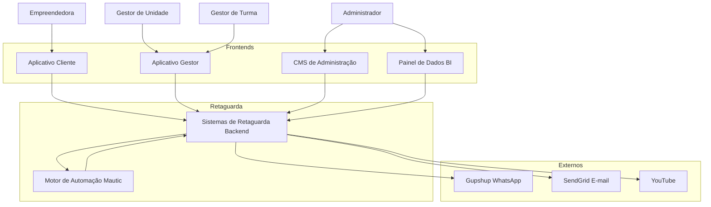
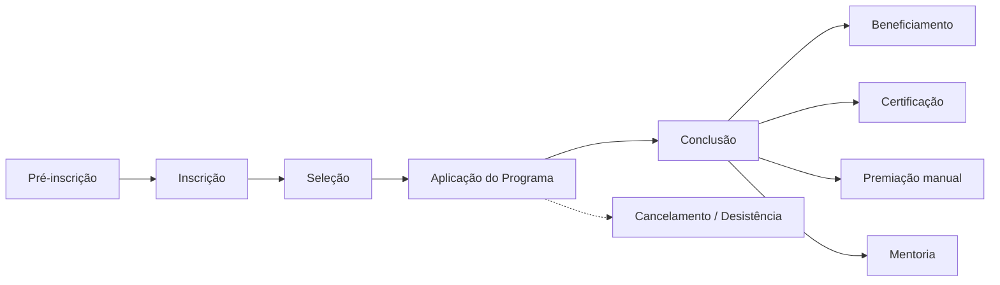
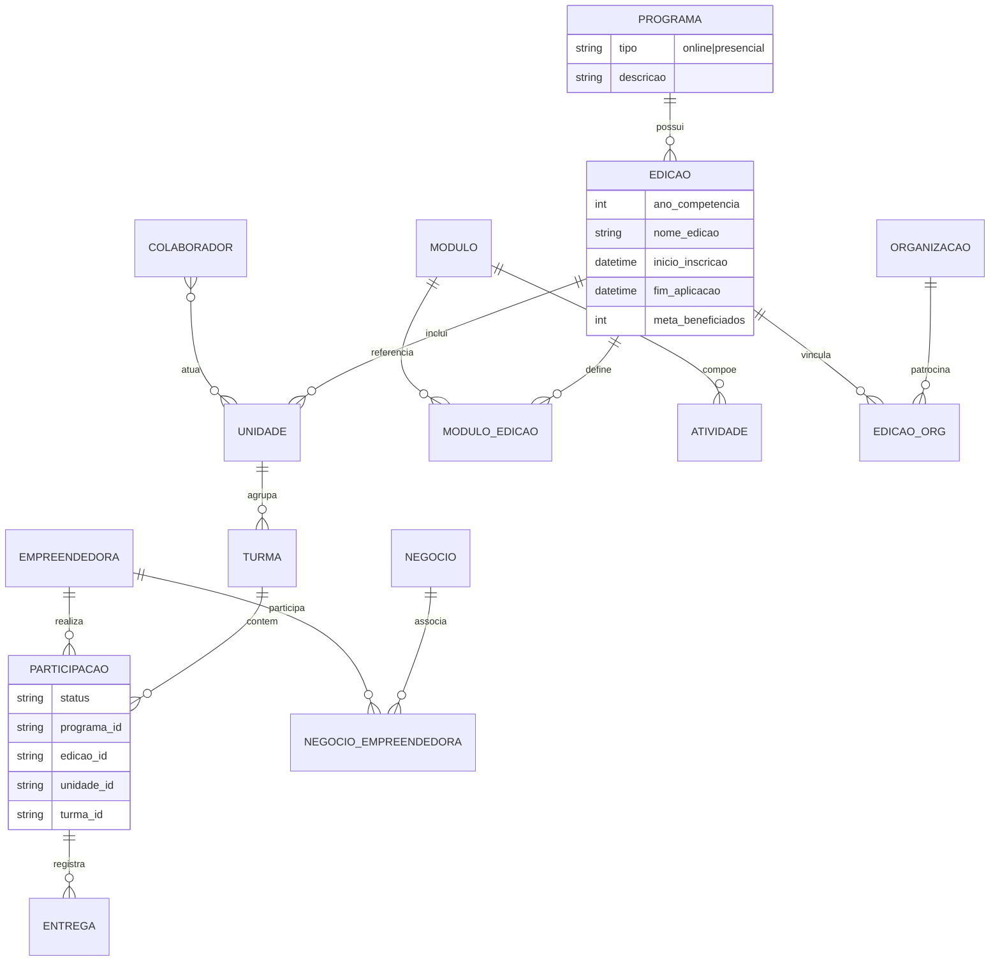

# Design — Sistema de Gestão de Programas Sociais (Consulado da Mulher)

**Versão:** 1.0 — jul/2026  
**Fontes:** [escopo_original_cliente.txt](escopo_original_cliente.txt), [Casos de Uso v3](Casos%20de%20Uso%20-%20Consulado%20da%20Mulher_v3.md), contrato EWTI × Consulado da Mulher (08.05.2026)

---

## 1. Visão geral

### 1.1 Contexto

O **Instituto Consulado da Mulher** é uma organização sem fins lucrativos focada na inclusão produtiva de mulheres empreendedoras em situação de vulnerabilidade social. Hoje o acompanhamento de programas e participantes depende de **planilhas e ferramentas descentralizadas**, com um sistema legado voluntário (2015) limitado a dados quantitativos em CSV.

O **Sistema Consulado da Mulher** centraliza a gestão de todos os programas, automatiza jornadas educacionais (online e presenciais), mensageria, indicadores de impacto e conformidade com a LGPD.

### 1.2 Objetivos do sistema

| Objetivo | Origem |
| -------- | ------ |
| Centralizar cadastro, frequência e histórico das beneficiadas | Escopo A |
| Disparar videoaulas, materiais e mensagens via WhatsApp | Escopo B |
| Receber tarefas, dados financeiros e formulários de indicadores | Escopo C |
| Inscrição online com aceites LGPD e gestão de turmas/unidades | Escopo D |
| Dashboards e relatórios quantitativos/qualitativos de impacto | Escopo E |
| Perfis e permissões segregados para equipe e beneficiadas | Escopo F |
| Nuvem, mobile-first, integrações WhatsApp/e-mail, segurança LGPD | Requisitos técnicos |

### 1.3 Princípios de design

1. **Canal principal da empreendedora:** WhatsApp + **Aplicativo Cliente** (web responsivo).
2. **Simplicidade de acesso:** login da empreendedora exclusivamente por **link mágico** — sem senha.
3. **Segregação por unidade:** gestores veem apenas dados das unidades/turmas autorizadas (LGPD).
4. **Vínculo obrigatório:** todo dado da empreendedora associa-se a **programa**, **edição** e **unidade** (e **turma**, quando aplicável).
5. **Orquestração vs. execução:** **Mautic** define *quando* disparar; **backend** executa regras, tokens e integrações.
6. **MVP 80/20:** priorizar edições 2027; funcionalidades fora do contrato podem ser simplificadas ou postergadas.

---

## 2. Arquitetura do sistema

### 2.1 Camadas funcionais

O sistema compreende **seis camadas** distintas:

| # | Camada | Tecnologia / implementação | Responsabilidade |
| - | ------ | -------------------------- | ---------------- |
| 1 | **CMS de Administração** | Strapi | Modelagem: programas, edições, módulos, unidades, organizações, colaboradores |
| 2 | **Aplicativo Gestor** | Next.js | Operação: seleção, turmas, validação de entregas, sequência presencial |
| 3 | **Aplicativo Cliente** | Next.js | Interface da empreendedora: inscrição, atividades, uploads, dados financeiros |
| 4 | **Painel de Dados (BI)** | Dashboards dedicados | Indicadores, relatórios, totalizadores (incl. base legada) |
| 5 | **Sistemas de Retaguarda (Backend)** | Node.js, Express, Prisma, MySQL | APIs, regras de negócio, tokens, filas, Gupshup/SendGrid, certificados |
| 6 | **Motor de Automação (Mautic)** | Mautic | Jornadas online: gatilhos, temporizadores, campanhas e lembretes |

### 2.2 Diagrama de contexto



### 2.3 Stack tecnológica (contrato)

| Componente | Tecnologia |
| ---------- | ---------- |
| Frontends | Next.js |
| API / Backend | Node.js, Express |
| ORM / persistência | Prisma |
| Banco de dados | MySQL |
| CMS | Strapi |
| Hospedagem | AWS |
| Mensageria WhatsApp | Gupshup (Meta Business API) |
| E-mail transacional | SendGrid |
| Automação de jornadas | Mautic |
| Videoaulas / lives | YouTube |

### 2.4 Separação Backend × Mautic

| Responsabilidade | Sistemas de Retaguarda (Backend) | Motor de Automação (Mautic) |
| ---------------- | -------------------------------- | --------------------------- |
| Autenticação link mágico | ✅ Geração e validação de tokens | — |
| Elegibilidade e status | ✅ UC23, UC29 | — |
| Envio WhatsApp/e-mail | ✅ Execução via Gupshup/SendGrid | Orquestra *quando* enviar |
| Links personalizados | ✅ UC54 | Usa em campanhas |
| Certificados PDF | ✅ UC55 | Pode disparar gatilho |
| Sequência jornada online | Recebe webhooks | ✅ UC33, UC52, UC53 |
| Temporizadores entre atividades | Persiste estado | ✅ Agenda etapas |

**Fluxo online (resumo):** inscrição na turma (UC17) → webhook ao **Mautic** → Mautic agenda etapas → **backend** gera links e chama **Gupshup**.

---

## 3. Modelo de domínio

### 3.1 Hierarquia principal

```
Programa → Edição → Unidade → Turma → Participante (Empreendedora)
```

| Entidade | Descrição |
| -------- | --------- |
| **Programa** | Metodologia: **tipo** (online ou presencial) + **descrição**. Não contém módulos diretamente. |
| **Edição** | Instância operacional: programa, unidades, ano de competência, semestre, cronogramas (inscrição/seleção/aplicação), meta de beneficiados, **módulos** e sequência. |
| **Unidade** | Agrupamento regional ou por parceiro; possui **ao menos uma turma**. Selecionada na inscrição. |
| **Turma** | Operacionalizada pelo Gestor de Turma; inscrição dispara jornada online (Mautic). |
| **Módulo** | Conjunto ordenado de **atividades educacionais** (tipos em UC15). |
| **Organização** | PJ (CNPJ) — patrocinador ou parceiro, associável à edição. |
| **Negócio** | Empreendimento individual ou coletivo vinculado a empreendedoras (UC31/32). |

### 3.2 Tipos de atividade (módulo)

| Tipo | Canal principal | Aprovação gestor |
| ---- | --------------- | ---------------- |
| Aula/reunião presencial | Aplicativo Gestor / Cliente | — |
| Videoaula pré-gravada | YouTube + Aplicativo Cliente | — |
| Videoaula ao vivo (live) | YouTube | — |
| Teste de conhecimento | Aplicativo Cliente | — |
| Resposta aberta | Aplicativo Cliente | — |
| Ferramenta de download | Aplicativo Cliente | — |
| **Tarefa de casa** (upload) | Aplicativo Cliente | **Obrigatória** (UC44) |
| Link externo | Aplicativo Cliente | — |
| Certificado | Automático (UC55) | — |
| **Registro dados financeiros** | Aplicativo Cliente (mensal) | **Obrigatória** (UC44) |
| Temporizador | Mautic | — |
| Texto aberto (WhatsApp) | Gupshup via Mautic | — |

### 3.3 Status da participante (ciclo de vida)

```
Pré-inscrita → Inscrita → Selecionada → Em assessoria → Beneficiada → Certificada
                                                              ↓
                                                    Contemplada (premiação manual)
                                                              ↓
                                              Descontinuada / Desistente (UC30)
```

### 3.4 Base legada

- Dados históricos (2015/planilhas) em **base de consulta somente leitura**.
- Não preenche formulários de nova inscrição.
- Totalizadores (participantes, beneficiadas, certificadas, premiadas) **somam** dados atuais + pregressos (UC71).
- Retenção LGPD: até **5 anos** após fim do programa; anonimização possível.

---

## 4. Atores e permissões

### 4.1 Perfis

| Perfil | Plataforma | Escopo |
| ------ | ---------- | ------ |
| **Administrador do Sistema** | CMS + BI | Global (master): usuários, migrações, configuração |
| **Administrador de Programa** | CMS | Programa(s) / edição(ões) atribuídos |
| **Gestor de Unidade** | Aplicativo Gestor | Todas as turmas da unidade; seleção, indicadores |
| **Gestor de Turma** | Aplicativo Gestor | Uma turma: validação, sequência, presencial, dados de acesso |
| **Colaborador** | CMS / Gestor | Pode acumular papéis de gestor |
| **Empreendedora** | Aplicativo Cliente | Próprios dados e atividades |
| **Voluntário / Mentor** | Gestor (consulta) | Mentoria (UC70) |

### 4.2 Autenticação

| Perfil | Mecanismo |
| ------ | --------- |
| Empreendedora | **Link mágico** (WhatsApp ou e-mail) — **sem senha**; sessão ~30 dias; **UUID de dispositivo** no localStorage (UC67) após inscrição ou login |

**Sessão persistente (UC67):**

- Backend emite **UUID** opaco após UC21 (inscrição completa) ou renova em UC4.
- Aplicativo Cliente persiste UUID no **localStorage** (com consentimento UC20).
- Retorno ao app: resolve participante por UUID → reconhece vínculo **programa + edição**.
- **Deep links** (UC54): URL com `turma_id`, `atividade_id`, `acao` — com UUID e sessão válidos, executa ação automaticamente (ex.: `acao=presenca` → UC40).
| Gestores / Admin CMS | E-mail + senha (política de complexidade e expiração) |
| 2FA | Previsto no Anexo LGPD do contrato; fora do MVP imediato |

### 4.3 Dados sensíveis

- **CPF:** chave de identificação; armazenamento **HMAC-SHA256 + pepper** (não em texto claro).
- Estrangeiros: CPF ou **RNE/outro documento** (campo separado).
- CPF validado **não pode ser alterado** pela empreendedora.
- Gestor de turma altera apenas **e-mail**, **telefone** e **unidade** (correção de alocação).

---

## 5. Fluxos operacionais

### 5.1 Macrofluxo



### 5.2 Pré-inscrição e inscrição

1. Lead acessa URL da edição (slug).
2. Aceites: LGPD, comunicação, cookies, localStorage (UC20).
3. Pré-cadastro captura lead; **localStorage** permite retomada (UC67).
4. Inscrição completa com **seleção de unidade**, CEP, perfil socioeconômico.
5. Consulta legado (somente leitura) — não pré-preenche cadastro (UC22/62).

### 5.3 Seleção e alocação

1. Backend valida elegibilidade automática (UC23).
2. Gestor de unidade seleciona participantes (UC24).
3. Backend comunica resultado via Gupshup (UC25).
4. Gestor aloca em turma (UC17) → **dispara Mautic** em programas online.

### 5.4 Aplicação do programa

**Online:** Mautic envia sequência de atividades via Gupshup; links com login mágico.

**Presencial:** Gestor de turma define sequência, locais, datas e atividades extras (UC34/35).

**Entregas com aprovação:** tarefa de casa e dados financeiros → gestor aprova/reprova (UC44) → notificação + indicador visual no Aplicativo Cliente.

### 5.5 Conclusão

- Beneficiamento e certificado: regras automáticas no backend (UC13, UC55).
- Premiação: critérios **textuais** no CMS; registro **manual** no Aplicativo Gestor (UC57).
- Mentoria: registro com voluntário/mentor (UC70).

---

## 6. Integrações externas

| Integração | Uso | UCs relacionados |
| ---------- | --- | ---------------- |
| **Gupshup (WhatsApp)** | Mensagens **individuais** (API), vídeos, links mágicos, jornada online | UC4, UC25, UC49, UC51, UC54, UC33 |
| **Grupo WhatsApp** | Comunicação **manual** facilitada pelo App Gestor (clipboard + link) | UC50 |
| **SendGrid** | E-mail transacional, links mágicos | UC4, UC54 |
| **YouTube** | Videoaulas gravadas e transmissões ao vivo | UC37, UC38 |
| **Mautic** | Campanhas, temporizadores, lembretes | UC33, UC52, UC53 |
| **AWS** | Hospedagem, ambientes, CI/CD | Infraestrutura |

**Custos variáveis (contrato Fase 3):** volume WhatsApp e consumo de IA reportados mensalmente.

---

## 7. Requisitos não funcionais

### 7.1 Escopo original + contrato

| Requisito | Meta / abordagem |
| --------- | ---------------- |
| Usuários ativos | ~2.000–3.000 participantes/ano; 15–20 colaboradores; 3 administradores |
| Acessibilidade | Mobile-first; alerta de compatibilidade de navegador (UC72) |
| Hospedagem | Cloud AWS |
| LGPD | Anexo I; segregação por unidade; retenção 5 anos |
| Segurança | Política de senhas; plano de resposta a incidentes; pentest anual (Fase 3) |
| 2FA | Contrato + Anexo LGPD; implementação alinhada à fase contratual |
| Disponibilidade | Sustentação 24 meses pós go-live (Fase 3) |

### 7.2 Engajamento e métricas

- **Engajamento** = **conclusão de atividade**, não apenas visualização de vídeo.
- Questionários: feedback explicativo **sem nota** ao participante.
- Dados financeiros: registro **mensal** (faturamento, renda, investimento, poupança, despesas, clientes, produtos vendidos).

---

## 8. Modelo de dados (visão lógica)



**Regra transversal:** `programa_id`, `edicao_id` e `unidade_id` obrigatórios em registros da empreendedora; `turma_id` quando aplicável.

---

## 9. Mapeamento escopo original → sistema v3

| Módulo escopo | Implementação v3 |
| ------------- | ---------------- |
| A) Gestão de beneficiadas | CMS + Backend + Aplicativo Cliente/Gestor (UC27, UC28) |
| B) Videoaulas e mensagens | YouTube + Gupshup + Mautic (UC33, UC37–38, UC49–53) |
| C) Materiais e exercícios | Aplicativo Cliente + aprovação gestor (UC43–46) |
| D) Inscrição e programas | Slug, unidade, edição, turmas (UC19–21, UC9, UC16) |
| E) Relatórios e indicadores | Painel BI (UC59–61, UC71) |
| F) Usuários e permissões | CMS roles + segregação unidade (UC1, UC5, UC74) |
| Chat dúvidas (escopo B) | UC64 — Fase 3 / evolução contratual |

---

## 10. Fases do contrato e MVP

### 10.1 Fases contratuais (EWTI × Consulado)

| Fase | Objetivo | Entregáveis principais |
| ---- | -------- | ---------------------- |
| **Fase 1** | Prototipação | Requisitos, jornadas, protótipo navegável, homologação |
| **Fase 2** | Desenvolvimento (2–4 meses) | Aplicativo Cliente, CMS, Painéis/BI, App Gestor, código-fonte |
| **Fase 3.1** | Infraestrutura AWS | 24 meses pós produção |
| **Fase 3.2** | Manutenção e evolução | Suporte + melhorias contínuas |
| **Fase 3.3** | Pentest anual | Auditoria de segurança |

### 10.2 Priorização MVP (meta: edições 2027)

**Essenciais:** UC1–UC6, UC7–UC18, UC19–UC26, UC27–UC32, UC33–UC45, UC49–UC55, UC59–UC60, UC66

**Fase 3 / evolução:** UC26 (Mini CRM), UC51, UC56–UC58, UC63–UC65, UC64 (Chat IA), UC67–UC75

---

## 11. Equipe e responsabilidades (resumo)

| Frente | Responsável principal |
| ------ | --------------------- |
| Arquitetura, CMS, requisitos | Alexandre Notte |
| Tech lead, APIs críticas | Yann Jaster |
| Aplicativo Cliente + Gestor | Victor (+ José front-end) |
| Backend, Gupshup, SendGrid, filas | Dayvid Lima |
| BI e indicadores | Juvenal Coelho |
| UX/UI | Eduardo Magno |
| Infra AWS, CI/CD | Mateus |

Detalhamento: [Alocacao Casos de Uso - Time Desenvolvimento.md](Alocacao%20Casos%20de%20Uso%20-%20Time%20Desenvolvimento.md)

---

## 12. Documentos relacionados

| Documento | Conteúdo |
| --------- | -------- |
| [Casos de Uso v3](Casos%20de%20Uso%20-%20Consulado%20da%20Mulher_v3.md) | 75 casos de uso detalhados |
| [escopo_original_cliente.txt](escopo_original_cliente.txt) | Escopo inicial da organização |
| [contrato/](contrato/) | Contrato de licenciamento (08.05.2026) |
| [time_desenvolvimento.md](time_desenvolvimento.md) | Estrutura da equipe |
| [reunioes/](reunioes/) | Atas de levantamento (abr.–jun. 2026) |

---

## 13. Decisões de arquitetura (ADR resumidas)

| # | Decisão | Justificativa |
| - | ------- | ------------- |
| ADR-01 | Strapi como CMS de Administração | Modelagem flexível; contrato prevê plataforma de gestão de conteúdos |
| ADR-02 | Link mágico para empreendedora | Perfil de vulnerabilidade digital; observações v3 |
| ADR-03 | Mautic separado do backend | Orquestração de campanhas sem acoplar regras de negócio |
| ADR-04 | Gupshup para WhatsApp | Integração contratual; custo variável por volume |
| ADR-05 | YouTube para vídeos/lives | Escopo e reuniões; evita custo de streaming próprio |
| ADR-06 | CPF com HMAC-SHA256 + pepper | LGPD; referência técnica validada |
| ADR-07 | Premiação manual | Critérios textuais; sem automação de ranking (obs. v2/v3) |
| ADR-08 | Hierarquia Programa→Edição→Unidade→Turma | Reuniões 22–25/jun.; segregação LGPD |
| ADR-09 | Base legada somente consulta | Não poluir cadastro ativo; totalizadores consolidados |
| ADR-10 | UC50 — grupo WhatsApp manual | Interação em grupo é atividade manual do gestor; sistema facilita (clipboard + link UC16/UC66), sem API Gupshup |
| ADR-11 | UUID de dispositivo (UC67) | Após inscrição completa, UUID no localStorage identifica participante em programa/edição; deep links executam ações com sessão válida |

---

_Documento de design derivado dos artefatos de requisitos do projeto Consulado da Mulher. Para detalhamento comportamental, consultar os casos de uso individuais na v3._
