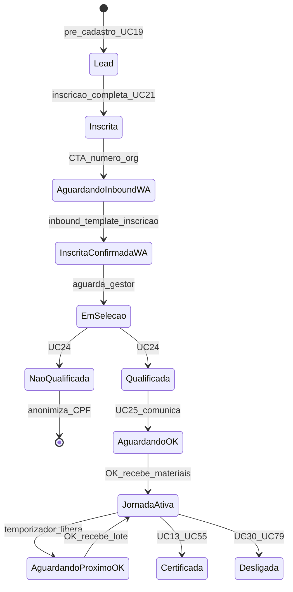
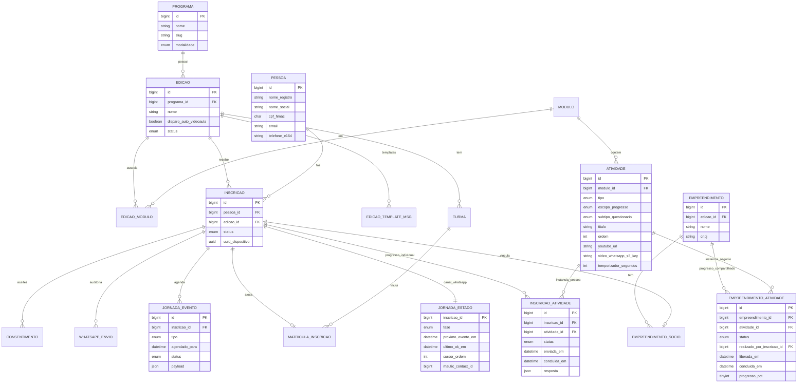
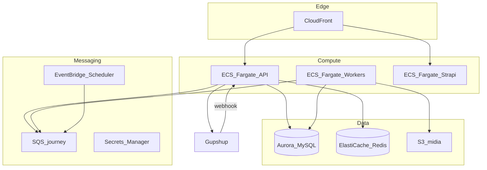

# ADR — Jornada de programas online (orquestração, dados e infra)

| Campo | Valor |
| ----- | ----- |
| **Status** | Aceito (WhatsApp path) — ago/2026 |
| **Data** | 2026-08-05 |
| **Contexto** | Casos de Uso v7, observações v6, reuniões 21–27/jul. 2026 |
| **Decisores** | Arquitetura EWTI × Consulado da Mulher |

---

## 1. Contexto

Programas **online** (ex.: Empreende no Zap) exigem uma jornada WhatsApp + Aplicativo Cliente com:

- pós-cadastro: usuária **escreve** no número WhatsApp da organização (CMS/Strapi) → template Meta de inscrição;
- seleção humana; **Comunicar aprovação (UC25)** inicia a automação do módulo;
- confirmação por **"OK"**;
- liberação de atividades por **temporizador** (independente de conclusão);
- envio de conteúdo **somente após OK**, em **lote** (todas liberadas e ainda não recebidas);
- links com **login mágico**;
- videoaula via YouTube no site e, opcionalmente, arquivo compatível WhatsApp (checkbox na edição);
- **Download:** template + **arquivos no WhatsApp** após o OK; os mesmos documentos no Aplicativo Cliente (independente do checkbox de videoaula).

Reuniões de jul/2026 pedem **controle de custo** e regras de domínio específicas (Gupshup, status de atividade). Mautic no contrato é negociável (`fora_escopo_v1`).

### Fontes

- [Casos de Uso - Consulado da Mulher_v7.md](../Casos%20de%20Uso%20-%20Consulado%20da%20Mulher_v7.md) — UC19–UC25, UC33, UC51, UC54
- [observacoes caso de uso v6.txt](../observacoes%20caso%20de%20uso%20v6.txt)
- [fora_escopo_v1.md](../fora_escopo_v1.md) — Mautic marcado como PODE SER FORA

---

## 2. Decisão

| Tema | Decisão |
| ---- | ------- |
| Fonte da verdade da jornada | Backend + MySQL (`empreendimento_atividade` + `inscricao_atividade` + `jornada_evento`) |
| **Propriedade operacional** | Empreendimento = presença, faturamento, planos, plano de ação, doação, % 50/75; Empreendedora = WhatsApp, questionários; certificado em cascata a todos os sócios |
| **Início da jornada online** | Evento **UC25 Comunicar aprovação** (não UC24 qualificar; não alocar turma) |
| **1º contato pós-cadastro** | Inbound da usuária no nº org (Strapi) → template inscrição |
| Orquestração WhatsApp (liberar / OK / lote) | **Backend JS + filas** (BullMQ ou SQS + workers) — **fila de jornada** |
| Alertas / nurturing e-mail+WA | **Fila de alertas** no Backend (UC87) — regras tipadas no CMS |
| Mautic | **Removido do projeto** |
| CMS de configuração | **Strapi** (programa, edição, módulos, templates Meta, **número WhatsApp org**) |
| Banco | **Aurora MySQL 8** (preferência AWS) ou RDS MySQL; MariaDB aceitável se padronizado na operação |
| Canal WhatsApp | **Gupshup**; e-mail SendGrid ou SES |
| Infra | AWS: ECS Fargate, Aurora, ElastiCache/SQS, S3, EventBridge, Secrets Manager |

### Por que fila no backend (e não Mautic) no WhatsApp

1. Regras de **lote pós-OK**, status `liberada` ≠ `enviada`, e **empreendimento coletivo** são domínio nosso — Mautic vira acoplamento frágil.
2. Webhook Gupshup (inbound OK / 1º contato) já entra no backend; a fila fica no mesmo lugar.
3. Controle de custo e disparo manual UC25/UC53 pedem auditoria no nosso banco.
4. Contrato: Mautic pode sair (`fora_escopo_v1`) sem reescrever a jornada.

**Mautic** permanece utilizável depois para e-mail massivo, se o comercial mantiver a licença.

---

## 3. Jornada do usuário (programa online)

### 3.1 Máquina de estados



### 3.2 Passo a passo

| # | Momento | Participante | Sistema |
| - | ------- | ------------ | ------- |
| 1 | Landing `/e/[slug]` | Abre link da edição | Valida UUID localStorage; novo → pré-cadastro |
| 2 | Pré-cadastro (UC19) | Nome, telefone, e-mail + aceites | Cria lead — **sem** WhatsApp automático de inscrição |
| 3 | Inscrição (UC21) | 4 blocos + aceites finais | Gera ID; hash CPF; alocação se unidade/turma única; `em_selecao` |
| 4 | Confirmação | Vê ID, prazo e **CTA + nº WhatsApp org** | UUID no dispositivo |
| 5 | 1º contato | Escreve no nº da organização | Inbound → template Meta de inscrição (**não** inicia UC33) |
| 6 | Seleção (UC24) | Aguarda | Gestor classifica / aloca (**sem** WhatsApp de jornada) |
| 7 | UC25 | — | Template aprovação + **liga** jornada (1º gatilho do módulo) |
| 8 | OK / loop | OK recebe lote | Temporizador libera; envio só após OK |
| 9 | Consumo | Player / questionário individual / planos | Questionário por pessoa; demais no negócio |
| 10 | Fim | Certificado em cascata se o negócio cumpre % | UC55; BI = pessoas + empreendimentos |

### 3.3 Regras de orquestração (UC33)

0. **UC25 inicia** a orquestração WhatsApp. Qualificar (UC24) e alocar turma **não** disparam.
1. **Liberação ≠ envio.** Temporizador só marca `liberada`.
2. **Envio = "OK".** Envia **todas** liberadas e ainda não enviadas.
3. **Conclusão ≠ risco.** Maratona esperada; risco = silêncio + represamento (UC56/UC53).
4. **Texto aberto** = mensagem WhatsApp, não aula pedagógica.
5. Checkbox `edicao.disparo_auto_videoaula`: se OFF, lote **sem arquivo de vídeo** no WhatsApp. **Download** envia template **e os arquivos** no WhatsApp após o OK, independente dessa flag; os mesmos documentos ficam no Aplicativo Cliente.
6. Desistência (UC30/UC79) cancela eventos pendentes e remove da jornada.

---

## 4. Diagrama ER (controle da jornada)

### 4.1 Visão geral



### 4.2 DDL de referência (operacional)

```sql
-- Configuração (também modelável no Strapi)
programa (
  id, nome, slug,
  modalidade ENUM('online','presencial','hibrido'),
  descricao
);

edicao (
  id, programa_id, nome, ano_competencia,
  dt_ini_inscricao, dt_fim_inscricao,
  dt_ini_selecao, dt_fim_selecao,
  dt_ini_aplicacao, dt_fim_aplicacao,
  meta_beneficiados,
  disparo_auto_videoaula TINYINT(1) DEFAULT 0,
  slug_publico,
  status ENUM('rascunho','aberta','encerrada')
);

modulo (id, nome, descricao);
edicao_modulo (edicao_id, modulo_id, ordem);

atividade (
  id, modulo_id,
  tipo ENUM(
    'videoaula_pregravada','videoaula_live','questionario',
    'download','tarefa_casa','plano_marketing','plano_acao',
    'link_externo','dados_financeiros','presenca',
    'certificado','temporizador','texto_aberto_whatsapp'
  ),
  escopo_progresso ENUM('empreendimento','empreendedora') NOT NULL,
  -- empreendimento: presença, faturamento, planos, plano de ação (1x/negócio)
  -- empreendedora: questionários (N respostas, 1 por sócia)
  subtipo_questionario ENUM('inicial','final','nps') NULL,
  titulo, descricao, ordem,
  youtube_url NULL,
  video_whatsapp_s3_key NULL,
  arquivo_download_s3_key NULL,
  meta_progresso_pct TINYINT NULL,
  temporizador_segundos INT NULL,
  -- templates: PacoteComunicacao (UC88), não por linha de atividade
  conta_beneficiamento TINYINT(1) DEFAULT 1,
  conta_certificacao TINYINT(1) DEFAULT 1
);

pacote_comunicacao (
  id, nome, modalidade ENUM('online','presencial_hibrido','ambos'),
  versao, ativo
);

pacote_template (
  id, pacote_id,
  escopo ENUM('tipo_atividade','momento_jornada'),
  tipo_atividade VARCHAR NULL,
  variante_aula ENUM('presencial','ao_vivo') NULL,
  momento_key VARCHAR NULL,
  template_gupshup_key, template_email_id NULL
);

edicao (
  ...
  pacote_comunicacao_id FK,
  snapshot_pacote JSON NULL  -- congelado no publish; substitui edicao_template_mensagem
);

-- Participante
pessoa (
  id,
  nome_registro, nome_social,
  cpf_hmac CHAR(64),
  email, telefone_e164
);

inscricao (
  id, pessoa_id, edicao_id, unidade_id NULL,
  status ENUM(
    'pre_inscrita','inscrita','em_selecao',
    'qualificada','nao_qualificada','em_analise',
    'em_assessoria','beneficiada','certificada',
    'recebeu_doacao','desligada'
  ),
  score_vulnerabilidade DECIMAL(5,2) NULL,
  preferencia_periodo ENUM('manha','tarde') NULL,
  uuid_dispositivo CHAR(36) NULL
);

turma (id, edicao_id, unidade_id, nome, vagas, link_grupo_whatsapp);

matricula_inscricao (
  inscricao_id, turma_id,
  alocado_em,
  jornada_iniciada_em NULL,
  jornada_pausada TINYINT(1) DEFAULT 0
);

consentimento (
  id, pessoa_id, inscricao_id NULL,
  tipo, versao_termo, aceito_em, dispositivo
);

-- Empreendimento (negócio) e sócios na edição
empreendimento (
  id, edicao_id, nome, cnpj NULL, segmento NULL,
  UNIQUE KEY uk_emp_edicao_cnpj (edicao_id, cnpj)
);

empreendimento_socio (
  empreendimento_id, inscricao_id,
  PRIMARY KEY (empreendimento_id, inscricao_id),
  UNIQUE KEY uk_insc_emp (inscricao_id)  -- 1 empreendimento por inscrição/edição
);

-- Progresso compartilhado (presença, planos, faturamento, tarefa…)
empreendimento_atividade (
  id,
  empreendimento_id, atividade_id,
  programa_id, edicao_id, unidade_id, turma_id,
  status ENUM(
    'agendada','liberada','enviada',
    'em_andamento','concluida','reprovada','cancelada'
  ),
  realizado_por_inscricao_id BIGINT NULL,  -- sócia que executou/registrou
  liberada_em DATETIME NULL,
  concluida_em DATETIME NULL,
  progresso_pct TINYINT DEFAULT 0,
  payload JSON NULL,  -- plano de ação, faturamento competência, etc.
  UNIQUE KEY uk_emp_ativ (empreendimento_id, atividade_id),
  -- faturamento: garantir 1 por competência via payload/chave auxiliar
  KEY idx_liberacao (status, liberada_em)
);

-- Progresso individual (questionários) + rastreio de envio WhatsApp por sócia
inscricao_atividade (
  id,
  inscricao_id, atividade_id,
  status ENUM(
    'agendada','liberada','enviada',
    'em_andamento','concluida','reprovada','cancelada'
  ),
  liberada_em DATETIME NULL,
  enviada_em DATETIME NULL,
  concluida_em DATETIME NULL,
  resposta JSON NULL,
  tentativa_envio INT DEFAULT 0,
  ultimo_erro_envio VARCHAR(500) NULL,
  UNIQUE KEY uk_insc_ativ (inscricao_id, atividade_id),
  KEY idx_lote (inscricao_id, status)
);

jornada_estado (
  inscricao_id PRIMARY KEY,
  fase ENUM(
    'nao_iniciada','aguardando_ok_participacao',
    'ativa','aguardando_ok_conteudo','concluida','cancelada'
  ),
  proximo_evento_em DATETIME NULL,
  ultimo_ok_em DATETIME NULL,
  cursor_ordem INT DEFAULT 0,
  mautic_contact_id BIGINT NULL,
  atualizado_em DATETIME
);

jornada_evento (
  id, inscricao_id,
  tipo ENUM(
    'liberar_por_temporizador',
    'solicitar_ok_conteudo',
    'enviar_lote_apos_ok',
    'lembrete_atividade',
    'enviar_template'
  ),
  atividade_id NULL,
  agendado_para DATETIME,
  processado_em DATETIME NULL,
  status ENUM('pendente','processando','ok','erro','cancelado'),
  payload JSON,
  KEY idx_due (status, agendado_para)
);

whatsapp_envio (
  id, inscricao_id, atividade_id NULL,
  provider_msg_id, template_key,
  direcao ENUM('outbound','inbound'),
  corpo_resumo, status_entrega, criado_em
);

whatsapp_inbound (
  id, telefone_e164, inscricao_id NULL,
  texto, button_payload,
  processado TINYINT(1), criado_em
);
```

### 4.3 Exemplo de sequência

```text
ordem 1: texto_aberto (boas-vindas pós-OK)
ordem 2: videoaula (inicial)
ordem 3: download (material)
ordem 4: temporizador 48h
ordem 5: videoaula "Diagnóstico..."
ordem 6: questionario
ordem 7: download
```

Evento `liberar_por_temporizador` (ordem 4) → marca 5–7 como `liberada` em `empreendimento_atividade` (escopo negócio) e/ou `inscricao_atividade` (questionário) → `solicitar_ok_conteudo` **por sócia** → inbound OK → envio WhatsApp por inscrição; conclusão compartilhada conta 1× para o % do negócio.

---

## 5. MariaDB vs MySQL

| Critério | Nota |
| -------- | ---- |
| Strapi / Node | Ambos OK (`mysql` dialect) |
| JSON, InnoDB, índices | Equivalentes para este domínio |
| **Aurora MySQL 8 / RDS MySQL** | Melhor encaixe AWS (HA, réplicas, Performance Insights) |
| **MariaDB** | Aceitável se já for padrão operacional |

**Escolha preferida deste ADR:** Aurora MySQL 8 (ou RDS MySQL 8). A diferença funcional para a jornada é irrelevante; a escolha é operacional/AWS.

---

## 6. Implementação (backend JS + Strapi + AWS)

### 6.1 Stack

| Camada | Tecnologia |
| ------ | ---------- |
| CMS | Strapi 4/5 — programa, edição, módulo, atividade, templates |
| API operacional | NestJS ou Fastify + TypeScript |
| Filas | BullMQ + ElastiCache Redis **ou** SQS |
| WhatsApp | Gupshup |
| E-mail | SendGrid ou SES |
| Auth empreendedora | Link mágico (JWT curto + sessão ~30 dias) |
| Front | Next.js (Cliente / Gestor) |

### 6.2 Módulos de serviço

```text
JourneyOrchestrator
  - onOkParticipacao(inscricaoId)  // canal individual; progresso no empreendimento
  - onOkConteudo(inscricaoId)
  - liberarPorTemporizador(eventoId)  // escreve empreendimento_atividade e/ou inscricao_atividade
  - montarLotePendente(inscricaoId)
  - avaliarPercentuais(empreendimentoId)  // 50% beneficiamento / 75% certificação
  - emitirCertificadosCascata(empreendimentoId)  // PDF para cada sócia

WhatsAppGateway
  - sendTemplate / sendMediaVideo / sendMediaDocument
  - handleWebhookInbound("OK")

MagicLinkService
  - issue({ inscricaoId, atividadeId, acao })

SchedulerWorker
  - processa jornada_evento WHERE agendado_para <= NOW()
```

### 6.3 Pseudocódigo — OK de conteúdo

```ts
async function onOkConteudo(inscricaoId: string) {
  const socio = await db.empreendimentoSocio.findByInscricao(inscricaoId);
  const empId = socio.empreendimentoId;

  // Envios WhatsApp são por sócia; progresso compartilhado vive no empreendimento
  const individuais = await db.inscricaoAtividade.findMany({
    where: { inscricaoId, status: 'liberada', enviadaEm: null },
    include: { atividade: true },
    orderBy: { atividade: { ordem: 'asc' } },
  });
  const compartilhadas = await db.empreendimentoAtividade.findMany({
    where: { empreendimentoId: empId, status: 'liberada' },
    include: { atividade: true },
    orderBy: { atividade: { ordem: 'asc' } },
  });

  for (const item of [...individuais, ...compartilhadas]) {
    const link = await magicLink.issue({
      inscricaoId,
      atividadeId: item.atividadeId,
      acao: item.atividade.tipo,
    });
    await whatsapp.sendLoteItem({ inscricaoId, item, link });
    // Download: template + arquivos no WhatsApp; os mesmos docs ficam no Cliente.
    // Vídeo Aula: arquivo WhatsApp só se edicao.disparo_auto_videoaula.
    if (item.inscricaoId) {
      await db.inscricaoAtividade.update(item.id, {
        status: 'enviada',
        enviadaEm: new Date(),
      });
    }
  }
  // Conclusão (player, upload, questionário) atualiza a tabela conforme
  // atividade.escopo_progresso; % 50/75 calcula sobre empreendimento_atividade.
}
```

### 6.4 Papel do Strapi

- Configura edição, sequência, temporizadores, **pacote de comunicação (UC88)**, checkbox videoaula.
- Webhook `afterPublish` → backend grava snapshot imutável da edição (evita mudar jornada no meio).
- Gestor de turma **não** altera temporizadores (regra v6).

---

## 7. Alertas / nurturing (sem Mautic)

| Responsabilidade | Preferência |
| ---------------- | ----------- |
| Liberar / OK / lote / Gupshup | **Fila de jornada** no Backend (UC33) |
| Alertas de engajamento / nurturing e-mail+WA | **Fila de alertas** no Backend (UC87/UC52) — regras na **aba Alertas** de UC88 |
| Lembrete inscrição incompleta | Alerta `inscription_incomplete` + fallback manual UC26 |

**Mautic foi removido do projeto.** Não há webhooks Mautic → jornada. SendGrid e Gupshup são acionados **somente pelo Backend**.

**MySQL permanece fonte da verdade** (`AlertRule`, `EditionAlertBinding`, `AlertDispatchLog`).

**Recomendação MVP:** catálogo de alertas no CMS + binding por edição; sem workflow builder livre.

---

## 8. Infraestrutura AWS



| Serviço | Uso |
| ------- | --- |
| ECS Fargate | API, workers, Strapi |
| Aurora MySQL Multi-AZ | Dados + jornada |
| ElastiCache Redis | BullMQ / cache |
| SQS + DLQ | Eventos liberar / enviar / lembrete |
| EventBridge Scheduler | Due events |
| S3 + CloudFront | Vídeos WhatsApp, PDFs |
| Secrets Manager | Pepper CPF, Gupshup, JWT |
| ALB + WAF | APIs e webhook |
| CloudWatch | Logs e alarmes de fila |

### Fluxo de um temporizador

1. Início da jornada calcula `liberada_em` e grava `jornada_evento`.
2. EventBridge one-shot **ou** poll `agendado_para <= now()`.
3. SQS → worker libera atividades → enfileira `solicitar_ok_conteudo`.
4. Webhook Gupshup (OK) → SQS `enviar_lote` → Gupshup + UPDATE `enviada`.

---

## 9. Consequências

### Positivas

- Regras UC33 ficam explícitas e testáveis no backend.
- Controle de custo WhatsApp (flag + disparos manuais) permanece no domínio.
- Strapi centraliza configuração sem misturar orquestração.
- Aurora/SQS/ECS alinhados ao padrão AWS da EWTI.

### Negativas / trade-offs

- Não reutiliza UI de campanhas do Mautic para a trilha educacional.
- Exige workers e monitoramento de filas (operação).
- Snapshot de edição publicada precisa de disciplina de versionamento.

### Riscos mitigados

| Risco | Mitigação |
| ----- | --------- |
| Dupla fonte de verdade (Mautic × DB) | Mautic fora do caminho crítico WhatsApp |
| Envio sem OK | Status `liberada` ≠ `enviada` |
| Mudança de módulo mid-flight | Snapshot imutável pós-publish |
| Desistência com mensagens pendentes | `jornada_pausada` + cancelamento de eventos |

---

## 10. Alternativas consideradas

| Alternativa | Motivo de rejeição / adiamento |
| ----------- | ------------------------------ |
| Mautic como orquestrador principal | Canal WhatsApp + regras de lote/OK; reuniões pedem disparo manual e custo controlado |
| Orquestração só no Strapi | Strapi não é engine de filas/webhooks de alta confiabilidade |
| Consumo aleatório de aulas | Fora de escopo (v6 / fora_escopo) |
| Hospedar vídeo no próprio backend | YouTube + S3 para WhatsApp |

---

## 11. Próximos passos

1. Prototipar schema `empreendimento_atividade` + `inscricao_atividade` + `jornada_evento` em ambiente de dev.
2. Content-types Strapi: templates Meta, número WhatsApp org, checkbox videoaula, limiares de maratona.
3. Implementar workers BullMQ/SQS: liberar / solicitar OK / enviar lote / inbound inscrição.
4. Mautic: manter fora do WhatsApp MVP; decidir e-mail (Fase 3 / UC82) no comercial.

---

## 12. Referências cruzadas

| Artefato | Relação |
| -------- | ------- |
| UC33, UC51, UC54 | Comportamento da jornada |
| UC13, UC31, UC40, UC45, UC55 | Propriedade empreendimento × empreendedora |
| UC19, UC21, UC24, UC25 | Entrada e seleção |
| UC9 | Checkbox disparo videoaula |
| fora_escopo_v1 §H | Mautic como PODE SER FORA |

---

_Documento ADR — ago/2026. Pasta: `documentacao/docs/`._
