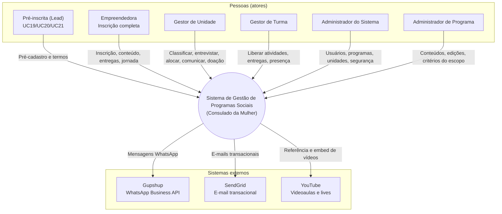

# C4 — Nível 1: Diagrama de Contexto

**Sistema:** Sistema de Gestão de Programas Sociais — Consulado da Mulher
**Fonte:** Casos de Uso — Consulado da Mulher v7

## Objetivo deste nível

Mostrar o sistema como uma caixa única (black box) e suas interações com pessoas (atores) e sistemas externos. É o nível de maior abstração do C4 — não entra em tecnologia nem em estrutura interna (isso é o Nível 2 — Container).

## Diagrama (preview — flowchart Mermaid)

Visualização compatível com o preview de Markdown no Cursor/VS Code (sem dialeto C4).

## Diagrama (fonte C4)

Notação oficial C4 para editores com suporte a `C4Context` (ex.: [mermaid.live](https://mermaid.live)).

## Elementos

### Pessoas (atores)

| Ator | Papel no contexto |
|---|---|
| Pré-inscrita (Lead) | Iniciou o processo, ainda sem inscrição completa |
| Empreendedora | Usuária final da jornada educacional, via Aplicativo Cliente |
| Gestor de Unidade | Opera seleção e turmas de toda a unidade, via Aplicativo Gestor |
| Gestor de Turma | Opera apenas a própria turma, via Aplicativo Gestor |
| Administrador do Sistema | Controle total do CMS de Administração |
| Administrador de Programa | Escopo restrito a programas/edições no CMS |

> Colaborador, Voluntário/Mentor e Organização são **entidades de domínio**, não atores — não interagem diretamente com o sistema (ver convenção da spec v7).

### Sistema em foco

**Sistema de Gestão de Programas Sociais (Consulado da Mulher)** — plataforma única no diagrama de contexto; sua decomposição interna (CMS, Aplicativo Gestor, Aplicativo Cliente, Painel de Dados BI, Backend) é tratada no **Nível 2 — Container**.

### Sistemas externos

| Sistema | Papel | Acionado por |
|---|---|---|
| Gupshup | WhatsApp Business API (mensagens, links mágicos, templates Meta) | Somente pelo Backend |
| SendGrid | E-mail transacional (links mágicos, alertas) | Somente pelo Backend |
| YouTube | Videoaulas e transmissões ao vivo | Aplicativo Cliente (consumo) |

## Pendências / pontos a confirmar

- **Organização (Patrocinador/Parceiro):** hoje é entidade de domínio, mas a spec cita possível acesso restrito ao BI (UC59). Se confirmado, vira ator secundário neste diagrama.
- **Agente de IA (UC64):** é uma capacidade do Aplicativo Cliente, não um sistema externo — não entra como caixa própria neste nível.

## Notação

- **Preview local:** Mermaid `flowchart` (seção acima) — funciona no preview embutido de Markdown.
- **Fonte C4:** Mermaid `C4Context` — use mermaid.live ou extensão com suporte C4 para editar/visualizar o bloco da seção “fonte C4”.
