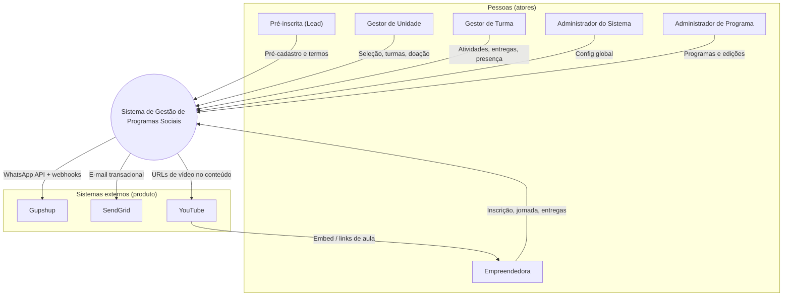
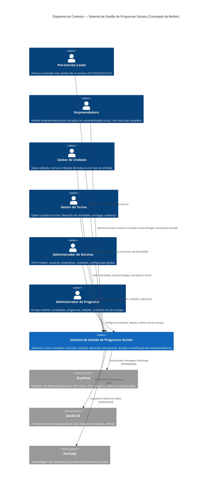

# C4 — Nível 1: Diagrama de Contexto

**Sistema:** Sistema de Gestão de Programas Sociais — Consulado da Mulher
**Fonte (spec):** [Casos de Uso v10](../../Casos%20de%20Uso%20-%20Consulado%20da%20Mulher_v10.md) — diagrama original derivado da v7; revalidado contra a stack em out/2026
**Stack de referência:** `cm_backend`, `cm_frontend`, `cm_app_gestor`, `cm_cms_gestao` (Strapi), BI externo (`bi.menduca.com.br` via `cm_hub`)

## Objetivo deste nível

Mostrar o sistema como uma caixa única (black box) e suas interações com pessoas (atores) e sistemas externos. É o nível de maior abstração do C4 — não entra em tecnologia nem em estrutura interna (isso é o Nível 2 — Container).

## Diagrama (preview — flowchart)

Visualização para preview de Markdown (sem dialeto C4). Conteúdo equivalente ao bloco **fonte C4** abaixo.

## Diagrama (fonte C4)

## Elementos

### Pessoas (atores)

| Ator | Papel no contexto |
|---|---|
| Pré-inscrita (Lead) | Iniciou o processo, ainda sem inscrição completa |
| Empreendedora | Usuária final da jornada educacional, via Aplicativo Cliente |
| Gestor de Unidade | Opera seleção e turmas de toda a unidade, via Aplicativo Gestor |
| Gestor de Turma | Opera apenas a própria turma, via Aplicativo Gestor |
| Administrador do Sistema | Controle total do CMS de Administração |
| Administrador de Programa | Escopo restrito a programas/edições no CMS |

> Colaborador, Voluntário/Mentor e Organização são **entidades de domínio**, não atores — não interagem diretamente com o sistema (ver convenção da spec v7).

### Sistema em foco

**Sistema de Gestão de Programas Sociais (Consulado da Mulher)** — plataforma única no diagrama de contexto; sua decomposição interna (CMS, Aplicativo Gestor, Aplicativo Cliente, Painel de Dados BI, Backend) é tratada no **Nível 2 — Container**.

### Sistemas externos

| Sistema | Papel | Acionado por |
|---|---|---|
| Gupshup | WhatsApp Business API (mensagens, links mágicos, templates Meta) | Somente pelo Backend |
| SendGrid | E-mail transacional (links mágicos, alertas) | Somente pelo Backend |
| YouTube | Videoaulas e transmissões ao vivo | **Empreendedora** consome no Cliente (`youtube-nocookie`); backend/CMS só **referenciam URLs** (sem YouTube API) |
| AWS S3 (opcional) | Upload de NF/recibo de doação (presigned URL) | Backend gera URL; Cliente envia arquivo **direto ao storage** quando habilitado |

### Fora deste diagrama (nível 1)

| Item | Motivo |
| --- | --- |
| ViaCEP / Brasil API | Integração técnica do Cliente (CEP); não é sistema de negócio no C4 |
| Trigger.dev / filas Redis | Infraestrutura **dentro** do deploy de retaguarda (Message Hub); detalhe no **Nível 2 — Container** |
| `cm_hub` | Launcher estático de ambientes (dev/homolog); não é superfície do produto para atores |
| Portal do Voluntariado, POC WhatsApp, protótipos Lovable | Produtos ou POCs paralelos listados no hub; fora do escopo deste sistema |

## Revalidação com a stack implementada (out/2026)

Comparação do diagrama de contexto (caixa única + atores + externos) com os repositórios do workspace EWTI-BR.

### Alinhado

| Tema | Evidência |
| --- | --- |
| **Caixa única no L1** | Vários deployables (`cm_frontend` :3001, `cm_app_gestor` :3002, `cm_backend` :3000, Strapi CMS :1337/1338, worker Trigger no mesmo repo do backend) compõem **um** produto; decomposição fica no [Nível 2](../nivel2/). |
| **Pré-inscrita vs empreendedora** | Cliente: pré-inscrição e wizard em `/[edition]`; sessão em `/minhas-inscricoes`, `/app/*` (`cm_frontend`). |
| **Gestores unidade/turma** | App Gestor: papéis `unidade` \| `turma` \| `ambos`; API ` /api/v2/app-gestor/*` (`cm_backend` + `cm_app_gestor`). |
| **Admins** | Configuração de programas/edições/comunicação via **CMS Strapi** (`cm_cms_gestao`), não via apps Cliente/Gestor. |
| **Gupshup + SendGrid** | Envio e webhooks inbound em `cm_backend` (`/api/v1/comunicacao/webhooks/*`, módulos `communication`, `gupshup`, tasks Trigger). |
| **Colaborador / mentor como não-atores** | Mentoria voluntária cadastrada no CMS; sem login dedicado no Gestor/Cliente alinhado à spec. |

### Divergências e ressalvas

| ID | Diagrama / texto | Implementação | Ação sugerida |
| --- | --- | --- | --- |
| **CTX-01** | Externos acionados **somente pelo Backend** | **App Gestor** expõe rota Next ` /api/gupshup/send` que chama **Gupshup** e lê dados do **CMS** (BFF legado/protótipo) | Manter regra no L1; documentar exceção no L2 Gestor ou remover BFF quando 100% backend |
| **CTX-02** | BI citado só como pendência (UC59) | **Painel BI** já existe como app separado (`https://bi.menduca.com.br`); **sem API BI** no `cm_backend` | No L2 BI; no L1 manter Organização/BI como pendência de **ator** ou incluir `Person_Ext` leitor BI |
| **CTX-03** | Um backend transacional | Existe repo legado **`cm_message_hub`**; homolog usa **Message Hub em `cm_backend/src/trigger/`** (processo PM2 separado) | L2 Container: um único “Hub de mensagens”; marcar `cm_message_hub` como legado |
| **CTX-04** | Gestor “completo” na spec | Gestor v6: **lista/shell** integrada à API; várias telas ainda em **mock local** (`gestor-mock`, stores) | Não altera L1; rastrear no L2 jornadas Gestor |
| **CTX-05** | Rel `sistema → youtube` | Correto para **cadastro de links**; consumo é **Empreendedora → YouTube** no browser | Flowchart acima explicita seta de consumo; bloco C4 pode manter só rel sistema→youtube |
| **CTX-06** | Fonte v7 | Spec atual **v10**; UCs de IA, alertas, etc. | Metadado atualizado; revisar UCs citados nos L2 |
| **CTX-07** | Storage não listado | Doação: presigned **S3** opcional | Tabela de externos opcionais (acima) |

### Mapa rápido ator → app → API

| Ator | App | API principal |
| --- | --- | --- |
| Pré-inscrita / Empreendedora | `cm_frontend` | `cm_backend` `/api/v1` (users, pre-registration, auth entrepreneur, progress, account) |
| Gestor unidade/turma | `cm_app_gestor` | `cm_backend` `/api/v2/app-gestor` |
| Admin sistema/programa | CMS Strapi admin | CMS DB + chamadas internas ao backend (`x-cms-internal-key`: automation, message-hub, catálogo Gupshup) |

## Pendências / pontos a confirmar

- **Organização (Patrocinador/Parceiro):** entidade de domínio; spec (UC59) cita acesso restrito ao **BI** — produto BI já existe; falta definir se vira **ator** neste diagrama.
- **Agente de IA (UC64):** capacidade do Aplicativo Cliente + backend; não é sistema externo no L1.
- **CTX-01:** decidir se envio WhatsApp do Gestor permanece via BFF Next ou migra 100% para `cm_backend` (alinhar com “externos só retaguarda”).
- **Portal do Voluntariado:** produto separado no hub — incluir ou não no mesmo sistema de contexto.

## Notação

- **Preview local:** Mermaid `flowchart` (primeira seção).
- **Fonte C4:** Mermaid `C4Context` — [mermaid.live](https://mermaid.live) ou extensão com suporte C4.
