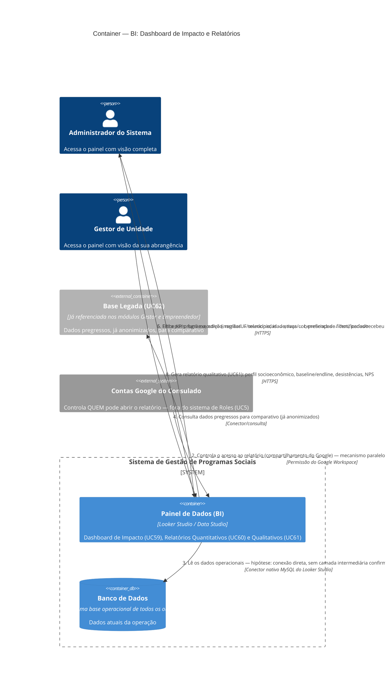

# C4 — Nível 2 (Container): Módulo BI
## Jornada 1 — Dashboard de Impacto e Relatórios

**UCs:** UC59 (Dashboard de Impacto) → UC60 (Relatórios Quantitativos) → UC61 (Relatórios Qualitativos)
**Atores:** Administrador do Sistema, Gestor de Unidade · (Organização patrocinadora — pendência em avaliação, desde o Nível 1)

## Objetivo deste nível

Primeira jornada do quinto e último módulo, e a que estabelece o padrão arquitetural para todo o resto do BI: diferente de todos os outros módulos vistos até aqui, o **Painel de Dados não é uma aplicação própria do sistema** — é um produto externo (Looker Studio) conectado ao banco. Isso muda a natureza das perguntas que fazemos aqui: não é "qual tela faz o quê", é "como os dados chegam até lá, e quem controla quem pode ver".

## Diagrama

## Containers participantes

| Container | Tecnologia | Papel nesta jornada |
|---|---|---|
| Painel de Dados (BI) | Looker Studio / Data Studio | As três vistas: dashboard executivo, relatórios quantitativos e qualitativos |
| Banco de Dados | MySQL | Mesma base que todos os outros módulos escrevem — aqui é só lida |
| Base Legada (referência) | — | Já detalhada como container externo nos módulos Gestor e Empreendedor |
| Contas Google do Consulado (externo) | — | **O verdadeiro controle de acesso desta jornada** — não é o UC5 |

A ausência do **Backend** neste diagrama é proposital e é o ponto mais importante da jornada: em todos os outros módulos, o Backend mediava every acesso ao banco (validação, regra de negócio, controle de escopo). Aqui, a hipótese de trabalho é que o Looker Studio **pula essa camada** e lê diretamente da base operacional.

## Fluxo da jornada

1. Administrador do Sistema ou Gestor de Unidade acessa o Painel de Dados, autenticado com uma conta Google.
2. O acesso a esse relatório específico é controlado pelo **compartilhamento do Google** — um mecanismo de permissão completamente separado do sistema de Roles (UC5) que vimos no CMS.
3. O Looker Studio lê os dados diretamente do banco operacional (hipótese — ver pendências).
4. Para comparativos históricos, consulta a base legada, já anonimizada.
5. O usuário filtra por programa, edição, localização, idade, raça/cor, presença de filhos e período.
6. O painel exibe os KPIs do funil executivo: inscritas → selecionadas → iniciadas/ativas → beneficiadas (50%) → certificadas/recebeu doação.
7–8. Gera relatórios quantitativos (frequência, evolução financeira) e qualitativos (perfil socioeconômico, desistências, NPS) sobre a mesma base de dados.

## Pontos de atenção para validar

| ID (sugerido) | Risco | O que verificar |
|---|---|---|
| BI1-A | **O achado mais sério desta jornada — e ele se conecta diretamente a um GAP que já tínhamos documentado.** Quando um colaborador é inativado (UC74, módulo CMS/Jornada 6), isso revoga o acesso dele ao CMS e ao Aplicativo Gestor. Mas o acesso ao **Painel de Dados BI é gerido por conta Google**, fora do sistema de Roles — a inativação no UC74 provavelmente **não** revoga automaticamente o compartilhamento do Looker Studio. Um colaborador desligado pode continuar vendo dados sensíveis (raça, situação de saúde mencionada em observações, dados financeiros agregados) indefinidamente, até que alguém lembre de remover manualmente o acesso Google | Confirmar com o time técnico se existe qualquer automação ligando a inativação de colaborador (UC74) à revogação do acesso Google ao BI, ou se são dois processos manuais inteiramente desconectados |
| BI1-B | Se a conexão do Looker ao banco for de fato direta (hipótese), relatórios pesados (agregações, filtros cruzados) rodando contra o **mesmo banco** que atende em tempo real a inscrição, seleção e a jornada online podem competir por recursos e degradar a performance da operação ao vivo em horários de pico | Confirmar se existe alguma réplica de leitura, data warehouse ou camada de cache entre o banco operacional e o Looker Studio, ou se a conexão é mesmo direta à base de produção |
| BI1-C | "Orçamento não entra no dashboard operacional" é uma exclusão explícita e deliberada — mas orçamento é configurado no CMS (UC9) e consumido na tela de Doação do Gestor (UC57). Vale confirmar que essa exclusão é uma decisão consciente de sensibilidade financeira, e não uma lacuna de integração que ninguém decidiu resolver | Perguntar ao time de produto se há planos de incluir indicadores orçamentários no BI no futuro, ou se é uma decisão permanente |
| BI1-D | **Combinação de dois riscos que, juntos, pesam mais que isoladamente.** O painel expõe recortes de dados sensíveis (raça/cor, presença de filhos) exatamente no container cujo controle de acesso (BI1-A) é o mais frágil e menos integrado de todo o sistema | Priorizar a resolução do BI1-A justamente por causa da natureza dos dados expostos aqui — não é um dashboard de números genéricos |
| BI1-E | Comparativos com a base legada (já anonimizada) devem operar em nível de **contagem agregada**, não de cruzamento individual — já que a base legada não tem como ser reidentificada pessoa a pessoa. Vale confirmar que o cálculo realmente respeita essa granularidade e não tenta, por engano, uma lógica de matching individual entre as duas bases | Verificar a lógica de consolidação de totalizadores (ponte com a Jornada 2 deste módulo, que vamos detalhar a seguir) |
| BI1-F | A pendência levantada já no **Nível 1** (diagrama de Contexto) segue em aberto: se a "visão restrita para organizações patrocinadoras" for confirmada, a Organização deixa de ser só entidade de domínio e passa a ser um ator com acesso próprio a este painel — o que normalmente também passaria pela mesma lacuna de controle de acesso via Google (BI1-A), ampliando ainda mais a superfície de risco | Confirmar o status dessa decisão, já antiga neste projeto |

## Pendências para fechar este diagrama

- Nenhuma tela foi vista (é um produto SaaS de terceiro, não uma tela própria do sistema) — diagrama baseado inteiramente na spec.
- **BI1-A é a pendência mais importante de todo o módulo BI**, e talvez uma das mais importantes do documento inteiro: ela é o primeiro caso concreto em que identificamos dois sistemas de controle de acesso paralelos e aparentemente não integrados (Roles do sistema via UC5, e permissões do Google Workspace) — isso deveria ser resolvido antes de qualquer outra validação deste módulo.
- Confirmar a natureza exata da conexão Looker↔banco (BI1-B) — relevante tanto para segurança quanto para performance da operação.
