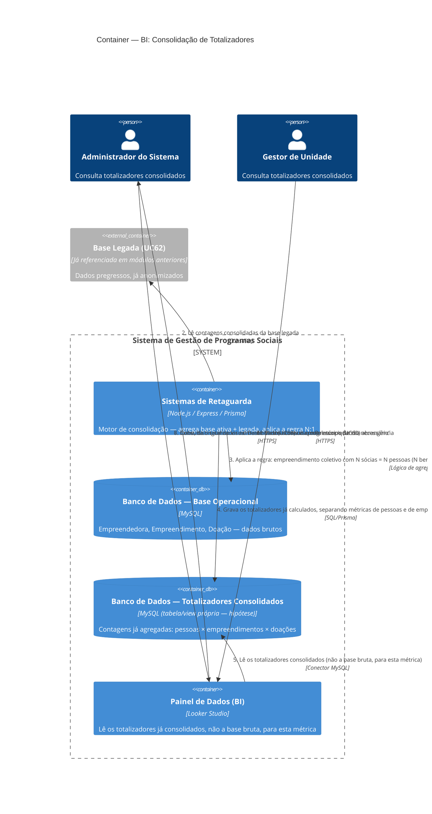

# C4 — Nível 2 (Container): Módulo BI
## Jornada 2 — Consolidação de Totalizadores com Dados Pregressos

**UC:** UC71 (Consolidar Totalizadores com Dados Pregressos) — com apoio da Base Legada (UC62)
**Atores:** Administrador, Gestor de Unidade (consultam) · **Backend** (consolidação automática — explicitamente citado na spec)

## Objetivo deste nível

Esta jornada obriga a **revisar uma hipótese** que levantamos na Jornada 1. Lá, especulamos que o Looker Studio provavelmente lê o banco operacional diretamente, sem passar pelo Backend. Aqui, a própria spec diz o contrário, de forma explícita: *"consolidação automática pelo sistema (backend)"*. Isso significa que o módulo BI provavelmente tem **dois padrões de acesso diferentes**, não um só — e esta jornada é o lugar certo para testar, de verdade, a regra de negócio mais citada e menos verificada de todo este trabalho: **1 empreendimento × N pessoas × 1 doação**.

## Diagrama

## Containers participantes

| Container | Tecnologia | Papel nesta jornada |
|---|---|---|
| Sistemas de Retaguarda (Backend) | Node.js, Express, Prisma | **Reaparece no módulo BI** — motor de consolidação, explicitamente citado na spec |
| Banco de Dados — Base Operacional | MySQL | Dados brutos, fonte da agregação |
| Banco de Dados — Totalizadores Consolidados | MySQL (hipótese de tabela/view própria) | Resultado já agregado, provável fonte de leitura do Looker para esta métrica |
| Painel de Dados (BI) | Looker Studio | Consulta o resultado já pronto |
| Base Legada (referência) | — | Fonte dos dados pregressos |

## Revisão da hipótese da Jornada 1

| | Jornada 1 (Dashboard/Relatórios simples) | Jornada 2 (Totalizadores consolidados) |
|---|---|---|
| Quem acessa o banco | Looker Studio, hipoteticamente de forma direta | **Backend**, confirmado explicitamente pela spec |
| Tipo de lógica | Filtros e agregações simples (contagem, soma) | Regra de negócio complexa (dedup N:1, soma com base legada) |
| Onde o Looker lê | Hipótese: tabelas operacionais brutas | Hipótese: uma tabela/view já consolidada pelo Backend |

Isso sugere que o módulo BI **não tem um único padrão de acesso a dados** — provavelmente convive com leitura direta para métricas simples e uma camada de pré-agregação para métricas que exigem lógica de negócio que o Looker Studio, sozinho, não conseguiria replicar (como a regra de dedup de empreendimento coletivo).

## Fluxo da jornada

1. O Backend lê as empreendedoras, empreendimentos e doações da base operacional ativa — frequência não especificada pela spec (periódica? sob demanda?).
2. Lê as contagens consolidadas já existentes na base legada.
3. Aplica a regra central: um empreendimento coletivo com N sócias que atingiu os critérios conta como **N pessoas** (N beneficiadas, N certificadas, N ativas) e **1 empreendimento**, com **1 doação** (não N).
4. Grava o resultado numa estrutura de totalizadores já consolidados, separando claramente métricas "de pessoas" das métricas "de empreendimentos".
5. O Looker Studio lê esse resultado já pronto, não a base bruta, para montar os KPIs correspondentes.
6–7. Administrador e Gestor de Unidade consultam o Dashboard ou os Relatórios, com a distinção visual entre dados atuais e pregressos "quando necessário".

## Pontos de atenção para validar

| ID (sugerido) | Risco | O que verificar |
|---|---|---|
| BI2-A | **A pergunta mais importante desta jornada.** A spec confirma consolidação pelo Backend aqui, mas a Jornada 1 levantou a hipótese de conexão direta para os dashboards simples. O módulo BI tem mesmo dois padrões de acesso coexistindo? Isso precisa de confirmação direta, porque muda completamente como o Nível 3 (Componente) deste módulo seria desenhado | Perguntar ao time técnico: existe uma tabela/view de totalizadores pré-calculados, separada das tabelas operacionais, que o Looker consulta especificamente para este UC? |
| BI2-B | A frequência de consolidação não é especificada — tempo real (a cada evento relevante), job periódico (ex.: diário, de hora em hora) ou recalculado a cada acesso ao painel? Isso decide o quão atualizado o número que o Gestor vê realmente é | Confirmar a frequência real; se for job periódico, confirmar o intervalo e se há algum indicador no painel de "dados atualizados até..." |
| BI2-C | Se a consolidação rodar em um horário fixo (ex.: uma vez por dia) e o **agrupamento de empreendimento** (UC31, Gestor/Jornada 6) acontecer depois desse horário, pode existir uma janela em que a contagem de empreendimentos está temporariamente incorreta — contando como 2 um negócio que acabou de ser agrupado em 1, até a próxima rodada de consolidação | Testar: agrupar dois empreendimentos pouco antes do horário de consolidação (se houver) e verificar se o totalizador reflete a mudança na próxima leitura, ou se há atraso |
| BI2-D | "Distingue visualmente dados atuais vs. pregressos **quando necessário**" é uma frase vaga — não há critério explícito sobre em quais relatórios essa distinção é obrigatória. Risco de inconsistência: alguns relatórios mostram a separação, outros não, sem padrão claro para quem está lendo | Revisar os relatórios reais (quando disponíveis) e confirmar se a distinção aparece de forma consistente em todos os que envolvem comparação com base legada |
| BI2-E | Conecta com um achado do módulo Empreendedor (Empr7-A, desligamento). Quando uma empreendedora desiste do programa (UC30/UC79), ela sai das automações — mas como isso afeta os totalizadores aqui? Ela deveria sair de "ativas", mas continuar contando em "participantes totais" e, se já certificada antes de desistir, também em "certificadas". A spec do UC71 não confirma esse comportamento explicitamente | Testar o totalizador antes e depois de uma desistência, verificando se cada categoria (ativas, beneficiadas, certificadas, participantes) se comporta como esperado |

## Pendências para fechar este diagrama

- **BI2-A é a pendência mais importante** — ela não é só sobre esta jornada, é sobre o padrão arquitetural de todo o módulo BI, e deveria ser respondida antes de fecharmos as jornadas restantes (3 e 4), já que ambas também dependem de entender como os dados chegam ao Looker.
- Nenhuma tela foi vista (mesma limitação da Jornada 1) — diagrama baseado inteiramente na spec.
- Confirmar o comportamento de desistência nos totalizadores (BI2-E) — é um cruzamento entre dois módulos que a spec não deixa explícito.
