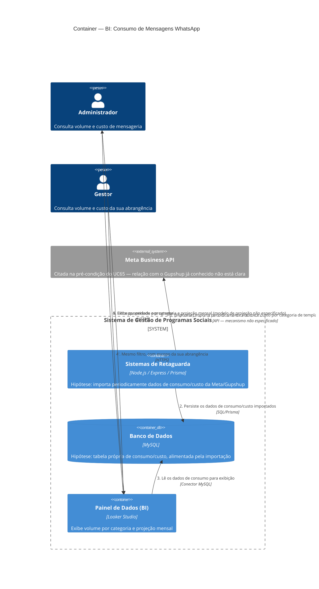

# C4 — Nível 2 (Container): Módulo BI
## Jornada 3 — Consultar Consumo de Mensagens WhatsApp

**UC:** UC65 (Consultar Consumo de Mensagens WhatsApp)
**Atores:** Administrador, Gestor

## Objetivo deste nível

A jornada mais curta e, ao mesmo tempo, a mais **diferente estruturalmente** de todo o módulo BI. Enquanto as Jornadas 1 e 2 consultam a mesma base operacional que todos os outros módulos escrevem, esta jornada depende de uma fonte de dado que **não existe em nenhum outro diagrama** deste trabalho: informações de volume e custo vindas de fora do sistema, da própria Meta/provedor de WhatsApp. A pré-condição da spec — "integração Meta Business API ativa" — é, na verdade, a pista mais importante desta jornada.

## Diagrama

## Containers participantes

| Container | Tecnologia | Papel nesta jornada |
|---|---|---|
| Sistemas de Retaguarda (Backend) | Node.js, Express, Prisma | Hipótese: ponto de importação dos dados de consumo/custo |
| Banco de Dados | MySQL | Hipótese: armazena os dados importados, para leitura pelo Looker |
| Painel de Dados (BI) | Looker Studio | Exibe volume e projeção |
| Meta Business API (externo) | — | **A principal incógnita desta jornada** |

## A pergunta central: Meta Business API é o Gupshup, ou uma segunda integração?

Em **todos** os outros diagramas deste trabalho, o provedor de WhatsApp foi tratado como **Gupshup** — ele é quem efetivamente envia as mensagens (UC25, UC33, UC49, UC51, UC87). Mas o UC65 cita a pré-condição como "integração **Meta Business API** ativa", não "integração Gupshup ativa". Isso abre duas hipóteses:

| Hipótese | O que significa | Como testar |
|---|---|---|
| **A — É a mesma coisa, nomenclatura imprecisa** | O Gupshup é um BSP (Business Solution Provider) que opera sobre a Meta Business API; a spec só usou o nome da plataforma subjacente em vez do nome do provedor contratado. Os dados de consumo/custo viriam da própria API/relatórios do Gupshup | Verificar se o Gupshup oferece endpoint de relatório de consumo e custo por categoria — se sim, a hipótese se confirma |
| **B — É uma segunda integração, paralela ao Gupshup** | O sistema se conecta **diretamente** à Meta (não via Gupshup) especificamente para obter dados de billing/consumo, possivelmente porque o Gupshup não expõe esses dados com granularidade suficiente | Verificar se existem credenciais/configuração separadas para "Meta Business API" além das credenciais do Gupshup já usadas para envio |

Nenhum outro UC da spec menciona essa integração de novo — UC65 é o único lugar onde ela aparece, o que a torna um ponto cego real na documentação.

## Fluxo da jornada

1. **(Hipótese)** O Backend importa periodicamente — frequência não especificada — volume e custo por categoria de template da Meta Business API (ou do Gupshup, dependendo de qual hipótese se confirmar).
2. Persiste esses dados numa estrutura própria no banco.
3. O Looker Studio lê essa estrutura.
4. Administrador ou Gestor filtram por período e programa.
5. O painel exibe a quantidade por categoria e uma **projeção mensal** — cujo modelo de cálculo (extrapolação linear? média móvel?) a spec não especifica.

## Pontos de atenção para validar

| ID (sugerido) | Risco | O que verificar |
|---|---|---|
| BI3-A | **A pergunta mais importante desta jornada** — ver a seção acima. Se for a Hipótese B (integração direta e paralela com a Meta), isso introduz um container externo novo que não apareceu em nenhum outro diagrama deste trabalho, e precisa de suas próprias credenciais e considerações de segurança | Confirmar com o time técnico qual integração realmente alimenta esse UC |
| BI3-B | "Custo variável contratual Fase 3.1" sugere que a tabela de preços por categoria de template (que a própria Meta define e revisa periodicamente) precisa estar refletida em algum lugar do sistema. Se essa tabela for mantida manualmente dentro do sistema, ela pode ficar desatualizada quando a Meta mudar os preços, gerando projeções de custo incorretas sem que ninguém perceba | Confirmar se o custo vem diretamente da API do provedor (sempre atualizado) ou se há uma tabela de preços mantida manualmente no sistema |
| BI3-C | O modelo de "projeção mensal" não é especificado — uma extrapolação simples (consumo até hoje ÷ dias passados × dias do mês) pode ser enganosa em edições com picos previsíveis (ex.: um grande lote de liberação de atividades perto do fim do mês), superestimando ou subestimando o custo real | Perguntar ao time de produto qual lógica de projeção está implementada, se houver |
| BI3-D | **Nota de observação, não exatamente um risco.** Esta é a única jornada do módulo BI cuja fonte de dado é externa à operação social do sistema — é, na prática, um relatório de **faturamento/billing** de um fornecedor, não um indicador de impacto. Isso pode justificar um "dono" diferente dentro do Consulado (time financeiro/administrativo, não o time de programas sociais) | Confirmar quem, na prática, usa este relatório e com que finalidade — isso pode influenciar se ele deveria estar no mesmo painel que o Dashboard de Impacto (UC59) ou separado |
| BI3-E | **Risco de confusão de nomenclatura entre dois "orçamentos" completamente diferentes.** Já documentamos, na Jornada 1 deste módulo (BI1-C), que o **orçamento de doação** (dinheiro para as empreendedoras, configurado em UC9, consumido em UC57) está deliberadamente fora do dashboard operacional. O **custo de mensageria** desta jornada (dinheiro que o Consulado paga à Meta/Gupshup) é uma categoria de despesa totalmente diferente. Um Gestor de Unidade que vê "orçamento" na tela de Doação e "custo"/"consumo" aqui pode, ainda assim, confundir os dois contextos se a nomenclatura das telas não for muito clara | Verificar se a interface diferencia claramente os dois conceitos, especialmente para o Gestor de Unidade, que interage com ambos |

## Revalidação com a stack (out/2026)

| Camada | Status |
| --- | --- |
| Backend | Parcial — `tab_hub_mensagem`, disparos |
| BI app | Externo |

Matriz consolidada e IDs compartilhados (**X-01…X-10**, **CTX-***, **CRM**): [../../../REVALIDACAO-MATRIZ.md](../../../REVALIDACAO-MATRIZ.md)

> Diagrama C4 acima = **spec de produto**; esta seção = **as-is homolog** nos repos EWTI-BR (out/2026).

## Pendências para fechar este diagrama

- Nenhuma tela foi vista — diagrama inteiramente hipotético, mais ainda que as duas jornadas anteriores deste módulo, dada a escassez de detalhe do próprio UC65 na spec.
- **BI3-A é a pendência mais importante** — sem resolver essa dúvida, não é possível nem confirmar se existe um container externo novo no sistema ou não.
- Confirmar a lógica de projeção mensal (BI3-C) com o time de produto, já que ela afeta diretamente decisões de orçamento operacional do Consulado.
