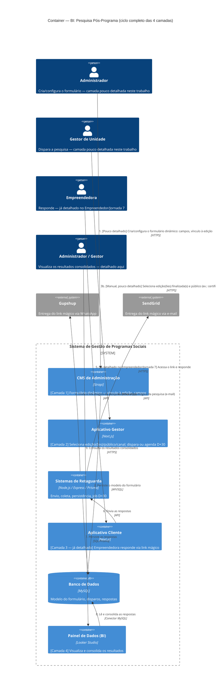

# C4 — Nível 2 (Container): Módulo BI
## Jornada 4 — Visualizar Resultados da Pesquisa Pós-Programa

**UC:** UC82 (Pesquisa Pós-Programa — ciclo completo das 4 camadas, com foco na visualização no BI)
**Atores:** Administrador (cria) · Gestor de Unidade (dispara) · Empreendedora (responde) · Administrador/Gestor (visualizam no BI)

## Objetivo deste nível

Esta é a jornada de fechamento de todo o conjunto de diagramas de Nível 2 — e também a mais antiga pendência deste projeto: o UC82 foi identificado, ainda na análise inicial da Fase 1, como um caso de uso que atravessa **quatro camadas diferentes** (CMS cria, Gestor dispara, Cliente responde, BI visualiza), e que precisaria ser revisitado conforme avançássemos pelos módulos. Chegamos até aqui com a resposta (módulo Empreendedor, Jornada 7) já detalhada. Esta jornada fecha a quarta e última camada — mas, ao desenhar o ciclo completo, preciso ser transparente: **duas das quatro camadas nunca receberam um diagrama dedicado neste trabalho**, só foram mencionadas de passagem nos módulos CMS e Gestor.

## Diagrama

## Containers participantes

| Container | Camada | Nível de detalhamento neste trabalho |
|---|---|---|
| CMS de Administração | 1 — Criação | **Raso** — só mencionado de passagem na visão geral do módulo CMS, nunca ganhou diagrama próprio |
| Aplicativo Gestor | 2 — Disparo | **Raso** — mencionado na listagem do módulo Gestor, nunca detalhado como jornada própria |
| Sistemas de Retaguarda (Backend) | Transversal | Médio — inferido por analogia com os outros mecanismos de envio já detalhados (UC33, UC52) |
| Aplicativo Cliente | 3 — Resposta | **Sólido** — já detalhado no Empreendedor/Jornada 7 |
| Painel de Dados (BI) | 4 — Visualização | **Detalhado aqui**, nesta jornada |

## Transparência sobre a cobertura deste trabalho

Vale registrar com clareza: ao longo deste projeto, o UC82 apareceu três vezes nas visões gerais de módulo (CMS, Gestor, BI) como um caso de uso "fronteiriço", e a decisão em cada momento foi adiar o detalhamento completo para quando chegássemos à camada mais relevante. Chegamos ao fim do conjunto de diagramas de Nível 2 com:

- A **resposta** (Cliente) bem detalhada — Empreendedor/Jornada 7.
- A **visualização** (BI) detalhada agora, nesta jornada.
- A **criação** (CMS) e o **disparo** (Gestor) **permanecem rasos** — nunca ganharam um diagrama dedicado, só a menção de que existem.

Isso não é necessariamente um problema para o propósito deste trabalho (mapear jornadas e levantar GAPs arquiteturais), mas é uma lacuna honesta na cobertura do nosso próprio conjunto de documentos, não da spec em si. Se for importante fechar esse buraco, as camadas 1 e 2 poderiam virar um adendo rápido aos módulos CMS e Gestor, respectivamente.

## Fluxo da jornada

1–2. **(Camada 1, CMS)** Administrador cria e configura o formulário dinâmico, vinculado a uma edição.
3a. **(Automático)** Um job periódico identifica edições que completaram exatamente 30 dias desde o encerramento, com a configuração padrão de disparo ativa.
3b. **(Manual, Camada 2, Gestor)** Alternativamente, o Gestor de Unidade seleciona manualmente uma ou mais edições finalizadas (inclusive antigas) e um público específico, disparando pela tela do Aplicativo Gestor.
4. Backend envia o link mágico da pesquisa via WhatsApp (Gupshup) e/ou e-mail (SendGrid).
5–7. **(Camada 3, já coberta)** Empreendedora responde no Aplicativo Cliente; as respostas são persistidas.
8–9. **(Camada 4, esta jornada)** O Painel de Dados consolida as respostas e os consumidores (Administrador, Gestor) consultam os resultados.

## Pontos de atenção para validar

| ID (sugerido) | Risco | O que verificar |
|---|---|---|
| BI4-A | **Risco de sobreposição entre o disparo automático (D+30) e o manual** — mesmo padrão já visto repetidamente neste trabalho (CRM3-B, GestorOnline4-A). Se o Gestor disparar manualmente para uma edição que também está na janela automática de D+30, a mesma pessoa pode receber o convite da pesquisa duas vezes | Testar a sobreposição entre os dois canais para a mesma edição/pessoa |
| BI4-B | "Disparos manuais para edições passadas" permite que o Gestor envie a pesquisa para edições **muito antigas**. Se a edição encerrou há mais de 5 anos, os dados de contato da participante já poderiam estar anonimizados pela rotina do UC76 — um disparo nesse cenário encontraria contatos inalcançáveis (hash reversível, sem acesso direto ao telefone/e-mail em texto claro) | Testar um disparo manual para uma edição anterior ao prazo de anonimização e ver o comportamento — silenciosamente ignora quem está anonimizado, erro, ou falha de envio sem aviso? |
| BI4-C | Não há menção de que empreendedoras **desistentes** (UC30/UC79) sejam excluídas automaticamente do público de uma pesquisa de acompanhamento. Pode ser intencional (entender os motivos de desistência também é valioso), mas vale confirmar que essa inclusão é deliberada, não uma omissão | Confirmar com o time de produto se desistentes fazem parte do público-alvo padrão, ou se deveriam ser segmentadas separadamente |
| BI4-D | O disparo também pode ser feito pelo perfil **multi-unidade** (UC83) — jornada que deixamos como a mais especulativa de todo o módulo Gestor (duas hipóteses concorrentes, nunca confirmadas). Qualquer teste desta jornada envolvendo esse perfil esbarra na mesma pendência em aberto | Resolver primeiro a pendência do Gestor/Jornada 9 antes de testar esse caminho específico aqui |
| BI4-E | A consolidação no BI (passo 8) segue o mesmo padrão de incerteza da Jornada 2 deste módulo: é leitura direta das respostas brutas, ou passa por alguma agregação do Backend antes de chegar ao Looker? | Mesma pergunta arquitetural de fundo já levantada (BI2-A), agora aplicada a este UC específico |

## Revalidação com a stack (out/2026)

| Camada | Status |
| --- | --- |
| Backend | Parcial — tracking/NPS operacional |
| BI app | Externo |

Matriz consolidada e IDs compartilhados (**X-01…X-10**, **CTX-***, **CRM**): [../../../REVALIDACAO-MATRIZ.md](../../../REVALIDACAO-MATRIZ.md)

> Diagrama C4 acima = **spec de produto**; esta seção = **as-is homolog** nos repos EWTI-BR (out/2026).

## Pendências para fechar este diagrama

- **BI4-A (nossa própria cobertura incompleta)** é a pendência mais importante deste documento específico: se o projeto tiver tempo, vale voltar aos módulos CMS e Gestor para detalhar as camadas 1 e 2 do UC82 com o mesmo rigor aplicado ao resto.
- Nenhuma tela foi vista em nenhuma das quatro camadas para este UC especificamente — diagrama inteiramente baseado na spec e por analogia com mecanismos já vistos.
- Confirmar o cruzamento entre UC82 e UC76 (anonimização) para disparos em edições antigas (BI4-B) — é um ponto real de atrito entre duas regras de negócio bem documentadas separadamente, mas nunca cruzadas na spec.

## Nota de fechamento do módulo BI (e do conjunto de Nível 2)

Com esta jornada, concluímos as 4 jornadas do módulo BI e, com elas, o conjunto completo de diagramas de Nível 2 (Container) para os cinco módulos planejados: **CMS** (6 jornadas), **CRM** (4), **Gestor** (10), **Empreendedor** (8) e **BI** (4) — 32 jornadas ao todo. Os padrões que mais se repetiram ao longo de todo o trabalho foram: a lacuna de armazenamento de arquivos (4 ocorrências independentes), a fragilidade da prova de identidade/presença ligada ao link mágico (recorrente desde a Fase 1, com o pico de severidade no funil de doação), e a sobreposição entre canais manuais e automáticos de comunicação (presente em praticamente todos os módulos). Esses três padrões transversais são, talvez, o produto mais valioso deste exercício — mais do que qualquer achado isolado.
