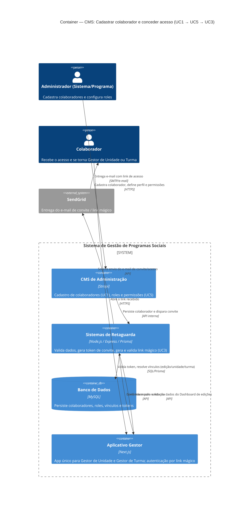

# C4 — Nível 2 (Container): Módulo CMS
## Jornada 1 — Cadastrar colaborador e conceder acesso

**UCs:** UC1 (Cadastrar Colaborador) → UC5 (Roles e Permissões) → UC3 (Login Gestor / Link Mágico)
**Atores:** Administrador do Sistema, Administrador de Programa (operam) · Colaborador/Gestor (recebe acesso)

## Objetivo deste nível

Mostrar os containers (aplicações, serviços, bases de dados) que participam de ponta a ponta nesta jornada, e como eles se comunicam. Diferente do Nível 1 (uma caixa única), aqui o "Sistema de Gestão de Programas Sociais" se abre nos containers que a spec v7 já define como as cinco plataformas — desta jornada, participam três: **CMS**, **Backend** e **Aplicativo Gestor** — mais o banco de dados e o provedor de e-mail.

## Diagrama

## Containers participantes

| Container | Tecnologia | Responsabilidade nesta jornada |
|---|---|---|
| CMS de Administração | Strapi | Formulário de cadastro de colaborador (UC1); tela de Roles (UC5) |
| Sistemas de Retaguarda (Backend) | Node.js, Express, Prisma | Regra de negócio, geração/validação de token, orquestração do convite |
| Banco de Dados | MySQL | Armazena colaborador, role, vínculos (unidade/edição/turma), token |
| Aplicativo Gestor | Next.js | Recebe o link mágico, inicia sessão, exibe Dashboard de edições |
| SendGrid (externo) | — | Entrega do e-mail de convite/acesso |

## Fluxo da jornada (passo a passo)

1. Administrador acessa o **CMS** e cadastra o colaborador (nome, e-mail, celular, perfil — UC1).
2. **CMS** envia o registro ao **Backend**, que valida regras (duplicidade de e-mail, formato) e persiste no **banco**.
3. **Backend** aciona o **SendGrid** para enviar o e-mail de acesso ao colaborador.
4. Colaborador recebe o e-mail e clica no link, abrindo o **Aplicativo Gestor**.
5. **Aplicativo Gestor** envia o token ao **Backend** para validação.
6. **Backend** valida o token contra o **banco**, resolve os vínculos do colaborador (unidade/turma/edição) e autoriza a sessão.
7. **Aplicativo Gestor** carrega o **Dashboard de edições** conforme o perfil e escopo do colaborador.

## Pontos de atenção já identificados na validação do UC1

Estes GAPs (levantados na validação funcional do UC1) têm efeito direto na arquitetura desta jornada e vale revisitá-los ao formalizar o diagrama:

| ID | Onde aparece no diagrama | Risco arquitetural |
|---|---|---|
| UC1-03 | Rel. CMS → Backend (persistência) | Spec não define onde o vínculo unidade/edição/turma é gravado — hoje não aparece no formulário do UC1. Sem isso, o Backend não tem o que resolver no passo 6. |
| UC1-05 | Rel. Backend → SendGrid | Não há etapa de "convite pendente / ativação" clara antes do primeiro acesso — o e-mail errado vira credencial de terceiro direto. |
| UC1-13 | Rel. Admin → CMS | Alteração de perfil (Turma → Unidade) parece não ter controle de permissão por campo nem trilha de auditoria no Backend. |
| UC1-15 | Rel. Colaborador → Gestor (token) | Validade e uso único do token não confirmados em teste — afeta diretamente a confiabilidade deste container boundary. |

## Revalidação com a stack (out/2026)

| Camada | Status |
| --- | --- |
| Strapi admin | Parcial — repo cm_cms_gestao não clonado |
| Backend | OK — gestor login-link + CMS colaborador read |

Matriz consolidada e IDs compartilhados (**X-01…X-10**, **CTX-***, **CRM**): [../../../REVALIDACAO-MATRIZ.md](../../../REVALIDACAO-MATRIZ.md)

> Diagrama C4 acima = **spec de produto**; esta seção = **as-is homolog** nos repos EWTI-BR (out/2026).

## Pendências para fechar este diagrama

- Confirmar se existe um container de **fila/worker** para o envio de e-mail (assíncrono) ou se o Backend chama o SendGrid de forma síncrona durante o cadastro.
- Confirmar se o CMS (Strapi) se comunica com um Backend Node separado, ou se a "camada Backend" da spec é, na prática, o próprio Strapi fazendo o papel de API — isso muda a caixa `backend` do diagrama.
- Mapear onde fica o vínculo colaborador × unidade/edição/turma (pendência também do UC1).
