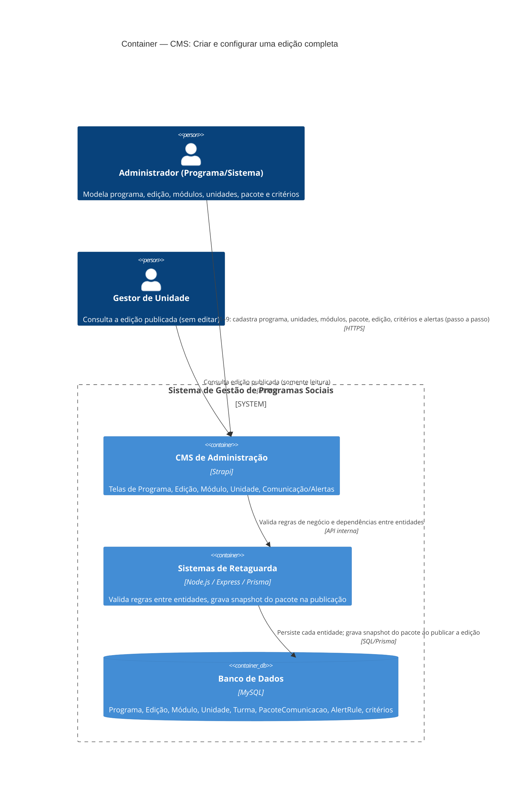

# C4 — Nível 2 (Container): Módulo CMS
## Jornada 2 — Criar e configurar uma edição completa

**UCs:** UC7 → UC66 → UC15 → UC88 → UC9 → UC12 → UC13 → UC14 → UC87 (criação) → UC16
**Atores:** Administrador de Programa, Administrador do Sistema (operam) · Gestor de Unidade (consulta, ao final)

## Objetivo deste nível

Diferente da Jornada 1, esta é uma jornada **de configuração pura** — sem ator externo recebendo mensagem, sem app Gestor ou Cliente envolvidos ainda. Os containers são sempre os mesmos três (CMS, Backend, Banco), mas a jornada importa pela **ordem de dependência**: uma edição só existe de forma operacional quando programa, módulos, unidades e pacote de comunicação já existem. O diagrama mostra os containers; a tabela de fluxo mostra a ordem obrigatória.

## Diagrama

## Containers participantes

| Container | Tecnologia | Responsabilidade nesta jornada |
|---|---|---|
| CMS de Administração | Strapi | Todas as telas de modelagem: Programa, Unidade, Módulo, Edição, Comunicação/Alertas |
| Sistemas de Retaguarda (Backend) | Node.js, Express, Prisma | Valida dependências entre entidades (ex.: edição exige programa e módulos existentes); gera o **snapshot** do pacote de comunicação na publicação |
| Banco de Dados | MySQL | Armazena todas as entidades de configuração |

Esta jornada **não** envolve SendGrid, Gupshup ou os apps Gestor/Cliente — eles só entram quando a edição publicada começa a ser operada (Jornadas do módulo CRM e Gestor).

## Fluxo da jornada (ordem de dependência obrigatória)

| Passo | UC | Ação | Pré-requisito |
|---|---|---|---|
| 1 | UC7 | Cadastrar Programa (modalidade, duração) | — |
| 2 | UC66 | Cadastrar Unidade(s) | — |
| 3 | UC15 | Criar Módulo(s) educacional(is) (catálogo de atividades) | — |
| 4 | UC88 | Criar Pacote de Comunicação (templates por tipo de atividade) | — |
| 5 | UC9 | Criar e Configurar Edição — vincula programa, unidades, módulos e pacote; define datas, metas, % beneficiamento/certificação (UC13), parâmetros de risco | Passos 1–4 |
| 6 | UC16 | Criar Turma(s) em cada unidade (pelo menos uma por unidade) | Passo 5 |
| 7 | UC12 | Configurar Regulamento e Critérios de Seleção (bloqueios + régua pontuável) | Passo 5 |
| 8 | UC14 | Configurar Critérios de Doação / Elegibilidade (A–D) | Passo 5 |
| 9 | UC87 | Criar regras de Alerta Automático (`AlertRule`) referenciando o pacote | Passo 4 |
| 10 | UC9 (fim) | Anexar regulamento e **publicar** a URL de inscrição (slug) | Passos 5–9 |

A publicação (passo 10) é o ponto de corte com os outros módulos: a partir dela, a **Lead** passa a acessar a edição pelo slug (módulo CRM) e o **Gestor de Unidade** passa a enxergá-la no seu Dashboard (módulo Gestor).

## Pontos de atenção para validar nas telas

| ID (sugerido) | Risco | O que verificar no CMS |
|---|---|---|
| UC9-A | Edição pode ser publicada sem módulo, unidade/turma ou pacote associado? | Testar criar edição pulando passos 1–4 |
| UC9-B | UC13 (% beneficiamento/certificação) é descrito na spec como parte do próprio formulário de edição (UC9), não como tela separada — confirmar se existe campo próprio ou se está dentro do form da edição | Abrir tela de edição e localizar o campo |
| UC9-C | O **snapshot do pacote de comunicação** na publicação (UC88: "jornadas ativas não mudam com edição posterior do pacote") precisa de um registro versionado no banco — se o pacote for só referenciado por ID, editar o pacote depois afetaria edições já publicadas, contrariando a regra | Editar um pacote já usado em edição publicada e checar se a edição antiga muda |
| UC9-D | Unidade com unidade única aciona alocação automática (regra de negócio no Backend, não no CMS) — não há tela para isso, é regra implícita | Confirmar que o Backend aplica essa regra na inscrição, não no CMS |

## Revalidação com a stack (out/2026)

| Camada | Status |
| --- | --- |
| Strapi admin | Parcial — authoring não local |
| Backend | OK — management/editions, loaders CMS |

Matriz consolidada e IDs compartilhados (**X-01…X-10**, **CTX-***, **CRM**): [../../../REVALIDACAO-MATRIZ.md](../../../REVALIDACAO-MATRIZ.md)

> Diagrama C4 acima = **spec de produto**; esta seção = **as-is homolog** nos repos EWTI-BR (out/2026).

## Pendências para fechar este diagrama

- Confirmar a dúvida já registrada na Jornada 1: CMS (Strapi) e Backend são containers fisicamente separados, ou o Strapi concentra as duas responsabilidades?
- Confirmar se existe validação de ordem (ex.: bloquear "Criar Edição" se não houver módulo cadastrado) ou se a responsabilidade de seguir a ordem é só processual/manual do Administrador.
- Levantar as telas reais de UC12, UC13, UC14 e UC87 (ainda não vistas) para substituir a tabela de passos por evidência de tela, como fizemos no UC1.
