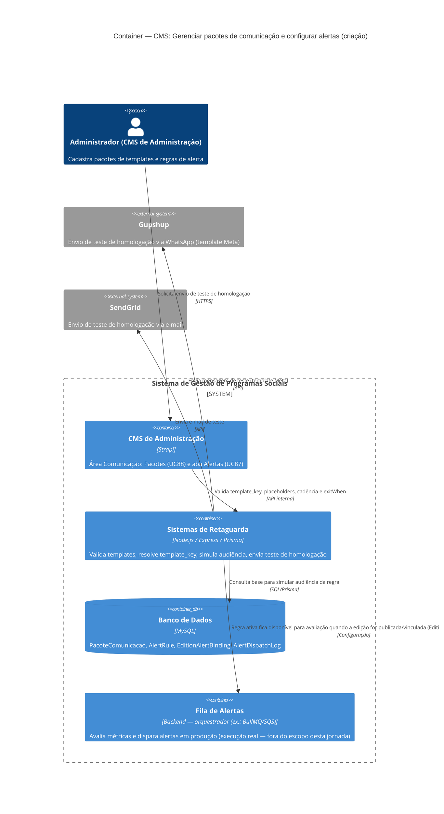

# C4 — Nível 2 (Container): Módulo CMS
## Jornada 3 — Gerenciar pacotes de comunicação e configurar alertas automáticos

**UCs:** UC88 (Gerenciar Pacotes de Comunicação) → UC87 (Configurar Alertas Automáticos — lado CMS)
**Atores:** Administrador (CMS de Administração)

## Objetivo deste nível

Esta jornada é a única do módulo CMS que **toca sistemas externos antes da edição ser operada** — porque UC87 prevê "enviar teste de homologação" e "simular audiência" durante a configuração da regra. É diferente da Jornada 2 (configuração pura) e precisa deixar claro um limite importante:

> **Este diagrama cobre apenas a criação/configuração** (Admin no CMS). A **execução real** dos alertas — quando o Backend avalia métricas e dispara mensagens de verdade para empreendedoras — é outro fluxo (UC52/UC87 "Backend"), orquestrado pela fila de alertas e acionado por eventos de outros módulos (Gestor, Empreendedor). Ele reaparecerá como diagrama próprio quando tratarmos esses módulos — aqui ele aparece apenas como container de destino, não detalhado.

## Diagrama

## Containers participantes

| Container | Tecnologia | Responsabilidade nesta jornada |
|---|---|---|
| CMS de Administração | Strapi | Tela de Pacotes (UC88) e aba Alertas (UC87) |
| Sistemas de Retaguarda (Backend) | Node.js, Express, Prisma | Valida regras, simula audiência, orquestra o envio de teste |
| Banco de Dados | MySQL | `PacoteComunicacao`, `AlertRule`, `EditionAlertBinding`, `AlertDispatchLog` |
| Fila de Alertas (Backend) | Worker/orquestrador | Referenciado como destino futuro da regra — **execução real fora do escopo desta jornada** |
| Gupshup (externo) | — | Envio do teste de homologação via WhatsApp |
| SendGrid (externo) | — | Envio do teste de homologação via e-mail |

## Fluxo da jornada

1. Administrador acessa **Comunicação / Templates → Pacotes** no CMS e cria ou duplica um pacote.
2. Para cada `TipoAtividade` (11 tipos; Aula com duas variantes), associa `template_key` Meta/Gupshup (+ e-mail opcional).
3. Preenche os **momentos de jornada** (inscrição, aprovação UC25, OK, etc.).
4. Na mesma área, aba **Alertas**: cria `AlertRule` — escolhe `triggerKind`, parâmetros, canais, templates (do catálogo do passo 2–3), cadência e `exitWhen`.
5. Opcionalmente, **simula a audiência** da regra numa edição existente (consulta ao banco, sem envio real).
6. Opcionalmente, **envia um teste de homologação** — aqui o Backend aciona Gupshup e/ou SendGrid de verdade, mesmo sem edição publicada.
7. Ativa o pacote e a regra. A partir daqui, ficam disponíveis para seleção em UC9 (pacote) e para `EditionAlertBinding` pelo Gestor de Unidade (regra) — ambos fora desta jornada.

## Pontos de atenção para validar nas telas

| ID (sugerido) | Risco | O que verificar no CMS |
|---|---|---|
| UC88-A | O teste de homologação (passo 6) usa um número/e-mail de teste real ou fictício? Se usar template Meta de produção, pode gerar custo ou atingir pessoa real por engano | Verificar campo de destino do teste e se há confirmação antes do envio |
| UC88-B | Editar um pacote **já usado** em edição publicada: a spec promete snapshot na publicação (jornadas ativas não mudam). Esta tela permite editar livremente um pacote "em uso"? | Testar editar um pacote vinculado a edição ativa e verificar se o sistema avisa ou bloqueia |
| UC87-A | "Simular audiência" é cálculo em tempo real contra o banco de produção/homologação, ou é uma estimativa? Volume incorreto pode levar a subdimensionar/superdimensionar o envio real | Comparar número simulado com contagem manual |
| UC87-B | `exitWhen` e cadência (`delayAfterTrigger`, `repeatEvery`, `maxSends`, `cooldown`) — a spec não detalha validação cruzada (ex.: `repeatEvery` maior que `maxSends × cooldown` sem sentido). Validar se o formulário impede configurações inconsistentes | Tentar salvar combinações inválidas |

## Revalidação com a stack (out/2026)

| Camada | Status |
| --- | --- |
| Strapi admin | Parcial — bundles WhatsApp + regras automação |
| Backend | OK — automation internal routes; nomes ≠ AlertRule spec (**X-03**) |

Matriz consolidada e IDs compartilhados (**X-01…X-10**, **CTX-***, **CRM**): [../../../REVALIDACAO-MATRIZ.md](../../../REVALIDACAO-MATRIZ.md)

> Diagrama C4 acima = **spec de produto**; esta seção = **as-is homolog** nos repos EWTI-BR (out/2026).

## Pendências para fechar este diagrama

- Ainda não vimos as telas reais de UC88 (Pacotes) e UC87 (aba Alertas) — este diagrama está baseado só na spec, como a Jornada 2.
- Confirmar se "enviar teste de homologação" é, de fato, uma chamada real às APIs externas (Gupshup/SendGrid) a partir do ambiente de homologação, ou se é mockado — isso muda se a seta para os sistemas externos deve aparecer neste diagrama ou não.
- Confirmar o nome real do mecanismo de fila (BullMQ, SQS ou outro) citado na spec para o container "Fila de Alertas" — hoje está genérico.
