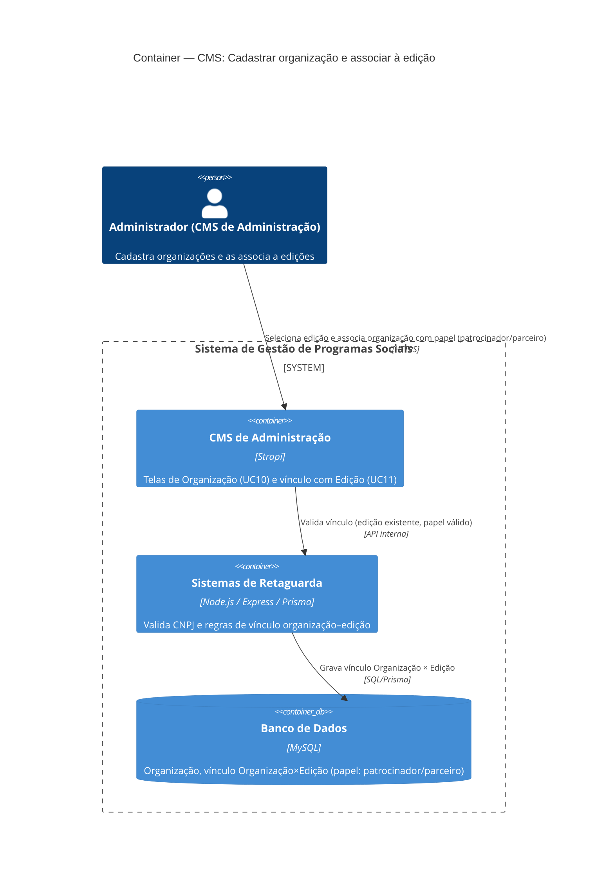

# C4 — Nível 2 (Container): Módulo CMS
## Jornada 4 — Cadastrar organização e associar à edição

**UCs:** UC10 (Cadastrar Organização) → UC11 (Associar Organização à Edição)
**Atores:** Administrador (CMS de Administração)

## Objetivo deste nível

Jornada curta e de baixo risco, no mesmo padrão de configuração pura da Jornada 2: sem ator externo, sem mensageria, apenas CMS → Backend → Banco. Vale como diagrama de referência rápida, mas o maior valor aqui está nos GAPs de modelagem (organização como entidade solta vs. vinculada) e na pendência já registrada sobre o ator "Organização" no Nível 1.

## Diagrama

## Containers participantes

| Container | Tecnologia | Responsabilidade nesta jornada |
|---|---|---|
| CMS de Administração | Strapi | Tela de Organização (UC10) e tela de vínculo na Edição (UC11) |
| Sistemas de Retaguarda (Backend) | Node.js, Express, Prisma | Validação de CNPJ, unicidade e regra de vínculo |
| Banco de Dados | MySQL | Organização e tabela de associação com papel (patrocinador/parceiro) |

Nenhum sistema externo participa desta jornada. A Organização é, pela spec, **entidade de domínio** — não acessa o sistema, não há container de app para ela.

## Fluxo da jornada

1. Administrador acessa **Organizações → Criar** no CMS.
2. Informa razão social, CNPJ, tipo, localização, responsável e, quando aplicável, papel no tratamento de dados (controlador/operador).
3. **Backend** valida (formato de CNPJ, duplicidade) e persiste no **banco**.
4. Administrador acessa a **Edição** → **Organizações vinculadas** e adiciona a organização já cadastrada, definindo o papel (**patrocinador** ou **parceiro executor**).
5. **Backend** valida se a edição existe e se o papel é um dos permitidos, e grava o vínculo.

## Pontos de atenção para validar nas telas

| ID (sugerido) | Risco | O que verificar no CMS |
|---|---|---|
| UC10-A | A spec não define validação de CNPJ (dígito verificador, duplicidade). Organização duplicada ou CNPJ inválido pode poluir relatórios e prestação de contas a patrocinadores | Testar cadastro com CNPJ inválido e duplicado |
| UC11-A | Uma mesma organização pode ter papéis diferentes em edições diferentes (patrocinador numa, parceiro noutra)? E na mesma edição, duas vezes com papéis diferentes? Regra não está explícita | Testar associar a mesma organização duas vezes na mesma edição |
| UC11-B | Desvincular/remover organização de uma edição: não há menção na spec (UC10/UC11 só cobrem criar e associar). Se não existir exclusão, uma associação errada fica permanente | Procurar ação de remover vínculo na tela de Organizações vinculadas |
| UC59-pend | Nível 1 já registrou a pendência: se o BI tiver visão restrita para patrocinadores (UC59), a Organização deixa de ser só entidade de domínio e vira ator externo — o que adicionaria um container de acesso (login/app) não previsto aqui | Confirmar com o time se essa visão restrita está confirmada ou ainda é hipótese |

## Pendências para fechar este diagrama

- Ainda não vimos as telas reais de UC10/UC11 — diagrama baseado só na spec.
- Confirmar se CNPJ segue o mesmo padrão de proteção de dado sensível aplicado ao CPF (hash), já que é documento de pessoa jurídica, não física — provavelmente não precisa, mas vale confirmar se há exigência contratual específica para dados de patrocinador.
