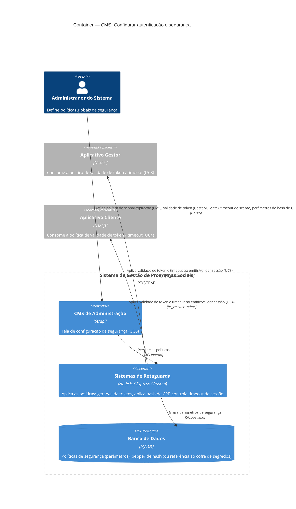

# C4 — Nível 2 (Container): Módulo CMS
## Jornada 5 — Configurar autenticação e segurança

**UCs:** UC6 (Configurar Autenticação e Segurança)
**Atores:** Administrador do Sistema (CMS de Administração)

## Objetivo deste nível

Esta é a jornada **mais transversal** do módulo CMS: ela não entrega uma tela operacional para o dia a dia, mas define parâmetros que todas as outras jornadas — deste módulo e dos demais (CRM, Gestor, Empreendedor) — dependem para funcionar com segurança. É também onde os GAPs de segurança já levantados na Jornada 1 (validade de token, política de convite) deveriam ter sua origem configurável.

> Diferente das jornadas anteriores, aqui o "resultado" não é uma entidade de negócio (programa, edição, organização) — é **política de segurança** aplicada por outros containers em tempo de execução.

## Diagrama

## Containers participantes

| Container | Tecnologia | Responsabilidade nesta jornada |
|---|---|---|
| CMS de Administração | Strapi | Tela (ainda não vista) de parâmetros de segurança |
| Sistemas de Retaguarda (Backend) | Node.js, Express, Prisma | Único ponto que **aplica** as políticas — gera e valida tokens, calcula hash de CPF, controla timeout |
| Banco de Dados | MySQL | Armazena os parâmetros (ou aponta para um cofre de segredos, no caso do pepper) |
| Aplicativo Gestor / Aplicativo Cliente | Next.js | Não configuram nada aqui — apenas **sofrem efeito** das políticas (validade de link, expiração de sessão) |

Não há sistema externo nesta jornada. Se o **2FA** vier a ser implementado (hoje "previsto no Anexo LGPD... conforme exigência contratual"), um provedor externo (ex. TOTP/SMS) entraria aqui como `System_Ext` — ainda não modelado por não haver decisão de implementação.

## Fluxo da jornada

1. Administrador do Sistema acessa a tela de segurança no **CMS**.
2. Define: política de senha do CMS (expiração, complexidade, histórico — UC2); validade/uso único dos tokens de link mágico do Gestor (UC3) e do Cliente (UC4); timeout de sessão de ambos; parâmetros de hash de CPF (pepper, algoritmo).
3. **Backend** persiste essas políticas no **banco** (ou referencia um cofre de segredos para o pepper, que não deveria ficar em texto plano no mesmo banco de dados de negócio).
4. A partir daí, toda vez que o **Aplicativo Gestor** (UC3) ou o **Aplicativo Cliente** (UC4) emitem ou validam um link mágico, o **Backend** aplica os parâmetros configurados aqui — validade do token, timeout de sessão.
5. Toda vez que um CPF é gravado (UC21, UC27 etc.), o **Backend** aplica o algoritmo e o pepper definidos aqui.

## Pontos de atenção — ligação direta com GAPs já levantados

Esta jornada é onde os GAPs de segurança do UC1/UC3 deveriam encontrar sua causa-raiz:

| ID (origem) | GAP | Pergunta que esta jornada responde |
|---|---|---|
| UC1-15 | Link do e-mail de convite ainda parecia válido 9 dias depois (não testado a reutilização) | Qual é o valor configurado aqui para validade do token do Gestor? Existe mesmo um campo para isso, ou o valor está hardcoded no Backend? |
| UC1-05 | Falta etapa de "convite pendente/ativação" antes do primeiro acesso | Essa política (exigir ativação antes do primeiro login) é parametrizável aqui, ou é um gap de fluxo que nenhuma configuração resolve? |
| — | Pepper do hash de CPF (UC6) | Onde o pepper fica armazenado? Se estiver na mesma tabela/banco que os dados que ele protege, a separação de segredo e dado é fraca — idealmente fica em um cofre de segredos (ex. Vault, KMS), fora do banco relacional |
| — | 2FA do CMS | Está mesmo pendente de "exigência contratual", ou já deveria estar ativo dado que o Administrador do Sistema tem controle total (criar, editar perfil de outros — UC1-13)? |
| — | Timeout de sessão do Gestor/Cliente | Qual é o valor hoje? A spec cita "~30 dias" para o Cliente (UC4) como algo fixo no texto, não como parâmetro desta tela — API/config pode ter o valor duplicado em dois lugares (hardcoded E configurável), gerando inconsistência |

## Pendências para fechar este diagrama

- **Tela ainda não vista.** Este diagrama é o mais especulativo até agora, porque a spec descreve UC6 em termos de política ("define expiração, complexidade...") sem ilustrar campos concretos.
- Confirmar se o pepper e segredos de hash ficam em um container de **cofre de segredos** (ex. AWS Secrets Manager/KMS, já que a hospedagem é AWS) — se sim, esse container precisa ser adicionado ao diagrama como peça própria, não como "campo no banco".
- Confirmar se o valor "~30 dias" de sessão do Cliente (UC4) é lido desta configuração ou está fixo no código — isso decide se UC4 realmente depende deste container ou se há duplicidade de fonte de verdade.
