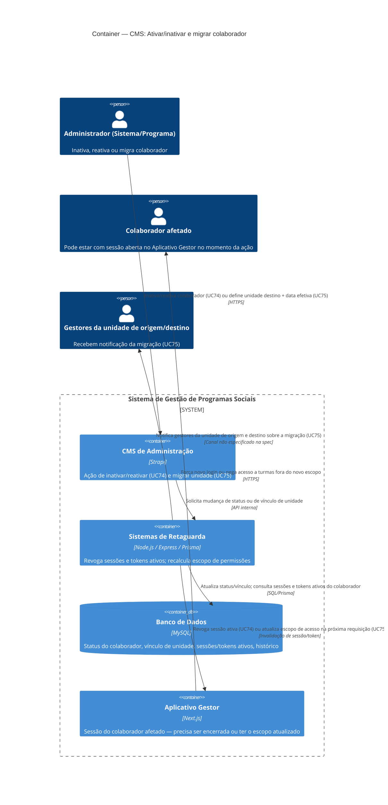

# C4 — Nível 2 (Container): Módulo CMS
## Jornada 6 — Ativar/inativar e migrar colaborador entre unidades

**UCs:** UC74 (Ativar ou Inativar Colaborador/Parceiro) → UC75 (Migrar Colaborador entre Unidades)
**Atores:** Administrador do Sistema, Administrador de Programa (UC74) · Administrador do Sistema (UC75, exclusivo)

## Objetivo deste nível

Esta jornada fecha o ciclo de vida aberto na **Jornada 1**: lá o colaborador ganha acesso; aqui ele perde (inativação) ou tem seu escopo alterado (migração). É a jornada onde a promessa "revoga sessões ativas" (UC74) e "atualiza permissões" (UC75) precisa necessariamente tocar o **Aplicativo Gestor** em tempo real — não basta mudar um registro no banco, o efeito tem que se propagar para uma sessão que pode estar aberta naquele exato momento.

## Diagrama

## Containers participantes

| Container | Tecnologia | Responsabilidade nesta jornada |
|---|---|---|
| CMS de Administração | Strapi | Ação de inativar/reativar (UC74); formulário de migração com unidade destino e data efetiva (UC75) |
| Sistemas de Retaguarda (Backend) | Node.js, Express, Prisma | Ponto crítico: revoga sessão/token ativo, recalcula o escopo de permissões do colaborador |
| Banco de Dados | MySQL | Status ativo/inativo, vínculo de unidade, registro de sessões/tokens, histórico preservado |
| Aplicativo Gestor | Next.js | Onde o efeito é sentido pelo colaborador — sessão encerrada ou turmas fora do escopo somem |

Não há sistema externo explícito nesta jornada — a notificação de UC75 ("notifica gestores envolvidos") não especifica canal na spec (poderia ser e-mail via SendGrid, mas não está confirmado).

## Fluxo da jornada

**UC74 — Ativar/Inativar**
1. Administrador localiza o colaborador no **CMS** e altera o status para inativo (ou reativa).
2. **Backend** atualiza o status no **banco** e, se inativando, consulta sessões/tokens ativos daquele colaborador.
3. **Backend** revoga a sessão ativa no **Aplicativo Gestor** — a próxima requisição do colaborador é negada, forçando logout.
4. Histórico operacional é preservado (entregas aprovadas, presenças registradas por ele continuam existindo).

**UC75 — Migrar entre unidades**
1. Administrador do Sistema seleciona o colaborador → **Migrar unidade**, define unidade destino e data efetiva.
2. **Backend** atualiza o vínculo de unidade no **banco**.
3. **Backend** recalcula o escopo de acesso — na próxima ação do colaborador no **Aplicativo Gestor**, ele já não vê mais as turmas/edições da unidade de origem (ou só até a data efetiva, se a migração for futura).
4. **Backend** notifica os gestores das unidades de origem e destino (canal não especificado).

## Pontos de atenção — ligação com GAPs já levantados

| ID (origem) | GAP | Pergunta que esta jornada precisa responder |
|---|---|---|
| UC1 (T11, pendente de execução) | Já havíamos pedido o teste "inativar colaborador com sessão aberta e link antigo" — ainda sem resultado reportado | A revogação é **imediata** (ex.: WebSocket/polling de sessão) ou só na próxima requisição HTTP? Se o colaborador já carregou uma tela e fica navegando sem nova requisição, ele continua operando por quanto tempo após ser inativado? |
| UC74-A (novo) | O que acontece com entregas/aprovações **pendentes** sob responsabilidade exclusiva do colaborador inativado (ex.: ele é o único Gestor de Turma)? A spec não cobre reatribuição automática | Verificar se existe bloqueio ("não é possível inativar: há pendências sem outro responsável") ou se a turma fica órfã |
| UC75-A (novo) | "Data efetiva" futura: entre o registro da migração e a data efetiva, o colaborador deveria manter o escopo antigo — isso exige uma regra de agendamento no Backend, não só uma troca imediata de campo | Confirmar se existe esse agendamento ou se a migração é sempre imediata, tornando "data efetiva" apenas um rótulo descritivo |
| UC75-B (novo) | Migrar o único Gestor de Turma de uma turma ativa, sem substituto, deixa a turma sem gestor operacional | Testar esse cenário — mesma classe de risco do UC74-A |
| — | Canal de notificação de UC75 não especificado | Confirmar se é e-mail (SendGrid), notificação in-app, ou nenhum dos dois ainda implementado |

## Pendências para fechar este diagrama

- **Telas ainda não vistas** (UC74 e UC75) — diagrama baseado na spec e nos achados já registrados no UC1.
- O resultado do **T11** (teste pedido na validação do UC1: inativar com sessão aberta) é o dado que mais mudaria este diagrama — se a revogação não for imediata, a seta `Rel(backend, gestor, "Revoga sessão ativa")` precisa de uma ressalva técnica (ex.: tempo de propagação, cache de permissão).
- Confirmar se UC74 e UC75 de fato usam o mesmo mecanismo de revogação/atualização de escopo, ou se são implementações diferentes (um pode invalidar token, outro só filtrar dados na próxima consulta).
