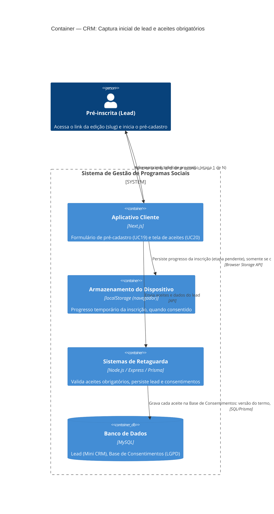

# C4 — Nível 2 (Container): Módulo CRM
## Jornada 1 — Captura inicial de lead e aceites obrigatórios

**UCs:** UC19 (Realizar Pré-Cadastro) → UC20 (Aceitar Termos LGPD, Comunicação, Cookies e Armazenamento Local — subconjunto de pré-cadastro)
**Atores:** Pré-inscrita (Lead)

## Objetivo deste nível

Primeira jornada do sistema vista pelo público externo, sem autenticação. É a porta de entrada do funil (Pré-inscrição → Inscrição → Seleção...) e a primeira vez que o **Aplicativo Cliente** aparece como container operando de verdade (nas jornadas do CMS ele nunca foi acionado). É também a primeira jornada onde a **base de consentimentos** (LGPD) começa a ser povoada — ponto de origem de tudo que o UC76 (anonimização) vai gerenciar mais tarde.

> **Fronteira com o módulo Empreendedor:** esta jornada termina quando o lead está "pré-cadastro concluído, aguardando inscrição completa". O formulário extenso (dados pessoais, do empreendimento, econômicos — UC21) e os aceites adicionais que ele carrega (dados sensíveis, regulamento, uso de imagem) pertencem ao módulo **Empreendedor** e não são detalhados aqui.

## Pré-condição (fora desta jornada)

Edição com inscrições abertas e slug publicado — resultado da **Jornada 2 do módulo CMS** (Criar e Configurar Edição).

## Diagrama

## Containers participantes

| Container | Tecnologia | Responsabilidade nesta jornada |
|---|---|---|
| Aplicativo Cliente | Next.js | Formulário de pré-cadastro e tela de aceites; única interface com o lead |
| Armazenamento do Dispositivo | localStorage | Guarda o progresso da inscrição **antes** de existir UUID definitivo (que só nasce em UC21) |
| Sistemas de Retaguarda (Backend) | Node.js, Express, Prisma | Valida obrigatoriedade dos aceites, persiste lead e grava a base de consentimentos |
| Banco de Dados | MySQL | Tabela de leads (Mini CRM) e Base de Consentimentos (LGPD), logicamente separadas |

Nenhum sistema externo participa desta jornada — a confirmação via WhatsApp (template de inscrição) só ocorre **depois** da inscrição completa (UC21), quando a lead já é Empreendedora.

## Fluxo da jornada

1. Lead acessa o link da edição (slug).
2. **Aplicativo Cliente** consulta o **Backend** para confirmar que a edição tem inscrições abertas.
3. Exibe indicador de progresso (etapa 1 de N).
4. Lead aceita, de forma obrigatória: **LGPD**, **cookies/armazenamento local** e **contato via WhatsApp**.
5. Lead informa nome, telefone e e-mail.
6. **Aplicativo Cliente** envia os dados ao **Backend**.
7. **Backend** grava o lead no **banco** com status "pré-cadastro concluído" e registra cada aceite na **Base de Consentimentos** (versão do termo, data/hora, dispositivo, finalidade).
8. Se os cookies/armazenamento foram aceitos, o **Aplicativo Cliente** persiste o progresso no **localStorage** do dispositivo, para retomada futura (detalhado na Jornada 2 do CRM).
9. Lead é direcionada à inscrição completa (UC21 — fora desta jornada).

## Pontos de atenção para validar

| ID (sugerido) | Risco | O que verificar |
|---|---|---|
| CRM1-A | Aceite de WhatsApp é **obrigatório**, mas a spec não menciona validação ativa do número (nem OTP, nem checagem de formato robusta). Número errado digitado = lead nunca mais é alcançável, mesmo "consentindo" | Testar número incompleto, com DDD inválido, ou de outra pessoa — ver se o sistema aceita e o que acontece no reengajamento (Jornada 3) |
| CRM1-B | Progresso vive **só** no localStorage, sem UUID (que só existe após UC21). Trocar de navegador, limpar dados ou usar outro dispositivo perde o progresso por completo — o único resgate possível é o Mini CRM contatando por telefone/e-mail para recomeçar do zero | Confirmar se essa perda é aceita como comportamento esperado, ou se deveria haver algum identificador de retomada por telefone/e-mail antes do UUID existir |
| CRM1-C | O UC20 é descrito na spec como um único caso de uso que atende tanto o pré-cadastro (3 aceites simples) quanto a inscrição completa (aceites adicionais: dados sensíveis, regulamento, imagem). Se for o **mesmo componente de tela** reutilizado com campos diferentes por contexto, há risco de um aceite da etapa errada aparecer fora de ordem | Confirmar na implementação se é um componente parametrizado por etapa, ou dois fluxos de tela distintos (isso é melhor detalhado no Nível 3 — Componente) |
| CRM1-D | Pré-condição "edição com inscrições abertas" — a spec não cobre o que acontece se a lead acessar um slug de edição **encerrada** ou **inexistente** (só há tratamento desse cenário para UC21, como exceção "edição encerrada durante preenchimento") | Testar acessar slug de edição encerrada e slug inválido/inexistente diretamente na etapa de pré-cadastro |
| CRM1-E | A Base de Consentimentos grava "versão do termo, data/hora, dispositivo, finalidade" — confirmar se isso é **um registro por aceite** (3 registros: LGPD, cookies, WhatsApp) ou um registro agregado. Um registro agregado dificulta provar, no futuro, que um aceite específico foi dado numa versão específica do termo (relevante para UC76 — revalidação) | Inspecionar a estrutura da Base de Consentimentos (schema ou exports) |

## Pendências para fechar este diagrama

- Telas reais do UC19/UC20 ainda não vistas — diagrama baseado na spec.
- Confirmar se a verificação de "edição com inscrições abertas" (passo 2) é uma chamada sempre síncrona ao Backend, ou se o Aplicativo Cliente faz alguma forma de cache/SSR do estado da edição — isso afeta o comportamento do CRM1-D.
- Confirmar o nome real da tabela/entidade da Base de Consentimentos e se ela é compartilhada com a tabela de aceites usada em UC21, UC27 (cadastro manual pelo gestor) e UC76.
