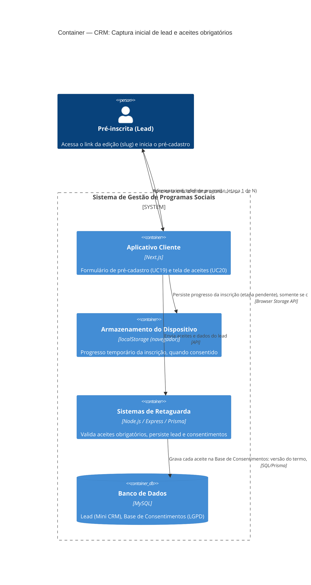

# C4 — Nível 2 (Container): Módulo CRM
## Jornada 1 — Captura inicial de lead e aceites obrigatórios

**UCs:** UC19 (Realizar Pré-Cadastro) → UC20 (Aceitar Termos LGPD, Comunicação, Cookies e Armazenamento Local — subconjunto de pré-cadastro)
**Atores:** Pré-inscrita (Lead)
**Revalidação:** out/2026 — `cm_frontend`, `cm_backend` (`pre-registration`, `management`, `journey-events`)

## Objetivo deste nível

Primeira jornada do sistema vista pelo público externo, sem autenticação. É a porta de entrada do funil (Pré-inscrição → Inscrição → Seleção...) e a primeira vez que o **Aplicativo Cliente** aparece como container operando de verdade (nas jornadas do CMS ele nunca foi acionado). É também a primeira jornada onde a **base de consentimentos** (LGPD) começa a ser povoada — ponto de origem de tudo que o UC76 (anonimização) vai gerenciar mais tarde.

> **Fronteira com o módulo Empreendedor:** esta jornada termina quando o lead está "pré-cadastro concluído, aguardando inscrição completa". O formulário extenso (dados pessoais, do empreendimento, econômicos — UC21) e os aceites adicionais que ele carrega (dados sensíveis, regulamento, uso de imagem) pertencem ao módulo **Empreendedor** e não são detalhados aqui.

## Pré-condição (fora desta jornada)

Edição com inscrições abertas e slug publicado — resultado da **Jornada 2 do módulo CMS** (Criar e Configurar Edição).

## Diagrama (preview — flowchart)

```mermaid
flowchart TB
  lead["Pré-inscrita (Lead)"]

  subgraph Sistema["Sistema de Gestão de Programas Sociais"]
    cliente["Aplicativo Cliente<br/>cm_frontend :3001"]
    ls[("localStorage<br/>cm-enrollment:*")]
    backend["Sistemas de Retaguarda<br/>cm_backend :3000"]
    db[("MySQL operacional<br/>tab_pre_inscricao")]
  end

  lead -->|Acessa /{editionSlug}| cliente
  cliente -->|GET edition scope=enrollment| backend
  lead -->|Aceites + nome, e-mail, telefone| cliente
  cliente -->|POST /api/v1/pre-registrations| backend
  backend -->|Upsert lead + flags de aceite| db
  cliente -->|Rascunho após step 1| ls
  cliente -->|preRegistrationUuid| lead
```

## Diagrama (fonte C4)



## Containers participantes

| Container | Tecnologia | Responsabilidade nesta jornada |
|---|---|---|
| Aplicativo Cliente | Next.js | Formulário de pré-cadastro e tela de aceites; única interface com o lead |
| Armazenamento do Dispositivo | localStorage | Guarda o progresso da inscrição **antes** de existir UUID definitivo (que só nasce em UC21) |
| Sistemas de Retaguarda (Backend) | Node.js, Express, Prisma | Valida obrigatoriedade dos aceites, persiste lead e grava a base de consentimentos |
| Banco de Dados | MySQL (`tab_pre_inscricao`) | Lead (mini CRM) com **colunas booleanas de aceite**; `tab_usuario_lgpd` entra na inscrição completa (UC21) |

Nenhum sistema externo participa desta jornada — a confirmação via WhatsApp (template de inscrição) só ocorre **depois** da inscrição completa (UC21), quando a lead já é Empreendedora.

### APIs implementadas (referência)

| Chamada | Onde |
| --- | --- |
| `GET /api/v1/management/editions?identifier={slug}&scope=enrollment` | `enrollment-page.tsx` → `useEditionDetailModel` |
| `POST /api/v1/pre-registrations` | `step-pre-registration.tsx` → `pre-registration.routes.ts` |
| Evento `pre_registration.created` / `.updated` | `pre-registration.service.ts` → automação / mini CRM (filas) |

## Fluxo da jornada

1. Lead acessa o link da edição (slug).
2. **Aplicativo Cliente** consulta o **Backend** para confirmar que a edição tem inscrições abertas.
3. Exibe indicador de progresso (etapa 1 de N).
4. Lead aceita, de forma obrigatória: **LGPD**, **cookies/armazenamento local** e **contato via WhatsApp**.
5. Lead informa nome, telefone e e-mail.
6. **Aplicativo Cliente** envia os dados ao **Backend**.
7. **Backend** grava o lead no **banco** com status "pré-cadastro concluído" e registra cada aceite na **Base de Consentimentos** (versão do termo, data/hora, dispositivo, finalidade).
8. Se os cookies/armazenamento foram aceitos, o **Aplicativo Cliente** persiste o progresso no **localStorage** do dispositivo, para retomada futura (detalhado na Jornada 2 do CRM).
9. Lead é direcionada à inscrição completa (UC21 — fora desta jornada).

**Implementação (passos ajustados):**

1. Lead acessa `/{editionSlug}` (wizard; step 0 = compatibilidade de navegador, step 1 = pré-cadastro).
2. Cliente carrega edição com `scope=enrollment`; slug inválido → `InvalidEditionState`; edição presencial/híbrida sem períodos → mesma tela (não checa janela `enrollmentOpensAt`/`ClosesAt` no Cliente).
3. Lead preenche **4 checkboxes** na UI: ciência de dados (LGPD), cookies, WhatsApp, termos/regulamento da edição (`editionTermsConsent` → backend `termsConsent` + `editionTermsConsent`).
4. `POST /api/v1/pre-registrations` grava/atualiza `tab_pre_inscricao`, gera **`str_uuid` na primeira gravação**, `bl_cadastrado = false`.
5. Cliente guarda `preRegistrationUuid` no estado do wizard e avança para dados pessoais (UC21).
6. `localStorage` (`cm-enrollment:{program}:{edition}`) persiste rascunho quando `step > 0` (após compatibilidade), não antes do aceite de cookies no formulário.

## Revalidação com a stack (out/2026)

### Alinhado

| Tema | Evidência |
| --- | --- |
| Sem autenticação na entrada | Pré-cadastro público; JWT só depois (login empreendedora) |
| Cliente → backend → MySQL | Fluxo principal conforme diagrama |
| Aceites obrigatórios | Zod `literal('yes')` no backend e no `preRegistrationSchema` |
| Telefone com regex | `fieldRegex.phone` (backend + frontend) |
| Lead duplicado | `409` + diálogo “já cadastrada” (`ConflictError`, `AlreadyRegisteredDialog`) |
| Sem WhatsApp nesta jornada | Nenhum dispatch Gupshup no `POST pre-registrations` |
| Pré-condição CMS | Edição vem do CMS via backend `management` (slug publicado) |

### Divergências (spec / diagrama vs código)

| ID | Documento | Implementação | Ação |
| --- | --- | --- | --- |
| **CRM1-IMPL-A** | “Base de Consentimentos” separada; um registro por aceite com versão do termo | Aceites em **colunas** em `tab_pre_inscricao` (`bl_aceite_cookies`, `bl_ciencia_dados`, …); IP/dispositivo em `str_ip_registro` / `str_dispositivo_registro` — **sem versão de termo** | Atualizar L2/L3 ou evoluir schema para UC76 |
| **CRM1-IMPL-B** | UUID definitivo só após UC21 | **`str_uuid` criado no pré-cadastro** (`randomUUID` no insert) | Ajustar texto do container localStorage; UUID de **usuária** continua em UC21 |
| **CRM1-IMPL-C** | UC20: 3 aceites (LGPD, cookies, WhatsApp) | UI com **4** aceites (+ termos/regulamento da edição); backend exige **5** campos (`termsConsent` + `editionTermsConsent` — Cliente envia o mesmo valor nos dois) | Mapear UC20 ↔ campos reais na spec |
| **CRM1-IMPL-D** | Status “pré-cadastro concluído” | Flag **`bl_cadastrado`** (false até concluir inscrição / vínculo usuário em `completeForUser`) | Usar nomenclatura do banco nos diagramas L3 |
| **CRM1-IMPL-E** | Passo 2: “inscrições abertas” | Cliente valida **404** e **períodos** (P/H); **não** aplica datas `enrollmentOpensAt`/`ClosesAt` na página de inscrição (existem na API e em `/programas`) | Fechar CRM1-D: bloquear edição encerrada no enrollment |
| **CRM1-IMPL-F** | localStorage só se cookies aceitos | Persistência após step &gt; 0; cookies obrigatórios para **submeter** pré-cadastro, mas **não há guard explícito** “sem cookies → não gravar localStorage” | Confirmar política de privacidade ou implementar gate |
| **CRM1-IMPL-G** | Mini CRM implícito | **`journey-events`** emite `pre_registration.created` para automação/reengajamento | Detalhar na Jornada 3 CRM |

## Pontos de atenção para validar

| ID (sugerido) | Risco | O que verificar |
|---|---|---|
| CRM1-A | Aceite de WhatsApp é **obrigatório**, mas a spec não menciona validação ativa do número (nem OTP, nem checagem de formato robusta). Número errado digitado = lead nunca mais é alcançável, mesmo "consentindo" | Testar número incompleto, com DDD inválido, ou de outra pessoa — ver se o sistema aceita e o que acontece no reengajamento (Jornada 3) |
| CRM1-B | Progresso vive **só** no localStorage, sem UUID (que só existe após UC21). Trocar de navegador, limpar dados ou usar outro dispositivo perde o progresso por completo — o único resgate possível é o Mini CRM contatando por telefone/e-mail para recomeçar do zero | Confirmar se essa perda é aceita como comportamento esperado, ou se deveria haver algum identificador de retomada por telefone/e-mail antes do UUID existir |
| CRM1-C | O UC20 é descrito na spec como um único caso de uso que atende tanto o pré-cadastro (3 aceites simples) quanto a inscrição completa (aceites adicionais: dados sensíveis, regulamento, imagem). Se for o **mesmo componente de tela** reutilizado com campos diferentes por contexto, há risco de um aceite da etapa errada aparecer fora de ordem | Confirmar na implementação se é um componente parametrizado por etapa, ou dois fluxos de tela distintos (isso é melhor detalhado no Nível 3 — Componente) |
| CRM1-D | Pré-condição "edição com inscrições abertas" — a spec não cobre o que acontece se a lead acessar um slug de edição **encerrada** ou **inexistente** (só há tratamento desse cenário para UC21, como exceção "edição encerrada durante preenchimento") | Testar acessar slug de edição encerrada e slug inválido/inexistente diretamente na etapa de pré-cadastro |
| CRM1-E | Versão do termo por aceite (UC76) | **Respondido (código):** colunas em `tab_pre_inscricao`; **sem** histórico por versão — ver **CRM1-IMPL-A** | Definir evolução de auditoria LGPD |

## Pendências para fechar este diagrama

- ~~Telas UC19/UC20~~ — implementadas em `step-pre-registration.tsx` (revalidar copy vs spec v10).
- **CRM1-IMPL-E:** alinhar bloqueio de inscrição encerrada entre listagem (`program-enrollment-status`) e página `/{slug}`.
- **CRM1-IMPL-A / UC76:** modelo de consentimento (colunas vs `tab_usuario_lgpd` vs histórico versionado).
- Documentar mapeamento UC20 ↔ `dataAwareness`, `cookiesConsent`, `whatsappConsent`, `editionTermsConsent` / `termsConsent`.

## Notação

- **Preview:** Mermaid `flowchart` (primeira seção).
- **Fonte C4:** `C4Container` — [mermaid.live](https://mermaid.live) ou extensão C4.
