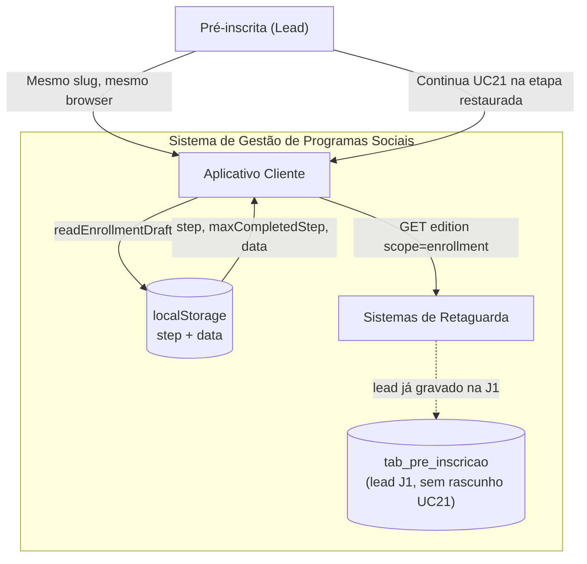
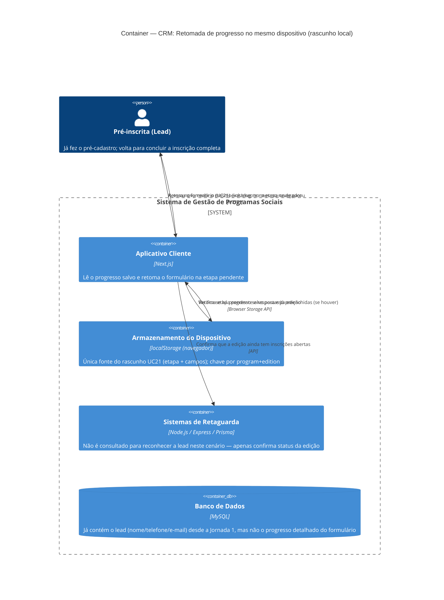

# C4 — Nível 2 (Container): Módulo CRM
## Jornada 2 — Retomada de progresso no mesmo dispositivo (lead ainda incompleta)

**UCs:** UC67 (recorte: retomada **no mesmo dispositivo** via armazenamento local — inscrição UC21 **não concluída**, sem `tab_usuario` / inscrição completa)
**Atores:** Pré-inscrita (Lead)
**Revalidação:** out/2026 — `cm_frontend` (`persistence`, `enrollment-store`), `cm_backend` (`pre-registration`, `enrollment-resume`, `user`)
**Relacionado:** Jornada 1 CRM; retomada **com OTP** de usuária já cadastrada → módulo Empreendedor / `enrollment-resume` (fora deste recorte)

## Objetivo deste nível

Esta jornada é um recorte deliberadamente estreito do UC67: cobre **apenas** o caso em que a lead já fez o pré-cadastro (Jornada 1), começou a preencher a inscrição completa (UC21) mas não terminou, e volta ao mesmo link depois. Não cobre a retomada de quem **já tem UUID definitivo** (isso é jornada do módulo Empreendedor, ligada ao UC4/UC40).

A diferença é importante porque o **progresso parcial do formulário UC21** (campos dos passos 2–4) **não é persistido no servidor** — só no **localStorage** (`cm-enrollment:{program}:{edition}`). O backend já tem o lead da Jornada 1 (`tab_pre_inscricao`, com `str_uuid` desde o pré-cadastro), mas **não** guarda rascunho campo a campo.

> **Nota pós-revalidação:** o diagrama original falava em “sem UUID”. Na implementação, **`preRegistrationUuid` existe após a Jornada 1** e pode ir no rascunho local; o que ainda não existe é a **usuária/inscrição completa** (UC21).

## Diagrama (preview — flowchart)

## Diagrama (fonte C4)

## Containers participantes

| Container | Tecnologia | Papel nesta jornada |
|---|---|---|
| Aplicativo Cliente | Next.js | Lê o localStorage e decide se retoma ou inicia do zero |
| Armazenamento do Dispositivo | localStorage | Objeto `{ step, maxCompletedStep, data }` — **inclui respostas** parciais do wizard |
| Sistemas de Retaguarda (Backend) | Node.js, Express, Prisma | Carrega edição; **não** lê/grava rascunho UC21; lead em `tab_pre_inscricao` via J1 |
| Banco de Dados | MySQL | `tab_pre_inscricao` (contato + aceites); progresso parcial **ausente** |

Nenhum sistema externo participa neste recorte.

**Fora deste recorte (mesmo app, outro fluxo):** `POST /api/v1/users/existence-check` + `POST /api/v1/enrollment/resume/*` — usuária **já cadastrada** na plataforma (OTP e `resumeToken`), não lead só com pré-inscrição.

## Fluxo da jornada

1. Lead acessa novamente o link da edição, no **mesmo navegador/dispositivo** em que havia começado.
2. **Aplicativo Cliente** consulta o **localStorage** por progresso salvo daquela edição.
3. **Se encontrar:** retoma o formulário de inscrição completa (UC21) na etapa onde a lead parou, com as respostas já preenchidas.
4. **Se não encontrar** (localStorage limpo, outro navegador, outro dispositivo, modo anônimo): o Aplicativo Cliente **não consulta o Backend** para tentar reconhecer a lead por telefone/e-mail — simplesmente apresenta o formulário de pré-cadastro do zero (UC19), como se fosse a primeira visita.
5. Em qualquer dos casos, o Aplicativo Cliente confirma com o Backend que a edição ainda tem inscrições abertas.

### Fluxo implementado (referência)

1. `EnrollmentStoreProvider` chama `hydrateFromDraft(initialStep)` ao montar (`enrollment-store-context.tsx`).
2. `readEnrollmentDraft(program, edition)` — chave `cm-enrollment:{program}:{edition}` (`persistence.ts`).
3. Se há draft e não há `initialData` de retomada OTP: restaura **`data`**, **`step`** (limitado ao `?step=` da URL) e **`maxCompletedStep`**.
4. `store.subscribe` → `persistEnrollmentDraft` grava após cada mudança quando `step > STEP_COMPATIBILITY` (0); limpa ao concluir (`STEP_CONCLUSION`).
5. **Sem draft:** wizard inicia no step mínimo (compatibilidade ou pré-cadastro); **não** há API “retomar lead por e-mail” para quem só tem pré-inscrição.
6. **Mesmo contato, outro browser:** novo pré-cadastro faz **upsert** em `tab_pre_inscricao` (unicidade por edition+email/phone) — **não** cria segunda linha; rascunho UC21 perdido.
7. **Usuária já na plataforma:** blur/submit dispara `existence-check` → diálogo OTP → `resumeVerifiedEnrollment` (perfil + `resumeToken`) — **não** é retomada só-local.

## Revalidação com a stack (out/2026)

### Alinhado

| Tema | Evidência |
| --- | --- |
| Rascunho só no dispositivo | `writeEnrollmentDraft` / `readEnrollmentDraft`; backend sem endpoint de draft UC21 |
| Restaura etapa + campos | `hydrateFromDraft` copia `draft.data` e `draft.step` |
| Backend confirma edição | `useEditionDetailModel` + `isEditionEnrollmentAvailable` |
| Lead J1 no servidor | `tab_pre_inscricao`; `bl_cadastrado` false até UC21 |
| Sem TTL no localStorage | Nenhuma expiração em `persistence.ts` |

### Divergências (spec / diagrama vs código)

| ID | Documento | Implementação | Ação |
| --- | --- | --- | --- |
| **CRM2-IMPL-A** | “Sem UUID” / único ID é localStorage | **`str_uuid` e `preRegistrationUuid` desde J1**; localStorage guarda progresso UC21 | Ajustar narrativa (feito neste doc) |
| **CRM2-IMPL-B** | Sem localStorage → pré-cadastro do zero; backend não reconhece | Correto para **rascunho UC21**; pré-cadastro repetido **atualiza** mesma `tab_pre_inscricao` (não duplica lead na mesma edição) | Atualizar CRM2-A (dedup parcial) |
| **CRM2-IMPL-C** | Backend não consultado para reconhecer lead | **`/users/existence-check`** para **usuária cadastrada** (OTP), não para lead incompleta | Separar jornadas CRM vs Empreendedor |
| **CRM2-IMPL-D** | CRM2-B: o que vai no localStorage | **Etapa + objeto `data` completo** do wizard | Pendência CRM2-B **respondida** |
| **CRM2-IMPL-E** | Edição encerrada na retomada | Cliente **não** valida `enrollmentOpensAt`/`ClosesAt` na rota de inscrição (igual CRM1-IMPL-E) | Alinhar bloqueio de edição morta |
| **CRM2-IMPL-F** | UC72 / aviso sem storage | Step 0 = compatibilidade de navegador (`compatibility-alert.ts`); **sem** aviso explícito “progresso será perdido” se localStorage bloqueado | Produto/UX (CRM2-C) |

## Pontos de atenção para validar

| ID (sugerido) | Risco | O que verificar |
|---|---|---|
| CRM2-A | Perda de rascunho UC21 + novo pré-cadastro | **Código:** upsert `tab_pre_inscricao` por edition+email/phone — **sem** segunda linha; **perda** do progresso parcial UC21 e possível `pre_registration.updated` | Validar automação/UC26 com evento **updated** vs **created** |
| CRM2-B | Conteúdo do localStorage | **Respondido:** `step`, `maxCompletedStep`, **`data`** (campos do wizard); servidor só tem J1 até `POST /users` | Reengajamento parcial UC21 continua dependente de Jornada 3 / automação |
| CRM2-C | localStorage recusado ou bloqueado pelo navegador (ex.: modo privado, política corporativa): a spec do UC19 já trata isso ("permite fluxo mínimo, mas sem retomada automática via dispositivo"), mas como isso interage com UC72 (alerta de compatibilidade)? A lead recebe algum aviso explícito de que, se sair, vai perder o progresso? | Testar em navegador com cookies/localStorage bloqueados e verificar se há aviso proativo, não só a ausência de retomada |
| CRM2-D | Expiração do progresso salvo: a spec não define um TTL para o localStorage. Uma lead que volta 6 meses depois, com o mesmo navegador, para uma edição que já **encerrou as inscrições**, retoma um formulário de uma edição morta? | Testar retomada de progresso de uma edição já encerrada |

## Pendências para fechar este diagrama

- ~~Conteúdo do localStorage~~ — ver **CRM2-IMPL-D** / CRM2-B.
- **CRM2-IMPL-E:** retomada com edição fora da janela de inscrição.
- **CRM2-IMPL-F:** copy/UX quando storage indisponível (CRM2-C).
- Documentar fronteira explícita: **CRM J2 (localStorage)** vs **`enrollment-resume` (OTP, usuária existente)** vs **Empreendedor UC4/UC40**.
- Mini CRM / UC26: comportamento com `pre_registration.updated` após reenvio do pré-cadastro sem rascunho.

## Notação

- **Preview:** Mermaid `flowchart`.
- **Fonte C4:** `C4Container` — [mermaid.live](https://mermaid.live) ou extensão C4.
