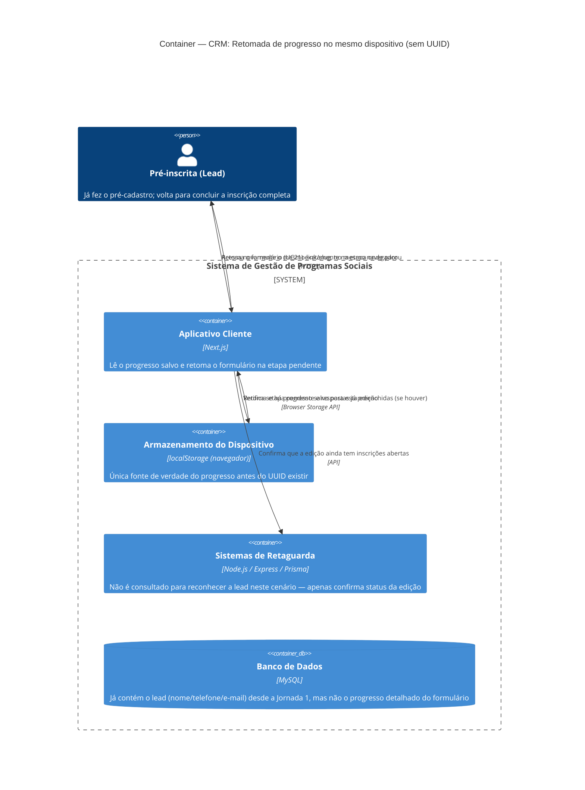

# C4 — Nível 2 (Container): Módulo CRM
## Jornada 2 — Retomada de progresso no mesmo dispositivo (lead ainda incompleta)

**UCs:** UC67 (recorte específico: retomada **antes** de existir UUID definitivo — lead que ainda não concluiu UC21)
**Atores:** Pré-inscrita (Lead)

## Objetivo deste nível

Esta jornada é um recorte deliberadamente estreito do UC67: cobre **apenas** o caso em que a lead já fez o pré-cadastro (Jornada 1), começou a preencher a inscrição completa (UC21) mas não terminou, e volta ao mesmo link depois. Não cobre a retomada de quem **já tem UUID definitivo** (isso é jornada do módulo Empreendedor, ligada ao UC4/UC40).

A diferença é importante porque, antes do UUID existir, o único mecanismo de reconhecimento é o **localStorage do navegador** — não há identificador de servidor que amarre a pessoa ao progresso salvo.

## Diagrama

## Containers participantes

| Container | Tecnologia | Papel nesta jornada |
|---|---|---|
| Aplicativo Cliente | Next.js | Lê o localStorage e decide se retoma ou inicia do zero |
| Armazenamento do Dispositivo | localStorage | **Única** fonte do progresso do formulário antes do UUID existir |
| Sistemas de Retaguarda (Backend) | Node.js, Express, Prisma | Só confirma status da edição — não participa do reconhecimento da lead neste cenário |
| Banco de Dados | MySQL | Já tem o registro do lead (da Jornada 1), mas **não** tem o detalhe de preenchimento do formulário de inscrição |

Nenhum sistema externo participa.

## Fluxo da jornada

1. Lead acessa novamente o link da edição, no **mesmo navegador/dispositivo** em que havia começado.
2. **Aplicativo Cliente** consulta o **localStorage** por progresso salvo daquela edição.
3. **Se encontrar:** retoma o formulário de inscrição completa (UC21) na etapa onde a lead parou, com as respostas já preenchidas.
4. **Se não encontrar** (localStorage limpo, outro navegador, outro dispositivo, modo anônimo): o Aplicativo Cliente **não consulta o Backend** para tentar reconhecer a lead por telefone/e-mail — simplesmente apresenta o formulário de pré-cadastro do zero (UC19), como se fosse a primeira visita.
5. Em qualquer dos casos, o Aplicativo Cliente confirma com o Backend que a edição ainda tem inscrições abertas.

## Pontos de atenção para validar

| ID (sugerido) | Risco | O que verificar |
|---|---|---|
| CRM2-A | **Risco mais relevante desta jornada.** Quando o localStorage não tem o progresso (passo 4), o sistema não tenta reconhecer a lead por telefone/e-mail no Backend. Isso **cria um segundo registro de lead** (Mini CRM) para a mesma pessoa, com o mesmo telefone/e-mail já cadastrado na Jornada 1 — sem qualquer deduplicação, já que o CPF (chave de dedup via hash) só existe a partir do UC21 concluído | Testar: completar a Jornada 1 (pré-cadastro), limpar localStorage/trocar navegador, repetir a Jornada 1 com os mesmos dados — ver se surge um lead duplicado no Mini CRM (UC26) |
| CRM2-B | O que exatamente fica salvo no localStorage: só a etapa atual (ex.: "bloco 3") ou as respostas já digitadas dos blocos 1–4 do UC21? Se forem só as respostas client-side, **nada** disso chega ao Backend até o envio final — uma lead que preenche 90% do formulário e nunca o envia não deixa rastro algum no servidor além do registro básico da Jornada 1 | Preencher parcialmente a inscrição completa, não enviar, verificar no Backend/BI se existe qualquer sinal desse progresso parcial (para fins de reengajamento direcionado, não genérico) |
| CRM2-C | localStorage recusado ou bloqueado pelo navegador (ex.: modo privado, política corporativa): a spec do UC19 já trata isso ("permite fluxo mínimo, mas sem retomada automática via dispositivo"), mas como isso interage com UC72 (alerta de compatibilidade)? A lead recebe algum aviso explícito de que, se sair, vai perder o progresso? | Testar em navegador com cookies/localStorage bloqueados e verificar se há aviso proativo, não só a ausência de retomada |
| CRM2-D | Expiração do progresso salvo: a spec não define um TTL para o localStorage. Uma lead que volta 6 meses depois, com o mesmo navegador, para uma edição que já **encerrou as inscrições**, retoma um formulário de uma edição morta? | Testar retomada de progresso de uma edição já encerrada |

## Pendências para fechar este diagrama

- Confirmar exatamente o que é persistido no localStorage: apenas o indicador de etapa, ou as respostas do formulário também (decide a gravidade do CRM2-B).
- Confirmar se existe alguma estratégia de deduplicação de lead por telefone/e-mail (mesmo que aproximada) antes do CPF existir — ou se o negócio aceita conviver com leads duplicadas nesse estágio e resolve isso só depois, via CPF, na seleção (UC23/UC24).
- Verificar como o Mini CRM (UC26, Jornada 3) trata leads duplicadas quando aparecem — se filtra, mescla ou simplesmente lista todas.
