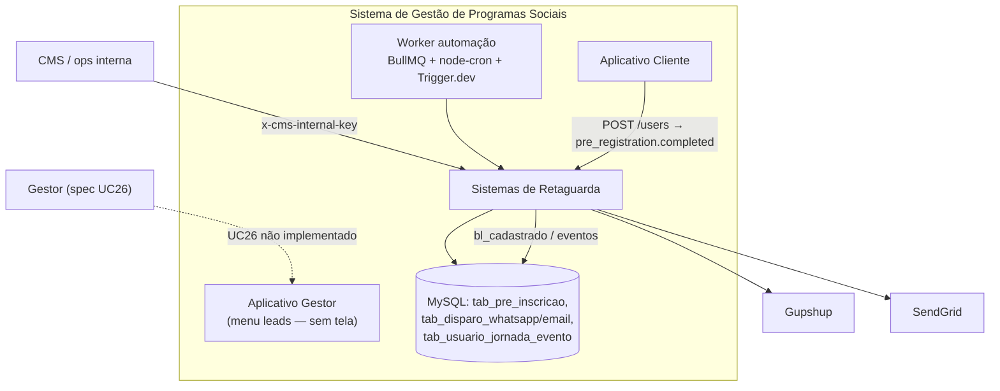
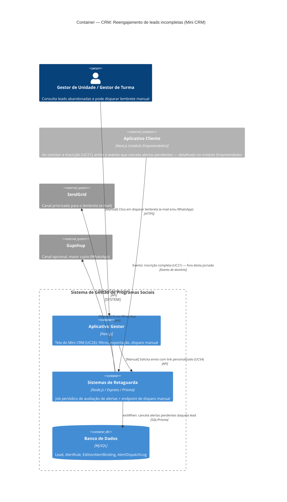

# C4 — Nível 2 (Container): Módulo CRM
## Jornada 3 — Reengajamento de leads incompletas (Mini CRM)

**UCs:** UC26 (Gerenciar Leads com Inscrição Incompleta) + UC87/UC52 (execução da fila de alertas / comunicação)
**Atores (spec):** Gestor de Unidade, Gestor de Turma (disparo manual) · Backend (disparo automático)
**Revalidação:** out/2026 — `cm_backend` (`automation`, `journey-events`, `whatsapp-dispatch`, Trigger `sync-alerts`), `cm_app_gestor` (menu UC26)

## Objetivo deste nível

Primeira jornada em que a **fila de alertas** — configurada só no papel até agora (CMS, Jornada 3) — dispara mensagens de verdade. Mostra dois caminhos paralelos para o mesmo objetivo (resgatar lead incompleta): o **automático** (regra `inscription_incomplete`, avaliada por job periódico) e o **manual** (botão do Gestor, usado como "controle de custo" segundo a spec). O ponto de maior risco desta jornada é justamente a interação entre os dois.

## Diagrama (preview — flowchart)

Implementação atual (simplificado; ver divergências abaixo).

## Diagrama (fonte C4 — spec)

## Containers participantes

| Container | Tecnologia | Papel nesta jornada |
|---|---|---|
| Aplicativo Gestor | Next.js | Tela do Mini CRM: filtro, exportação, histórico, botão de disparo manual |
| Sistemas de Retaguarda (Backend) | Node.js, Express, Prisma | Job periódico de avaliação (automático) + endpoint de disparo (manual) — **mesmo container, dois gatilhos diferentes** |
| Banco de Dados | MySQL | **Spec:** AlertRule / EditionAlertBinding / AlertDispatchLog — **Código:** `tab_pre_inscricao`, `tab_disparo_whatsapp`, `tab_disparo_email`, `tab_usuario_jornada_evento` |
| Aplicativo Cliente (referência) | Next.js | Não detalhado aqui — aparece só como origem do evento que cancela os alertas (módulo Empreendedor) |
| SendGrid (externo) | — | Canal priorizado (e-mail) |
| Gupshup (externo) | — | Canal opcional (WhatsApp, maior custo) |

## Fluxo da jornada

**Caminho automático**
1. Job periódico (15–30 min, conforme UC87) avalia bindings ativos e a regra `inscription_incomplete`.
2. Calcula elegibilidade (tempo desde o pré-cadastro) e respeita cadência (`delayDays`, `repeatDays`, `maxSends`).
3. Se elegível: enfileira e envia — prioritariamente por **SendGrid**; **Gupshup** como opção de maior custo.
4. Grava `AlertDispatchLog` com `dedupeKey` (regra + pessoa + etapa).

**Caminho manual**
1. Gestor acessa o Mini CRM, filtra por programa/edição/etapa de abandono.
2. Consulta se já há alerta automático ativo/disparado para aquelas leads (histórico).
3. Exporta lista ou dispara manualmente o lembrete, com link personalizado (UC54).
4. Backend envia via SendGrid e/ou Gupshup e registra o envio.

**Encerramento**
- Quando a lead conclui a inscrição completa (UC21, módulo Empreendedor), um evento de domínio chega ao Backend, que aplica `exitWhen` e cancela qualquer alerta pendente daquela pessoa.

### Fluxo implementado (referência `cm_backend`)

**Lead elegível:** `tab_pre_inscricao` com `bl_cadastrado = false`.

**Automático (três mecanismos, não exclusivos):**

1. **Eventos de jornada** — `pre_registration.created` / `.updated` → fila BullMQ (`journey-automation`) → `automation-rule.engine` → regras CMS (`loadEditionAutomationRules`, slot `pre_inscricao`, condição `pre_inscricao_incompleta`) → `dispatchPreRegistrationMessage`.
2. **Cron in-process** — `automation-cron.scheduler` → `processPreRegistrationReminders()` (janela comercial; **desliga** se a edição tiver regras de automação no CMS); slots `pre_inscricao_lembrete_{N}d` da config de mensageria.
3. **Message Hub (Trigger.dev)** — `sync-alerts` (~10 min) descobre gatilhos CMS e despacha via `process-trigger` (paralelo à spec UC87; **sem** `inscription_incomplete` no código).

**Disparo “manual” hoje:** APIs **`/api/v1/automation/*`** protegidas por **`x-cms-internal-key`** (CMS/Bruno/ops), **não** JWT do App Gestor:

| Endpoint | Uso |
| --- | --- |
| `GET /automation/pre-registrations` | Listar leads pendentes |
| `GET /automation/dispatches` | Histórico por edition/phone/flow |
| `POST /automation/dispatch` | `{ preRegistrationId, flow, force? }` |
| `POST /automation/pre-registrations/process` | Rodar processor de lembretes |

**Canais:** `resolveChannels` (config da edição + `bl_aceite_notificacao_whatsapp`); registros em `tab_disparo_whatsapp` / `tab_disparo_email`. Dedupe: `hasSuccessfulDispatch` (edition + phone + flow), bypass com `force: true`.

**Encerramento:** `POST /users` (UC21) → `pre_registration.completed` + `bl_cadastrado = true`; motor ignora lead completa (`pre_registration_completed`).

**App Gestor:** item de menu **“Mini CRM (leads)”** (`gestor-menu.ts`, rota `/gestor/e/[edicaoId]/leads`) — **sem `page.tsx`** nem chamadas `/api/v2/app-gestor` para leads.

## Revalidação com a stack (out/2026)

### Alinhado (conceito)

| Tema | Evidência |
| --- | --- |
| Reengajar pré-inscrição incompleta | `listPendingPreRegistrations`, lembretes por flow/dias |
| WhatsApp condicionado a consentimento | `consent_whatsapp` / `bl_aceite_notificacao_whatsapp` |
| Janela comercial (cron) | `isWithinCommunicationWindow` em `processPreRegistrationReminders` |
| Parar após inscrição completa | `bl_cadastrado`, evento `pre_registration.completed` |
| SendGrid + Gupshup | `dispatchPreRegistrationMessage` |

### Divergências (spec / diagrama vs código)

| ID | Documento | Implementação | Ação |
| --- | --- | --- | --- |
| **CRM3-IMPL-A** | Regra `inscription_incomplete` + job 15–30 min + `AlertDispatchLog` | **Não encontrado** no backend; automação via **regras CMS** (`AutomationRule`), **cron** e **Trigger sync-alerts** | Atualizar L2 para modelo real ou implementar spec UC87 |
| **CRM3-IMPL-B** | Mini CRM no **App Gestor** (filtros, export, botão) | **Só menu**; listagem/disparo via API **interna CMS** | UC26 = gap de produto |
| **CRM3-IMPL-C** | Gestor dispara manual (HTTPS app → API gestor) | `POST /automation/dispatch` exige **chave CMS** | BFF gestor ou mover auth |
| **CRM3-IMPL-D** | `dedupeKey` unificado auto+manual | Dedupe por **flow + phone + edition**; manual pode usar **`force: true`** | Revisar CRM3-B (duplicata possível com force) |
| **CRM3-IMPL-E** | Canal e-mail priorizado na fila | Config **`AUTOMATION_PRE_REGISTRATION_CHANNEL`** / CMS; e-mail pode enviar **sem** aceite explícito de e-mail no pré-cadastro | CRM3-C legal/produto |
| **CRM3-IMPL-F** | Job no container Backend | **Cron no processo Express** + **BullMQ worker** + **Trigger.dev** separado (PM2 `cm-trigger`) | Detalhar no L3 |
| **CRM3-IMPL-G** | `exitWhen` cancela alertas pendentes | **Skip por condição** (`bl_cadastrado`); filas BullMQ já enfileiradas podem ainda processar — ver idempotência/dispatch skip | Testar corrida pós-UC21 |

## Pontos de atenção para validar

| ID (sugerido) | Risco | O que verificar |
|---|---|---|
| CRM3-A | A spec não define um valor padrão de `delayDays` para a regra `inscription_incomplete` (diferente de `risk_short_online`, que tem defaults explícitos de 10/5 dias). Sem default, o tempo entre abandono e primeiro contato depende inteiramente da configuração manual no CMS | Verificar o valor realmente configurado na regra ativa e se há um fallback caso fique em branco |
| CRM3-B | Auto + manual no mesmo dia | **Código:** mesmo dedupe **por flow** em `tab_disparo_*`; **`force: true`** ignora dedupe — risco de duplicata **intencional** | Testar auto → manual com/sem `force`; alinhar UX UC26 |
| CRM3-C | Lead aceitou **obrigatoriamente** contato via WhatsApp na Jornada 1 (UC19), mas não há aceite explícito equivalente para e-mail nesse estágio (o aceite de "comunicados gerais" é do UC20 da inscrição completa, não do pré-cadastro). Ainda assim, o e-mail é o canal **priorizado** pela fila automática | Confirmar se o e-mail de reengajamento de pré-cadastro está coberto pelo aceite de LGPD geral, ou se tecnicamente depende de um consentimento que a lead ainda não deu |
| CRM3-D | Se o e-mail informado na Jornada 1 estiver incorreto (não há validação ativa — ver CRM1-A), o lembrete por e-mail falha silenciosamente. Existe fallback automático para WhatsApp nesse caso, ou a lead simplesmente não é alcançada? | Testar e-mail inválido/inexistente na Jornada 1 e observar se o alerta automático detecta a falha e tenta o outro canal |
| CRM3-E | Janela comercial (seg–sex 8h–20h; sáb 8h–16h; sem domingo/feriado) é regra explícita para WhatsApp. Para e-mail, a spec diz apenas que "**pode** seguir a mesma janela operacional" — ambíguo | Confirmar se e-mails de alerta são enviados fora da janela comercial (madrugada, domingo) ou se a mesma restrição se aplica |

## Pendências para fechar este diagrama

- **UC26:** implementar tela `/gestor/e/[edicaoId]/leads` + API `app-gestor` (ou proxy seguro para list/dispatch).
- **CRM3-IMPL-A:** documentar ou implementar equivalência a `inscription_incomplete` / Message Hub alerts vs automação atual.
- **CRM3-IMPL-G:** teste de corrida `pre_registration.completed` vs job atrasado na fila.
- ~~Evento inscrição completa~~ — `pre_registration.completed` + `enrollment.created` assíncronos (`journeyEventService.emit`), não transação síncrona UC21.
- Mapear **Trigger `sync-alerts`** vs **cron pre-registration** vs **regras por evento** (evitar triple-send).

## Notação

- **Preview:** Mermaid `flowchart`.
- **Fonte C4:** diagrama acima reflete **spec**; use seção **Revalidação** para as-is em homolog.
