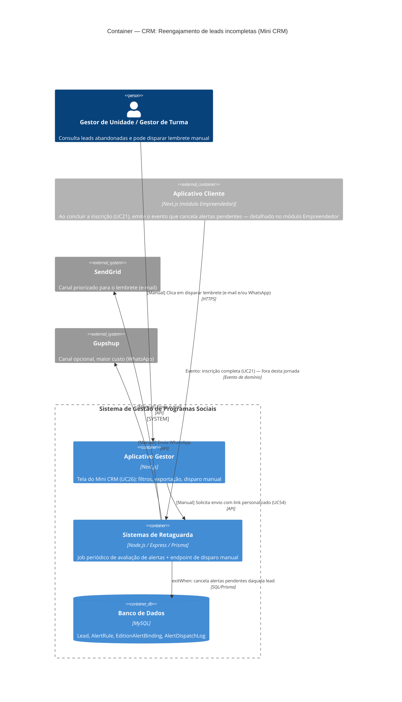

# C4 — Nível 2 (Container): Módulo CRM
## Jornada 3 — Reengajamento de leads incompletas (Mini CRM)

**UCs:** UC26 (Gerenciar Leads com Inscrição Incompleta) + UC87/UC52 (execução real da fila de alertas)
**Atores:** Gestor de Unidade, Gestor de Turma (disparo manual) · Backend (disparo automático)

## Objetivo deste nível

Primeira jornada em que a **fila de alertas** — configurada só no papel até agora (CMS, Jornada 3) — dispara mensagens de verdade. Mostra dois caminhos paralelos para o mesmo objetivo (resgatar lead incompleta): o **automático** (regra `inscription_incomplete`, avaliada por job periódico) e o **manual** (botão do Gestor, usado como "controle de custo" segundo a spec). O ponto de maior risco desta jornada é justamente a interação entre os dois.

## Diagrama

## Containers participantes

| Container | Tecnologia | Papel nesta jornada |
|---|---|---|
| Aplicativo Gestor | Next.js | Tela do Mini CRM: filtro, exportação, histórico, botão de disparo manual |
| Sistemas de Retaguarda (Backend) | Node.js, Express, Prisma | Job periódico de avaliação (automático) + endpoint de disparo (manual) — **mesmo container, dois gatilhos diferentes** |
| Banco de Dados | MySQL | Lead, `AlertRule`, `EditionAlertBinding`, `AlertDispatchLog` |
| Aplicativo Cliente (referência) | Next.js | Não detalhado aqui — aparece só como origem do evento que cancela os alertas (módulo Empreendedor) |
| SendGrid (externo) | — | Canal priorizado (e-mail) |
| Gupshup (externo) | — | Canal opcional (WhatsApp, maior custo) |

## Fluxo da jornada

**Caminho automático**
1. Job periódico (15–30 min, conforme UC87) avalia bindings ativos e a regra `inscription_incomplete`.
2. Calcula elegibilidade (tempo desde o pré-cadastro) e respeita cadência (`delayDays`, `repeatDays`, `maxSends`).
3. Se elegível: enfileira e envia — prioritariamente por **SendGrid**; **Gupshup** como opção de maior custo.
4. Grava `AlertDispatchLog` com `dedupeKey` (regra + pessoa + etapa).

**Caminho manual**
1. Gestor acessa o Mini CRM, filtra por programa/edição/etapa de abandono.
2. Consulta se já há alerta automático ativo/disparado para aquelas leads (histórico).
3. Exporta lista ou dispara manualmente o lembrete, com link personalizado (UC54).
4. Backend envia via SendGrid e/ou Gupshup e registra o envio.

**Encerramento**
- Quando a lead conclui a inscrição completa (UC21, módulo Empreendedor), um evento de domínio chega ao Backend, que aplica `exitWhen` e cancela qualquer alerta pendente daquela pessoa.

## Pontos de atenção para validar

| ID (sugerido) | Risco | O que verificar |
|---|---|---|
| CRM3-A | A spec não define um valor padrão de `delayDays` para a regra `inscription_incomplete` (diferente de `risk_short_online`, que tem defaults explícitos de 10/5 dias). Sem default, o tempo entre abandono e primeiro contato depende inteiramente da configuração manual no CMS | Verificar o valor realmente configurado na regra ativa e se há um fallback caso fique em branco |
| CRM3-B | **Risco mais relevante desta jornada.** O caminho manual e o automático usam o mesmo `dedupeKey`/log, ou são registros independentes? Se forem independentes, uma lead pode receber lembrete automático **e** manual no mesmo dia, sem o sistema saber que já a alcançou por outro canal | Testar: deixar o alerta automático disparar e, no mesmo dia, disparar manualmente para a mesma lead — ver se o sistema avisa ("já contatada há X horas") ou deixa passar |
| CRM3-C | Lead aceitou **obrigatoriamente** contato via WhatsApp na Jornada 1 (UC19), mas não há aceite explícito equivalente para e-mail nesse estágio (o aceite de "comunicados gerais" é do UC20 da inscrição completa, não do pré-cadastro). Ainda assim, o e-mail é o canal **priorizado** pela fila automática | Confirmar se o e-mail de reengajamento de pré-cadastro está coberto pelo aceite de LGPD geral, ou se tecnicamente depende de um consentimento que a lead ainda não deu |
| CRM3-D | Se o e-mail informado na Jornada 1 estiver incorreto (não há validação ativa — ver CRM1-A), o lembrete por e-mail falha silenciosamente. Existe fallback automático para WhatsApp nesse caso, ou a lead simplesmente não é alcançada? | Testar e-mail inválido/inexistente na Jornada 1 e observar se o alerta automático detecta a falha e tenta o outro canal |
| CRM3-E | Janela comercial (seg–sex 8h–20h; sáb 8h–16h; sem domingo/feriado) é regra explícita para WhatsApp. Para e-mail, a spec diz apenas que "**pode** seguir a mesma janela operacional" — ambíguo | Confirmar se e-mails de alerta são enviados fora da janela comercial (madrugada, domingo) ou se a mesma restrição se aplica |

## Pendências para fechar este diagrama

- Telas reais do Mini CRM (UC26) ainda não vistas — diagrama baseado na spec.
- Confirmar se o job periódico é um processo separado (worker/cron) dentro do container Backend, ou literalmente o mesmo processo que atende requisições HTTP — isso pode ser relevante no Nível 3 (Componente) para entender concorrência e escala.
- Confirmar a estrutura exata do evento de "inscrição completa" que cancela os alertas — é um evento assíncrono (fila/pub-sub) ou uma chamada síncrona dentro da própria transação do UC21?
