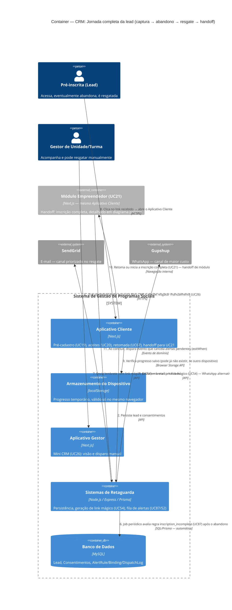

# C4 — Nível 2 (Container): Módulo CRM
## Jornada 4 — Visão de ponta a ponta: lead abandona → é resgatada → conclui inscrição

**UCs:** UC19 → UC20 → (abandono) → UC26 / UC87-execução → UC54 → UC67 → UC21 (handoff, fora do módulo)
**Atores:** Pré-inscrita (Lead), Gestor de Unidade/Turma, Backend (automação)

## Objetivo deste nível

Esta jornada não introduz container novo — ela **consolida** as Jornadas 1, 2 e 3 numa única linha do tempo, para servir como mapa de fechamento do módulo CRM. O valor está em mostrar, num só lugar, todos os pontos onde a jornada pode **quebrar** (lead se perde) e todos os pontos onde o sistema tenta **recuperá-la**, até o momento exato em que a responsabilidade passa para o módulo Empreendedor (UC21).

## Diagrama

## Containers participantes (consolidado)

| Container | Papel na jornada completa |
|---|---|
| Aplicativo Cliente | Único ponto de contato da lead — do primeiro acesso até a entrada no módulo Empreendedor |
| Armazenamento do Dispositivo | Ponte frágil entre sessões — funciona só no mesmo navegador, sem rede de segurança |
| Aplicativo Gestor | Via humana de resgate, paralela à automação |
| Sistemas de Retaguarda (Backend) | Centraliza persistência, geração de link e decisão de quando/como resgatar |
| Banco de Dados | Guarda tudo que sobrevive entre sessões — o que não está aqui, se perde |
| SendGrid / Gupshup | Únicos canais de volta até a lead, quando ela já saiu do app |
| Módulo Empreendedor (referência) | Destino final desta jornada — detalhado em diagramas próprios |

## Mapa de risco consolidado (GAPs das Jornadas 1–3, localizados nesta linha do tempo)

| Ponto da jornada | GAP relacionado | Efeito se não resolvido |
|---|---|---|
| Passo 1 (aceite de WhatsApp) | CRM1-A | Número errado → lead inalcançável desde o início, mesmo com aceite registrado |
| Passo 1 (e-mail informado) | CRM3-D | E-mail errado → canal priorizado do resgate (passo 7) falha silenciosamente |
| Passo 4 (localStorage) | CRM1-B | Progresso vive só no dispositivo — não há cópia de segurança no servidor |
| Passo 5a (retorno) | CRM2-A | Sem localStorage, sistema não tenta reconhecer por telefone/e-mail → risco de lead duplicada |
| Passo 5a (retorno) | CRM2-B | Mesmo com retomada bem-sucedida, respostas parciais do UC21 podem não ter sido enviadas ao Backend |
| Passo 6 / 6' (resgate) | CRM3-A | Sem default de `delayDays`, o tempo até o primeiro contato depende 100% da configuração manual |
| Passo 6 / 6' (resgate) | CRM3-B | Automático e manual podem disparar para a mesma lead sem se perceberem |
| Passo 6 (canal priorizado) | CRM3-C | E-mail priorizado sem aceite específico de comunicação por e-mail nesta etapa |
| Passo 7 (janela de envio) | CRM3-E | Ambiguidade se e-mail de resgate respeita a mesma janela comercial do WhatsApp |
| Passo 9 (retorno via link) | CRM1-D / CRM2-D | Link de resgate para edição já encerrada — comportamento não coberto pela spec |

## O que este diagrama confirma sobre a arquitetura do módulo CRM

- **Não há container de "rascunho server-side"** para a inscrição completa antes do envio final — tudo que é parcial (blocos do UC21) vive só no localStorage, o que é uma escolha arquitetural válida, mas que concentra risco de perda de dado no dispositivo da lead, não no servidor.
- **O Backend é o único ponto de decisão** entre os dois caminhos de resgate (automático e manual) — o que torna o CRM3-B (deduplicação entre os dois) uma correção centralizada e relativamente simples de implementar, se confirmada a lacuna.
- **A fronteira com o módulo Empreendedor é limpa**: um único ponto de handoff (passo 10), o que facilita manter os diagramas de cada módulo independentes sem redundância.

## Pendências para fechar o módulo CRM

Estas pendências já apareciam nas Jornadas 1–3 e seguem abertas; resolvê-las aqui fecha o módulo inteiro:

1. Telas reais de UC19, UC20 (recorte pré-cadastro) e UC26 ainda não vistas — todos os três diagramas estão baseados na spec.
2. Confirmar a existência (ou ausência confirmada) de deduplicação de lead por telefone/e-mail antes do CPF existir (CRM2-A).
3. Confirmar se o canal manual (UC26) compartilha o mesmo `dedupeKey`/log do canal automático (UC87) (CRM3-B).
4. Confirmar a base legal de comunicação por e-mail nesta etapa, já que o aceite obrigatório registrado é especificamente de WhatsApp (CRM3-C).
