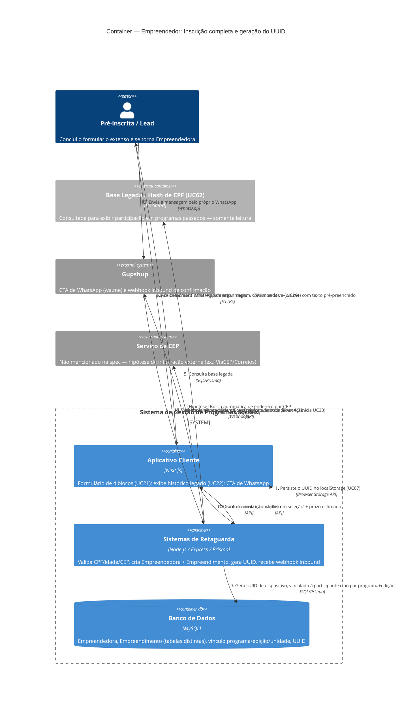

# C4 — Nível 2 (Container): Módulo Empreendedor
## Jornada 1 — Inscrição completa e geração do UUID

**UCs:** UC21 (Realizar Inscrição Completa — detalhado) → UC22 (Histórico Legado / Cadastro Recorrente) → UC67 (emissão do UUID definitivo)
**Atores:** Pré-inscrita/Lead que está concluindo (torna-se Empreendedora ao final) · Empreendedora recorrente (UC22)

## Objetivo deste nível

Primeira jornada do módulo Empreendedor, e a mais aguardada: até aqui, o **UC21** só existiu como uma caixa de referência (`Container_Ext`) em três diagramas diferentes (CRM/Jornada 1, CRM/Jornada 4, Gestor/Jornada 2 e 5). Agora abrimos de verdade o que a spec descreve como a ficha mais extensa do sistema — 4 blocos — e o momento exato em que o **UUID definitivo** nasce, fechando a lacuna que a Jornada 2 do CRM deixou em aberto (lá, antes do UUID existir, só havia o localStorage como fonte frágil de verdade).

## Diagrama

## Containers participantes

| Container | Tecnologia | Papel nesta jornada |
|---|---|---|
| Aplicativo Cliente | Next.js | Formulário de 4 blocos, exibição do histórico legado, CTA de WhatsApp |
| Sistemas de Retaguarda (Backend) | Node.js, Express, Prisma | Validações, criação de Empreendedora + Empreendimento, geração de UUID, recebimento do webhook |
| Banco de Dados | MySQL | Empreendedora, Empreendimento (tabelas distintas), vínculo programa/edição/unidade |
| Base Legada — referência | — | Consulta somente leitura (UC62), já vista como container externo no módulo Gestor |
| Gupshup (externo) | — | CTA de WhatsApp e webhook de confirmação |
| Serviço de CEP (hipótese) | — | **Não documentado na spec** — primeira vez que essa lacuna aparece de forma concreta |

## Fluxo da jornada

1. A pessoa (vindo do pré-cadastro, módulo CRM) acessa o formulário completo, com indicador de progresso de 4 blocos.
2–3. Preenche os blocos: Instruções (com disponibilidade e preferência de período, se P/H), Dados Pessoais (CPF, nascimento, dados sensíveis com "Prefiro não responder", endereço com CEP), Dados do Empreendimento (formalização, CNPJ se MEI/ME, internet/WhatsApp se ativos na régua) e Dados Econômicos (renda, dependentes, CLT, cargo público).
4–5. O sistema exibe, em modo somente leitura, a participação em programas passados (consulta por hash de CPF à base legada) — **sem** pré-preencher o formulário atual.
6. Aceita os termos finais (regulamento por link/PDF, uso de imagem, comunicados gerais).
7. Envia o formulário completo ao Backend.
8. Backend valida CPF (hash + pepper), idade (bloqueio ≥18) e CEP; cria os registros de **Empreendedora** e **Empreendimento** — duas entidades distintas, sem mesclar por nome de estabelecimento.
9. Backend gera o **UUID de dispositivo**, vinculado à pessoa e ao par programa+edição.
10. Confirma a inscrição com status "em seleção" e um prazo estimado.
11. O Aplicativo Cliente persiste o UUID no localStorage — a partir de agora, há uma fonte de verdade no servidor, não só no dispositivo (diferente do estágio pré-UC21, coberto na Jornada 2 do CRM).
12. Exibe o número de WhatsApp da organização com um CTA imperativo e texto pré-preenchido.
13. A pessoa envia a mensagem pelo próprio WhatsApp.
14. O webhook inbound do Gupshup identifica o telefone e associa à inscrição.
15. Backend dispara o template de confirmação de inscrição — **isto não inicia a jornada educacional (UC33)**, apenas abre a janela de 24h/opt-in operacional.

## Pontos de atenção para validar

| ID (sugerido) | Risco | O que verificar |
|---|---|---|
| Empr1-A | **Segunda lacuna de infraestrutura não documentada** (a primeira foi o armazenamento de arquivos, Gestor8-B). A "busca automática por CEP" sugere uma integração externa (tipo ViaCEP/Correios) que não aparece em lugar nenhum da lista de sistemas externos da spec (só Gupshup, SendGrid, YouTube) | Confirmar com o time técnico qual serviço é usado e se ele está listado em algum inventário de integrações fora desta spec |
| Empr1-B | **Resolve uma pendência aberta desde a Jornada 2 do CRM (CRM2-B).** O envio ao Backend (passo 7) acontece como **um único submit** dos 4 blocos no final, ou bloco a bloco, com gravação incremental no servidor? Isso decide se o risco de perda de progresso parcial (só no localStorage) é real ou não | Testar: preencher os 4 blocos e, antes de clicar em enviar, verificar (via rede do navegador) se já houve qualquer chamada ao Backend salvando dados parciais, ou se tudo acontece só no passo 7 |
| Empr1-C | Criar Empreendedora **e** Empreendimento (passo 8) são duas operações. Se não forem atômicas (mesma transação), uma falha entre as duas pode gerar um registro órfão — Empreendedora sem Empreendimento, ou vice-versa | Confirmar se a criação ocorre numa única transação de banco, e testar uma falha induzida entre as duas operações, se possível |
| Empr1-D | O webhook inbound (passo 14) associa a inscrição pelo **telefone que enviou a mensagem**. Se a pessoa usar um número de WhatsApp diferente do que cadastrou no formulário (ex.: WhatsApp de outra pessoa, número trocado), a associação falha silenciosamente — ela nunca recebe a confirmação, e o Gestor pode interpretar como "não escreveu no WhatsApp" (UC26) quando na verdade escreveu, só que de outro número | Testar enviar a mensagem de um número diferente do cadastrado e verificar o comportamento |
| Empr1-E | UC22 registra explicitamente que a decisão sobre dispensar a pergunta "já participou" está **"em avaliação"** — não é uma lacuna de implementação, é um requisito ainda não fechado pela própria spec | Confirmar se essa decisão já avançou desde a v7 do documento |
| Empr1-F | O fluxo alternativo "Programa Pílulas: aprovação imediata quando configurado" não deixa claro como ele se encaixa nas etapas de seleção já mapeadas no módulo Gestor (UC23/UC24) — a aprovação imediata pula essas etapas inteiramente, ou é uma qualificação automática que ainda passa pela revisão humana? | Confirmar o funcionamento exato do fluxo Pílulas com o time de produto — pode exigir revisão dos diagramas do módulo Gestor se houver uma trilha paralela não mapeada |
| Empr1-G | A exceção EC1 ("edição encerrada durante preenchimento") não especifica em qual momento exato o sistema verifica isso — só no envio final (passo 7), ou a qualquer navegação entre blocos? Uma pessoa preenchendo havia 20 minutos pode perder tudo sem aviso prévio se a verificação só acontecer no fim | Testar: começar a inscrição, encerrar a edição no meio do preenchimento (via CMS, em ambiente de teste), e ver em que momento o Cliente avisa |

## Revalidação com a stack (out/2026)

| Camada | Status |
| --- | --- |
| Backend | OK — POST /users, pre-registration, resume OTP |
| Frontend | OK — wizard 5 passos; gaps UC62, save parcial servidor (**X-10**) |

Matriz consolidada e IDs compartilhados (**X-01…X-10**, **CTX-***, **CRM**): [../../../REVALIDACAO-MATRIZ.md](../../../REVALIDACAO-MATRIZ.md)

> Diagrama C4 acima = **spec de produto**; esta seção = **as-is homolog** nos repos EWTI-BR (out/2026).

## Pendências para fechar este diagrama

- Telas reais do formulário de 4 blocos (UC21) e da tela de histórico legado (UC22) ainda não vistas — diagrama baseado inteiramente na spec.
- **Empr1-B é a pendência mais importante** porque resolve, com evidência real, uma dúvida que vem se arrastando desde o módulo CRM.
- Confirmar o serviço de CEP (Empr1-A) como item da lista crescente de integrações não documentadas (junto com o armazenamento de arquivos do Gestor/Jornada 8).
