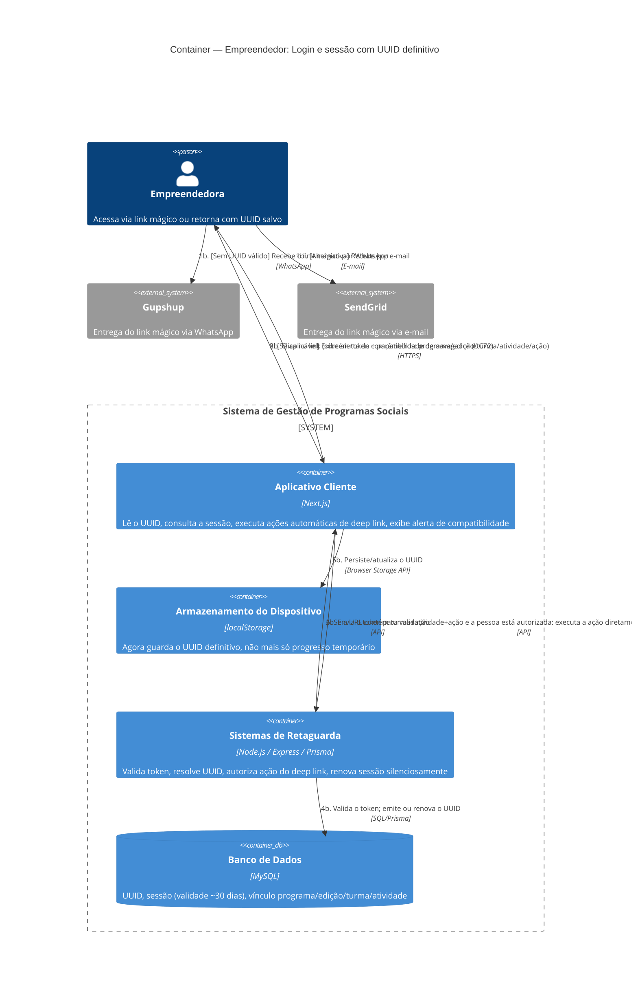

# C4 — Nível 2 (Container): Módulo Empreendedor
## Jornada 2 — Login e sessão com UUID definitivo

**UCs:** UC4 (Login — Link Mágico) → UC67 (resgate de sessão, UUID definitivo) → UC72 (Alerta de Compatibilidade)
**Atores:** Empreendedora (já com UUID, pós-inscrição completa)

## Objetivo deste nível

Esta jornada é o **contraponto direto** da Jornada 2 do CRM: lá, antes da inscrição completa, o reconhecimento da pessoa dependia inteiramente do localStorage, sem rede de segurança no servidor. Aqui, com o UUID definitivo emitido (Jornada 1 deste módulo), o Backend passa a ter uma fonte de verdade própria — mas o **método de autenticação continua sendo exclusivamente o link mágico**, sem senha, sem segundo fator. É o momento certo para verificar, com os mecanismos agora totalmente detalhados, uma hipótese de risco que levantamos na primeiríssima validação do projeto (Fase 1, UC1/UC3/UC4) e que nunca tínhamos podido confirmar com este nível de profundidade.

## Diagrama

## Containers participantes

| Container | Tecnologia | Papel nesta jornada |
|---|---|---|
| Aplicativo Cliente | Next.js | Lê UUID, consulta sessão, executa ações automáticas, exibe alertas |
| Armazenamento do Dispositivo | localStorage | Mesmo container já visto no CRM — agora guarda o UUID **definitivo**, de ciclo de vida mais longo |
| Sistemas de Retaguarda (Backend) | Node.js, Express, Prisma | Valida token, resolve sessão, autoriza e executa a ação do deep link, renova sessão |
| Banco de Dados | MySQL | UUID, sessão, vínculos de programa/edição/turma/atividade |
| Gupshup / SendGrid (externos) | — | Entrega do link mágico |

## Fluxo da jornada

**Caminho A — retorno com UUID já salvo**
1a. Empreendedora acessa qualquer URL do Aplicativo Cliente (slug, home, deep link).
2a. Cliente lê o UUID salvo no localStorage.
3a. Consulta o Backend pela sessão daquele dispositivo.
4a. Backend resolve vínculo, status da participante, turma e se a sessão (janela de ~30 dias) ainda é válida.

**Caminho B — sem UUID válido (primeiro acesso no dispositivo, ou sessão expirada)**
1b. Recebe o link mágico por WhatsApp (Gupshup) ou e-mail (SendGrid) — o link pode conter parâmetros de destino: programa, edição, turma, atividade, ação.
2b. Clica no link.
3b. Cliente envia o token ao Backend.
4b. Backend valida o token e emite (ou renova) o UUID.
5b. Cliente persiste o UUID no localStorage.

**Comum aos dois caminhos**
6. Se a URL trouxer `turma_id`, `atividade_id` e `acao` (ex.: `presenca`), e a pessoa estiver autorizada, o Backend **executa a ação diretamente** — sem passos intermediários.
7. Cliente exibe a confirmação da ação, ou direciona à home da edição.
8. Se o navegador não atender aos requisitos mínimos, exibe o alerta de compatibilidade (UC72), eventualmente com funcionalidades reduzidas.

## Pontos de atenção — verificação de uma hipótese antiga, agora com o mecanismo completo

Na Fase 1 deste projeto (validação do UC1/UC3), levantamos a hipótese: *"o link mágico é a única credencial... faltam explicitar proteções contra encaminhamento do link, contra a pré-visualização do WhatsApp consumir um link de uso único, e uma reautenticação em ações sensíveis."* Com o UC4/UC67 agora totalmente detalhados, dá para precisar essa hipótese em achados concretos:

| ID | Achado | Status |
|---|---|---|
| **Empr2-A** | **Pré-visualização do WhatsApp pode consumir o token.** Quando um link é enviado pelo WhatsApp, o próprio aplicativo (de quem envia ou de quem recebe) costuma fazer uma requisição automática à URL para gerar a prévia (thumbnail/título da página) — isso é um comportamento conhecido de apps de mensagria. Se o token do link mágico for de uso único e a validação não distinguir essa requisição automática de um clique real, o link pode "morrer" antes mesmo de a empreendedora clicar nele | **A confirmar** — é um risco técnico concreto e testável, não apenas teórico |
| **Empr2-B** | **Nenhuma reautenticação para ações sensíveis.** Confirmado: a mesma sessão de ~30 dias dá acesso equivalente a qualquer ação dentro do app — ver dados pessoais, editar dados financeiros (UC45), trocar dados de PIX (UC86, já confirmado como Gestor5-C). Não há segundo fator nem confirmação adicional para nada | **Confirmado** |
| **Empr2-C** | **Encaminhamento do link mágico — risco com peso adicional dado o público-alvo.** Qualquer pessoa que receba o link (encaminhado, por engano ou intencionalmente) ganha acesso total à conta, sem qualquer verificação adicional (ex.: confirmar os últimos dígitos do CPF antes de liberar dados sensíveis). Em um sistema cujo público-alvo são **mulheres em situação de vulnerabilidade social**, esse vetor merece atenção redobrada — inclui cenários de controle do celular por terceiros (ex.: parceiro em situação de violência doméstica) | **Confirmado — risco de maior severidade dado o contexto social do produto** |

## Novos pontos de atenção identificados ao detalhar o mecanismo

| ID (sugerido) | Risco | O que verificar |
|---|---|---|
| Empr2-D | "UUID válido, mas edição diferente na URL" — a spec lista **duas** respostas possíveis ("trata como nova inscrição" **ou** "exibe programas vinculados ao UUID"), sem decidir qual. Comportamento ambíguo pode gerar inconsistência entre diferentes partes do sistema ou entre desenvolvedores que implementaram em momentos diferentes | Testar esse cenário especificamente e documentar qual dos dois comportamentos realmente acontece |
| Empr2-E | A renovação de sessão é "**silenciosa**" — sem qualquer confirmação da pessoa. Combinado com o Empr2-C (encaminhamento), uma sessão obtida indevidamente uma única vez pode se perpetuar silenciosamente por muito tempo, já que a renovação nunca pede confirmação de identidade | Avaliar se, para este produto específico, uma renovação totalmente silenciosa é aceitável, ou se deveria haver algum sinal (ex.: notificação por WhatsApp "sua conta foi acessada em um novo dispositivo") |
| Empr2-F | Em navegador incompatível (UC72), o sistema permite "continuidade com funcionalidades reduzidas" — mas se localStorage estiver bloqueado, **nunca** há UUID persistente, e cada acesso exige um novo link mágico. Isso é esperado pela spec, mas vale confirmar que a experiência "reduzida" não é tão ruim a ponto de inviabilizar o uso | Testar o fluxo completo em um navegador com localStorage bloqueado, do ponto de vista de usabilidade |

## Revalidação com a stack (out/2026)

| Camada | Status |
| --- | --- |
| Backend | OK — magic link JWT /auth/entrepreneur/* |
| Frontend | OK — callback + auth-store; sem API sessão UUID spec |

Matriz consolidada e IDs compartilhados (**X-01…X-10**, **CTX-***, **CRM**): [../../../REVALIDACAO-MATRIZ.md](../../../REVALIDACAO-MATRIZ.md)

> Diagrama C4 acima = **spec de produto**; esta seção = **as-is homolog** nos repos EWTI-BR (out/2026).

## Pendências para fechar este diagrama

- Telas reais de UC4 (tela de solicitação de link) e UC72 (alerta de compatibilidade) ainda não vistas — diagrama baseado na spec.
- **Empr2-A e Empr2-C são os achados mais urgentes desta jornada** — ambos são testáveis diretamente (enviar um link de teste pelo WhatsApp e observar se ele é consumido antes do clique; verificar se encaminhar o link para outro número dá acesso total).
- Levar o Empr2-C formalmente para discussão de produto: dado o público-alvo do sistema, vale considerar alguma camada adicional de verificação (ex.: confirmar os últimos 3 dígitos do CPF na primeira vez que o link é aberto em um dispositivo novo) antes de liberar acesso completo.
