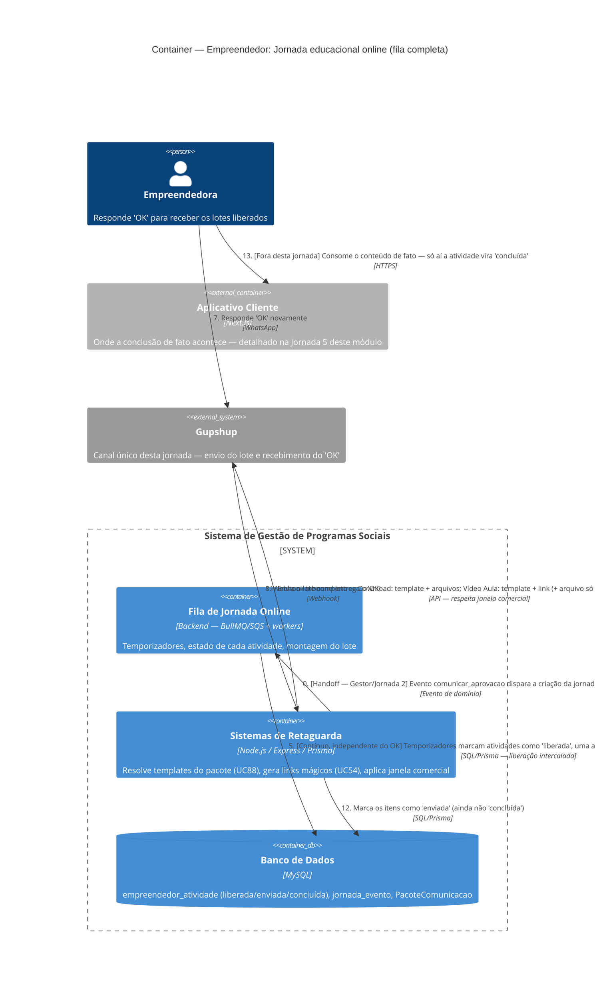

# C4 — Nível 2 (Container): Módulo Empreendedor
## Jornada 3 — Jornada educacional online: mecânica completa da fila

**UCs:** UC33 (Orquestrar Jornada Online — detalhado) → UC51 (Enviar Vídeo ou Conteúdo via WhatsApp)
**Atores:** Backend (orquestra) · Empreendedora (responde "OK") · Gestor de Turma (acompanha, não edita temporizadores)

## Objetivo deste nível

Esta é a jornada mais **referenciada e menos detalhada** de todo o conjunto de diagramas até agora — apareceu como `Container_Ext` em pelo menos três módulos diferentes (CMS, CRM, Gestor) sem nunca ser aberta. Agora detalhamos a mecânica completa: a fila de jornada no Backend, a liberação intercalada por temporizador, os dois níveis de "OK" e a diferença entre atividade **liberada**, **enviada** e **concluída** — três estados que a spec trata como distintos, mas que fácil se confundem na leitura corrida.

> **Fronteira desta jornada:** cobre do evento `comunicar_aprovacao` (UC25, já visto no Gestor/Jornada 2) até o envio do lote via WhatsApp. A **conclusão** de fato (consumo real do conteúdo) acontece no Aplicativo Cliente e é detalhada na Jornada 5 deste módulo.

## Diagrama

## Containers participantes

| Container | Tecnologia | Papel nesta jornada |
|---|---|---|
| Fila de Jornada Online | Backend — BullMQ/SQS + workers | O coração desta jornada: temporizadores, estado de cada atividade, montagem do lote |
| Sistemas de Retaguarda (Backend) | Node.js, Express, Prisma | Resolve templates, gera links mágicos, aplica a janela comercial |
| Banco de Dados | MySQL | `empreendedor_atividade`, `jornada_evento`, `PacoteComunicacao` |
| Aplicativo Cliente (referência) | Next.js | Onde a conclusão de fato acontece — fora do escopo desta jornada |
| Gupshup (externo) | — | Único canal — tanto para enviar o lote quanto para receber o "OK" |

Esta é a primeira jornada do módulo Empreendedor onde o **Backend é o protagonista**, não o Aplicativo Cliente — a empreendedora interage quase inteiramente pelo WhatsApp até o momento de efetivamente consumir o conteúdo.

## Fluxo da jornada

0. O evento `comunicar_aprovacao` (disparado na Jornada 2 do módulo Gestor) chega ao Backend.
1. A Fila de Jornada cria o registro `empreendedor_atividade` e agenda o `jornada_evento`.
2. Backend envia o primeiro template (boas-vindas), pedindo o **primeiro OK** — este é o "nível 1" do UC33: inicia a jornada.
3–4. Empreendedora responde "OK"; o webhook inbound do Gupshup entrega essa resposta ao Backend.
5. **Em paralelo e de forma contínua**, os temporizadores do módulo marcam atividades como **liberada**, uma a uma — a liberação **não espera** a atividade anterior ser concluída (liberação intercalada, "maratona" é esperado).
6. Quando há atividade(s) liberada(s) pendente(s) de envio, o Backend solicita um novo "OK", citando o título — este é o "nível 2": consentimento para receber o lote.
7–8. Empreendedora responde; webhook entrega.
9. Backend monta o lote: **todas** as atividades com status "liberada" e ainda não enviadas, filtrando por programa/edição/unidade/turma.
10. Para cada item, resolve o template do pacote de comunicação (UC88) conforme o tipo da atividade, e gera um link mágico individual (UC54).
11. Envia o lote completo via Gupshup — Download sempre leva o arquivo anexado; Vídeo Aula só leva arquivo de vídeo se a flag da edição (`disparo_auto_videoaula`) estiver ligada. Respeita a janela comercial (seg–sex 8h–20h; sáb 8h–16h; sem domingo/feriado); se falhar, reenvia após 48h.
12. Marca os itens como **enviada** — ainda não "concluída".
13. **Fora desta jornada:** só quando a empreendedora efetivamente consome o conteúdo no Aplicativo Cliente (Jornada 5) é que a atividade vira "concluída".

## Pontos de atenção para validar

| ID (sugerido) | Risco | O que verificar |
|---|---|---|
| Empr3-A | **Idempotência do webhook de "OK".** Provedores de webhook como o Gupshup costumam reenviar notificações em caso de timeout ou falha de confirmação. Se o Backend processar o mesmo "OK" duas vezes sem deduplicação (ex.: por `message_id`), pode enviar o lote **duplicado** — mensagens repetidas, custo de API em dobro, confusão para a empreendedora | Verificar se existe deduplicação por ID de mensagem do Gupshup antes de processar um "OK" |
| Empr3-B | A spec não define **o que exatamente** é reconhecido como "OK" — correspondência exata de texto, um botão de resposta rápida (quick reply), ou qualquer resposta é aceita? Se for texto livre, variações como "Ok", "blz", "sim" podem não ser reconhecidas, deixando a empreendedora "presa" sem entender por que não recebe o material | Testar respostas com variações de texto e ver quais são aceitas como "OK" válido |
| Empr3-C | A liberação intercalada é **independente** de conclusão da anterior. Se a empreendedora demorar dias para responder "OK", vários temporizadores já podem ter liberado múltiplas atividades simultaneamente. Não há menção de um limite de itens por lote — templates do WhatsApp Business (Meta) costumam ter restrições técnicas de tamanho/anexos que a spec não aborda | Testar um cenário de atraso longo na resposta do OK e verificar como o sistema lida com um lote muito grande |
| Empr3-D | Os **dois níveis de OK** (iniciar jornada vs. consentir receber um lote específico) usam a mesma palavra-chave do ponto de vista da empreendedora — não há diferenciação visível para ela entre os dois momentos, mesmo que o Backend trate como eventos distintos internamente | Confirmar se a mensagem que pede cada tipo de OK deixa claro o que está sendo solicitado, para reduzir confusão |
| Empr3-E | A flag de vídeo (`disparo_auto_videoaula`) é por **edição** (UC9), mas nem toda Vídeo Aula necessariamente tem um arquivo compatível com WhatsApp cadastrado no CMS. Se a flag estiver ON mas a atividade específica não tiver arquivo, o comportamento não é especificado — cai silenciosamente para só link, ou gera algum aviso/log? | Testar essa combinação específica (flag ON + atividade sem arquivo cadastrado) |
| Empr3-F | Retry de 48h após falha de entrega, somado à janela comercial, pode atrasar a chegada de um lote por vários dias em cenários de pico (ex.: falha numa sexta à noite + fim de semana sem disparo). O indicador de **represamento** (liberadas − concluídas) do UC56 não distingue atraso técnico de entrega de atraso comportamental da empreendedora — ela pode estar "represada" só porque a mensagem ainda não chegou, não porque está evitando o conteúdo | Verificar se o indicador de represamento considera a data de **envio efetivo** ou a data de **liberação** — isso muda a interpretação para o Gestor que decide disparar UC53 |

## Pendências para fechar este diagrama

- Nenhuma tela está envolvida diretamente nesta jornada (é majoritariamente backend/WhatsApp) — mas vale confirmar com o time técnico os nomes reais das tabelas (`empreendedor_atividade`, `jornada_evento`) e se batem com o que a spec descreve.
- **Empr3-A é a pendência mais crítica** do ponto de vista de custo operacional (mensagens WhatsApp pagas) — duplicidade por falha de idempotência pode gerar gasto real desnecessário em escala.
- Confirmar com o time se "OK" é capturado por template de resposta rápida (botão) do WhatsApp Business, o que resolveria o Empr3-B automaticamente, ou se é interpretação de texto livre.
