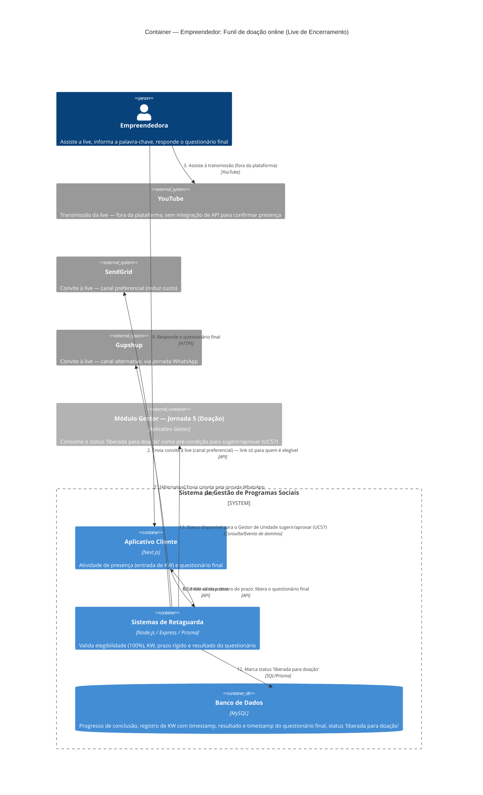

# C4 — Nível 2 (Container): Módulo Empreendedor
## Jornada 4 — Funil de doação online: live, palavra-chave e questionário final

**UC:** UC38 (recorte específico: **Live de Encerramento** — funil de doação online; a variante "Aula ao vivo" do mesmo UC, usada em presencial/híbrido, já foi referenciada no módulo Gestor e não é redetalhada aqui)
**Atores:** Empreendedora · YouTube · Backend (valida cada etapa do funil)

## Objetivo deste nível

Esta jornada fecha o segundo `Container_Ext` mais importante pendente: o **Funil de Liberação Online**, referenciado sem detalhamento na Jornada 5 do módulo Gestor (Doação). É também a jornada de **maior risco combinado** do módulo Empreendedor — porque, diferente de UC40 (presença física, onde a fragilidade de prova "só" afeta certificado), aqui a mesma classe de fragilidade de comprovação afeta diretamente a **liberação de dinheiro ou material**.

## Diagrama

## Containers participantes

| Container | Tecnologia | Papel nesta jornada |
|---|---|---|
| Aplicativo Cliente | Next.js | Atividade de entrada de KW e questionário final |
| Sistemas de Retaguarda (Backend) | Node.js, Express, Prisma | Valida cada etapa do funil — a peça central desta jornada |
| Banco de Dados | MySQL | Progresso, KW com timestamp, resultado do questionário com timestamp, status final |
| YouTube (externo) | — | Hospeda a transmissão — **sem qualquer integração de API** para confirmar presença real |
| SendGrid / Gupshup (externos) | — | Canais de convite |
| Módulo Gestor — Jornada 5 (referência) | — | Consumidor do resultado desta jornada |

> Vale notar: a produção da live em si (StreamYard + YouTube) é uma ferramenta operacional da equipe de comunicação, completamente fora da fronteira do sistema — não há integração programática com ela, só o link final do YouTube é usado.

## Fluxo da jornada

1. Backend verifica quem concluiu **100%** das atividades da edição — só essas pessoas são elegíveis a receber o convite.
2. Envia o convite preferencialmente por e-mail (reduz custo de WhatsApp), com o link da live — ou pela jornada WhatsApp, como alternativa.
3. Empreendedora assiste à transmissão no YouTube, **fora da plataforma**.
4. Após o término da live, o Backend libera a atividade de presença (entrada de palavra-chave) no Aplicativo Cliente, para **todas** as elegíveis — independente de comprovação técnica de que assistiram de fato.
5. Empreendedora informa a palavra-chave revelada no final da live.
6–7. Backend valida (com flexibilidade de caixa e acentuação) e registra a data/hora exata, dentro do prazo rígido configurado na edição (ex.: live terminou às 15h, prazo até as 16h).
8. Se a KW for válida e dentro do prazo, libera o questionário final.
9–10. Empreendedora responde; Backend recebe as respostas.
11. Só quem acerta **100%** do questionário é liberada para doação; a conclusão também tem timestamp exato registrado.
12. Backend marca o status "liberada para doação".
13. Esse status fica disponível para o Gestor de Unidade, no módulo Gestor, como pré-condição para sugerir/aprovar a doação (UC57) — fechando o `Container_Ext` que havíamos deixado em aberto.

## Pontos de atenção para validar

| ID (sugerido) | Risco | O que verificar |
|---|---|---|
| Empr4-A | **O achado mais grave desta jornada — e de boa parte do documento.** A única "prova" de que a empreendedora assistiu à live é conhecer a palavra-chave revelada nela. Não há nenhuma integração com a API do YouTube para confirmar presença real na transmissão. Isso significa que a KW pode ser **repassada** entre colegas (grupo da turma, mensagem direta) por quem assistiu para quem não assistiu — e ambas conseguiriam preencher a etapa com sucesso. É a mesma classe de fragilidade já identificada para presença física (UC40/UC67), mas aqui a consequência é **liberação de doação**, não apenas certificado — o que eleva consideravelmente a severidade | Perguntar diretamente ao time de produto se esse risco já foi considerado e aceito, ou se é uma lacuna não percebida. Um teste real seria difícil de simular sem acesso a uma live de verdade, mas vale ao menos confirmar que não existe nenhuma verificação complementar (ex.: tempo mínimo de permanência numa página de "assistindo", relatório de audiência do YouTube cruzado manualmente) |
| Empr4-B | A spec marca explicitamente como **"em discussão, não obrigatório"** a possibilidade de múltiplas palavras-chave ao longo do evento (o que mitigaria parcialmente o Empr4-A, exigindo mais de um momento de presença real). Essa é uma decisão de produto ainda aberta, não uma lacuna de implementação | Confirmar se essa decisão avançou desde a v7 da spec — resolveria parcialmente o Empr4-A se fosse adotada |
| Empr4-C | O texto "pode retentar conforme regra da edição, dentro do prazo" para o questionário final é ambíguo: a retentativa consome o **mesmo** prazo rígido pós-live (ex.: a 1h inteira), ou há uma janela própria para tentativas? Dado o público-alvo (possível baixa familiaridade digital), exigir 100% de acerto com múltiplas tentativas dentro de uma janela curta pode excluir pessoas por pressão de tempo, não por mérito | Confirmar a duração real do prazo configurado e quantas tentativas cabem nele na prática |
| Empr4-D | Reforça o Empr4-A: a spec nunca menciona nenhuma integração de API com o YouTube em nenhum lugar do documento (ele é descrito só como "ator secundário"). Isso confirma, pela ausência de evidência em contrário, que não há mecanismo técnico de verificação de audiência | Não há o que testar aqui além de confirmar a ausência — é mais uma validação de leitura do que um teste funcional |
| Empr4-E | O corte de elegibilidade é binário: **100%** das atividades, sem faixa intermediária (diferente do beneficiamento/certificação, que usam 50%/75%). Alguém com 99% fica inteiramente fora do funil daquela edição — não está claro se há uma segunda chamada/rodada para quem completa depois do convite inicial | Verificar se existe algum mecanismo de "segunda chamada" para quem atinge 100% um pouco mais tarde, ou se perder o convite inicial significa perder a doação daquela edição por completo |

## Pendências para fechar este diagrama

- Telas reais da atividade de KW e do questionário final (dentro do UC38) ainda não vistas — diagrama baseado inteiramente na spec.
- **Empr4-A é, no meu julgamento, o achado de maior severidade de todo o módulo Empreendedor até agora** — envolve liberação de recursos financeiros/materiais com um controle de identidade/presença estruturalmente fraco. Recomendo priorizar essa conversa com o time de produto antes mesmo de validar as telas.
- Confirmar o estado atual da decisão sobre múltiplas KW (Empr4-B), já que ela mitigaria diretamente o achado mais grave da jornada.
