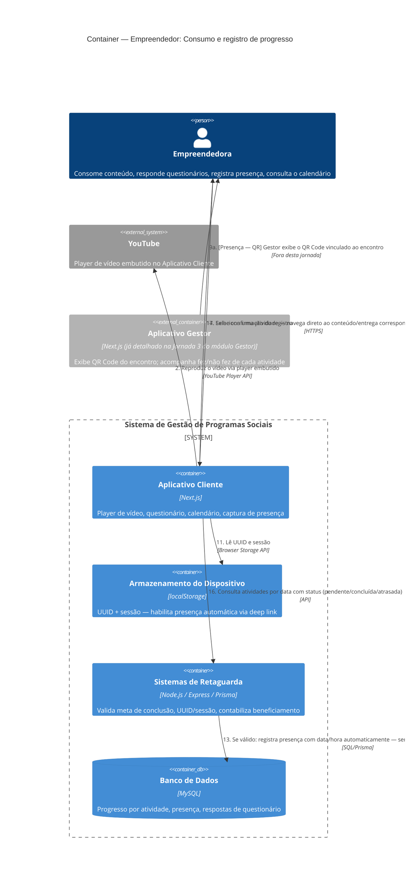

# C4 — Nível 2 (Container): Módulo Empreendedor
## Jornada 5 — Consumo e registro de progresso (online e presencial/híbrido)

**UCs:** UC36 (Consumir Conteúdo) → UC37 (Progresso em Videoaula) → UC39 (Responder Questionário) → UC40 (Presença via QR/Deep Link) → UC68 (Calendário de Atividades)
**Atores:** Empreendedora (opera tudo) · YouTube · Backend (valida e contabiliza)

## Objetivo deste nível

Esta é a operação **diária** da empreendedora — o espelho, do lado dela, do que já vimos do lado do Gestor na Jornada 3 (liberação e acompanhamento). Reúne quatro tipos de interação num único diagrama porque todas compartilham os mesmos containers e o mesmo padrão: consumir, o sistema registrar, e contabilizar para beneficiamento. A jornada também **reconfirma, com mais precisão**, um risco que já apareceu de formas diferentes em módulos anteriores — a fragilidade da prova de presença — e revela uma conexão nova com o funil de doação (Jornada 4) que só aparece ao examinar o mecanismo de feedback do questionário de perto.

## Diagrama

## Containers participantes

| Container | Tecnologia | Papel nesta jornada |
|---|---|---|
| Aplicativo Cliente | Next.js | Player de vídeo, questionário, calendário, captura de presença |
| Armazenamento do Dispositivo | localStorage | Habilita a presença automática por deep link, sem novo login |
| Sistemas de Retaguarda (Backend) | Node.js, Express, Prisma | Valida metas, sessão, contabiliza beneficiamento |
| Banco de Dados | MySQL | Progresso, presença, respostas |
| YouTube (externo) | — | Player de vídeo embutido |
| Aplicativo Gestor (referência) | — | Já detalhado na Jornada 3 do módulo Gestor — aqui só aparece como origem do QR Code |

## Fluxo da jornada

**Vídeo Aula (UC36/UC37)**
1–2. Empreendedora abre a atividade; o Cliente reproduz o vídeo via player do YouTube embutido.
3. O Cliente reporta o percentual assistido continuamente ao Backend.
4. Ao atingir a meta (padrão 80%), o Backend marca a atividade como concluída, registra presença/acesso e contabiliza para beneficiamento.

**Questionário (UC39)**
5–6. Empreendedora abre a atividade e responde questão a questão, recebendo feedback explicativo logo após cada resposta.
7–8. Ao confirmar o envio, o Backend marca como concluída e contabiliza.

**Presença (UC40)**
9a–10a. **Via QR:** o Gestor exibe o código vinculado ao encontro (fora desta jornada); a empreendedora escaneia.
10b. **Via deep link:** a empreendedora abre o link recebido por qualquer canal.
11–12. O Cliente lê o UUID e a sessão salvos, e o Backend valida o vínculo com a turma.
13. Se tudo válido, o Backend registra a presença automaticamente — **sem exigir qualquer prova de localização física**, apenas a posse do link/QR e uma sessão autenticada.
14. Exibe confirmação.

**Calendário (UC68)**
15–17. Empreendedora acessa o calendário, vê o status de cada atividade (pendente/concluída/atrasada) e navega direto ao conteúdo.

## Pontos de atenção para validar

| ID (sugerido) | Risco | O que verificar |
|---|---|---|
| Empr5-A | O percentual assistido (meta de 80%) depende de um tracking contínuo do player (passo 3). Se a empreendedora pausa, fecha a aba e volta depois, o sistema precisa **acumular** o progresso corretamente, não resetar ou contar tempo parado como assistido | Testar: assistir 40%, fechar a aba, reabrir e assistir mais 40% — verificar se o total soma 80% corretamente, sem duplicar nem perder o que já foi visto |
| Empr5-B | Para o tipo **Download**, o critério de conclusão ("baixou/marcou") não é tão claro quanto o percentual de vídeo — é o clique de download que conta, ou é preciso uma ação explícita de "marcar como usado"? | Testar o fluxo de Download e confirmar o gatilho exato que marca a atividade como concluída |
| Empr5-C | **Reconfirma, do lado da empreendedora, um risco já identificado em outras jornadas** (Gestor/PH1, Gestor/PH3-B): a presença por deep link não exige nenhuma prova de localização física (geolocalização, por exemplo) — só a posse do link/QR e uma sessão válida. Uma pessoa pode registrar presença de qualquer lugar, desde que tenha o link | Já registrado como achado recorrente; não é um teste novo, mas vale ter em mente que esse padrão se repete em toda interação de presença do sistema |
| Empr5-D | O calendário (UC68) exibe status "atrasada" para atividades pendentes — mas em edições **online**, a própria spec define que atraso não penaliza e que "maratonar" é um comportamento saudável esperado. Rotular como "atrasada" algo que o sistema trata como normal em outro lugar pode gerar ansiedade desnecessária na empreendedora, contradizendo a filosofia do produto | Confirmar se o rótulo de status muda conforme a modalidade (ex.: "pendente" no online, "atrasada" só no P/H onde realmente há prazo com peso) |
| Empr5-E | **Conexão nova com a Jornada 4 (funil de doação).** O questionário dá "feedback explicativo imediato após cada resposta" — mas o Questionário Final do funil de doação exige **100% de acerto**. Se o feedback por pergunta já revela acerto/erro em tempo real (mesmo sem nota agregada), a empreendedora pode, na prática, corrigir e tentar de novo pergunta a pergunta até acertar tudo — o que é bem diferente de uma avaliação única no final. Isso se conecta diretamente ao Empr4-C (ambiguidade sobre o que "retentar" significa no funil de doação) | Confirmar se o Questionário Final do UC38 usa o **mesmo** mecanismo de feedback imediato do UC39 genérico, ou se tem um comportamento próprio (só avalia no envio completo, sem dica por pergunta) — isso muda substancialmente a integridade do critério de 100% |

## Pendências para fechar este diagrama

- Telas reais de UC36, UC37, UC39, UC40 e UC68 ainda não vistas — diagrama baseado inteiramente na spec.
- **Empr5-E é a pendência mais importante** — ela pode reclassificar a severidade do achado mais grave do módulo (Empr4-A, funil de doação), se o mecanismo de feedback imediato também se aplicar ao questionário final que libera dinheiro/material.
- Confirmar o mecanismo técnico exato de tracking de vídeo (Empr5-A) — relevante também para o Nível 3 (Componente) do Aplicativo Cliente.
