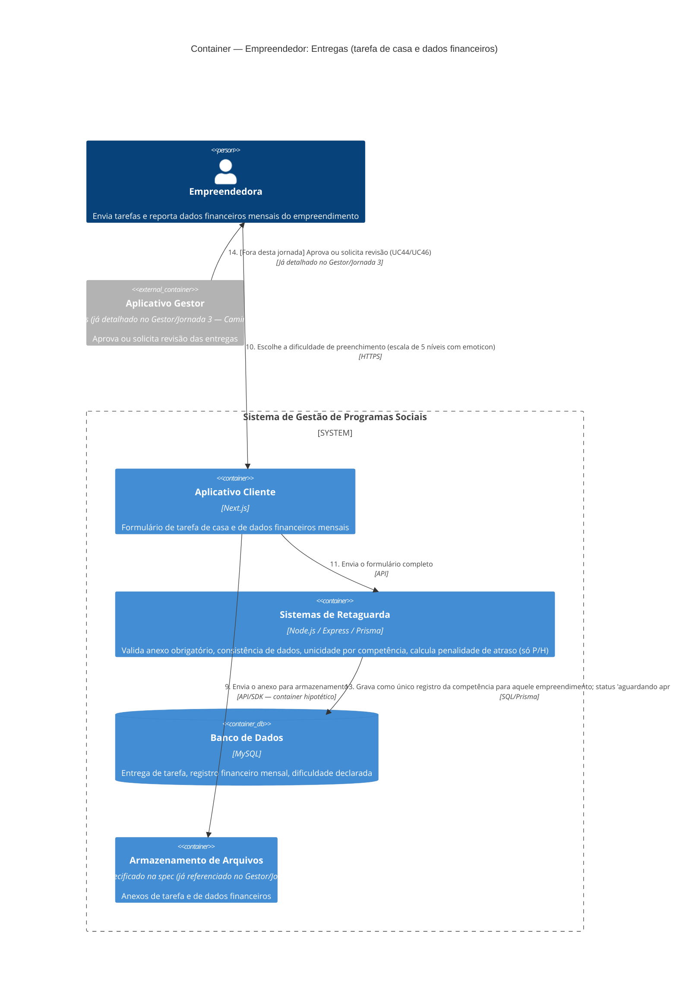

# C4 — Nível 2 (Container): Módulo Empreendedor
## Jornada 6 — Entregas: tarefa de casa e dados financeiros

**UCs:** UC43 (Enviar Tarefa de Casa) → UC45 (Enviar Registro de Dados Financeiros Mensais)
**Atores:** Empreendedora (envia) · Gestor de Turma (recebe e aprova — já detalhado no Gestor/Jornada 3, Caminho B)

## Objetivo deste nível

Esta jornada é o espelho, do lado da empreendedora, do **Caminho B** que já vimos na Jornada 3 do módulo Gestor (onde detalhamos a aprovação). Aqui abrimos o lado do envio. É também a segunda e terceira vez, depois da Jornada 8 do Gestor (Mentoria), que esbarramos na mesma lacuna de infraestrutura: **upload de arquivo sem container de armazenamento definido na spec**.

## Diagrama

## Containers participantes

| Container | Tecnologia | Papel nesta jornada |
|---|---|---|
| Aplicativo Cliente | Next.js | Formulário de tarefa de casa e de dados financeiros |
| Sistemas de Retaguarda (Backend) | Node.js, Express, Prisma | Validações de consistência, unicidade, penalidade de atraso |
| Banco de Dados | MySQL | Entregas, registros financeiros, dificuldade |
| Armazenamento de Arquivos | **Não especificado na spec** | Segunda e terceira instância concreta da mesma lacuna já identificada no Gestor/Jornada 8 |
| Aplicativo Gestor (referência) | — | Aprovação, já detalhada no Gestor/Jornada 3 |

## Fluxo da jornada

**Tarefa de Casa (UC43)**
1. Empreendedora acessa a atividade liberada; título, descrição, dica e anexos de referência vêm pré-carregados do CMS (ela só lê, não edita essa parte).
2. Elabora o material do empreendimento e faz upload de um ou mais arquivos, com descrição opcional.
3–4. Confirma o envio.
5. Se a edição for presencial/híbrida e o envio for fora do prazo, o Backend marca como "entrega atrasada" (peso menor no engajamento, mas **não** impede beneficiamento). Se online, marca apenas "realizado", sem qualquer penalidade de prazo. Em ambos os casos, o status final é "aguardando aprovação".

**Dados Financeiros Mensais (UC45)**
6–8. Empreendedora acessa o formulário mensal, preenche os sete campos financeiros e anexa um documento obrigatório.
9. Arquivo vai para armazenamento.
10. Escolhe a dificuldade de preenchimento numa escala visual de 5 níveis.
11–12. Envia o formulário; o Backend valida consistência (ex.: renda não pode ultrapassar faturamento) e a presença do anexo — sem anexo, o envio é bloqueado.
13. Grava como o **único** registro daquela competência para aquele empreendimento (mesmo com múltiplas sócias).

**Aprovação (fora desta jornada)**
14. O Gestor de Turma aprova ou solicita revisão — mecânica já detalhada na Jornada 3 do módulo Gestor.

## Pontos de atenção para validar

| ID (sugerido) | Risco | O que verificar |
|---|---|---|
| Empr6-A | A validação "renda ≤ faturamento" pode gerar **falso bloqueio**: se "renda pessoal" incluir fontes externas ao negócio (ajuda de terceiros, benefício social), é perfeitamente possível a renda pessoal ser maior que o faturamento do negócio naquele mês, sem que isso seja um erro de preenchimento | Testar um cenário legítimo de renda pessoal > faturamento e ver se o sistema bloqueia incorretamente, ou se a mensagem de erro deixa claro o que fazer nesse caso |
| Empr6-B | "Um único registro por competência e empreendimento, mesmo com N sócios" — mas **qualquer** sócia pode preencher? Se duas tentarem preencher o mesmo mês quase simultaneamente, o sistema bloqueia avisando que já existe um registro, ou a segunda tentativa sobrescreve silenciosamente a primeira? | Testar duas sócias do mesmo empreendimento preenchendo o mesmo mês em sequência rápida |
| Empr6-C | Reforça a lacuna já registrada no Gestor/Jornada 8: não há especificação de formato ou tamanho máximo de arquivo aceito para os anexos (foto, print, planilha) — relevante tanto para a experiência da empreendedora (erro genérico vs. orientação clara) quanto para o dimensionamento do armazenamento | Testar upload de arquivo muito grande, formato incomum, e ver a mensagem de erro |
| Empr6-D | A spec tem duas regras parecidas: "mês sem movimento: permite registro zerado com justificativa" e "zero em faturamento ou renda: observação/justificativa obrigatória". Não está claro se são a mesma regra escrita duas vezes, ou se há uma distinção real (ex.: a primeira é sobre o mês inteiro, a segunda sobre um campo específico zerado mesmo com outros preenchidos) | Testar um mês com faturamento zero mas outros campos preenchidos, e comparar com um mês totalmente sem movimento — ver se o comportamento (e a mensagem) é diferente |
| Empr6-E | Quando o Gestor solicita revisão (UC46), a empreendedora "reavalia e reenvia" — mas não há menção de um canal para ela **contestar** a revisão, caso discorde (ache que preencheu corretamente). O único caminho documentado é reenviar, não discutir | Confirmar se existe algum campo de resposta/comentário da empreendedora na revisão, ou se a única opção é reenviar o formulário do zero |
| Empr6-F | A própria spec marca a seção de "saúde financeira" (Entradas/Saídas/Renda) como **rascunho**, aguardando uma planilha de referência ainda não entregue — não é uma lacuna de implementação, é um requisito declaradamente incompleto | Confirmar se essa planilha de referência já chegou e se a tela de UC45 deve ser revista antes de validarmos as telas reais |

## Pendências para fechar este diagrama

- Telas reais de UC43 e UC45 ainda não vistas — diagrama baseado inteiramente na spec.
- **Empr6-C consolida, com uma terceira ocorrência, a pendência de armazenamento de arquivos** — recomendo tratar isso como um item único e transversal (Gestor/Jornada 8 + esta jornada, duas vezes) numa única conversa técnica, em vez de resolver isoladamente em cada lugar onde aparece.
- Confirmar o estado atual da planilha de referência de saúde financeira (Empr6-F) antes de validar as telas de UC45.
