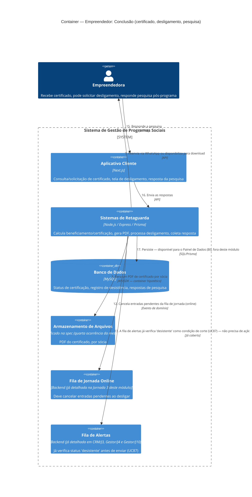

# C4 — Nível 2 (Container): Módulo Empreendedor
## Jornada 7 — Conclusão: certificado, desligamento e pesquisa pós-programa

**UCs:** UC55 (Emitir Certificado Automaticamente) → UC63 (Consultar/Solicitar Certificado) · UC79 (Solicitar Desligamento) · UC82 (resposta à Pesquisa Pós-Programa)
**Atores:** Empreendedora · Backend (emite, remove das automações) · Gestor de Turma (exceções)

## Objetivo deste nível

Jornada de fechamento do módulo Empreendedor — reúne três desfechos possíveis (certificação, desligamento, resposta à pesquisa de longo prazo) que, juntos, encerram o ciclo de vida operacional da empreendedora numa edição. Também fecha a última ponta do **UC82**, uma pendência que identificamos lá na análise inicial da Fase 1: criação no CMS, disparo no Gestor, resposta aqui, visualização no BI. E traz à tona, pela **quarta vez**, a mesma lacuna de armazenamento de arquivos.

## Diagrama

## Containers participantes

| Container | Tecnologia | Papel nesta jornada |
|---|---|---|
| Aplicativo Cliente | Next.js | Três telas: certificado, desligamento, pesquisa |
| Sistemas de Retaguarda (Backend) | Node.js, Express, Prisma | Cálculo, geração de PDF, processamento de desligamento, coleta de pesquisa |
| Banco de Dados | MySQL | Status, desistência, respostas |
| Armazenamento de Arquivos | **Não especificado — quarta ocorrência** | PDF do certificado |
| Fila de Jornada Online (referência) | — | Precisa cancelar pendências ao desligar |
| Fila de Alertas (referência) | — | Já cobre "desistente" como corte de envio, segundo a própria spec do UC87 |

## Fluxo da jornada

**Certificação (UC55, automático)**
1–2. Backend calcula o percentual de atividades realizadas no empreendimento; ao atingir beneficiamento/certificação, atualiza o status do empreendimento **e de cada sócia** vinculada.
3–4. Gera um PDF por sócia e envia via WhatsApp.

**Reenvio sob demanda (UC63)**
5–7. Empreendedora solicita reenvio; Backend localiza o certificado já emitido e reenvia (WhatsApp ou download).

**Desligamento (UC79)**
8–9. A qualquer momento, a empreendedora acessa a opção de desligamento, responde um questionário simples e informa a razão (campo aberto).
10–11. Confirma; Backend registra a solicitação e aciona o registro de desistência (UC30), com data.
12. Cancela as entradas pendentes na fila de jornada online.
13. A fila de alertas já verifica o status "desistente" como condição de corte antes de cada envio — comportamento já coberto na jornada onde detalhamos o UC87.

**Pesquisa pós-programa (UC82 — resposta)**
14–16. Empreendedora acessa o link mágico da pesquisa (disparada pelo Gestor, criada pelo CMS — módulos já vistos) e responde.
17. Backend persiste; os resultados ficam disponíveis para o módulo BI.

## Pontos de atenção para validar

| ID (sugerido) | Risco | O que verificar |
|---|---|---|
| Empr7-A | **O achado mais importante desta jornada, do ponto de vista arquitetural.** O texto genérico "remove a participante das automações/jornadas" (UC79/UC30) precisa, na prática, tocar **duas filas distintas** que mapeamos separadamente ao longo deste trabalho: a fila de jornada (UC33) e a fila de alertas (UC87/52). A spec do UC87 já prevê o corte por "desistente" como condição de `exitWhen` — então essa parte está coberta. Mas a fila de jornada (UC33) precisa de uma verificação equivalente, e isso não foi explicitado da mesma forma | Testar: desligar uma empreendedora com temporizadores pendentes na fila de jornada online e confirmar que ela realmente para de receber as próximas liberações, não só os alertas de risco |
| Empr7-B | **Quarta ocorrência da mesma lacuna de armazenamento de arquivos** (depois de Mentoria, Tarefa de Casa e Dados Financeiros) — agora para o PDF do certificado, que tem characteristics diferentes (gerado pelo sistema, não enviado pela usuária, mas ainda precisa de um lugar para existir antes do envio via WhatsApp) | Mesma recomendação das vezes anteriores: tratar como item único transversal na conversa técnica |
| Empr7-C | UC63 lista o **Chat IA como ator opcional** no reenvio de certificado — sugere que o Agente de IA (UC64, ainda não detalhado) pode processar esse pedido via conversa, não só por um botão dedicado. Isso antecipa uma pergunta para a próxima (e última) jornada deste módulo | Ao desenhar a Jornada 8 (Chat de IA), confirmar se o reenvio de certificado é de fato uma das capacidades do agente, ou se a menção na spec é só uma possibilidade futura |
| Empr7-D | Desligamento "a qualquer momento" não é cruzado, na spec, com uma doação **já aprovada mas ainda não finalizada** (UC57 aprovado, mas UC86 — dados bancários/recibo — ainda pendente). O que acontece se a empreendedora desistir do programa nesse meio-tempo? A doação continua, é cancelada, ou fica num limbo? | Confirmar com o time de produto o tratamento desse cruzamento — é um cenário financeiramente sensível que a spec não cobre |
| Empr7-E | O link mágico de resposta à pesquisa (UC82) é enviado para uma edição que, por definição, já **encerrou** (freeze operacional — UC81). Não está claro se a sessão/UUID da empreendedora ainda funciona normalmente para uma edição congelada, ou se há algum comportamento especial | Testar o acesso ao link de pesquisa de uma edição já em freeze |
| Empr7-F | A spec menciona genericamente que o "Gestor de Turma" trata **exceções** da emissão automática de certificado (UC55), sem especificar quais situações seriam essas (sócia removida depois do cálculo? erro de dado que invalida o PDF gerado?) | Perguntar ao time de produto quais cenários de exceção são esperados aqui, já que isso decide se é preciso uma tela de correção manual |

## Revalidação com a stack (out/2026)

| Camada | Status |
| --- | --- |
| Backend | Parcial — certificates stub, withdrawal |
| Frontend | Parcial — portfolio UI; sem UC82/ PDF auto |

Matriz consolidada e IDs compartilhados (**X-01…X-10**, **CTX-***, **CRM**): [../../../REVALIDACAO-MATRIZ.md](../../../REVALIDACAO-MATRIZ.md)

> Diagrama C4 acima = **spec de produto**; esta seção = **as-is homolog** nos repos EWTI-BR (out/2026).

## Pendências para fechar este diagrama

- Telas reais de UC55 (do lado do Cliente — a notificação/recebimento), UC63, UC79 e UC82 (resposta) ainda não vistas — diagrama baseado inteiramente na spec.
- **Empr7-A é a pendência mais relevante** — é um teste de integração que cruza exatamente as duas filas que tratamos com cuidado como entidades distintas ao longo de todo este trabalho (desde o CMS/Jornada 3). Vale testar as duas junto, não cada uma isoladamente.
- Confirmar o cruzamento entre desligamento e doação em andamento (Empr7-D) — é um ponto financeiramente sensível não coberto pela spec.

## Nota de fechamento do módulo Empreendedor (operação)

Com esta jornada, cobrimos o ciclo completo da empreendedora: inscrição (J1) → autenticação (J2) → jornada online (J3) → funil de doação (J4) → consumo diário (J5) → entregas (J6) → conclusão (J7). Resta apenas a **Jornada 8** (Chat de Dúvidas / Agente de IA), que é a mais isolada e a única que depende de uma decisão arquitetural ainda não discutida: o Agente de IA é um serviço de terceiros (ex.: API de LLM externa) ou um componente interno do Backend?
