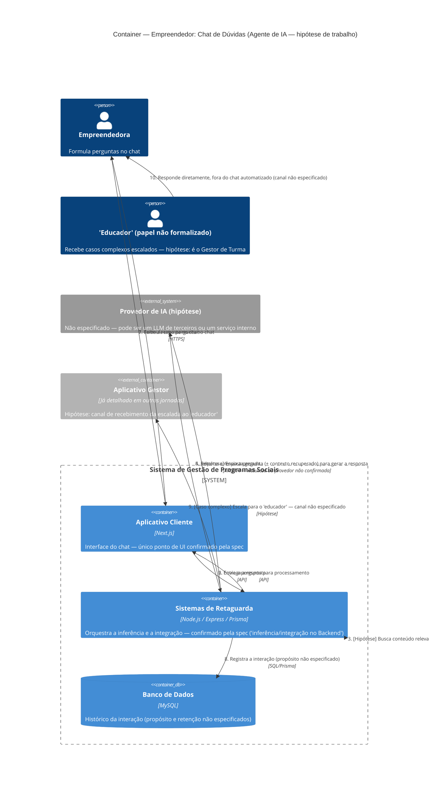

# C4 — Nível 2 (Container): Módulo Empreendedor
## Jornada 8 — Chat de Dúvidas (Agente de IA)

**UC:** UC64 (Utilizar Chat de Dúvidas — Agente de IA)
**Atores:** Empreendedora · Agente de IA · "Educador" (escalonamento — termo não formalizado em nenhum outro UC)

## Objetivo deste nível

Última jornada do módulo Empreendedor, e uma das mais especulativas de todo o conjunto de diagramas — no mesmo patamar de incerteza da Jornada 5 do CMS (Autenticação) e da Jornada 9 do Gestor (Multi-unidade). A spec dedica a este UC apenas um parágrafo curto, sem detalhar a tecnologia por trás do "Agente de IA", nem como ele acessa "conteúdos internos", nem quem exatamente é o "educador" para quem casos complexos são escalados — um termo que **não aparece em nenhum outro lugar** nos 88 casos de uso como papel formal.

## Diagrama

## Containers participantes (hipotéticos, exceto os dois confirmados)

| Container | Confirmado pela spec? | Papel nesta jornada |
|---|---|---|
| Aplicativo Cliente | **Sim** — "Ownership de UI = Cliente" | Interface do chat |
| Sistemas de Retaguarda (Backend) | **Sim** — "inferência/integração no Backend quando aplicável" | Processa a pergunta, decide se escala |
| Banco de Dados | Hipótese | Histórico da interação |
| Provedor de IA | **Hipótese — pergunta central em aberto** | Gera a resposta — natureza desconhecida |
| Aplicativo Gestor (referência) | Hipótese | Possível canal de escalonamento |

Dos cinco elementos do diagrama, **apenas dois** têm respaldo textual direto na spec. Todo o resto é inferência razoável, não confirmação.

## A pergunta central: que tipo de "Agente de IA" é este?

| Hipótese | Implicação arquitetural | Implicação de risco |
|---|---|---|
| **A — LLM de terceiros** (ex.: OpenAI, Anthropic, Azure OpenAI) | Backend chama uma API externa, enviando a pergunta da empreendedora (e possivelmente contexto pessoal) | Dados pessoais — e potencialmente dados sensíveis (raça, religião, deficiência, finanças) — trafegando para fora do perímetro do sistema. Exige avaliação de conformidade LGPD específica para esse fluxo, que não existe em nenhum outro lugar da spec |
| **B — Serviço interno** (modelo hospedado pela própria infraestrutura, ex.: na AWS) | Sem saída de dados para terceiro, mas exige infraestrutura de ML própria, não mencionada em nenhum lugar do documento (nem nas 5 camadas, nem na stack contratual) | Menor risco de LGPD, mas levanta a pergunta de por que a stack contratual (Next.js, Node, Express, Prisma, MySQL, AWS) não menciona nenhum componente de IA/ML |

A spec não dá elementos suficientes para decidir entre as duas — e a stack contratual documentada no início do projeto **não cita nenhum serviço de IA**, o que é um indício (fraco) a favor da Hipótese A, já que normalmente uma solução interna apareceria na lista de tecnologias contratadas.

## Pontos de atenção para validar

| ID (sugerido) | Risco | O que verificar |
|---|---|---|
| Empr8-A | **A pergunta mais fundamental desta jornada.** Qual das duas hipóteses é a correta? Isso decide se há ou não um fluxo de dados pessoais/sensíveis saindo do sistema para um terceiro — um risco de conformidade que nenhuma outra parte da spec trata | Perguntar diretamente ao time técnico; se for a Hipótese A, pedir o nome do provedor e os termos de tratamento de dados contratados com ele |
| Empr8-B | "Treinado em conteúdos internos" não especifica o mecanismo: é uma busca em tempo real sobre os módulos/FAQ/regulamento (RAG), um modelo ajustado periodicamente (fine-tuning), ou uma base estática que pode ficar desatualizada sem ninguém perceber? | Confirmar o mecanismo e, se for RAG, qual conteúdo exatamente está indexado — módulos (UC15)? FAQ (não modelada em nenhum outro UC)? Regulamento (UC12)? |
| Empr8-C | O termo **"educador"** não aparece como papel formal em nenhum dos outros 87 casos de uso — só Gestor de Unidade e Gestor de Turma existem como papéis operacionais. Pode ser um sinônimo informal de Gestor de Turma, ou um papel adicional não modelado (ex.: suporte humano dedicado, separado da operação de turma) | Confirmar com o time de produto quem exatamente recebe a escalada, e por qual canal — isso decide se um novo container (ex.: fila de suporte) precisa ser modelado |
| Empr8-D | **Risco de maior severidade desta jornada, condicionado à Hipótese A.** Se o provedor de IA for externo e não houver nenhuma camada de anonimização antes de enviar a pergunta, uma empreendedora pode, sem perceber, enviar dados sensíveis (sobre sua situação de saúde, violência doméstica, dados financeiros) para um serviço de terceiro, sem o mesmo nível de proteção que a spec garante para o CPF (hash+pepper) em outras partes do sistema | Se a Hipótese A se confirmar, verificar se existe qualquer filtro ou anonimização antes do envio ao provedor externo |
| Empr8-E | "Interação registrada" (pós-condição) não especifica propósito nem prazo de retenção. Diferente de outros registros do sistema (que têm regras claras de retenção, como a anonimização de 5 anos do UC76), o histórico de chat pode conter informações sensíveis sem nenhuma política de descarte definida | Confirmar se o histórico de chat está sujeito à mesma política de anonimização/retenção do UC76, ou se é tratado separadamente (e, se sim, com que regra) |
| Empr8-F | Não há menção de **moderação ou guardrails** contra uso indevido — esta é a única interface de texto livre de todo o sistema, o que a torna estruturalmente diferente de formulários com campos fechados | Confirmar se existe qualquer camada de moderação de conteúdo, tanto para proteger a empreendedora (respostas inadequadas) quanto o sistema (tentativas de manipulação do agente) |

## Pendências para fechar este diagrama

- **Esta é a jornada com menor respaldo textual de todo o módulo Empreendedor** — a spec dedica a ela um parágrafo, contra páginas inteiras de outros UCs como UC21 ou UC33.
- **Empr8-A e Empr8-D precisam de resposta antes de qualquer lançamento** — não é uma questão de teste funcional, é uma questão de avaliação de conformidade que pode exigir revisão jurídica, dado o perfil de dados sensíveis que o público-alvo deste sistema frequentemente compartilha.
- Recomendo que esta jornada seja a primeira prioridade de esclarecimento direto com o time técnico, acima até de validação de tela — sem saber a natureza do "Agente de IA", qualquer teste funcional corre o risco de validar a interface sem jamais tocar no risco real, que está na camada de dados por trás dela.

## Nota de fechamento do módulo Empreendedor (completo)

Com esta jornada, concluímos as 8 jornadas do módulo Empreendedor: inscrição e UUID (J1), login e sessão (J2), fila de jornada online (J3), funil de doação (J4), consumo e progresso (J5), entregas (J6), conclusão (J7) e chat de IA (J8). Entre os quatro módulos documentados até agora (CMS, CRM, Gestor, Empreendedor), o padrão mais recorrente que atravessa todos eles é a mesma lacuna de infraestrutura de armazenamento de arquivos (quatro ocorrências) e o mesmo tipo de fragilidade de prova de identidade/presença associada ao link mágico (recorrente desde a Fase 1). Resta o módulo **BI (Painel de Dados)** para fechar o conjunto completo de diagramas de Nível 2.
