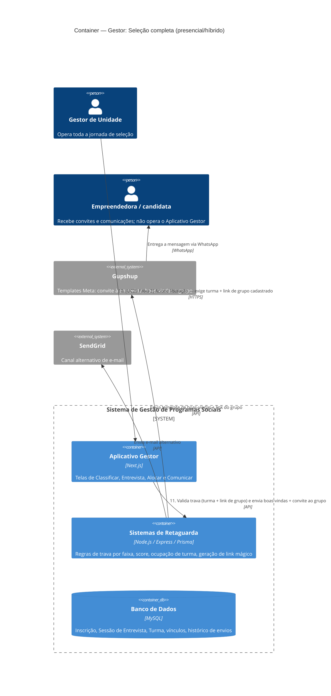

# C4 — Nível 2 (Container): Módulo Gestor
## Jornada 1 — Seleção completa (presencial/híbrido)

**UCs:** UC24 (Classificar) → UC84 (Entrevista de Seleção) → UC17 (Alocar em Turma) → UC25 (Comunicar Resultado — acionado duas vezes)
**Atores:** Gestor de Unidade (único que opera toda a jornada) · Empreendedora/candidata (recebe as comunicações)

## Objetivo deste nível

A jornada de seleção mais longa do sistema, e a primeira do módulo Gestor. Um detalhe que só aparece ao desenhar o fluxo de ponta a ponta — e que não estava explícito lendo os UCs isoladamente: **o UC25 é acionado duas vezes** nesta jornada, com travas diferentes (Faixa 1 — convite à entrevista; Faixa 2 — liberação), e entre as etapas 6 e 8 existe uma **dependência manual fora do sistema** (criação do grupo WhatsApp) que pode travar silenciosamente todo um lote de aprovadas.

## Diagrama

## Containers participantes

| Container | Tecnologia | Papel nesta jornada |
|---|---|---|
| Aplicativo Gestor | Next.js | As quatro telas da jornada: Classificar, Entrevista, Alocar, Comunicar |
| Sistemas de Retaguarda (Backend) | Node.js, Express, Prisma | Aplica as travas de cada faixa do UC25, calcula ocupação, gera link mágico de convite |
| Banco de Dados | MySQL | Inscrição/classificação, sessões de entrevista, vínculo de turma, histórico de envios |
| Gupshup (externo) | — | Canal principal das duas comunicações (convite e liberação) |
| SendGrid (externo) | — | Canal alternativo de e-mail |

Não há container novo nesta jornada em relação aos já vistos (Gupshup/SendGrid já apareceram no CRM) — a novidade é o **Aplicativo Gestor** operando de fato, pela primeira vez neste conjunto de diagramas.

## Fluxo da jornada

1. Gestor de Unidade **classifica** as inscrições (qualificado / em análise / não qualificado) — etapa 1, apoiada pelo score (UC23), decisão humana.
2. Backend persiste a classificação. **Não** envia mensagem nem aloca turma nesta etapa.
3. Gestor cria sessão(ões) de entrevista e agenda as candidatas qualificadas (UC84, parte 1).
4. Gestor aciona **Comunicar — Faixa 1** (convite à entrevista). Backend valida que a candidata está agendada numa sessão (trava) e envia o convite via Gupshup e/ou SendGrid.
5. No dia da entrevista, Gestor marca presença/ausência e decide **Aprovar** ou **Não aprovar** quem compareceu. Ausente vira automaticamente "não aprovada", salvo realocação imediata para outra sessão.
6. Backend persiste a decisão.
7. Gestor aloca as aprovadas nas turmas da unidade (UC17) — turma única é automática; várias turmas exigem alocação manual com painel de ocupação.
8. Backend persiste o vínculo e valida ocupação (alerta soft, sem trava rígida).
9. **Fora do sistema:** a gestora cria manualmente o grupo no WhatsApp, adiciona o número institucional como admin e cadastra o link na turma (UC16). Este passo é um pré-requisito do próximo, mas não é uma tela do Aplicativo Gestor com validação proativa.
10. Gestor aciona **Comunicar — Faixa 2** (liberação). Backend valida a trava (turma **e** link de grupo cadastrado).
11. Backend envia boas-vindas + convite ao grupo via Gupshup. A partir daqui, a jornada educacional do módulo Empreendedor pode começar (UC33, se online — mas esta jornada é P/H, então o próximo evento é a candidata entrar no grupo).

> **Faixa 3 (não qualificada/não aprovada)** pode ser acionada em paralelo, tanto depois do passo 2 (não qualificadas) quanto depois do passo 6 (não aprovadas/ausentes) — não é um passo sequencial único, por isso não está numerado na linha principal.

## Pontos de atenção para validar

| ID (sugerido) | Risco | O que verificar |
|---|---|---|
| GestorPH1-A | **Risco mais relevante desta jornada.** O passo 9 é manual e fora do sistema — se a gestora aprovar e alocar um lote grande de candidatas (passos 5–8) e esquecer de criar o grupo/cadastrar o link, a Faixa 2 fica bloqueada para **todo o lote**, sem nenhum lembrete proativo do sistema | Verificar se existe algum alerta ("X turmas aprovadas sem link de grupo há Y dias") ou se o gestor só descobre o bloqueio ao tentar comunicar |
| GestorPH1-B | Ausência automática vira "não aprovada" — a janela para realocar "antes do fechamento da ausência" não tem prazo definido na spec. Se o gestor perceber o engano depois desse fechamento, a candidata já pode ter recebido a Faixa 3 (mensagem de não aprovação) | Testar: marcar ausência, aguardar, tentar realocar depois — ver até quando o sistema permite reverter sem enviar mensagem incorreta |
| GestorPH1-C | Entre classificar (passo 1), aprovar (passo 5), alocar (passo 7) e comunicar (passo 10) existem **três decisões manuais independentes**, cada uma podendo ficar parada por dias. Durante esse tempo, o status interno da candidata ("aprovada") não reflete nenhuma comunicação real — ela não sabe que foi aprovada até a Faixa 2 ser disparada | Confirmar se há algum indicador para o gestor de "aprovadas há mais de N dias sem liberação" — isso evita aprovadas esquecidas no limbo |
| GestorPH1-D | Capacidade de turma é **soft** (alerta, sem trava rígida — UC17). Em múltiplas rodadas de qualificação (repescagem), o alerta pode ser ignorado repetidamente até a turma ficar bem acima da capacidade real (física, no caso de encontros presenciais) | Testar alocação sucessiva acima da capacidade em mais de uma rodada e ver se o alerta se torna mais incisivo ou continua igual |
| GestorPH1-E | Rodadas/repescagem (UC24 permite qualificar novas candidatas após um ciclo já ter avançado) — não está claro se a interface diferencia visualmente "candidatas da rodada 1" das "da rodada 2" nas mesmas listas de classificar/entrevistar/alocar | Verificar se há algum filtro ou agrupamento por rodada, ou se tudo cai na mesma lista sem distinção |

## Revalidação com a stack (out/2026)

| Camada | Status |
| --- | --- |
| Backend | Parcial — inscritos, entrevistas, POST .../comunicacoes, class-assignments |
| Frontend | Parcial — `selecao`, `comunicar-selecao`, `alocar`; mocks + **X-04** BFF Gupshup |

Matriz consolidada e IDs compartilhados (**X-01…X-10**, **CTX-***, **CRM**): [../../../REVALIDACAO-MATRIZ.md](../../../REVALIDACAO-MATRIZ.md)

> Diagrama C4 acima = **spec de produto**; esta seção = **as-is homolog** nos repos EWTI-BR (out/2026).

## Pendências para fechar este diagrama

- Telas reais de UC24, UC84, UC17 e UC25 ainda não vistas — diagrama baseado inteiramente na spec.
- Confirmar se o "grupo WhatsApp criado manualmente" (passo 9) tem algum mecanismo de lembrete/alerta no CMS de Alertas (UC87) — seria um `triggerKind` natural (ex.: "aprovadas sem grupo cadastrado há X dias"), mas não consta no catálogo atual (`inscription_incomplete`, `activity_deadline_soon`, `backlog_liberated`, `edition_ending_pending`, `risk_short_online`, `checkpoint_midcourse`).
- Confirmar o prazo real (se houver) para reverter uma ausência automática antes do "fechamento" mencionado na spec (GestorPH1-B).
