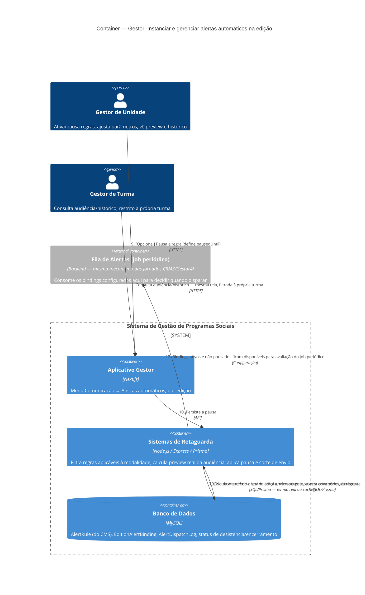

# C4 — Nível 2 (Container): Módulo Gestor
## Jornada 10 — Instanciar e gerenciar alertas automáticos na edição

**UC:** UC87 (Configurar e Orquestrar Alertas Automáticos — recorte específico: lado Gestor, `EditionAlertBinding`)
**Atores:** Gestor de Unidade (ativa/pausa/ajusta) · Gestor de Turma (consulta, escopo restrito à própria turma)

## Objetivo deste nível

Esta jornada já apareceu, em parte, dentro da **Jornada 4** (passos 5b–9b), mas documentamos separadamente para fechar com precisão um ponto que lá ficou só esboçado: como o Gestor de Unidade **liga, ajusta e pausa** as regras de alerta — criadas no CMS (módulo CMS, Jornada 3) — para uma edição específica, e o que exatamente o Gestor de Turma enxerga disso. É também onde aparece, pela primeira vez de forma explícita, uma lacuna de conformidade que vale registrar com destaque: a spec menciona "opt-out" como condição que corta o envio, mas **não existe nenhum caso de uso dedicado** a como a pessoa solicita esse opt-out.

## Diagrama

## Containers participantes

| Container | Tecnologia | Papel nesta jornada |
|---|---|---|
| Aplicativo Gestor | Next.js | Tela de Alertas automáticos por edição — única tela desta jornada, com dois escopos (Unidade: gerencia; Turma: só consulta) |
| Sistemas de Retaguarda (Backend) | Node.js, Express, Prisma | Filtra regras por modalidade, calcula preview, aplica pausa e os três cortes de envio (opt-out, desistência, encerramento) |
| Banco de Dados | MySQL | `AlertRule` (origem no CMS), `EditionAlertBinding`, `AlertDispatchLog`, status de desistência/encerramento |
| Fila de Alertas (referência) | Backend — job periódico | O mesmo mecanismo já visto nas Jornadas 3 do CRM e 4 do Gestor — aqui aparece só como consumidor dos bindings configurados |

Não há sistema externo nesta jornada especificamente — o envio de fato (Gupshup/SendGrid) acontece na execução pelo job periódico, já documentada nas jornadas anteriores.

## Fluxo da jornada

1. Gestor de Unidade abre **Comunicação → Alertas automáticos** dentro de uma edição específica.
2. Sistema lista as regras (`AlertRule`) já criadas no CMS que são **aplicáveis à modalidade** daquela edição (online ou presencial/híbrido).
3. Backend consulta quais regras já têm binding configurado para esta edição e quais ainda não.
4. Gestor liga ou desliga cada regra individualmente, e pode ajustar parâmetros específicos (ex.: mudar o padrão de "2 dias" para "3 dias") e cadência.
5. Backend persiste o `EditionAlertBinding` — a combinação de regra + edição + eventuais overrides.
6. Gestor solicita o **preview da audiência atual** — quantas pessoas seriam alcançadas se a regra disparasse agora.
7. Backend calcula essa audiência contra os dados reais da edição (diferente da simulação do CMS, que acontece no momento de criar a regra, sem uma edição real ainda vinculada).
8. Gestor consulta o histórico de disparos já realizados (`AlertDispatchLog`).
9. Opcionalmente, pausa a regra, definindo `pausedUntil`.
10. Backend persiste a pausa.
11. Gestor de Turma acessa a mesma tela, mas só consulta audiência e histórico — restrito à própria turma, sem poder ativar, pausar ou ajustar parâmetros.
12. A partir daqui, o job periódico da fila de alertas passa a considerar os bindings ativos e não pausados desta edição.
13. No momento de cada disparo, o Backend verifica três condições de corte: a pessoa está em **opt-out**, está **desistente** (UC30) ou a **edição está encerrada** (UC81) — qualquer uma delas interrompe o envio.

## Pontos de atenção para validar

| ID (sugerido) | Risco | O que verificar |
|---|---|---|
| Gestor10-A | O **preview de audiência** aqui (passo 6–7) é diferente da "simulação" que já vimos no CMS (Jornada 3, UC87-A) — lá a simulação acontecia na criação da regra, possivelmente contra dados hipotéticos ou de uma edição de teste; aqui é contra a edição **real, em andamento**. Não está claro se são o mesmo cálculo reaproveitado ou duas implementações distintas — e se o preview é tempo real ou cacheado (afeta a confiança do gestor na decisão de ativar/pausar) | Comparar o número do preview com uma contagem manual na mesma hora; testar se o número muda imediatamente após uma mudança de estado relevante (ex.: alguém completa a atividade-gatilho) |
| Gestor10-B | Pausar a regra (`pausedUntil`) impede **novos cálculos** de elegibilidade a partir daquele momento, mas não está claro o que acontece com mensagens **já enfileiradas** antes da pausa — elas são canceladas junto, ou saem mesmo assim? | Testar: deixar uma mensagem na fila (ex.: fora da janela comercial, aguardando o próximo slot) e pausar a regra nesse intervalo — ver se ela ainda sai |
| Gestor10-C | Override de parâmetros por edição (passo 4–5) não menciona log de auditoria (quem mudou "2 dias" para "3 dias", quando) — isso afeta diretamente quantas pessoas recebem (ou deixam de receber) mensagem, então é uma mudança com impacto operacional real | Verificar se existe histórico de alterações do binding, não só do disparo |
| Gestor10-D | A tabela de papéis diz que o Gestor de Turma "consulta audiência/histórico da própria turma" — mas a regra e o binding são por **edição**, não por turma. Não está claro como o sistema filtra "audiência da própria turma" dentro de uma regra configurada no nível da edição inteira | Verificar se a tela de consulta do Gestor de Turma realmente filtra por turma, ou se mostra o todo da edição (o que seria uma brecha de escopo) |
| Gestor10-E | O mecanismo de anti-spam "no máximo um alerta prioritário por pessoa por janela configurável" não deixa claro **onde** essa janela é configurada — é um parâmetro global (CMS), ou faz parte do binding desta tela? | Procurar esse parâmetro em ambas as telas (CMS e aqui) |
| Gestor10-F | **O achado mais relevante desta jornada, e um dos mais relevantes do documento até agora.** O corte de envio por "opt-out" (passo 13) pressupõe que existe uma forma de a pessoa solicitar não receber mais alertas — mas **nenhum dos 88 casos de uso da spec v7 descreve esse mecanismo**. Diferente de "desistência do programa" (UC30/UC79, que tira a pessoa de tudo) ou "aceite de comunicação" (UC20, que é dado uma vez, no início), não há um UC de "cancelar inscrição em comunicações" equivalente a um unsubscribe | Confirmar se esse opt-out existe em algum lugar não documentado, ou se é uma lacuna real de conformidade — isso é relevante para LGPD e para as políticas anti-spam do WhatsApp Business (Meta pode penalizar números com muitas reclamações de spam sem mecanismo de opt-out) |

## Pendências para fechar este diagrama

- Tela real de UC87 (lado Gestor) ainda não vista — diagrama baseado na spec.
- **Gestor10-F precisa de resposta antes de qualquer lançamento em produção** — não é só uma lacuna de UX, é um risco de conformidade (LGPD) e de relacionamento com a Meta (qualidade do número WhatsApp Business pode cair se usuárias não tiverem como parar de receber mensagens e reportarem como spam).
- Confirmar se o preview de audiência (Gestor10-A) é o mesmo motor de cálculo usado na simulação do CMS, ou uma implementação paralela — relevante para o Nível 3 (Componente) do Backend.

## Nota de fechamento do ciclo de alertas

Com esta jornada, fechamos o ciclo completo do mecanismo de alertas automáticos que vínhamos construindo desde o início:

1. **CMS (Jornada 3):** a regra nasce — `AlertRule`, templates, parâmetros.
2. **CRM (Jornada 3):** a regra executa para **leads** incompletas (`inscription_incomplete`).
3. **Gestor (Jornada 4):** a regra executa para **empreendedoras já na jornada** (`risk_short_online`, `checkpoint_midcourse`, etc.).
4. **Gestor (Jornada 10 — esta):** o Gestor de Unidade decide **quando e para qual edição** cada regra vale, e tem a última palavra para pausá-la.

As pendências que atravessam as quatro jornadas (mesmo job periódico? mesmo log de disparo entre manual e automático? opt-out inexistente?) valem uma conversa única e consolidada com o time técnico, em vez de quatro conversas fragmentadas.
