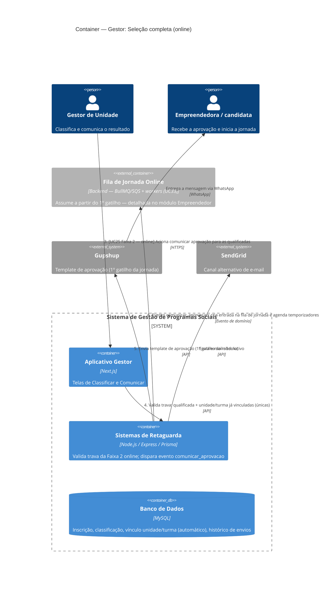

# C4 — Nível 2 (Container): Módulo Gestor
## Jornada 2 — Seleção completa (online)

**UCs:** UC24 (Classificar) → UC25 (Comunicar Resultado — Faixa 2, sem entrevista) → gatilho inicial de UC33 (fila de jornada)
**Atores:** Gestor de Unidade (opera) · Empreendedora/candidata (recebe)

## Objetivo deste nível

Jornada bem mais curta que a presencial/híbrido (Jornada 1): sem entrevista (UC84) e, tipicamente, sem alocação manual de turma (UC17), porque a modalidade online costuma ter unidade e turma únicas, já vinculadas desde a inscrição. O valor desta jornada está no **fim**: é aqui que o Gestor, com uma única ação, aciona pela primeira vez a **fila de jornada online** (UC33) — que até agora só existia como configuração (pacote de comunicação, módulos, temporizadores) nos diagramas do CMS.

> **Fronteira com o módulo Empreendedor:** esta jornada termina no momento em que o Backend recebe o evento `comunicar_aprovacao` e envia a primeira mensagem. A mecânica completa da fila (temporizadores, "OK", envio em lote) pertence à operação contínua do módulo Empreendedor e será detalhada lá — aqui ela aparece só como destino do gatilho.

## Diagrama

## Containers participantes

| Container | Tecnologia | Papel nesta jornada |
|---|---|---|
| Aplicativo Gestor | Next.js | Telas de Classificar e Comunicar (mesma do UC24/UC25 da Jornada 1, caminho mais curto) |
| Sistemas de Retaguarda (Backend) | Node.js, Express, Prisma | Valida a trava específica do caminho online e dispara o evento que inicia a fila de jornada |
| Banco de Dados | MySQL | Classificação e vínculo unidade/turma (herdado automaticamente da inscrição, UC21) |
| Fila de Jornada Online (referência) | Backend — BullMQ/SQS | Não detalhada aqui — assume a partir do gatilho; aparecerá como diagrama próprio no módulo Empreendedor |
| Gupshup / SendGrid (externos) | — | Entrega da mensagem de aprovação |

## Fluxo da jornada

1. Gestor de Unidade classifica as inscrições (qualificado / em análise / não qualificado) — mesma etapa 1 da Jornada 1, mas aqui **sem** a etapa de entrevista que segue no P/H.
2. Backend persiste a classificação.
3. Gestor aciona **Comunicar — Faixa 2 (caminho online)**. Diferente da Jornada 1, não existe Faixa 1 (convite à entrevista) no online.
4. Backend valida a trava específica: a candidata precisa estar **qualificada** e já ter unidade/turma vinculadas — o que, no cenário típico (unidade e turma únicas), já aconteceu automaticamente na inscrição (UC21), sem passar por UC17.
5. Backend envia o template de aprovação via Gupshup (e/ou e-mail via SendGrid).
6. O mesmo evento (`comunicar_aprovacao`) que dispara a mensagem também aciona o **1º gatilho** da fila de jornada (UC33) — a partir daqui, o Backend assume a orquestração automática, fora do escopo desta jornada.

> **Faixa 3 (não qualificada)** segue o mesmo padrão da Jornada 1 — pode ser acionada após o passo 2, em paralelo, para quem não seguiu adiante.

## Pontos de atenção para validar

| ID (sugerido) | Risco | O que verificar |
|---|---|---|
| GestorOnline2-A | A spec prevê fallback manual (`wa.me` individual) "se a candidata não puder receber template via API", mas não especifica **quais condições** disparam esse fallback (opt-out? número inválido? qualidade do template rebaixada pela Meta?) | Confirmar com o time técnico quais erros da API Gupshup acionam a necessidade de fallback manual, e se o Gestor é avisado automaticamente ou precisa perceber sozinho que o envio falhou |
| GestorOnline2-B | A spec assume, no caminho online, unidade e turma **únicas** como cenário típico — mas não descarta explicitamente uma edição online com múltiplas turmas. Se isso existir, UC17 (alocação manual) precisaria rodar antes do passo 3, mas a trava da Faixa 2 online (passo 4) não menciona essa possibilidade | Confirmar se o sistema sequer permite criar uma edição online com mais de uma turma, ou se essa combinação é tecnicamente possível e mal coberta pela spec |
| GestorOnline2-C | **Risco mais relevante desta jornada.** Entre o envio da mensagem (passo 5) e a criação da entrada na fila de jornada (passo 6), a spec não garante que as duas ações sejam atômicas. Se o Backend enviar a mensagem de aprovação e falhar ao criar a entrada na fila logo em seguida, a candidata recebe "você foi aprovada" mas a jornada nunca é agendada — um desencontro entre comunicação e estado real do sistema | Testar cenário de falha entre os passos 5 e 6 (se possível simular) e verificar se existe mecanismo de reconciliação/retry, ou se o dado fica inconsistente sem alerta |

## Pendências para fechar este diagrama

- Telas reais de UC24 e UC25 (caminho online) ainda não vistas — diagrama baseado na spec.
- Confirmar se existe alguma garantia transacional (ou fila com reprocessamento) entre o disparo da mensagem e a criação da entrada da fila de jornada (GestorOnline2-C) — isso é mais uma questão de Nível 3 (Componente) do Backend, mas vale registrar aqui como gatilho da investigação.
- Confirmar se a combinação "edição online + múltiplas turmas" é suportada pelo sistema ou é uma configuração que a spec simplesmente não antecipou (GestorOnline2-B).
