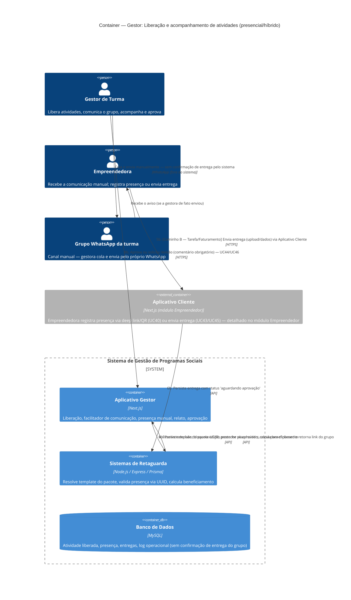

# C4 — Nível 2 (Container): Módulo Gestor
## Jornada 3 — Liberação e acompanhamento de atividades (presencial/híbrido)

**UCs:** UC34 (Visão por Módulo e Liberação) → UC50 (Comunicar para Grupo) → **Caminho A:** UC40/UC41 (Presença) + UC80 (Relato) · **Caminho B:** UC43/UC45 (Entrega, no Cliente) → UC44/UC46 (Aprovar)
**Atores:** Gestor de Turma (opera) · Empreendedora (recebe comunicação, registra presença ou envia entrega — via Aplicativo Cliente)

## Objetivo deste nível

Esta é a operação **diária** do Gestor de Turma — o UC mais usado do sistema no dia a dia. Diferente de UC49/UC33 (que chamam a API do Gupshup), o **UC50 aqui não dispara nenhuma API de mensageria**: o sistema só resolve o template e abre o link do grupo; o envio real acontece no WhatsApp pessoal/corporativo da gestora, fora do sistema. Depois da liberação, a jornada se bifurca conforme o tipo de atividade: uma **Aula presencial** segue para registro de presença e relato; uma **Tarefa/Faturamento** segue para envio pela empreendedora (no Aplicativo Cliente) e aprovação pelo gestor.

## Diagrama

## Containers participantes

| Container | Tecnologia | Papel nesta jornada |
|---|---|---|
| Aplicativo Gestor | Next.js | Liberação, facilitador de comunicação (gera texto/link, não envia), presença manual, relato, aprovação |
| Sistemas de Retaguarda (Backend) | Node.js, Express, Prisma | Resolve template (sem chamar API externa em UC50), valida presença, calcula beneficiamento |
| Banco de Dados | MySQL | Atividade, presença, entregas, log operacional |
| Aplicativo Cliente (referência) | Next.js | Onde a empreendedora efetivamente registra presença (UC40) ou envia a entrega (UC43/UC45) — módulo Empreendedor |
| Grupo WhatsApp da turma | — (canal manual, fora do sistema) | Destino da comunicação — **sem** integração de API nesta UC, diferente de UC33/UC49 |

**Nenhum sistema externo (Gupshup/SendGrid) participa desta jornada** — esta é a primeira jornada do módulo Gestor sem chamada de API de mensageria, o que é uma distinção arquitetural relevante do UC50 em relação a tudo que vimos até agora.

## Fluxo da jornada

**Liberação e comunicação (comum a todos os tipos)**
1. Gestor de Turma abre a turma, expande o módulo, seleciona a atividade e preenche a configuração do tipo (data, local ou link, prazo).
2. Backend persiste a liberação.
3. Opcionalmente, aciona "Comunicar para Grupo" (UC50).
4. Backend resolve o template do pacote de comunicação (UC88) para aquele tipo de atividade, preenche os placeholders e devolve o texto pronto + link do grupo. O Aplicativo Gestor copia para a área de transferência e abre o link.
5. A gestora cola e envia **manualmente**, no WhatsApp dela (pessoal ou corporativo) — o sistema não confirma se o envio de fato aconteceu.

**Caminho A — Aula presencial**
5a. No dia, a empreendedora acessa o deep link ou QR Code e tem a presença registrada automaticamente (UC40, módulo Empreendedor) — ou o gestor registra manualmente (UC41), se não houver QR disponível.
6a. Backend persiste a presença.
7a. Gestor registra o relato do encontro e pode exportar a lista de presença (UC80).

**Caminho B — Tarefa de Casa / Registro de Faturamento**
5b. Empreendedora envia a entrega pelo Aplicativo Cliente (upload ou dados financeiros).
6b. Backend persiste com status "aguardando aprovação".
7b–8b. Gestor abre a entrega no detalhe da atividade e decide: **aprovar** ou **solicitar revisão** (comentário obrigatório — nunca reprovar).
9b. Backend persiste a decisão; se aprovado, bloqueia edição posterior pela empreendedora e contabiliza para beneficiamento.

## Pontos de atenção para validar

| ID (sugerido) | Risco | O que verificar |
|---|---|---|
| GestorPH3-A | **Risco mais relevante desta jornada.** O UC50 não tem confirmação de entrega — o log registra que o texto foi gerado/copiado, não que foi de fato colado e enviado no grupo. Uma gestora pode copiar o texto, ser interrompida, e nunca enviar — o sistema não tem como saber e não alerta ninguém | Verificar se existe qualquer heurística de acompanhamento (ex.: "liberada há X dias sem nenhuma interação da turma") que sirva de sinal indireto de que a comunicação nunca saiu |
| GestorPH3-B | Presença pode ser registrada por **dois caminhos simultâneos** (QR automático da empreendedora e manual pelo gestor). Não está claro se há proteção contra registro duplicado quando ambos tentam marcar a mesma presença | Testar: empreendedora registra via QR e, momentos depois, o gestor tenta marcar manualmente a mesma pessoa — ver se o sistema bloqueia, sobrescreve ou duplica |
| GestorPH3-C | "Cancelar liberação" só é permitido se não houver chamada nem entregas — mas não está claro se **ter comunicado o grupo** (passo 3–5, sem nenhuma presença ainda) já conta como estado irreversível, ou só presença/entrega bloqueiam o cancelamento | Testar: liberar, comunicar (sem registrar presença), tentar cancelar — ver se é permitido |
| GestorPH3-D | Retificação de aprovação (desfazer) tem "prazo configurável ou por Gestor de Unidade", sem valor numérico definido na spec. Se não houver configuração, a retificação fica indisponível para sempre, ou disponível para sempre — ambos os extremos são plausíveis e têm implicações diferentes | Confirmar o valor padrão (se houver) e se a ausência de configuração é tratada como "sempre permitido" ou "nunca permitido" |
| GestorPH3-E | Penalidade de engajamento por entrega atrasada (P/H) — "pontuação menor" — não há fórmula ou valor documentado. Pode ser um campo manual que o gestor preenche subjetivamente, ou um cálculo automático | Confirmar se existe um valor/fórmula visível na tela, ou se é um conceito ainda não implementado |

## Pendências para fechar este diagrama

- Telas reais de UC34, UC50, UC41, UC80, UC44 e UC46 ainda não vistas — diagrama baseado inteiramente na spec.
- Confirmar que o UC50 realmente não possui **nenhuma** integração de API (nem para registrar confirmação de envio) — se houver qualquer webhook ou confirmação futura, isso mudaria o diagrama.
- Confirmar o mecanismo exato de idempotência entre presença automática (QR/deep link) e presença manual (GestorPH3-B) — possivelmente mais um item de Nível 3 (Componente) do que deste nível.
