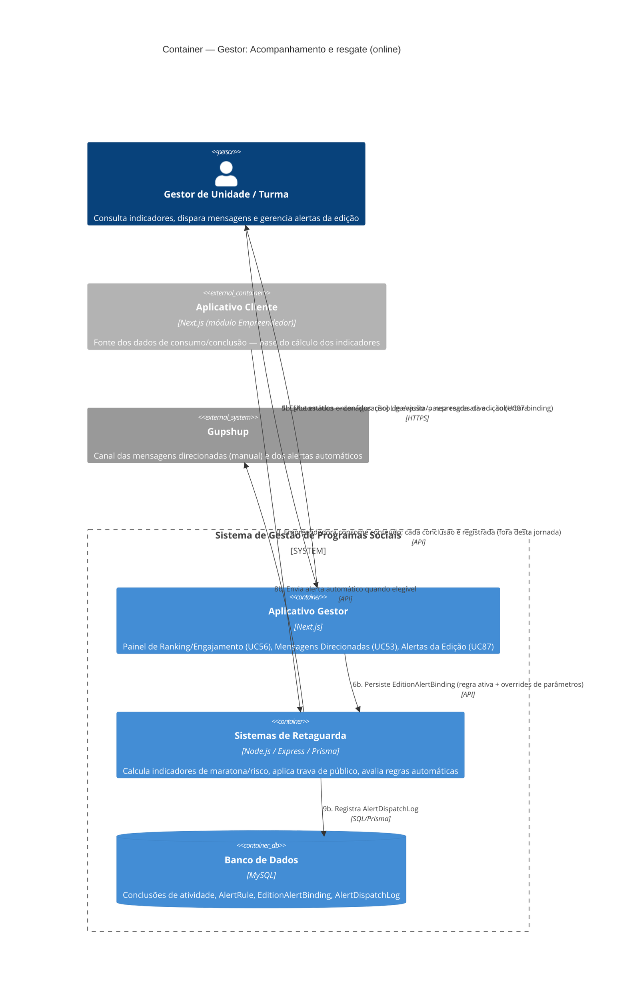

# C4 — Nível 2 (Container): Módulo Gestor
## Jornada 4 — Acompanhamento e resgate (online)

**UCs:** UC56 (Ranking e Engajamento) → UC53 (Disparar mensagens direcionadas) + UC87 (Instanciar/pausar alertas na edição — lado Gestor)
**Atores:** Gestor de Unidade, Gestor de Turma

## Objetivo deste nível

Esta jornada fecha um ciclo que vínhamos construindo desde o módulo CMS: a regra de alerta nasce no CMS (configuração), é **ligada a uma edição específica** aqui (UC87, lado Gestor — `EditionAlertBinding`), e passa a disparar automaticamente para **empreendedoras já na jornada** — diferente da Jornada 3 do CRM, que tratava leads ainda não inscritas. Em paralelo, o Gestor tem um canal **manual** (UC53) para reforçar o reengajamento, usando o mesmo painel de indicadores (UC56) como fonte de decisão.

> Esta é, estruturalmente, a mesma classe de arquitetura da Jornada 3 do CRM (automático + manual convergindo nos mesmos canais), só que aplicada a um público diferente (empreendedoras ativas, não leads) e com uma terceira peça nova: o **painel de indicadores** (UC56) que alimenta a decisão de quem contatar.

## Diagrama

## Containers participantes

| Container | Tecnologia | Papel nesta jornada |
|---|---|---|
| Aplicativo Gestor | Next.js | Três telas: Ranking/Engajamento, Mensagens Direcionadas, Alertas da Edição |
| Sistemas de Retaguarda (Backend) | Node.js, Express, Prisma | Calcula indicadores, valida público-alvo, avalia regras automáticas (mesmo job periódico da CRM/Jornada 3, agora com outros `triggerKind`) |
| Banco de Dados | MySQL | Conclusões de atividade (fonte dos indicadores), `AlertRule`/`EditionAlertBinding`/`AlertDispatchLog` (mesmas tabelas da Jornada 3 do CRM) |
| Aplicativo Cliente (referência) | Next.js | Fonte primária dos dados — toda conclusão de atividade que alimenta os indicadores acontece lá, fora desta jornada |
| Gupshup (externo) | — | Canal único desta jornada (a spec não menciona SendGrid para UC53; e-mail pode entrar via UC87 dependendo da configuração) |

## Fluxo da jornada

**Consulta e decisão**
1. Gestor abre o painel de Ranking/Engajamento (UC56).
2. Backend calcula os indicadores de maratona: cobertura da edição, aderência ao liberado, represamento, silêncio, burst de maratona.
3. Esses cálculos usam as conclusões de atividade registradas pela empreendedora no Aplicativo Cliente (consumo oficial na plataforma — não o "OK" do WhatsApp).
4. Painel exibe os estados ordenados: **risco de evasão** primeiro, depois **represada ativa**, depois cobertura geral.

**Caminho manual — UC53**
5a. No estado "risco", o Gestor aciona Mensagens Direcionadas, escolhendo o público (atividade não feita / risco de evasão / check-point ~15 dias).
6a. Backend valida o público e monta o envio com o template adequado.
7a. Envia via Gupshup.
8a. Registra o disparo; se for o público de check-point e a pendência-alvo for concluída, desbloqueia o material extra configurado.

**Caminho automático — UC87 (binding)**
5b. Em paralelo (não sequencial à consulta), o Gestor de Unidade liga, ajusta ou pausa as regras de alerta aplicáveis à modalidade online daquela edição.
6b. Backend persiste o `EditionAlertBinding` (regra + eventuais overrides de parâmetros/cadência).
7b. O mesmo job periódico que já vimos na Jornada 3 do CRM avalia esses bindings — agora para `triggerKind` como `risk_short_online`, `checkpoint_midcourse`, `backlog_liberated`, `activity_deadline_soon`.
8b–9b. Envia e registra o alerta automaticamente, quando elegível.

## Pontos de atenção para validar

| ID (sugerido) | Risco | O que verificar |
|---|---|---|
| GestorOnline4-A | Mesmo padrão de risco já identificado na Jornada 3 do CRM (CRM3-B): os caminhos manual (UC53) e automático (UC87) usam o mesmo log de disparo? Uma empreendedora em risco pode receber a mensagem automática **e** a manual do gestor no mesmo dia | Testar sobreposição entre os dois canais para a mesma pessoa, no mesmo dia |
| GestorOnline4-B | A spec é explícita: "represada ativa **não** entra no público de risco" (UC53). Mas o painel (UC56) exibe os dois estados lado a lado. Se a interface não separar claramente os filtros, o gestor pode selecionar manualmente uma lista que misture risco com represada ativa por engano | Verificar na tela se há alguma forma de selecionar "represada ativa" dentro do filtro de risco do UC53 — deveria ser estruturalmente impossível, não apenas orientação textual |
| GestorOnline4-C | O "gatilho de recompensa" do check-point depende de identificar "a pendência-alvo concluída" — se a empreendedora tiver várias atividades pendentes ao mesmo tempo, não está claro qual conclusão especificamente dispara o desbloqueio do material extra | Testar com múltiplas pendências simultâneas e verificar qual ação dispara o desbloqueio |
| GestorOnline4-D | `EditionAlertBinding` permite *override* de parâmetros por edição sobre a regra global do CMS. Ao decidir reforçar manualmente (UC53), o Gestor enxerga qual valor está **realmente em vigor** (o global ou o override), ou precisa adivinhar/consultar duas telas diferentes? | Verificar se a tela de Mensagens Direcionadas (UC53) mostra o estado atual da regra automática equivalente, para evitar decisão manual às cegas |
| GestorOnline4-E | Os indicadores (cobertura, represamento, silêncio) dependem de "consumo oficial na plataforma" — se o cálculo for via job periódico (não em tempo real), pode haver atraso entre a ação da empreendedora e o painel refletir isso, levando o gestor a agir (ou deixar de agir) com base em dado desatualizado | Confirmar a frequência de atualização do painel: tempo real, ou mesmo job de 15–30min citado no UC87? |

## Pendências para fechar este diagrama

- Telas reais de UC56, UC53 e UC87 (lado Gestor) ainda não vistas — diagrama baseado na spec.
- Confirmar se este é **literalmente o mesmo job periódico** que avalia alertas de lead incompleta (CRM/Jornada 3) e de risco de evasão online (esta jornada), ou se são dois processos separados — isso é relevante para dimensionar carga e para o Nível 3 (Componente) do Backend.
- Confirmar a frequência real de atualização dos indicadores de UC56 (GestorOnline4-E).
