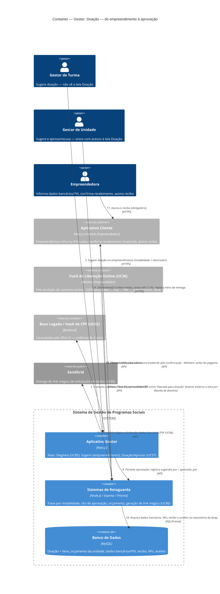

# C4 — Nível 2 (Container): Módulo Gestor
## Jornada 5 — Doação: do empreendimento à aprovação

**UCs:** UC85 (Selecionar Elegíveis — auxiliar) → UC57 (Solicitar e Aprovar Doação) → UC86 (Dados Bancários/PIX, Recibo e Aceites)
**Atores:** Gestor de Turma (sugere) · Gestor de Unidade (sugere e aprova) · Empreendedora (recebe, informa dados, assina)

## Objetivo deste nível

A jornada de **maior risco financeiro e de auditoria** do sistema — por isso foi priorizada desde o início da validação. Diferente das jornadas anteriores, aqui não estamos só descobrindo GAPs novos: esta jornada **formaliza e verifica** hipóteses levantadas na primeira leitura da spec v7, antes mesmo de começarmos os diagramas C4. Uma delas se confirma como **inconsistência real no próprio texto da spec**, não como suposição.

## Diagrama

## Containers participantes

| Container | Tecnologia | Papel nesta jornada |
|---|---|---|
| Aplicativo Gestor | Next.js | Elegíveis (UC85), Sugerir (no empreendimento), Doação/Aprovar (UC57), conferência de NFs (UC86) |
| Sistemas de Retaguarda (Backend) | Node.js, Express, Prisma | Trava por modalidade, rito de aprovação (digitação "APROVAR"), orçamento, geração de link mágico |
| Banco de Dados | MySQL | Doação + itens, orçamento, dados bancários/PIX, recibo, NFs, aceites |
| Aplicativo Cliente (referência) | Next.js | Onde a empreendedora efetivamente informa dados, confirma e assina |
| Funil de Liberação Online — UC38 (referência) | — | Pré-condição externa a esta jornada, para o caminho online |
| Base Legada / Hash CPF — UC62 (referência) | — | Consultada para o filtro de carência (D) |
| SendGrid (externo) | — | Entrega do link mágico de UC86 |

## Fluxo da jornada

1. **(Opcional)** Gestor de Unidade monta um lote de elegíveis com os filtros auxiliares A–D (UC85), em especial D (carência de 3 anos), consultando a base legada por hash de CPF.
2. No caminho **online**, o empreendimento só entra como candidato depois que o funil UC38 (módulo Empreendedor) o marca como "liberada para doação" — evento externo a esta jornada.
3. Gestor de Turma **ou** Gestor de Unidade **sugere** a doação no empreendimento: modalidade (dinheiro/material), um ou mais itens com valor.
4. Backend valida a trava por modalidade: presencial/híbrido permite a qualquer momento; online exige liberação pelo funil.
5. Doação é persistida como **sugerida** — ainda não consome o orçamento da unidade.
6. Gestor de Unidade acessa a tela **Doação** (`/gestor/e/[edicaoId]/doacao`) — única com visão de aprovação — e revisa sugeridas junto ao saldo de orçamento.
7. Confirma a aprovação digitando **"APROVAR"** (exato, maiúsculas) — individualmente ou em lote (doação em massa).
8. Backend persiste a aprovação, registrando separadamente quem sugeriu e quem aprovou (mesmo quando é a mesma pessoa).
9. Orçamento da unidade é consumido; status "recebeu doação" pode ser refletido nas sócias do empreendimento.
10. Empreendedora é notificada no app: aguarde, sem data prometida de pagamento/entrega.
11. Backend envia link mágico (e/ou e-mail) solicitando dados bancários/PIX.
12. Empreendedora informa os dados — nome e CPF em modo leitura; se a chave PIX for o CPF, o campo fica imutável (antifraude).
13. Dados são persistidos.
14. **Se material:** Gestor anexa uma ou mais NFs e registra os itens exatos entregues.
15. **Se material:** Empreendedora confirma o recebimento.
16. Backend libera o recibo para assinatura — material após a confirmação; dinheiro antes do pagamento.
17. Empreendedora assina o recibo (obrigatório para fechamento contábil).
18. Todos os documentos (dados bancários, NFs, recibo, aceites) ficam arquivados no repositório da doação, para auditoria.

## Pontos de atenção — hipóteses da leitura inicial, agora verificadas contra o fluxo completo

Estas três hipóteses foram levantadas **antes** de qualquer diagrama C4, na primeira leitura da spec v7. Desenhar o fluxo de ponta a ponta permite confirmar com mais precisão o que cada uma representa:

| ID | Hipótese original | Status após desenhar o fluxo completo |
|---|---|---|
| **Gestor5-A** (hipótese nº 5, parte 1) | "UC57: a mesma pessoa pode sugerir e aprovar" | **Confirmado como decisão explícita da spec**, não omissão: o texto diz literalmente "quando o mesmo Unidade sugere, a aprovação permanece passo distinto (auditoria: sugerido_por/aprovado_por)". Tecnicamente há trilha de auditoria — mas do ponto de vista de **segregação de funções** (controle interno clássico para aprovação de valores), a mesma pessoa decidir sozinha "o quê" e "quanto" doar, e depois aprovar a própria sugestão, é um risco de controle que a auditoria por log não elimina sozinha. **Decisão de negócio/compliance**, não bug de sistema. |
| **Gestor5-B** (hipótese nº 5, parte 2) | "Pré-condição online tem uma exceção que contradiz o bloqueio do fluxo" | **Confirmado como inconsistência real no texto da spec.** Em **Pré-condições**, UC57 diz: *"Online: status liberada para doação (UC38) — **ou filtro auxiliar permitindo a operação**"*. Em **Fluxos Alternativos**, o mesmo UC57 diz: *"Online sem liberação UC38: sistema **bloqueia** sugerir/aprovar até o funil ser concluído com sucesso"*. As duas frases se contradizem dentro do mesmo caso de uso — uma permite bypass via filtro auxiliar, a outra nega qualquer bypass. **Ação: Spec** — pedir ao time de produto para esclarecer qual das duas regras vale antes de qualquer teste funcional, porque elas levam a comportamentos opostos. |
| **Gestor5-C** (hipótese nº 5, parte 3) | "UC86 permite trocar PIX ou conta via link mágico sem reautenticar" | **Confirmado estruturalmente.** A única autenticação da Empreendedora no Aplicativo Cliente é o link mágico (UC4) — não há menção, em nenhum UC, de reautenticação adicional (segundo fator, confirmação por outro canal) para alterar dados bancários. A spec só protege o **CPF como chave PIX** (imutável); telefone e e-mail como chave **podem ser editados** sem camada extra de segurança, no mesmo nível de confiança de qualquer outra ação do app. |

## Novos pontos de atenção identificados ao desenhar o diagrama completo

| ID | Risco | O que verificar |
|---|---|---|
| Gestor5-D | A doação é **aprovada e consome orçamento** no passo 9, mesmo que o restante da jornada (UC86: dados bancários, recibo, confirmação) nunca seja concluído pela empreendedora. Isso pode gerar divergência contábil entre "orçamento comprometido" e "pagamento efetivamente realizado" | Testar: aprovar uma doação e nunca preencher UC86 — ver se o orçamento consumido é revertido após algum prazo, ou fica permanentemente "comprometido" sem pagamento real |
| Gestor5-E | **Doação em massa** permite aprovar múltiplos empreendimentos com **uma única digitação de "APROVAR"**. Um erro de seleção no lote (empreendimento errado incluído) é aprovado junto com todo o resto, sem segunda checagem item a item | Testar selecionar um lote com um item "errado" de propósito e ver se há qualquer tela de revisão item a item antes da confirmação única |
| Gestor5-F | O recibo de material só é liberado **após** a empreendedora confirmar recebimento — mas o que acontece se a empreendedora nunca confirmar (material entregue fisicamente, mas ela nunca acessa o app para confirmar)? A doação fica "aprovada" indefinidamente sem fechamento contábil | Testar esse cenário de abandono pós-aprovação, pré-confirmação de recebimento |
| Gestor5-G | O rito de recusa (UC57) não exige digitação de confirmação (só motivo obrigatório) — assimetria de fricção entre aprovar (alta fricção: digitar "APROVAR") e recusar (baixa fricção: só motivo). Pode ser intencional (não queremos dificultar recusa), mas vale confirmar que não é só uma omissão de rigor | Confirmar se essa assimetria é proposital |

## Pendências para fechar este diagrama

- Telas reais de UC57, UC85 e UC86 ainda não vistas — diagrama baseado inteiramente na spec. Dada a criticidade financeira desta jornada, recomendo priorizar a validação visual dela assim que as telas estiverem disponíveis.
- **Gestor5-B é a pendência mais urgente de todo o documento até agora** — é uma contradição textual direta na spec, não uma inferência, e decide se o caminho online pode ou não ser contornado pelos filtros auxiliares.
- Confirmar com compliance/jurídico se o modelo de segregação de funções do UC57 (Gestor5-A) é aceitável para doações de valores significativos, ou se deveria exigir um segundo aprovador obrigatoriamente diferente de quem sugeriu.
