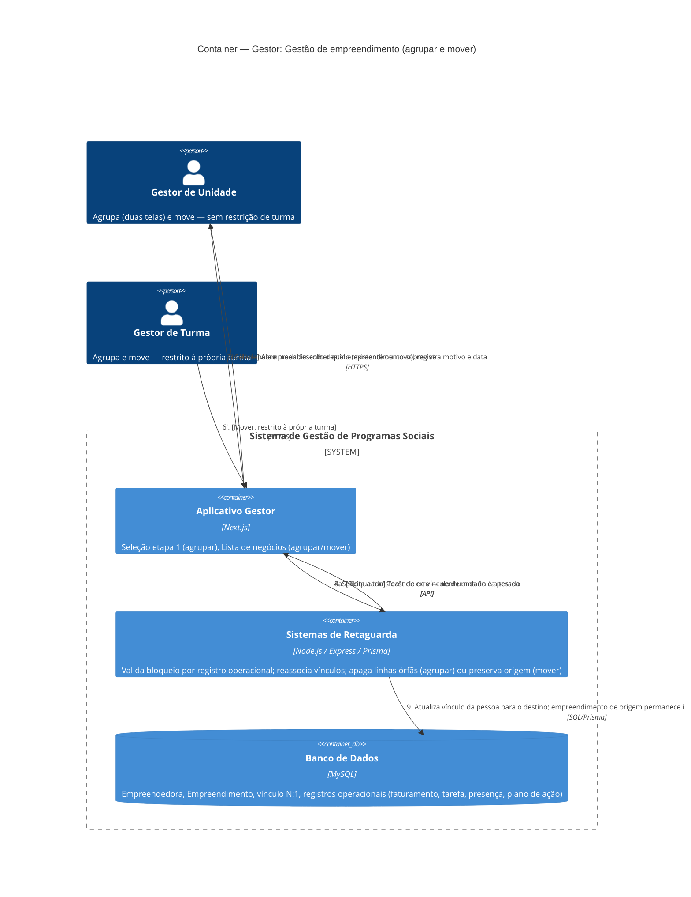

# C4 — Nível 2 (Container): Módulo Gestor
## Jornada 6 — Gestão de empreendimento: agrupar e mover empreendedoras

**UCs:** UC31 (Gerenciar Empreendimento e Associar Empreendedoras — Agrupar) → UC32 (Mover Empreendedora entre Empreendimentos)
**Atores:** Gestor de Unidade (ambas as ações, em dois pontos de entrada) · Gestor de Turma (ambas as ações, restrito à própria turma)

## Objetivo deste nível

Jornada puramente de dados — sem mensageria, sem sistema externo — mas com uma regra de negócio sutil que já havia sido sinalizada como "fundamental" na leitura da spec v7: a relação **N empreendedoras → 1 empreendimento**. O UC31 (Agrupar) e o UC32 (Mover) parecem semelhantes à primeira vista, mas têm efeitos opostos sobre o registro de origem — um **apaga**, o outro **preserva**. Vale desenhar os dois juntos exatamente para deixar essa diferença inequívoca.

## Diagrama

## Containers participantes

| Container | Tecnologia | Papel nesta jornada |
|---|---|---|
| Aplicativo Gestor | Next.js | Dois pontos de entrada para agrupar (Seleção etapa 1 e Lista de negócios) e um para mover |
| Sistemas de Retaguarda (Backend) | Node.js, Express, Prisma | A peça crítica: decide se agrupa (apaga) ou move (preserva), e valida o bloqueio por registro operacional |
| Banco de Dados | MySQL | Empreendedora, Empreendimento e todos os registros operacionais que decidem se o agrupamento é permitido |

Nenhum sistema externo participa. É a jornada mais "pura" de regra de negócio entre todas as do módulo Gestor até agora.

## Fluxo da jornada

**UC31 — Agrupar (destrutivo para a origem)**
1. Gestor seleciona N empreendedoras (na tela de Seleção, etapa 1 — só Gestor de Unidade) **ou** ≥2 empreendimentos (na Lista de negócios — Unidade sem restrição, Turma só da própria turma).
2. Backend verifica se **qualquer** dos empreendimentos a apagar já tem registro operacional (faturamento, tarefa, presença, plano de ação).
3. **Se houver registro:** bloqueia com um toast — nenhum dado é alterado, o agrupamento simplesmente não acontece.
4. **Se não houver:** abre um modal para o gestor escolher **qual empreendimento sobrevive**.
5. Backend reassocia os vínculos de todas as N pessoas ao sobrevivente e **apaga** as demais linhas de empreendimento.
6. Resultado: uma única linha de empreendimento com N empreendedoras associadas.

**UC32 — Mover (preserva a origem)**
1. Gestor localiza a participante e aciona "Mover empreendimento".
2. Seleciona o destino (existente ou cria um novo) e registra motivo e data.
3. Backend atualiza o vínculo **apenas daquela pessoa** para o novo empreendimento.
4. O empreendimento de **origem permanece intacto**, com todos os seus registros operacionais — nada é apagado nem duplicado.

## Pontos de atenção para validar

| ID (sugerido) | Risco | O que verificar |
|---|---|---|
| Gestor6-A | **Risco mais relevante desta jornada.** Mover uma empreendedora no meio da edição **fragmenta** o cálculo de beneficiamento (UC13, por empreendimento): as contribuições dela antes da mudança ficam creditadas ao empreendimento de origem; as de depois, ao destino. Nenhum dos dois empreendimentos "vê" o progresso completo da pessoa. Se o % de beneficiamento for calculado estritamente por negócio, isso pode fazer **nenhum** dos dois atingir o percentual, mesmo que a pessoa, somada, tenha cumprido tudo | Testar: mover uma empreendedora depois de ela já ter contribuído para o % do empreendimento de origem, e verificar se o cálculo de beneficiamento do destino considera esse histórico de alguma forma, ou se ele é mesmo perdido para fins de cálculo |
| Gestor6-B | Quando o agrupamento é **bloqueado** (passo 3, por já haver registro operacional), a única alternativa documentada é UC32 — mas mover **não funde** os dois negócios, só desloca uma pessoa. Se essa for a única sócia do empreendimento de origem, ele vira um registro "fantasma": sem nenhuma empreendedora vinculada, mas existindo no banco, possivelmente poluindo contagens totais (UC71/BI) | Verificar se a listagem de empreendimentos filtra ou sinaliza negócios sem nenhuma empreendedora vinculada, e se os totalizadores (UC59–61, UC71) excluem esses "fantasmas" |
| Gestor6-C | O passo 5 do UC31 (apagar linhas órfãs) não menciona preservação de auditoria — diferente de outros UCs da spec que explicitamente garantem histórico (ex.: UC18 remanejar "preserva histórico oficial"; UC30 desistência preserva registro). Não fica claro se há qualquer rastro de que um empreendimento existiu antes de ser apagado no agrupamento | Confirmar se existe log/soft-delete do empreendimento apagado (quem agrupou, quando, qual era o ID), ou se é exclusão física sem rastro — relevante para auditoria e prestação de contas a financiadores |
| Gestor6-D | A trava de UC31 (bloqueio por registro operacional) é avaliada **por empreendimento a apagar**, não pelo conjunto. Se 3 empreendimentos forem selecionados para agrupar e só 1 tiver registro operacional, o comportamento não está claro: bloqueia o lote inteiro, ou agrupa só os 2 sem registro e avisa sobre o terceiro? | Testar agrupamento com 3+ empreendimentos, sendo apenas um deles com registro operacional |

## Revalidação com a stack (out/2026)

| Camada | Status |
| --- | --- |
| Backend | Parcial — empreendimentos, agrupar |
| Frontend | Gap — agrupar local em gestor-negocios-store |

Matriz consolidada e IDs compartilhados (**X-01…X-10**, **CTX-***, **CRM**): [../../../REVALIDACAO-MATRIZ.md](../../../REVALIDACAO-MATRIZ.md)

> Diagrama C4 acima = **spec de produto**; esta seção = **as-is homolog** nos repos EWTI-BR (out/2026).

## Pendências para fechar este diagrama

- Telas reais de UC31 e UC32 ainda não vistas — diagrama baseado inteiramente na spec.
- Confirmar com o time de produto se a fragmentação de beneficiamento (Gestor6-A) é um comportamento aceito conscientemente (o negócio muda, o histórico fica com quem já existia) ou se deveria haver uma regra de "herança parcial" de progresso ao mover.
- Confirmar se há alguma rotina (manual ou automática) de limpeza de empreendimentos "fantasma" (Gestor6-B) antes da consolidação de totalizadores no BI.
