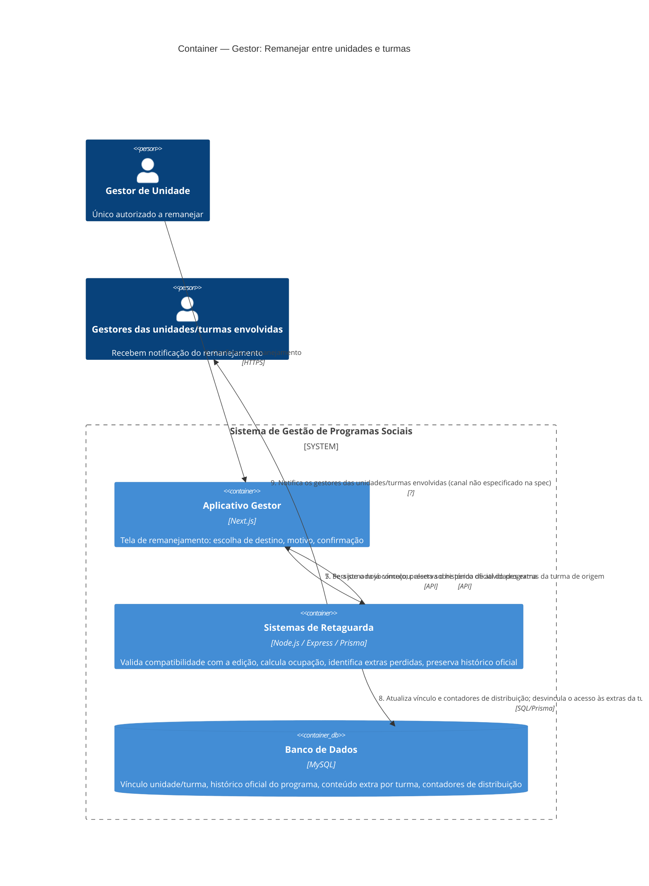

# C4 — Nível 2 (Container): Módulo Gestor
## Jornada 7 — Remanejar entre unidades e turmas

**UC:** UC18 (Remanejar entre Unidades e Turmas)
**Atores:** Gestor de Unidade (exclusivo — Gestor de Turma não pode)

## Objetivo deste nível

Jornada curta, mas é a **válvula de escape** do sistema: funciona em qualquer momento do fluxo — antes da qualificação, durante a seleção, na etapa 3 ou já na operação — para corrigir alocação ou equilibrar ocupação. É mais ampla que o UC17 (que só aloca em turmas da mesma unidade, depois de aprovação): aqui o Gestor de Unidade move entre **unidades diferentes** e a qualquer momento. A própria spec já marca um ponto de atenção explícito — perda de "extras" ao mover após o início da aplicação — que vale confirmar com precisão.

## Diagrama

## Containers participantes

| Container | Tecnologia | Papel nesta jornada |
|---|---|---|
| Aplicativo Gestor | Next.js | Tela única de remanejamento |
| Sistemas de Retaguarda (Backend) | Node.js, Express, Prisma | Valida compatibilidade com a edição, calcula ocupação, aplica a regra de perda de extras |
| Banco de Dados | MySQL | Vínculo de unidade/turma, histórico oficial (preservado), conteúdo extra (desvinculado, não apagado) |

Nenhum sistema externo está confirmado — a notificação aos gestores envolvidos (passo 9) não tem canal definido na spec, mesma lacuna já registrada no UC75 (módulo CMS, Jornada 6).

## Fluxo da jornada

1. Gestor de Unidade localiza a participante e escolhe remanejar unidade e/ou turma.
2. Backend calcula a ocupação de origem e destino.
3. Exibe alerta soft se o destino ficar desbalanceado (sem bloqueio rígido).
4. Gestor informa o motivo do remanejamento.
5. Se a aplicação já começou, o sistema alerta sobre a perda de atividades extras da turma de origem.
6. Gestor confirma explicitamente.
7. Backend persiste o novo vínculo, preservando o **histórico oficial do programa** (presenças, entregas, faturamento já registrados continuam válidos).
8. Atualiza os contadores de distribuição; a participante perde o **acesso** às atividades extras da turma de origem (que, por definição, não contam para %/beneficiamento — UC35).
9. Notifica os gestores das unidades/turmas envolvidas.

## Pontos de atenção para validar

| ID (sugerido) | Risco | O que verificar |
|---|---|---|
| Gestor7-A | A spec marca "atenção" para a perda de extras, mas não detalha **o que exatamente** é mostrado ao gestor antes de confirmar: uma lista específica das atividades extras que serão perdidas, ou um aviso genérico ("atividades extras podem ser perdidas")? Como extras não contam para beneficiamento, o impacto é mais qualitativo (ex.: perder acesso a um relato de oficina) do que estrutural — mas o gestor precisa saber exatamente o que está descartando | Verificar se o alerta do passo 5 lista as extras específicas da turma de origem, ou é apenas um texto genérico |
| Gestor7-B | Mesma lacuna já registrada no UC75 (CMS/Jornada 6): o canal de notificação aos gestores envolvidos (passo 9) não está definido — e-mail, notificação in-app, ou nenhum dos dois implementado ainda | Confirmar se há algum mecanismo real de notificação, ou se é só uma intenção da spec ainda não implementada — se a resposta for a mesma do UC75, vale resolver as duas pendências juntas |
| Gestor7-C | Remanejar uma empreendedora **já aprovada** (status aprovada, possivelmente com participação já efetivada no grupo da turma de origem) para outra turma pode recriar o mesmo problema identificado na Jornada 1 (GestorPH1-A): se a turma de destino ainda não tiver grupo WhatsApp cadastrado, a participante fica num limbo — aprovada, remanejada, mas sem grupo para entrar | Testar remanejar uma participante com participação já efetivada para uma turma sem link de grupo cadastrado ainda |
| Gestor7-D | Mesmo padrão de risco já visto no UC17 (GestorPH1-D): capacidade **soft**, sem trava rígida, pode ser ignorada repetidamente também aqui — não é um achado novo, mas reforça que esse é um padrão recorrente no sistema (ocupação nunca é um limite real, só um alerta) | Validar se o negócio está confortável com esse padrão sistêmico de capacidade sempre soft, em vez de tratar caso a caso |

## Pendências para fechar este diagrama

- Tela real do UC18 ainda não vista — diagrama baseado na spec.
- O **Gestor7-B** pode ser resolvido junto com a pendência equivalente do UC75 (CMS/Jornada 6) — recomendo perguntar ao time técnico pelas duas de uma vez, já que é provavelmente a mesma lacuna de implementação (ou a mesma decisão de produto ainda não tomada).
- Confirmar se o histórico oficial preservado (passo 7) é visível de alguma forma para o gestor — por exemplo, ele consegue ver que a participante tem presença registrada em uma turma diferente da atual?
