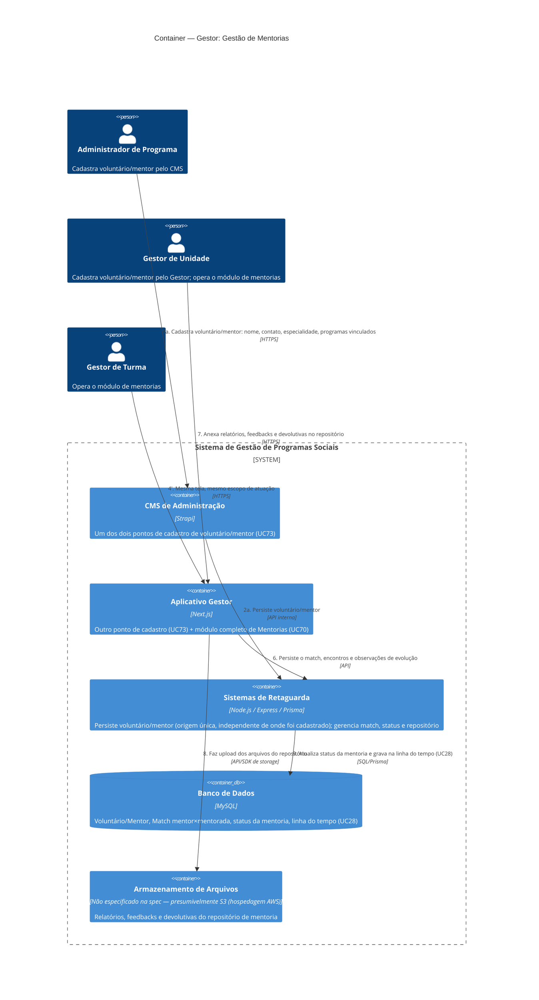

# C4 — Nível 2 (Container): Módulo Gestor
## Jornada 8 — Gestão de Mentorias

**UCs:** UC73 (Cadastrar Voluntário ou Mentor) → UC70 (Gestão de Mentorias)
**Atores:** Administrador de Programa (cadastra, via CMS) · Gestor de Unidade (cadastra e opera) · Gestor de Turma (opera)

## Objetivo deste nível

Módulo mais isolado do sistema — baixo acoplamento com o resto da operação (seleção, doação, jornada educacional). A particularidade arquitetural que salta aos olhos ao desenhar o diagrama é que o **cadastro do voluntário/mentor (UC73) tem dois pontos de entrada**: CMS de Administração e Aplicativo Gestor, operando sobre a mesma entidade. É a primeira vez, nos diagramas deste projeto, que duas aplicações distintas escrevem diretamente na mesma entidade de domínio sem um fluxo intermediário entre elas.

## Diagrama

## Containers participantes

| Container | Tecnologia | Papel nesta jornada |
|---|---|---|
| CMS de Administração | Strapi | Um dos dois pontos de cadastro do voluntário/mentor |
| Aplicativo Gestor | Next.js | Segundo ponto de cadastro + todo o módulo de Gestão de Mentorias |
| Sistemas de Retaguarda (Backend) | Node.js, Express, Prisma | Recebe de ambas as origens; gerencia match, status, histórico |
| Banco de Dados | MySQL | Voluntário/Mentor, Match, status, linha do tempo |
| Armazenamento de Arquivos | **Não especificado na spec** | Repositório de documentos da mentoria — primeira jornada onde essa lacuna de infraestrutura se torna concreta |

O **voluntário/mentor** é entidade de domínio — não acessa o sistema, nem recebe comunicação automatizada documentada; qualquer contato com ele é presumivelmente manual, fora do sistema.

## Fluxo da jornada

**Cadastro (dois caminhos para o mesmo destino)**
1. O Administrador de Programa cadastra o voluntário/mentor pelo **CMS**, **ou** o Gestor de Unidade cadastra o mesmo tipo de registro pelo **Aplicativo Gestor** — informando nome, contato, especialidade e programas vinculados.
2. Ambos os caminhos persistem no mesmo **Backend**, que grava na mesma entidade do **banco**, com status ativo/inativo (UC74).

**Gestão de mentorias**
3. Gestor de Unidade ou de Turma abre o módulo Mentorias dentro de uma edição e visualiza o painel por status.
4. Cria ou atualiza o **match** entre mentor e mentorada — tipicamente uma finalista ou alguém com doação em curso.
5. Registra encontros e observações de evolução.
6. Anexa relatórios, feedbacks e devolutivas no repositório — que precisa de algum armazenamento de arquivo, não detalhado na spec.
7. Atualiza o status da mentoria (A iniciar → Em andamento → Concluída/Pendente) e a linha do tempo de longo prazo (UC28), usada depois para indicadores qualitativos e BI.

## Pontos de atenção para validar

| ID (sugerido) | Risco | O que verificar |
|---|---|---|
| Gestor8-A | **Dois pontos de entrada para a mesma entidade** (voluntário/mentor): CMS e Aplicativo Gestor. Não há evidência na spec de que compartilham exatamente o mesmo formulário/validações — um poderia aceitar um campo que o outro exige, ou duplicar um cadastro já existente por falta de busca prévia | Testar cadastrar um voluntário pelo CMS e verificar se ele aparece imediatamente disponível no Aplicativo Gestor (e vice-versa), e se há checagem de duplicidade (mesmo nome/contato) entre as duas origens |
| Gestor8-B | **Armazenamento de arquivos não aparece em nenhum lugar da spec** como container ou serviço — nem aqui, nem nos uploads de outras jornadas (UC43 tarefa de casa, UC45 anexo de faturamento, UC86 NFs). Dado que a hospedagem é AWS, presumivelmente é S3, mas isso nunca é mencionado explicitamente | Esta é a primeira jornada onde essa lacuna de infraestrutura se torna concretamente visível — vale levantar com o time técnico como um item transversal, não só desta jornada |
| Gestor8-C | A mentorada não parece ter nenhuma visibilidade do próprio processo de mentoria no Aplicativo Cliente — tudo é operado e visto pelos gestores. Isso pode ser intencional (processo de acompanhamento institucional, não uma funcionalidade "self-service"), mas vale confirmar | Confirmar com o time de produto se a mentorada deveria ter alguma visão (ex.: próximos encontros, nome do mentor) no app dela |
| Gestor8-D | A spec cita "critérios de mentoria definidos na edição" como pré-condição, mas não há um UC específico (como UC12/13/14 para seleção/beneficiamento/doação) descrevendo **onde** e **como** esses critérios são configurados | Verificar se existe uma tela de configuração de mentoria no CMS/UC9, ou se isso ainda não foi especificado |
| Gestor8-E | Como o voluntário/mentor não acessa o sistema, o aviso de que um match foi criado precisa acontecer por fora (telefone, e-mail manual, WhatsApp pessoal do gestor) — não há menção de notificação automatizada para ele | Confirmar se existe algum canal de aviso ao mentor, ou se é inteiramente responsabilidade do gestor avisá-lo manualmente |

## Revalidação com a stack (out/2026)

| Camada | Status |
| --- | --- |
| Backend | OK — CRUD mentorias |
| Frontend | Gap — gestor-mentorias-store mock |

Matriz consolidada e IDs compartilhados (**X-01…X-10**, **CTX-***, **CRM**): [../../../REVALIDACAO-MATRIZ.md](../../../REVALIDACAO-MATRIZ.md)

> Diagrama C4 acima = **spec de produto**; esta seção = **as-is homolog** nos repos EWTI-BR (out/2026).

## Pendências para fechar este diagrama

- Telas reais de UC70 e UC73 (ambas as origens de cadastro) ainda não vistas — diagrama baseado na spec.
- **Gestor8-B é a pendência mais relevante para a arquitetura como um todo** — recomendo registrar como um item transversal a ser esclarecido antes de fecharmos o conjunto de diagramas, já que provavelmente afeta Nível 3 (Componente) de várias jornadas com upload de arquivo, não só esta.
- Confirmar se há de fato validação cruzada entre os dois pontos de cadastro do UC73 (Gestor8-A).
