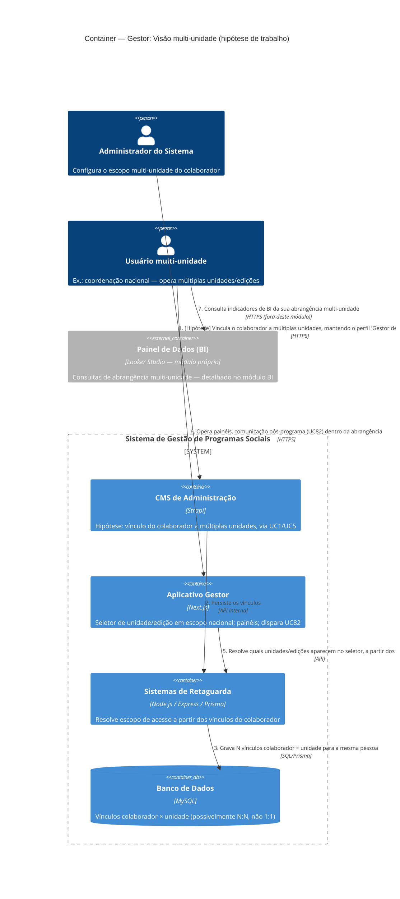

# C4 — Nível 2 (Container): Módulo Gestor
## Jornada 9 — Visão multi-unidade no Aplicativo Gestor (terceiro nível)

**UC:** UC83 (Visão Multi-Unidade — Terceiro Nível)
**Atores:** Administrador do Sistema (configura o perfil) · Usuário multi-unidade (opera, ex.: coordenação nacional)

## Objetivo deste nível

Esta é a jornada **mais especulativa** de todo o módulo Gestor — e isso já era esperado: identificamos essa lacuna lá na Fase 1, quando ainda estávamos validando o UC1 ("UC83: a spec é genérica, sem fluxo de telas nem regra de escopo"). Chegando até aqui com evidência acumulada de outras jornadas, dá para formular uma hipótese mais concreta sobre como esse "terceiro nível" provavelmente funciona — mas ela ainda precisa de confirmação direta, porque **nunca vimos uma tela deste UC**.

> **Conexão com um achado antigo:** no formulário de Colaborador validado na Fase 1 (UC1), o campo "Perfil no App Gestor" tinha **apenas dois valores**: "Gestor de Unidade" e "Gestor de Turma" — nenhum terceiro valor visível para "multi-unidade". Isso é a peça de evidência mais concreta que temos para decidir entre as duas hipóteses abaixo.

## Diagrama

## Containers participantes (hipotéticos)

| Container | Tecnologia | Papel nesta jornada |
|---|---|---|
| CMS de Administração | Strapi | Ponto onde o vínculo multi-unidade seria configurado (hipótese) |
| Aplicativo Gestor | Next.js | Onde o usuário efetivamente opera, com um seletor de escopo mais amplo que o de um Gestor de Unidade comum |
| Sistemas de Retaguarda (Backend) | Node.js, Express, Prisma | Resolve o escopo de acesso a partir dos vínculos — a mesma lógica de resolução de escopo que já vimos no UC3 (Dashboard de edições), só que sem limitar a uma única unidade |
| Banco de Dados | MySQL | Precisaria suportar vínculo **N:N** entre colaborador e unidade, não apenas 1:1 |
| Painel de Dados (BI) — referência | Looker Studio | Onde a "consulta BI da abrangência" (mencionada na spec) realmente acontece — módulo próprio, ainda não detalhado |

## Duas hipóteses sobre como isso é implementado

A spec descreve UC83 como um "terceiro nível" de acesso, ao lado de Gestor de Unidade e Gestor de Turma — linguagem que sugere um **perfil distinto**. Mas a evidência que já temos do UC1 aponta em outra direção. Vale decidir entre:

| Hipótese | Como funcionaria | Evidência a favor | Evidência contra |
|---|---|---|---|
| **A — Perfil próprio** | Existe um terceiro valor de perfil ("Multi-Unidade" ou "Coordenação Nacional") no sistema, distinto de Gestor de Unidade | A spec chama explicitamente de "terceiro nível", como se fosse categoricamente diferente dos outros dois | O dropdown de Perfil no formulário de Colaborador (UC1) só mostrava **dois** valores — se existisse um terceiro, deveria aparecer ali |
| **B — Mesmo perfil, múltiplos vínculos** | O colaborador mantém o perfil "Gestor de Unidade", mas é vinculado a **mais de uma unidade** simultaneamente — a visão "multi-unidade" é apenas a soma das unidades vinculadas | Consistente com o formulário já visto (UC1) não ter terceira opção; explica por que a spec diz "Detalhamento de permissões fino permanece alinhado a UC5" (não precisaria de um UC5 especial se fosse só composição de vínculos) | A spec chama de "nível" (sugerindo hierarquia categórica), o que combina menos naturalmente com "é a mesma coisa, só que repetida várias vezes" |

Se a **Hipótese B** se confirmar, essa jornada na verdade **não introduz container novo nenhum** — é uma consequência natural de como os vínculos são modelados, e a "novidade" está inteiramente na tela do Aplicativo Gestor (um seletor que soma mais de uma unidade), não na arquitetura.

## Pontos de atenção para validar

| ID (sugerido) | Risco | O que verificar |
|---|---|---|
| Gestor9-A | **A pergunta mais fundamental desta jornada.** Qual das duas hipóteses é a correta? Isso muda completamente o que precisa ser testado e documentado | Pedir ao time técnico uma resposta direta, ou localizar a tela de cadastro de colaborador completa (ainda pendente desde a Fase 1 — UC1-03) e ver se, rolando mais, aparece alguma forma de vincular múltiplas unidades |
| Gestor9-B | A spec diz que "detalhamento de permissões fino permanece alinhado a UC5" — mas o UC5 (Roles e Permissões) que vimos descrito é genérico ("CRUD por entidade para cada role"), sem menção específica a escopo multi-unidade. É uma referência circular: UC83 aponta para UC5, UC5 não resolve UC83 | Verificar se existe alguma tela de permissão mais granular que ainda não vimos |
| Gestor9-C | Se a Hipótese B for confirmada, esta jornada depende diretamente de uma pendência aberta desde a Fase 1 (UC1-03): o formulário de colaborador validado não tinha nenhum campo de vínculo de unidade visível — nem simples, nem múltiplo | Esta pendência já estava na nossa lista; resolvê-la responde, de quebra, a maior parte desta jornada |
| Gestor9-D | A jornada aponta para o módulo **BI** ("consultas BI da sua abrangência") — quando chegarmos a desenhar o módulo BI, esse ator (usuário multi-unidade) precisa ser considerado como um consumidor com escopo diferente do Administrador ou de um Gestor de Unidade comum | Lembrar de incluir esse ator quando iniciarmos o módulo BI |

## Revalidação com a stack (out/2026)

| Camada | Status |
| --- | --- |
| Backend | Parcial — auth, GET edicoes/me |
| Frontend | Parcial — dashboard edições; UC83 coordenação incompleto |

Matriz consolidada e IDs compartilhados (**X-01…X-10**, **CTX-***, **CRM**): [../../../REVALIDACAO-MATRIZ.md](../../../REVALIDACAO-MATRIZ.md)

> Diagrama C4 acima = **spec de produto**; esta seção = **as-is homolog** nos repos EWTI-BR (out/2026).

## Pendências para fechar este diagrama

- **Nenhuma tela deste UC foi vista** — este é o diagrama mais especulativo do módulo Gestor, no mesmo nível de incerteza da Jornada 5 do CMS (Autenticação e Segurança).
- A decisão entre Hipótese A e B deveria vir **antes** de qualquer teste funcional — testar o comportamento errado não revela nada útil.
- Esta jornada fica formalmente **em aberto** até resolvermos a pendência UC1-03, que é pré-requisito dela.
