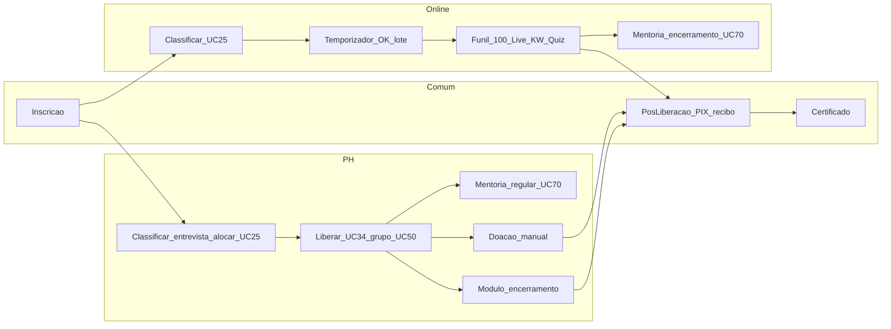

# Jornadas da empreendedora — diagramas de sequência

**Versão:** set/2026 (v10.2)  
**Fontes:** [Casos de Uso v10.2](../../Casos%20de%20Uso%20-%20Consulado%20da%20Mulher_v10.2.md), [comunicacao.md](comunicacao.md), [Aplicativo Gestor](../../prototipo/Aplicativo%20Gestor.md)

Estes diagramas ilustram o caminho da empreendedora **do cadastro ao certificado/doação**, deixando explícito:

- o **passo** (numeração `autonumber`);
- se o disparo é **automático**, **manual da empreendedora** ou **ação do gestor**;
- o que cada ação **não** faz (classificar ≠ comunicar ≠ liberar).

Não há um único sequence do início ao fim: cada **fase** tem o seu diagrama. Presencial e híbrido têm **o mesmo comportamento** no sistema; a modalidade só separa o BI.

| Arquivo | Conteúdo |
| ------- | -------- |
| Este README | Convenções, mapa comparativo, tabela-mãe de gatilhos |
| [online.md](online.md) | Inscrição, seleção, partida UC25, loop OK/lote, consumo, alertas, funil, doação, **mentoria de encerramento (lote + diagnóstico + lista de demandas)** |
| [presencial-hibrido.md](presencial-hibrido.md) | Inscrição, seleção 3 etapas, efetivação, loop UC34/UC50, extra/visita, **mentoria regular (gestor indica ou voluntário pega)**, encerramento, doação |
| [pos-liberacao.md](pos-liberacao.md) | PIX/recibo/material (comum) + desistência |
| [Simulador de comunicação](../../simulador-comunicacao/README.md) | Ferramenta à parte: percorre online e presencial ou híbrido com os textos de cada passo |

---

## Mapa de fases

Doação **presencial ou híbrido** pode ocorrer **durante** o loop de encontros (qualquer momento), não só no encerramento. O módulo de encerramento presencial ou híbrido **não** libera doação.

---

## Convenções visuais

Todo sequence usa o mesmo vocabulário.

### Participantes

Usar só os que entram na fase.

| Alias | Quem |
| ----- | ---- |
| `Empreendedora` | Pessoa no WhatsApp / App Cliente |
| `AppCliente` | Aplicativo Cliente |
| `AppVoluntario` | Portal do voluntariado (pool, aceite, diário, ações) |
| `GestorUnidade` | Seleção, UC25, aprovar doação, binding de alertas, alocar mentoria |
| `GestorTurma` | Liberar presencial ou híbrido, presença, sugerir doação, grupo WA, alocar mentoria da turma |
| `GestorVoluntariado` | Ações, rede nacional, consulta de mentorias |
| `Backend` | Regras + persistência |
| `FilaJornada` | UC33 — liberar / OK / lote — **só online** |
| `FilaAlertas` | UC87 — nurturing / risco |
| `Gupshup` | WhatsApp API |
| `SendGrid` | E-mail |

### Setas e anotações

| Recurso | Significado |
| ------- | ----------- |
| `autonumber` | Passo visível 1, 2, 3… |
| Seta sólida `->>` | Ação síncrona / humana |
| Seta pontilhada `-->>` | Fila, webhook ou temporizador |
| `Note` `[MANUAL]` | Clique da empreendedora ou do gestor |
| `Note` `[AUTO]` | Temporizador, webhook, fila |
| `Note` `[GESTOR]` | Decisão humana no Aplicativo Gestor |
| `alt` / `opt` / `loop` | Ramificação, opcional, repetição |
| Texto da mensagem | Cita o **UC** (`UC25 comunica aprovacao`) |

Abaixo de cada diagrama há uma **tabela de gatilhos** com a coluna **O que NÃO faz**.

Duas filas distintas: **jornada** (UC33) ≠ **alertas** (UC87). Mautic não faz parte do projeto.

---

## Tabela-mãe de gatilhos

| Tema | Online | Presencial / híbrido |
| ---- | ------ | -------------------- |
| **Início da jornada** | Sempre **UC25 faixa 2** (qualificada + vínculos). Nunca UC24, nunca alocar. Celebração **Você foi aprovada**; próximo passo = OK | Sempre **UC25 faixa 2** (aprovada + turma + link do grupo). Celebração e **Convite ao grupo** (mesmo envio pago). Nunca UC24, nunca UC84, nunca UC17 |
| **1º contato WhatsApp pós-cadastro** | Obrigatório: usuária escreve no nº da org → template inscrição. **Não** inicia UC33 | Opcional, se a edição usar o mesmo padrão |
| **Liberação de conteúdo** | Temporizador (FilaJornada). Gestor **só acompanha** | Checkbox do gestor (UC34), encontro a encontro |
| **Envio WhatsApp de conteúdo** | Resposta **OK** da empreendedora → lote das `liberada` ainda não enviadas | Sem lote Gupshup. Depois do UC25, só grupo (UC50, envio **fora** da API) |
| **WhatsApp pago (API)** | Contínuo: template inscrição, UC25, OK/lote, **documentos de Download** e vídeos (UC51), UC53 | UC25 (único envio operacional pago) + 1º contato opcional. Depois: grupo |
| **Papel do Gestor de Turma na execução** | Acompanha; aprova entregas; resgate **manual** UC53 | Libera (UC34), comunica grupo (UC50), presença, aprova entregas, conteúdo extra; **mentoria presencial ou híbrido:** aloca lote da turma |
| **Papel do Gestor de Unidade** | Classificar, comunicar, aprovar doação, binding de alertas; **mentoria online** (lote, fallback) | Classificar, entrevista, alocar, comunicar (3 faixas), aprovar doação; **mentoria presencial ou híbrido:** aloca lote ou Atendido pelo gestor |
| **Doação** | Funil rígido no **fim**: 100% → live → KW → quiz 100% certo. Só então sugerir/aprovar | Análise **manual** a **qualquer momento** (individual ou massa). Encerramento **não** libera |
| **Mentoria (UC70)** | Encerramento: lote → diagnóstico no aplicativo da empreendedora → lista de demandas. Número de vagas da sessão (padrão 1). Certificado **por pessoa e por sessão**. | Programa **regular**. Tela de mentorias da empreendedora. Unidade ou turma **aloca o lote** **ou** um voluntário pega. **Não é** conteúdo extra nem visita. O Gestor de Voluntariado consulta em todo o país. |
| **Risco de evasão** | Liberadas sem realização **> 10 dias** **ou** a **5 dias do término** com pendências. Maratona **não** é risco | Silêncio ≥ **15 dias** + represamento (programa longo) |
| **Escuta do programa** | Chegada e NPS no ciclo. Pesquisa após a formação: **dias no CMS** (padrão cerca de 30); o **backend** dispara. A gestora **não** dispara. | Igual |
| **Certificado** | Automático (UC55) quando o **empreendimento** atinge o % da edição; PDF em cascata para todas as sócias. Mentoria individual: **um certificado por pessoa × sessão** (mentor + mentorada). Coletiva e campanha: **sem** certificado | Igual |

Regra transversal: **classificar ≠ comunicar ≠ liberar atividades**.

---

## Desistência (atalho)

Cancelamento pelo gestor (UC30) ou solicitação no Cliente (UC79) **remove a participante das automações** (FilaJornada e FilaAlertas) nas duas modalidades. Sequence completo em [pos-liberacao.md — Desistência](pos-liberacao.md#4-desistencia-uc30--uc79).
