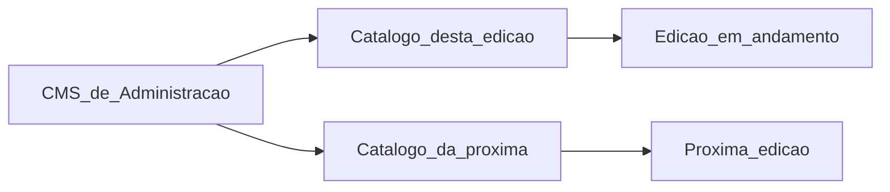
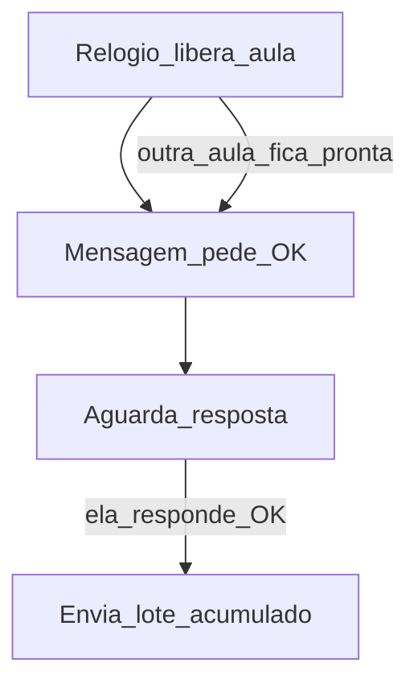
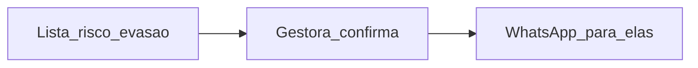

# Como a plataforma conversa com as empreendedoras

Este texto é para a equipe do Consulado da Mulher (comunicação, metodologia e voluntariado). Serve para entender **quando** cada pessoa recebe **o quê**, **por quê** e **por qual caminho** — e para revisar tom e materiais.

Inventário de slots no sistema: [Casos de Uso v7 — UC88](../../Casos%20de%20Uso%20-%20Consulado%20da%20Mulher_v7.md). Este arquivo é a leitura operacional (quando / para quem / o que a mensagem **não** faz). Os parágrafos oficiais ainda estão *a revisar*.

Para **jogar** as duas jornadas (online e P/H, com desfechos) numa ferramenta à parte: [simulador-comunicacao/](../../simulador-comunicacao/README.md).

Quem nunca abriu o sistema deve conseguir ler daqui até o fim sem precisar de outro documento.

---

## Palavras que usamos aqui

- **CMS de Administração** — o lugar onde a equipe monta programas, edições e os textos oficiais das mensagens.
- **Catálogo** — o conjunto de todos esses textos. Cada momento da conversa tem **um** texto no catálogo.
- **Edição** — a turma daquele ano de um programa, por exemplo “Empreende no Zap 2026” ou “Empreende Mulher 2026”.
- **Pela internet** — o curso acontece no WhatsApp e no aplicativo, no ritmo das aulas que o sistema libera.
- **Presencial ou híbrido** — há encontros ao vivo (sala ou tela). Depois da aprovação, o dia a dia da turma vai no **grupo da turma**.
- **Grupo da turma** — grupo de WhatsApp criado pela gestora **depois** que a empreendedora é aprovada. O sistema monta o texto; a gestora cola e envia com a própria mão.
- **OK** — a palavra (ou o botão) que a empreendedora manda no WhatsApp para **receber** o que já está pronto. Não significa que ela já fez a aula.
- **Lote** — o conjunto de recados e materiais que sai de uma vez depois do OK: tudo que já estava pronto e ela ainda não tinha recebido.
- **Link de acesso** — um endereço no WhatsApp ou no e-mail que abre o aplicativo **já autenticada**. Não existe senha. Não existe código de verificação por SMS.
- **Pré-inscrição** — ela deixou nome, telefone, e-mail e os aceites, mas **ainda não** terminou a ficha completa.
- **Gestora** — quem opera o programa na unidade ou na turma.

---

## 1. Como a conversa funciona

### O catálogo vive no CMS de Administração

No CMS de Administração a equipe cria um **catálogo com todas as mensagens**: confirmação de inscrição, pedido de OK, cada tipo de aula, lembretes, risco de evasão, certificado, pesquisa e o restante deste documento.

Cada **edição escolhe qual catálogo usa**. Assim dá para melhorar textos, tom ou novos momentos numa versão nova e ligar só à edição seguinte. A edição que já está no ar continua com o catálogo antigo, sem surpresa.

Não se escreve mensagem solta na turma nem no módulo do curso. O texto vem sempre do catálogo daquela edição.

Cada momento tem **um** texto. Esse texto vai no WhatsApp automático (quando o número do programa envia sozinho) e, se aquele momento também usar e-mail, **o mesmo texto** vai no e-mail. Quando a gestora cola no grupo da turma, ela usa **esse mesmo** texto. Não há dois bancos de copy.

A gestora da unidade pode ajustar o texto na hora de colar no grupo. A gestora da turma usa o texto pronto.

### Por onde a mensagem chega

- **WhatsApp automático** — o número do programa envia para a pessoa, no curso pela internet (e em alguns avisos de inscrição e seleção das duas modalidades).
- **Grupo da turma** — presencial ou híbrido, depois da aprovação. A gestora envia na mão.
- **E-mail** — o mesmo texto do catálogo, quando o momento pede e-mail ou os dois caminhos.
- **Conversa um a um no WhatsApp** — a gestora ou a mentora abre o chat da pessoa. Esse papo **não** é texto do catálogo.

### Horário dos envios automáticos

Segunda a sexta, das 8h às 20h. Sábado, das 8h às 16h. Domingo e feriado nacional **não** disparam. Se o horário passou, a mensagem espera o próximo período permitido. Se a entrega no WhatsApp falhar, o sistema tenta de novo **depois de 2 dias**.

### Quem sai da conversa automática

Quem desiste ou é desligada **sai** das mensagens automáticas e dos disparos manuais da jornada.

### O que a gestora **não** recebe

A gestora **não** recebe e-mail de “pendência do dia”. Ela só recebe e-mail quando **pede o link de acesso** ao sistema.

No curso pela internet, ela **pode ela mesma** mandar WhatsApp para quem está em risco de evasão. Isso é ação humana, não relógio.

---

## 2. Três tipos de gatilho

Um **gatilho** é o que faz a mensagem sair. São três famílias.

### A. Relógio

O tempo passa e, se a condição ainda for verdade, a plataforma manda o recado. Cada relógio **para sozinho** quando a pessoa faz o que faltava (termina a ficha, conclui a atividade, sai do risco).

A unidade pode **ligar, desligar ou ajustar** os prazos daquela edição. Os números abaixo são o combinado típico.

| Relógio | O que espera | Quando manda | Quando para |
| ------- | ------------ | ------------ | ----------- |
| Ficha incompleta — 1º toque | Ela fez a pré-inscrição e não terminou a ficha | **1 dia** depois | Ela conclui a inscrição |
| Ficha incompleta — reforço | A mesma situação continua | **A cada 3 dias**, até o limite da edição | Ela conclui a inscrição |
| Prazo da atividade | Aula liberada, ainda não feita, com data limite | Algumas **horas antes** do prazo | Ela conclui, ou o prazo passa sem reenvio |
| Várias aulas paradas | Muitos conteúdos já liberados e não feitos | Quando passa o limiar da edição | As pendências baixam do limiar |
| Fim do programa perto | Curso pela internet, ainda há pendência | **5 dias** antes do fim | Sem pendência, ou o programa acaba |
| Risco no curso curto | Aula já liberada e não feita | **10 dias** sem fazer | Ela faz a aula ou sai do estado de risco |
| Meio do curso | Formação curta (~um mês) | Por volta do **15º dia**, campanha de **3 a 5 dias** | Ela retoma, ou a janela fecha |
| Programa longo (presencial/híbrido) | Silêncio **e** muita coisa atrasada | **15 dias** sem participação relevante | A gestora acompanha no **grupo**; não é WhatsApp automático do número do programa |
| Depois do programa | Edição encerrada | **Cerca de 30 dias** depois | Ela responde a pesquisa |
| Aula nova (só internet) | O calendário daquela aula chegou | No dia/hora combinados | — |

O relógio da aula nova **não envia o conteúdo**. Só deixa a aula pronta e dispara o pedido de OK (item B).

Cada aula pela internet tem o **próprio** relógio. Ele não espera ela terminar a aula anterior.

### B. Resposta dela: OK e o lote

Só no curso **pela internet**.

Quando a aula fica pronta, a plataforma **não** manda vídeo, exercício nem arquivo. Manda um recado: já está disponível; envie **OK** para receber.

O **OK** dela é o gatilho. Só então sai o **lote**: tudo que já estava pronto e ela ainda não tinha recebido — inclusive o que acumulou se ela demorou a responder.

Pedir OK **não** marca a aula como feita. Feito é no aplicativo, quando ela assiste, responde ou envia.

Juntar várias aulas e fazer depois (“maratonar”) é **esperado**. Não é atraso e **não** é, sozinho, risco de evasão.

No presencial ou híbrido **não existe** esse OK/lote: a gestora libera o encontro e cola o texto no grupo.

### C. Ação manual da gestora

Só no curso **pela internet**.

Os relógios de risco **mostram** quem está em risco (10 dias sem fazer aula já liberada, ou 5 dias do fim ainda com pendência). A gestora da unidade ou da turma abre a lista, escolhe as pessoas e **confirma** o envio. Sem o clique dela, essa mensagem de resgate **não sai**.

Não substitui o pedido de OK. Não manda o lote. Não marca a aula como feita. Quem está juntando aulas e **ainda entra no aplicativo** não entra nessa lista de risco.

No mesmo gesto ela também pode mandar, cada um com texto próprio no catálogo:

1. recado para quem **não fez uma atividade** que ela escolheu;
2. campanha curta no meio do curso (por volta do 15º dia).

No presencial ou híbrido **não existe** esse disparo do número do programa: a gestora escreve no grupo da turma.

---

## 3. Os dois caminhos, em ordem

### Pela internet

Ela encontra a página do programa e faz a pré-inscrição. Se parar no meio, o relógio de **1 dia** (e depois o de **3 dias**) pede que termine a ficha.

Quando termina, o aplicativo mostra o **número WhatsApp do programa**. Ela **escreve** nesse número. Só então chega a confirmação: recebemos sua inscrição; agora é aguardar a seleção. Isso **ainda não** começa o curso.

A gestora comunica o resultado. Se ela segue, chega o pedido do **primeiro OK** (confirmar participação). Ela responde OK e recebe o primeiro lote (boas-vindas, salvar o número, materiais). A cada relógio de aula, de novo o pedido de OK; ela responde e recebe o lote acumulado.

Se a unidade ligou os relógios, chegam lembretes de prazo, de várias aulas paradas, de fim perto ou de risco. Quando a gestora decide, sai também a mensagem manual de resgate.

Quem fez tudo entra no convite da live e nos últimos passos. Pode haver mentoria, doação e certificado. Ao fim, o aviso de que o programa acabou. Cerca de **30 dias** depois, a pesquisa.

### Presencial ou híbrido

A inscrição é a mesma. A confirmação no WhatsApp do programa é **opcional** na edição: se a edição usar, ela também escreve no número e recebe o “recebemos sua inscrição”. O relógio da ficha incompleta é o mesmo.

Pode haver **entrevista de seleção**. A gestora só convida quem já está marcada numa sessão.

Quem é aprovada e já tem turma recebe boas-vindas **com o link do grupo**. Quem não entra no grupo **ainda não** está com a participação efetivada. Quem não segue recebe o recado de não aprovação. Classificar no sistema **não** manda mensagem: só **comunicar o resultado** manda.

Dali em diante o dia a dia é o **grupo da turma**. A cada encontro a gestora cola o texto daquele tipo de atividade. Mentoria acontece **durante** o programa. Doação quando a equipe decidir. A pesquisa de 30 dias depois é a mesma.

---

## 4. Como ler cada ficha

Todas as comunicações abaixo usam o mesmo bloco:

- **Quando** — o ponto da história e o gatilho
- **Para quem**
- **Por que enviamos**
- **Como chega**
- **O que esta mensagem não faz**
- **Campos que o sistema preenche**
- **Texto** — espaço para o Consulado fechar o parágrafo. Onde ainda não há texto oficial, há **intenção** (tom caloroso, curto, com um próximo passo claro). Não é o texto final.

---

## 5. Inscrição e seleção

### Recebemos sua inscrição

**Quando:** ela escreveu a primeira mensagem no número WhatsApp do programa, depois de terminar (ou quase terminar) a ficha.

**Para quem:** quem acabou de se apresentar nesse número.

**Por que enviamos:** confirmar que o Consulado viu o interesse e que a seleção ainda vai acontecer.

**Como chega:** WhatsApp automático. E-mail com o mesmo texto, se a edição ligar os dois.

**O que esta mensagem não faz:** não começa o curso. Não pede OK. Não envia aula.

**Campos que o sistema preenche:** nome; nome do programa / edição; quando a equipe volta a falar (se a edição informar).

**Texto:** a revisar.

Intenção: alegria pelo interesse; “recebemos e agora é aguardar”; a próxima fala será por aqui, na época da seleção.

---

### Relógio: 1 dia sem terminar a ficha

**Quando:** **1 dia** depois da pré-inscrição, se a ficha completa ainda não foi enviada.

**Para quem:** quem parou no meio.

**Por que enviamos:** muita gente desiste no formulário longo; um toque cedo recupera o interesse.

**Como chega:** preferência por **e-mail** com link de acesso para retomar a ficha. WhatsApp automático é opcional na edição (custa mais). A gestora também pode mandar na mão, se quiser reforçar.

**O que esta mensagem não faz:** não a coloca em seleção. Não começa o curso.

**Campos que o sistema preenche:** nome; nome do programa; link de acesso para continuar de onde parou.

**Texto:** a revisar.

Intenção: “vimos que você começou”; um passo só — terminar a ficha; tom de convite, não de cobrança.

---

### Relógio: reforço a cada 3 dias

**Quando:** a ficha continua incompleta. **A cada 3 dias**, até o número máximo combinado na edição.

**Para quem:** a mesma pessoa do toque de 1 dia.

**Por que enviamos:** um único lembrete às vezes não basta; o relógio para no instante em que ela conclui.

**Como chega:** o mesmo caminho do toque de 1 dia (mesmo texto-base do catálogo, ou variante de reforço se o Consulado quiser duas peças).

**O que esta mensagem não faz:** não acumula cobrança depois que ela termina. Não inicia o curso.

**Campos que o sistema preenche:** nome; nome do programa; link de acesso.

**Texto:** a revisar.

Intenção: reforço curto; o prazo de inscrição, se ainda houver; o mesmo próximo passo.

---

### Convite à conversa de seleção

**Quando:** a gestora da unidade **escolhe e dispara**, só no presencial ou híbrido, para quem já está marcada numa sessão de entrevista.

**Para quem:** candidatas qualificadas com data, hora e local definidos.

**Por que enviamos:** marcar presença na entrevista. Sem essa conversa a aprovação presencial não acontece.

**Como chega:** WhatsApp automático e/ou e-mail, mesmo texto. Se o automático não chegar, a gestora pode abrir o chat da pessoa.

**O que esta mensagem não faz:** não aprova. Não cria o grupo da turma. Não começa o curso.

**Campos que o sistema preenche:** nome; nome do programa; data; hora; local (ou link do encontro).

**Texto:** a revisar.

Intenção: convite claro, com data e o que levar / como chegar.

---

### Você foi aprovada — boas-vindas

**Quando:** a gestora da unidade **comunica o resultado** de quem segue. Este é o único recado que **liga** o curso.

**Para quem:** aprovadas (presencial/híbrido: já na turma, com link do grupo cadastrado; pela internet: já vinculadas à unidade/turma).

**Por que enviamos:** dizer que ela entrou e o que acontece agora.

**Como chega:** WhatsApp automático e/ou e-mail, mesmo texto.

No presencial ou híbrido, o texto traz o **link do grupo da turma**. No curso pela internet, este recado **já pede o primeiro OK** — ainda **não** manda o lote de aulas.

**O que esta mensagem não faz:** no presencial, não efetua a participação se ela não entrar no grupo. Na internet, não envia vídeo nem exercício. Classificar no sistema, sozinho, **não** dispara esta mensagem.

**Campos que o sistema preenche:** nome; nome do programa; (presencial/híbrido) link do grupo; (internet) pedido de OK.

**Texto:** a revisar.

Intenção: celebração curta; o próximo passo único (entrar no grupo **ou** responder OK).

---

### Desta vez não foi possível seguir

**Quando:** a gestora comunica quem **não** segue (não qualificada, não aprovada, ausente à entrevista, e situações parecidas).

**Para quem:** quem não entra nesta edição.

**Por que enviamos:** fechar o ciclo com respeito e deixar a porta aberta para outra edição, se o Consulado quiser.

**Como chega:** WhatsApp automático e/ou e-mail, mesmo texto.

**O que esta mensagem não faz:** não liga o curso. Não cria grupo.

**Campos que o sistema preenche:** nome; nome do programa.

**Texto:** a revisar.

Intenção: agradecer o interesse; recado humano, sem jargão de “reprovada”; convite futuro só se a equipe quiser.

---

## 6. Durante o curso pela internet — OK e lote

### Já está disponível: envie OK

**Quando:** o relógio daquela aula chegou (ou, no primeiro dia, logo após a aprovação). A aula está **pronta**, ainda **não enviada**.

**Para quem:** empreendedora ativa no curso pela internet.

**Por que enviamos:** ela escolhe quando receber. Assim o conteúdo não chega no meio do expediente sem combinado.

**Como chega:** WhatsApp automático.

**O que esta mensagem não faz:** não entrega o material. Não marca a aula como feita.

**Campos que o sistema preenche:** nome; título da aula ou do tema.

**Texto:** a revisar.

Intenção: “Já está disponível sua aula sobre [título]. Envie agora um OK para receber.”

---

### Ela respondeu OK — o lote sai

**Quando:** ela manda OK (ou toca o botão).

**Para quem:** quem acabou de responder.

**Por que enviamos:** entregar de uma vez tudo que já estava pronto e ela ainda não tinha recebido.

**Como chega:** WhatsApp automático. Cada item do lote usa o texto do **tipo** daquela atividade (fichas abaixo). Material para baixar traz o texto **e os arquivos**. Vídeo no WhatsApp só se a edição ligar essa opção; o mesmo conteúdo continua no aplicativo.

**O que esta mensagem não faz:** não conclui a atividade. Conclusão é no aplicativo.

**Campos que o sistema preenche:** nome; título; link de acesso para a atividade no aplicativo; prazo, se houver.

**Texto:** cada tipo tem o próprio texto no catálogo (abaixo).

---

### Primeiro lote — boas-vindas da jornada

**Quando:** o primeiro OK depois da aprovação.

**Para quem:** quem acabou de confirmar participação.

**Por que enviamos:** situar a jornada, pedir para salvar o número, apresentar a comunidade (se a edição tiver) e entregar os materiais de apoio iniciais.

**Como chega:** WhatsApp automático, em sequência, como parte do lote. E-mail com o mesmo texto, se a edição ligar.

**O que esta mensagem não faz:** não substitui o aplicativo. Não marca módulo como concluído.

**Campos que o sistema preenche:** nome; nome do programa; (se houver) link da comunidade; arquivos de apoio.

**Texto:** a revisar.

Intenção: acolher; “salve este número”; materiais para consultar sempre; um primeiro passo concreto no aplicativo.

---

### Textos por tipo de atividade (o lote escolhe o tipo)

Cada tipo abaixo é **um** texto no catálogo. Pela internet, sai no lote depois do OK. No presencial ou híbrido, a gestora cola **o mesmo** texto no grupo quando libera aquele encontro.

Campos comuns: nome (quando for mensagem individual); título; data; hora; local ou link do encontro; prazo; link de acesso da atividade.

**O que nenhum desses textos faz:** marcar a atividade como feita.

#### Encontro presencial

**Quando:** encontro em sala, na data combinada.

**Como chega:** internet = lote após OK. Presencial/híbrido = grupo da turma.

**Texto:** a revisar. Intenção: data, hora, endereço; o que levar; presença conta.

#### Encontro ao vivo

**Quando:** encontro na mesma hora, pela tela (não confundir com o curso inteiro pela internet).

**Como chega:** igual ao encontro presencial.

**Texto:** a revisar. Intenção: data, hora, link da sala; como entrar.

#### Videoaula

**Quando:** vídeo liberado, com prazo típico de uns dois dias (a edição pode mudar).

**Como chega:** lote após OK; no grupo, se for presencial/híbrido. Arquivo de vídeo no WhatsApp só se a edição ligar.

**Texto:** a revisar. Intenção: do que a aula trata; prazo; link de acesso para assistir no aplicativo (a conclusão oficial é lá, com boa parte do vídeo vista).

#### Exercício

**Quando:** atividade prática no aplicativo.

**Texto:** a revisar. Intenção: o desafio em uma frase; link de acesso.

#### Tarefa de casa

**Quando:** tarefa para fazer no negócio e devolver no aplicativo.

**Texto:** a revisar. Intenção: o pedido concreto; prazo; link de acesso.

#### Saúde financeira

**Quando:** hora de registrar números do negócio (preço, faturamento, etc.).

**Texto:** a revisar. Intenção: por que aquele número importa; link de acesso; sem tom de auditoria.

#### Material para baixar

**Quando:** PDF, guia ou anexo de apoio.

**Como chega:** texto **e os arquivos** no WhatsApp (internet, após OK). Os mesmos arquivos ficam no aplicativo. No grupo, a gestora manda o texto; os arquivos podem ir anexos na mão.

**Texto:** a revisar. Intenção: o que é cada arquivo; “salve para consultar”.

#### Plano de ação

**Quando:** ela escreve o plano do negócio.

**Texto:** a revisar. Intenção: o que o plano precisa ter; link de acesso.

#### Visita técnica

**Quando:** visita um a um, combinada pela equipe.

**Texto:** a revisar. Intenção: data, o que esperar; não confundir com mentoria.

#### Questionário de chegada

**Quando:** no começo do programa, para conhecer o ponto de partida.

**Texto:** a revisar. Intenção: “queremos te conhecer”; link de acesso; respostas são dela, não do negócio inteiro.

#### Questionário final

**Quando:** no encerramento (pela internet, depois da live e da palavra-chave, quando a edição usar esse funil).

**Texto:** a revisar. Intenção: fechar o aprendizado; pela internet, acertar o questionário é um dos passos para concorrer à doação — a doação em si a equipe ainda aprova.

#### Pesquisa de satisfação

**Quando:** ao final do ciclo de formação, no aplicativo.

**Texto:** a revisar. Intenção: opinião sincera; poucos minutos; link de acesso.

---

## 7. Ação manual da gestora (só pela internet)

### Risco de evasão

**Quando:** a lista mostra quem está em risco — **10 dias** sem fazer aula já liberada **ou** **5 dias** do fim ainda com pendência — e a gestora **confirma** o envio.

**Para quem:** só as pessoas que ela selecionou nessa lista.

**Por que enviamos:** resgate humano. O relógio sozinho não manda este texto.

**Como chega:** WhatsApp automático, depois do clique. E-mail com o mesmo texto, se a edição ligar.

**O que esta mensagem não faz:** não envia o lote. Não pede OK no lugar da aula. Não inclui quem está juntando conteúdo e ainda usa o aplicativo.

**Campos que o sistema preenche:** nome; nome do programa; o motivo visível para a gestora (dias sem fazer / proximidade do fim); link de acesso.

**Texto:** a revisar.

Intenção: preocupação, não bronca; um próximo passo único e leve.

---

### Quem não fez uma atividade escolhida

**Quando:** a gestora escolhe uma atividade e dispara para quem ainda não concluiu.

**Para quem:** a lista operacional daquela atividade.

**Por que enviamos:** lembrar sem tratar o atraso como evasão (ela pode estar juntando para fazer depois).

**Como chega:** WhatsApp automático após o clique. Mesmo texto no e-mail, se ligado.

**O que esta mensagem não faz:** não marca risco. Não envia o lote.

**Campos que o sistema preenche:** nome; título da atividade; prazo; link de acesso.

**Texto:** a revisar.

Intenção: “essa atividade ainda está com você”; prazo; link.

---

### Campanha de meio de curso

**Quando:** a gestora dispara a campanha curta (por volta do **15º dia**, por **3 a 5 dias**), para quem desacelerou.

**Para quem:** o recorte que ela escolher nessa campanha.

**Por que enviamos:** um empurrão no meio da formação curta, diferente do risco de 10 dias ou dos 5 dias do fim.

**Como chega:** WhatsApp automático após o clique. Mesmo texto no e-mail, se ligado.

**O que esta mensagem não faz:** não substitui o OK do conteúdo.

**Campos que o sistema preenche:** nome; nome do programa; link de acesso.

**Texto:** a revisar.

Intenção: incentivo; o que ainda dá tempo de fazer; tom de parceria.

---

## 8. Relógios de lembrete (se a unidade ligar na edição)

Estes textos são **outros** do catálogo. Podem coexistir com o disparo manual da gestora: o relógio manda sozinho; o manual só sai com o clique.

### Horas antes do prazo

**Quando:** a atividade tem data limite, ainda não foi feita, e faltam as horas combinadas na edição.

**Para quem:** quem ainda não concluiu aquela atividade.

**Por que enviamos:** o prazo está perto.

**Como chega:** WhatsApp automático e/ou e-mail, mesmo texto.

**O que esta mensagem não faz:** não prorroga o prazo. Não envia o lote.

**Campos que o sistema preenche:** nome; título; data limite; link de acesso.

**Texto:** a revisar.

---

### Várias aulas já liberadas e não feitas

**Quando:** a quantidade de conteúdos prontos e não feitos passa o limiar da edição.

**Para quem:** quem está com a fila grande.

**Por que enviamos:** lembrar que o acúmulo é normal, mas o programa tem fim.

**Como chega:** WhatsApp automático e/ou e-mail, mesmo texto.

**O que esta mensagem não faz:** não classifica como evasão. Maratonar continua saudável.

**Campos que o sistema preenche:** nome; quantidade pendente (se o Consulado quiser no texto); link de acesso.

**Texto:** a revisar.

---

### 5 dias do fim, ainda com pendência

**Quando:** curso pela internet; faltam **5 dias** para o término e ainda há atividade não feita.

**Para quem:** quem tem pendência.

**Por que enviamos:** o calendário está acabando.

**Como chega:** WhatsApp automático e/ou e-mail, mesmo texto.

**O que esta mensagem não faz:** não abre prazo extra.

**Campos que o sistema preenche:** nome; data de encerramento; link de acesso.

**Texto:** a revisar.

---

### 10 dias sem fazer aula já liberada

**Quando:** curso curto pela internet; uma aula pronta está sem conclusão há **10 dias**.

**Para quem:** quem entrou no estado de risco. Quem acessou o aplicativo há pouco e só está juntando **não** entra.

**Por que enviamos:** sinal de que ela pode estar saindo do curso — o relógio avisa; o resgate mais falado ainda pode ser o **manual** da gestora (ficha da seção 7).

**Como chega:** WhatsApp automático e/ou e-mail, mesmo texto, se este relógio estiver ligado.

**O que esta mensagem não faz:** não é o mesmo que 15 dias de silêncio do programa longo presencial.

**Campos que o sistema preenche:** nome; o que está parado; link de acesso.

**Texto:** a revisar.

---

### Por volta do 15º dia de curso

**Quando:** janela automática de **3 a 5 dias** no meio da formação curta, se a unidade ligou este relógio.

**Para quem:** quem desacelerou nessa janela.

**Por que enviamos:** o mesmo espírito da campanha manual de meio de curso, sem esperar o clique da gestora.

**Como chega:** WhatsApp automático e/ou e-mail, mesmo texto.

**O que esta mensagem não faz:** não mistura com o filtro de 10 dias / 5 dias do fim.

**Campos que o sistema preenche:** nome; nome do programa; link de acesso.

**Texto:** a revisar.

---

### Programa longo: 15 dias de silêncio

**Quando:** presencial ou híbrido (formação de vários meses); **15 dias** sem participação relevante **e** muita coisa atrasada (faltas, tarefas paradas).

**Para quem:** a gestora vê o sinal no acompanhamento.

**Por que enviamos:** o programa longo não usa o WhatsApp automático de risco do curso curto. A cobrança é no **grupo da turma**, com o texto que a equipe escolher no catálogo (ou um recado humano no grupo).

**Como chega:** grupo da turma (mão da gestora). Não é o número do programa disparando sozinho.

**O que esta mensagem não faz:** não envia lote. Não usa a regra de 10 dias do curso pela internet.

**Campos que o sistema preenche:** se houver texto de apoio no catálogo: nome da turma; nome do programa.

**Texto:** a revisar.

---

## 9. Encerramento e depois

### Convite da live e últimos passos

**Quando:** pela internet, o negócio fez **todas** as atividades. A gestora dispara o convite da live (transmissão fora do aplicativo).

**Para quem:** só quem chegou a 100%.

**Por que enviamos:** a live, a palavra-chave de presença e o questionário final são os últimos degraus antes da equipe poder doar.

**Como chega:** e-mail é o caminho típico; WhatsApp com o mesmo texto, se a edição ligar. Depois da live, o aplicativo pede a palavra-chave e o questionário — isso pode ir também num recado do catálogo com link de acesso.

**O que esta mensagem não faz:** assistir à live, sozinha, não libera doação. Doação **nunca** é automática: a equipe ainda sugere e aprova.

**Campos que o sistema preenche:** nome; data e hora da live; link da transmissão; prazo da palavra-chave; link de acesso.

**Texto:** a revisar.

---

### Mentoria disponível

**Quando:**

- Pela internet: no encerramento, quando a equipe abre a mentoria para quem chegou ao fim / teve doação aprovada. Ela preenche um diagnóstico no aplicativo.
- Presencial ou híbrido: durante o programa, quando ela pede ou a gestora inclui.

**Para quem:** quem está nesse recorte.

**Por que enviamos:** avisar que a conversa de mentoria existe e qual o próximo passo (preencher o diagnóstico, esperar combinação, ou ver o horário).

**Como chega:** WhatsApp automático e/ou e-mail, mesmo texto, quando for aviso da plataforma. O combinado fino com a mentora pode ser conversa um a um — **fora** do catálogo.

**O que esta mensagem não faz:** não marca a sessão como feita. Não substitui o treino da voluntária.

**Campos que o sistema preenche:** nome; nome do programa; link de acesso da área de mentoria.

**Texto:** a revisar.

---

### Doação aprovada — dados de recebimento

**Quando:** a gestora da unidade **aprovou** a doação (depois da análise; pela internet, só quem passou pelo funil da live e do questionário).

**Para quem:** a empreendedora (e sócias do mesmo negócio, quando for o caso).

**Por que enviamos:** pedir conta ou PIX (dinheiro) ou endereço com ponto de referência (produto), e os aceites. A tela do aplicativo mostra **aguarde** — sem data prometida de pagamento ou entrega.

**Como chega:** WhatsApp automático e/ou e-mail, mesmo texto, com link de acesso. O preenchimento é no aplicativo.

**O que esta mensagem não faz:** não promete dia de crédito. Não é o comprovante final.

**Campos que o sistema preenche:** nome; se é dinheiro ou produto; link de acesso.

**Texto:** a revisar.

Intenção: alegria contida; o que ela precisa informar; “aguarde a educadora”; sem data.

---

### Recibo da doação

**Quando:** o aplicativo libera o recibo — **antes** do pagamento, se for dinheiro; **depois** que ela confirma o recebimento, se for produto.

**Para quem:** quem tem recibo para assinar.

**Por que enviamos:** formalizar o recebimento.

**Como chega:** WhatsApp automático e/ou e-mail, mesmo texto, com link de acesso para assinar.

**O que esta mensagem não faz:** não substitui a conferência da equipe.

**Campos que o sistema preenche:** nome; tipo da doação; link de acesso.

**Texto:** a revisar.

---

### Certificado do programa

**Quando:** o **negócio** atinge o percentual da edição (em geral, boa parte das atividades feitas). Todas as sócias daquela edição recebem.

**Para quem:** cada sócia vinculada.

**Por que enviamos:** reconhecer a conclusão.

**Como chega:** WhatsApp automático (PDF). E-mail com o mesmo texto, se a edição ligar. O certificado também fica no aplicativo.

**O que esta mensagem não faz:** não é o certificado da mentoria (esse é outro, por sessão). Não é o certificado da voluntária.

**Campos que o sistema preenche:** nome; nome do programa; link de acesso para baixar de novo.

**Texto:** a revisar.

Intenção: parabéns; o PDF; guardar e compartilhar se quiser.

---

### O programa acabou

**Quando:** a edição encerra o ciclo de formação.

**Para quem:** quem participou e não desistiu.

**Por que enviamos:** fechar a conversa automática da jornada e avisar o que ainda pode acontecer (pesquisa, mentoria em andamento).

**Como chega:** WhatsApp automático e/ou e-mail, mesmo texto.

**O que esta mensagem não faz:** não apaga o acesso ao aplicativo. Não dispara a pesquisa de 30 dias (isso é o relógio seguinte).

**Campos que o sistema preenche:** nome; nome do programa.

**Texto:** a revisar.

---

### Pesquisa cerca de 30 dias depois

**Quando:** **cerca de 30 dias** após o encerramento, no automático; a gestora também pode disparar para edições já encerradas.

**Para quem:** o público que a equipe escolher (por exemplo, quem se certificou).

**Por que enviamos:** acompanhar o negócio depois da formação. É o terceiro momento de escuta do programa: chegada, satisfação no fim, e esta pesquisa.

**Como chega:** WhatsApp automático e/ou e-mail, mesmo texto, com link de acesso. Ela responde no aplicativo.

**O que esta mensagem não faz:** não reabre o curso. Não é o questionário final da live.

**Campos que o sistema preenche:** nome; nome do programa; link de acesso.

**Texto:** a revisar.

Intenção: “e o seu negócio agora?”; poucos minutos; tom de cuidado, não de prova.

---

### Novo link de acesso

**Quando:** ela pede para entrar de novo no aplicativo (empreendedora), ou o recado da jornada já traz um link para uma atividade específica.

**Para quem:** a pessoa que pediu ou o destino daquele recado.

**Por que enviamos:** não existe senha. O link é a chave.

**Como chega:** WhatsApp ou e-mail, mesmo texto do catálogo para “seu acesso”.

**O que esta mensagem não faz:** não é código de verificação. Link vencido pede um novo.

**Campos que o sistema preenche:** nome; link de acesso (às vezes já apontando para a aula certa).

**Texto:** a revisar.

Intenção: “é só tocar para entrar”; validade curta; se não funcionar, peça de novo.

---

## 10. Voluntárias

Mesmo formato. Os textos desta rede também entram no catálogo (podem viver no mesmo CMS de Administração, ligados às ações e ao portal).

### Cadastro recebido

**Quando:** ela envia a inscrição no portal (pelo programa geral ou por uma ação pontual).

**Para quem:** a recém-inscrita.

**Por que enviamos:** confirmar que o pedido chegou e que a equipe ainda analisa.

**Como chega:** e-mail (caminho típico). WhatsApp só se o Consulado ligar para a rede.

**O que esta mensagem não faz:** não libera o pool de mentorias. Não substitui a aprovação.

**Campos que o sistema preenche:** nome; se veio de uma ação, o nome da ação.

**Texto:** a revisar.

---

### Cadastro aprovado e convite ao treino

**Quando:** a gestora de voluntariado aprova o cadastro.

**Para quem:** voluntária agora ativa na rede, ainda com o módulo de treino pela frente.

**Por que enviamos:** abrir o portal e pedir o treino. Sem o treino ela não vê demandas nem outras ações.

**Como chega:** e-mail, com link de acesso.

**O que esta mensagem não faz:** não a coloca numa mentoria.

**Campos que o sistema preenche:** nome; link de acesso do portal.

**Texto:** a revisar.

---

### Link de acesso da voluntária

**Quando:** ela pede para entrar no portal (informa o e-mail cadastrado).

**Para quem:** cadastro existente (mesmo em análise: o link abre a tela de aguardo).

**Como chega:** **só e-mail**.

**O que esta mensagem não faz:** não confirma senha — não há senha.

**Campos que o sistema preenche:** link de acesso.

**Texto:** a revisar.

---

### Convite para uma ação pontual

**Quando:** a gestora de voluntariado convida alguém da rede — ou uma pessoa nova — para uma palestra, gravação ou oficina.

**Para quem:** o recorte que ela escolheu.

**Por que enviamos:** a ação pode existir até sem um programa de empreendedoras.

**Como chega:** **e-mail** (não há WhatsApp automático pago nesta rede). O texto-modelo da ação está no catálogo; cada disparo pode ganhar um parágrafo personalizado, com o link daquela iniciativa.

**O que esta mensagem não faz:** não confirma a vaga. A gestora ainda confirma ou recusa a inscrição.

**Campos que o sistema preenche:** nome; título da ação; período; link da página da ação.

**Texto:** a revisar.

---

### Ação confirmada ou recusada

**Quando:** a gestora de voluntariado decide sobre a inscrição.

**Para quem:** quem se inscreveu naquela ação.

**Como chega:** e-mail, mesmo catálogo, com dois textos (sim / não).

**O que esta mensagem não faz:** a confirmação ainda não emite certificado (o certificado sai quando a ação **termina**, para todo o grupo confirmado).

**Campos que o sistema preenche:** nome; título da ação.

**Texto:** a revisar.

---

### Mentoria combinada

**Quando:** a sessão foi alocada ou aceita.

**Para quem:** a voluntária (e, se a equipe quiser um eco no catálogo, a empreendedora — ver ficha “Mentoria disponível”).

**Como chega:** e-mail opcional do catálogo. O WhatsApp um a um entre mentora e mentorada **não** é texto do catálogo.

**O que esta mensagem não faz:** não registra horas. Não emite certificado da sessão.

**Campos que o sistema preenche:** nome; que é uma mentoria; link do portal.

**Texto:** a revisar.

---

### Certificado da voluntária

**Quando:** a mentoria individual termina (um certificado por pessoa e por sessão) **ou** a ação pontual se encerra (certificado de participação para todas as confirmadas). Mentoria coletiva **não** gera este certificado.

**Para quem:** quem concluiu aquele papel.

**Como chega:** e-mail; o PDF também fica no portal.

**Campos que o sistema preenche:** nome; tipo (mentoria ou ação); data; carga horária, quando houver.

**Texto:** a revisar.

---

## 11. Quem opera o sistema

### Link de acesso da gestora

**Quando:** ela pede para entrar no aplicativo de gestão.

**Para quem:** gestora de unidade, de turma ou de voluntariado.

**Como chega:** **só e-mail**.

**O que esta mensagem não faz:** não é mala direta de operação. Não avisa pendência de empreendedora.

**Campos que o sistema preenche:** link de acesso.

**Texto:** a revisar.

Intenção: “toque para entrar”; sem relatório junto.

---

## 12. O que este documento pede à equipe

Para cada ficha em **texto: a revisar**, o Consulado fecha o parágrafo (e a variante de e-mail, se quiser título de assunto — o **corpo** é o mesmo).

Ao criar ou duplicar um catálogo no CMS de Administração, conferir se **todos** os momentos acima existem. Ao abrir uma edição nova, **associar** o catálogo certo — e só então mudar textos para o ano seguinte.
