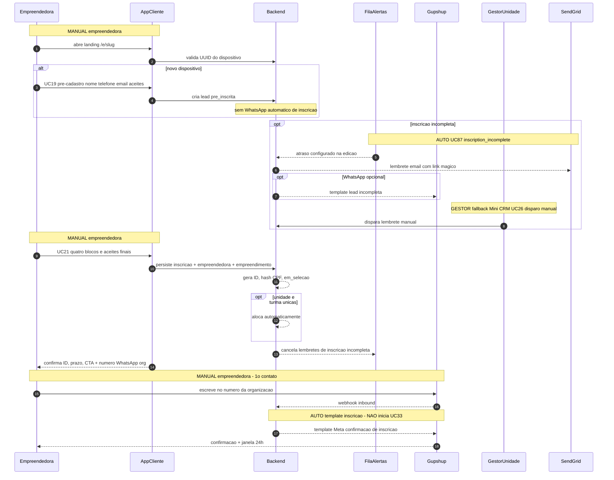
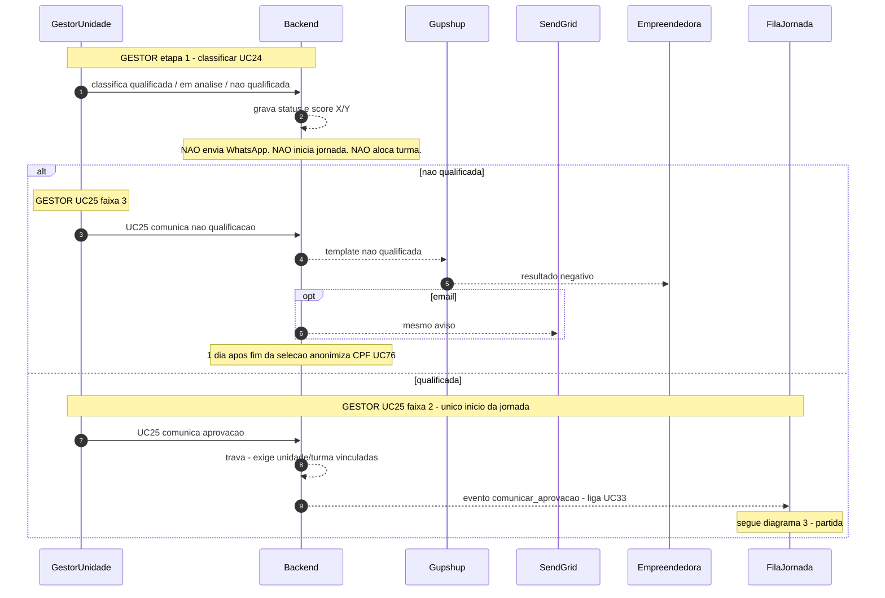
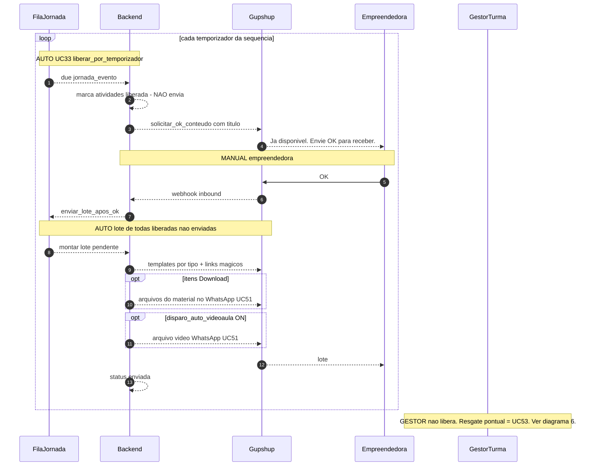
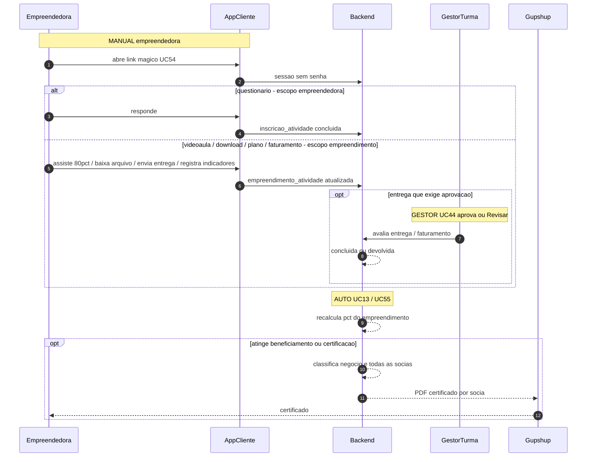
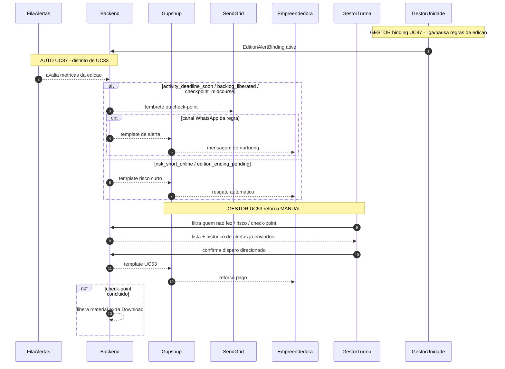

# Jornada online — diagramas de sequência

**Modalidade:** online (ex.: Empreende no Zap)  
**Convenções:** [README](README.md)  
**Fontes:** [Casos de Uso v7](../../Casos%20de%20Uso%20-%20Consulado%20da%20Mulher_v7.md) UC19–UC25, UC33, UC38, UC51, UC53, UC57, UC87; [ADR jornada online](../adr-jornada-online.md)

Índice

1. [Inscrição](#1-inscricao)
2. [Seleção](#2-selecao)
3. [Partida da jornada](#3-partida-da-jornada)
4. [Loop de conteúdo](#4-loop-de-conteudo)
5. [Consumo no Cliente](#5-consumo-no-cliente)
6. [Alertas e resgate](#6-alertas-e-resgate)
7. [Funil de encerramento](#7-funil-de-encerramento)
8. [Doação](#8-doacao)

Pós-liberação (PIX/recibo) e desistência: [pos-liberacao.md](pos-liberacao.md).

---

## 1. Inscrição

Landing da edição → pré-cadastro (lead) → inscrição completa (4 blocos) → CTA do número WhatsApp da organização → a empreendedora **escreve** nesse número → template Meta de inscrição.

O template de inscrição **abre a janela de 24h / opt-in**. **Não** inicia a jornada educacional (UC33).



| Passo | Momento | Tipo | Quem | Canal | O que NÃO faz |
| ----- | ------- | ---- | ---- | ----- | ------------- |
| 1–2 | Landing | MANUAL | Empreendedora | App Cliente | Não cria jornada |
| 3–5 | Pré-cadastro UC19 | MANUAL | Empreendedora | App Cliente | Não dispara WhatsApp de inscrição |
| opt | Lead abandonada | AUTO | FilaAlertas UC87 | E-mail (WA opcional) | Não inicia módulo |
| opt | Mini CRM UC26 | GESTOR | Unidade/Turma | E-mail / WA | Fallback; não substitui o alerta |
| 13–17 | Inscrição UC21 | MANUAL | Empreendedora | App Cliente | Não classifica nem comunica |
| 20–23 | 1º contato WA | MANUAL + AUTO | Empreendedora → Backend | Gupshup | **Não inicia UC33** |

Bloqueio de cadastro: idade &lt; 18. Internet e WhatsApp **pontuam** na régua; **não** impedem inscrição.

---

## 2. Seleção

Online **não** tem entrevista de seleção. Unidade classifica (UC24) e, em seguida, comunica (UC25). Turma única = vínculo automático. Classificar **não** envia WhatsApp e **não** liga a jornada.



| Passo | Momento | Tipo | Quem | Canal | O que NÃO faz |
| ----- | ------- | ---- | ---- | ----- | ------------- |
| 1–3 | Classificar UC24 | GESTOR | Unidade | App Gestor | Não envia WA; não inicia UC33; não aloca |
| alt | UC25 faixa 3 | GESTOR | Unidade | Gupshup / e-mail | Não liga jornada |
| else | UC25 faixa 2 | GESTOR | Unidade | — | **Único** gatilho que liga UC33. Sem entrevista (faixa 1 não existe no online) |

Faixa 1 (convite à entrevista) **não se aplica** ao online.

---

## 3. Partida da jornada

UC25 faixa 2 liga a orquestração. O backend envia o 1º template (pede **OK**). Só depois do OK a empreendedora recebe o 1º lote. **Liberada ≠ enviada.**

```mermaid
sequenceDiagram
  autonumber
  participant GestorUnidade
  participant Backend
  participant FilaJornada
  participant Gupshup
  participant Empreendedora
  participant GestorTurma

  Note over GestorUnidade,FilaJornada: GESTOR UC25 faixa 2 - 1o gatilho do modulo
  GestorUnidade ->> Backend: comunica aprovacao
  Backend -->> FilaJornada: cria jornada_evento e marca atividades iniciais
  FilaJornada -->> Backend: dispara 1o template do modulo

  Note over Backend,Empreendedora: AUTO template aprovacao - pede OK
  Backend -->> Gupshup: template aprovacao / boas-vindas
  Gupshup -->> Empreendedora: mensagem com pedido de OK
  Backend -->> Backend: fase aguardando_ok_participacao

  Note over Empreendedora,Gupshup: MANUAL empreendedora
  Empreendedora ->> Gupshup: responde OK
  Gupshup -->> Backend: webhook inbound OK
  Backend -->> FilaJornada: enviar_lote_apos_ok

  Note over FilaJornada,Empreendedora: AUTO 1o lote - so o que ja esta liberada
  FilaJornada -->> Backend: montar lote pendente
  Backend -->> Gupshup: itens do lote com login magico UC54
  Gupshup -->> Empreendedora: boas-vindas, comunidade, materiais, links
  Backend -->> Backend: status enviada nas itens do lote
  Backend -->> Backend: fase jornada ativa; agenda temporizadores

  Note over GestorTurma: GESTOR so acompanha. Nao libera atividade. Nao edita temporizador.
```

| Passo | Momento | Tipo | Quem | Canal | O que NÃO faz |
| ----- | ------- | ---- | ---- | ----- | ------------- |
| 1–3 | UC25 liga UC33 | GESTOR | Unidade | App Gestor | Não envia o lote de conteúdo ainda |
| 4–6 | 1º template | AUTO | FilaJornada | Gupshup | Não marca consumo; só pede OK |
| 7–9 | OK de participação | MANUAL | Empreendedora | WhatsApp | Sem OK não há envio |
| 10–14 | 1º lote | AUTO | Backend | Gupshup + link mágico | Não conclui atividade; **liberada ≠ enviada** |
| — | Acompanhamento | GESTOR | Turma | App Gestor | Não marca checkbox de liberação |

Envios respeitam janela comercial (seg–sex 8h–20h; sáb 8h–16h; domingo/feriado sem disparo). Falha → retry 48h ou `wa.me`.

---

## 4. Loop de conteúdo

Depois da partida, cada temporizador **libera** atividades **independente** de a anterior ter sido concluída. O envio continua sendo **OK** → lote de todas as `liberada` ainda não enviadas.

Maratona (acumular e fazer o lote depois) é **comportamento esperado**, não risco.



| Passo | Momento | Tipo | Quem | Canal | O que NÃO faz |
| ----- | ------- | ---- | ---- | ----- | ------------- |
| 1–2 | Temporizador | AUTO | FilaJornada | — | Só marca `liberada`; **não envia** |
| 3–4 | Pedir OK | AUTO | Backend | Gupshup | Não entrega material |
| 5–7 | OK de conteúdo | MANUAL | Empreendedora | WhatsApp | Sem OK o lote não sai |
| 8–12 | Lote | AUTO | Backend | Gupshup | Não conclui atividade; conclusão é no Cliente |
| opt | Itens **Download** | AUTO | Backend | Gupshup | Template + **arquivos** no WhatsApp; os mesmos docs no Cliente |
| — | Flag videoaula OFF | Config edição UC9 | — | — | Lote **sem** arquivo de vídeo; **Download** continua no lote |

Texto aberto WhatsApp = mensagem de jornada, **não** aula pedagógica da matriz de tipos.

---

## 5. Consumo no Cliente

O lote entrega **links mágicos** e, no tipo **Download**, **os arquivos** no WhatsApp da empreendedora. O consumo oficial (conclusão) é no Aplicativo Cliente — os mesmos documentos de Download ficam nessa tela. Questionários são **por pessoa**; presença, planos, faturamento, download e plano de ação são do **empreendimento**. Percentuais 50% / 75% (variáveis na edição) calculam sobre o negócio; o certificado cai em cascata nas sócias.



| Passo | Momento | Tipo | Quem | Canal | O que NÃO faz |
| ----- | ------- | ---- | ---- | ----- | ------------- |
| 1–2 | Login mágico | MANUAL | Empreendedora | App Cliente | Sem senha |
| 3–4 | Questionário | MANUAL | Empreendedora | App Cliente | Não conta 1× para o negócio até cada sócia responder |
| 5–6 | Atividade compartilhada | MANUAL | Qualquer sócia | App Cliente | 1 registro no empreendimento |
| opt | Aprovação UC44 | GESTOR | Turma | App Gestor | Não libera próxima atividade no online |
| 10–13 | Certificado UC55 | AUTO | Backend | Gupshup | Não concede doação |

---

## 6. Alertas e resgate

Fila de alertas (UC87) **corre em paralelo** à FilaJornada. Não substitui o OK/lote. O gestor ainda pode disparar **UC53** (manual, só online).

Risco curto online: liberadas sem realização **há mais de 10 dias** **ou** a **5 dias do término** com pendências. Quem está **represada ativa** (acesso recente + fila grande) **não** entra no filtro de risco. Maratona é saudável.



| Passo | Momento | Tipo | Quem | Canal | O que NÃO faz |
| ----- | ------- | ---- | ---- | ----- | ------------- |
| 1 | Binding da edição | GESTOR | Unidade | App Gestor | Não cria tipo novo de gatilho (isso é CMS) |
| 2–8 | Regras UC87 | AUTO | FilaAlertas | E-mail / WA | Não libera nem envia lote de conteúdo (UC33) |
| 9–13 | UC53 | GESTOR | Turma ou Unidade | Gupshup | Não existe em P/H; não pune maratona |

---

## 7. Funil de encerramento

Gatilho de **liberação para doação** no online. Transmissão **fora** da plataforma (YouTube + StreamYard). Sistema **não** aprova doação.

```mermaid
sequenceDiagram
  autonumber
  participant Backend
  participant GestorUnidade
  participant SendGrid
  participant Empreendedora
  participant YouTube
  participant AppCliente
  participant GestorTurma

  Note over Backend: AUTO pre-requisito
  Backend -->> Backend: empreendimento com 100pct das atividades

  Note over GestorUnidade,SendGrid: GESTOR convite live - so quem fez 100pct
  GestorUnidade ->> Backend: dispara convite live UC38
  Backend -->> SendGrid: e-mail com link da live
  SendGrid -->> Empreendedora: convite
  Note over Empreendedora,YouTube: MANUAL empreendedora - transmissao externa
  Empreendedora ->> YouTube: assiste live YouTube + StreamYard

  Note over Backend,AppCliente: AUTO apos o termino - libera atividade de presenca
  Backend -->> AppCliente: atividade presenca / palavra-chave
  Note over Empreendedora,AppCliente: MANUAL empreendedora - prazo rigido
  Empreendedora ->> AppCliente: informa KW
  AppCliente ->> Backend: valida caixa/acento; grava timestamp
  alt KW invalida ou fora do prazo
    Backend -->> AppCliente: nao libera questionario
  else KW valida
    Note over Empreendedora,AppCliente: MANUAL questionario final
    Empreendedora ->> AppCliente: responde questionario
    AppCliente ->> Backend: corrige
    alt 100pct certo
      Backend -->> Backend: status liberada para doacao
      Note over GestorTurma,GestorUnidade: GESTOR ainda precisa sugerir/aprovar UC57
    else erro ou incompleto
      Backend -->> AppCliente: nao libera doacao - retenta no prazo da edicao
    end
  end
```

| Passo | Momento | Tipo | Quem | Canal | O que NÃO faz |
| ----- | ------- | ---- | ---- | ----- | ------------- |
| 1 | 100% atividades | AUTO | Backend | — | Quem não fez 100% **não** entra na live |
| 2–4 | Convite | GESTOR | Unidade | E-mail (preferência) | Live não é na plataforma |
| 5 | Assistir | MANUAL | Empreendedora | YouTube | Assistir sozinho não libera doação |
| 6–8 | Presença/KW | MANUAL | Empreendedora | App Cliente | Fora do prazo ou KW inválida → sem quiz |
| 11–14 | Quiz 100% certo | MANUAL | Empreendedora | App Cliente | Libera **para** doação; **não aprova** doação |
| — | Ranking | GESTOR | Consulado | — | Só se o orçamento não cobrir todas as liberadas |

---

## 8. Doação

Só empreendimentos **liberados pelo funil**. Turma e Unidade **sugerem no empreendimento**; Unidade **aprova só na tela Doação** (pop-up + digitar **APROVAR**). Não há doação automática. Depois: [pos-liberacao.md](pos-liberacao.md).

```mermaid
sequenceDiagram
  autonumber
  participant GestorTurma
  participant GestorUnidade
  participant Backend
  participant AppCliente
  participant Empreendedora

  Note over GestorTurma,Backend: GESTOR sugerir no empreendimento - so liberadas
  GestorTurma ->> Backend: sugere doacao UC57
  Backend -->> Backend: bloqueia se nao estiver liberada para doacao
  Backend -->> Backend: registra sugerido_por

  Note over GestorUnidade,Backend: GESTOR aprovar so em /doacao
  GestorUnidade ->> Backend: inicia aprovacao
  Backend -->> GestorUnidade: popup resumo
  GestorUnidade ->> Backend: digita APROVAR
  alt cancela ou texto invalido
    Backend -->> Backend: nenhum status novo
  else confirma
    Backend -->> Backend: doacao aprovada; aprovado_por
    Backend -->> AppCliente: status aguarde - sem datas de pagamento
    AppCliente -->> Empreendedora: aguarde orientacoes da educadora
    Note over Backend: segue pos-liberacao UC86
  end
```

| Passo | Momento | Tipo | Quem | Canal | O que NÃO faz |
| ----- | ------- | ---- | ---- | ----- | ------------- |
| 1–3 | Sugerir UC57 | GESTOR | Turma (Unidade também pode) | App Gestor — negócio | Bloqueado sem funil UC38; **não** aprova |
| 4–8 | Aprovar | GESTOR | Unidade | App Gestor — `/doacao` | Sem APROVAR digitado = nenhum status novo |
| 9–10 | Aviso Cliente | AUTO | Backend | App Cliente | Sem data de pagamento; **≠ garantia** |
| — | Filtros A–D / lote UC14 | GESTOR | Unidade | App Gestor | Auxiliares; não substituem o funil |
