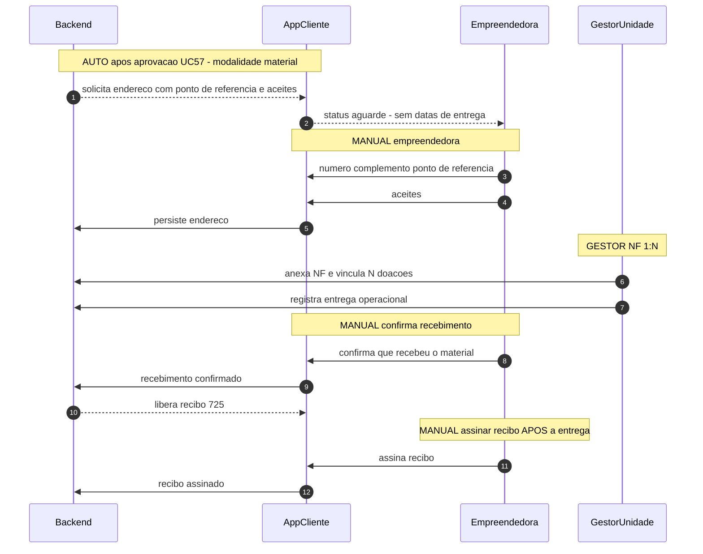
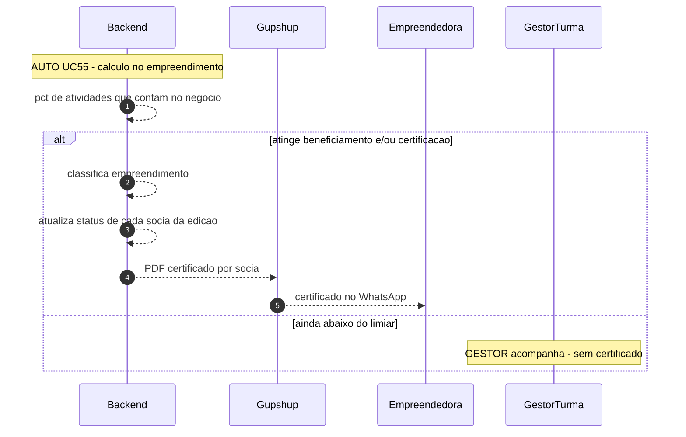
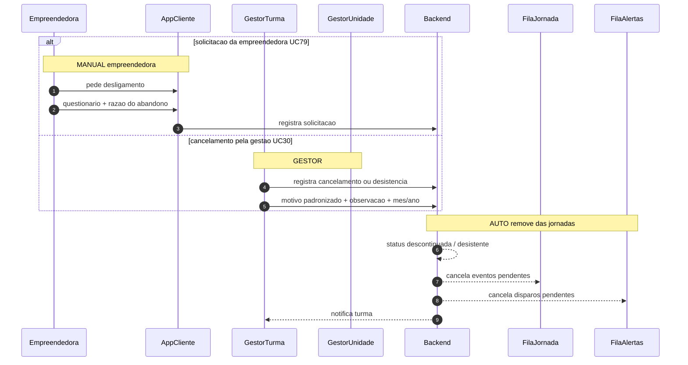

# Pós-liberação da doação e desistência

**Comum** às jornadas [online](online.md) e [presencial/híbrido](presencial-hibrido.md).  
**Convenções:** [README](README.md)  
**Fontes:** [Casos de Uso v7](../../Casos%20de%20Uso%20-%20Consulado%20da%20Mulher_v7.md) UC30, UC55, UC57, UC79, UC86

Chega-se aqui **depois** da aprovação da Unidade na tela Doação (UC57: pop-up + digitar **APROVAR**). No online, a empreendedora já passou pelo funil (liberada para doação) **e** pela aprovação. No presencial ou híbrido, só a aprovação manual — a sugestão pode ter sido da Turma ou da Unidade.

Índice

1. [Dinheiro — PIX / conta e recibo 725](#1-dinheiro--pix--conta-e-recibo-725)
2. [Material — NF 1:N, confirmação e recibo](#2-material--nf-1n-confirmacao-e-recibo)
3. [Certificado em cascata](#3-certificado-em-cascata)
4. [Desistência UC30 / UC79](#4-desistencia-uc30--uc79)

O Cliente mostra **aguarde** — sem datas prometidas de pagamento ou entrega.

---

## 1. Dinheiro — PIX / conta e recibo 725

Nome e CPF são **readonly** (cadastro). Recibo da conta **725** é assinado **antes** do pagamento.

```mermaid
sequenceDiagram
  autonumber
  participant Backend
  participant AppCliente
  participant Empreendedora
  participant GestorUnidade

  Note over Backend,AppCliente: AUTO apos aprovacao UC57 - modalidade dinheiro
  Backend -->> AppCliente: solicita dados bancarios / PIX e aceites
  AppCliente -->> Empreendedora: nome e CPF readonly; conta/PIX editaveis
  AppCliente -->> Empreendedora: status aguarde - sem datas

  Note over Empreendedora,AppCliente: MANUAL empreendedora UC86
  Empreendedora ->> AppCliente: informa banco agencia conta ou chave PIX
  Empreendedora ->> AppCliente: conclui aceites da edicao
  AppCliente ->> Backend: persiste dados

  Note over GestorUnidade: GESTOR confere
  GestorUnidade ->> Backend: valida dados bancarios

  Note over Empreendedora,AppCliente: MANUAL assinar recibo ANTES do pagamento
  Backend -->> AppCliente: libera recibo conta 725
  Empreendedora ->> AppCliente: assina recibo
  AppCliente ->> Backend: recibo assinado
  Note over GestorUnidade: GESTOR opera pagamento fora do app - sem data na tela da empreendedora
```

| Passo | Momento | Tipo | Quem | Canal | O que NÃO faz |
| ----- | ------- | ---- | ----- | ----- | ------------- |
| 1–3 | Pedir dados | AUTO | Backend | App Cliente | Não promete data de crédito |
| 4–6 | Informar PIX/conta | MANUAL | Empreendedora | App Cliente | Não altera nome/CPF |
| 7 | Conferir | GESTOR | Unidade | App Gestor | Não é aprovação da doação (já ocorreu) |
| 8–10 | Recibo 725 | MANUAL | Empreendedora | App Cliente | Dinheiro: assinatura **antes** do pagamento |

---

## 2. Material — NF 1:N, confirmação e recibo

Uma nota fiscal pode cobrir **N** doações. O recibo só libera **depois** que a empreendedora confirma o recebimento. Endereço de entrega: número, complemento e **ponto de referência**.



| Passo | Momento | Tipo | Quem | Canal | O que NÃO faz |
| ----- | ------- | ---- | ---- | ----- | ------------- |
| 1–5 | Endereço + aceites | AUTO + MANUAL | Backend / Empreendedora | App Cliente | Sem data de entrega na tela |
| 6–7 | NF 1:N | GESTOR | Unidade | App Gestor | Uma NF → várias doações; não substitui a confirmação da empreendedora |
| 8–10 | Confirmar recebimento | MANUAL | Empreendedora | App Cliente | Sem confirmação o recibo **permanece bloqueado** |
| 11–12 | Recibo 725 | MANUAL | Empreendedora | App Cliente | Material: assinatura **depois** da entrega |

Estados materiais: aprovada → NF vinculada → confirma recebimento → recibo liberado → assinado.

---

## 3. Certificado em cascata

Independente da doação. Quando o **empreendimento** atinge o % de beneficiamento / certificação da edição (em geral 50% / 75% — UC13), o backend emite PDF para **cada sócia**.

Pode ocorrer durante a formação (ao cruzar o limiar) ou no encerramento — o gatilho é o percentual, não a doação.



| Passo | Momento | Tipo | Quem | Canal | O que NÃO faz |
| ----- | ------- | ---- | ---- | ----- | ------------- |
| 1–5 | Emitir certificado | AUTO | Backend | Gupshup | Não concede doação; BI conta N pessoas e 1 empreendimento |
| else | Abaixo do % | GESTOR | Turma | App Gestor | Exceções pontuais; não altera o cálculo padrão |

Doação = **1 por empreendimento**, mesmo com N sócias certificadas.

---

## 4. Desistência UC30 / UC79

Pode ocorrer em **qualquer fase** das duas jornadas. Remove a participante das automações: FilaJornada (online), FilaAlertas, e liberações futuras.



| Passo | Momento | Tipo | Quem | Canal | O que NÃO faz |
| ----- | ------- | ---- | ---- | ----- | ------------- |
| alt UC79 | Pedido no Cliente | MANUAL | Empreendedora | App Cliente | Formalização completa segue UC30 |
| else UC30 | Registro da gestão | GESTOR | Turma ou Unidade | App Gestor | Data completa fica no log; UI usa mês/ano para frequência |
| 8–11 | Sair das filas | AUTO | Backend | FilaJornada + FilaAlertas | Não apaga histórico já ocorrido; interrompe o que ainda estava pendente |

No presencial ou híbrido, `FilaJornada` não está ativa; o cancelamento ainda interrompe alertas e tira a participante das liberações/comunicação operacional.
