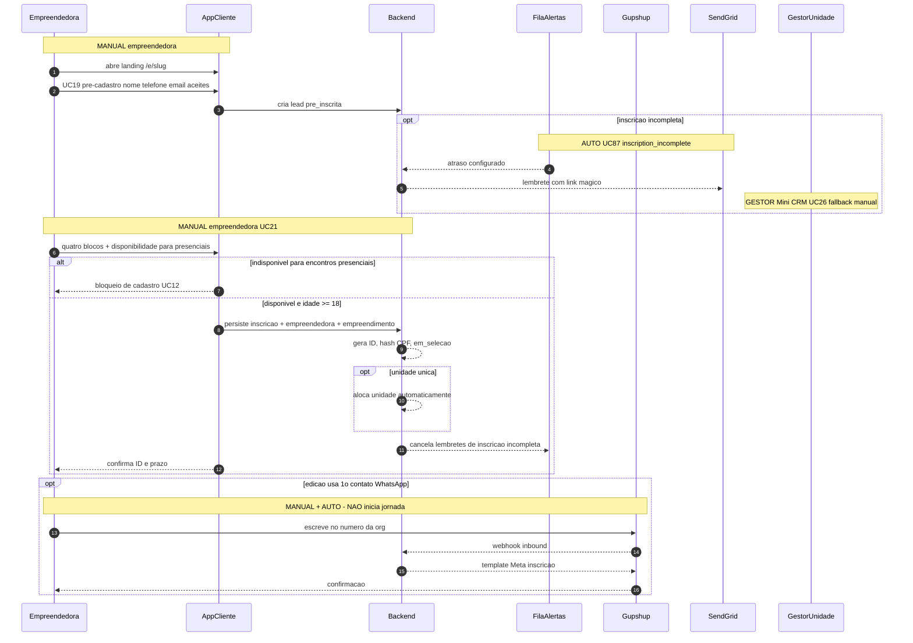
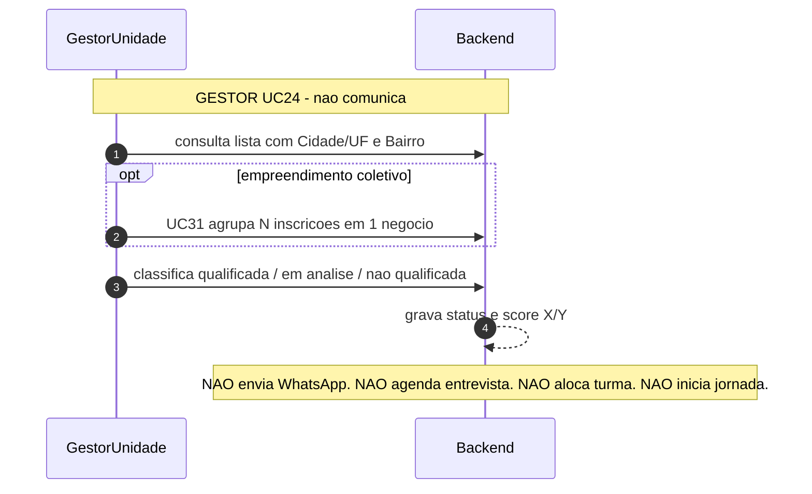
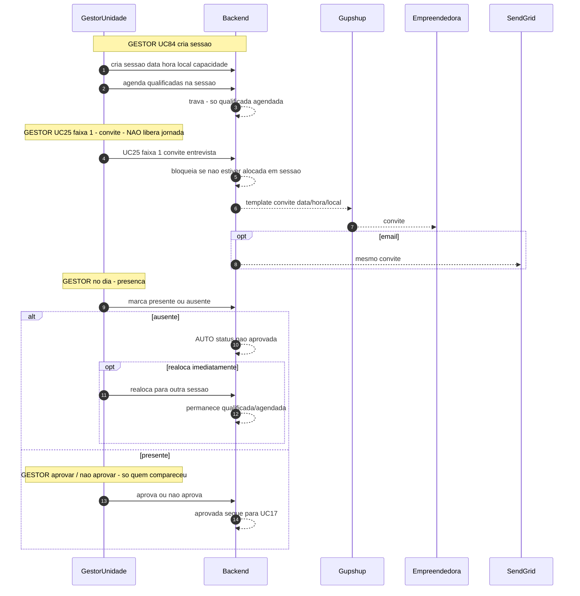
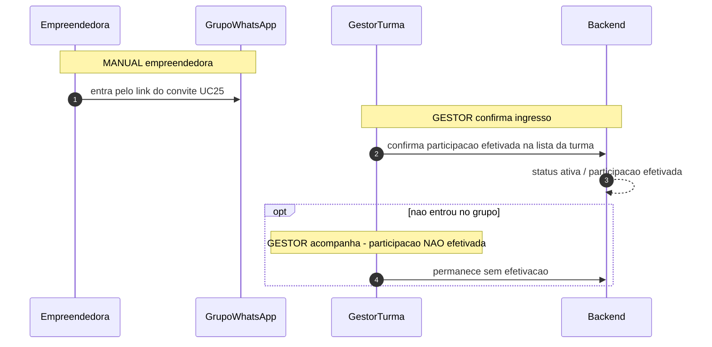
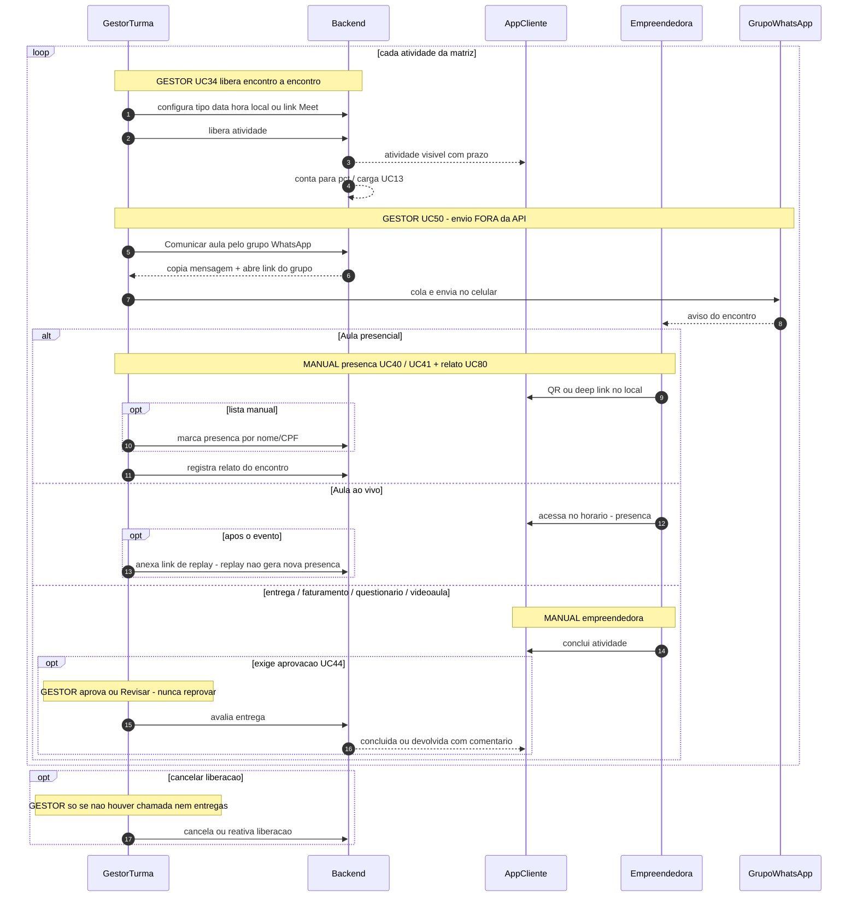
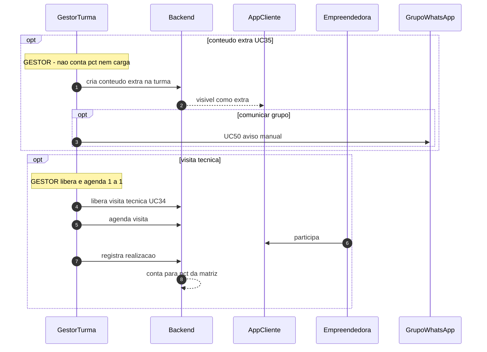
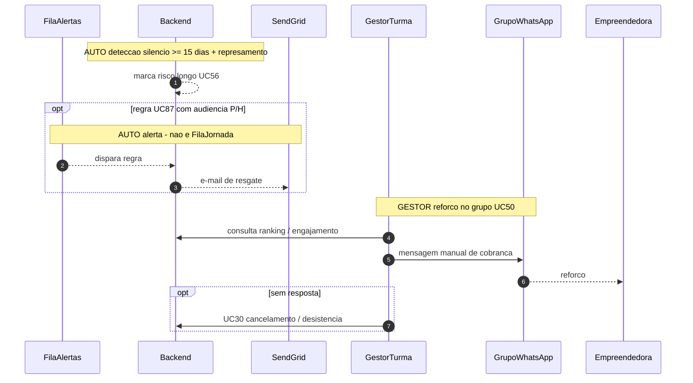
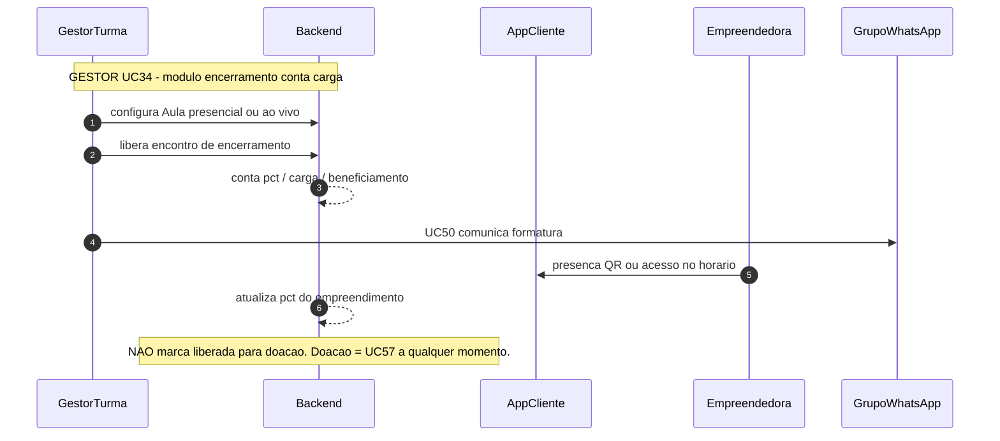

# Jornada presencial / híbrido — diagramas de sequência

**Modalidade:** presencial e híbrido (mesmo comportamento operacional; a distinção é só no BI)  
**Convenções:** [README](README.md)  
**Fontes:** [Casos de Uso v7](../../Casos%20de%20Uso%20-%20Consulado%20da%20Mulher_v7.md) UC16–UC17, UC24–UC25, UC34–UC35, UC40–UC44, UC50, UC57, UC84; [módulo encerramento P/H](../../prototipo/aplicativo-gestor/gestor-unidade/12-modulo-encerramento-ph.md)

Índice

1. [Inscrição](#1-inscricao)
2. [Seleção — classificar](#2-selecao--classificar)
3. [Seleção — entrevista](#3-selecao--entrevista)
4. [Seleção — alocar e comunicar](#4-selecao--alocar-e-comunicar)
5. [Efetivação da participação](#5-efetivacao-da-participacao)
6. [Loop de encontro](#6-loop-de-encontro)
7. [Conteúdo extra e visita técnica](#7-conteudo-extra-e-visita-tecnica)
8. [Risco de evasão — duração longa](#8-risco-de-evasao--duracao-longa)
9. [Encerramento](#9-encerramento)
10. [Doação](#10-doacao)

Pós-liberação (PIX/recibo) e desistência: [pos-liberacao.md](pos-liberacao.md).

Não há FilaJornada (UC33) nem mensagens direcionadas UC53 neste fluxo. Depois do UC25, WhatsApp operacional = **grupo da turma** (UC50), envio **fora** da API.

---

## 1. Inscrição

Núcleo igual ao online (pré-cadastro → 4 blocos → ID). Diferenças: **bloqueio** se a candidata declara indisponibilidade para encontros presenciais; 1º contato WhatsApp é **opcional** (se a edição usar o número da org).



| Passo | Momento | Tipo | Quem | Canal | O que NÃO faz |
| ----- | ------- | ---- | ---- | ----- | ------------- |
| 1–3 | Pré-cadastro UC19 | MANUAL | Empreendedora | App Cliente | Não dispara jornada |
| opt | Lead abandonada | AUTO / GESTOR | FilaAlertas / Mini CRM | E-mail | Não classifica |
| 8–9 | Disponibilidade | MANUAL | Empreendedora | App Cliente | Indisponível = **não cadastra** (P/H) |
| 10–14 | Inscrição UC21 | MANUAL | Empreendedora | App Cliente | Não aloca turma se houver várias; não inicia jornada |
| opt | 1º contato WA | MANUAL + AUTO | Empreendedora → Backend | Gupshup | **Não** é o UC25; **não** convoca entrevista |

---

## 2. Seleção — classificar

Etapa 1, comum a todas as modalidades. Qualificação é do **empreendimento**. Gestor pode agrupar sócias (UC31) nesta tela.



| Passo | Momento | Tipo | Quem | Canal | O que NÃO faz |
| ----- | ------- | ---- | ---- | ----- | ------------- |
| 1–5 | Classificar UC24 | GESTOR | Unidade | App Gestor | Não envia WA; não inicia jornada; não aloca; não cria sessão de entrevista |

Rodadas: o gestor pode voltar a qualificar mais candidatas até a meta da edição.

---

## 3. Seleção — entrevista

Só P/H. Ausente → **não aprovada automaticamente**, salvo realocação imediata para outra sessão. Convite (UC25 faixa 1) só para quem já está **alocada em sessão**.



| Passo | Momento | Tipo | Quem | Canal | O que NÃO faz |
| ----- | ------- | ---- | ---- | ----- | ------------- |
| 1–3 | Criar/agendar sessão | GESTOR | Unidade | App Gestor | Não inicia jornada |
| 4–8 | UC25 faixa 1 | GESTOR | Unidade | Gupshup / e-mail | **Não** libera jornada; bloqueia sem alocação em sessão |
| 9 | Presença | GESTOR | Unidade | App Gestor | Não agendada não pode ser decidida nesta sessão |
| alt | Ausente | AUTO | Backend | — | Vira não aprovada, salvo realocar |
| 14–15 | Aprovar | GESTOR | Unidade | App Gestor | Aprovada **ainda não** entra na turma nem na jornada |

---

## 4. Seleção — alocar e comunicar

Alocar (UC17) **não** inicia jornada. Liberação = UC25 **faixa 2**, com trava: aprovada + turma + **link do grupo WhatsApp** (UC16). O grupo é criado **depois** da aprovação, no WhatsApp, com o número corporativo como admin. O sistema **não** cria grupo via API.

```mermaid
sequenceDiagram
  autonumber
  participant GestorUnidade
  participant Backend
  participant Gupshup
  participant SendGrid
  participant Empreendedora

  alt varias turmas na unidade
    Note over GestorUnidade,Backend: GESTOR UC17 - NAO inicia jornada
    GestorUnidade ->> Backend: aloca aprovadas nas turmas
    opt distribuir automaticamente
      Backend -->> Backend: equilibra vagas; prioriza manha/tarde se o nome indicar
    end
  else turma unica
    Backend -->> Backend: vinculo automatico
  end
  Note over Backend: alocar NAO muda status de aprovacao e NAO liga jornada

  Note over GestorUnidade: GESTOR cadastra link do grupo UC16 apos criar o grupo no WhatsApp
  GestorUnidade ->> Backend: grava link/codigo do grupo da turma

  alt faixa 2 - aprovada + turma + link grupo
    Note over GestorUnidade,Gupshup: GESTOR UC25 faixa 2 - UNICO inicio da jornada P/H
    GestorUnidade ->> Backend: UC25 comunica liberacao
    Backend -->> Backend: bloqueia sem turma ou sem link de grupo
    Backend -->> Gupshup: template boas-vindas + link do grupo
    Gupshup -->> Empreendedora: convite ao grupo
    opt email
      Backend -->> SendGrid: mesmo aviso
    end
    Backend -->> Backend: jornada_iniciada_em; participacao efetivavel
  else faixa 3 - nao qualificada / nao aprovada / faltosa
    Note over GestorUnidade: GESTOR UC25 faixa 3 - NAO libera jornada
    GestorUnidade ->> Backend: comunica resultado negativo
    Backend -->> Gupshup: template nao aprovacao
    Gupshup -->> Empreendedora: resultado
    Note over Backend: 1 dia apos fim da selecao anonimiza CPF UC76
  end
```

| Passo | Momento | Tipo | Quem | Canal | O que NÃO faz |
| ----- | ------- | ---- | ---- | ----- | ------------- |
| 1–4 | Alocar UC17 | GESTOR / AUTO se turma única | Unidade | App Gestor | **Não** inicia jornada; **não** muda status |
| 6 | Link do grupo UC16 | GESTOR | Unidade | App Gestor | Sistema não cria o grupo |
| 7–12 | UC25 faixa 2 | GESTOR | Unidade | Gupshup | Bloqueia sem turma ou sem link; **único** envio API pago operacional |
| 13–16 | UC25 faixa 3 | GESTOR | Unidade | Gupshup | Não liga jornada |

Se a candidata não puder receber template via API: facilitador `wa.me` individual.

---

## 5. Efetivação da participação

Quem **não entra no grupo da turma** não tem participação efetivada. O gestor confirma o ingresso na lista.



| Passo | Momento | Tipo | Quem | Canal | O que NÃO faz |
| ----- | ------- | ---- | ---- | ----- | ------------- |
| 1 | Entrar no grupo | MANUAL | Empreendedora | WhatsApp grupo | Sem API; o sistema não adiciona membros |
| 2–3 | Confirmar ingresso | GESTOR | Turma | App Gestor | Sem confirmação, não está efetivada |
| opt | Não entrou | GESTOR | Turma | — | Não dispara lote de conteúdo (não existe lote P/H) |

---

## 6. Loop de encontro

O Gestor de Turma **escolhe** o que liberar (UC34), configura data/local ou Meet, e comunica o grupo com o facilitador (copia + abre o WhatsApp). Envio efetivo é **manual**, no celular corporativo.



| Passo | Momento | Tipo | Quem | Canal | O que NÃO faz |
| ----- | ------- | ---- | ---- | ----- | ------------- |
| 1–4 | Liberar UC34 | GESTOR | Turma | App Gestor | Sem temporizador; sem lote Gupshup |
| 5–8 | Comunicar grupo UC50 | GESTOR | Turma | WhatsApp grupo (manual) | **Não** usa Gupshup; sem confirmação de entrega no sistema |
| 9–12 | Presença presencial | MANUAL / GESTOR | Empreendedora / Turma | QR ou lista | 1 sócia presente = presença do empreendimento |
| 13–15 | Aula ao vivo | MANUAL | Empreendedora | App Cliente / Meet | Replay não gera nova presença; **não** libera doação |
| 16–19 | Entregas UC44 | MANUAL + GESTOR | Empreendedora + Turma | App Cliente / Gestor | Revisar ≠ reprovar |
| opt | Cancelar | GESTOR | Turma | App Gestor | Bloqueado se já houver presença ou entrega |

Prazo padrão D+2 nas atividades assíncronas. Unidade pode operar tudo o que a Turma faz, além da seleção.

---

## 7. Conteúdo extra e visita técnica

Fora do loop feliz da matriz. Extra **não** conta %/carga e **não existe** no online. Visita técnica só P/H.



| Passo | Momento | Tipo | Quem | Canal | O que NÃO faz |
| ----- | ------- | ---- | ---- | ----- | ------------- |
| opt extra UC35 | Criar extra | GESTOR | Turma | App Gestor | Não entra em % / carga / beneficiamento |
| opt visita | Liberar + agendar | GESTOR | Turma | App Gestor | Não existe no online |

---

## 8. Risco de evasão — duração longa

Perfil P/H longo (6–12 meses): silêncio ≥ **15 dias** + represamento. **Não** usar o filtro curto do online (10d / 5d do fim). Não há UC53. Cobrança operacional = grupo (UC50). Alertas UC87 só se a regra tiver audiência P/H (ex. e-mail).



| Passo | Momento | Tipo | Quem | Canal | O que NÃO faz |
| ----- | ------- | ---- | ---- | ----- | ------------- |
| 1 | Detectar risco longo | AUTO | Backend | — | Não dispara lote WA pago |
| opt | UC87 | AUTO | FilaAlertas | E-mail típico | Não usa UC53 |
| 5–7 | Reforço | GESTOR | Turma | Grupo WhatsApp | Sem API Gupshup de jornada |

---

## 9. Encerramento

Formatura / integração, se contar carga, é **módulo ou aula obrigatória** na grade de Módulos — tipo **Aula** (presencial ou Meet). **Não** é o funil Live → KW → Quiz. **Não** libera doação.



| Passo | Momento | Tipo | Quem | Canal | O que NÃO faz |
| ----- | ------- | ---- | ---- | ----- | ------------- |
| 1–3 | Liberar aula de encerramento | GESTOR | Turma | App Gestor | Não usa KW/quiz; não libera doação |
| 4–6 | Presença | MANUAL | Empreendedora | App Cliente / local | Não substitui a análise UC57 |

---

## 10. Doação

Análise **manual a qualquer momento** do programa (inclusive em massa), independente do módulo de encerramento. Turma e Unidade **sugerem no empreendimento**; Unidade **aprova só na tela Doação** (pop-up + digitar **APROVAR**). Não há doação automática. Depois: [pos-liberacao.md](pos-liberacao.md).

```mermaid
sequenceDiagram
  autonumber
  participant GestorTurma
  participant GestorUnidade
  participant Backend
  participant AppCliente
  participant Empreendedora

  Note over GestorTurma,Backend: GESTOR sugerir no empreendimento - qualquer momento
  GestorTurma ->> Backend: sugere doacao UC57
  Backend -->> Backend: nao exige 100pct nem live nem KW
  Backend -->> Backend: registra sugerido_por

  Note over GestorUnidade,Backend: GESTOR aprovar so em /doacao
  GestorUnidade ->> Backend: inicia aprovacao
  Backend -->> GestorUnidade: popup resumo
  GestorUnidade ->> Backend: digita APROVAR
  alt cancela ou texto invalido
    Backend -->> Backend: nenhum status novo
  else confirma
    Backend -->> Backend: doacao aprovada; aprovado_por
    Backend -->> AppCliente: status aguarde - sem datas
    AppCliente -->> Empreendedora: aguarde orientacoes da educadora
    Note over Backend: segue pos-liberacao UC86
  end
```

| Passo | Momento | Tipo | Quem | Canal | O que NÃO faz |
| ----- | ------- | ---- | ---- | ----- | ------------- |
| 1–3 | Sugerir UC57 | GESTOR | Turma (Unidade também pode) | App Gestor — negócio | Não espera funil online; **não** aprova |
| 4–8 | Aprovar | GESTOR | Unidade | App Gestor — `/doacao` | Sem APROVAR digitado = nenhum status novo |
| 9–10 | Aviso Cliente | AUTO | Backend | App Cliente | Sem data de pagamento; **≠ garantia** |
| — | Filtros A–D | GESTOR | Unidade | App Gestor | Auxiliares; não substituem a análise manual |
