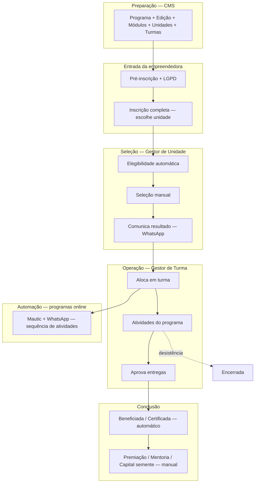

O fluxo operacional simplificado, conforme **Casos de Uso v4** e **[Design.md](http://Design.md)**, é este:

## Visão em uma linha

**Admin configura → empreendedora se inscreve → unidade seleciona → turma opera o programa → sistema conclui/certifica → gestão registra premiação/mentoria/capital semente (manual).**

---

## Macrofluxo



---

## Passo a passo (quem faz o quê)

### 0. Antes de abrir inscrições (Administrador — CMS)

- Cadastra **programa**, **edição**, **módulos/atividades**, **unidades**, **turmas**, colaboradores e critérios (seleção, certificação, premiação).

### 1. Pré-inscrição e inscrição (Empreendedora — Aplicativo Cliente)

- Acessa link da edição → aceita LGPD/comunicação → **pré-cadastro** → **inscrição completa** (dados + **escolha da unidade**).

- Login sempre por **link mágico** (WhatsApp/e-mail), sem senha.

### 2. Seleção (Gestor de Unidade)

- Sistema valida **elegibilidade** automaticamente.

- Gestor **seleciona** quem entra no programa.

- Sistema **comunica** aprovadas/reprovadas por WhatsApp.

### 3. Alocação e início (Gestor de Turma)

- **Aloca** a selecionada em uma **turma**.

- Em programa **online**: isso **dispara a jornada** no Mautic (mensagens e atividades via WhatsApp).

- Em programa **presencial**: gestor define datas, locais e sequência dos encontros.

### 4. Aplicação do programa (Empreendedora + Gestor de Turma)

| Empreendedora faz | Gestor de turma faz |

|-------------------|---------------------|

| Videoaulas, testes, presença (QR/link), tarefas, dados financeiros mensais | **Aprova ou reprova** tarefas e financeiro |

| Recebe lembretes/links no WhatsApp (online) | Presença manual, aulas extras, comunicação no grupo (manual) |

| Indicadores baseline/endline, NPS | Pode inserir dados em nome dela (casos de vulnerabilidade) |

**Regra central:** engajamento = **concluir atividade**; entregas importantes exigem **ok do gestor**.

### 5. Conclusão

- **Automático (backend):** status beneficiada/certificada + **certificado** quando cumprir regras da edição.

- **Manual (gestão):** **premiação** (UC57), **mentoria** (UC70), **capital semente** (UC58 — análise pela unidade).

### Ramificação a qualquer momento

- **Cancelamento / desistência** → participante sai do fluxo ativo.

---

## Status da participante (simplificado)

```

pré-inscrita → inscrita → selecionada → em assessoria

    → beneficiada → certificada → contemplada (premiação/mentoria/capital)

```

_(ou_ _descontinuada\*\* se cancelar/desistir)_

---

## Hierarquia dos dados (sempre presente)

```

Programa → Edição → Unidade → Turma → Participante

```

---

## Dois modos de programa

| | **Online** | **Presencial** |

|--|-----------|----------------|

| Quem conduz a sequência | **Mautic** (temporizadores no CMS) | **Gestor de turma** |

| Canal principal | WhatsApp individual (Gupshup) | Encontros + grupo WhatsApp manual |

| Liberação de conteúdo | Automática, etapa a etapa | Gestor reordena presenciais |

---

## O que fica fora desse fluxo principal

- **BI:** dashboards e relatórios (acompanhamento, não operação diária).

- **Base legada:** só consulta de histórico passado.

- **CMS:** modelagem — não é o dia a dia da turma.

Em resumo: a **empreendedora** consome e entrega; o **gestor de turma** valida e opera a turma; o **gestor de unidade** seleciona e decide benefícios maiores; o **backend/Mautic** automatiza mensagens, status e certificado onde as regras permitirem.
