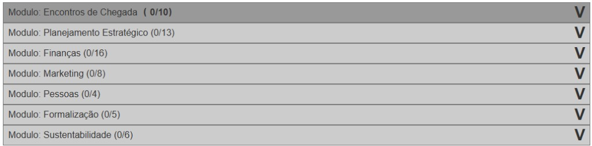
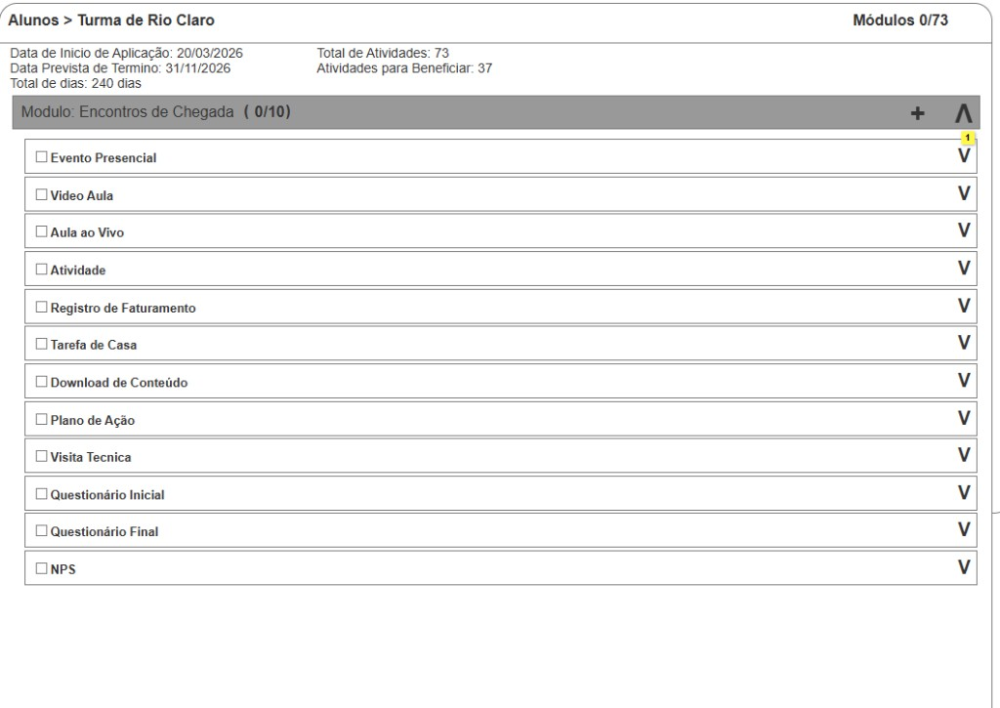
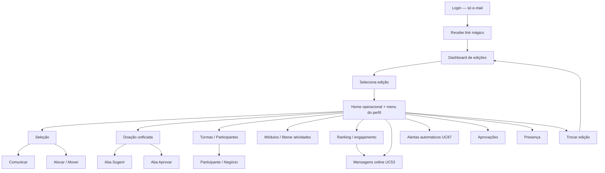

# Protótipo — Aplicativo Gestor (Unidade + Turma)

**Versão:** unificado — ago/2026 (alinhado à v6)  
**Fontes:** [Casos de Uso v7](../Casos%20de%20Uso%20-%20Consulado%20da%20Mulher_v7.md), [Design.md](../Design.md), reuniões jun–ago/2026  
**Substitui:** [Aplicativo Gestor de Unidade.md](Aplicativo%20Gestor%20de%20Unidade.md) e [Aplicativo Gestor de Turma.md](Aplicativo%20Gestor%20de%20Turma.md) (stubs de redirecionamento)

---

## Princípio de produto

Um único **Aplicativo Gestor**, com **tela e navegação unificadas**. O perfil define o **escopo de dados** e quais ações aparecem — não dois apps distintos.

| Perfil | Escopo | Capacidades |
| ------ | ------ | ----------- |
| **Gestor de Turma** | Apenas a(s) turma(s) sob sua responsabilidade | Operação da turma: liberar atividades, presença, aprovações de entrega, negócios, visitas, comunicação, **sugerir doação** |
| **Gestor de Unidade** | **Todas** as turmas da unidade | **Tudo o que o Gestor de Turma faz**, mais: seleção em **3 etapas** (classificar / **entrevista de seleção** P/H / alocar), comunicar, mover entre turmas/unidades **a qualquer momento**, **aprovar doação** (e também **sugerir** doação, inclusive em massa) |

**Doação (UC57):** o Gestor de Turma **indica/sugere**; o Gestor de Unidade **aprova**. O Gestor de Unidade pode **sugerir e, em seguida, aprovar** na mesma tela unificada (fluxo em dois passos rastreáveis, mesmo ator).

**Autenticação:** exclusivamente por **link mágico** (e-mail). O gestor informa o e-mail, recebe o link e entra direto na aplicação — **sem senha**.

**Fluxo de entrada:** Login (link mágico) → **Dashboard de edições** (todas as edições às quais está associado) → ao **selecionar uma edição**, carrega o shell operacional com as ferramentas do perfil naquela edição (Unidade = todas; Turma = operação da turma).

---

## Índice de telas

1. [Login (link mágico)](#1-login-link-mágico)
2. [Dashboard de edições (home)](#2-dashboard-de-edições-home)
3. [Layout e navegação na edição](#3-layout-e-navegação-na-edição)
4. [Home operacional da edição](#4-home-operacional-da-edição)
5. [Seleção e classificação (3 etapas)](#5-seleção-e-classificação-3-etapas) — só Unidade
6. [Comunicar resultado da seleção](#6-comunicar-resultado-da-seleção) — só Unidade
7. [Alocar em turma (etapa 3)](#7-alocar-em-turma-etapa-3) — só Unidade
8. [Remanejar entre unidades e turmas](#8-remanejar-entre-unidades-e-turmas) — só Unidade
9. [Histórico de participação](#9-histórico-de-participação)
10. [Ranking e engajamento](#10-ranking-e-engajamento)
11. [Encerramento e doação — P/H × online](#11-encerramento-e-doação--ph--online)
12. [Capital semente](#12-capital-semente) — prioridade a revisar
13. [Lista de turmas](#14-lista-de-turmas)
14. [Detalhe da turma](#15-detalhe-da-turma)
16. [Detalhe da participante](#16-detalhe-da-participante)
17. [Editar participante](#17-editar-participante)
18. [Inserir dados em nome da participante](#18-inserir-dados-em-nome-da-participante)
19. [Cancelamento / desistência](#19-cancelamento--desistência)
20. [Observação de acompanhamento](#20-observação-de-acompanhamento)
21. [Lista de negócios](#21-lista-de-negócios)
22. [Detalhe do negócio](#22-detalhe-do-negócio)
23. [Módulos — acompanhar e liberar atividades](#23-módulos--acompanhar-e-liberar-atividades)
24. [Atividade presencial extra](#24-atividade-presencial-extra)
25. [Visita Técnica](#25-visita-técnica)
26. [Presença no encontro](#26-presença-no-encontro)
27. [Fila de aprovações](#27-fila-de-aprovações)
28. [Avaliar entrega](#28-avaliar-entrega)
29. [Comunicação WhatsApp](#29-comunicação-whatsapp)
30. [Mensagens direcionadas (online)](#30-mensagens-direcionadas-online) — só edição online
31. [Mini CRM — leads](#31-mini-crm--leads)

---

## Matriz de visibilidade (menu — após selecionar edição)

**Módulos** = hub de execução. **Pendências** = visões consolidadas (abrem a atividade). Em **online**: ocultar Presença e Visitas; ocultar “+ aula extra” (UC35).

| Item do menu | Turma | Unidade | Online |
| ------------ | :---: | :-----: | :----: |
| Home da edição / Dashboard operacional | ✓ (sua turma) | ✓ (unidade + todas turmas) | ✓ |
| Seleção e classificação | — | ✓ | ✓ (só etapa 1) |
| Comunicar seleção | — | ✓ | ✓ |
| Alocar em turma / Mover | — | ✓ | —² |
| **Encerramento / Doação** | — (Turma **não** vê Doação) | ✓ | ✓ |
| Turmas / Participantes / **Módulos** | ✓ | ✓ | ✓ |
| Pendências → Entregas / Financeiro | ✓ | ✓ | ✓ |
| Pendências → Presença / Visitas | ✓ | ✓ | — |
| Negócios | ✓ | ✓ | ✓ |
| Capital semente | —¹ | ✓ | ✓ |
| Comunicação WhatsApp / Mini CRM | ✓ | ✓ | ✓ |
| Mensagens direcionadas (UC53) | ✓ só online | ✓ só online | ✓ |

¹ Mentoria/capital: Unidade no MVP.  
² Online: turma única automática; etapa 3 omitida.

O menu operacional **só aparece depois** que o gestor escolhe uma edição no Dashboard de edições. Antes disso, a home lista apenas as edições associadas.

---

## 1. Login (link mágico)

| Campo | Valor |
| ----- | ----- |
| **Rota** | `/gestor/login` · callback `/gestor/auth/callback?token=…` |
| **Perfil** | Ambos |
| **UCs** | UC3 (autenticação gestor — **link mágico**, sem senha) |
| **Prioridade** | MVP |

### Objetivo

Autenticar o gestor **somente por link mágico**: informa o e-mail cadastrado, recebe mensagem com link e entra direto na aplicação.

### Wireframe — solicitar acesso

```
┌─────────────────────────────────┐
│  [Logo]  Aplicativo Gestor      │
│  Consulado da Mulher            │
├─────────────────────────────────┤
│  Informe seu e-mail para        │
│  receber o link de acesso       │
│                                 │
│  E-mail *                       │
│  [________________________]     │
├─────────────────────────────────┤
│  [ Enviar link de acesso ]      │
└─────────────────────────────────┘
```

### Wireframe — confirmação de envio

```
┌─────────────────────────────────┐
│  Verifique seu e-mail           │
├─────────────────────────────────┤
│  Se o endereço estiver          │
│  cadastrado, enviamos um link   │
│  de acesso para:                │
│  ana@consulado…                 │
│                                 │
│  O link expira em X minutos.    │
│  [ Reenviar ]  [ Outro e-mail ] │
└─────────────────────────────────┘
```

### Pós-login

- O link abre a sessão e redireciona para o **Dashboard de edições** (`/gestor`) — primeira tela autenticada.
- **Não há senha**, “esqueci minha senha” nem 2FA de senha neste app.
- Sessão com timeout configurável; novo link quando expirar.

### Regras

- E-mail deve corresponder a colaborador ativo com papel de Gestor de Unidade e/ou Turma em ao menos uma edição
- Mensagem genérica na UI (não revelar se o e-mail existe) — mesma prática de segurança do link mágico
- Envio via SendGrid (ou provedor contratual); token de uso único / curta validade
- Deep link pode incluir destino opcional (`edicao_id`, `acao`) após autenticar

---

## 2. Dashboard de edições (home)

| Campo | Valor |
| ----- | ----- |
| **Rota** | `/gestor` |
| **Perfil** | Ambos |
| **UCs** | UC3, UC9, UC59* |
| **Prioridade** | MVP |

### Objetivo

**Primeira tela após o login.** Lista todas as **edições** às quais o usuário está associado — como Gestor de Unidade, como Gestor de Turma, ou ambos — já com **dados importantes** para o perfil em cada card. Ao tocar/selecionar uma edição, entra no contexto operacional dessa edição.

### Wireframe

```
┌──────────────────────────────────────────────────┐
│ [Logo] Olá, Ana — Aplicativo Gestor              │
│ [ Sair ]                                         │
├──────────────────────────────────────────────────┤
│ Minhas edições                                   │
│ Busca: [____________________]  Filtro: [Ativas ▼]│
├──────────────────────────────────────────────────┤
│ ┌──────────────────────────────────────────────┐ │
│ │ Empreende Mulher — Edição 2027               │ │
│ │ Papel: Gestor de Unidade · Unidade Centro    │ │
│ │ ┌──────┐ ┌──────┐ ┌──────┐ ┌──────┐         │ │
│ │ │Inscr.│ │Qualif│ │Assess│ │Doação│         │ │
│ │ │ 120  │ │  45  │ │  38  │ │  3⚠  │         │ │
│ │ └──────┘ └──────┘ └──────┘ └──────┘         │ │
│ │ Seleção pendente · 11 aprovações de entrega  │ │
│ │                              [ Abrir edição ]│ │
│ └──────────────────────────────────────────────┘ │
│ ┌──────────────────────────────────────────────┐ │
│ │ Empreende no Zap — Edição 2027               │ │
│ │ Papel: Gestor de Turma · Turma Online A      │ │
│ │ ┌──────┐ ┌──────┐ ┌──────┐ ┌──────┐         │ │
│ │ │Part. │ │Ativas│ │Aprov.│ │Próx. │         │ │
│ │ │  18  │ │  16  │ │  7⚠  │ │15/06 │         │ │
│ │ └──────┘ └──────┘ └──────┘ └──────┘         │ │
│ │ Progresso médio 78% · Próximo encontro 14h   │ │
│ │                              [ Abrir edição ]│ │
│ └──────────────────────────────────────────────┘ │
│ ┌──────────────────────────────────────────────┐ │
│ │ Empreende Mulher — Edição 2026 (encerrada)   │ │
│ │ Papel: Gestor de Turma · Turma B             │ │
│ │ Somente consulta / BI                        │ │
│ │                              [ Abrir edição ]│ │
│ └──────────────────────────────────────────────┘ │
└──────────────────────────────────────────────────┘
```

### Dados no card (conforme perfil naquela edição)

| Se o papel na edição é… | Indicadores sugeridos no card |
| ----------------------- | ----------------------------- |
| **Gestor de Unidade** | Inscritas, qualificadas, em assessoria, doações a aprovar, seleção pendente, aprovações de entrega agregadas, nº de turmas |
| **Gestor de Turma** | Participantes, ativas, aprovações pendentes, próximo encontro/visita, progresso médio da turma |
| **Ambos** na mesma edição | Badge “Unidade + Turma”; KPIs de Unidade em destaque + atalho para turma(s) sob responsabilidade |

### Regras

- Só listar edições com vínculo ativo (ou encerradas em modo consulta, se permitido)
- Um mesmo usuário pode aparecer em várias edições com papéis diferentes
- **Abrir edição** → `/gestor/e/[edicaoId]` (home operacional + menu de ferramentas)
- Sem menu lateral completo nesta tela — apenas lista de edições, busca/filtro e sair

---

## 3. Layout e navegação na edição

| Campo | Valor |
| ----- | ----- |
| **Tipo** | Shell |
| **Perfil** | Conforme papel **nessa edição** |
| **Prioridade** | MVP |
| **Rota base** | `/gestor/e/[edicaoId]/…` |

### Objetivo

Após selecionar a edição, carrega o **shell operacional**: header com contexto da edição + **menu com as ferramentas do perfil**. Para Gestor de Unidade, o menu traz **todas** as ferramentas (incluindo as de operação de turma).

### Header

- Logo + nome do gestor
- **Edição ativa** (nome) + link **[ Trocar edição ]** → volta ao Dashboard de edições
- Badge do papel **nesta edição** (Unidade | Turma | Unidade+Turma)
- Seletor de **turma** — Unidade: “Todas” ou turma específica; Turma: só as suas
- Notificações (seleção, doações, aprovações)
- Sair

### Menu lateral (carregado com a edição)

O bloco **Encerramento / Doação** muda com a **modalidade** da edição. Detalhe: [encerramento-doacao-mentoria.md](aplicativo-gestor/encerramento-doacao-mentoria.md).

**P/H** (bloco **só Unidade**):

```
│ ── Encerramento / Doação ─────  │  ← oculto se só Turma
│ Doação (processos · totais)     │  ← aprovar só aqui; sugerir no negócio
│ Recibo / PIX / Aceites          │
│ Notas fiscais (NF 1:N)          │  ← material
│ Mentorias                       │
```

**Online** (Doação **só Unidade**; Encerramento: Unidade opera, Turma consulta funil):

```
│ ── Encerramento online ───────  │
│ Live de encerramento            │  ← só 100%
│ Acompanhamento do funil         │  ← KW + quiz 100%
│ ── Doação ────────────────────  │  ← oculto se só Turma
│ Processos / totalizadores       │  ← só liberadas; aprovar com APROVAR
│ Recibo / PIX / Aceites          │
│ Notas fiscais (NF 1:N)          │
│ Mentorias                       │
```

Menu completo (exemplo Unidade, edição online):

```
┌─ Edição 2027 — Unidade Centro ──┐
│ ← Minhas edições                │
│ Home da edição                  │
│ ── Unidade (se papel Unidade) ─ │
│ Seleção                         │
│ Comunicar seleção               │
│ Alocar / Mover                  │
│ ── Turma ─────────────────────  │
│ Turmas · Participantes          │
│ Módulos                         │  ← hub; P/H: tipo "aula"; + conteúdo extra
│ ── Pendências ────────────────  │
│ Entregas a aprovar       (8)    │
│ Financeiro a aprovar     (3)    │
│ Presença                 (3)    │  ← oculto se online
│ Visitas técnicas         (2)    │  ← oculto se online
│ ── Encerramento / Doação ─────  │  ← conforme modalidade (acima)
│ ── Negócio ───────────────────  │
│ Negócios                        │
│ Capital semente                 │  ← Unidade (UC58 ≠ UC57)
│ ── Apoio ─────────────────────  │
│ Histórico · Ranking · Observações│
│ Comunicação WhatsApp            │
│ Mensagens direcionadas          │  ← só online (UC53 manual)
│ Alertas automáticos             │  ← Unidade (UC87 binding)
│ Mini CRM (leads)                │
└─────────────────────────────────┘
```

### Regras

- Desktop: sidebar; mobile: hambúrguer
- Itens exclusivos de Unidade **ocultos** se o papel na edição for só Turma
- Gestor de Unidade vê **todo** o menu (seleção + operação de turma)
- Unidade com filtro “Todas as turmas” vê filas agregadas; ao escolher uma turma, a UI espelha a operação de Turma
- **Pendências:** listam/filtram e abrem a atividade em Módulos; badges = itens abertos no escopo
- **Online:** ocultar Presença, Visitas; sem “+ conteúdo extra”; matriz sem Aula / Visita
- **P/H:** tipo **aula** (Meet ou endereço); **conteúdo extra** não conta %/carga
- Dados segregados por unidade/turma (LGPD)

---

## 4. Home operacional da edição

| Campo | Valor |
| ----- | ----- |
| **Rota** | `/gestor/e/[edicaoId]` |
| **Perfil** | Ambos (conteúdo adaptado ao papel na edição) |
| **UCs** | UC59*, UC56 |
| **Prioridade** | MVP |

### Objetivo

Painel operacional **dentro da edição selecionada**. Unidade vê KPIs da unidade + turmas; Turma vê KPIs da turma ativa. É a home do menu — distinta do Dashboard de edições.

### Wireframe — escopo Unidade (turma = Todas)

```
┌──────────────────────────────────────────────────┐
│ Empreende Mulher 2027 — Unidade Centro           │
│ [← Minhas edições]  Contexto: [ Todas as turmas ▼]│
├──────────────────────────────────────────────────┤
│ ┌────────┐ ┌────────┐ ┌────────┐ ┌────────┐     │
│ │Inscritas│ │Qualif. │ │Assessoria│ │Certif. │   │
│ │  120   │ │   45   │ │   38   │ │   12   │     │
│ └────────┘ └────────┘ └────────┘ └────────┘     │
├──────────────────────────────────────────────────┤
│ Segmento de atividade (gráfico)                  │
│ [████ Comércio] [███ Serviços] [██ Produção]     │
├──────────────────────────────────────────────────┤
│ Ações rápidas (P/H)                              │
│ [ Doação ] [ Recibo / NF ] [ Mentorias ]         │
│ [ Comunicar resultado ] [ Alocar em turma ]      │
│ [ Entregas a aprovar (8) ] [ Financeiro a aprovar (3)]│
│ — ou, se edição online: —                        │
│ [ Live encerramento ] [ Funil ] [ Doação liberadas ]│
│ [ Recibo / NF ] [ Mentorias ]                    │
├──────────────────────────────────────────────────┤
│ Turmas da unidade                                │
│ Turma A — 18 part. — [ Abrir ]                   │
│ Turma B — 20 part. — [ Abrir ]                   │
├──────────────────────────────────────────────────┤
│ Alertas: 5 em análise | 2 visitas atrasadas      │
└──────────────────────────────────────────────────┘
```

### Wireframe — escopo Turma (ou Unidade filtrada)

```
┌──────────────────────────────────────────────────┐
│ Empreende Mulher 2027 — Turma A                  │
│ [← Minhas edições]  Contexto: [ Turma A ▼ ]      │
├──────────────────────────────────────────────────┤
│ Participantes: 18 | Ativas: 16 | Desistentes: 2  │
│ Segmento: [████ Comércio] [███ Serviços] …       │
├──────────────────────────────────────────────────┤
│ ⚠ Entregas a aprovar: 4  [ Ver fila ]            │
│ ⚠ Financeiro a aprovar: 3 [ Ver fila ]           │
│ 📅 Próximo encontro: 15/06 14h                   │
│ 🏠 Próxima visita: 16/06 09h — Maria             │
│ Progresso médio: ████████░░ 78%                  │
├──────────────────────────────────────────────────┤
│ Ações rápidas                                    │
│ [ Registrar presença ] [ Abrir módulos ]         │
│ [ Comunicar turma ] [ Sugerir doação ]           │
└──────────────────────────────────────────────────┘
```

**Sugerir doação** (Turma) abre **Negócios** — Iniciar no card do empreendimento. **Não** abre `/doacao`.

### Wireframe — bloco extra só edição **online**

```
┌──────────────────────────────────────────────────┐
│ Acompanhamento online (maratona)                 │
│ Cobertura média: 42%  | Aderência ao liberado 71%│
│ Meta edição: benef. 50% · cert. 75%              │
│ Represadas ativas: 9  | Risco evasão: 4 [UC53]   │
│ Maratonaram (7d): 6   | Inativas sem lote: 2     │
│ Silêncio: 0–3d ███  4–7d ██  8–14d █  14+d █    │
│ [ Ver ranking ] [ Mensagens risco ]              │
└──────────────────────────────────────────────────┘
```

### KPIs

- Inscritas, qualificadas, em análise, em assessoria, beneficiadas, certificadas, **recebeu doação**
- **Não** exibe KPI “chamadas em aberto”
- Pendências na home: **Entregas a aprovar** e **Financeiro a aprovar** (além de doações / seleção)
- Gráfico por segmento (UC56); link “Ver painel completo” → BI
- **Só online:** cobertura da edição, aderência ao liberado, represadas ativas vs risco de evasão, bursts de maratona (7d), distribuição de silêncio. Presencial/híbrido **não** exibe este bloco.
---

## 5. Seleção e classificação (3 etapas)

| Campo | Valor |
| ----- | ----- |
| **Rota** | `/gestor/e/[edicaoId]/selecao` (etapas 1–3) |
| **Perfil** | **Só Unidade** (lista já filtrada pela(s) unidade(s) do gestor) |
| **UCs** | UC24, UC84, UC17, UC23, UC12, UC18 |
| **Prioridade** | MVP |

### Objetivo

Fluxo de seleção em **3 etapas numeradas** + comunicação em tela própria (§6):

| Etapa | Nome | UCs | Quando |
| ----- | ---- | --- | ------ |
| **1** | Classificar | UC24 | Todas as modalidades |
| **2** | Entrevista de seleção | UC84 | **Só presencial/híbrido** |
| **3** | Alocar em turma | UC17 | P/H com várias turmas (turma única = automático) |

Depois: **Comunicar resultado (§6 / UC25)** — libera jornada das aptas e avisa não aprovadas.

**Online:** etapa 1 → UC25 (unidade+turma únicas, vínculo automático). **P/H:** 1 → 2 → 3 → UC25. Rodadas até a meta.

### Seleção em massa (etapas 1–3)

Barra reutilizável em todas as listas: **Selecionar todas** / **Limpar** / **Inverter** · contador “N de M” · **Shift+intervalo**. Ações em massa só com seleção; **toast** com aplicadas vs ignoradas (e motivo). Regras de elegibilidade preservadas (só presentes aprováveis; só aprovadas alocáveis; etc.).

### Etapa 1 — Classificar (UC24)

### Wireframe

```
┌──────────────────────────────────────────────────┐
│ Seleção — Etapa 1/3 Classificar | Meta: 40       │
│ Qualif. 28 | Em análise 12 | Não qualif. 9       │
│ [1 Classificar] [2 Entrevista] [3 Alocar] [Comunicar]│
├──────────────────────────────────────────────────┤
│ Filtros: [Status*] [Elegibilidade*]              │
│          [Período manhã/tarde*]                  │
│          Pontos*: [≥ ▼] [4] de Y                 │
│ Busca nome*: [________________]                  │
│ Ordenação: [Score ↓] [Empreendimento A–Z]        │
│ Barra: [Todas filtradas] [Só elegíveis] [Limpar] │
├──────────────────────────────────────────────────┤
│ ☐ Empreendedora  Empreendimento  Score  Status   │
│ ☑ Maria          Doces da Maria  4/6 ▼  Em an.   │
│   └ tempo✓ renda✓ CLT✓ cargo✗ internet✓ WhatsApp✓│
│ ☑ Ana            Doces da Maria  3/6    Inscrita │
│ ☐ Carla          Ateliê Sul      5/6    Inscrita │
├──────────────────────────────────────────────────┤
│ Lote: [ Qualificar ] [ Em análise ] [ Não qualif.]│
│       [ Agrupar empreendimento ]                 │
│ ℹ Após agrupar: 1 linha = 1 negócio + N pessoas  │
│   ex. Doces da Maria — Maria, Ana                │
│ ℹ Classificar NÃO libera jornada                 │
│ P/H → Etapa 2  |  Online → Comunicar (UC25)      │
└──────────────────────────────────────────────────┘
```

**Modal Agrupar empreendimento (UC31)** — só Unidade; exige ≥ 2 linhas selecionadas:

```
┌──────────────────────────────────────────────────┐
│ Agrupar empreendimento                           │
│ Escolha o negócio que permanece. Os demais       │
│ registros de empreendimento serão apagados.      │
│ ( ) Doces da Maria (Maria)                       │
│ ( ) Doces da Maria (Ana)                         │
│ [ Cancelar ]  [ Confirmar agrupamento ]          │
└──────────────────────────────────────────────────┘
```

Bloqueia se algum negócio a apagar já tiver faturamento/tarefa/presença/plano.

### Funcionalidades (etapa 1)

- Colunas **empreendedora** e **nome do empreendimento**; ordenação padrão score ↓; também por **nome do empreendimento**
- Score **X/Y** (Y = critérios **ativos** da edição, até 6) + acordeão com os **6 nomes** (✓/✗ só dos ativos). Score apoia **qualificar**; decisão humana
- Após agrupar: linha coletiva `Negócio — Nome1, Nome2`; qualificar o **empreendimento**
- Coluna **Cidade/UF** e **Bairro** (cadastro); unidade **não** é filtro nem coluna
- Filtros obrigatórios: status, nome, faixa de pontos, elegibilidade, período
- Lote: Qualificar / Em análise / Não qualificar / **Agrupar empreendimento**
- Barra em massa: selecionar fila filtrada / só elegíveis
- **Não** aloca turma nesta etapa

### Etapa 2 — Entrevista de seleção (UC84) — só P/H

```
┌──────────────────────────────────────────────────┐
│ Seleção — Etapa 2/3 Entrevista | [+ Nova sessão] │
│ [ Exportar CSV presença ]                        │
├──────────────────────────────────────────────────┤
│ Sessão: Dinâmica Centro | 12/03 14h | Cap. 20    │
│ Local: [________________]  Agendadas: 18/20      │
│ ⚠ Capacidade perto do limite (soft; sem hard lock)│
├──────────────────────────────────────────────────┤
│ Qualificadas p/ agendar (Nome · Cidade/UF · Bairro)│
│ [Sem sessão] [Distribuir auto] [Realocar faltantes]│
│ Presentes:                                       │
│ ☐ Maria · Joinville/SC  [Presente] [Aprovar]…    │
│ ☐ Ana · Blumenau/SC     [Ausente] → realocar/não │
│ Lote: [Aprovar quem compareceu] [Não aprovar…]   │
│       [Marcar todas presentes/ausentes]          │
│ ℹ Listas e CSV: Cidade/UF + Bairro (não unidade) │
│ ℹ Ausentes → Não aprovadas ou realocadas         │
│ → Etapa 3 Alocar (aprovadas) → WhatsApp (UC25)   │
└──────────────────────────────────────────────────┘
```

### Etapa 3 — Alocar em turma (UC17)

Ver **§7** (painel de ocupação, lote, **distribuir automaticamente**, mover/remover; listas com **Cidade/UF + Bairro**). Turma única = automático. **Não** muda status; **não** libera jornada.

---

## 6. Comunicar resultado da seleção

| Campo | Valor |
| ----- | ----- |
| **Rota** | `/gestor/e/[edicaoId]/selecao/comunicar` |
| **Perfil** | **Só Unidade** |
| **UCs** | UC25, UC76, UC33 |
| **Prioridade** | MVP |

### Objetivo

Disparo **manual** (WhatsApp template Gupshup e/ou e-mail). UI com **somente três faixas** (UC25). Detalhe: [03-comunicar-selecao.md](aplicativo-gestor/gestor-unidade/03-comunicar-selecao.md).

| Faixa | Público | Libera jornada? | Trava |
| ----- | ------- | --------------- | ----- |
| **1 — Convite à entrevista** | Qualificadas **alocadas em sessão** (UC84) | Não | Sem sessão → bloqueia |
| **2 — Liberação / início** | P/H: aprovadas **+ turma** (+ grupo WA). Online: qualificadas + vínculos | **Sim** | Sem turma → bloqueia |
| **3 — Não qualificada / não aprovada** | Demais (incl. ausentes auto) | Não | — |

P/H sem API: `wa.me` individual. Contador de **jornadas liberadas** + histórico de envios. Anonimiza CPF não aprovadas 1 dia após fim da seleção (UC76).

### Wireframe

```
┌──────────────────────────────────────────────────┐
│ Comunicar resultado da seleção                   │
│ Jornadas liberadas nesta edição: 22              │
├──────────────────────────────────────────────────┤
│ Faixa: ( ) 1 — Convite à entrevista              │
│        (•) 2 — Liberação / início do programa    │
│        ( ) 3 — Não qualificada / não aprovada    │
│ Canal: [ WhatsApp API ▼ ] [ E-mail ]             │
│ Template * [ Boas-vindas + grupo ▼ ]             │
│ P/H liberar: exige turma + código grupo WA       │
│ Fallback: [ Abrir wa.me individual ]             │
├──────────────────────────────────────────────────┤
│ [ Enviar individual ] [ Enviar em lote ]         │
│ Histórico de envios…                             │
└──────────────────────────────────────────────────┘
```

---

## 7. Alocar em turma (etapa 3)

| Campo | Valor |
| ----- | ----- |
| **Rota** | `/gestor/e/[edicaoId]/selecao/alocar` (etapa 3) |
| **Perfil** | **Só Unidade** |
| **UCs** | UC17, UC18 |
| **Prioridade** | MVP |

### Objetivo

Após **aprovação na entrevista de seleção** (P/H): alocar aprovadas nas turmas da **unidade da candidata**. Painel de ocupação; lote; **distribuir automaticamente** (equilibra vagas; prioriza período manhã/tarde quando o nome da turma indicar); lista de já alocadas (mover/remover em lote). Soft capacity (alerta sem hard lock). Listas exibem **Cidade/UF + Bairro** (não unidade). **Não** altera status; **não** inicia jornada (UC25).

Turma única → vínculo automático. Online (turma única) → etapa omitida.

### Wireframe

```
┌──────────────────────────────────────────────────┐
│ Seleção — Etapa 3/3 Alocar em turma              │
├──────────────────────────────────────────────────┤
│ Ocupação Unidade Centro                          │
│ Turma A 12/20  Turma B 6/20  ⚠ A perto do limite │
├──────────────────────────────────────────────────┤
│ Barra: [Sem turma] [Por unidade] [Distribuir auto]│
│ Aprovadas sem turma                              │
│ ☑ Maria · Joinville/SC  ☑ Joana · Gaspar/SC      │
│ Turma destino: [ A ▼ ]  [ Alocar em lote ]       │
├──────────────────────────────────────────────────┤
│ Já alocadas                                      │
│ Turma A: Maria · Joinville/SC… [Mover] [Remover] │
│ [ Remover selecionadas da turma ]                │
│ ℹ Coluna localização = Cidade/UF + Bairro        │
│ ℹ Status permanece aprovada                      │
│ → Comunicar (UC25)                               │
└──────────────────────────────────────────────────┘
```

---

## 8. Remanejar entre unidades e turmas

| Campo | Valor |
| ----- | ----- |
| **Rota** | `/gestor/e/[edicaoId]/mover` ou modal na participante |
| **Perfil** | **Só Unidade** |
| **UCs** | UC18 |
| **Prioridade** | MVP |

### Objetivo

**Remanejar** entre **unidades** e **turmas** (etapa 3 ou operação). Conferir ocupação origem × destino. Histórico oficial preservado; extras da origem podem ser perdidas se a jornada já começou.

### Wireframe

```
┌─────────────────────────────────┐
│ Mover participante              │
│ De: Turma A / Unidade Centro    │
│ Para turma: [ Turma B     ▼ ] * │
│ Para unidade: [ Centro    ▼ ]   │
│ Motivo * [________________]     │
│ ⚠ Atividades extras da origem   │
│   podem ser perdidas.           │
│ [ Cancelar ]  [ Confirmar ]     │
└─────────────────────────────────┘
```

> No detalhe da participante, Unidade vê **Mover**; Turma **não**.

---

## 9. Histórico de participação

| Campo | Valor |
| ----- | ----- |
| **Rota** | `/gestor/e/[edicaoId]/historico` |
| **Perfil** | Ambos (escopo da unidade / turma) |
| **UCs** | UC28, UC62 |
| **Prioridade** | MVP |

### Objetivo

Linha do tempo; busca legado por **hash de CPF**.

### Wireframe

```
┌──────────────────────────────────────────────────┐
│ Histórico de participação                        │
│ Busca: [CPF, nome ou telefone________] [Buscar]  │
│ Maria Silva — 2027 Empreende Mulher — Assessoria │
│              — 2024 Programa X — Certificada     │
│ [ Ver detalhe ] [ Observação ] [ Exportar ]      │
└──────────────────────────────────────────────────┘
```

---

## 10. Ranking e engajamento

| Campo | Valor |
| ----- | ----- |
| **Rota** | `/gestor/e/[edicaoId]/engajamento` |
| **Perfil** | Ambos |
| **UCs** | UC56, UC53 |
| **Prioridade** | MVP |

### Objetivo

Engajamento e gráfico por segmento — apoia doação (sem ranking automático). No **online**, mostra maratona / represamento / risco — **não** pune quem acumula e faz o lote depois.

### Wireframe — presencial / híbrido

```
┌──────────────────────────────────────────────────┐
│ Ranking e engajamento — Edição 2027              │
│ Filtros: [Turma ▼] [Módulo ▼] [Período ▼]       │
│          [Recebeu doação ▼] [Tipo: dinheiro/eq./insumos ▼]│
│ Segmento: [████ Comércio] [███ Serviços] …       │
│ #  Nome           Conclusão  Frequência          │
│ 1  Maria Silva    95%        100%  ★ caso sucesso│
│ ℹ Ranking não determina doação automaticamente   │
│ ℹ Insumos: categoria em validação (Fran/Cleid)   │
│ [ Ir para Doação ]  [ Caso de sucesso ]          │
└──────────────────────────────────────────────────┘
```

### Wireframe — edição online

```
┌──────────────────────────────────────────────────┐
│ Engajamento online — Empreende no Zap 2027       │
│ Filtro estado: [ Risco ▼ ] [ Todas turmas ▼ ]    │
│ Ordenação: risco → represada ativa → cobertura   │
├──────────────────────────────────────────────────┤
│ Nome     Cobert. Ader. Repres. Silêncio Burst Est│
│ Joana    12%     20%   6       14d      nunca RIS│
│ Ana      35%     45%   5        2d      03/08 REP│
│ Maria    48%     95%   1        1d      04/08 DIA│
├──────────────────────────────────────────────────┤
│ RIS = risco evasão  REP = represada ativa        │
│ DIA = em dia / maratonando                       │
│ [ Mensagem risco (UC53) ]  [ Ir para Doação ]    │
└──────────────────────────────────────────────────┘
```

### Regras (online)

- Atraso D+2 / upload atrasado **não** define risco de evasão
- Atalho UC53 **somente** linhas em risco
- Represada ativa: orientação, sem disparo automático de risco

---

## 11. Encerramento e doação — P/H × online

Telas completas: [encerramento-doacao-mentoria.md](aplicativo-gestor/encerramento-doacao-mentoria.md).

**Dois gatilhos + pós-aprovação comum (24/08):**

| Modalidade | Gatilho | Quando |
| ---------- | ------- | ------ |
| **P/H** | Análise **manual** (sugerir/aprovar UC57; individual ou massa) | **Qualquer momento** do programa |
| **Online** | Funil **100% → live (YouTube+StreamYard) → presença/KW → questionário 100% certo** (UC38) | Só ao fim do funil |

Canônico: [doacao-processo-unificado.md](doacao-processo-unificado.md). **Portão** diferente (P/H qualquer momento; online só *liberada* UC38). **Processo** igual: sugerir no empreendimento; **aprovar só na tela Doação (Unidade)** com pop-up + digitar **APROVAR**; UC86 comum.

**Aprovação:** Unidade, só `/doacao`; Turma **não** vê o menu. Elegível/liberada ≠ garantia. Cliente: **“aguarde”** — sem datas.

**Pós-aprovação (UC86):**

| Modalidade doação | Fluxo |
| ----------------- | ----- |
| **Dinheiro** | Dados bancários (nome/CPF readonly) + PIX → assinar recibo **725** **antes** do pagamento |
| **Material** | Gestor anexa **NF 1:N** doações → empreendedora **confirma recebimento** → libera recibo para assinatura |

| Campo | Valor |
| ----- | ----- |
| **Rotas** | /encerramento/live · /encerramento/funil · /doacao · /doacao/recibo · /doacao/notas-fiscais · /mentorias |
| **Perfil** | **Só Unidade** na tela Doação; Turma sugere no empreendimento |
| **UCs** | UC38, UC57, UC86, UC14/UC85 (auxiliares), UC70, UC73 |
| **Prioridade** | Especificado (MVP × Fase 2 a revisar) |

### 11.1 Doação — painel (só Unidade)

Processo **inicia no empreendimento** ([§21](#21-lista-de-negócios)) — **sem** aprovar ali. Esta tela (Unidade) lista, totaliza e aprova com **digitação de APROVAR**. Mesmo chrome em P/H e online (online: só *liberadas*). Detalhe: [06-aprovar-doacao.md](aplicativo-gestor/gestor-unidade/06-aprovar-doacao.md).

```
┌──────────────────────────────────────────────────┐
│ Doação — processos              (só Unidade)     │
│ Abas: [ Processos ] [ Recibo ] [ NF ]            │
│ Sugeridas  CS 4 · R$ 6.000 | Mat. 2 · R$ 3.200   │
│ Aprovadas  CS 8 · R$ 12.000 | Mat. 3 · R$ 4.500  │
│ Consumido  R$ 16.500 / R$ 40.000  (teto CMS)     │
│ Doces da Maria · Dinheiro · Sugerida [ Aprovar…] │
│ → pop-up: digite APROVAR                         │
└──────────────────────────────────────────────────┘
```

**Teto:** único em R$ da edição no CMS (UC9). Consumido = soma das **aprovadas** (após digitação). Sugeridas não entram. Sem teto: aviso, operação segue. Estouro: aviso no pop-up; Unidade pode seguir.

### 11.2 Encerramento online — funil

```
┌──────────────────────────────────────────────────┐
│ Live de encerramento (só quem fez 100%)          │
│ 1. Base: 100% atividades · Convidáveis: 28       │
│ 2. Live YouTube + StreamYard (fora da plataforma)│
│ 3. Pós-live: atividade de presença (KW)          │
│ 4. Questionário: só após KW; liberação = 100%    │
└──────────────────────────────────────────────────┘
```

```
┌──────────────────────────────────────────────────┐
│ Funil — acompanhamento                           │
│ Nome     100%  Live  KW  Quiz   Liberada?        │
│ Maria    ✓     ✓     ✓   100%   Sim              │
│ ℹ Só Liberada=Sim pode Iniciar doação no negócio │
└──────────────────────────────────────────────────┘
```

### 11.3 Pós-aprovação (UC86) + NF 1:N

```
┌──────────────────────────────────────────────────┐
│ Recibo / PIX (dinheiro)                          │
│ Nome/CPF (readonly) · Conta · PIX                │
│ Recibo 725 [ Assinar ] ← antes do pagamento      │
│ ℹ Aguarde orientações da educadora               │
└──────────────────────────────────────────────────┘
```

```
┌──────────────────────────────────────────────────┐
│ Nota fiscal (material) — 1 NF → N doações        │
│ Arquivo NF * [ Anexar ]  Valor total NF: R$ ____ │
│ ☐ Maria R$ 800  ☐ Ana R$ 700  ☐ Clara R$ 500     │
│ Confirmaram recebimento: 1/3 · Assinaram: 0/3    │
│ [ Salvar vínculos ]                              │
└──────────────────────────────────────────────────┘
```

```
┌──────────────────────────────────────────────────┐
│ Material — Cliente confirma → libera recibo      │
│ Estados: aprovada → NF vinculada → confirma      │
│          recebimento → recibo liberado → assinado │
└──────────────────────────────────────────────────┘
```

### 11.3b Doação em massa

```
┌──────────────────────────────────────────────────┐
│ Doação em massa                                  │
│ ☐ Doces da Maria  ☐ Cooperativa  ☐ Ateliê Sul    │
│ Modalidade: [Capital semente ▼] [Material ▼]     │
│ [ Sugerir lote ] → Unidade aprova (digite APROVAR) │
└──────────────────────────────────────────────────┘
```

P/H: lista de **empreendimentos**. Online: só *liberadas*.

| Quem | Pode |
| ---- | ---- |
| Turma | **Sugerir** no empreendimento (P/H sempre; online só liberadas). Sem tela Doação |
| Unidade | Sugerir no negócio; **aprovar só em /doacao** (digitar APROVAR); NF, recibo, funil online, mentorias |
| Sistema | Aplica funil online; **não** aprova doação |

### 11.4 Mentorias

```
┌──────────────────────────────────────────────────┐
│ Mentorias  [A iniciar] [Em andamento] [Concluída]│
│ [ + Nova ] origem: liberadas / quem recebeu doação│
│ ℹ Roadmap — detalhamento fase 1 a priorizar      │
└──────────────────────────────────────────────────┘
```

### 11.5 Módulo Encerramento P/H (carga)

Na grade de **Módulos**: tipo **aula**/encontro de encerramento (formatura) se contar carga horária. **Não** usa Live/KW/Quiz do funil online e **não** libera doação sozinho.

---

## 12. Capital semente

| Campo | Valor |
| ----- | ----- |
| **Rota** | /gestor/e/[edicaoId]/capital-semente |
| **Perfil** | Unidade |
| **UCs** | UC58 |
| **Prioridade** | A revisar (MVP × Fase 2) |

**Parecer** estruturado (UC58). **Não** confundir com a modalidade “capital semente” da doação UC57.

```
┌──────────────────────────────────────────────────┐
│ Capital semente — parecer (UC58)                 │
│ ⚠ Distinto de Sugerir/Aprovar doação (UC57)      │
│ Entregas 12/12 | Financeiro 6 meses | …          │
│ Parecer * [________]  Decisão * [ Aprovado ▼ ]   │
│ [ Salvar parecer ]                               │
└──────────────────────────────────────────────────┘
```

---

## 14. Lista de turmas

| Campo | Valor |
| ----- | ----- |
| **Rota** | `/gestor/e/[edicaoId]/turmas` |
| **Perfil** | Ambos |
| **UCs** | UC16 |
| **Prioridade** | MVP |

Unidade lista todas da unidade; Turma só as suas. Criação/edição de turma conforme permissão CMS/operacional.

```
┌──────────────────────────────────────────────────┐
│ Turmas — Unidade Centro | Edição 2027            │
│ [ + Nova turma ]                                 │
│ Turma A — 18 part. | Vagas 20 | [ Detalhe ]      │
│ Turma B — 15 part. | Vagas 20 | [ Detalhe ]      │
└──────────────────────────────────────────────────┘
```

Campos nova turma: nome, edição, unidade, gestor, vagas, datas, **link grupo WhatsApp** (obrigatório em P/H para efetivar participação). Mensagens vêm do **pacote UC88** da edição.

---

## 15. Detalhe da turma

| Campo | Valor |
| ----- | ----- |
| **Rota** | `/gestor/e/[edicaoId]/turmas/[id]` |
| **Perfil** | Ambos |
| **UCs** | UC16 |
| **Prioridade** | MVP |

```
┌──────────────────────────────────────────────────┐
│ [←] Turma A — Empreende Mulher 2027              │
│ Abas: [Participantes] [Cronograma] [Config]      │
│ Nome              Cidade/UF  Bairro  Status      │
│ Maria Silva       Joinville/SC Centro Em assess. │
│ Ana Costa         Blumenau/SC Velha  Sem grupo   │
│ [ Módulos ] [ Presença ] [ Visitas ]             │
│ [ Comunicar grupo ]                              │
│ [ Alocar / Mover ]  ← só Unidade                 │
│ ℹ Lista: Cidade/UF + Bairro (não unidade)        │
└──────────────────────────────────────────────────┘
```

### Menu ··· por participante

- Ver detalhe, editar e-mail/telefone, inserir dados (UC69), observação (UC77)
- Sugerir doação (UC57) → **Iniciar doação** no **empreendimento** da participante (nunca aprovar; Unidade aprova em `/doacao`)
- Cancelamento (UC30)
- **Mover turma/unidade** — só Unidade (UC18)

---

## 16. Detalhe da participante

| Campo | Valor |
| ----- | ----- |
| **Rota** | `/gestor/e/[edicaoId]/participantes/[id]` |
| **Perfil** | Ambos |
| **UCs** | UC27, UC42, UC28, UC77 |
| **Prioridade** | MVP |

```
┌──────────────────────────────────────────────────┐
│ [←] Maria Silva — Em assessoria                  │
│ Turma A | Unidade Centro | Empreendimento: …     │
│ Abas: [Resumo] [Frequência] [Entregas]           │
│       [Histórico] [Observações]                  │
│ Progresso 85% | Frequência 90% (meta 75%)        │
│ Online: badge [ Represada ativa ] silêncio 2d    │
│ Timeline: ▁▂ Liberou  ▃▅▇ Maratonou 03/08 (5)   │
│ ℹ Padrão de maratona — acompanhar silêncio       │
│ [ Editar ] [ Inserir dados ] [ Observação ]      │
│ [ Caso de sucesso ] [ Sugerir doação ]           │
│ [ Cancelar/desistência ]                         │
│ [ Mover ] ← só Unidade  [ WhatsApp ]             │
└──────────────────────────────────────────────────┘
```

Frequência no **empreendimento** quando coletivo (UC31/UC40); abas individuais para entregas/questionários. No **online**, badge de estado + timeline liberações × conclusões; CTA UC53 só se **risco de evasão**.

---

## 17. Editar participante

| Campo | Valor |
| ----- | ----- |
| **Rota** | `/gestor/e/[edicaoId]/participantes/[id]/editar` |
| **Perfil** | Ambos |
| **UCs** | UC27 |
| **Prioridade** | MVP |

- Ambos: e-mail e telefone
- Unidade/turma: **somente leitura** para Turma; Unidade altera via UC18 (Mover), não neste formulário genérico
- CPF nunca editável; demais campos com justificativa + auditoria

---

## 18. Inserir dados em nome da participante

| Campo | Valor |
| ----- | ----- |
| **Rota** | `/gestor/e/[edicaoId]/participantes/[id]/inserir` |
| **Perfil** | Ambos |
| **UCs** | UC69 |
| **Prioridade** | MVP |

Tipo (tarefa, financeiro, questionário…), atividade, formulário dinâmico, justificativa obrigatória, log de auditoria.

---

## 19. Cancelamento / desistência

| Campo | Valor |
| ----- | ----- |
| **Rota** | `/gestor/e/[edicaoId]/participantes/[id]/cancelamento` |
| **Perfil** | Ambos |
| **UCs** | UC30, UC29, UC79 |
| **Prioridade** | MVP |

Tipo, motivo fechado (BI), **mês/ano** na UI para frequência (data completa no log), observações, sai das automações. Empreendedora também pode pedir desligamento (UC79).

---

## 20. Observação de acompanhamento

| Campo | Valor |
| ----- | ----- |
| **Rota** | `/gestor/e/[edicaoId]/observacoes` ou contextual |
| **Perfil** | Ambos |
| **UCs** | UC77 |
| **Prioridade** | MVP |

Categoria, data, texto; visibilidade restrita (LGPD). **Casos de sucesso** (ex-destaque): flag + formulário (história / motivo) no detalhe da participante ou do negócio — distinto desta observação.

---

## 21. Lista de negócios

| Campo | Valor |
| ----- | ----- |
| **Rota** | `/gestor/e/[edicaoId]/negocios` |
| **Perfil** | Ambos (Turma = só a própria turma) |
| **UCs** | UC31, UC32, UC57 |
| **Prioridade** | MVP |

Cada inscrição cria 1 negócio; informal **não** une por nome. Agrupar é ação humana. **Doação inicia no card** (P/H e online se liberada) — **sem Aprovar** aqui ([10-negocios-lista.md](aplicativo-gestor/gestor-turma/10-negocios-lista.md)).

```
┌──────────────────────────────────────────────────┐
│ Negócios — [ Turma A ▼ | Todas ▼ ]               │
│ Filtro: [ Recebeu doação ▼ ]                     │
│ [ + Novo negócio ]  [ Agrupar ]                  │
├──────────────────────────────────────────────────┤
│ ☐ Doces da Maria — Coletivo — 2 sócias           │
│   [ Detalhe ]  [ Iniciar doação ]                │
│ ☐ Cooperativa — Coletivo — 4 sócias · sugerida   │
│   [ Detalhe ]  [ Ver doação ]                    │
└──────────────────────────────────────────────────┘
```

Selecionar **≥ 2** negócios → **Agrupar** → modal escolhe o sobrevivente; demais registros de empreendimento **apagados** (bloqueia se houver operação). Linha resultante: 1 negócio + N sócias. BI: N pessoas / 1 negócio / **1 doação**. Mover **uma** pessoa sem apagar origem = UC32 (detalhe). Sem processo aberto: **Iniciar doação** (modal no negócio). Com processo: **Ver doação** (Turma = leitura no card; Unidade = linha em `/doacao`). **Nunca Aprovar** aqui.

---

## 22. Detalhe do negócio

| Campo | Valor |
| ----- | ----- |
| **Rota** | `/gestor/e/[edicaoId]/negocios/[id]` |
| **Perfil** | Ambos |
| **UCs** | UC31, UC32, UC57 |
| **Prioridade** | MVP |

Sócias, adicionar/remover, **mover entre empreendimentos** (UC32) — distinto de mover turma/unidade (UC18). **Iniciar doação** / **Ver doação** (UC57) — 1 processo por negócio. **Sem Aprovar** neste detalhe.

---

## 23. Módulos — acompanhar e liberar atividades

| Campo | Valor |
| ----- | ----- |
| **Rota** | `/gestor/e/[edicaoId]/turmas/[turmaId]` (seção Módulos) |
| **Perfil** | Ambos |
| **UCs** | UC34, UC15, UC68 |
| **Prioridade** | MVP |
| **Referência visual** | [modulos-lista.png](referencias/modulos-lista.png) · [modulos-detalhe-turma.png](referencias/modulos-detalhe-turma.png) |

### Objetivo

**Visão por módulo em accordion** na turma: lista de módulos com contador `(X/Y)` e expansão do módulo.

- **Presencial/híbrido:** **checkbox** em cada atividade para o gestor **escolher o que liberar** (UC34); comunicação no grupo (UC50).
- **Online:** gestor **acompanha** progresso (liberada / enviada / concluída). **Não** libera manualmente — a liberação roda por temporizador **após UC25** (UC33). Pode disparar UC53 (risco / não fez). Matriz **sem** Aula nem Visita Técnica; sem “+ conteúdo extra” (UC35).

Cabeçalho da turma: datas da aplicação, total de atividades e atividades que contam para beneficiamento.

### Matriz de tipos por modalidade

| Tipo | P/H | Online |
| ---- | :-: | :----: |
| Aula, Visita Técnica | ✓ | — |
| Video Aula, Atividade, Registro de Faturamento, Tarefa de Casa, Download, Plano de Ação, Questionários, NPS | ✓ | ✓ |
| Texto aberto / Temporizador (jornada WA) | — | ✓ (CMS/UC33) |
| Conteúdo extra (UC35) — não conta % | ✓ | — |

### Cancelar / reativar liberação (P/H)

- Liberação pode ser **cancelada** se **ainda não** houver chamada nem entregas na atividade/turma.
- Badge **cancelada**; canceladas **fora** de adesão/totalizadores e das filas de Pendências.
- **Liberar novamente** remove o cancelamento e reabre a configuração.
- Com registros existentes: botão desabilitado + mensagem explicativa.

### Referência — lista de módulos (accordion)



```
┌──────────────────────────────────────────────────┐
│ Modulo: Encontros de Chegada (0/10)           V │
│ Modulo: Planejamento Estratégico (0/13)       V │
│ Modulo: Finanças (0/16)                       V │
│ Modulo: Marketing (0/8)                       V │
│ Modulo: Pessoas (0/4)                         V │
│ Modulo: Formalização (0/5)                    V │
│ Modulo: Sustentabilidade (0/6)                V │
└──────────────────────────────────────────────────┘
```

Temas de referência (CMS): **Encontros de Chegada**, **Planejamento Estratégico**, **Finanças**, **Marketing**, **Pessoas**, **Formalização**, **Sustentabilidade**.

### Referência — turma com módulo expandido



```
┌──────────────────────────────────────────────────┐
│ Alunos > Turma de Rio Claro         Módulos 0/73 │
├──────────────────────────────────────────────────┤
│ Data de Início de Aplicação: 20/03/2026          │
│ Data Prevista de Término: 31/11/2026             │
│ Total de dias: 240 dias                          │
│                    Total de Atividades: 73       │
│                    Atividades para Beneficiar: 37│
├──────────────────────────────────────────────────┤
│ Modulo: Encontros de Chegada ( 0/10 )    [+] [^] │
├──────────────────────────────────────────────────┤
│ [ ] Aula (presencial / ao vivo)               V │
│ [ ] Video Aula                                V │
│ [ ] Atividade                                 V │
│ [ ] Registro de Faturamento                   V │
│ [ ] Tarefa de Casa                            V │
│ [ ] Download de Conteúdo                      V │
│ [ ] Plano de Ação                             V │
│ [ ] Visita Tecnica                            V │
│ [ ] Questionário Inicial                      V │
│ [ ] Questionário Final                        V │
│ [ ] NPS                                       V │
├──────────────────────────────────────────────────┤
│ [ Liberar selecionadas ]  Prazo: (•) 48h ( ) …  │
└──────────────────────────────────────────────────┘
```

### Interação

| Elemento | Comportamento |
| -------- | ------------- |
| Linha do módulo `V` / `^` | Expande / recolhe atividades do módulo |
| Checkbox / abrir atividade | Entra na **configuração de liberação** do tipo |
| `V` na atividade | Detalhe pós-liberação (relato, QR, entregas, progresso) |
| `+` no módulo | **Conteúdo extra** (UC35) — não conta % |
| `(X/Y)` no módulo | Progresso do módulo na turma |
| `Módulos 0/73` | Progresso agregado da turma |
| Atividades para Beneficiar | Por padrão = **atividades da matriz** (UC13); conteúdo extra fora |

### Beneficiamento

**Atividades da matriz** da edição contam para classificar como **beneficiado** (UC13). **Conteúdo extra** não.

### Configuração na liberação (por tipo)

Ao liberar, o gestor **configura a atividade conforme o tipo**. Em edições **presenciais**, o botão **Comunicar aula pelo grupo WhatsApp** (UC50) fica disponível para **todas** as atividades: monta mensagem → clipboard → abre o grupo.

#### Aula

Tipo único no módulo (unifica Evento Presencial e Aula ao Vivo). **CMS (UC15):** natureza original + título + descrição. **Gestor (UC34):** data, hora, local ou link; natureza **pré-preenchida** do CMS, editável até ministrar. Spec: [19-aula-unificada.md](aplicativo-gestor/gestor-turma/19-aula-unificada.md) · CMS: [02-modulo-aula-evento.md](cms/02-modulo-aula-evento.md).

```
┌──────────────────────────────────────────────────┐
│ Liberar — Aula                                   │
│ Título / descrição (CMS, somente leitura)        │
│ Natureza: (•) Presencial  ( ) Ao vivo            │
│ ℹ Padrão do módulo: Presencial — você pode alterar│
│ Data * [__/__/____]  Hora * [__:__]              │
│ Local / endereço * (se presencial)               │
│ [ Rua X, 100 — Centro — Rio Claro ___________ ]  │
│ Link Meet/plataforma * (se ao vivo)              │
│ [ https://meet… ____________________________ ]   │
│ Mensagem (UC88 — aula_presencial / ao_vivo):     │
│ [ editável — Gestor Unidade ]                    │
├──────────────────────────────────────────────────┤
│ [ Comunicar aula pelo grupo WhatsApp ]           │
│ ℹ Msg com data, hora e local/link → clipboard    │
│   → abre link do grupo da turma                  │
├──────────────────────────────────────────────────┤
│ [ Cancelar ]  [ Liberar atividade ]              │
└──────────────────────────────────────────────────┘
```

**Após liberada (presencial):**

```
┌──────────────────────────────────────────────────┐
│ Aula presencial — Liberada · 20/03 14h           │
│ Local: Rua X, 100                                │
│ [ Alterar sessão ]  ← natureza, data, local/link │
│                     + UC50; trava se ministrada  │
├──────────────────────────────────────────────────┤
│ Relato do encontro *                             │
│ [ Como foi o encontro… ________________ ]        │
│ [ Salvar relato ]                                │
├──────────────────────────────────────────────────┤
│ Presença                                         │
│ [ QR Code — tela cheia / imprimir ]              │
│ Busca: [nome ou CPF________]                     │
│ ☑ Maria Silva  ☐ Ana Costa  ☐ Joana Lima         │
│ [ Registrar presença manual ]                    │
│ Presentes: 14/18                                 │
└──────────────────────────────────────────────────┘
```

**Ao vivo:** listas compareceram / não; replay opcional (não gera nova presença).

**Alterar sessão (não ministrada):** troca presencial ↔ ao vivo, reagenda data/hora e local **ou** link, e dispara aviso no grupo (UC50). **Ministrada** = ao menos uma presença (QR, deep link, manual ou comparecimento ao vivo) → natureza e cancelamento bloqueados. Sem presença, a liberação ainda pode ser cancelada.

#### Video Aula

```
┌──────────────────────────────────────────────────┐
│ Liberar — Video Aula                             │
│ Data limite * [ D+2 ] (não pode ser passada)     │
│ Texto comunicação (editável):                    │
│ "Olá! Videoaula disponível. Acesse:              │
│  {link_atividade}  Prazo: {data_limite}"         │
│ [ Comunicar aula pelo grupo WhatsApp ]           │
│ [ Liberar acesso na plataforma ]                 │
└──────────────────────────────────────────────────┘
```

- Ao **acessar** a videoaula na plataforma → registra **conclusão** conforme regra (80%).
- **Encerramento / doação:** ver [§11](#11-encerramento-e-doação--ph--online) e [encerramento-doacao-mentoria.md](aplicativo-gestor/encerramento-doacao-mentoria.md) — Online: Live→KW→quiz 100%; P/H: doação manual; NF 1:N; recibo material após confirmação de recebimento.
- **Após liberar:** duas listagens — quem **assistiu** e quem **não assistiu** (ver acompanhamento abaixo).

#### Tarefa de Casa

```
┌──────────────────────────────────────────────────┐
│ Liberar — Tarefa de Casa                         │
│ Título * [ Plano de marketing ]                  │
│ Descrição * [ … ]                                │
│ Dica de realização [ … ]                         │
│ Anexos de referência [ + Arquivo ]               │
│ Data limite * [__/__/____]                       │
│ ℹ Entrega após o prazo é aceita, com menor       │
│   pontuação de engajamento.                      │
│ [ Comunicar… ]  [ Liberar ]                      │
└──────────────────────────────────────────────────┘
```

No Cliente: upload de **um ou mais arquivos** + descrição opcional → aprovação do gestor (UC44).

#### Registro de Faturamento e demais tipos

```
┌──────────────────────────────────────────────────┐
│ Liberar — Registro de Faturamento / outras       │
│ Data limite * [ D+2 ]                            │
│ Texto + link para a tela na plataforma           │
│ [ Comunicar aula pelo grupo WhatsApp ]           │
│ [ Liberar ]                                      │
└──────────────────────────────────────────────────┘
```

**Demais** (Atividade, Questionários, NPS…): mesmo padrão — data limite, comunicação com **link** na plataforma educacional, facilitador WhatsApp. **Download:** template do pacote; **online** envia os **arquivos no WhatsApp** após o OK (além de ficarem no Cliente); **P/H** usa o template no clipboard (UC50) e os arquivos no Cliente. **Visita Técnica** tem dinâmica própria (agendamento 1 a 1 — ver §25 / UC78).


### Acompanhamento pós-liberação (mesmo lugar)

Após liberar, o gestor permanece no **detalhe da atividade** e acompanha a realização.

#### Video Aula / Aula (ao vivo)

```
┌──────────────────────────────────────────────────┐
│ Video Aula — Liberada · prazo 06/08              │
│ Assistiram (12)          │ Não assistiram (6)    │
│ Maria Silva              │ Joana Lima            │
│ Ana Costa                │ Paula Dias            │
│ …                        │ [ WhatsApp ] por linha│
└──────────────────────────────────────────────────┘
```

#### Registro de Faturamento / Tarefa de Casa (upload)

```
┌──────────────────────────────────────────────────┐
│ Faturamento jun/2027 — Liberada                  │
│ Abas: [ Não fez (5) ] [ Em aprovação (3) ]       │
│       [ Aprovadas (10) ]                         │
├──────────────────────────────────────────────────┤
│ Em aprovação:                                    │
│ Doces da Maria — enviado 04/08  [ Abrir ] [WA]   │
│ Cooperativa X — enviado 05/08   [ Abrir ] [WA]   │
├──────────────────────────────────────────────────┤
│ Detalhe — Doces da Maria                         │
│ Faturamento R$ 3.200 | Renda R$ 2.800 | …        │
│ Dificuldade preenchimento: 🙂 Fácil              │
│ (ou arquivos da tarefa de casa)                  │
│ [ Aprovar ]  [ Revisar ]                         │
│ Comentário (obrig. se Revisar):                  │
│ [ Retificar valor de despesas… ________ ]        │
│ [ WhatsApp responsável: (11) 9… ]                │
├──────────────────────────────────────────────────┤
│ Resumo dificuldade da turma:                     │
│ 😣1  🙁2  😐4  🙂8  😄5                          │
└──────────────────────────────────────────────────┘
```

- **Abrir** empreendimento → visualizar dados/arquivos.
- **Dificuldade** (UC45): escala de 5 níveis com emoticon; exibida no modal, no histórico por competência e no resumo da atividade; gestor pode registrar via UC69.
- **Revisar** com comentário → empreendedor retifica e reenvia (sem penalidade automática).
- **[WA]** = atalho WhatsApp ao responsável pelo empreendimento.

#### Liberação cancelada / reativada

Quando a atividade está liberada (P/H) e **sem** chamada/entregas: botão **Cancelar liberação** (confirmação). Badge **cancelada**; fora de totais e Pendências. **Liberar novamente** reabre o formulário. Com registros: cancelamento bloqueado.

#### Questionário

```
┌──────────────────────────────────────────────────┐
│ Questionário Inicial — Liberada                  │
│ Fez (15)                 │ Não fez (3)           │
├──────────────────────────────────────────────────┤
│ Consolidado — Q1 "Você formalizou?"              │
│   Pizza: Sim 60% | Não 25% | Prefiro n/i 15%     │
│ Consolidado — Q2 …                               │
└──────────────────────────────────────────────────┘
```

#### Plano de Ação

```
┌──────────────────────────────────────────────────┐
│ Plano de Ação — Liberada                         │
│ Fez / enviou (8)         │ Ainda não fez (10)    │
│ [ Abrir plano ]          │ [ WhatsApp ]          │
└──────────────────────────────────────────────────┘
```

### Regras


- Gestor **configura** conforme o tipo antes de liberar
- Facilitador WhatsApp: mensagem → clipboard → abre grupo; em edições presenciais, para **todas** as atividades
- Data limite: **não passada**; padrão **D+2** (Aula usa data/hora do encontro)
- **Aula:** enquanto não ministrada, **Alterar sessão** troca natureza (presencial ↔ ao vivo), data, hora e local/link + UC50; após a primeira presença, natureza e cancelamento travam — [19-aula-unificada.md](aplicativo-gestor/gestor-turma/19-aula-unificada.md)
- Tarefa atrasada: entrega permitida; **engajamento** com pontuação menor (não define risco de evasão no online)
- Edição **online**: listas “não fez / não assistiu” com **badge de estado**; CTA UC53 só se risco
- Não altera estrutura do módulo no CMS nem temporizadores online (UC33)

---

## 24. Conteúdo extra

| Campo | Valor |
| ----- | ----- |
| **Rota** | Modal em Módulos (módulo ou turma) |
| **Perfil** | Ambos |
| **UCs** | UC35 |
| **Prioridade** | MVP |

Item pontual além da matriz (presencial ou ao vivo). **Não** conta %/carga/beneficiamento. Natureza troca até ministrar (mesma regra da Aula). Detalhe: [13-atividade-extra.md](aplicativo-gestor/gestor-turma/13-atividade-extra.md) · [19-aula-unificada.md](aplicativo-gestor/gestor-turma/19-aula-unificada.md) §8.

---

## 25. Visita Técnica

| Campo | Valor |
| ----- | ----- |
| **Rota** | `/gestor/e/[edicaoId]/turmas/[turmaId]/modulos/.../visita-tecnica` · calendário `/gestor/e/[edicaoId]/visitas/calendario` |
| **Perfil** | Ambos |
| **UCs** | UC78, UC34, UC80 |
| **Prioridade** | MVP (agendamento + calendário); **logística** desejável / evolução |

### Objetivo

Visita do **gestor** — **presencial** (local da empreendedora) **ou online** (conferência). Agendamento **uma a uma**: modalidade + endereço ou link + data/hora. **Calendário** para evitar conflito. **Desejável:** logística (endereços próximos / agrupamento de localidades) para reduzir deslocamento.

### Wireframe — detalhe da atividade

```
┌──────────────────────────────────────────────────┐
│ Visita Técnica — Liberada                        │
│ Pendentes (10)  │ Agendadas (6)  │ Realizadas (2)│
├──────────────────────────────────────────────────┤
│ Pendentes:                                       │
│ Maria Silva — Doces da Maria  [ Agendar ]        │
│ Ana Costa — Ateliê Ana        [ Agendar ]        │
├──────────────────────────────────────────────────┤
│ Agendar visita — Maria Silva                     │
│ Modalidade * ( ) Presencial  ( ) Online          │
│ Endereço * [ Rua das Flores, 50 — Rio Claro ]    │
│ (presencial: pré-preenchido; editável)           │
│ Link conferência [________________] (se online)  │
│ Data * [__/__/____]  Hora * [__:__]  Duração 2h  │
│ [ Ver calendário ]                               │
│ ⚠ Conflito: já há visita 14h–16h neste dia       │
│ Sugestão logística (desejável):                  │
│  • Ana Costa a 1,2 km — mesmo bairro             │
│  • Agrupar em 15/08 manhã (2 visitas)            │
│ [ Cancelar ]  [ Confirmar agendamento ]          │
│ [ WhatsApp empreendedora ]                       │
└──────────────────────────────────────────────────┘
```

### Wireframe — calendário do gestor

```
┌──────────────────────────────────────────────────┐
│ Calendário de visitas — Ana (gestora)            │
│ Semana 12–18/08                                  │
│ Seg 12  — livre                                  │
│ Ter 13  09:00 Maria — Rua das Flores, 50         │
│         11:00 Ana Costa — Rua B, 10 (perto)      │
│ Qua 14  — livre                                  │
│ …                                                │
│ [ Mapa / agrupamentos ] (evolução logística)     │
└──────────────────────────────────────────────────┘
```

### Regras

- Agendamento **1 a 1** (não é evento coletivo da turma)
- Endereço obrigatório; data/hora sem sobreposição na agenda do gestor
- Conta para beneficiamento quando a visita for **realizada** (UC13)
- Relato pós-visita (UC80)
- Logística (proximidade/agrupamento): **desejável**; MVP pode só calendário + lista

---

## 26. Presença no encontro (Pendências)

| Campo | Valor |
| ----- | ----- |
| **Rota** | `/gestor/e/[edicaoId]/presenca` · detalhe `/presenca/[encontroId]` |
| **Perfil** | Ambos — **oculto se edição online** |
| **UCs** | UC40, UC41, UC42, UC80 |
| **Prioridade** | MVP |

Visão **consolidada** de encontros liberados sem chamada (grupo Pendências). “Registrar chamada” abre a atividade em **Módulos** (`?atividade=`). QR + registro manual. Presença consolida no **empreendimento** quando coletivo. Liberações **canceladas** não aparecem.

---

## 27. Fila de aprovações (Pendências)

| Campo | Valor |
| ----- | ----- |
| **Rota** | `/gestor/e/[edicaoId]/aprovacoes` |
| **Perfil** | Ambos |
| **UCs** | UC44, UC46 |
| **Prioridade** | MVP |

Visão **consolidada** de entregas pendentes de todos os módulos (badge no menu). Filas **Entregas a aprovar** e **Financeiro a aprovar**. Filtro por turma / módulo / tipo. Aprovar/**Revisar** na linha; “Abrir na atividade” → Módulos. Exibe **dificuldade** do faturamento quando houver. Liberações canceladas fora da fila.

---

## 28. Avaliar entrega

| Campo | Valor |
| ----- | ----- |
| **Rota** | `/gestor/e/[edicaoId]/aprovacoes/[id]` |
| **Perfil** | Ambos |
| **UCs** | UC44, UC46 |
| **Prioridade** | MVP |

Aprovar / **Revisar** (comentário obrigatório, sem penalidade automática) / solicitar correção; retificação financeira pós-aprovação conforme UC44 (prazo ou Unidade).

---

## 29. Comunicação WhatsApp

| Campo | Valor |
| ----- | ----- |
| **Rota** | `/gestor/e/[edicaoId]/comunicacao` |
| **Perfil** | Ambos |
| **UCs** | UC49, UC50, UC51, UC54 |
| **Prioridade** | MVP |

### Por modalidade

- **Online:** individual via API (jornada + UC53).
- **Presencial e híbrido:** iguais — API **só** no aceite (UC25). Aqui o gestor usa o **facilitador de grupo** (sem Gupshup).

### Grupo (UC50) — facilitador manual

Texto do **pacote UC88** (template Meta/Gupshup por tipo; Aula: presencial ou ao_vivo). **Gestor de Unidade** pode editar corpo na prévia (P/H).

```
┌──────────────────────────────────────────────────┐
│ Comunicar para Grupo WhatsApp                    │
│ Nível: (•) Gestores ↔ empreendedoras             │
│        ( ) Coordenação gestores ← Unidade        │
│ Turma/Unidade | Grupo: ✓ link cadastrado         │
│ Template: [ Vídeo Aula — videoaula_v1 ] (UC88)   │
│ Mensagem (editável — só Unidade):                │
│ [ Olá! {titulo} até {data_limite}. Link: … ]     │
│ [ Comunicar para Grupo ]  → clipboard + abrir WA │
│ ℹ P/H: sem API paga após aceite; mesmo texto Meta│
└──────────────────────────────────────────────────┘
```

---

## 30. Mensagens direcionadas (online)

| Campo | Valor |
| ----- | ----- |
| **Rota** | `/gestor/e/[edicaoId]/mensagens` |
| **Perfil** | Ambos — **somente edição online** |
| **UCs** | UC53, UC49, UC13 |
| **Prioridade** | MVP (online) |

### Objetivo

O gestor envia WhatsApp pago a quem **não fez uma atividade** (operacional), está em **risco de evasão** (silêncio ≥ 15 dias + represamento alto), ou integra a **campanha de check-point** (~15 dias de curso; 3–5 dias). Pendência do check-point concluída → **desbloqueia material extra**. **Represada ativa** **não** entra no filtro de risco. Envios na **janela comercial** (seg–sex 8–20; sáb 8–16; dom/feriados off).

### Wireframe

```
┌──────────────────────────────────────────────────┐
│ Mensagens — Empreende no Zap 2027                │
│ Beneficiamento 50% · Certificação 75%            │
│ Público: ( ) Não fez atividade  (•) Risco evasão │
│ Pré-carregado: estado RISCO (silêncio + repres.) │
│ ☐ Joana — 14d sem acesso · 6 repres. · nunca     │
│    maratonou                                     │
│ Template [ Alerta risco de evasão ▼ ]            │
│ [ Enviar via API (WhatsApp pago) ]               │
├──────────────────────────────────────────────────┤
│ Não fez atividade (não implica evasão)           │
│ Atividade: [ Videoaula Diagnóstico          ▼ ]  │
│ ☐ Maria — represada ativa · silêncio 1d          │
│ Template [ Lembrete atividade ▼ ]                │
└──────────────────────────────────────────────────┘
```

### Regras

- Menu **oculto** se a edição for presencial ou híbrida
- Também acessível no detalhe da atividade → lista “não fez” (com badge de estado)
- Template de risco **distinto** do lembrete de atividade
- Cooldown de reenvio; log de disparos

---

## 31. Mini CRM — leads

| Campo | Valor |
| ----- | ----- |
| **Rota** | `/gestor/e/[edicaoId]/leads` |
| **Perfil** | Ambos |
| **UCs** | UC26, UC19 |
| **Prioridade** | MVP |

Inscrições incompletas; exportar; lembrete **automático** via alerta `inscription_incomplete` (UC87) + **disparo manual** (fallback; e-mail prioritário; WhatsApp opcional). Histórico mostra envios auto e manuais. Ver também [10-alertas-automaticos.md](aplicativo-gestor/gestor-unidade/10-alertas-automaticos.md).

---

## 32. Alertas automáticos da edição

| Campo | Valor |
| ----- | ----- |
| **Rota** | `/gestor/e/[edicaoId]/comunicacao/alertas` |
| **Perfil** | Unidade (edita); Turma (consulta) |
| **UCs** | UC87, UC52 |
| **Prioridade** | MVP |

Binding das regras do CMS: ligar/pausar, override de parâmetros, preview de audiência, histórico. Telas: [10-alertas-automaticos.md](aplicativo-gestor/gestor-unidade/10-alertas-automaticos.md). CMS: [cms/01-alertas-automacoes.md](cms/01-alertas-automacoes.md). **Não** mistura com a fila de jornada UC33.

---

## Fluxo de navegação (resumo)



---

## Notas de alinhamento v6

- **Login do Gestor:** link mágico por e-mail (sem senha) — alinhado à UC3 nos Casos de Uso v7; mesma UX de entrada do Aplicativo Cliente (token por e-mail).
- Status de seleção: etapas **1 classificar** → **2 entrevista de seleção (P/H)** → **3 alocar** → **comunicar (3 faixas UC25)**. Score **X/Y** da régua pontuável (6 critérios ativáveis: tempo, renda, CLT, cargo, internet, WhatsApp) ↓. **Seleção em massa** (barra, Shift, distribuir auto sessão/turma, toast). Listas e CSV: **Cidade/UF + Bairro**. Qualificar **não** inicia jornada. UC25: convite só com sessão; liberação só com turma; ausente → **não aprovada** (auto) ou realocada. Rodadas até a meta.
- **Beneficiamento / certificação:** % na edição (padrão 50% / 75%).
- **Presencial = híbrido** na operação; no BI a modalidade só agrupa. API WhatsApp só no aceite (boas-vindas + grupo). Sem entrar no grupo → participação **não efetivada**.
- **Online:** matriz sem Aula / Visita / UC35; menu sem Presença/Visitas; maratona esperada; UC53 só online.
- **Módulos** = hub; **Pendências** (Entregas a aprovar / Financeiro a aprovar / Presença / Visitas) = consolidadas com badge. Sem KPI “chamadas em aberto”. Cancelar/reativar liberação se sem registros.
- **Faturamento:** escala de dificuldade (5 níveis) no Cliente e no acompanhamento do gestor.
- Nomenclatura: **recebeu doação** (não “premiada”); modalidades capital semente / material; **doação em massa**.
- **Casos de sucesso** (ex-destaque): flag + formulário no detalhe / ranking.
- Visita **presencial ou online**; encontro **reagendável** (UC34/UC35 + aviso UC50).
- **Revisar** (ex-reprovar) com comentário, sem penalidade automática.
- **Encerramento da jornada (Gestor):** pacote [encerramento-doacao-mentoria.md](aplicativo-gestor/encerramento-doacao-mentoria.md) — funil online (presença/KW + quiz 100%), elegíveis A–D + lote, doação manual/massa, recibo/PIX, mentorias. Sem doação automática.
- Empreendimento coletivo: inscrição cria 1 pessoa + 1 negócio (sem merge por nome); **Agrupar** na seleção (Unidade) e na lista de negócios (Unidade e Turma); obrigações e presença no negócio; questionários por pessoa; BI N pessoas / 1 negócio / **1 doação**.
- Temporizadores online: **somente sistema/CMS** — gestor não edita na sequência presencial.
- Menu de ferramentas só após **selecionar a edição**; Unidade carrega **todas** as ferramentas.
---

*Protótipo unificado — ago/2026 (e-mail Caroline 12/08). Pasta: `documentacao/prototipo/`.*
